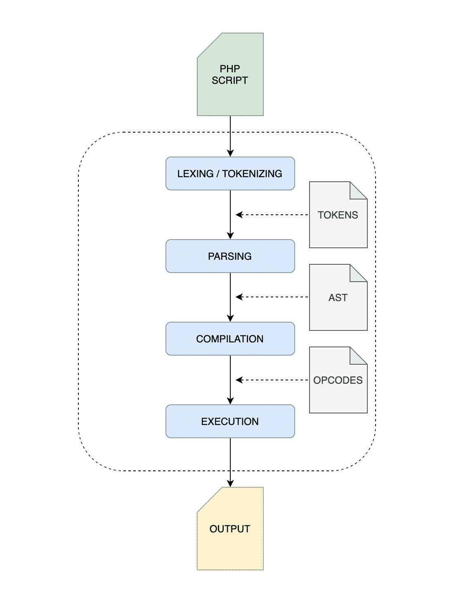
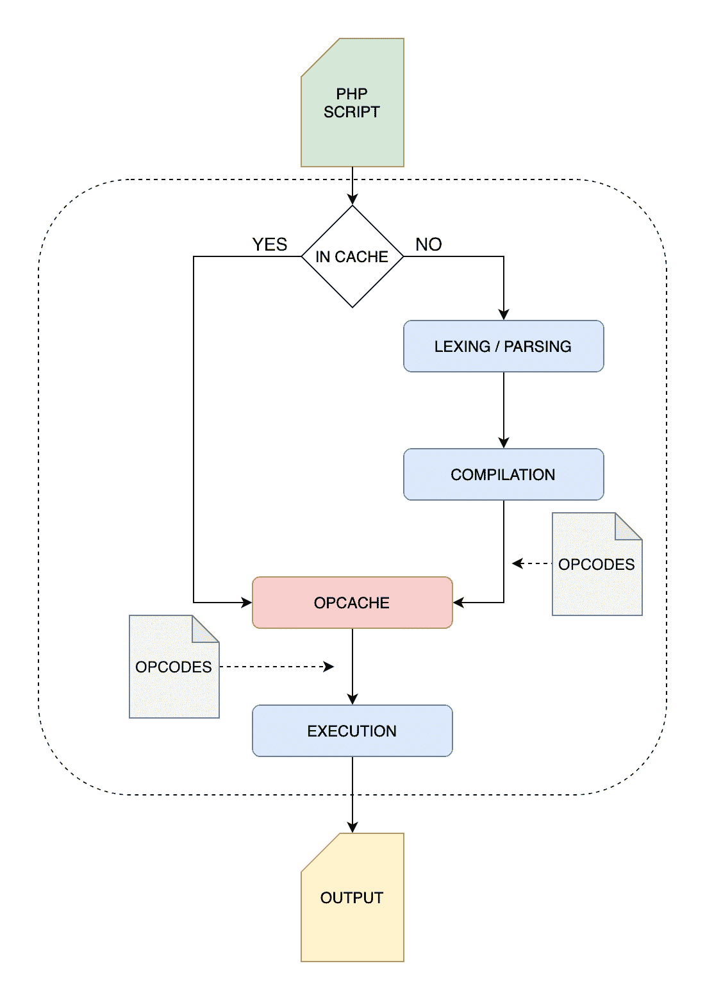

# PHP 8 的新特性(特性、改进和 JIT 编译器)

> 原文:[https://kinsta.com/blog/php-8/](https://kinsta.com/blog/php-8/)

PHP 8 已经正式发布到 2020 年 11 月 26 日全面上市！

这一新的重大更新为该语言带来了许多优化和强大的功能。我们很高兴向您介绍最有趣的变化，这些变化将允许我们编写更好的代码并构建更健壮的应用程序。


[PHP 8.0 Announcement Addendum](https://www.php.net/releases/8.0/en.php)


你准备好了吗？让我们开始吧！

## PHP JIT(实时编译器)

PHP 8 最受欢迎的特性是**实时(JIT)编译器**。JIT 到底是什么？

[RFC 建议书](https://wiki.php.net/rfc/jit)对 JIT 的描述如下:

> “PHP JIT 是作为 OPcache 的一个几乎独立的部分实现的。它可以在 PHP 编译时和运行时启用/禁用。启用时，PHP 文件的本机代码存储在 OPcache 共享内存的附加区域，op_array→opcodes[]。处理程序保存指向 JIT 代码入口点的指针。

那么，我们是怎么到 JIT 的，JIT 和 OPcache 有什么区别？


> 需要在这里大声喊出来。Kinsta 太神奇了，我用它做我的个人网站。支持是迅速和杰出的，他们的服务器是 WordPress 最快的。
> 
> <footer class="wp-block-kinsta-client-quote__footer">
> 
> 
> 
> <cite class="wp-block-kinsta-client-quote__cite">Phillip Stemann</cite></footer>

[View plans](https://kinsta.com/plans/)

为了更好地理解 PHP 的 JIT 是什么，让我们快速看一下 [PHP](https://kinsta.com/knowledgebase/what-is-php/) 如何执行源代码得到最终结果。

PHP 的执行分为 4 个阶段:

*   **词法分析/标记化**:首先，解释器读取 PHP 代码并构建一组标记。
*   **解析**:解释器检查脚本是否匹配语法规则，并使用令牌构建[抽象语法树](https://en.wikipedia.org/wiki/Abstract_syntax_tree)(AST)[源代码结构的分层表示](https://wiki.php.net/rfc/abstract_syntax_tree)。

*   **编译**:解释器遍历树，将 AST 节点翻译成低级 Zend 操作码，这是确定由 Zend VM 执行的[指令类型的数字标识符。](https://nikic.github.io/2017/04/14/PHP-7-Virtual-machine.html)
*   **解释**:操作码在 Zend VM 上被解释并运行。

下图显示了基本 PHP 执行过程的可视化表示。



Basic PHP execution process


那么，OPcache 是如何让 PHP 更快的呢？而 JIT 在执行过程中有哪些改变？

### OPcache 扩展

PHP 是一种解释型语言。这意味着，当 PHP 脚本运行时，解释器对每个请求一遍又一遍地解析、编译和执行代码。这可能导致[浪费 CPU 资源](https://phptherightway.com/#opcode_cache)和额外的时间。

这就是 [OPcache 扩展](https://www.php.net/manual/en/intro.opcache.php)发挥作用的地方:

> OPcache 通过在共享内存中存储预编译的脚本字节码来提高 PHP 性能，从而使 PHP 无需在每次请求时加载和解析脚本

启用 OPcache 后，PHP 解释器只有在脚本第一次运行时才会经历上面提到的 4 个阶段。由于 PHP 字节码存储在共享内存中，它们可以作为底层的中间表示立即使用，并且可以立即在 Zend VM 上执行。



PHP execution process with OPcache enabled


从 PHP 5.5 开始，Zend OPcache 扩展是默认可用的，你可以通过简单的[从你的服务器上的脚本调用`phpinfo()`](https://kinsta.com/knowledgebase/phpinfo/) 或者检查你的 php.ini 文件来检查你是否正确配置了它(参见 [OPcache 配置设置](https://www.php.net/manual/en/opcache.configuration.php))。

建议阅读:[如何在 WordPress](https://kinsta.com/knowledgebase/php-memory-limit/) 中提高 PHP 内存限制。


Zend OPcache section in a phpinfo page


### 预加载

OPcache 最近随着[预加载](https://wiki.php.net/rfc/preload)的实现得到了改进，这是 [PHP 7.4](https://kinsta.com/blog/php-7-4/) 增加的一个新的 OPcache 特性。预加载提供了一种在运行任何应用程序代码之前将一组指定的脚本存储到 OPcache 存储器*中的方法。*“尽管如此，它并没有为典型的基于 web 的应用程序带来切实的性能提升。

你可以在我们的 PHP 7.4 简介中阅读更多关于预加载的内容。

有了 JIT，PHP 向前迈进了一步。

### JIT——实时编译器

即使操作码是低级的中间表示，仍然要编译成机器码。JIT“没有引入任何额外的 IR(中间表示)形式”，而是使用 [DynASM](https://luajit.org/dynasm.html) (代码生成引擎的动态汇编器)直接从 PHP 字节码生成原生代码。

简而言之， **JIT 将中间代码的热部分翻译成机器码**。绕过编译，它将能够在性能和内存使用方面带来相当大的改进。

PHP JIT 提案的合著者 Zeev Surasky 展示了使用 JIT 可以加快多少计算速度:


但是，JIT 能有效地提高 WordPress 的性能吗？

### 实时 Web 应用的 JIT

根据 JIT RFC，实时编译器的实现应该可以提高 PHP 的性能。但是我们真的会在像 WordPress 这样的现实生活应用中体验到这样的改进吗？

早期测试表明，JIT 将使 CPU 密集型工作负载运行得更快。[然而，RFC 警告](https://wiki.php.net/rfc/jit#performance):

> “……就像以前的尝试一样——它目前似乎没有显著改善 WordPress 等现实生活中的应用程序(op cache . JIT = 1235 326 req/sec vs . 315 req/sec)。
> 
> 它计划提供额外的努力，改善现实生活中应用程序的 JIT，使用剖析和推测性优化。"

启用 JIT 后，代码将不会由 Zend VM 运行，而是由 CPU 本身运行，这将提高计算速度。像 [WordPress](https://kinsta.com/knowledgebase/what-is-wordpress/) 这样的网络应用也依赖于其他因素，如 [TTFB](https://kinsta.com/blog/ttfb/) 、[数据库优化](https://kinsta.com/knowledgebase/wordpress-repair-database/)、 [HTTP 请求](https://kinsta.com/learn/what-is-http2/)等。


Relative JIT contribution to PHP 8 performance (Image source: [PHP 8.0 Announcement Addendum](https://www.php.net/releases/8.0/en.php))


所以，我们不应该期望在 WordPress 和类似的应用上 PHP 的执行速度会有显著的提升。然而，JIT 可以为开发者带来几个好处。

[据尼基塔·波波夫](https://externals.io/message/103903#103927):

> “JIT 编译器的好处大致如下(如 RFC 中所述):
> 
> *   数字代码的性能显著提高。
> *   “典型”PHP web 应用程序代码的性能稍好。
> *   将更多代码从 C 转移到 PHP 的潜力，因为 PHP 现在已经足够快了。"

因此，尽管 JIT 很难给 WordPress 的性能带来巨大的改进，但它将 PHP 升级到一个新的水平，使它成为一种可以直接编写许多函数的语言。

不利的一面是更大的复杂性，这会增加维护成本、稳定性和 T2 调试成本。根据德米特里·斯托戈夫的说法:

> “JIT 非常简单，但无论如何，它增加了整个 PHP 的复杂性，新类型错误的风险以及开发和维护的成本。”

在 PHP 8 中包含 JIT 的提案以 50 比 2 的票数通过。

[PHP 8 来了！🚀请查看我们对新功能的深入了解！ 点击推文](https://twitter.com/intent/tweet?url=https%3A%2F%2Fkinsta.com%2Fblog%2Fphp-8%2F&via=kinsta&text=PHP+8+is+here%21+%F0%9F%9A%80+Check+out+our+deep+dive+into+the+new+features%21&hashtags=PHP%2Cwebdev)


## PHP 8 的改进和新特性

除了 JIT，我们可以期待 PHP 8 的许多特性和改进。下面的列表是我们精心挑选的即将到来的增加和改变，它们将使 PHP 更加可靠和高效。

### 构造函数属性提升

作为正在进行的关于在 PHP 中改进[对象人机工程学的讨论的结果，](https://hive.blog/php/@crell/improving-php-s-object-ergonomics)[构造函数属性提升 RFC](https://wiki.php.net/rfc/constructor_promotion) 提出了一种新的更简洁的语法，它将简化属性声明，使其更短、更少冗余。

该建议仅涉及**提升参数**，即那些以**公共**、**保护**和**私有**可见性关键字为前缀的方法参数。

目前，所有的属性都必须重复几次(至少四次)才能用于对象。考虑来自 RFC 的以下示例:

```
class Point {
    public int $x;
    public int $y;
    public int $z;

    public function __construct(
        int $x = 0,
        int $y = 0,
        int $z = 0,
    ) {
        $this->x = $x;
        $this->y = $y;
        $this->z = $z;
    }
}
```

根据 RFC 作者 Nikita Popov 的说法，我们必须在三个不同的地方至少写四次属性名:属性声明、构造函数参数和属性赋值。这种语法不是特别有用，尤其是在具有许多属性和更多描述性名称的类中。

这个 RFC 建议合并构造函数和参数定义。因此，从 PHP 8 开始，我们有了一种更有用的声明参数的方式。上面看到的代码可以如下所示进行更改:

```
class Point {
    public function __construct(
        public int $x = 0,
        public int $y = 0,
        public int $z = 0,
    ) {}
}
```

仅此而已。因此，我们有了一种新的方法来提升更短、更易读、更不容易出错的属性。[据尼基塔](https://phpinternals.news/53):

> 这是我们正在做的一个简单的句法转换。但是这减少了您必须为值对象编写的样板代码的数量…

属性声明被转换为我们显式声明的那些属性，我们可以使用[反射 API](https://www.php.net/manual/en/intro.reflection.php) 在执行前自省属性定义(参见[去糖](https://wiki.php.net/rfc/constructor_promotion#desugaring)):

> 反射(和其他内省机制)会观察去糖后的状态。这意味着提升的属性将以与显式声明的属性相同的方式出现，而提升的构造函数参数将以普通构造函数参数的形式出现。

```
// before desugaring
class Point {
    public function __construct(public int $x = 0) {}
}

// after desugaring
class Point {
    public int $x;

    public function __construct(int $x = 0) {
        $this->x = $x;
    }
}
```

#### 遗产

我们在结合提升参数使用继承时没有任何限制。无论如何，父类构造函数和子类构造函数之间没有特定的关系。[据尼基塔](https://phpinternals.news/53):

> 通常，我们说方法总是必须与父方法兼容。[……]但是这个规则并不适用于构造函数。因此，构造函数实际上属于一个类，父类和子类之间的构造函数不必以任何方式兼容。

这里有一个例子:

```
class Test {
    public function __construct(
        public int $x = 0
    ) {}
}

class Child extends Test {
    public function __construct(
        $x, 
        public int $y = 0,
        public int $z = 0,
    ) {
        parent::__construct($x);
    }
}
```

#### 提升的属性不允许什么

非抽象构造函数和特征中允许提升属性，但是这里有几个限制值得一提。

##### 抽象构造函数

抽象类和接口中不允许提升的属性:

```
abstract class Test {
    // Error: Abstract constructor.
    abstract public function __construct(private $x);
}

interface Test {
    // Error: Abstract constructor.
    public function __construct(private $x);
}
```

##### 可空性

最显著的约束之一与可空性有关。以前，我们使用的是不可显式为空的类型。但是如果缺省值为空，则该类型可以隐式为空。但是对于属性类型，我们没有这种隐式行为，因为提升的参数需要属性声明，并且可空类型必须显式声明。请参见 RFC 中的以下示例:

```
class Test {
    // Error: Using null default on non-nullable property
    public function __construct(public Type $prop = null) {}

    // Correct: Make the type explicitly nullable instead
    public function __construct(public ?Type $prop = null) {}
}
```

##### 可调用类型

由于 callable 不是属性的[支持的类型，我们不允许在提升的属性中使用 callable 类型:](https://kinsta.com/blog/php-7-4/#typed-properties)

```
class Test {
    // Error: Callable type not supported for properties.
    public function __construct(public callable $callback) {}
}
```

##### 不允许使用 var 关键字

只有 visibility 关键字可以用于提升的参数，因此不允许用`var`关键字声明构造函数属性(参见 RFC 中的以下示例):

```
class Test {
    // Error: "var" keyword is not supported.
    public function __construct(var $prop) {}
}
```

##### 不允许重复

我们可以在同一个类中组合提升属性和显式属性，但是属性不能声明两次:

```
class Test {
    public string $prop;
    public int $explicitProp;

    // Correct
    public function __construct(public int $promotedProp, int $arg) {
        $this->explicitProp = $arg;
    }

    // Error: Redeclaration of property.
    public function __construct(public string $prop) {}
}
```

##### 不允许变量参数

这里的原因是声明的类型不同于变量参数，变量参数实际上是一个数组:

```
class Test {
    // Error: Variadic parameter.
    public function __construct(public string ...$strings) {}
}
```

#### 进一步阅读

为了更近距离地了解建筑商地产推广，请听听尼基塔·波波夫的采访。要深入了解 PHP 中的对象人体工程学，请看[这篇文章](https://hive.blog/php/@crell/improving-php-s-object-ergonomics)和下面的[对拉里·加菲尔德的采访](https://phpinternals.news/51)。

### 抽象特征方法的验证

[Traits](https://www.php.net/manual/en/language.oop5.traits.php) 被定义为“PHP 等单一继承语言中的代码重用机制。”通常，它们用于声明可在多个类中使用的方法。

特征也可以包含抽象方法。这些方法只是声明方法的签名，但是方法的实现必须在使用 trait 的类中完成。

根据 [PHP 手册](https://www.php.net/manual/en/language.oop5.traits.php#language.oop5.traits.abstract)，

> "特征支持使用抽象方法，以便对展示类施加要求."

这也意味着方法的签名必须匹配。换句话说，所需参数的类型和数量需要相同。

总之，[根据 RFC 的作者尼基塔·波波夫](https://externals.io/message/108065#108164)的说法，签名验证目前只是断断续续地实施:

> *   In most cases, it is not mandatory, and the method implementation is provided by the usage class:
> *   If the implementation comes from the parent class, force:
> *   If the implementation comes from a subclass, force:

Nikita 的以下示例与第一种情况有关(非强制签名):

```
trait T {
	abstract public function test(int $x);
}

class C {
	use T;

	// Allowed, but shouldn't be due to invalid type.
	public function test(string $x) {}
}
```

也就是说，[这个 RFC](https://wiki.php.net/rfc/abstract_trait_method_validation) 建议，如果实现方法与抽象特征方法不兼容，无论其来源如何，总是抛出致命错误:

```
Fatal error: Declaration of C::test(string $x) must be compatible with T::test(int $x) in /path/to/your/test.php on line 10
```

此 RFC 已获得一致批准。

### 不兼容的方法签名

在 PHP 中，由于不兼容的方法签名导致的继承错误要么抛出致命错误，要么抛出警告，这取决于导致错误的原因。

如果一个类正在实现一个接口，不兼容的方法签名将引发致命错误。根据[对象接口文档](https://www.php.net/manual/en/language.oop5.interfaces.php):

> 实现接口的类必须使用与 LSP (Liskov 替换原则)兼容的方法签名。否则将导致致命错误。

下面是一个接口的[继承错误的例子:](https://wiki.php.net/rfc/lsp_errors)

```
interface I {
	public function method(array $a);
}
class C implements I {
	public function method(int $a) {}
}
```

在 PHP 7.4 中，上面的代码会抛出以下错误:

```
Fatal error: Declaration of C::method(int $a) must be compatible with I::method(array $a) in /path/to/your/test.php on line 7
```

具有不兼容签名的子类中的函数将抛出警告。请参见来自 RFC 的以下代码:

```
class C1 {
	public function method(array $a) {}
}
class C2 extends C1 {
	public function method(int $a) {}
}
```

在 PHP 7.4 中，上面的代码只会抛出一个警告:

```
Warning: Declaration of C2::method(int $a) should be compatible with C1::method(array $a) in /path/to/your/test.php on line 7
```

现在，[这个 RFC](https://wiki.php.net/rfc/lsp_errors) 建议对于不兼容的方法签名总是抛出一个致命错误。对于 PHP 8，我们前面看到的代码会提示如下:

```
Fatal error: Declaration of C2::method(int $a) must be compatible with C1::method(array $a) in /path/to/your/test.php on line 7
```

### 从负索引开始的数组

在 PHP 中，如果一个数组以一个负的索引(`start_index < 0`)开始，后面的索引将从 0 开始(在 [`array_fill`文档](https://www.php.net/manual/en/function.array-fill.php)中有更多关于这个的内容)。请看下面的例子:

```
$a = array_fill(-5, 4, true);
var_dump($a);
```

在 PHP 7.4 中，结果如下:

```
array(4) {
	[-5]=>
	bool(true)
	[0]=>
	bool(true)
	[1]=>
	bool(true)
	[2]=>
	bool(true)
}
```

现在，[这个 RFC](https://wiki.php.net/rfc/negative_array_index) 提议改变事情，这样第二个索引将是`start_index + 1`，无论`start_index`的值是什么。

在 PHP 8 中，上面的代码会产生下面的数组:

```
array(4) {
	[-5]=>
	bool(true)
	[-4]=>
	bool(true)
	[-3]=>
	bool(true)
	[-2]=>
	bool(true)
}
```

在 PHP 8 中，以负索引开始的数组会改变它们的行为。在 RFC 中阅读更多关于向后不兼容的内容。

### 联合类型 2.0

[联合类型](https://en.wikipedia.org/wiki/Union_type)接受不同类型的值。目前，PHP 不支持联合类型，除了`?Type`语法和特殊的`iterable`类型。

在 PHP 8 之前，联合类型只能在 phpdoc 注释中指定[，如 RFC 中的以下示例所示:](https://docs.phpdoc.org/latest/guides/types.html#multiple-types-combined)

```
class Number {
	/**
	 * @var int|float $number
	 */
	private $number;

	/**
	 * @param int|float $number
	 */
	public function setNumber($number) {
		$this->number = $number;
	}

	/**
	 * @return int|float
	 */
	public function getNumber() {
		return $this->number;
	}
}
```

现在，[Union types 2.0 RFC](https://wiki.php.net/rfc/union_types_v2)提议在函数签名中增加对联合类型的支持，这样我们就不再依赖[内联文档](https://docs.phpdoc.org/latest/guide/getting-started/your-first-set-of-documentation.html)，而是用`T1|T2|...`语法定义联合类型:

```
class Number {
	private int|float $number;

	public function setNumber(int|float $number): void {
		$this->number = $number;
	}

	public function getNumber(): int|float {
		return $this->number;
	}
}
```

正如尼基塔·波波夫在 RFC 中解释的那样，

> “语言中对联合类型的支持允许我们将更多的类型信息从 phpdoc 转移到函数签名中，这通常会带来以下好处:
> 
> *   类型实际上是强制执行的，因此可以及早发现错误。
> *   因为它们是强制的，所以类型信息不太可能变得过时或错过边缘情况。
> *   在继承过程中检查类型，执行 Liskov 替换原则。
> *   通过反射可以获得类型。
> *   语法比 phpdoc 少了很多样板。"

联合类型支持所有可用的类型，但有一些限制:

*   类型`void`不能是联合的一部分，因为`void`意味着函数[不返回任何值](https://wiki.php.net/rfc/void_return_type)。
*   `null`类型仅在联合类型中受支持，但不允许将其用作独立类型。
*   可空类型符号(`?T`)也是允许的，意思是`T|null`，但是我们不允许在联合类型中包含`?T`符号(`?T1|T2`是不允许的，我们应该使用`T1|T2|null`)。
*   尽可能多的功能(即`strpos()`、`strstr()`、`substr()`等)。)在可能的返回类型中包含`false`，也支持`false`伪类型。

你可以在 RFC 中阅读更多关于联盟类型 V2 的信息。

### 内部函数的一致类型错误

当传递非法类型的参数时，[内部](https://www.php.net/manual/en/functions.internal.php)和[用户自定义](https://www.php.net/manual/en/functions.user-defined.php)函数表现不同。

用户定义的函数抛出一个`TypeError`，但是内部函数有不同的行为方式，这取决于几个条件。反正典型的行为就是抛出警告返回`null`。请参见 PHP 7.4 中的以下示例:

```
var_dump(strlen(new stdClass));
```

这将导致以下警告:

```
Warning: strlen() expects parameter 1 to be string, object given in /path/to/your/test.php on line 4
NULL
```

如果启用了`strict_types`,或者参数信息指定了类型，那么行为会有所不同。在这种情况下，类型错误被检测到并导致一个`TypeError`。

这种情况会导致许多问题，这些问题在 [RFC 的问题章节](https://wiki.php.net/rfc/consistent_type_errors#issues)中有很好的解释。

为了消除这些不一致，[这个 RFC 建议](https://wiki.php.net/rfc/consistent_type_errors)让内部参数解析 API 在参数类型不匹配的情况下总是生成一个`ThrowError`。

在 PHP 8 中，上面的代码抛出以下错误:

```
Fatal error: Uncaught TypeError: strlen(): Argument #1 ($str) must be of type string, object given in /path/to/your/test.php:4
Stack trace:
#0 {main}
  thrown in /path/to/your/test.php on line 4
```

### 抛出表达式

在 PHP 中，`throw`是一个[语句](https://www.php.net/manual/en/control-structures.intro.php)，所以不可能在只允许使用[表达式](https://www.php.net/manual/en/language.expressions.php)的地方使用它。

## 注册订阅时事通讯


### 想知道我们是怎么让流量增长超过 1000%的吗？

加入 20，000 多名获得我们每周时事通讯和内部消息的人的行列吧！

[Subscribe Now](#newsletter)

[这个 RFC](https://wiki.php.net/rfc/throw_expression) 提出将 [`throw`语句](https://www.php.net/manual/en/language.exceptions.php)转换成一个表达式，这样它就可以在任何允许表达式的上下文中使用。比如[箭头函数](https://kinsta.com/blog/php-7-4/#arrow-functions)、 [null coalesce 运算符](https://wiki.php.net/rfc/isset_ternary)、[三元和 elvis 运算符](https://www.php.net/manual/en/language.operators.comparison.php#language.operators.comparison.ternary)等。

参见 RFC 中的以下示例:

```
$callable = fn() => throw new Exception();

// $value is non-nullable.
$value = $nullableValue ?? throw new InvalidArgumentException();

// $value is truthy.
$value = $falsableValue ?: throw new InvalidArgumentException();
```

### 弱映射

弱映射是数据(对象)的集合，其中键被弱引用，这意味着它们不会被阻止进行垃圾收集。

PHP 7.4 增加了对[弱引用](https://kinsta.com/blog/php-7-4/#weakreferences)的支持，这是一种保留对象引用的方式，不会阻止对象本身被销毁。正如尼基塔·波波夫指出的那样，

> 原始弱引用本身只有有限的用处，而弱映射在实践中更常用。不可能在 PHP 弱引用之上实现有效的弱映射，因为没有提供注册销毁回调的能力。

这就是为什么[这个 RFC](https://wiki.php.net/rfc/weak_maps) 引入了一个`WeakMap`类来创建用作弱映射键的对象，如果没有任何对键对象的进一步引用，这些对象可以被销毁并从弱映射中删除。

在长时间运行的流程中，这将防止内存泄漏并提高性能。请参见 RFC 中的以下示例:

```
$map = new WeakMap;
$obj = new stdClass;
$map[$obj] = 42;
var_dump($map);
```

使用 PHP 8，上面的代码会产生以下结果(参见[这里的代码运行](https://3v4l.org/o6lZX/rfc#output)):

```
object(WeakMap)#1 (1) {
	[0]=>
	array(2) {
		["key"]=>
		object(stdClass)#2 (0) {
		}
		["value"]=>
		int(42)
	}
}
```

如果取消设置对象，该键将自动从弱贴图中移除:

```
unset($obj);
var_dump($map);
```

现在，结果将如下:

```
object(WeakMap)#1 (0) {
}
```

要更仔细地查看弱映射，请参见 RFC 。这项提议被一致通过。

### 参数列表中的尾随逗号

尾随逗号是附加到不同上下文中的项目列表的逗号。PHP 7.2 在列表语法中引入了[尾随逗号，PHP 7.3 在函数调用](https://kinsta.com/blog/php-7-2/#trailing-commas-in-list-syntax)中引入了[尾随逗号。](https://kinsta.com/blog/php-7-3/#trailing-comma-in-function-calls)

PHP 8 现在在函数、方法和闭包的参数列表中引入了尾随逗号[，如下例所示:](https://wiki.php.net/rfc/trailing_comma_in_parameter_list)

```
class Foo {
	public function __construct(
		string $x,
		int $y,
		float $z, // trailing comma
	) {
		// do something
	}
}
```

这项提案以 58 票对 1 票获得通过。

### 对象上的 Allow ::class 语法

要获取类名，我们可以使用`Foo\Bar::class`语法。[这个 RFC](https://wiki.php.net/rfc/class_name_literal_on_object) 提议将相同的语法扩展到对象，这样现在就可以获取给定对象的类名，如下例所示:

```
$object = new stdClass;
var_dump($object::class); // "stdClass"

$object = null;
var_dump($object::class); // TypeError
```

在 PHP 8 中，`$object::class`提供与`get_class($object)`相同的结果。如果`$object`不是一个对象，它抛出一个`TypeError`异常。

这项提议获得一致通过。

### 属性 v2

属性也称为注释，是结构化的元数据，可用于指定对象、元素或文件的属性。

在 PHP 7.4 之前，文档注释是向类、函数等声明中添加元数据的唯一方式。Attributes v2 RFC 引入了 PHP 属性，将它们定义为一种结构化的语法元数据，可以添加到类、属性、函数、方法、参数和常量的声明中。

属性被添加到它们所引用的声明之前。参见 RFC 中的以下示例:

```
<<ExampleAttribute>>
class Foo
{
	<<ExampleAttribute>>
	public const FOO = 'foo';

	<<ExampleAttribute>>
	public $x;

	<<ExampleAttribute>>
	public function foo(<<ExampleAttribute>> $bar) { }
}

$object = new <<ExampleAttribute>> class () { };

<<ExampleAttribute>>
function f1() { }

$f2 = <<ExampleAttribute>> function () { };

$f3 = <<ExampleAttribute>> fn () => 1;
```

可以在 doc-block 注释之前或之后添加属性:

```
<<ExampleAttribute>>
/** docblock */
<<AnotherExampleAttribute>>
function foo() {}
```

每个声明可以有一个或多个属性，每个属性可以有一个或多个关联值:

```
<<WithoutArgument>>
<<SingleArgument(0)>>
<<FewArguments('Hello', 'World')>>
function foo() {}
```

参见 [RFC](https://wiki.php.net/rfc/attributes_v2) 以获得 PHP 属性、用例以及替代语法的更深入的概述。

### 命名参数

[命名参数](https://wiki.php.net/rfc/named_params)提供了一种在 PHP 中将参数传递给函数的新方法:

> 命名参数允许根据参数名而不是参数位置向函数传递参数。

我们可以通过简单地在参数值前添加参数名来将命名参数传递给函数:

```
callFunction(name: $value);
```

我们也可以使用保留关键字，如下例所示:

```
callFunction(array: $value);
```

但是我们不允许动态传递参数名。参数必须是标识符，并且**不允许使用以下语法**:

```
callFunction($name: $value);
```

根据 RFC 的作者尼基塔·波波夫(Nikita Popov)的说法，命名论证有几个优点。

首先，命名参数将帮助我们编写更容易理解的代码，因为它们的含义是不言自明的。RFC 中的以下示例不言自明:

```
array_fill(start_index: 0, num: 100, value: 50);
```

命名参数与顺序无关。这意味着我们不必按照与函数签名相同的顺序向函数传递参数:

需要一个非常快速、安全、开发者友好的网站托管吗？Kinsta 是为 WordPress 开发者设计的，提供了大量的工具和强大的仪表板。[查看我们的计划](https://kinsta.com/plans/?in-article-cta)

```
array_fill(value: 50, num: 100, start_index: 0);
```

还可以将命名参数与位置参数结合起来:

```
htmlspecialchars($string, double_encode: false);
```

命名参数的另一个很大的优点是，它们允许只指定那些我们想要改变的参数。如果我们不想覆盖默认值，就不必指定默认参数。来自 RFC 的以下示例说明了这一点:

```
htmlspecialchars($string, default, default, false);
// vs
htmlspecialchars($string, double_encode: false);
```


### 重要的

如果你是一个 [WordPress 开发者](https://kinsta.com/blog/hire-wordpress-developer/)，请注意在撰写本文时，命名参数可能会导致[向后兼容问题](https://kinsta.com/blog/wordpress-5-6/#named-parameters)。没有经过深思熟虑的测试，不要在生产中使用它们。


命名参数可以与 [PHP 属性](#attributes)一起使用，如 RFC 的以下示例所示:

```
<<MyAttribute('A', b: 'B')>>
class Test {}
```

但是，不允许在命名参数后传递位置参数，这将导致编译时错误。当您两次传递相同的参数名时，也会发生同样的情况。

命名参数在类声明中很方便，因为构造函数通常有许多参数，命名参数提供了一种更“符合人体工程学”的方法来声明类。

关于命名参数、约束、向后不兼容性和几个例子的更详细的视图，请参见[命名参数 RFC](https://wiki.php.net/rfc/named_params) 。

### 空安全运算符

[这个 RFC](https://wiki.php.net/rfc/nullsafe_operator) 引入了具有完全[短路评估](https://en.wikipedia.org/wiki/Short-circuit_evaluation)的空安全操作符`$->`。

在短路评估中，只有当第一个操作符没有评估到`null`时，才评估第二个操作符。如果一个链中的一个操作符评估为`null`，整个链的执行停止并评估为`null`。

考虑来自 RFC 的以下示例:

```
$foo = $a?->b();
```

如果`$a`为空，则不调用方法`b()`，并将`$foo`设置为`null`。

参见 [nullsafe 操作符 RFC](https://wiki.php.net/rfc/nullsafe_operator) ,了解更多示例、异常和未来范围。

### 比较字符串和数字

在以前的 PHP 版本中，当在字符串和数字之间进行非严格比较时，PHP 首先将字符串转换为数字，然后执行整数或浮点数之间的比较。即使这种行为在某些情况下非常有用，它也可能产生错误的结果，从而导致错误和/或安全问题。

考虑来自 RFC 的以下示例:

```
$validValues = ["foo", "bar", "baz"];
$value = 0;
var_dump(in_array($value, $validValues));
// bool(true)
```

PHP 8 引入了[更合理的字符串到数字的比较](https://wiki.php.net/rfc/string_to_number_comparison)，旨在使字符串到数字的比较更加合理。用尼基塔·波波夫的话说，

> 这个 RFC 旨在给字符串与数字的比较一个更合理的行为:当与数字字符串比较时，使用数字比较(和现在一样)。否则，将数字转换为字符串，并使用字符串比较。

下表比较了 PHP 早期版本和 PHP 8 中字符串与数字比较的行为:

```
Comparison    | Before | After
------------------------------
 0 == "0"     | true   | true
 0 == "0.0"   | true   | true
 0 == "foo"   | true   | false
 0 == ""      | true   | false
42 == "   42" | true   | true
42 == "42foo" | true   | false
```

在尼基塔·波波夫的官方 [RFC 中，阅读更多关于这一变化的含义以及 PHP 8 中字符串和数字比较的变化。](https://wiki.php.net/rfc/string_to_number_comparison)

### Saner 数字字符串

在 PHP 中，包含数字的字符串分为三类:

*   **数字字符串**:包含一个数字的字符串，前面可以有空格。
*   **前导数字串**:起始字符为数字串，尾随字符为非数字串。
*   **非数字字符串**:不属于上述两个类别的字符串。

根据所执行的操作，数字字符串和前导数字字符串的处理方式不同。例如:

*   **显式字符串到数字的转换**(即`(int)`和`(float)`类型转换)转换数字和前导数字字符串。将非数字字符串显式转换为数字会产生 0。
*   **隐式字符串到数字的转换**(即没有`strict_type`声明)导致数字和非数字字符串的结果不同。非数字字符串到数字的转换抛出一个`TypeError`。
*   `is_numeric()`仅对数字字符串返回**真**。

字符串偏移量、算术运算、递增和递减运算、字符串之间的比较以及按位运算也会导致不同的结果。

[本 RFC](https://wiki.php.net/rfc/saner-numeric-strings) 提议:

> 将各种数字字符串模式统一到一个概念中:数字字符只允许有前导和尾随空格。任何其他类型的字符串都是非数字的，在数字上下文中使用时会引发 TypeErrors。

> 这意味着，所有当前发出 **E_NOTICE** “遇到格式不正确的数值”的字符串将被重新分类到 **E_WARNING** “遇到非数值”中，除非前导数字字符串仅包含尾随空格。并且当前发出 **E_WARNING** 的各种情况将被提升到`TypeError` s。

关于 PHP 8 中数字字符串的更深入的概述，包括代码示例、异常和向后兼容性问题，请参见 [RFC](https://wiki.php.net/rfc/saner-numeric-strings) 。

### 匹配表达式 v2

新的`match`表达式与`switch`非常相似，但是具有更安全的语义并允许返回值。

为了理解这两种控制结构之间的区别，考虑下面来自 [RFC](https://wiki.php.net/rfc/match_expression_v2) 的`switch`示例:

```
switch (1) {
	case 0:
		$result = 'Foo';
		break;
	case 1:
		$result = 'Bar';
		break;
	case 2:
		$result = 'Baz';
		break;
}

echo $result;
//> Bar
```

我们现在可以用下面的`match`表达式得到与上面代码相同的结果:

```
echo match (1) {
	0 => 'Foo',
	1 => 'Bar',
	2 => 'Baz',
};
//> Bar
```

使用新的`match`表达式的一个显著优点是，虽然`switch`松散地比较值(`==`)可能会导致意想不到的结果，但是使用`match`进行比较是一种身份检查(`===`)。

`match`表达式也可以包含多个逗号分隔的表达式，以允许更简洁的语法([来源](https://www.php.net/manual/en/control-structures.match.php)):

```
$result = match ($x) {
	// This match arm:
	$a, $b, $c => 5,
	// Is equivalent to these three match arms:
	$a => 5,
	$b => 5,
	$c => 5,
};
```

如需更多使用示例和案例，请参见[匹配表达式 v2 RFC](https://wiki.php.net/rfc/match_expression_v2) 和 [PHP 文档](https://www.php.net/manual/en/control-structures.match.php)。

### 算术/按位运算符的更严格的类型检查

在以前的 PHP 版本中，允许对数组、资源或非重载对象应用[算术](https://www.php.net/manual/en/language.operators.arithmetic.php)和[按位](https://www.php.net/manual/en/language.operators.bitwise.php)运算符。无论如何，行为有时是不一致的。

在这个 RFC 中，尼基塔·波波夫用一个简单的例子展示了这种行为是多么不合理:

```
var_dump([] % [42]);
// int(0)
```

Nikita 解释了如何将算术或按位运算符应用于数组、资源或非重载对象[会导致不同的结果](https://wiki.php.net/rfc/arithmetic_operator_type_checks#current_behavior):

> 运算符+、-、*、/、**:
> 
> *   对数组操作数抛出错误异常。(如果两个操作数都是数组，则不包括+。)
> *   静默地将资源操作数转换为整数形式的资源 ID。
> *   将一个对象操作数转换为整数 1，同时抛出一个通知。
> 
> 运算符%，<>，&，|，^:
> 
> *   如果为空，则静默地将数组操作数转换为整数零，如果为非空，则转换为整数一。
> *   静默地将资源操作数转换为整数形式的资源 ID。
> *   将一个对象操作数转换为整数 1，同时抛出一个通知。
> 
> 操作员~:
> 
> *   引发数组、资源和对象操作数的错误异常。
> 
> 运算符++和-:
> 
> *   如果操作数是数组、资源或对象，则不执行任何操作。

在 PHP 8 中，事情发生了变化，所有算术和位运算符的行为都是一样的:

**为数组、资源和对象操作数抛出一个`TypeError`异常。【T2
**

## 新的 PHP 函数

PHP 8 为该语言带来了几个新功能:

### str _ 包含

在 PHP 8 之前， [strstr](https://www.php.net/manual/en/function.strstr.php) 和 [strpos](https://www.php.net/manual/en/function.strpos.php) 是[开发者](https://kinsta.com/blog/hire-wordpress-developer/)在给定字符串中搜索指针的典型选项。问题是这两个函数都不太直观，它们的用法可能会让新的 PHP 开发人员感到困惑。请参见以下示例:

```
$mystring = 'Managed WordPress Hosting';
$findme = 'WordPress';
$pos = strpos($mystring, $findme);

if ($pos !== false) {
	echo "The string has been found";
} else {
	echo "String not found";
}
```

在上面的例子中，我们使用了`!==`比较操作符，它检查两个值是否属于同一类型。这防止我们在指针位置为 0 时得到错误[:](https://www.php.net/manual/en/function.strpos.php#refsect1-function.strpos-returnvalues)

> 该函数可能返回布尔值**假**，但也可能返回评估为**假**的非布尔值。[…]使用===运算符测试此函数的返回值。

此外，一些框架提供了助手函数来搜索给定字符串中的值(例如，参见 [Laravel 助手文档](https://laravel.com/docs/7.x/helpers#method-str-contains))。

现在，[这个 RFC](https://wiki.php.net/rfc/str_contains) 提议引入一个新的函数，允许在字符串内部进行搜索:`str_contains`。

```
str_contains ( string $haystack , string $needle ) : bool
```

它的用法非常简单。`str_contains`检查`$needle`是否在`$haystack`中找到，并相应返回`true`或`false`。

所以，多亏了`str_contains`，我们可以编写以下代码:

```
$mystring = 'Managed WordPress Hosting';
$findme   = 'WordPress';

if (str_contains($mystring, $findme)) {
	echo "The string has been found";
} else {
	echo "String not found";
}
```

这样可读性更好，也不容易出错(见这里中的这段代码)。
在撰写本文时，`str_contains`区分大小写，但将来可能会改变。

提案以 43 票对 9 票通过。

### str_starts_with()和 str_ends_with()

除了`str_contains`函数之外，两个新的函数允许在给定的字符串中搜索针:`str_starts_with`和`str_ends_with`。

[这些新函数](https://wiki.php.net/rfc/add_str_starts_with_and_ends_with_functions)检查一个给定的字符串是以另一个字符串开始还是结束:

```
str_starts_with (string $haystack , string $needle) : bool
str_ends_with (string $haystack , string $needle) : bool
```

如果`$needle`比`$haystack`长，两个函数都返回`false`。

根据 RFC 的作者威尔·哈金斯的说法，

> “对`str_starts_with`和`str_ends_with`功能的需求如此普遍，以至于许多[主流 PHP 框架](https://kinsta.com/blog/php-frameworks/)都支持它，包括 [Symfony](https://symfony.com/doc/5.0/components/string.html#methods-to-search-and-replace) 、 [Laravel](https://laravel.com/docs/7.x/helpers#method-starts-with) 、 [Yii](https://www.yiiframework.com/doc/api/2.0/yii-helpers-basestringhelper#startsWith()-detail) 、 [FuelPHP](https://fuelphp.com/docs/classes/str.html#/method_starts_with) 和 [Phalcon](https://docs.phalcon.io/3.4/en/api/phalcon_text) 。”

多亏了它们，我们现在可以避免使用次优和不太直观的函数，比如`substr`、`strpos`。两个函数都区分大小写:

```
$str = "WordPress";
if (str_starts_with($str, "Word")) echo "Found!";

if (str_starts_with($str, "word")) echo "Not found!";
```

你可以在这里看到这段代码的运行[。](https://3v4l.org/kBcjZ/rfc#output)

该 RFC 以 51 票对 4 票获得批准。

### 获取调试类型

`get_debug_type`是一个新的 PHP 函数，它返回变量的类型。新函数的工作方式与 [`gettype`函数](https://www.php.net/manual/en/function.gettype.php)非常相似，但是`get_debug_type`返回本机类型名并解析类名。

这对语言来说是一个很好的改进，因为`gettype()`对类型检查没有用。

RFC 提供了两个有用的例子来理解新的`get_debug_type()`函数和`gettype()`函数之间的区别。第一个例子显示了`gettype`在起作用:

```
$bar = [1,2,3];

if (!($bar instanceof Foo)) { 
	throw new TypeError('Expected ' . Foo::class . ', got ' . (is_object($bar) ? get_class($bar) : gettype($bar)));
}
```

在 PHP 8 中，我们可以使用`get_debug_type`来代替:

```
if (!($bar instanceof Foo)) { 
	throw new TypeError('Expected ' . Foo::class . ' got ' . get_debug_type($bar));
}
```

下表显示了`get_debug_type`和`gettype`的返回值:

| 价值 | gettype() | get_debug_type() |
| --- | --- | --- |
| one | 整数 | （同 Internationalorganizations）国际组织 |
| Zero point one | 两倍 | 漂浮物 |
| 真实的 | 布尔型 | 弯曲件 |
| 错误的 | 布尔型 | 弯曲件 |
| 空 | 空 | 空 |
| " WordPress " | 线 | 线 |
| [1,2,3] | 排列 | 排列 |
| 名为“Foo\Bar”的类 | 目标 | 阿宽 |
| 匿名班级 | 目标 | [【电子邮件保护】](/cdn-cgi/l/email-protection) |

## 附加 RFC

下面是 PHP 8 中额外批准的改进的快速列表:

1.  **Stringable 接口** : [这个 RFC](https://wiki.php.net/rfc/stringable) 引入了一个 Stringable 接口，它被自动添加到实现 [`__to String()`方法](https://www.php.net/manual/en/language.oop5.magic.php#object.tostring)的类中。这里的主要目标是使用`string|Stringable`联合类型。
2.  **ext/DOM 中新的 DOM live Standard API**:[这个 RFC](https://wiki.php.net/rfc/dom_living_standard_api) 提出通过引入新的接口和公共属性来实现当前的[DOM live Standard](https://dom.spec.whatwg.org/)到 [PHP DOM 扩展](https://www.php.net/manual/en/intro.dom.php)。
3.  **静态返回类型** : PHP 8 在`self`和`parent`类型旁边介绍了`static`作为返回类型的用法。
4.  **变量语法调整** : [这个 RFC](https://wiki.php.net/rfc/variable_syntax_tweaks) 解决了 PHP 变量语法中一些残留的不一致。

## PHP 8 性能基准

如果你想知道 PHP 8 有多快，我们有答案。我们[在 7 个不同的 PHP 版本(5.6、7.0、7.1、7.2、7.3 和 8.0)上对 20 个 PHP 平台/配置](https://kinsta.com/blog/php-benchmarks/)进行了基准测试。

PHP 8.0 在大多数支持它的平台上脱颖而出，包括 WordPress 和 Laravel。


Compiled PHP benchmarks of the top platforms


例如，PHP 8.0 上的 WordPress 每秒可以处理比 PHP 7.4 多 18.4%的请求。同样，PHP 8.0 上的 Laravel 每秒可以比 PHP 7.3 多运行 **8.5%** 个请求。

如果你的网站或应用完全兼容 PHP 8.0，你应该计划[尽快将你的服务器环境更新到 PHP 8.0](https://kinsta.com/feature-updates/php-8/) 。您(和您的用户)一定会欣赏它的性能优势。但是，请在更新前彻底测试您的网站。

您可以阅读我们的 [PHP 基准测试文章](https://kinsta.com/blog/php-benchmarks/)以获得更多信息，例如详细的性能数据、见解和漂亮的图表！

[PHP 8 has been released to the GA and brings lots of optimizations and features to the language. 🚀 Check out our deep dive into PHP 8!Click to Tweet](https://twitter.com/intent/tweet?url=https%3A%2F%2Fkinsta.com%2Fblog%2Fphp-8%2F&via=kinsta&text=PHP+8+has+been+released+to+the+GA+and+brings+lots+of+optimizations+and+features+to+the+language.+%F0%9F%9A%80+Check+out+our+deep+dive+into+PHP+8%21&hashtags=PHP%2Cwebdev)

## 摘要

多好的旅程啊！在这篇文章中，我们介绍了 PHP 8 最有趣的优化和特性。最令人期待的当然是即时编译器，但是 PHP 8 还有更多。

请确保将这篇博客文章加入书签，以供将来参考。🤓

现在轮到你了:你准备好测试新的 PHP 特性了吗？你最喜欢哪一个？在下面的评论栏里写一行。

* * *

让你所有的[应用程序](https://kinsta.com/application-hosting/)、[数据库](https://kinsta.com/database-hosting/)和 [WordPress 网站](https://kinsta.com/wordpress-hosting/)在线并在一个屋檐下。我们功能丰富的高性能云平台包括:

*   在 MyKinsta 仪表盘中轻松设置和管理
*   24/7 专家支持
*   最好的谷歌云平台硬件和网络，由 Kubernetes 提供最大的可扩展性
*   面向速度和安全性的企业级 Cloudflare 集成
*   全球受众覆盖全球多达 35 个数据中心和 275 多个 pop

在第一个月使用托管的[应用程序或托管](https://kinsta.com/application-hosting/)的[数据库，您可以享受 20 美元的优惠，亲自测试一下。探索我们的](https://kinsta.com/database-hosting/)[计划](https://kinsta.com/plans/)或[与销售人员交谈](https://kinsta.com/contact-us/)以找到最适合您的方式。