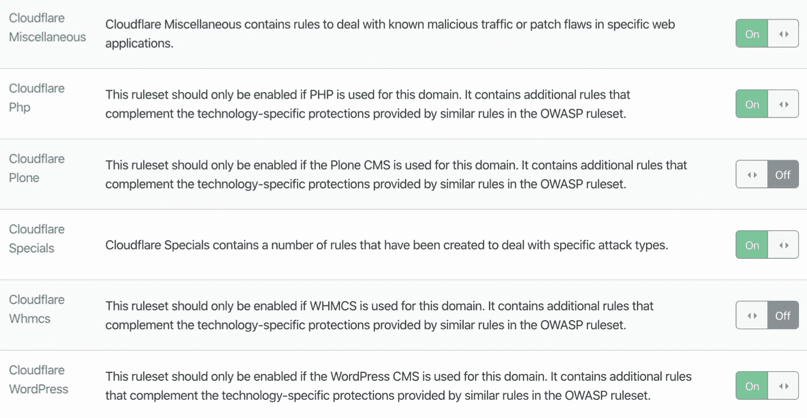
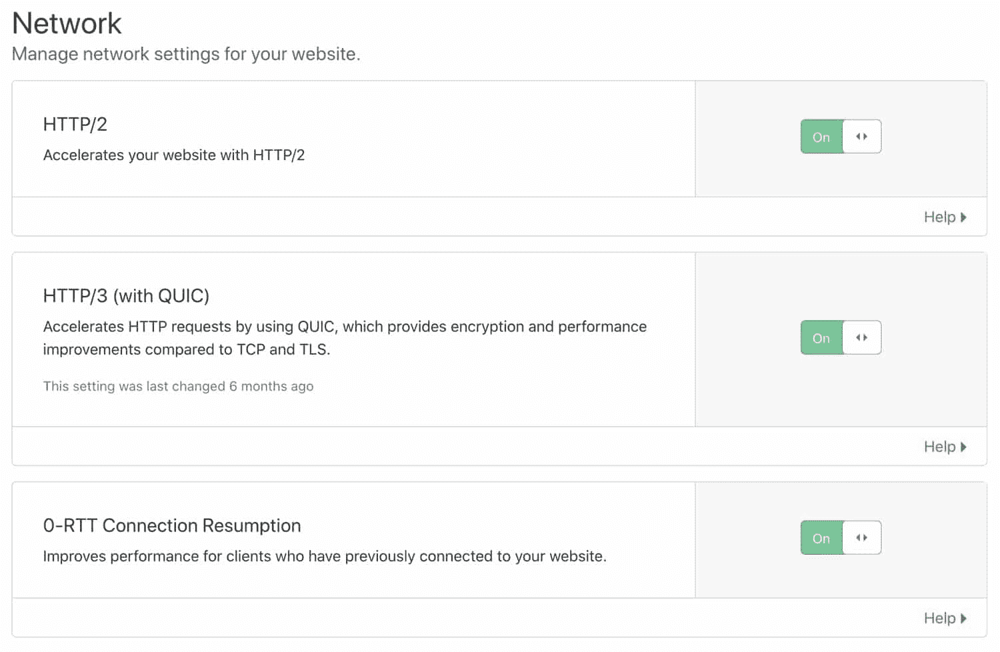
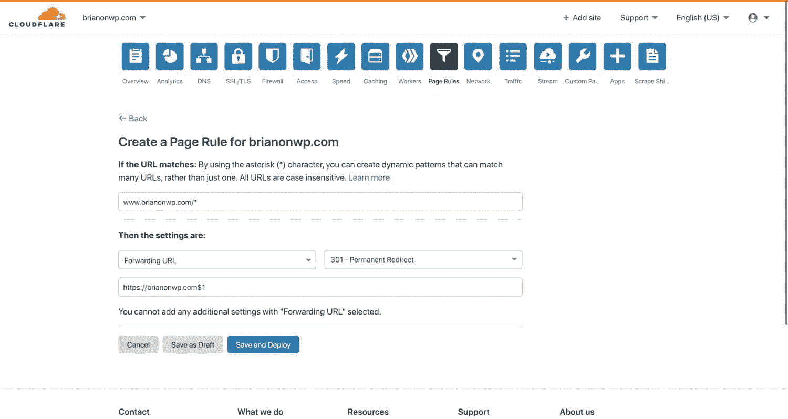
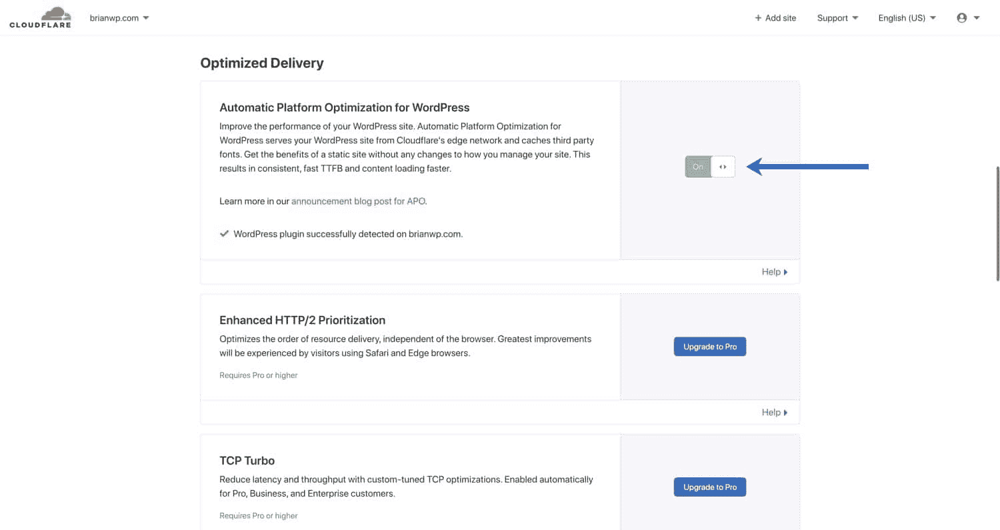
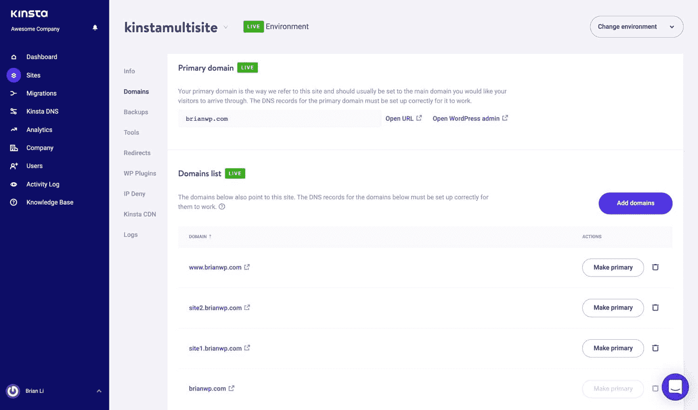
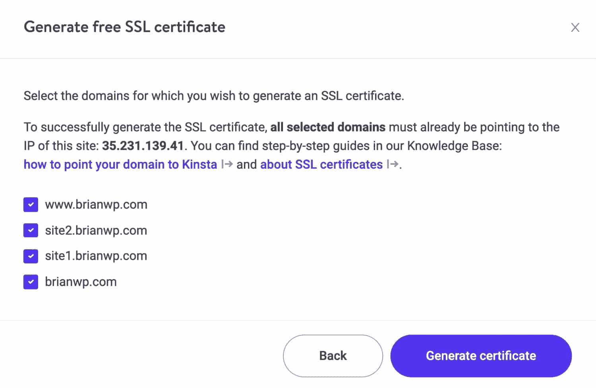
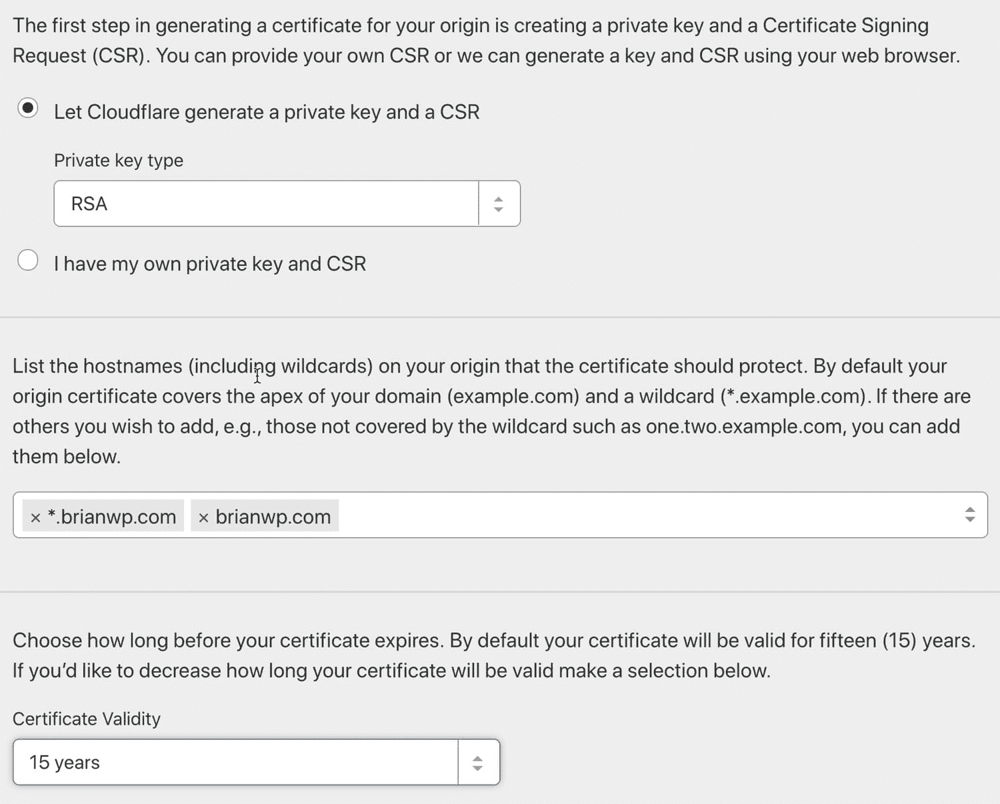

# 如何为 WordPress 配置 Cloudflare 设置

> 原文:[https://kinsta.com/blog/cloudflare-settings-wordpress/](https://kinsta.com/blog/cloudflare-settings-wordpress/)

通过在您的网站前充当[反向代理](https://kinsta.com/blog/reverse-proxy/)，Cloudflare 是一款集安全性和性能于一体的产品，被全球超过 12%的网站所使用。作为一名 WordPress 用户，[在你的网站上添加 cloud flare](https://kinsta.com/knowledgebase/install-cloudflare/)可以帮助提升网站性能，减少恶意机器人和黑客的影响。

怎么会？

正确配置后，对您站点的所有请求将首先到达 Cloudflare 服务器，然后该服务器将确定是将请求转发到原始服务器、从缓存提供服务、阻止还是使用自定义规则进行处理。

在本指南中，我们将深入探讨 WordPress 的[最佳 Cloudflare](https://kinsta.com/blog/cloudflare-apo-wordpress/) 设置，强调 Kinsta DNS 和 Cloudflare DNS 之间的差异，讨论缓存和安全设置，并向您展示如何为 [WordPress 多站点安装](https://kinsta.com/wordpress-multisite-hosting/)配置 Cloudflare。

 ## Kinsta DNS 与 Cloudflare DNS

在我们深入研究 Cloudflare 设置以及如何为你的 WordPress 站点适当地调整它们之前，让我们来看看 Kinsta DNS 和 Cloudflare DNS 之间的区别。我们所有计划中包含的高级 DNS 服务 Kinsta DNS 由亚马逊的 Route53 提供支持。Route53 是一种企业级 DNS 服务，提供快速可靠的解析。

在性能和正常运行时间方面，Cloudflare DNS 和 Kinsta DNS 不相上下，都是出色的服务。这两种服务的主要区别在于 Cloudflare 的附加安全性和性能特性。Kinsta DNS 纯粹是一个 DNS 解决方案，而 Cloudflare 提供了 DNS 以及一个可选的代理层，可以充当防火墙、CDN 等。

如果你是一个正在寻找纯 DNS 服务的 [Kinsta 客户](https://kinsta.com/clients/)，Kinsta DNS 是一个完美的选择。另一方面，如果您正在寻找一个一体化的基于代理的产品，Cloudflare 是一个不错的选择。

> 需要在这里大声喊出来。Kinsta 太神奇了，我用它做我的个人网站。支持是迅速和杰出的，他们的服务器是 WordPress 最快的。
> 
> <footer class="wp-block-kinsta-client-quote__footer">
> 
> 
> 
> <cite class="wp-block-kinsta-client-quote__cite">Phillip Stemann</cite></footer>

[View plans](https://kinsta.com/plans/)

## 如何为 WordPress 配置 Cloudflare 设置

Cloudflare 提供了各种各样的安全和性能优势，但并不是所有的都与 WordPress 完全兼容。让我们深入了解一下 Cloudflare 的设置，为你的 WordPress 站点找出最好的功能。

 ### 加密套接字协议层

Cloudflare 支持 SSL/TLS 加密的四种模式—关闭、灵活、完全和完全(严格)。

*   **关—**不加密。
*   **灵活–**仅加密浏览器和 Cloudflare 之间的连接。
*   **完全–**端到端加密，但允许在源服务器上使用自签名证书。
*   **完全(严格)–**端到端加密，需要来自 Cloudflare 的免费原始证书或来自可信 CA(证书颁发机构)的证书。我们建议使用完全(严格)SSL 模式以获得最大的安全性。

对于想在 WordPress 网站上使用 Cloudflare 的 Kinsta 客户，我们建议[在 MyKinsta](https://kinsta.com/help/how-to-install-ssl-certificate/#free-ssl) 中生成一个免费的 Let's Encrypt SSL 证书，并在 Cloudflare 中使用 Full 或 Full (Strict)选项。

或者，您也可以生成一个 Cloudflare 原始证书安装在您的原始服务器上。如果您的主机不提供免费的 SSL 证书，在您的服务器上安装 Cloudflare 原始证书将允许您使用完全(严格)SSL 模式。

如果您正在使用 Kinsta 在子域上托管站点，而根域正在利用 Cloudflare 的灵活 SSL，您可以使用 Cloudflare 页面规则来强制 Kinsta 托管的子域使用完整或完整(严格)SSL。

Enable Full (Strict) SSL for a subdomain with a Cloudflare page rule.

此选项允许您使用 Cloudflare 的灵活 SSL，同时确保对 Kinsta 上托管的子域使用 Cloudflare 完整(严格)SSL。

#### 永远用 HTTPS

我们建议启用此选项来自动将所有 HTTP 请求转发给 HTTPS。

#### HSTS

HSTS 代表“HTTP 严格传输安全”，用于强制网络浏览器使用安全的 HTTPS 连接。在 Cloudflare 上启用 HSTS 可以确保 [HTTP 请求](https://kinsta.com/blog/make-fewer-http-requests/)永远不会到达您的原始服务器。如果你的站点已经设置使用 HTTPS，我们建议[也在你的原始服务器上配置 HSTS](https://kinsta.com/knowledgebase/hsts-strict-transport-security/) 。

#### 最低 TLS 版本

[TLS(传输层安全性)](https://kinsta.com/blog/tls-1-3/)是一种加密协议，允许通过网络安全传输数据。默认情况下，Cloudflare 将协议版本设置为 TLS 1.0。出于合规性目的，一些安全标准(如 PCI DSS 3.2)需要 TLS 协议的更新版本。如果您的站点需要某个 TLS 版本，您可以通过前往**SSL/TLS>Edge Certificates>Minimum TLS Version**来更改设置。

#### 自动 HTTPS 重写

该功能检查您的 [HTML 代码](https://kinsta.com/blog/free-html-editor/)中的 HTTP 资源 URL，以查看它们是否可以通过 HTTPS 访问。如果是这样，它们将自动被改写成 HTTPS 版本。自动 HTTPS 重写对于确保没有混合内容错误的安全浏览体验是有用的。

[Keep your site safe and secure with the right Cloudflare settings 🔐 Learn more in this comprehensive guide ⤵️Click to Tweet](https://twitter.com/intent/tweet?url=https%3A%2F%2Fkinsta.com%2Fblog%2Fcloudflare-settings-wordpress%2F&via=kinsta&text=Keep+your+site+safe+and+secure+with+the+right+Cloudflare+settings+%F0%9F%94%90+Learn+more+in+this+comprehensive+guide+%E2%A4%B5%EF%B8%8F&hashtags=cloudflare%2CDNS)

### 速度

大多数与性能相关的 Cloudflare 设置，如资产缩小和映像优化，都可以在“Speed”选项卡中找到。

#### 图像大小调整(仅适用于商业)

Cloudflare 的图像大小调整功能仅适用于商业计划用户。当在你的 WordPress 主题中正确实现时，这个特性可以用来将图像缩略图生成卸载到 Cloudflare。这比 WordPress 中的[内置缩略图生成功能有几个好处。](https://kinsta.com/blog/optimize-images-for-web/#resizing-images-to-scale)

对于动态生成图像大小的网站，使用 Cloudflare 的图像大小调整功能可以减少 CPU 的使用量，这使得您的网站可以在不增加 CPU 资源的情况下为更多的并发用户提供服务。Cloudflare 图像大小调整还有助于减少[磁盘空间使用量](https://kinsta.com/blog/disk-usage-wordpress/)，因为[缩略图](https://kinsta.com/blog/regenerate-thumbnails/)不必存储在服务器上。

Cloudflare 图像大小调整的工作方式是在图像前添加一个端点。看看下面的例子，它展示了这个特性是如何工作的。

**原始图片网址**

`https://yourdomain.com/wp-content/uploads/2020/01/picture.jpg`

**已调整大小的图像 URL**

`https://yourdomain.com/cdn-cgi/image/fit=contain,format=auto,metadata=none,onerror=redirect,quality=70,width=720/https://yourdomain.com/wp-content/uploads/2020/01/picture.jpg`

可以调整“宽度”参数，以动态生成不同的缩略图大小，而不会在源服务器上增加任何额外的资源负载。如果你正在寻找一个类似于 Cloudflare 的图像大小调整功能的独立服务，Imgix 和 Cloudinary 是很好的选择。

别忘了查看我们关于[优化网页图片](https://kinsta.com/blog/optimize-images-for-web/#best-practices)的深度指南。

#### 波兰语(仅限专业版)

Cloudflare Polish 是一种图像优化服务，可以自动压缩 [JPG](https://kinsta.com/blog/jpg-vs-jpeg/) 、PNG、 [GIF](https://kinsta.com/blog/wordpress-gifs/) 和其他图像文件。图像在 Cloudflare 的边缘处理，这意味着托管你的 WordPress 站点的服务器没有性能负担。波兰语还支持[谷歌的 WEBP 格式](https://kinsta.com/blog/optimize-images-for-web/)——这意味着优化的 [WEBP 图像](https://kinsta.com/blog/webp/)将自动提供给 Chrome、Brave 和其他支持该格式的浏览器。

出于几个原因，波兰语对于 WordPress 网站来说是一个有用的特性。如果你正在使用一个图像优化插件，如 [ShortPixel](https://shortpixel.com/) 或 [Imagify](https://imagify.io/) ，Polish 可以显著降低服务器的 CPU 使用率——这可以为访问者带来更稳定的浏览体验。由于[波兰语优化的图像](https://kinsta.com/blog/optimize-images-for-web/)是在服务器外存储和缓存的，你不必担心用光磁盘空间来存储你图像的 WEBP 版本。

#### 自动缩小

Cloudflare 的自动缩小功能自动缩小缓存的 CSS、JSS 和 HTML 资产。如果你不使用 WordPress 插件比如[自动优化](https://kinsta.com/blog/autoptimize-settings/)或者 [WP-Rocket](https://kinsta.com/blog/wp-rocket/) 来缩小资产，我们建议在 Cloudflare 中启用自动缩小功能。

Kinsta 用户可以使用内置的[代码缩减功能](https://kinsta.com/help/kinsta-cdn-code-minification/)从 [MyKinsta 仪表板](https://kinsta.com/mykinsta/)中缩减他们的代码。这使得客户只需点击一下鼠标，就能实现 CSS 和 JavaScript 的自动缩小，无需人工操作就能加速他们的网站。

#### 布罗特利

Brotli 是 GZIP 的替代产品，这是一种压缩算法，可以在网页请求被提供给访问者之前减少它们的大小。与 GZIP 相比，Brotli 提供了更高的压缩率，这意味着用户可以更快地加载页面。问题是并非所有的网络浏览器都支持 [Brotli 压缩](https://kinsta.com/blog/brotli-compression/)。无论如何，我们建议启用 Cloudflare 的 Brotli 功能，因为来自不受支持的浏览器的请求将简单地退回到 GZIP 压缩。

#### 增强的 HTTP/2 优先级(仅限专业版)

[HTTP/2](https://kinsta.com/learn/what-is-http2/) 的引入通过并行化和多路复用为网站带来了显著的性能提升。Cloudflare 增强的 HTTP/2 优先级功能更进一步，它智能地解析您网站的 HTML，以确定加载资产的顺序，从而实现最佳性能。根据 [Cloudflare](https://blog.cloudflare.com/better-http-2-prioritization-for-a-faster-web/) 的说法，增强的 HTTP/2 优先级可以减少多达 50%的页面加载时间。

#### Mirage(仅限专业版)

Mirage 是一项针对移动和低带宽连接的[映像优化](https://kinsta.com/blog/optimize-images-for-web/)功能。启用 Mirage 后，在初始页面加载期间，图像会被低分辨率占位符替换。页面加载后，全分辨率图像被延迟加载。

Mirage 还能够将多个映像请求合并为一个请求，从而减少完全加载页面所需的往返次数。如果您的站点使用大量图像，并且目标用户是大量使用移动设备的人群，那么 Cloudflare Mirage 可以对性能产生积极影响。

#### 火箭装载机

Rocket Loader 是一个通过异步加载 JavaScript 资产来加快加载速度的特性。这有效地[减少了页面的渲染阻塞内容](https://kinsta.com/blog/eliminate-render-blocking-javascript-css/)，从而允许更快的页面加载时间。我们建议在启用 Rocket Loader 的情况下测试您的网站，看看它是否能提高您的页面速度。如果你的 WordPress 站点依赖于以特定顺序加载的 JavaScript 资源，你可以通过在 Script 标签中添加一个`data-cfasync="false"`属性来绕过 Rocket Loader。

### 贮藏

默认情况下，Cloudflare 缓存 CSS 、JS 和图像文件等[静态资产。请注意，默认情况下，Cloudflare 不会缓存您的站点生成的 HTML。](https://kinsta.com/blog/wordpress-css/)

#### 缓存级别

我们建议将缓存级别保持在“标准”，这允许使用唯一的查询字符串来访问资产的更新版本。

#### 浏览器缓存过期

对于 Kinsta 托管的站点，我们建议[将浏览器缓存到期](https://kinsta.com/blog/leverage-browser-caching/)设置为“尊重现有标题”。这将在浏览器缓存中保留静态资产一年。如果您想用更短的过期时间来覆盖它，请随意更改此设置。

### 防火墙

在 Kinsta 上，我们使用[谷歌云平台的企业级防火墙](https://kinsta.com/feature-updates/auto-db-optimize/#now-secured-behind-google-cloud-platform-firewall)来保护你的 WordPress 网站免受恶意流量的侵害。Kinsta 客户可以访问 [MyKinsta 仪表板](https://kinsta.com/mykinsta)中的 [IP 拒绝工具](https://kinsta.com/knowledgebase/block-ip-address/)来阻止特定的 IP 地址，而我们的支持团队可以添加更复杂的防火墙规则(如国家级阻止)。

 ## 注册订阅时事通讯

### 想知道我们是怎么让流量增长超过 1000%的吗？

加入 20，000 多名获得我们每周时事通讯和内部消息的人的行列吧！

[Subscribe Now](#newsletter)

如果您的主机不提供可定制的防火墙，Cloudflare 的免费计划包括一个允许五个自定义规则的基本防火墙。可以配置防火墙规则来阻止特定的 IP 地址、用户代理、请求方法、 [HTTP 推荐人](https://kinsta.com/blog/google-analytics-spam/)，甚至国家。

例如，如果您注意到您的 [WooCommerce 商店](https://kinsta.com/blog/woocommerce-tutorial/)收到了大量来自目标市场以外国家的虚假订单，您可以使用 Cloudflare 的免费防火墙来阻止来自整个国家的流量。

Cloudflare 的 Pro 计划具有更强大的 [web 应用防火墙(WAF)](https://kinsta.com/blog/what-is-a-firewall/#web-application-firewall) 。WAF 提供专门的管理规则集，有助于进一步保护您的站点。例如，有针对 WordPress 和 PHP 站点的规则集。

Cloudflare managed rulesets for WordPress.

对于大多数 WordPress 网站来说，Cloudflare 免费计划提供的安全级别已经足够了。但是，如果您正在运行需要更多保护的任务关键型业务站点，Cloudflare 的专业级 WAF 和托管规则集可以帮助进一步保护您的站点。

(建议阅读: [Sucuri vs Wordfence](https://kinsta.com/blog/sucuri-vs-wordfence/) )

### 网络

在 Cloudflare 的“网络”设置中，我们建议启用 HTTP/2、 [HTTP/3](https://kinsta.com/blog/http3/) (带 QUIC)，以及 0-RTT 连接恢复。

正如我们前面提到的，HTTP/2 通过并行化和多路复用为 HTTP/1.1 带来了一些改进。类似地， [HTTP/3 通过使用新的基于 UDP 的协议 QUIC 代替传统的 TCP，进一步扩展了 HTTP/2 的性能。](https://kinsta.com/blog/http3/)

Enable HTTP/2, HTTP/3, and 0-RTT Connection Resumption.

安全的 HTTP/3 连接也受益于优化的握手例程，这导致了更快的连接时间。当在 Cloudflare dashboard 中启用 HTTP/3 时，受支持的客户端将能够使用 HTTP/3 连接到 Cloudflare 服务器。

最后，Cloudflare 的 0-RTT 连接恢复功能缩短了之前连接到您网站的访问者的加载时间。

### 页面规则

Cloudflare 的页面规则功能允许您自定义特定 URL 的设置。页面规则对于禁用某些资产的[缓存](https://kinsta.com/blog/wordpress-caching-plugins/)，改变选择页面的[安全级别](https://kinsta.com/blog/wordpress-security/)等非常有用。Cloudflare 页面规则有两个关键组成部分 URL 匹配模式和对匹配的 URL 执行的操作。在下面的截图中，您可以看到一个 Cloudflare 页面规则，该规则将 www URLs 重定向到非 www 版本。

Cloudflare forwarding URL page rule.

此规则匹配以`www.brianonwp.com`开头的 URL。请注意包含的星号字符，它允许您创建通配符匹配模式。把星号想象成“这里的任何东西”。在 URL 模式下，您可以看到这个页面规则被配置为 301 将所有匹配请求重定向到`https://brianonwp.com/$1`，其中“$1”是指匹配模式中的“第一个通配符”。

使用这样的页面规则，对`www.brianli.com/specific-page/`的请求将被重定向到`brianli.com/specific-page/`。

借助 Cloudflare 页面规则，您可以将特定设置应用于任何匹配的 URL。查看下面可应用于页面规则的设置列表。某些设置甚至可以合并成一个页面规则！

*   **始终在线—**启用或禁用 Cloudflare 的“始终在线”功能，该功能在源服务器离线时提供页面的静态 HTML 副本。
*   **总是使用 HTTPS-**在匹配的 URL 上强制 HTTPS。
*   **自动缩小-**启用或禁用 HTML、CSS 和 JS 缩小。
*   **自动 HTTPS 重写-**支持将 HTML 中的 HTTP URLs 重写为 HTTPS 版本。
*   **浏览器缓存 TTL–**指定匹配 URL 的浏览器缓存 TTL。例如，您可以为不同类型的文件设置不同的浏览器缓存 TTL。
*   **浏览器完整性检查—**启用或禁用 Cloudflare 的“浏览器完整性检查”功能，该功能可检查 HTTP 标头以清除僵尸程序和恶意流量。
*   **缓存欺骗保护—**启用或禁用 Cloudflare 的“缓存欺骗保护”功能，通过确保资产的文件扩展名与其“内容类型”相匹配来防范 [web 缓存欺骗攻击](https://blog.cloudflare.com/web-cache-deception-attack-revisited/)。
*   **缓存级别—**配置匹配 URL 的缓存级别。
*   **禁用应用–**禁用匹配 URL 的 Cloudflare 应用集成。
*   **禁用性能–**禁用匹配 URL 的性能相关功能。
*   **禁用轨道炮-**禁用轨道炮匹配网址。
*   **禁用安全–**禁用匹配 URL 的安全功能。
*   **边缘缓存 TTL–**指定边缘缓存 TTL(资产在 Cloudflare 的边缘网络上缓存的时间)。
*   **电子邮件混淆–**启用或禁用 Cloudflare 的电子邮件混淆脚本，该脚本通过扰乱电子邮件地址来减少成功的 bot 抓取。
*   **转发 URL—**创建 301 或 302 重定向到另一个 URL。
*   **IP 地理定位标头—**启用或禁用 Cloudflare 的 IP 地理定位 HTTP 标头。
*   **机会加密–**允许客户端通过安全的 TLS 通道访问 HTTP URLs。
*   **源缓存控制—**指定您希望 Cloudflare 如何响应源服务器的“Cache-Control”指令。
*   **Rocket Loader—**在匹配的 URL 上启用或禁用 Rocket Loader。
*   **安全级别—**指定匹配 URL 的安全级别。
*   **服务器端排除—**启用或禁用 Cloudflare 的“服务器端排除”功能，该功能允许您通过在`<!--sse-->`标签中包装 HTML 来隐藏敏感信息，避免可疑流量。
*   **SSL–**指定匹配 URL 的 SSL 级别(禁用、灵活、完全或完全严格)。

## Cloudflare WordPress 插件

Cloudflare 团队维护着一个官方 WordPress 插件。虽然这个插件不是绝对的要求，但它确实提供了一些不错的功能，包括 WordPress 优化的 Cloudflare 设置、WordPress 特定的安全规则集、自动缓存清除、HTTP/2 服务器推送等等。

Cloudflare WordPress plugin settings.

## 面向 WordPress 的 Cloudflare 自动平台优化

[Cloudflare 针对 WordPress 的自动平台优化(APO)](https://kinsta.com/blog/cloudflare-apo-wordpress/)是一项专门针对 WordPress 网站的性能优化服务。Cloudflare APO 的工作原理是直接在 Cloudflare edge 网络上缓存你的 WordPress 站点的 HTML 页面。这是对静态资产(CSS、JS、图片等)的典型缓存的一大飞跃。)上 CDNs。在我们的基准测试中，我们发现启用 Cloudflare APO 会导致 70-300%的性能提升，具体取决于测试位置。

一些世界上最大的品牌和行业依赖于 Kinsta 的企业 WordPress 主机。从创业公司，到代理公司，以及财富 500 强公司。准备好开始了吗？[查看我们的计划](https://kinsta.com/plans/?in-article-cta)

用于 WordPress 的 Cloudflare APO 通过将页面的 HTML 副本存储在 Workers KV 中来工作，Workers KV 是一种全球分布的键值存储服务。启用 APO 后，对您站点的请求将由 Workers KV 或 Cloudflare 的 edge cache 处理，而不是由您的源服务器处理。这是 WordPress 性能世界的一大进步，因为有了 APO，WordPress 网站不再受原始服务器位置的限制。

Enable Automatic Platform Optimization for WordPress in your Cloudflare dashboard.

以前，在传统的 CDN 设置中，HTML 页面仍然必须由原始服务器提供服务。例如，如果你网站的原始服务器位于美国，一个来自伦敦的访问者必须等待 HTML 文档从美国发送过来。有了 APO，HTML 和其他静态资产由离伦敦更近的 Cloudflare 数据中心提供。

Cloudflare APO 与传统博客、新闻网站、登录页面和其他不依赖动态功能的网站(WooCommerce 商店、论坛等)最兼容。).对于登录用户和包含某些 cookies 的页面(如 WooCommerce)，APO 会自动绕过 Cloudflare 的 HTML 缓存。APO 是 Cloudflare Pro、Business 和 Enterprise 计划的免费服务。对于免费的 Cloudflare 用户，APO 是一个每月 5 美元的附加服务。

如果您有兴趣了解更多关于 Cloudflare APO 的信息，请点击此处查看我们的[深度指南](https://kinsta.com/blog/cloudflare-apo-wordpress/)以及我们与 Cloudflare 产品总监 Garrett Galow 的[网络研讨会](https://kinsta.com/webinars/secure-and-optimize-wordpress-with-cloudflare/)。

## Cloudflare Argo 和轨道炮

Cloudflare 提供了额外的性能产品，可以帮助[进一步提升你的 WordPress 站点的性能](https://kinsta.com/learn/speed-up-wordpress/)。这些功能需要额外的费用，但是如果你想在网站优化上更进一步的话，它们是值得一看的。

### 南船星座

Argo 是一项 Cloudflare 附加服务，为您的网站提供“智能路由”。启用 Argo 后，流量将绕过 Cloudflare 网络中的拥挤区域。在我们的测试中，Argo 减少了 20-30%的页面加载时间。如果您是 Cloudflare 用户，希望在性能优化方面更进一步，尝试 Argo 可能会产生积极的结果。

### 轨道炮

Cloudflare 的 Railgun 是一种 WAN 产品，可在您的服务器和 Cloudflare 的服务器之间建立安全隧道。Railgun 旨在通过仅提供请求之间的总体差异来加速未缓存内容的交付。例如，如果页面 A 和页面 B 具有相同的页眉和页脚结构，但正文内容不同，Railgun 会意识到这一点，并只通过高度压缩的二进制数据流提供差异。

Railgun 仅在 Cloudflare 的业务和企业计划中可用，并要求您的 web 主机在您站点的服务器上安装额外的软件。对于大多数用户来说，使用 Cloudflare 保持快速加载时间并不需要轨道炮加速。然而，如果你正在运行一个高流量的 WooCommerce 商店或论坛，不能被缓存，Railgun 可能有助于提高您的网站速度。

## 如何为 WordPress Multisite 配置 Cloudflare 设置

如果你在 WordPress multisite 上使用 Cloudflare，在设置时，有一些特殊的注意事项需要考虑。

### SSL 设置

为了演示 WordPress multisite 的正确的 Cloudflare SSL 设置，我们创建了一个测试[子域 multisite](https://kinsta.com/knowledgebase/wordpress-multisite-domain-mapping/) ，因为如果您使用子目录 multisite，应该不会遇到任何 SSL 问题。

这是我们的测试子域 WordPress multisite 的结构:

*   主站点-brianwp.com 和 www.brianwp.com
*   子网站 1–site1.brianwp.com
*   子网站 2–site2.brianwp.com

在 MyKinsta 中，我们已经为多站点添加了域。

Multisite domains in MyKinsta.

类似地，这些域已经在 Cloudflare 中配置了适当的 A 记录。Cloudflare 代理也已启用，如橙色云图标所示。

Cloudflare DNS records for a WordPress multisite.

要在完全(严格)SSL 模式下使用 Cloudflare，所有关联的域都必须出现在源服务器的 SSL 证书上。有两种方法可以做到这一点。

#### 让我们加密或付费 SSL

如果您的主机支持免费的[让我们加密 SSL](https://kinsta.com/knowledgebase/how-ssl-works/) ，继续生成一个覆盖您所有多站点域的 SSL 证书。

在 Kinsta 上，[使用我们在](https://kinsta.com/help/how-to-install-ssl-certificate/) [MyKinsta 仪表板](https://kinsta.com/mykinsta/)中的 Let's Encrypt 工具，很容易生成一个覆盖所有域的 SSL 证书。

Generate an SSL certificate for your multisite in MyKinsta.

#### Cloudflare 原始 SSL 证书

或者，您可以生成一个覆盖您的多站点域的 [Cloudflare origin SSL 证书](https://kinsta.com/help/how-to-install-ssl-certificate/#ssl-proxy)。要生成原始证书，请导航到 SSL/TLS >原始服务器并单击“创建证书”。

Generate a Cloudflare origin certificate.

原产地证书生成菜单分为三个部分。在第一部分中，选择“让 Cloudflare 生成一个私钥和一个 CSR ”,除非您有特定的原因需要提供自己的凭据。

在第二部分中，键入 SSL 证书需要覆盖的域和子域。您只能为您的 Cloudflare 帐户中的域生成证书。

最后，在第三部分，选择证书有效期。

在设置了包含所有多站点域的正确 SSL 证书后，您将能够在推荐的完全(严格)SSL 模式下使用 Cloudflare。如果您将来需要向您的多站点添加其他域或子域，请确保生成一个涵盖其他域的新 SSL 证书。

### WordPress 多站点页面规则

Cloudflare 的其他安全和性能特性适用于您的根域下的所有[子域。换句话说，如果我们的主站点 brianwp.com 启用了 CSS 缩小，site1.brianwp.com 和 site2.wpbrianli.com 也会启用。](https://kinsta.com/blog/wordpress-multisite/#wordpress-multisite-and-domain-names)

这种默认行为在某些情况下会导致问题。例如，您可能不希望仅仅因为 HTML、CSS 和 JS 优化与单个子站点不兼容就全局禁用它们。要解决这个问题，您可以使用自定义页面规则有选择地禁用特定子域的功能。

在下面的例子中，我们设置了一个针对`*site2.brianwp.com/*`的页面规则。`*`字符用于指定通配符行为。你可以把`*`想象成“这里的任何东西”。

对于这个页面规则，我们禁用了 HTML、CSS 和 JS 的自动缩小，禁用了 Rocket Loader，绕过了 Cloudflare 缓存，并关闭了自动 HTTPS 重写。

Create a selective Cloudflare page rule to target a WordPress subsite.

如果你使用的是 Cloudflare 的免费计划，请注意它只附带了三个页面规则。如果你需要对多个子网站进行选择性调整，你需要升级到 Pro 计划或者[购买额外的页面规则](https://support.cloudflare.com/hc/en-us/articles/225894428-How-To-Buy-Additional-Page-Rules)。

[Want to improve site performance and reduce 🤖 bots and 🦹‍♀️ hackers? These Cloudflare settings are perfect for #WordPress users!Click to Tweet](https://twitter.com/intent/tweet?url=https%3A%2F%2Fkinsta.com%2Fblog%2Fcloudflare-settings-wordpress%2F&via=kinsta&text=Want+to+improve+site+performance+and+reduce+%F0%9F%A4%96+bots+and+%F0%9F%A6%B9%E2%80%8D%E2%99%80%EF%B8%8F+hackers%3F+These+Cloudflare+settings+are+perfect+for+%23WordPress+users%21&hashtags=cloudflare%2CDNS)

## 摘要

了解如何为你的 WordPress 站点配置 Cloudflare 设置，以及如何正确地与你的主机栈集成，可以对你的站点速度和安全性产生积极的影响。

无论您是一个人的商店还是拥有数百名客户的全方位服务机构，Cloudflare 都是一项安全和性能服务，可提供巨大的价值。当搭配上正确的方式和[速度惊人的主机](https://kinsta.com/blog/boosting-wordpress-performance/)，乐趣就开始了！

* * *

让你所有的[应用程序](https://kinsta.com/application-hosting/)、[数据库](https://kinsta.com/database-hosting/)和 [WordPress 网站](https://kinsta.com/wordpress-hosting/)在线并在一个屋檐下。我们功能丰富的高性能云平台包括:

*   在 MyKinsta 仪表盘中轻松设置和管理
*   24/7 专家支持
*   最好的谷歌云平台硬件和网络，由 Kubernetes 提供最大的可扩展性
*   面向速度和安全性的企业级 Cloudflare 集成
*   全球受众覆盖全球多达 35 个数据中心和 275 多个 pop

在第一个月使用托管的[应用程序或托管](https://kinsta.com/application-hosting/)的[数据库，您可以享受 20 美元的优惠，亲自测试一下。探索我们的](https://kinsta.com/database-hosting/)[计划](https://kinsta.com/plans/)或[与销售人员交谈](https://kinsta.com/contact-us/)以找到最适合您的方式。