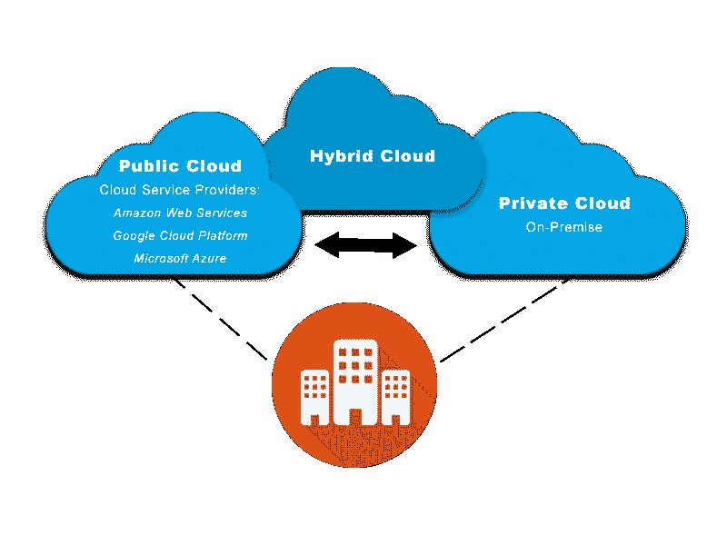
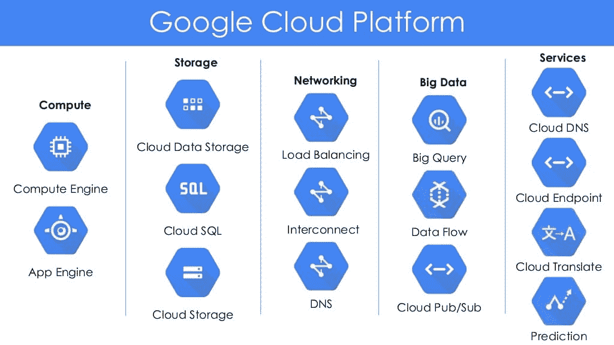
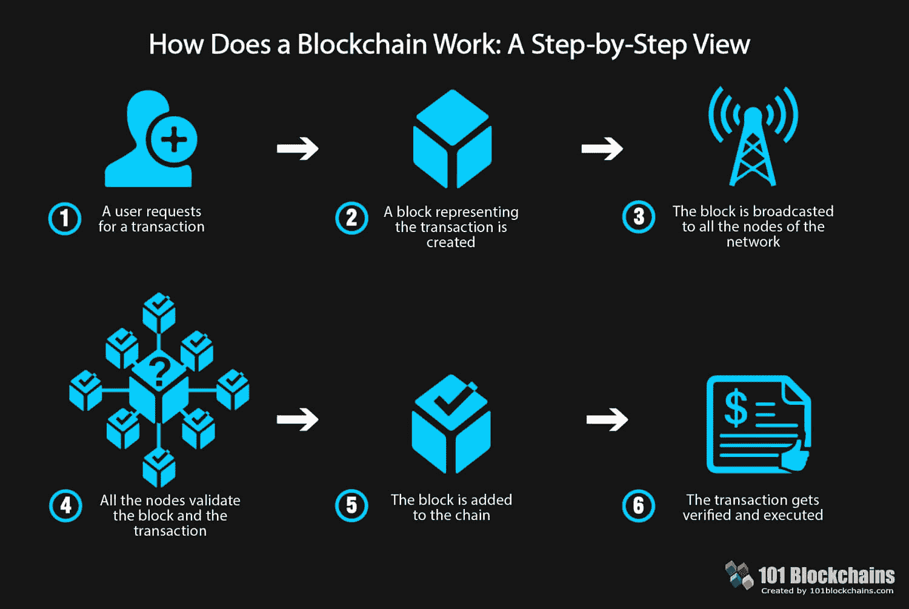

# 云计算的类型—2022 年云解决方案和技术的广泛指南

> 原文:[https://kinsta.com/blog/types-of-cloud-computing/](https://kinsta.com/blog/types-of-cloud-computing/)

今天，云计算已经过渡成为一种主流技术，有许多不同类型的云计算可供选择。根据最新的云状态报告，估计有 94%的企业至少在使用一种云服务。

然而，云增长的能力仍然呈指数增长，IBM 委托的一项研究[报告称，目前只有 20%的企业工作负载在云中运行。仅仅迁移了最简单的工作负载，企业的云之旅还有很长的路要走。由于 80%的企业工作负载仍在内部运行，它们的迁移将代表当前云市场的潜在四倍增长。](https://www.mckinsey.com/industries/technology-media-and-telecommunications/our-insights/it-as-a-service-from-build-to-consume)

尽管[云市场已经成熟](https://kinsta.com/blog/cloud-market-share/)，但许多组织仍然不了解可用的云计算服务和部署模式。在包括谷歌、亚马逊和微软在内的技术领导者不断创新的推动下，几乎每天都有新的云产品和服务出现。

为了帮助您驾驭云计算的复杂性，我们将深入了解可用的云计算类型。我们还将介绍一些最流行的云服务，包括一些正在兴起的新兴技术。

## 云计算主要有哪些类型？

在最高级别，云计算是通过服务和部署模型的组合来交付的。在这些[云交付模式](https://kinsta.com/blog/cloud-market-share/#understanding-the-three-main-types-of-cloud-computing-services)中，有三种类型的云计算和“即服务即服务”产品可供选择。

让我们来详细探讨一下。

*   [基础设施即服务(IaaS)](#iass)
*   [平台即服务(PaaS)](#pass)
*   [软件即服务(SaaS)](#saas)
*   [一切即服务(XaaS)](#xaas)

[94% of enterprises use at least one cloud service, which means understanding and utilizing this technology is more important than ever. Read this guide to learn more 🌩📊.Click to Tweet](https://twitter.com/intent/tweet?url=https%3A%2F%2Fkinsta.com%2Fblog%2Ftypes-of-cloud-computing%2F&via=kinsta&text=94%25+of+enterprises+use+at+least+one+cloud+service%2C+which+means+understanding+and+utilizing+this+technology+is+more+important+than+ever.+Read+this+guide+to+learn+more+%F0%9F%8C%A9%F0%9F%93%8A.&hashtags=cloudcomputing%2Cblockchain)

### 云计算服务模式

有三种主要的云计算服务模式——基础设施即服务、平台即服务和软件即服务。每个服务模型代表云计算堆栈的一个不同部分，并且在您和服务提供商之间有自己独特的责任分工。

Split of Management Responsibilities for Cloud Computing Service Models (Image source: [bmc.com](https://blogs.bmc.com/wp-content/uploads/2017/09/saas-vs-paas-vs-iaas.png))

在每种云计算服务模式中，有 100 多种不同的云服务可供选择——我们将在本文稍后探讨。现在，让我们仔细看看三种主要的服务模型。

#### 基础设施即服务(IaaS)

[基础架构即服务(IaaS)](https://kinsta.com/blog/what-is-iaas/) 是构成云技术部署基础的服务模式。通过 IaaS 提供商，您可以通过互联网按需访问核心 IT 资源，包括计算机(虚拟或专用硬件)、网络和存储。

IaaS 为您提供了对灵活的一流硬件资源的访问，这些资源可以进行扩展以满足您企业的处理和存储需求。您可以利用这一基础设施来供应您组织的应用程序、软件和平台，而无需承担管理和维护的责任。

IaaS 部署的一个典型示例是将虚拟机和存储磁盘结合起来。无论是服务器操作系统还是存储容量大小，每个元素都经过定制，以满足您的业务需求。

#### 平台即服务(PaaS)

[平台即服务(PaaS)](https://kinsta.com/blog/what-is-paas/) 是一种云服务模式，您可以通过服务提供商访问组合的硬件和软件工具。PaaS 最常用于应用程序开发。

PaaS 提供商让您能够访问应用程序开发所需的组合云基础架构(数据库、中间件、操作系统、服务器),而不会带来管理 it 的复杂性。这让你变得更有效率。您不再花时间安装和配置基础架构，而是专注于开发、运行和管理应用程序。

#### 软件即服务(SaaS)

[软件即服务(SaaS)](https://kinsta.com/blog/cloud-market-share/#software-as-a-service-saas) 是一种云服务模式，让您能够访问由服务提供商运行和管理的完整软件产品。大多数 SaaS 解决方案倾向于终端用户应用程序。

使用 SaaS 模型访问您选择的软件，可以让您将精力完全放在如何最好地利用该软件上。SaaS 提供商负责提供、维护和升级软件，包括底层基础设施。

一个常见的 SaaS 例子是基于 web 的客户关系管理(CRM)解决方案。您可以通过 CRM 存储和[管理您的所有联系人，而无需将软件升级到最新版本或维护运行该软件的服务器和操作系统。](https://kinsta.com/blog/wordpress-crm/)

传统的云服务模式支柱(IaaS、PaaS、SaaS)经过多年的发展，已经包含了大量的附加产品，我们现在正在进入一个“一切即服务”的时代。

让我们来看一下。

#### 一切即服务(XaaS)

也称为[任何东西即服务](https://kinsta.com/blog/xaas/)，XaaS 的首字母缩写词是一个通用术语，涵盖了作为新的和受欢迎的服务产品出现的大量产品、工具和技术。

这些新服务的爆炸式增长——以及相关的首字母缩写——已经达到了这样一个水平，以至于现在存在的目录仅仅是为了保持跟踪。这些云服务模型迭代中的每一个都是一个潜在的数十亿美元的产业。最受欢迎的服务包括桌面即服务(DaaS)、人工智能即服务(AIaaS)和统一通信即服务(UaaS)。
T3】

## 云计算部署模型

一旦您选择了所选的云服务，您就可以选择三种主要的[云计算部署模式](https://kinsta.com/blog/cloud-market-share/#infrastructure-as-a-service-iaas):公共云、私有云以及混合云。

Cloud Deployment Models (Image source: [AVI Networks](https://avinetworks.com/glossary/hybrid-cloud/))

像云服务模型一样，每个云部署模型都有自己独特的设置，有一系列不同的要求和相关的好处。

建议阅读:[2022 年云计算的诸多好处](https://kinsta.com/blog/benefits-of-cloud-computing/)

让我们仔细看看:

### 公共云

公共云是由第三方提供商通过公共互联网提供的计算服务。任何想使用公共云服务的人都可以使用公共云服务，可以免费使用，也可以付费使用。

在公共云部署中，管理和维护系统的责任直接落在提供商身上。尽管公共云和私有云体系结构可能完全相同，但每个云部署的安全要求可能存在显著差异。

公共云部署模式消除了购买、管理和维护内部硬件和软件基础架构的昂贵前期成本。由于公共云技术提供商[谷歌](https://kinsta.com/blog/google-cloud-hosting/)、[微软](https://kinsta.com/blog/google-cloud-vs-azure/)和[亚马逊](https://kinsta.com/blog/google-cloud-vs-aws/)的庞大规模，它还提供了快速部署和几乎无限的可扩展性。

### 私有云

私有云是通过互联网或私有内部网络为单个组织提供计算服务。私有云可以在内部管理，也可以由第三方提供商管理。

私有云部署将为您提供许多与公共云相同的优势，包括自助服务和[可扩展性](https://kinsta.com/blog/cloud-market-share/#benefits-of-moving-to-cloud-computing-services-businesswise)。与公共云相比，您还可以更好地控制和定制您在私有云中使用的服务。这意味着您可以[实现更高级别的安全性](https://kinsta.com/blog/cloud-security/)和隐私性——如果您所在的行业要求合规性，这是理想之选。

然而，这些额外的好处是有代价的。在大多数部署中，管理私有云的成本和责任仍由您的 IT 部门承担。这意味着私有云部署速度较慢，并且与传统数据中心拥有者一样，需要支付相同的费用(人员配备、管理和维护)。

### 混合云

混合云是通过公共云和私有云部署的组合来提供计算服务。这种类型的部署允许在两个云环境之间共享数据和应用程序。

混合云使您能够无缝地将资源从内部私有基础架构扩展到公共云，以满足处理计算需求的波动。这允许您将公共云资源用于非敏感计算任务，同时在私有云部署中保持敏感的业务关键型应用程序的安全。

如果使用有效，混合云部署允许您扩展并满足短期资源需求的高峰，而不需要长期投资。混合计算是一个提供“两全其美”的平台，使您能够获得云计算的全部优势——灵活性、可扩展性和成本效益，以及最低的[可能风险暴露](https://kinsta.com/blog/cloud-security/)。

### 其他云部署模式

除了三种最常见的云部署模式和混合模式之外，还有其他鲜为人知的部署选项:

#### 社区云

一种云部署模型，构建在具有共同关注点的多个组织的共享基础架构上。社区云很受欢迎，因为它们进一步在相关组织之间分摊了资源成本。

#### 分布式云

这种类型的云部署由分布在不同位置但连接到单一网络的一组机器组成。它可以作为公共资源创建，也可以使用自愿资源创建。

#### 多云朵

多云是一种不同的云部署，它结合了多个云服务提供商(不要与混合云混淆)。选择多云方法可以减少您对单一服务提供商的依赖，同时通过更多选择提供更大的灵活性。

#### 聚云

这是来自多个服务提供商的云部署的组合，以利用特定的服务。与多云的目的不同，聚云允许您实现比使用单一提供商更多的目标。

#### 高性能计算云

这是一个特定的云部署模型，旨在促进高性能计算(HPC)应用程序。您将使用 HPC 云部署来执行大规模研究或解决高级问题。

## 云服务有多少种？

在每种云服务模式中，都有数百种不同的云服务可供选择。您可以选择的云服务几乎每周都在增加。

受传统内部服务向云的迁移和不断的技术创新的推动，新的云原生服务应运而生。

Google Cloud Platforms Cloud Services

您对云服务提供商的选择将直接影响您可以选择的云服务范围。三大领先的云服务提供商——[谷歌云](https://kinsta.com/blog/google-cloud-hosting/)、[亚马逊网络服务](https://kinsta.com/blog/google-cloud-vs-aws/)和[微软 Azure](https://kinsta.com/blog/google-cloud-vs-azure/)——为您提供广泛的服务，以满足您的计算需求。

当然，所有这些选择可能会让人不知所措，而且通常很难理解不同类型的可用云服务。为了帮助您开始理解和驾驭这个复杂的技术云计算生态系统，我们探索了核心和新兴的云服务类别及其相关的云服务。

### 核心云服务类别

以下是云服务类别，其中包括您将在传统内部部署中使用的核心服务。

## 注册订阅时事通讯

### 想知道我们是怎么让流量增长超过 1000%的吗？

加入 20，000 多名获得我们每周时事通讯和内部消息的人的行列吧！

[Subscribe Now](#newsletter)

#### 云计算服务

云中的计算服务是构建和运行组织技术的基础架构。[虚拟机(VM)将构成您计算服务的核心](https://kinsta.com/blog/boosting-wordpress-performance/)。

云服务提供商提供了[大量的虚拟机选项](https://kinsta.com/blog/google-cloud-hosting/#vms)，可以运行你能想象到的任何工作负载。您的虚拟机的每个方面都可以进行配置，以满足您企业的独特计算要求，包括操作系统、内核数量、位置、连接的存储。这包括扩展您每天需要的虚拟机实例数量，以满足您不断变化的计算需求。

云计算还包括服务器迁移、容器管理和无服务器计算等服务。以下是三大领先云服务提供商提供的主要云计算服务:

*   谷歌云—[计算引擎](https://cloud.google.com/compute)、[迁移为计算引擎](https://cloud.google.com/migrate/compute-engine)、[应用引擎](https://cloud.google.com/appengine)，还有[更多](https://cloud.google.com/products/compute)
*   亚马逊网络服务——[亚马逊 EC2](https://aws.amazon.com/ec2) 、[亚马逊弹性容器服务](https://aws.amazon.com/ecs/)、[亚马逊光帆](https://aws.amazon.com/lightsail/)，还有[更多](https://aws.amazon.com/products/compute/)
*   微软 Azure-[虚拟机](https://azure.microsoft.com/en-us/services/virtual-machines/)、[容器实例](https://azure.microsoft.com/en-us/services/container-instances/)、 [App 服务](https://azure.microsoft.com/en-us/services/app-service/)，还有[更多](https://azure.microsoft.com/en-us/product-categories/compute/)

#### 云网络服务

您的网络是基础设施的另一个基石。您选择的云服务提供商的网络基础设施将直接决定您的云服务的安全级别、可用性、速度和覆盖范围。

领先的云服务提供商将为您提供[全球区域和位置网络](https://kinsta.com/blog/google-cloud-vs-aws/#network)。每个公司都在不断努力改进其网络基础设施，以提供更好的带宽和更快的下载速度。

云网络通常包含以下服务:

*   [内容交付网络(CDN)](https://kinsta.com/help/kinsta-cdn/)–一种通过多个地理位置交付内容的方式，以提供高速和[低延迟](https://kinsta.com/blog/network-latency/)
*   专用互连–直接访问云提供商的高速网络
*   [域名系统(DNS)](https://kinsta.com/knowledgebase/what-is-dns/)–一种可扩展的方式，通过 DNS 将用户路由至互联网应用
*   负载平衡——一种在多个资源之间分配传入流量的工具
*   虚拟专用网络(VPN)–安全且隔离的云资源

谷歌云平台是独一无二的，它还提供额外的[高级网络层](https://kinsta.com/blog/google-cloud-network/)。这使您能够访问谷歌的高性能、低延迟、高度可靠的全球网络。

这可能会影响您的云服务交付质量，例如[网站速度](https://kinsta.com/learn/speed-up-wordpress/)会直接影响用户体验、参与度甚至销售额。

我们理解一个伟大网络的重要性，这就是为什么 [Kinsta 为我们所有的客户使用谷歌云平台的高级层](https://kinsta.com/knowledgebase/what-you-should-know/)。

Google Cloud Platform Premium Tier (Image Source: Google)

以下是三大领先云平台提供商提供的主要云网络服务:

*   Google Cloud—[虚拟私有云(VPC)](https://cloud.google.com/vpc) ，[云 DNS](https://cloud.google.com/dns) ，[云 CDN](https://cloud.google.com/cdn) ，[云负载均衡](https://cloud.google.com/load-balancing)，还有[更多](https://cloud.google.com/products/networking)
*   亚马逊 Web 服务——[亚马逊 VPC](https://aws.amazon.com/vpc/?c=19&pt=1) 、[亚马逊 Route 53](https://aws.amazon.com/route53/) 、 [AWS 直连](https://aws.amazon.com/directconnect/)、[弹性负载均衡](https://aws.amazon.com/elasticloadbalancing/)、[更多](https://aws.amazon.com/products/networking/)
*   微软 Azure—[Azure 虚拟网络](https://docs.microsoft.com/en-us/azure/virtual-network/virtual-networks-overview)、 [Azure DNS](https://docs.microsoft.com/en-us/azure/dns) 、 [Azure 内容交付网络](https://docs.microsoft.com/en-us/azure/cdn)、 [Azure 负载均衡器](https://docs.microsoft.com/en-us/azure/load-balancer/load-balancer-overview)，还有[更多](https://azure.microsoft.com/en-us/product-categories/networking/)

#### 云存储服务

云中的存储包括利用云服务提供商的基础设施来安全地存储您的数据、应用和工作负载。

与虚拟机的定制非常相似，云服务提供商为您提供了多种存储配置选项，可以根据您的业务需求进行扩展，包括[磁盘大小](https://kinsta.com/blog/disk-usage-wordpress/)，存储量和[位置](https://kinsta.com/knowledgebase/google-cloud-data-center-locations/)。他们还将支持[不同的存储类型](https://kinsta.com/blog/disk-space-wordpress-hosting/)，包括块、文件和对象存储。

某些云服务提供商还提供一系列数据传输服务，帮助您快速、安全地将大量数据迁移到他们的基础架构中。

以下是三大领先云平台提供商提供的主要[云存储](https://kinsta.com/blog/what-is-cloud-storage/)服务:

*   Google Cloud—[云存储](https://cloud.google.com/storage)、[持久磁盘](https://cloud.google.com/persistent-disk)、[云文件存储](https://cloud.google.com/filestore)、[数据传输服务](https://cloud.google.com/products/data-transfer)以及[更多](https://cloud.google.com/products/storage)
*   亚马逊网络服务—[亚马逊 EBS](https://aws.amazon.com/ebs/) 、[亚马逊 EFS](https://aws.amazon.com/efs/) 、[亚马逊 S3](https://aws.amazon.com/s3/) 、[数据传输服务](https://aws.amazon.com/cloud-data-migration/)以及[更多](https://aws.amazon.com/products/storage/)
*   微软 Azure-[磁盘存储](https://azure.microsoft.com/en-us/services/storage/disks/)、[文件存储](https://azure.microsoft.com/en-us/services/storage/files/)、 [Blob 存储](https://azure.microsoft.com/en-us/services/storage/blobs/)，还有[更多](https://azure.microsoft.com/en-us/product-categories/storage/)

#### 云安全、身份和合规服务

[云中的安全性、身份和合规性](https://kinsta.com/blog/cloud-security/#best-practices-for-cloud-security)由一系列工具和服务组成，旨在控制对云基础架构的访问、防范攻击并维护数据隐私。

一些世界上最大的品牌和行业依赖于 Kinsta 的企业 WordPress 主机。从创业公司，到代理公司，以及财富 500 强公司。准备好开始了吗？[查看我们的计划](https://kinsta.com/plans/?in-article-cta)

最常见和最关键的云安全服务包括:

*   审计–一个工具跟踪所有用户活动，并创建一个审计日志，记录在您的云平台中谁在何时何地做了什么。
*   合规性–一系列工具和控制，帮助您跟踪和维护法规合规性。
*   DDoS 防护——一种旨在识别和缓解 [DDoS 攻击](https://kinsta.com/blog/what-is-a-ddos-attack/)的工具，旨在防止应用程序停机并最大限度地减少基础设施的延迟。
*   加密–提供静态和传输中的加密，防止您的数据被窃取。
*   [防火墙](https://kinsta.com/blog/what-is-a-firewall/)–一组[防火墙工具](https://kinsta.com/feature-updates/auto-db-optimize/#now-secured-behind-google-cloud-platform-firewall)，用于过滤恶意网络流量并集中管理防火墙规则。
*   身份和访问管理–一个平台，用于管理用户身份并控制谁可以访问什么，以及他们可以使用该访问权限做什么
*   威胁检测–识别云环境中潜在威胁的工具。

### 信息

Kinsta 实施硬件防火墙、主动和被动安全以及其他高级功能，以防止访问客户的数据。查看我们的计划。

以下是三大领先云平台提供商提供的主要云安全服务:

*   Google Cloud-[Cloud IAM](https://cloud.google.com/iam)，[云审计日志](https://cloud.google.com/audit-logs)，[云安全指挥中心](https://cloud.google.com/security-command-center)，还有[更多](https://cloud.google.com/security/products)
*   亚马逊网络服务—[亚马逊认知](https://aws.amazon.com/cognito/)、 [AWS 盾](https://aws.amazon.com/shield/)、 [AWS 安全中枢](https://aws.amazon.com/security-hub/)、 [AWS 防火墙管理器](https://aws.amazon.com/firewall-manager/)以及[更多](https://aws.amazon.com/products/security/)
*   微软 Azure-[Azure Active Directory](https://azure.microsoft.com/en-us/services/active-directory/)、 [Key Vault](https://azure.microsoft.com/en-us/services/key-vault/) 、 [Azure 安全中心](https://azure.microsoft.com/en-us/services/security-center/)，还有 [more](https://azure.microsoft.com/en-us/product-categories/security/)

#### 云分析服务

云中的分析由一系列工具和框架组成，帮助您分析数据并从中提取有价值的见解(想想云服务的 [Google Analytics](https://kinsta.com/blog/how-to-use-google-analytics/) )。随着大数据对企业变得越来越重要，云分析服务的可用性和复杂性不断提高。

主要的云服务提供商提供一系列云分析服务，帮助您存储、处理、分析和可视化数据。

我们了解分析软件的重要性以及它对您的业务的积极影响。我们的分析平台 [MyKinsta Analytics](https://kinsta.com/help/mykinsta-analytics/) ，为您提供所需的网站性能数据的可见性，以快速[调查和解决任何问题](https://kinsta.com/blog/wordpress-errors/)。确保你的 WordPress 网站——你的主要销售工具——处于最佳状态。

主要的云提供商平台还提供与开源分析工具的深度集成，如 [Apache Spark](https://spark.apache.org/) 和 [Apache Hadoop](https://hadoop.apache.org/) 。

以下是三大领先云平台提供商提供的主要云分析服务:

*   Google Cloud-[big query](https://cloud.google.com/bigquery)、[云数据流](https://cloud.google.com/dataflow)、 [Google Looker Studio](https://datastudio.google.com/overview) ，还有 [more](https://cloud.google.com/products/big-data)
*   亚马逊网络服务-[亚马逊雅典娜](https://aws.amazon.com/athena/)，[亚马逊 EMR](https://aws.amazon.com/emr/) ，[亚马逊红移](https://aws.amazon.com/redshift/)，还有[更多](https://aws.amazon.com/big-data/datalakes-and-analytics)
*   微软 Azure-[数据湖分析](https://azure.microsoft.com/en-us/services/data-lake-analytics/)、[高清洞察](https://azure.microsoft.com/en-us/services/hdinsight/)、 [Azure Synapse 分析](https://azure.microsoft.com/en-us/services/synapse-analytics/)，以及[更多](https://azure.microsoft.com/en-us/product-categories/analytics/)

#### 云数据库服务

云中的数据库服务提供专门构建的[数据库](https://kinsta.com/knowledgebase/wordpress-database/)您可以通过调整计算和存储资源来扩展以满足需求。云数据库是完全托管的，让您可以自由地输入、分析和利用您的数据，而无需考虑底层基础架构。

云服务提供商已经扩展到提供一系列关系和非关系(NoSQL)数据库，以满足您不同的数据需求。给你一个选择的深度——甚至在子类别中——选项包括 [MySQL](https://kinsta.com/knowledgebase/what-is-mysql/) 或 [Kinsta 的数据库选择，MariaDB](https://kinsta.com/blog/mariadb-vs-mysql/) 。

您是否需要一个用于传统应用程序(CRM、ERP 等)的日常 SQL Server 数据库。)，或者宽列数据库来支持一个高规模的工业 app，你可以在云端找到。

Key differences between SQL Database and NoSQL Databases (Image Source: [ScyllaDB](https://www.scylladb.com/wp-content/uploads/differences-between-sql-databases-and-nosql-databases.png))

以下是三大领先云平台提供商提供的主要云数据库服务:

*   Google Cloud-[云 SQL](https://cloud.google.com/sql) ，[云 Bigtable](https://cloud.google.com/bigtable) ，[云扳手](https://cloud.google.com/spanner)，还有[更多](https://cloud.google.com/products/databases)
*   亚马逊网络服务—[亚马逊 RDS](https://aws.amazon.com/rds/) 、[亚马逊文档数据库](https://aws.amazon.com/documentdb/)、[亚马逊托管阿帕奇卡珊德拉服务](https://aws.amazon.com/mcs/)，以及[更多](https://aws.amazon.com/products/databases/)
*   微软 Azure-[Azure SQL 数据库](https://azure.microsoft.com/en-us/services/sql-database/)， [Azure Cosmos DB](https://azure.microsoft.com/en-us/services/cosmos-db/) ， [Azure 数据库 for MySQL](https://azure.microsoft.com/en-us/services/mysql/) ，还有[更多](https://azure.microsoft.com/en-us/product-categories/databases/)

### 新兴云服务类别

除了为日常业务构建核心基础设施所需的服务，还有一系列越来越受欢迎的新兴云服务类别。

这些新兴的云服务已经发展到能够满足技术创新的程度，并且往往是云本地的，而不是传统的内部解决方案。

下面，我们探讨了三个最受欢迎的新兴云服务类别:

#### 人工智能和机器学习云服务

云已经为所有业务解锁了人工智能(AI)和机器学习工具。人工智能和机器学习云服务使您能够获得负担得起的现成解决方案，您可以快速配置这些解决方案，而无需对基础设施进行大规模投资。

Differences between AI, Machine Learning and Deep Learning (Image Source: [Oracle](https://blogs.oracle.com/bigdata/difference-ai-machine-learning-deep-learning))

有 AI 和机器学习服务可用于广泛的服务。最初用于从爆炸规模和复杂性的数据中提取洞察力，企业开始意识到人工智能和机器学习服务的应用，以实现客户服务、市场营销和销售部门的一系列替代用途。

以下是相关云服务支持的一些越来越常见的人工智能和机器学习用途:

*   [聊天机器人](https://kinsta.com/blog/chatbot/)——结合机器学习和人工智能来提供创新的聊天机器人，可用于实时聊天，以处理一系列客户服务和销售场景。
*   识别——结合机器学习和人工智能来识别图像和语音。
*   语音到文本-使用机器学习和语音识别将音频文件转换为文本，以提供快速转录并将非结构化数据转换为可分析的格式。
*   [搜索](https://kinsta.com/blog/wordpress-search/)-使用机器学习工具从文档、图像、视频和网络中索引并提供全面和内容丰富的搜索结果。
*   [翻译](https://kinsta.com/blog/how-to-translate-a-website/)——使用机器学习工具识别，然后翻译语音或文本文件。

以下是三家领先的云平台提供商提供的主要云人工智能和机器学习服务:

*   谷歌云——[AI 平台](https://cloud.google.com/ai-platform)、[视觉 AI](https://cloud.google.com/vision) 、[语音转文本](https://cloud.google.com/speech-to-text)，还有[更多](https://cloud.google.com/products/ai/)
*   亚马逊网络服务——[亚马逊理解](https://aws.amazon.com/comprehend/)，[亚马逊波利](https://aws.amazon.com/polly/)，[亚马逊翻译](https://aws.amazon.com/translate/)，还有[更多](https://aws.amazon.com/machine-learning/)
*   微软 Azure-[Azure Bot 服务](https://azure.microsoft.com/en-us/services/bot-service/)、[必应自定义搜索](https://azure.microsoft.com/en-us/services/cognitive-services/bing-custom-search/)、[机器学习工作室](https://azure.microsoft.com/en-us/services/machine-learning-studio/)、[更多](https://azure.microsoft.com/en-us/overview/ai-platform/)

#### 区块链

区块链技术在过去 3-5 年中出现了爆炸式增长。用最简单的术语来说，区块链是一系列带有时间戳的不可变数据记录——通常是事务——由不属于单一实体的计算机集群管理。

每个数据块都受到保护，并使用加密原理(即链)与其他数据块绑定。

How a Blockchain works (Image Source: [101BlockChain](https://101blockchains.com/ultimate-blockchain-technology-guide/#prettyPhoto/0/))

此后，云提供商向组织发布了一系列服务来构建和管理他们自己的区块链。这些通常跨越密码术、大规模分类账数据库或完全管理的区块链服务。

以下是两家领先的云平台提供商提供的主要云区块链服务:

*   亚马逊网络服务—[亚马逊托管区块链](https://aws.amazon.com/managed-blockchain/)和[亚马逊量子账本数据库(QLDB)](https://aws.amazon.com/qldb)
*   微软 Azure-[Azure 区块链服务](https://azure.microsoft.com/en-us/services/blockchain-service/)、 [Azure 区块链工作台](https://azure.microsoft.com/en-us/features/blockchain-workbench/)、 [Azure 区块链令牌](https://azure.microsoft.com/en-us/services/blockchain-tokens/)

#### 物联网

设备发展到包括互联网连接，催生了物联网(IoT)。今天，物联网网络跨越了家庭、汽车、工厂、医院和无数其他地方的数十亿设备。

如果您正在使用物联网设备——尤其是大规模使用——您将需要连接和保护它们的解决方案。以及收集、存储和分析他们产生的数据。

云提供商提供越来越多的物联网服务来支持您的这一努力。这意味着您可以为各种可用设备的几乎任何用例构建物联网解决方案。

以下是三大领先云平台提供商提供的主要物联网:

*   谷歌云—[云物联网核心](https://cloud.google.com/iot-core)和[边缘 TPU](https://cloud.google.com/edge-tpu)
*   亚马逊网络服务—[AWS 物联网核心](https://aws.amazon.com/iot-core/)、 [AWS 物联网按钮](https://aws.amazon.com/iot/button/)、 [AWS 物联网分析](https://aws.amazon.com/iot-analytics/)，以及[更多](https://aws.amazon.com/iot/)
*   微软 Azure-[Azure IoT Hub](https://azure.microsoft.com/en-us/services/iot-hub/)、 [Azure IoT Central](https://azure.microsoft.com/en-us/services/iot-central/) 、 [Azure IoT Edge](https://azure.microsoft.com/en-us/services/iot-edge/) ，以及 [more](https://azure.microsoft.com/en-us/product-categories/iot/)

[The complexity of the cloud market is hard to navigate. This guide covers all the different types of cloud computing solutions and highlights their key features. ☁️👨‍💻Click to Tweet](https://twitter.com/intent/tweet?url=https%3A%2F%2Fkinsta.com%2Fblog%2Ftypes-of-cloud-computing%2F&via=kinsta&text=The+complexity+of+the+cloud+market+is+hard+to+navigate.+This+guide+covers+all+the+different+types+of+cloud+computing+solutions+and+highlights+their+key+features.+%E2%98%81%EF%B8%8F%F0%9F%91%A8%E2%80%8D%F0%9F%92%BB&hashtags=cloudcomputing%2Chosting)

## 摘要

云为您提供了无数的基础设施、平台和软件即服务解决方案。所有这些都可以选择部署在公共、私有或混合解决方案中。您的企业是独一无二的，因此您需要花时间了解每种可用的解决方案以及哪种设置适合您的企业，这一点非常重要。

这种不断发展的状态几乎每天都会给你机会去尝试新的解决方案，或者发现能让你的业务更上一层楼的技术。

如果你正在寻找 WordPress 网站托管服务，你应该强烈考虑将 Kinsta 作为你的合作伙伴。我们的平台由谷歌云平台的[高级层提供支持，我们通过我们的](https://kinsta.com/blog/google-cloud-network/)[免费迁移服务](https://kinsta.com/knowledgebase/wordpress-migrations/)处理迁移的麻烦。

* * *

让你所有的[应用程序](https://kinsta.com/application-hosting/)、[数据库](https://kinsta.com/database-hosting/)和 [WordPress 网站](https://kinsta.com/wordpress-hosting/)在线并在一个屋檐下。我们功能丰富的高性能云平台包括:

*   在 MyKinsta 仪表盘中轻松设置和管理
*   24/7 专家支持
*   最好的谷歌云平台硬件和网络，由 Kubernetes 提供最大的可扩展性
*   面向速度和安全性的企业级 Cloudflare 集成
*   全球受众覆盖全球多达 35 个数据中心和 275 多个 pop

在第一个月使用托管的[应用程序或托管](https://kinsta.com/application-hosting/)的[数据库，您可以享受 20 美元的优惠，亲自测试一下。探索我们的](https://kinsta.com/database-hosting/)[计划](https://kinsta.com/plans/)或[与销售人员交谈](https://kinsta.com/contact-us/)以找到最适合您的方式。