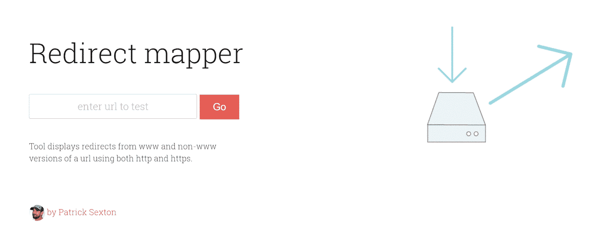
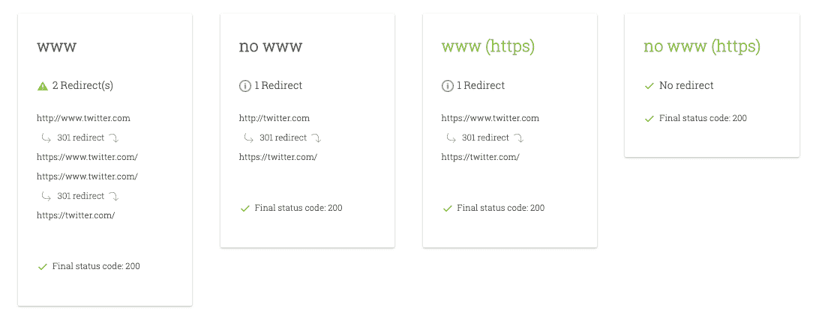
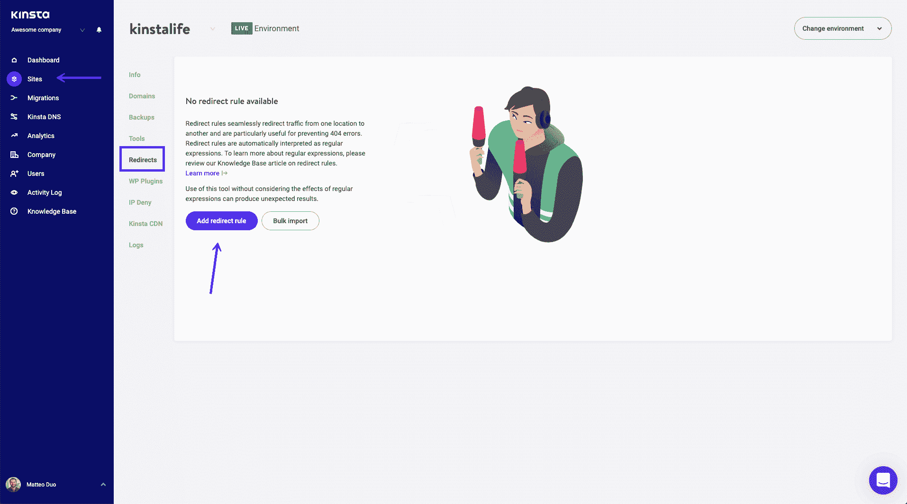
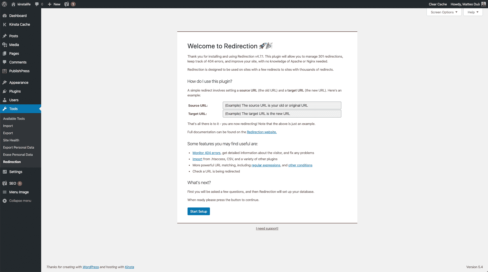
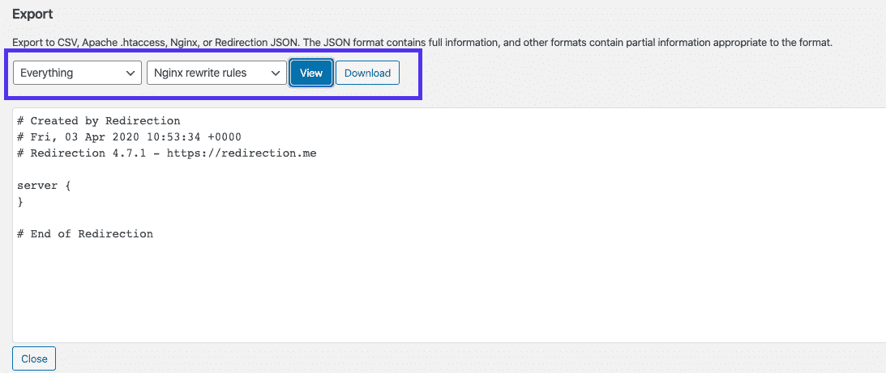

# WordPress 重定向最佳实践以最大化 SEO 和页面速度

> 原文:[https://kinsta.com/blog/wordpress-redirect/](https://kinsta.com/blog/wordpress-redirect/)

当你重新设计网站或更新旧内容时，你的 URL 结构很可能会发生变化。如果你不遵循 WordPress 重定向的最佳实践，你就有负面影响用户体验(UX)和你的[搜索引擎优化(SEO)](https://kinsta.com/blog/what-does-seo-stand-for/) 的风险。

内置于核心平台的 WordPress 重定向功能是为了捕捉不正确的 URL 而设计的。也就是说:当一个错误的 URL 被请求时，WordPress 会尝试定位正确的 URL，如果找到了，就会重定向访问者。

在这篇文章中，我们将解释 WordPress 重定向的重要性，以及它们如何影响页面速度，当然还有 SEO。我们还将讨论如何在 WordPress 中最小化重定向，并指导你使用各种解决方案来设置它们。

我们开始吧！

### 更喜欢看[视频版](https://www.youtube.com/watch?v=PRNMpVu2XW4)？


 ## WordPress 重定向介绍

WordPress core 带有重定向功能，旨在帮助捕捉和纠正不正确的 URL。如果有人请求了一个不正确的 URL，WordPress 会尝试定位正确的 URL，如果成功的话会重定向访问者。


> Kinsta 把我宠坏了，所以我现在要求每个供应商都提供这样的服务。我们还试图通过我们的 SaaS 工具支持达到这一水平。
> 
> <footer class="wp-block-kinsta-client-quote__footer">
> 
> 
> 
> <cite class="wp-block-kinsta-client-quote__cite">Suganthan Mohanadasan from @Suganthanmn</cite></footer>

[View plans](https://kinsta.com/plans/)

假设您有一个位于“http://www . example . com/parent/page”*的页面。如果你在浏览器中输入“http://example . com/page ”, WordPress 会足够智能地自动定位正确的页面，将你重定向到该页面。*

不幸的是，**事情并不总是那么简单**。如果你设置你的网站使用 HTTPS 进行解析(从而强制所有流量从 [HTTP 重定向到 HTTPS](https://kinsta.com/knowledgebase/redirect-http-to-https/) 前缀的 URL)，重定向过程会变得更加复杂。

例如，假设访问者试图通过在地址栏中键入“http://example.com/page”来访问网页“https://www . example . com/parent/page”。该过程将按如下方式展开:

*   首先，访问者从 HTTP 重定向到 HTTPS。
*   第二，当“www”被添加到 URL 时，访问者被重定向。
*   第三，访问者被重定向到路径中包含父页面的 URL 公式。
*   最后，服务器开始将网站的文件和资源发送到访问者的浏览器。

你可能会想:“太好了！我可以删除一个链接，访问者仍然会停留在他们应该停留的地方。”从某种意义上说，你这样想是对的。WordPress 非常擅长找出 URL 应该被解析的地方，这意味着输入错误的 URL 通常会被正确解析。

然而，所有这些自动重定向也有不利的一面。

[当您的 URL 结构发生变化时，您需要遵循以下重定向最佳实践...或者风险影响你的搜索引擎优化和用户体验❌😬 点击推文](https://twitter.com/intent/tweet?url=https%3A%2F%2Fkinsta.com%2Fblog%2Fwordpress-redirect%2F&via=kinsta&text=When+changes+to+your+URL+structures+occur%2C+you%27ll+need+to+follow+these+redirect+best+practices...+or+risk+impacting+your+SEO+and+UX+%E2%9D%8C%F0%9F%98%AC&hashtags=SEO%2CUX)


## WordPress 重定向如何影响页面加载速度

一旦你意识到 WordPress 是多么有弹性，就很容易被欺骗而忽略 URL 的格式。如果你在内联链接和[自定义菜单](https://kinsta.com/blog/wordpress-menu-plugins/)中手动输入 URL，这是非常危险的。

没什么大不了的，对吧？访问者仍然停留在正确的网址上！虽然理论上是这样，但是你忽略的是重定向对页面加载速度的影响。

让我们来看看一个 WordPress 网站的页面速度结果。该测试基于使用正确制定的 URL 访问页面，以避免任何重定向:


A Pingdom test result with a properly-formed URL


那一点也不差。如果我们看一下文件请求，我们会发现当站点被请求时没有发生重定向:


A file request from Pingdom


那么，如果我们弄乱了那个 URL 并再次运行测试，会发生什么呢？


A Pingdom test result with a badly-formed URL


这增加了将近 100 毫秒的页面加载时间。虽然这看起来没什么大不了的，因为这个站点已经够快了，但是让我们看看文件请求，看看发生了什么:


A bad URL file request


现在，URL 前面添加了一个重定向。重定向后，页面正常加载。因此，我们可以将页面速度较慢归因于测试中输入了不正确的 URL 时发生的重定向。

底线是重定向伤害了 web [页面加载速度](https://kinsta.com/learn/speed-up-wordpress/)。这种差异可能是显著的、可测量的。
T3】

## WordPress 重定向如何影响你网站的搜索引擎优化

如果你对 SEO 有基本的了解，你大概知道链接在其中扮演的重要角色。如果一个 URL 链接到一个不再存在的页面，或者被转移到另一个被移动的链接，你的访问者可能会遇到一个 [404 页面错误](https://kinsta.com/blog/error-404-not-found/):


A 404 error page in Chrome


除了糟糕的用户体验，从 SEO 的角度来看，404“找不到页面”错误也会伤害你。这 404 个错误是由于[断开链接](https://kinsta.com/blog/broken-links/)，影响了[搜索引擎](https://kinsta.com/blog/alternative-search-engines/)抓取你的网站并定位其页面的能力。

这向搜索引擎发出信号，用户不仅能够找到他们正在寻找的东西，而且你的网站架构也很糟糕和过时。

因此，为改变了 URL 的页面设置重定向是非常必要的。如果你[将你的网站转移到一个新的域](https://kinsta.com/blog/wordpress-change-domain/)，配置 WordPress 重定向可以让搜索引擎爬虫仍然能够索引新的网站 URL，同时从索引中删除旧的。

重定向也可以帮助确保链接汁将从您的旧域传递到您的新域和您自己的页面。然而，需要注意的是，只有某些 HTTP 重定向代码会影响你在搜索引擎中的排名。

### 各种类型的 URL 重定向

作为一个 WordPress 用户，最常见的重定向类型是 301 重定向。这用于永久移动的内容。

301 重定向告诉搜索引擎你想让访问者去的页面已经改变或移动了，并且通过了 90-99%的链接。在大多数情况下，这种类型的重定向会导致搜索引擎将大部分链接(或页面权限)传递给新的或更新的页面。

[其他类型的服务器端重定向包括](https://kinsta.com/blog/http-status-codes/#300-status-codes):

*   **302。**这个[临时重定向](https://kinsta.com/blog/http-302/)通知搜索引擎页面正在移动，但不是永久的。它不像 301 重定向那样传递链接流。
*   303。这种类型的临时重定向用于防止存储数据的页面被刷新或被书签标记([支付表单](https://kinsta.com/blog/woocommerce-payment-gateways/)，登录页面等)。).这样，用户在浏览器中点击“后退”按钮后就不能重新提交表单了。这些重定向不会影响 SEO。
*   307。[307 重定向](https://kinsta.com/knowledgebase/307-redirect/)类似于 303 重定向，因为它应该只用于临时移动的页面。但是，302 重定向通常是首选方法。
*   **308。**308 重定向是永久重定向，所以会传递链接汁和页面权限。然而，和之前的重定向一样，它对 SEO 的影响并不为人所知。大多数情况下，最好用 301。

正如我们所说的，以上所有都被认为是服务器端重定向。

还有客户端重定向，当用户的浏览器处理转发或重定向时会触发这些重定向。但是，这些都不可靠，应该避免。

服务器端重定向是确保搜索引擎能够快速理解重定向并适当转移您的 SEO 汁的最佳方式。


## 重定向还是不重定向？

重定向的存在是有原因的。它们允许你把访问者从过时的内容和不存在的网址发送到更新的内容。我们已经在一定程度上涵盖了不存在的 URL 这个角度。WordPress 自己做了一些事情。

然而，WordPress 不会捕获所有内容，有时需要手动重定向规则。

例如，假设你在 WordPress 3.0 发布时写了一篇名为“WordPress 的新特性”的文章。这在 2010 年是一个很棒的帖子，但在 2022 年的今天，搜索“WordPress 有什么新内容”的人想要更新的信息。你想让这些读者高兴，所以[你写了一篇关于即将到来的](https://kinsta.com/blog/proofreading-tips/)[版本的 WordPress](https://kinsta.com/knowledgebase/check-wordpress-version/) 的新文章。

在这种情况下，从旧帖子到新帖子的重定向是完全可以接受且合适的。此外，在这种情况下，重定向是很好的 SEO 实践。归因于旧帖子的链接汁会转到你的新帖子上，让它在搜索引擎中立刻变得有分量。

有几种适合重定向的情况，包括:

*   您发布了更新的内容，并希望引导访问者远离旧版本。
*   你已经改造了一个[网站的永久链接结构](https://kinsta.com/blog/wordpress-permalinks/),需要将旧的 URL 重定向到新的结构。
*   您正在更新已发布的页面或帖子，并希望在更新过程中临时将流量重定向到不同的帖子或页面。

### 何时不重定向

在上述所有场景中，**重定向是必要的**将访问者从过时的内容和损坏的 URL 发送到更新的内容。当特定的内容更新时，它们作为临时措施也很方便。

那么，什么时候*不*适合使用 WordPress 重定向呢？例如，如果你已经使用不包含“www”的 URL 创建了一个[自定义菜单](https://kinsta.com/blog/wordpress-menu-plugins/)，但是你的站点 URL 确实在 URL 前面有“www”子域，那么你就犯了一个错误。

在这种情况下使用重定向是不合适的，而且[会影响你网站的速度](https://kinsta.com/learn/page-speed/)和搜索引擎优化。

## 如何最小化 WordPress 中的重定向

如果你对 WordPress 中最小化重定向的想法感兴趣，你需要做两件重要的事情。

### 1.永远不要创建不必要的重定向

首先要记住的是永远不要故意创建不必要的重定向。例如，在构建内部链接和菜单时，不应该创建重定向。

如果你已经养成了懒散地输入网址的习惯，最好重新思考一下你的工作方式。相反，当您创建 URL 时，请确保:

*   使用正确的协议前缀(HTTP 或 HTTPS)。
*   根据需要包括或排除“www”子域。
*   不要在链接中使用帖子和页面 id。
*   包括页面或文章的完整路径。

WordPress 内置的重定向功能应该是一个后备，以防你不小心创建了一个错误的 URL。一般来说，对于懒惰的 URL 编写来说，这不是一个非常可靠的解决方案。

### 2.确保您的顶级域名(TLD)解析不超过一次重定向

你可以做的第二件事是确保你的[顶级域名(TLD)](https://kinsta.com/knowledgebase/what-is-a-tld/) 的解析不超过一次重定向。您的目标是确保通过一次或更少的重定向到达正确的 URL，无论访问者在 TLD 前抛出什么样的协议前缀和子域组合。

让我们看一个例子。以下所有 URL 应解析为 TLD，不超过一次重定向，其中一个应解析为无重定向:

*   http://example.com
*   http://www.example.com
*   https://example.com
*   https://www.example.com

如果你不确定使用协议前缀和[子域名](https://kinsta.com/blog/wordpress-subdomain/)的不同组合需要多少次重定向来解析你网站的 URL，你可以使用 [Patrick Sexton 的重定向映射器](https://nbyte.com/tools/redirects/)进行检查:



The Redirect mapper tool


下面是一个示例，说明如何使用此重定向映射器轻松识别未正确设置的重定向:

 ## 注册订阅时事通讯


### 想知道我们是怎么让流量增长超过 1000%的吗？

加入 20，000 多名获得我们每周时事通讯和内部消息的人的行列吧！

[Subscribe Now](#newsletter)



Redirects not set up correctly


您可以看到在该域的“www”版本中出现了重复的重定向。相反，下面是一个正确设置重定向的示例:


Redirects set up correctly


正如您所看到的，对于“www”和“no www ”,只发生了一次重定向。

如果您确实发现其中一些组合无法解析(返回一个 [404 服务器状态代码](https://kinsta.com/blog/http-status-codes/#400-status-codes))或者需要不止一次重定向才能解析，那么是时候开始工作了。

## 在服务器级设置重定向

设置 WordPress 重定向的一个方法是给你的服务器添加一个或多个重定向规则。这将确保访问者尽可能快地以正确的方式登陆你的网站。

您试图实现的基本目标是创建重定向规则，该规则针对任何需要多次重定向的 URL 公式。您希望强制这些 URL 直接解析为正确表述的 URL。

例如，如果 URL“http://example . com”需要两次重定向才能到达“https://www.example.com”，您可以创建一个手动重定向，使其一步完成(而不是两步)。

### Apache 中的重定向规则

如果你的站点托管在一个标准的 [LAMP stack](https://en.wikipedia.org/wiki/LAMP_(software_bundle)) 上，你将需要添加 URL 重写规则到你的站点的 [*。htaccess* 文件](https://kinsta.com/knowledgebase/wordpress-htaccess-file/)。通过 web 服务器配置文件设置 WordPress 重定向是一个技术过程，可能很复杂。

因此，只有当您对编辑*感到满意时，才使用这种方法。htaccess* 文件。即使你是，它仍然是一个好主意[创建一个备份](https://kinsta.com/knowledgebase/mysql-backup-database/)的文件。

然后，第一步是使用一个 [FTP 客户端](https://kinsta.com/blog/best-ftp-clients/)，或者通过你的托管 [cPanel 的文件管理器](https://kinsta.com/knowledgebase/what-is-cpanel/)，连接到你的 WordPress 安装。你可以找到*。你的 WordPress 站点根目录下的 htaccess* 文件。

要设置 301 重定向，您需要用如下所示的语法结构指定旧的和新的 URL 位置:

`Redirect 301 "old-page" "new-page"`

如果你想将网站的所有流量从 [HTTP 重定向到 HTTPS](https://stackoverflow.com/questions/13977851/htaccess-redirect-to-https-www) ，你可以使用下面的方法:

```
<IfModule mod_rewrite.c>

RewriteEngine On
RewriteCond !{HTTPS} off
RewriteRule ^(.*)$ https://www.%{HTTP_HOST}%{REQUEST_URI} [L,R=301]
RewriteCond %{HTTP_HOST} !^www\.
RewriteRule ^(.*)$ https://www.%{HTTP_HOST}%{REQUEST_URI} [L,R=301]

</IfModule>
```

请记住，在这样做之前，确保你已经在新的 WordPress 站点上正确配置了你的 SSL 证书是很重要的。

### Nginx 中的重定向规则

如果你使用的是更高级的主机配置，很有可能是由 Nginx 驱动的[，而不是由](https://kinsta.com/knowledgebase/what-is-nginx/) [Apache](https://kinsta.com/knowledgebase/what-is-apache/) 驱动的。在这种情况下，事情就没那么简单了。

如果你是 [Kinsta 用户](https://kinsta.com/plans/)，请随意跳到下一部分。

重定向配置因主机而异，您需要联系您的主机支持人员来解决重定向问题。

但是，如果您对自己的能力有信心，您可以在 Nginx 中创建一个重定向，方法是使用以下代码为您想要重定向的内容创建一个服务器块:

```
server {
	listen 80;
	server_name domain1.com;
	return 301 $scheme://domain2.com$request_uri;
}
```

在上面的指令中，“return”用于 URL 替换。它返回重定向 URL 中指定的状态代码。“$scheme”变量使用原始 http/https 请求中的方案，并返回带有新 URL 的 301 重定向代码。

Struggling with downtime and WordPress problems? Kinsta is the hosting solution designed to save you time! [Check out our features](https://kinsta.com/features/)

另一种选择是使用:

```
rewrite ^/$ http://www.domain2.com permanent;
rewrite ^/(.*)$ http://www.domain2.com/$1 permanent; 
```

这可用于创建永久重定向。有关更多详细信息，您可以查看 F5 Network 关于[创建 Nginx 重写规则](https://www.nginx.com/blog/creating-nginx-rewrite-rules/)的指南。

#### MyKinsta 中的重定向规则

如果你的网站是由 Kinsta 托管的，**设置重定向很容易**。您可以使用 MyKinsta 中的[重定向规则工具](https://kinsta.com/help/redirect-rules/)来创建 301 和 302 重定向。

登录 MyKinsta 后，点击你的站点，进入**重定向**，然后进入**添加重定向规则**:



Adding a redirect rule in MyKinsta


接下来，在**添加重定向规则**屏幕上，您可以选择为哪个域前缀添加重定向。通常，您会希望重定向 www 和非 www 流量，在这种情况下，您会选择**所有域**:


The “Add redirect rule” screen in MyKinsta.


一旦清楚了，你就需要填写从重定向到**和**重定向到**字段。**

在 **HTTP 状态代码**下，您可以轻松选择想要使用哪种类型的重定向规则:301 或 302。当对您的选择满意时，点击**添加重定向规则**。

请记住，因为我们的重定向工具自动使用正则表达式，所以您应该在每个“from”路径前添加“^”。这将防止它与其他 URL 创建重定向循环。虽然这个工具非常简单，但如果您有任何问题或需要帮助，您可以随时联系支持人员。

在 MyKinsta 中添加重定向意味着规则在服务器级实现，这是最佳方式。然而，也有 WordPress 插件，通过它你可以实现 WordPress 站点的重定向。

在仔细研究重定向插件之前，需要注意的是，使用它们有时会导致性能问题。他们中的大多数利用了 [wp_redirect 函数](https://developer.wordpress.org/reference/functions/wp_redirect/)，这需要额外的代码执行和资源。

## 用插件创建一个 WordPress 重定向

如果你的主机没有重定向规则功能，你可能需要使用 WordPress 插件。有许多可用的重定向插件，[重定向](https://wordpress.org/plugins/redirection/)是你可以使用的最流行的插件之一:


The Redirection WordPress plugin


这个插件非常容易使用，可以设置成使用 WordPress 代码创建重定向。Apache 服务器上的 htaccess ，或者 Nginx 服务器重定向。另外，它是免费的。

下面是如何开始使用重定向插件。

从插件目录下载后，你可以通过**工具>重定向:**找到它



Welcome page of the Redirection WordPress plugin


这将把你带到一个欢迎页面。点击**开始设置**按钮，然后按照一系列提示操作。一旦完成，你就可以开始使用它了。

### 如何手动添加新的重定向

您可以通过点击**添加新的** 按钮来手动添加新的重定向，然后在各自的表单字段中输入源和目标 URL，并点击**添加重定向** 按钮:


The Add New Redirection screen in the Redirection plugin


只有在只有几个 URL 需要重定向的情况下，才推荐使用这种方法。如果你处理的是整个网站的价值，鼓励你使用插件的 URL 导入功能来节省时间。

### 导入/导出重定向

使用这个插件的另一个有用的方法是导入和导出重定向。例如，您可以从您的网站导出旧的 URL，然后在新网站上使用插件导入列表。

为此，请在旧网站上安装并激活重定向插件。接下来，从你的 WordPress 管理面板，进入**工具>重定向>导入/导出。**

在屏幕底部的**导出**下，你可以将所有东西导出到一个 CSV，Apache *。htaccess* ，Nginx 重写规则，或者重定向 JSON 文件:



The ‘Export’ section of the Redirection WordPress plugin


然后，在新站点上安装插件后，您可以进入同一个屏幕导入文件:


The Import/Export screen in the Redirection plugin


点击**添加文件** *和*按钮并选择文件。一旦上传完毕，你可以在**重定向**标签下找到新的网址。

## 其他 WordPress 重定向插件和工具

您可以使用我们自己的 [HTTP 状态和重定向检查器](https://kinsta.com/tools/redirect-checker/)工具来立即检查任何 URL 的状态。您将能够查看所有的响应头、客户端错误以及其他与服务器相关的错误。

这不是你唯一可以使用的 WordPress 重定向插件。301 Redirects 是另一个流行的插件，用户在寻找配置选项的购物清单时会更喜欢它。超过 80，000 个活跃安装，它肯定是经过良好测试的。它很容易学习，有一个设计良好的界面，可以用来手动创建 301 和 302 重定向。

一个特别好的特性是一个[下拉菜单](https://kinsta.com/knowledgebase/wordpress-dropdown-menu/)，用于选择页面、文章、媒体页面和归档页面作为重定向目标。这确保手动创建的重定向规则可以顺利解决问题。您还可以跨重定向保留查询字符串。

[Learn everything you need to minimize WordPress redirects... and all the best practices to implement them properly 💪Click to Tweet](https://twitter.com/intent/tweet?url=https%3A%2F%2Fkinsta.com%2Fblog%2Fwordpress-redirect%2F&via=kinsta&text=Learn+everything+you+need+to+minimize+WordPress+redirects...+and+all+the+best+practices+to+implement+them+properly+%F0%9F%92%AA&hashtags=WordPress%2Credirects)

## 摘要

简单明了:如果执行得不好，WordPress 重定向会降低你网站的速度。这就是为什么花时间**最小化重定向的数量是值得的。**

您可以通过避免创建不必要的重定向并确保您的 [TLD](https://kinsta.com/knowledgebase/what-is-a-tld/) 解析不超过一次重定向来做到这一点。

然而，有时有意创建和使用重定向是合适的。在这种情况下，有两种方法可以处理:

*   您可以在服务器级别设置重定向。一些主机服务提供商提供了一些有帮助的功能，比如 Kinsta 的[重定向规则工具](https://kinsta.com/help/redirect-rules/)。
*   使用一个 WordPress 插件，比如 Redirection，手动添加一些重定向或者导入一个 URL 重定向列表。

通过将重定向的使用限制在必要的情况下，并使用 WordPress 重定向最佳实践，你可以帮助确保你的访问者拥有最快的体验，并且[你的转化率不会下降](https://kinsta.com/blog/conversion-tracking/)。

另外，你不必担心伤害你的搜索引擎优化和失去你的排名！

你有什么想法:你是否经历过由于[太多重定向](https://kinsta.com/blog/err_too_many_redirects/)导致的性能问题？请在下面的评论区告诉我们！

* * *

让你所有的[应用程序](https://kinsta.com/application-hosting/)、[数据库](https://kinsta.com/database-hosting/)和 [WordPress 网站](https://kinsta.com/wordpress-hosting/)在线并在一个屋檐下。我们功能丰富的高性能云平台包括:

*   在 MyKinsta 仪表盘中轻松设置和管理
*   24/7 专家支持
*   最好的谷歌云平台硬件和网络，由 Kubernetes 提供最大的可扩展性
*   面向速度和安全性的企业级 Cloudflare 集成
*   全球受众覆盖全球多达 35 个数据中心和 275 多个 pop

在第一个月使用托管的[应用程序或托管](https://kinsta.com/application-hosting/)的[数据库，您可以享受 20 美元的优惠，亲自测试一下。探索我们的](https://kinsta.com/database-hosting/)[计划](https://kinsta.com/plans/)或[与销售人员交谈](https://kinsta.com/contact-us/)以找到最适合您的方式。