# 如何改进网站导航(举例说明为什么要这么做)

> 原文:[https://kinsta.com/blog/website-navigation/](https://kinsta.com/blog/website-navigation/)

网站导航是许多人在网页和内容之后创建的东西。在最近的一项调查中，只有 50%的互联网用户能够根据标准的网站导航结构预测相关内容的位置。

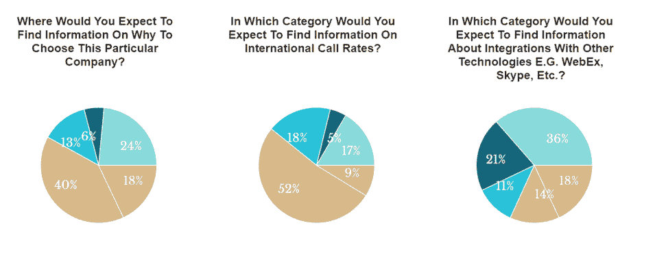

Where to find answers to specific questions

如果有一半的访问者找不到他们要找的页面，那就是一个巨大的 UX 问题。

这将导致更高的[跳出率](https://kinsta.com/blog/how-to-reduce-bounce-rate/)，更少的现场时间，[更低的转化率](https://kinsta.com/blog/conversion-rate-optimization-tips/)。

如果你正在[管理一家电子商务商店](https://kinsta.com/learn/woocommerce-guide/)，糟糕的导航也会对你的底线和收入产生负面影响。

在这篇文章中，我将从头到尾介绍网站导航。这意味着，你将学习最佳实践，不同类型的导航，以及如何为你的网站创建完美的导航。

开始吧！

 <kinsta-auto-toc heading="Table of Contents" exclude="last" list-style="arrow" selector="h2" count-number="-1">## 什么是网站导航？

网站导航是在互联网上导航页面、应用程序和网站的过程。其背后的技术被称为超文本或超媒体。

<link rel="stylesheet" href="https://kinsta.com/wp-content/themes/kinsta/dist/components/ctas/cta-mini.css?ver=2e932b8aba3918bfb818">

> Kinsta 把我宠坏了，所以我现在要求每个供应商都提供这样的服务。我们还试图通过我们的 SaaS 工具支持达到这一水平。
> 
> <footer class="wp-block-kinsta-client-quote__footer">
> 
> 
> 
> <cite class="wp-block-kinsta-client-quote__cite">Suganthan Mohanadasan from @Suganthanmn</cite></footer>

[View plans](https://kinsta.com/plans/)

超文本或媒体是基于文本的网页，使用超链接将它们连接到互联网上的其他页面。一个[超链接](https://techterms.com/definition/hyperlink)是一个链接，将你的网络浏览器导向一个 URL。

URL 指示浏览器应该从服务器访问哪个文件，它下载并呈现数据，以便用户可以看到它。

[内部链接](https://kinsta.com/blog/google-sitelinks/#6-build-internal-links)通向同一个域的不同页面。外部链接指向另一个[域名](https://kinsta.com/blog/how-much-does-a-domain-name-cost/)上的不同页面，一个完全独立的网站和服务器。

网站导航使用带有内部链接的菜单，这使得访问者很容易找到他们正在寻找的页面。良好的导航是用户友好网站的基本要素。
<kinsta-advanced-cta language="en_US" type-int-post="66857" type-int-position="0"></kinsta-advanced-cta>

### 什么是网站导航菜单？

一个[网站导航菜单](https://kinsta.com/blog/web-design-best-practices/#navigational-menu)是一组链接，通常指向内部页面，被组织成一个菜单。大多数网站，包括我们自己的网站，都在网站顶部有一个菜单。

Kinsta header menu

这个部分在网页设计与开发中被称为网站的“页眉”。这些菜单中链接到的一些最常见的页面是:

*   关于我们。
*   博客。
*   接触。
*   特色。
*   计划/定价。

当然，该菜单还可以包括到其他页面的链接。

### 一个网站的导航结构是怎样的？

网站的导航结构描述了网站上不同的页面是如何组织和相互连接的。

例如，有些页面和内容只能通过访问特定页面才能到达。设计师和网站开发人员在制作一个新网站时，通常会规划导航结构。

Website navigation structure

在这个例子中，关于、**计划**、**联系人**和**博客**页面被从主页菜单链接到。要访问**任务**和**团队**页面，您需要先访问**关于**页面。

### 为什么导航在网站上很重要？

在这篇文章的介绍中，你了解到 50%的互联网用户不能正确使用标准菜单。想象一下，没有导航，很少有人会找到正确的内容。

通过正确的导航和菜单方法，你可以将百分比降低到 50%以下。这将降低你的跳出率，增加你在网站上的平均时间，并带来更多的流量、线索和客户。

[不要让你的访客迷路🔎在本指南中，我们将分享你需要知道的关于网站导航的一切，以及为什么它是网站成功的关键！ 点击推文](https://twitter.com/intent/tweet?url=https%3A%2F%2Fbit.ly%2F3ilFwPL&via=kinsta&text=Don%27t+let+your+visitors+get+lost+%F0%9F%94%8E+We%27re+sharing+everything+you+need+to+know+about+website+navigation+and+why+it%27s+key+for+site+success+in+this+guide%21&hashtags=ux%2Cwebsite)
<kinsta-advanced-cta language="en_US" type-int-post="66857" type-int-position="1"></kinsta-advanced-cta>

## 网络导航的类型

网站导航主要有三种类型。它们是:

 <kinsta-auto-toc list-style="decimal" selector="h3" count-number="3" sub-toc="true">当组合正确时，它们可以帮助你的访问者浏览你的网站，毫无问题地找到他们的目的地。让我们仔细看看每一个。

### 1.全球网站导航

使用全球网站导航，网站的所有页面上的菜单和链接都是相同的。许多现代菜单都是这样设计的，包括我们在 Kinsta 的网站菜单:如果你向下滚动页面，菜单就会“跟着”移动。

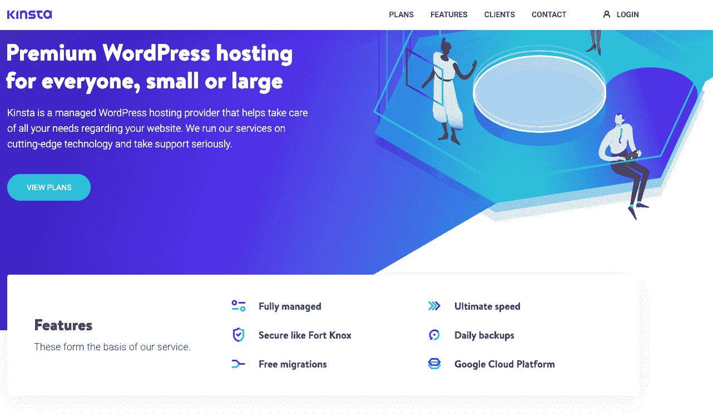

Kinsta global header menu

在截图中，你可以看到我们简单易懂的标题菜单。它在我们所有的页面上都是一样的，并引导我们进入一些最重要的页面和内容。

我们知道潜在客户在做出决定之前想要了解的关于托管公司的重要信息。这就是我们让潜在客户轻松找到我们的计划、功能并联系我们的原因。对于现有用户，我们有登录选项，让他们登录到他们的 [MyKinsta 仪表板](https://kinsta.com/mykinsta)。

### 信息

想先睹为快看看 MyKinsta 长什么样吗？[100%免费创建您的模拟帐户](https://demo.kinsta.com/register),开始玩吧。

我们的页脚菜单也是全球性的，突出了我们网站的重要部分和一些特色内容。

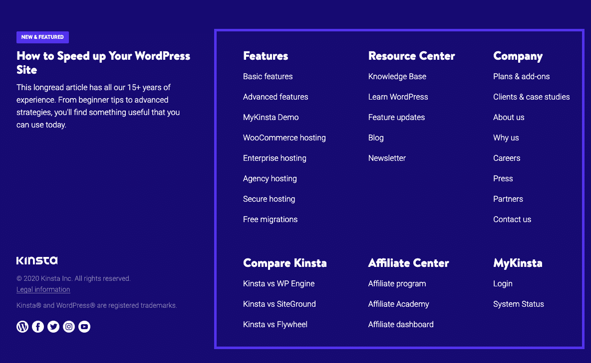

Footer menu

全局菜单是大多数现成 CMS 解决方案的标准。

每个 WordPress 主题都允许你为导航菜单添加不同的类型和区域。如果你需要更多，你可以使用[菜单插件](https://kinsta.com/blog/wordpress-menu-plugins/)来获得更多选项。

### 2.分级网站导航

分层导航意味着菜单会根据每个页面的上下文而变化。

大多数报纸和纯粹基于内容的网站都以分级导航为特色。例如，如果您访问一份报纸的首页，通常会在标题菜单中看到指向热门新闻类别的链接。

Example of hierarchical navigation from the NYT

如果菜单是全局的，在点击不同的类别后，它将保持不变。但是因为它是分层的，它显示了新的链接，这些链接指向我们访问的类别页面的子类别。

Hierarchical navigation example

在《纽约时报》的**科学**页面上，你根本看不到顶级菜单。相反，你会看到科学研究和文章的不同分支的链接。

这一变化是这个菜单与大多数小网站上常见的全局菜单的区别。

### 3.本地网站导航

与层次导航和全局导航相比，本地网站导航指的是包含在内容本身中的内部链接。通常，用户可以在同一层级或更深一级获得选项，或者获得导航到其他相关页面的链接。

一个很好的例子是杂志网站，它们经常使用链接来帮助读者探索某篇文章的深层背景。如果他们提到他们过去报道过的事件，他们会链接到那篇文章，而不是深入解释。

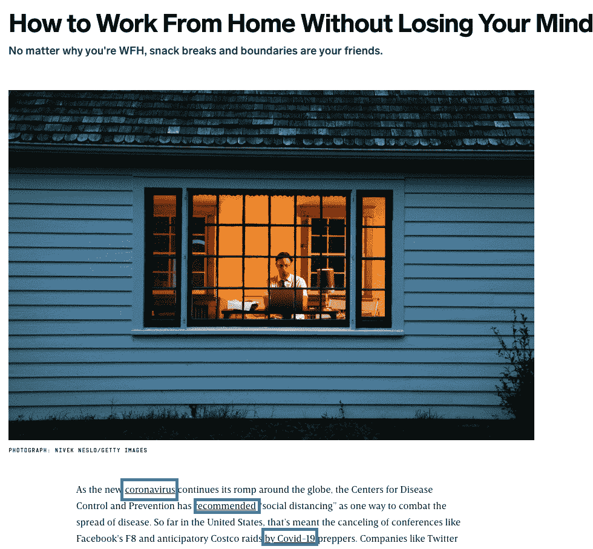

Example of related content linked on a page

但这不仅仅是杂志和新闻网站的专利。电子商务商店非常依赖这种导航菜单来展示同类产品。

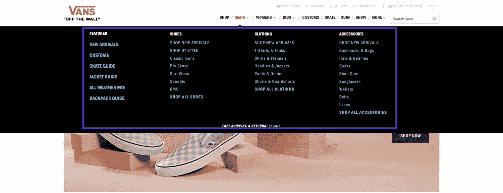

Example of local navigation in ecommerce

一般来说，内部链接也是 SEO 的一个重要方面，更具体地说，是 SEO 的一个重要方面，所以它现在是任何网站管理者的标准做法。
<kinsta-advanced-cta language="en_US" type-int-post="66857" type-int-position="2"></kinsta-advanced-cta>

## 网站导航示例

与其喋喋不休地谈论理论，不如让我们深入研究一些例子。我会报道一个新闻网站和 [Twenty Twenty WordPress 主题](https://kinsta.com/blog/twenty-twenty-theme/)。

### 新闻网站:纽约时报

NYT homepage menu

乍一看，《纽约时报》似乎主要使用了一个单一的全球标题菜单。

但这还没有结束。NYT 在其数百个类别页面和数百万篇文章中使用了所有类型的导航。

**使用的导航类型:**

*   等级制度。
*   全球。
*   本地的。

让我们看看每个页面不同的标题导航。

#### 主页

在其网站的标题部分，它包括两个菜单，一个可扩展的全局菜单在徽标上方，一个层次菜单在标题下方。本质上，它就像一个标题和子标题菜单设置。

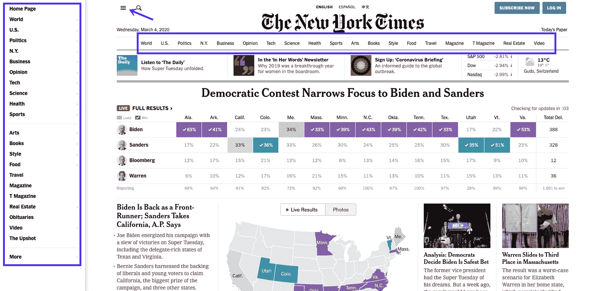

NYT homepage – header menus

如果你展开标题汉堡菜单，它会变成左手边的边栏，在这里有一个与大多数现代分辨率相当大的空白。

它不会模糊/使用覆盖来隐藏网站上的任何内容。

#### 主页(手机)

让我们来看看移动设备上的相同标题部分。大多数互联网用户通过智能手机访问新闻网站，因此移动体验可能比桌面体验更重要。

NYT homepage – mobile

新闻分类子标题菜单不是手机主页的一部分。相反，您只有可扩展选项可用。

展开后成为全屏菜单，完全覆盖主页上的所有内容。

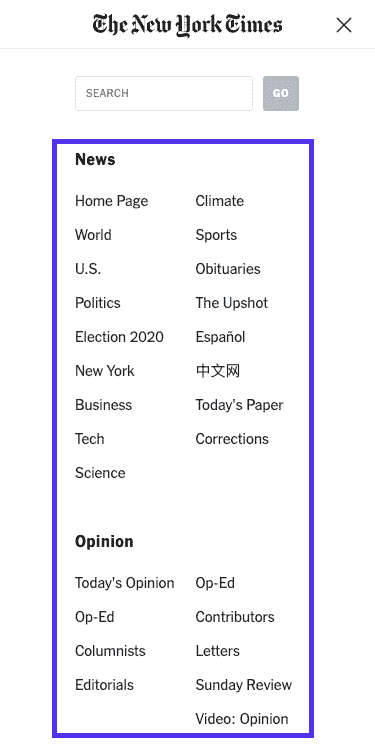

Expanded menu – NYT homepage (mobile)

它包括台式电脑主菜单上的每一个选项，并且链接都是按类别整齐地组织起来的。

#### 类别页面

在类别页面上，在标题 hamburger menu 的下方，您会看到一个链接，指向类别的进一步子集。

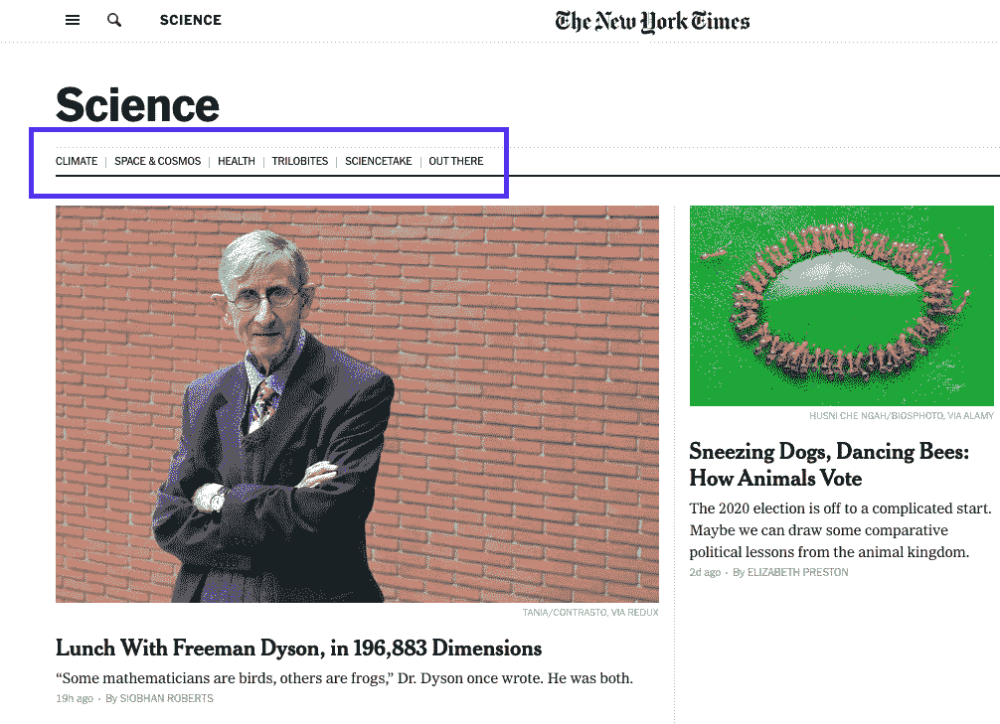

NYT science page – main menu

它让那些只对更广泛的主题中的特定领域感兴趣的人更容易找到可能与他们的兴趣更一致的文章。

#### 类别页面(手机)

在手机上，这些分类页面包括与桌面版本相同的标题汉堡菜单和结构。二级标题菜单一点也不隐藏，使导航和内容发现更容易。

NYT science page – main menu (mobile)

另一个原因可能是，许多移动体验是通过搜索或社交媒体开始的，而不是直接访问 NYT 主页。

#### 单篇文章

对于单篇文章，浮动标题指示您当前所在的部分，但它只具有可扩展的全局菜单(以及搜索框)。

NYT article – header menu

#### 单篇文章(手机)

在手机上，干净的导航被保持，因为唯一的菜单是标题汉堡菜单。

NYT article – header menu (mobile)

#### 页脚

NYT 页脚菜单在主页、分类页面和单篇文章中都是一样的。

 ## 注册订阅时事通讯

### 想知道我们是怎么让流量增长超过 1000%的吗？

加入 20，000 多名获得我们每周时事通讯和内部消息的人的行列吧！

[Subscribe Now](#newsletter)

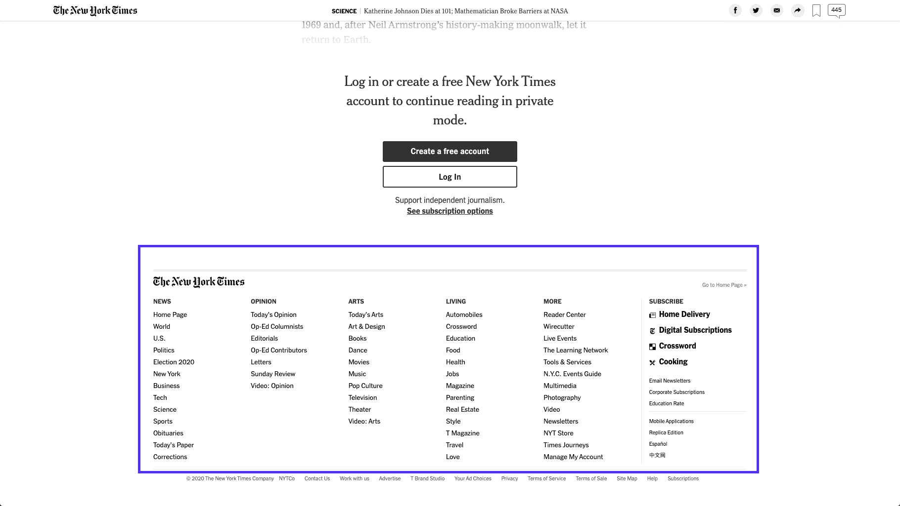

NYT article – footer menu

#### 页脚(移动)

NYT article – footer menu (mobile)

在手机上，页脚菜单只显示五个菜单项，点击后所有菜单项都会展开成子部分。

例如，如果您点击 **Arts** 部分，您将能够浏览这些子部分:

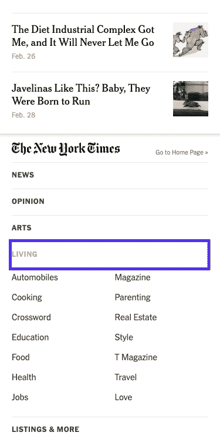

NYT article – footer menu expanded (mobile)

由于网站使用 JavaScript 在你向下滚动时动态加载更多的内容，看起来好像页脚根本不存在。

这是一个很好的技巧，可以帮助网站的时间，让读者阅读更多的文章，但它使网站更难导航。

#### 内容布局

有些人可能会认为，在线报纸和博客使用的主要导航工具不仅仅是菜单。正是报纸版面本身为 NYT 和其他类似的网站提供了导航主干。

NYT homepage

所有突出显示的元素都是可点击的，并会指向《纽约时报》网站内不同的内部页面。

内容布局是网站导航的另一个关键元素，他们在主页和分类页面上实现。

### 二十二十 WordPress 主题

又是一年，又是一个默认的 WordPress 主题。这次是[二十二十](https://kinsta.com/blog/twenty-twenty-theme/)，我们要深潜，看看导航有什么变化。

我会检查开发者决定如何处理 WordPress 最新实例的菜单和内部链接是否有任何不同。

#### 标题菜单

就像任何标准的主题一样，新的官方版本在标题部分有一个简洁的菜单。您可以选择不同的显示位置，这就是**桌面水平菜单**选项的外观:

Example of header menu in Twenty Twenty theme

另一方面，**桌面扩展菜单**选项将增加在右上角的对齐栏中扩展菜单链接的可能性。

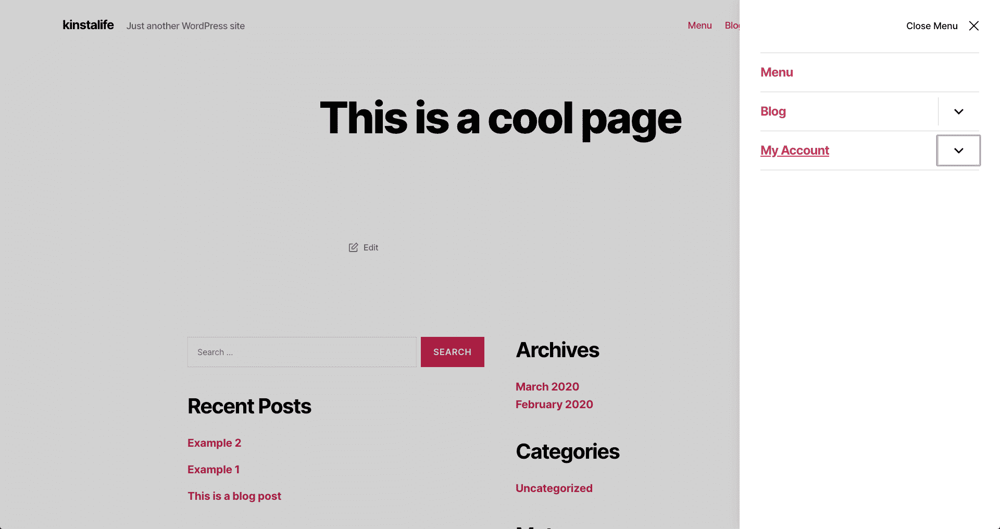

Example of expanded header menu in Twenty Twenty theme

主要内容区域是深灰色的，将用户的注意力吸引到链接的菜单上。

#### 页脚

Example of footer menu in Twenty Twenty theme

在页脚，没有内部导航的链接，除了一个简单的“到顶部”链接，让你回到页面的顶部。

## 什么是好的网站导航？

好的网站导航总是以用户为中心设计的。它使用清晰易懂的语言，并链接到最重要的页面。

它利用充足的空白空间、颜色变化或其他设计技术，将自己与主要内容清楚地分开。此外，它更易于在所有设备(移动设备和桌面设备)上阅读和使用。

以用户为中心的导航也意味着它是上下文相关的。它考虑了用户的体验和期望。这可能是为什么在线报纸仍然无法摆脱“拥挤”设计的原因。

在阅读报纸的背景下，这是他们的用户和潜在客户所期望的，这包括他们非常广泛的类别和子类别菜单。

你的新 WordPress 网站需要一流的、快速的、安全的主机吗？Kinsta 提供超快的服务器和来自 WordPress 专家的 24/7 世界级支持。[查看我们的计划](https://kinsta.com/plans/?in-article-cta)

在下一节，我将讲述如何为你的网站创建良好导航的基础知识。

## 改进网站导航的 8 条原则

即使你是一个完全的初学者，你也可以通过遵循下面的提示来为你的网站导航。

### 1.规划你的页面结构和导航

在你开始为你的网站写内容之前，先计划好你的页面结构和导航会是什么样子。

规划是为您的访问者提供满意的导航过程中的一个重要部分。你可以使用网站地图创建器来帮助你快速创建你想要的网站体验模型。

一个好的站点地图工具的例子是 GlooMaps。

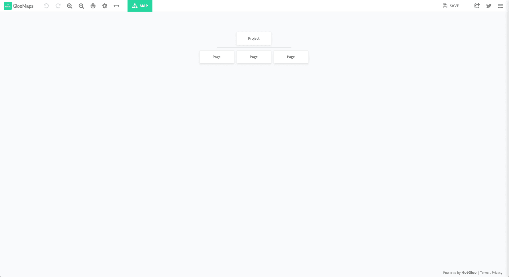

GlooMaps

您可以免费创建任意数量的文档。每个人都有一个独特的网址，你可以分享，收集反馈，让别人编辑。一旦创建，您的 URL 将在 14 天内有效，除非重新访问。每次新的访问都会将链接寿命延长 14 天。

GlooMaps 并不是你可以使用的唯一工具，还有很多类似于 [Octopus](https://octopus.do/) 、 [VisualSitemaps](https://visualsitemaps.com/) 、 [Creately](https://creately.com/lp/website-sitemap-creator-online/) 等等。

### 2.遵循既定标准

不要试图重新发明轮子。网站导航更多的是关于可用性而不是创造性。

对于基本的设计元素，如在哪里放置你的菜单，以及如何表明它是可扩展的，遵循[已知标准](https://kinsta.com/blog/web-design-best-practices/)。

三条水平条纹，或称[“汉堡包”☰标志](https://kinsta.com/blog/web-design-best-practices/#hamburger-menu)，是识别可扩展菜单最容易识别的图标之一。另一个是三个点形成一条水平线。

如果你试图发挥创意，开发一个自定义图标，很可能很多访问者不会理解你设计的目的，并且很难找到你的菜单。

### 3.使用用户的词汇

不要只是链接到相同的旧页面，使用标准的 web 开发行话，或者过度创造性的文案，而是使用更接近用户使用、搜索和想要的语言。

这种方法对 SEO 和可用性都有好处。创建反映用户在线搜索内容的页面。

然后你可以通过使用帮助用户在谷歌上找到你的网站的相同单词和短语[链接到那些相同的页面。](https://kinsta.com/blog/keyword-research/)

### 4.使用响应菜单

由于现在超过 52%的在线流量都是移动的，所以响应式/移动优先的设计已经成为一种绝对的必须。

不要让菜单在移动网络浏览器的框架外延续或者过于混乱，要确保你实现了可扩展的移动菜单。

它成为行业标准是有原因的。文本很小的水平菜单在手机上很难阅读、点击和正确使用。

好消息是所有最好的 WordPress 主题都默认带有[响应式设计](https://kinsta.com/blog/responsive-web-design/)和响应式菜单。除非你是从零开始设计你的 WordPress 网站，否则 WordPress 已经帮你搞定了。

### 5.利用你的页脚菜单

持续阅读并滚动到网站底部的读者比普通用户更积极。利用这一点，利用每页底部的空间突出有价值的内容。

由于[页脚没有占用“折叠上方”的空间](https://kinsta.com/blog/web-design-best-practices/#web-best-designformatting-practices)，你可以细化并包含多个类别，甚至突出重要的基础页面或文章。

作为一个例子，看看我们如何在这个页面上处理我们的页脚。我们涵盖了基本的功能页，我们的公司，分解我们的资源，等等。

页脚可以让你突出显示你“放不下”的内容。

### 6.使用颜色和空白将导航与其他元素分开

[使用颜色、字体和空格](https://kinsta.com/blog/how-to-change-font-in-wordpress/)将你的菜单与你的主要内容和侧边栏分开。明确导航的起点和终点。

如果你的网站访问者甚至不能在第一时间找到菜单，那么你在菜单中使用什么语言，或者你链接到哪个页面都没有关系。

### 7.避免下拉菜单

对于大多数网站(不是全部)，下拉菜单不是必要的或者有用的。当用户在菜单中看到一个链接时，假设它是可点击的。除非设计将它与可点击的链接分开，否则会导致混乱。

主菜单中有太多的链接也会对网站的可用性产生负面影响。

实现分层和局部导航来代替下拉菜单可以使用户流程更加顺畅。它还允许用户与多个页面进行交互，在你的网站上花更多的时间，而不是浏览一个巨大的链接列表。

### 8.扁平化你的结构

如果你想让访问者尽可能容易地浏览你网站的所有页面，尽可能保持一个扁平的导航结构。

不要从你的主页链接到几个页面，然后扩展更多的子页面和类别，保持简单。

确保从你的主页链接到重要的类别，并从那里链接到一个单独的子类别或单篇文章页面。

Flat website structure

有证据表明，[以这种方式扁平化结构](https://searchengineland.com/seo-benefits-developing-solid-site-structure-277456)对 SEO 有积极的影响，并能导致[谷歌网站链接](https://kinsta.com/blog/google-sitelinks/)。所以不要让你的网站结构变得太乱！

## 网站导航菜单趋势 2022

虽然近年来更广泛的网页设计趋势包括 3D 设计元素和将量身定制的照片融入创意设计，但菜单并没有令人兴奋的一年。

但这并不意味着一切都没有改变。以下是我们对过去几年中一些最重要的菜单趋势的快速回顾。

### 全屏移动菜单中的可扩展类别

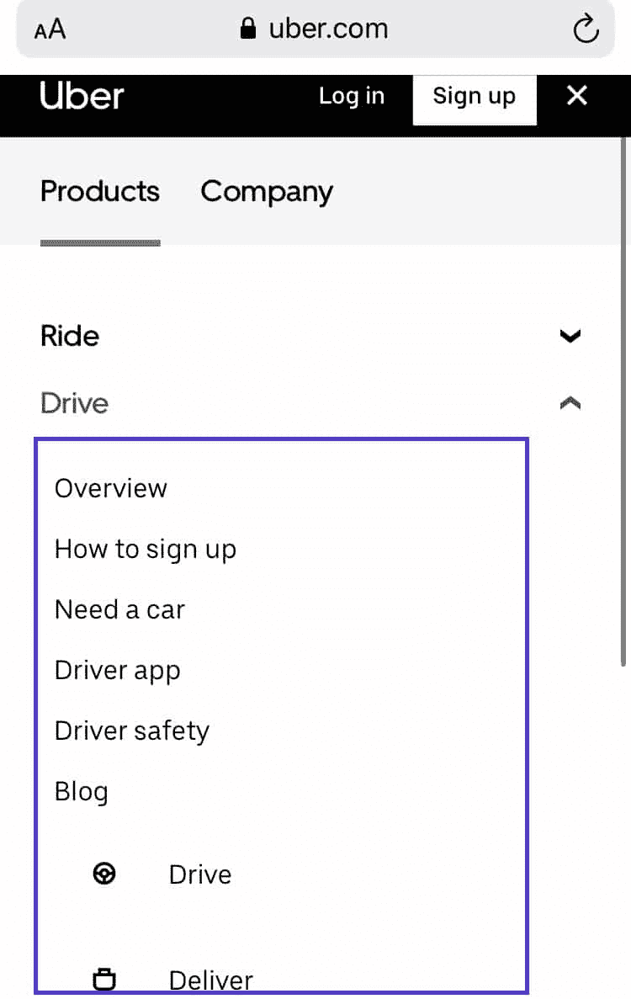

Uber – menu mobile

优步和其他拥有改良的现代设计的大公司已经更新了他们的菜单，使其更加实用。

这些企业面临的一个问题是，他们有太多不同的产品和类别，不可能明智地将它们包含在一个菜单中。

这导致了清晰、分类的可扩展移动菜单，而不仅仅是一个无止境的链接列表。

### 浮动标题菜单

也许过去几年菜单的普遍趋势是浮动标题菜单。

浮动标题菜单是指当你向下滚动页面时，它会一直显示在浏览器窗口的顶部(就像我们在 kinsta.com 上使用的那样)。通常它是标题部分的一部分，包括一个小图标，也可能是一个搜索栏。

很难否认这一点，因为持续访问菜单使得内部导航变得更加容易。这种类型的菜单包含在许多 WordPress 主题中，而且这种趋势没有停止的迹象。

### 桌面上覆盖下拉菜单

关于网站导航的一些最基本的建议是远离下拉菜单。出于某种原因。

但这并不意味着他们天生就很可怕。下拉菜单很难在电脑屏幕上实现。

通过在主要内容上叠加颜色，他们可以将用户的注意力 100%集中到菜单上。对于可扩展的类别，你也有比在鼠标悬停时显示更多链接更好的选择。

这些因素汇集在一起，使其成为 2019 年的增长趋势。事实上，许多创新的网站和模板都在桌面上包含了下拉菜单。

[Higher bounce rates, lower conversion rates, less time on the site... website navigation is an essential part of UX 💻 Learn how to improve yours with this guide ⚡️Click to Tweet](https://twitter.com/intent/tweet?url=https%3A%2F%2Fbit.ly%2F3ilFwPL&via=kinsta&text=Higher+bounce+rates%2C+lower+conversion+rates%2C+less+time+on+the+site...+website+navigation+is+an+essential+part+of+UX+%F0%9F%92%BB+Learn+how+to+improve+yours+with+this+guide+%E2%9A%A1%EF%B8%8F&hashtags=ux%2Cwebsite)

## 摘要

这篇文章应该已经让你清楚地了解了什么是网站导航，以及它的一些要点。

网站导航应该总是专注于简单、清晰，而不是强烈的色彩和创造性的设计。由于你的网站的导航和菜单需要考虑桌面和移动用户，事情会变得更加棘手，雇佣一个网络开发人员可能是个好主意。

始终尝试遵循[网站菜单设计最佳实践](https://kinsta.com/blog/web-design-best-practices/#menu-navigation)来确保你的访客和[搜索引擎](https://kinsta.com/blog/alternative-search-engines/)可以轻松浏览你的内容。

可用性和清晰性将继续是未来发展的重点。因此，如果你能掌握用户的语言，并创建一个对他们有意义的结构，你就能让你的菜单经得起未来的考验。

* * *

让你所有的[应用程序](https://kinsta.com/application-hosting/)、[数据库](https://kinsta.com/database-hosting/)和 [WordPress 网站](https://kinsta.com/wordpress-hosting/)在线并在一个屋檐下。我们功能丰富的高性能云平台包括:

*   在 MyKinsta 仪表盘中轻松设置和管理
*   24/7 专家支持
*   最好的谷歌云平台硬件和网络，由 Kubernetes 提供最大的可扩展性
*   面向速度和安全性的企业级 Cloudflare 集成
*   全球受众覆盖全球多达 35 个数据中心和 275 多个 pop

在第一个月使用托管的[应用程序或托管](https://kinsta.com/application-hosting/)的[数据库，您可以享受 20 美元的优惠，亲自测试一下。探索我们的](https://kinsta.com/database-hosting/)[计划](https://kinsta.com/plans/)或[与销售人员交谈](https://kinsta.com/contact-us/)以找到最适合您的方式。</kinsta-auto-toc></kinsta-auto-toc>