# 如何降级你的 WordPress 站点(解决插件和主题问题)

> 原文:[https://kinsta.com/blog/downgrade-wordpress/](https://kinsta.com/blog/downgrade-wordpress/)

在最新的可用版本上运行你的 WordPress 安装、插件和主题是使用这个平台的一个至关重要的最佳实践。还建议使用 PHP 的最新版本[。然而，在某些情况下，这样做是不明智或不可能的。](https://kinsta.com/knowledgebase/how-to-update-php-in-wordpress/)

如果你发现自己处于这种情况，你可能需要撤销一个更新，并且**降级你的 WordPress 站点**(或者它的一部分)。幸运的是，有方法可以回滚网站的每个元素。

这篇文章将解释为什么你可能需要降级 WordPress，以及如何安全地降级。我们将涵盖恢复 WordPress 的先前[版本，以及回滚插件、主题和 PHP。](https://kinsta.com/knowledgebase/check-wordpress-version/)

我们开始吧！

### 更喜欢看[视频版](https://www.youtube.com/watch?v=0Tq_JPAmoPg)？

## 为什么你可能想降级你的 WordPress 版本或其他功能

运行最新版本的 WordPress 内核(在我们的例子中是 T2 的 WordPress 5.5(T3))，插件和主题是维护你的网站最重要的步骤之一。这些更新通常包括安全修补程序，这些修补程序对于防止恶意攻击您的站点至关重要，并且可以增强性能和功能。

出于这个原因，**我们不建议永久降级 WordPress** 或它的任何组件**。但是，在某些情况下，您可能希望暂时这样做。**

 **最常见的原因是由于插件或主题冲突。例如，如果你的网站的一个元素与 WordPress core 的最新版本不兼容，当你处理一个长期的解决方案时，降级你的安装可以让访问者访问这个特性。

(建议阅读:[如何修复“网站遇到技术困难。”WordPress](https://kinsta.com/knowledgebase/the-site-is-experiencing-technical-difficulties/) 出错。

如果冲突发生在两个插件之间，或者一个插件和你的主题之间，降级 WordPress 本身是没有帮助的。相反，你需要回滚导致问题的插件或主题的版本，以便让你的站点重新启动并运行。

此外，一些旧的插件和主题可能与 PHP 的新[版本不兼容。如果有问题的插件或主题对你网站的功能至关重要，你可能会想降级 PHP 一段时间，而你找到一个替代的解决方案。](https://kinsta.com/blog/php-versions/)

简而言之，降级 WordPress 应该是[一个临时的故障排除程序](https://kinsta.com/blog/wordpress-maintenance-mode/)。一旦你替换了有问题的插件或主题，或者解决了导致网站冲突的问题，你会想再次更新你的网站。

推荐阅读:这里有一个精选的列表，列出了[最佳 WordPress 主题](https://kinsta.com/best-wordpress-themes/)和[最佳插件](https://kinsta.com/best-wordpress-plugins/)。

## 如何降级你的 WordPress 网站(6 种方法)

降低你的 WordPress 站点等级的过程将取决于你想要完成的目标。你可能会发现你需要[恢复整个网站](https://kinsta.com/blog/restore-wordpress-from-backup/)的先前版本，或者你只需要恢复一个单独的插件或主题，而不是 WordPress 本身。

记住这一点，这里有六种不同的方法可以回滚你的网站。每一种都解决了不同的需求，所以我们建议通读所有这些，看看哪一种最适合您的具体情况。

### 1.手动降级你的 WordPress 版本

如果你遇到严重的冲突，阻止你访问网站的后端，手动降级 WordPress 可能是你最好的或者唯一的选择。在你开始之前，为了安全起见，你需要备份你的站点。

接下来，您应该停用所有的插件。如果你有访问 WordPress 后台的权限，这很容易。只需选择每个插件旁边的复选框，并使用批量**停用**选项:

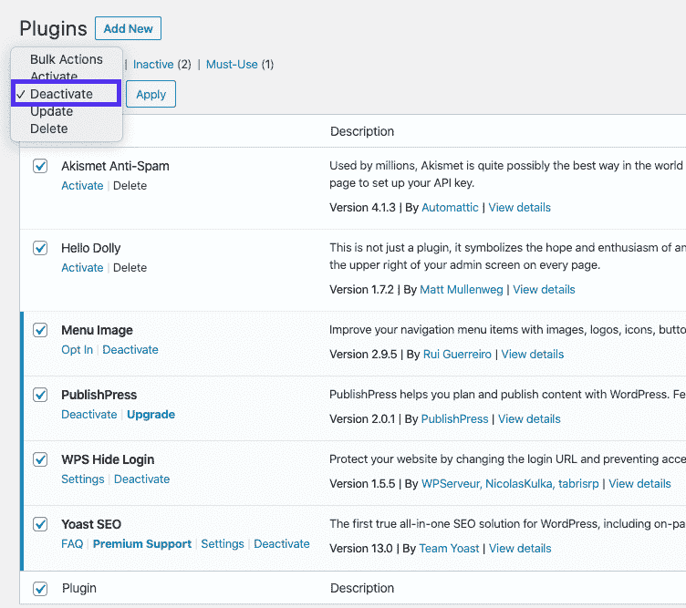

Bulk deactivating WordPress plugins on the backend

如果你不能访问你的仪表盘，你可以使用[安全文件传输协议(SFTP)](https://kinsta.com/knowledgebase/how-to-use-sftp/) 和客户端如 [FileZilla](https://kinsta.com/blog/best-ftp-clients/#Filezilla) 手动[关闭插件](https://kinsta.com/knowledgebase/disable-wordpress-plugins/)。在以后的步骤中，您还需要这些工具，所以如果您不熟悉它们，您可能需要花一点时间来了解它们是如何工作的。

然后你需要下载 WordPress 的[相关版本。我们建议使用可能的最新版本，这通常是第二个最新的版本。你可以在](https://kinsta.com/knowledgebase/check-wordpress-version/) [WordPress Release Archive](https://wordpress.org/download/releases/) 中访问你需要的文件:

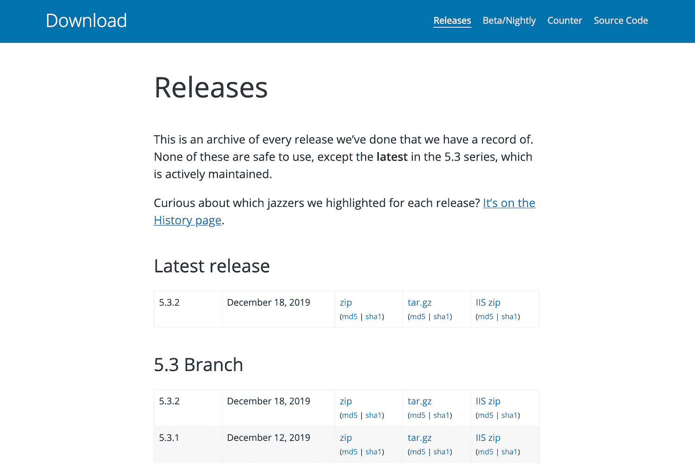

The WordPress Release Archive

然后，使用 FTP 和 FileZilla(或另一个客户端)，访问你的站点文件并删除你的 **wp-admin** 和 **wp-includes** 目录:

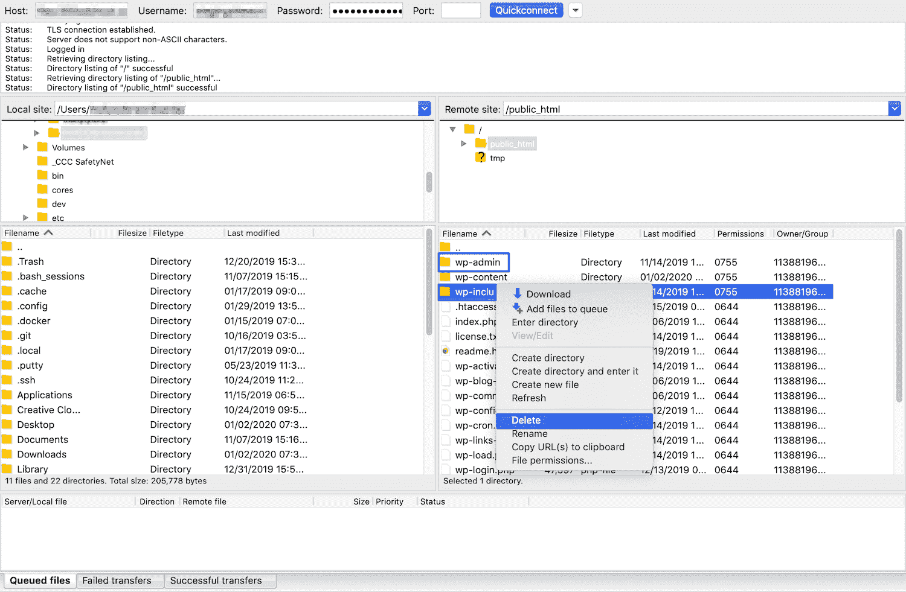

Deleting wp-admin and wp-includes via FTP

一旦完成，上传你想要安装的 WordPress 版本的所有文件，除了 **wp-content** 目录。当询问您是否要覆盖文件时，选择**覆盖>确定**:

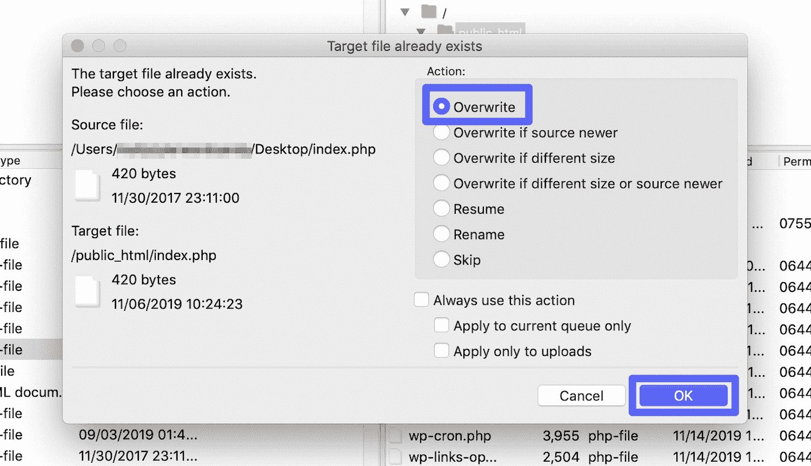

Overwriting files in FileZilla

然后，导航到你的网站后端。您可能会看到一条消息，要求您更新数据库。如果是，点击**更新 WordPress 数据库**提示。之后，[照常登录你的站点](https://kinsta.com/blog/wordpress-login-url/)。

你现在应该可以访问，并且运行旧版本的 WordPress:

A downgraded WordPress installation

此时，您可以重新激活您的插件并着手解决最初的冲突。

你可能也想[禁用自动更新](https://kinsta.com/blog/wordpress-automatic-updates/)，以防止 WordPress 同时安装另一个版本。当你的问题解决后，你可以从仪表盘上的**更新**窗口返回到 WordPress 的最新版本。

### 2.使用 WP 降级来运行以前版本的 WordPress

如果你对 FTP 和删除核心文件的想法感到不舒服，有*是*一个可以降级 WordPress 的插件。如果你喜欢这个想法，在备份你的站点后，继续安装 [WP 降级](https://wordpress.org/plugins/wp-downgrade/)T4:

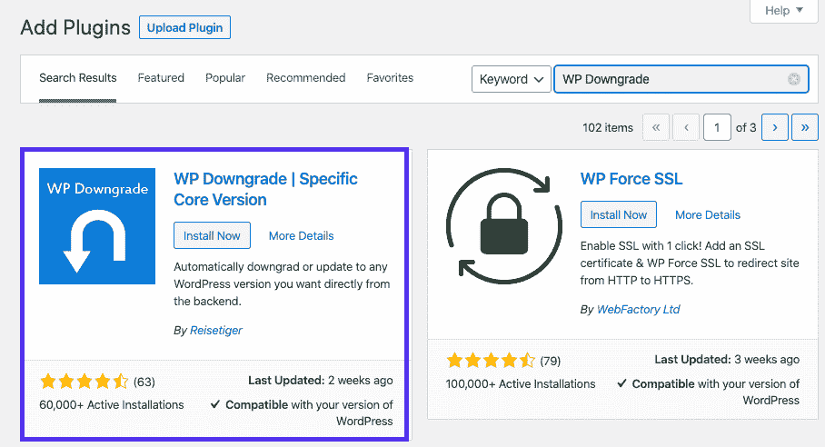

Installing WP Downgrade plugin

然后，导航到**设置> WP 降级**，在相关字段输入你的目标 WordPress 版本:

Setting the WordPress target version

点击**保存更改**，然后转到**更新**屏幕。你会看到你的目标版本现在被列为“WordPress 的最新版本”:

Re-installing WordPress 5.0

点击**立即重新安装**按钮完成降级。WordPress 将运行一个正常的更新，然后你会看到你的目标版本的欢迎信息:

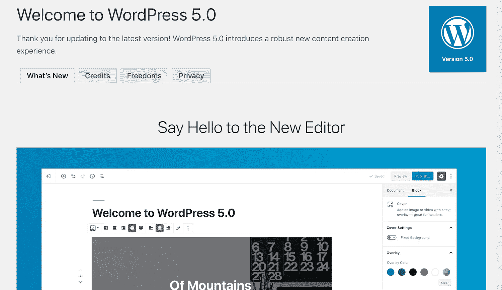

The WordPress 5.0 welcome message

一旦你排除了故障，要重新安装 WordPress 的最新版本，你需要返回**设置> WP 降级**。您可以将您的目标版本更改回最新的更新，然后重复上述过程。

### 3.还原以前的备份以撤消对网站的更改

另一种降级你的站点的方法是从你的站点运行 WordPress 早期版本的时候恢复一个备份。当然，为了实现这一点，你需要有一个可靠的备份系统。

## 注册订阅时事通讯

### 想知道我们是怎么让流量增长超过 1000%的吗？

加入 20，000 多名获得我们每周时事通讯和内部消息的人的行列吧！

[Subscribe Now](#newsletter)

您还需要确保正在恢复的站点副本没有丢失任何最近添加的关键内容。你不想在试图降级 WordPress 的时候无意中丢失你最新的帖子。如果你的网站是高度动态的，这可能不是最好的选择。

如果您选择继续，[恢复您的备份](https://kinsta.com/blog/restore-wordpress-from-backup/)的过程将根据您用来创建和存储文件的系统而有所不同。例如，Kinsta 客户可以利用我们的一键式恢复流程。只需登录您的 [MyKinsta 仪表盘](https://my.kinsta.com/)即可开始，点击**站点**:

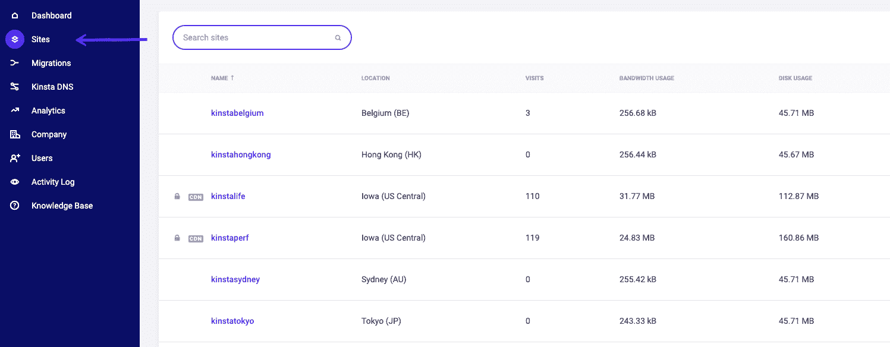

The MyKinsta Dashboard

从列表中选择你想要恢复的 WordPress 站点。然后导航到**备份**选项卡:

MyKinsta site backups

点击**恢复到**下拉菜单。如果您希望在转移环境中测试备份，可以在此处进行。要将你的 live 站点降级到备份文件中的 WordPress 版本，选择 **Live** :

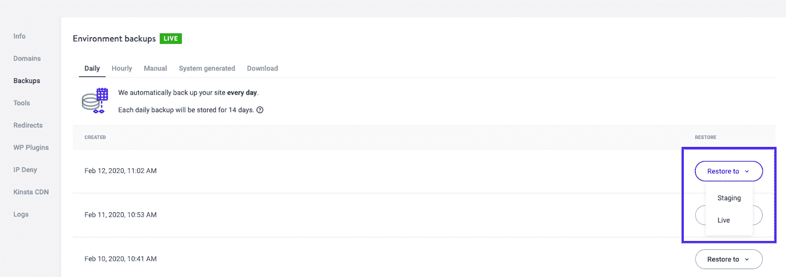

MyKinsta backup restoration options

为了防止意外恢复，我们需要在恢复您的实时站点之前执行最后一个步骤。在相关字段中输入您网站的名称，然后点击**恢复备份**以确认并开始该过程:

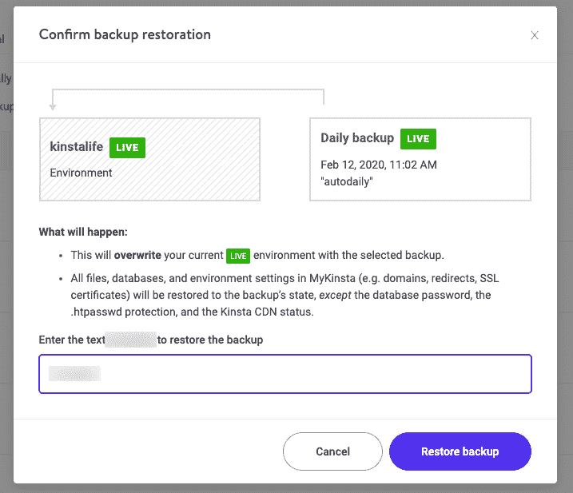

Restoring backups through MyKinsta

恢复过程可能需要一段时间才能完成。一旦完成，你就可以重新访问你的网站的后端。我们还会在恢复之前为您的站点创建一个备份，以防您需要撤销该过程。

### 4.手动降级插件或主题

如果你需要降级一个插件或主题，而不是 WordPress 核心，你可以使用类似于方法 1 的过程手动完成。首先，你需要为你想降级的旧版本插件或主题检索文件。

对于 [WordPress 目录](https://kinsta.com/blog/wordpress-statistics/#plugins-statistics)中的插件，你可以通过点击功能页面上的**高级视图**找到旧版本:

The Advanced View link on a plugin page in the WordPress Directory

滚动到页面底部，然后从下拉菜单中选择您需要的版本，并点击**下载**:

Downloading a previous version of a plugin via the WordPress Plugin directory

解压文件并保存到你的电脑上。然后为你的网站做一个备份以防万一，并使用 FTP 和你的首选客户端连接到你的服务器。在那里，导航到**WP-内容>插件**。

厌倦了体验你的 WordPress 网站的问题？通过 Kinsta 获得最好、最快的主机支持！[查看我们的计划](https://kinsta.com/plans/?in-article-cta)

接下来，您需要为插件的现有版本重命名目录。然后上传您希望降级到的先前版本的文件夹:

Uploading an old version of a plugin via FTP

这应该可以成功恢复您需要的插件的旧版本。此外，您可以随时获得最新版本，这样当您准备好的时候就可以切换回最新版本。

不幸的是，这种方法对于主题和高级插件来说变得更加棘手。回滚它们的过程或多或少是相同的，但是 [WordPress 主题目录](https://wordpress.org/themes/)没有以前的版本可供下载。

至于高级插件，以前的版本可能容易获得，也可能不容易获得。如果你找不到你需要的插件或主题版本，你最好的办法是联系开发者寻求帮助。

### 5.WP 回滚插件和主题更新

幸运的是，有一个更简单的方法来降低插件和主题的等级。你需要做的就是安装并激活 [WP 回滚](https://kinsta.com/knowledgebase/download-older-versions-of-wordpress-plugins/#rollback):

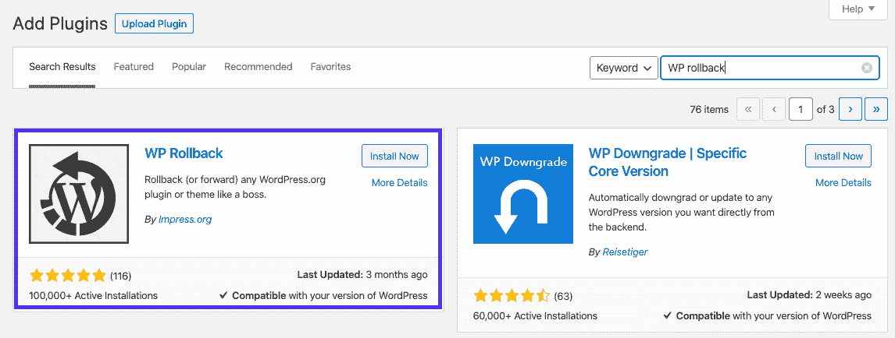

Installing WP Rollback plugin

这个插件定期更新，在 WordPress 插件目录中有令人印象深刻的五星评级。一旦它启动并运行，导航到您的**插件**列表。

现在你会在每个插件的标题下看到一个**回滚**按钮，旁边是标准选项:

The rollback option enabled

如果您点击这个新选项，您将被重定向到一个页面，在那里您可以选择您的目标版本。然后选择**回滚**按钮开始降级过程:

Selecting a plugin rollback target version

回滚主题也同样简单。在您的仪表板中导航到**外观>主题**，并选择您想要降级的主题。现在在窗口的底部会有一个**回滚**按钮:

Rolling back a WordPress theme

在接下来的屏幕上，您可以选择您的目标版本并启动降级过程，就像您对插件所做的那样。当你需要恢复插件或者主题的时候，你可以从相关的目录中恢复。

### 6.恢复到 PHP 的旧版本

2019 年，WordPress 对其 PHP 要求做了一些修改。出于这个原因，以及使用最新版本的诸多[好处，升级你网站的 PHP 总是被推荐的。](https://kinsta.com/blog/php-7-4/)

然而，一些没有得到很好维护的旧插件可能与新版本的 PHP 不兼容。理想情况下，您将始终使用从开发人员那里获得定期更新和支持的工具。

然而，如果你有一个对你网站功能至关重要的[过期插件](https://kinsta.com/blog/wordpress-security/#is-wordpress-secure)，但不能与最新版本的 PHP 兼容，你*可以*进行降级。Kinsta 客户的优势是能够从他们的 MyKinsta 仪表板轻松切换 PHP 版本。

为此，请登录您的帐户。导航到**站点**，选择你想要降级 PHP 的站点，然后点击**工具**标签，向下滚动到 **PHP 引擎**:

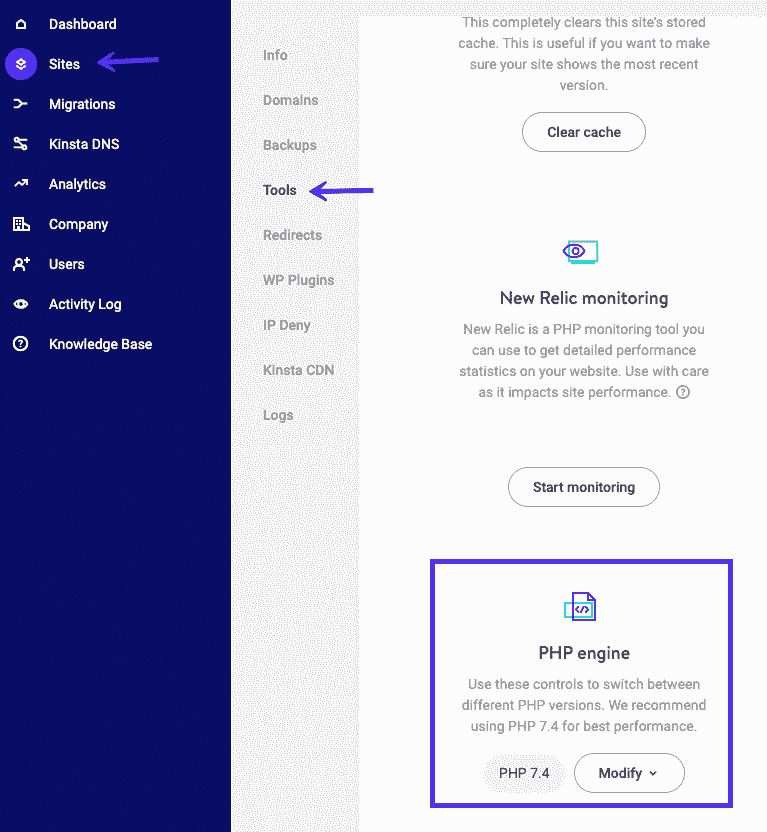

PHP engine in MyKinsta

使用**修改**下拉菜单选择您需要的版本:

Selecting a PHP version in the MyKinsta dashboard

在出现的窗口中，点击**修改 PHP 版本**以启动该过程:

Confirming a PHP version downgrade

如果你不是 Kinsta 的客户，或者你需要[安装比通过 PHP 引擎功能获得的版本更老的 PHP](https://kinsta.com/blog/install-php/) ，你需要[使用命令行](https://webdock.io/en/docs/perfect-server-stacks/upgrading-or-downgrading-php-versions)降级 PHP。

这个过程更高级，风险也更大。在这种情况下，最好考虑立即替换有问题的插件或主题，而不是降级 PHP 并尝试进一步解决冲突。

## 摘要

当[对你的站点](https://kinsta.com/help/mykinsta-analytics/)进行故障排除或执行其他关键任务时，有时降级 WordPress 是必要的。虽然没有实现这个目标的本地特性，但是有几种方法可以恢复到站点的以前版本。

这篇博客文章涵盖了降低你的 WordPress 站点及其各种元素的六种不同方法:

1.  手动降级你的 WordPress 站点。
2.  使用 WP 降级运行以前版本的 WordPress。
3.  还原以前的备份以撤消对网站的更改。
4.  手动降级插件或主题。
5.  WP 回滚插件和主题更新。
6.  恢复到 PHP 的旧版本。

你对 WordPress 降级有什么疑问吗？请在下面的评论区提问！

* * *

让你所有的[应用程序](https://kinsta.com/application-hosting/)、[数据库](https://kinsta.com/database-hosting/)和 [WordPress 网站](https://kinsta.com/wordpress-hosting/)在线并在一个屋檐下。我们功能丰富的高性能云平台包括:

*   在 MyKinsta 仪表盘中轻松设置和管理
*   24/7 专家支持
*   最好的谷歌云平台硬件和网络，由 Kubernetes 提供最大的可扩展性
*   面向速度和安全性的企业级 Cloudflare 集成
*   全球受众覆盖全球多达 35 个数据中心和 275 多个 pop

在第一个月使用托管的[应用程序或托管](https://kinsta.com/application-hosting/)的[数据库，您可以享受 20 美元的优惠，亲自测试一下。探索我们的](https://kinsta.com/database-hosting/)[计划](https://kinsta.com/plans/)或[与销售人员交谈](https://kinsta.com/contact-us/)以找到最适合您的方式。**