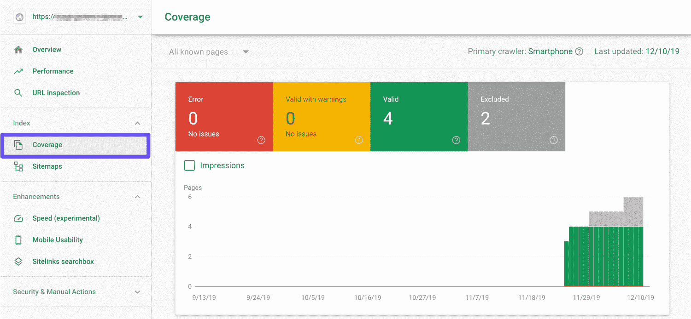
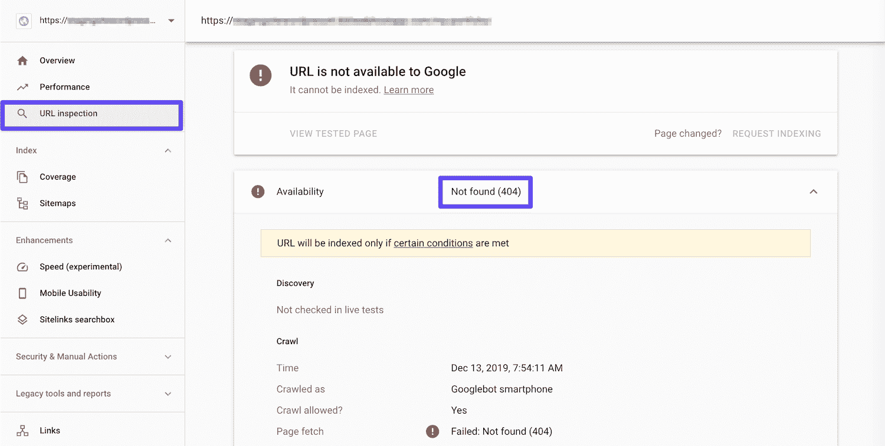
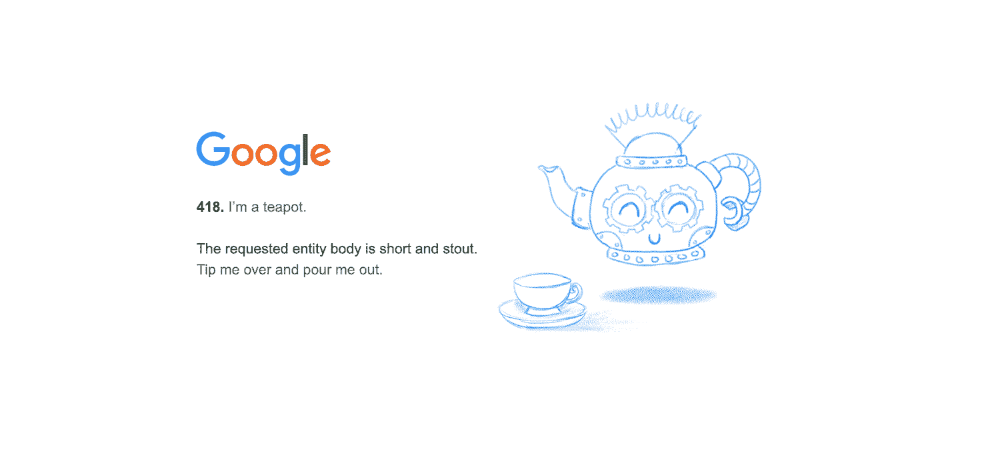

# HTTP 状态代码的完整指南和列表

> 原文:[https://kinsta.com/blog/http-status-codes/](https://kinsta.com/blog/http-status-codes/)

HTTP 状态代码就像来自服务器的短消息，被钉在网页上。它们实际上并不是[网站内容](https://kinsta.com/blog/evergreen-content/)的一部分。相反，它们是来自服务器的消息，让您知道当它接收到查看某个页面的请求时事情是如何进行的。

每当您的浏览器与服务器交互时，都会返回这类消息，即使您看不到它们。如果你是一个网站的所有者或者开发者，理解 T2 HT T4 TP 状态码是至关重要的。当它们出现时，HTTP 状态代码对于诊断和修复网站配置错误是一个非常有用的工具。

本文介绍了几种服务器状态和错误代码，并解释了它们揭示了服务器幕后发生的事情。

让我们开始吧！

 ### 更喜欢看[视频版](https://www.youtube.com/watch?v=jTo8U2WeQl8)？

## 什么是 HTTP 状态代码？

每当你点击一个链接或输入一个网址并按下 **Enter** 键，你的浏览器就会向[网络服务器](https://kinsta.com/blog/nginx-vs-apache/)发送一个请求，请求你试图访问的网站。服务器接收并处理请求，然后连同 HTTP 头一起发回相关资源。

> 需要在这里大声喊出来。Kinsta 太神奇了，我用它做我的个人网站。支持是迅速和杰出的，他们的服务器是 WordPress 最快的。
> 
> <footer class="wp-block-kinsta-client-quote__footer">
> 
> 
> 
> <cite class="wp-block-kinsta-client-quote__cite">Phillip Stemann</cite></footer>

[View plans](https://kinsta.com/plans/)

HTTP 状态代码在 HTTP 头中发送到您的浏览器。虽然每次您的浏览器请求网页或资源时都会返回状态代码，但大多数时候您看不到它们。

通常只有当出现问题时，您才可能在浏览器中看到一个错误。这是服务器说:“有些事情不对劲。这里有一段代码解释了哪里出错了。”

Google 404 HTTP status code

如果您想查看浏览器通常不会显示的状态代码，有许多不同的工具可以轻松实现。浏览器扩展可用于 Chrome 和 Firefox 等开发人员友好的平台，并且有许多基于 web 的头部获取工具，如 [Web Sniffer](http://web-sniffer.net/) 。

要使用这些工具之一查看 HTTP 状态代码，请查找报告顶部附近显示“Status: HTTP/1.1”的行。随后是服务器返回的状态代码。

## 了解 HTTP 状态代码类

HTTP 状态代码分为 5 个“类”。这些是具有相似或相关含义的响应分组。知道它们是什么可以帮助你在开始查找状态码的具体含义之前，快速确定状态码的大致内容。

这五个类别包括:

*   **100s:** 表示浏览器发起的请求正在继续的信息代码。
*   **200s:** 服务器收到、理解并处理浏览器请求时返回成功代码。
*   **300s:** [当请求的资源被新资源替代时，返回重定向代码](https://kinsta.com/blog/wordpress-redirect/)。
*   **400s:** 客户端错误代码，指示请求存在[问题。](https://kinsta.com/knowledgebase/400-bad-request/)
*   **500s:** 服务器错误代码，表示请求被接受，但是[服务器上的错误](https://kinsta.com/blog/500-internal-server-error/)阻止了请求的实现。

在每一个类中，都存在各种服务器代码，并且可能由服务器返回。每个单独的代码都有特定和独特的含义，我们将在下面更全面的列表中介绍。

## 为什么 HTTP 状态代码和错误对搜索引擎优化(SEO)很重要

搜索引擎机器人在[抓取你的网站](https://kinsta.com/blog/wordpress-sitemap/)时会看到 HTTP 状态码。在某些情况下，这些信息会影响你的页面是否以及如何被索引，以及[搜索引擎](https://kinsta.com/blog/alternative-search-engines/)如何感知你网站的健康状况。

 ## 注册订阅时事通讯

### 想知道我们是怎么让流量增长超过 1000%的吗？

加入 20，000 多名获得我们每周时事通讯和内部消息的人的行列吧！

[Subscribe Now](#newsletter)

一般来说，100 级和 200 级的 HTTP 状态码对你的 [SEO](https://kinsta.com/blog/what-does-seo-stand-for/) 不会有太大影响。它们标志着你的网站一切正常，并使搜索引擎机器人继续前进。然而，它们也不会提升你的排名。

在很大程度上，对于 SEO 来说，重要的是更高层次的代码。400 级和 500 级响应[可以阻止机器人抓取和索引你的页面](https://kinsta.com/blog/wordpress-robots-txt/)。太多这样的错误也可能表明你的网站质量不高，可能会降低你的排名。

300 级代码和 SEO 的关系稍微复杂一点。为了理解它们的影响，您需要知道的主要事情是永久重定向和临时重定向之间的区别，我们将在下面的相关部分中更详细地介绍这一点。

简而言之，永久重定向分享反向链接的链接权益，而临时重定向则没有。换句话说，当你对已经移动的页面使用临时重定向时，你就失去了你所做的所有链接构建的 SEO 优势。

### 在 Google 搜索控制台中检查 HTTP 状态代码

监控谷歌如何感知你网站上的 HTTP 状态码的一种方法是使用[谷歌搜索控制台](https://kinsta.com/blog/google-search-console/)。您可以在**覆盖率**报告中查看 300 级、400 级和 500 级状态代码:

Google Search Console’s Coverage report

仪表板的这个区域显示了您站点上的四种类型的内容:

*   返回错误的页面。
*   有警告的有效页面。
*   有效的资源。
*   从索引中排除的内容。

根据代码的类型，您可能会在**排除的**、**错误**或**有效的警告**部分中找到具有 300、400 和 500 级 HTTP 状态代码的页面。例如，301 重定向可能在**排除的**下列为带有重定向的**页面:**

A page with a redirect in Google Search Console’s Coverage report.

400 级和 500 级状态代码可能会在**错误**下出现。

查看 HTTP 状态代码的另一种方法是使用 **URL 检查**工具。如果谷歌由于一个错误而无法索引一个特定的页面，你会在这里看到:

A [404 error](https://kinsta.com/blog/error-404-not-found/) in Google Search Console’s URL Inspection tool

关于使用谷歌搜索控制台的更多提示，请查看我们的[平台综合指南](https://kinsta.com/blog/google-search-console/)。
T3】

## HTTP 状态代码的完整指南和列表

虽然有超过 40 种不同的服务器状态代码，但你可能经常会遇到不到 12 种。下面，我们讨论了更常见的代码，以及一些您可能还会遇到的更难理解的代码。

被一个 HTTP 状态码难倒？我们的 WordPress 专家随时待命。[免费试用 kin sta](https://hubs.ly/H0pklC_0)。

### 100 个状态代码

一个 100 级的状态代码告诉你，由于某种原因，你对服务器的请求仍在进行中。这不一定是一个问题，它只是额外的信息，让您知道发生了什么。

*   **100:** “继续。”这意味着有问题的服务器已经收到了浏览器的请求头，现在也准备好发送请求体了。这使得请求过程更有效，因为它防止浏览器发送正文请求，即使标题已被拒绝。
*   **101:** “切换协议。”您的浏览器要求服务器更改协议，服务器已遵照执行。
*   **103:** “早期提示。”这将在服务器响应的其余部分准备好之前返回一些响应头。

### 200 个状态代码

这是接收 HTTP 状态代码的最佳方式。一个 200 级的响应意味着一切都在正常运行。

*   **200:** “一切都好。”这是当网页或资源完全按照预期方式运行时交付的代码。
*   **201:** “已创建。”服务器满足了浏览器的请求，因此创建了一个新资源。
*   202: “已接受。”服务器已接受您的浏览器请求，但仍在处理中。该请求最终可能会也可能不会得到完整的响应。
*   **203:** “非权威信息。”使用代理时，可能会出现此状态代码。这意味着代理服务器从原始服务器收到了 200“一切正常”状态代码，但在将响应传递给浏览器之前，已经对其进行了修改。
*   **204:** “无内容。”这个代码意味着服务器已经成功处理了请求，但是不打算返回任何内容。
*   **205:** “重置内容。”像 204 代码一样，这意味着服务器已经处理了请求，但不会返回任何内容。但是，它还要求您的浏览器重置文档视图。
*   **206:** “部分内容。”如果您的 HTTP 客户端(也称为浏览器)使用“范围标题”，您可能会看到此状态代码。这使您的浏览器能够恢复暂停的下载，以及将下载分成多个流。当范围标头导致服务器仅发送部分请求的资源时，将发送 206 代码。

### 300 个状态代码

[重定向](https://kinsta.com/help/redirect-rules/)是用于传达资源已经被移动到新位置的过程。有几个 HTTP 状态代码伴随着重定向，以便为访问者提供在哪里可以找到他们正在寻找的内容的信息。

*   **300:** “多项选择。”有时，服务器可能会响应多个可能的资源来满足浏览器的请求。300 状态代码意味着您的浏览器现在需要在它们之间进行选择。当有多个文件类型扩展名可用时，或者服务器遇到词义歧义时，可能会出现这种情况。
*   301: “请求的资源已被永久移动。”当一个网页或资源被一个不同的资源永久替换时，就会出现这个代码。用于永久 [URL 重定向](https://kinsta.com/help/redirect-rules/)。
*   302:[请求的资源已经移动，但是被找到](https://kinsta.com/blog/http-302/)此代码用于指示找到了请求的资源，只是不在预期的位置。它用于临时 URL 重定向。
*   **303:** “见其他。”理解 303 状态代码需要您知道四种主要的 [HTTP 请求方法](https://developer.mozilla.org/en-US/docs/Web/HTTP/Methods)之间的区别。本质上，303 代码告诉您的浏览器，它找到了您的浏览器通过 POST、PUT 或 DELETE 请求的资源。但是，要使用 GET 检索它，您需要向不同于您以前使用的 URL 发出适当的请求。
*   304:[自从你最后一次访问它](https://kinsta.com/knowledgebase/http-304/)以来，所请求的资源没有被修改过这段代码告诉浏览器存储在浏览器缓存中的资源没有改变。它通过重用先前下载的资源来加速网页的交付。
*   **307:**[临时重定向](https://kinsta.com/knowledgebase/307-redirect/)当资源被临时移动到不同的 URL 时，此状态代码已取代 302“Found”作为适当的操作。与 302 状态代码不同，它不允许改变 HTTP 方法。
*   **308:** “永久重定向。”308 状态代码是 301“永久移动”代码的后续代码。它不允许 HTTP 方法更改，并指示所请求的资源现在永久位于一个新的 URL。

### 400 个状态代码

在 400 级别，HTTP 状态代码开始出现问题。这些错误代码表明您的浏览器和/或请求有问题。

*   **400:** “错误请求。”由于客户端出错，服务器无法返回响应。请参阅我们的[指南来解决这个错误](https://kinsta.com/knowledgebase/400-bad-request/)。
*   401:[未授权](https://kinsta.com/knowledgebase/401-error/)或“需要授权”当目标资源缺少有效的身份验证凭据时，服务器会返回此消息。如果您已经使用 [htpasswd](https://kinsta.com/help/htpasswd/) 设置了基本的 HTTP 认证，您可能会看到这一点。

Nginx 401 authorization required error in Chrome

*   **402:**[要求付款](https://kinsta.com/knowledgebase/http-402/)最初，这个代码是作为数字现金系统的一部分而创建的。然而，这个计划从未实现。相反，它被各种平台用来表示请求无法实现，通常是由于缺乏所需的资金。常见的例子包括:
    *   您已经达到了对 [Google Developers API](https://developers.google.com/products/develop) 的每日请求限制。
    *   您尚未支付您的 [Shopify](https://kinsta.com/blog/woocommerce-vs-shopify/) 费用，您的商店已被暂时停用。
    *   您通过 [Stripe](https://kinsta.com/blog/stripe-vs-paypal/) 支付失败，或者 Stripe 正试图[防止欺诈性支付](https://kinsta.com/blog/credit-card-fraud-stripe/)。
*   403: “禁止访问该资源。”当用户试图访问他们无权查看的内容时，会返回此代码。例如，试图在不登录的情况下访问受密码保护的内容可能会产生一个 [403 错误](https://kinsta.com/blog/403-forbidden-error/)。
*   404: “找不到请求的资源。”这是最常见的错误消息。这个代码意味着[请求的资源不存在](https://kinsta.com/blog/error-404-not-found/)，服务器不知道它是否曾经存在过。
*   **405:**[方法不允许](https://kinsta.com/blog/405-method-not-allowed-error/)当宿主服务器(源服务器)支持收到的方法，但目标资源不支持时，会生成此消息。
*   **406:**[不可接受响应](https://kinsta.com/blog/406-error/)根据请求中发送的 accept 标头，所请求的资源只能生成不可接受的内容。
*   407:[需要代理认证](https://kinsta.com/knowledgebase/http-error-407/)代理服务器正在使用中，并要求您的浏览器在继续之前进行自我验证。
*   408:[服务器等待浏览器请求的剩余部分超时](https://kinsta.com/knowledgebase/http-408/)当服务器在等待浏览器的完整请求时超时，会生成此代码。换句话说，服务器没有得到浏览器发送的完整请求。一个可能的原因是网络拥塞，导致浏览器和服务器之间的数据包丢失。
*   **409:**[冲突](https://kinsta.com/knowledgebase/409-error/)409 状态代码意味着服务器无法处理您的浏览器请求，因为与相关资源有冲突。这有时是由于多个同时编辑造成的。
*   **410:**“[请求的资源已经不在了，不会回来了](https://kinsta.com/knowledgebase/error-410/)这类似于 404“未找到”代码，除了 410 表示该情况是预期的并且是永久性的。
*   **411:** “所需长度。”这意味着所请求的资源要求客户端指定某个长度，而它没有。
*   **412:** “前置条件失败。”您的浏览器在其请求标头中包含某些条件，而服务器不符合这些规范。
*   **413:** “有效负载过大”或“[请求实体过大](https://kinsta.com/knowledgebase/413-request-entity-too-large-error/)您的请求超出了服务器愿意或能够处理的范围。
*   **414:**[URI 太久](https://kinsta.com/knowledgebase/414-request-uri-too-large/)这通常是由于 GET 请求被编码为查询字符串，该字符串太大，服务器无法处理。
*   **415:**[不支持的媒体类型](https://kinsta.com/knowledgebase/http-415-error/)请求包含服务器或资源不支持的媒体类型。
*   **416:**[范围不可满足](https://kinsta.com/knowledgebase/http-416/)您请求的是服务器无法返回的一部分资源。
*   **417:** “期待失败。”服务器无法满足请求的预期标头字段中指定的要求。
*   **418:** “我是茶壶。”接收煮咖啡请求的茶壶会返回此代码。这也是 1998 年的一个[愚人节玩笑。](https://tools.ietf.org/html/rfc2324)

418 “I’m a teapot” status code

*   **422:**[无法处理的实体](https://kinsta.com/knowledgebase/http-422/)客户端请求包含语义错误，服务器无法处理它。
*   **425:** “太早了。”当服务器因为请求可能被重播而不愿意处理请求时，就会发送此代码。
*   426: “需要升级。”由于请求的升级报头字段的内容，客户端应该切换到不同的协议。
*   **428:** “需要前提条件。”服务器要求在处理请求之前指定条件。
*   429: “请求太多了。”当用户在给定的时间内发送了太多的请求时，服务器会生成这个消息(速率限制)。这有时可能是由于机器人或脚本试图访问您的网站。在这种情况下，你可能想试试[改变你的 WordPress 登录网址](https://kinsta.com/blog/wordpress-login-url/#change-login-page)。你也可以查看我们的指南[修复 429“太多请求”错误](https://kinsta.com/knowledgebase/429-too-many-requests/)。

429 too many requests

*   **431:** " [请求头字段太大](https://kinsta.com/knowledgebase/http-error-431/)服务器无法处理该请求，因为标头字段太大。这可能表示单个标题字段有问题，或者所有标题字段都有问题。
*   **451:**[因法律原因不可用](https://kinsta.com/knowledgebase/error-451/)服务器的操作员收到了禁止访问您请求的资源(或包括您请求的资源在内的一组资源)的要求。有趣的事实:这段代码参考了雷·布雷德伯里的小说 *[华氏 451 度](https://www.arts.gov/national-initiatives/nea-big-read/fahrenheit-451)* *。*
*   **499:**[客户端关闭请求](https://kinsta.com/knowledgebase/499-error/)当客户端关闭请求，而 [Nginx](https://kinsta.com/knowledgebase/what-is-nginx/) 仍在处理请求时，NGINX 会返回这个消息。

被一个 HTTP 状态码难倒？我们的 WordPress 专家随时待命。[免费试用 kin sta](https://hubs.ly/H0pklC_0)。【T7

 ### 500 个状态代码

500 级状态码也被认为是错误。但是，它们表示问题出在服务器端。这可能会使它们更难解决。

*   500: “服务器出错，请求无法完成。”这是一个普通的代码，意思仅仅是“内部服务器错误”。服务器出错，请求的资源未送达。这种代码通常是由第三方插件、有故障的 PHP，甚至是数据库连接中断而产生的。查看我们的教程如何[修复错误建立数据库连接](https://kinsta.com/blog/error-establishing-a-database-connection/)和其他方法来解决一个 [500 内部服务器错误](https://kinsta.com/blog/500-internal-server-error/)。

Error establishing a database connection

*   **501:** “未实现。”此错误表明服务器不支持完成请求所需的功能。这几乎总是 web 服务器本身的问题，通常必须由主机解决。查看我们关于如何解决 [501 未实现错误](https://kinsta.com/knowledgebase/501-not-implemented-error/)的建议。
*   **502:** “坏网关。”此错误代码通常意味着一台服务器从另一台服务器收到了无效响应，例如代理服务器正在使用中。其他时候，一个查询或请求花费的时间太长，所以它被服务器取消或终止，与数据库的连接中断。更多细节，请参见我们关于如何修复 [502 坏网关错误](https://kinsta.com/blog/502-bad-gateway/)的深入教程。
*   服务器现在无法处理这个请求。此时无法完成请求。过载的服务器可能会返回此代码，因为它无法处理额外的请求。我们有关于如何修复 [503 服务不可用错误](https://kinsta.com/blog/http-error-503/)的完整指南。
*   504: “充当网关的服务器在等待另一台服务器响应时超时。”这是当有两个服务器参与处理请求，并且第一个服务器等待第二个服务器响应超时时返回的代码。你可以在我们的专用指南中阅读更多关于[如何修复 504 错误](https://kinsta.com/blog/504-gateway-timeout/)的内容。
*   **505:** “不支持 HTTP 版本。”服务器不支持客户端用于发出请求的 HTTP 版本。
*   **508**::已达到资源限制“已达到您的 web 主机设置的资源限制。查看我们关于如何解决“ [508 达到资源限制](https://kinsta.com/blog/resource-limit-is-reached/)”错误的教程。
*   **509**:[超过带宽限制](https://kinsta.com/knowledgebase/509-bandwidth-limit-exceeded/)“意味着你的网站使用的带宽超过了你的主机提供商允许的带宽。
*   **511:** “需要网络认证。”当您尝试使用的网络在向服务器发送请求之前要求某种形式的鉴定时，会发送此状态代码。例如，您可能需要同意公共 Wi-Fi 热点的条款和条件。
*   Web 服务器关闭了。[错误 521 是 Cloudflare 特有的错误消息](https://kinsta.com/knowledgebase/error-521/)。这意味着您的 web 浏览器能够成功连接到 Cloudflare，但 Cloudflare 无法连接到原始 web 服务器。
*   **525**:[SSL 握手失败](https://kinsta.com/knowledgebase/ssl-handshake-failed/)。错误 525 表示使用 Cloudflare 的域和原始 web 服务器之间的 SSL 握手失败。如果你遇到问题，有五种方法你可以试着轻松[修复错误 525](https://kinsta.com/knowledgebase/ssl-handshake-failed/#understanding-what-causes-ssl-handshake-failures) 。

## 哪里可以了解 HTTP 状态代码的更多信息

除了我们在这个列表中介绍的 HTTP 状态代码之外，您可能还想了解一些更难理解的代码。您可以参考一些资源来阅读这些罕见的代码，包括:

*   这个[HTTP 状态代码](https://en.wikipedia.org/wiki/List_of_HTTP_status_codes)的综合列表来自维基百科。
*   来自互联网工程任务组(IETF)的[状态代码定义](https://tools.ietf.org/html/rfc7231#section-6)。
*   [RFC 7231](https://tools.ietf.org/html/rfc7231#page-63) 。

了解这些状态代码可能有助于您在维护自己的网站时解决一些独特的问题，甚至有助于您在其他网站上遇到这些问题。

[They might seem intimidating at first, but HTTP status codes are important to understand what's happening on your site. Here's a thorough list of those you should get familiar with! 📟🌐Click to Tweet](https://twitter.com/intent/tweet?url=https%3A%2F%2Fkinsta.com%2Fblog%2Fhttp-status-codes%2F&via=kinsta&text=They+might+seem+intimidating+at+first%2C+but+HTTP+status+codes+are+important+to+understand+what%27s+happening+on+your+site.+Here%27s+a+thorough+list+of+those+you+should+get+familiar+with%21+%F0%9F%93%9F%F0%9F%8C%90&hashtags=server%2Cwebdev)

## 摘要

虽然表面上看起来令人困惑或害怕，但 HTTP 状态代码实际上非常有用。通过学习一些常见的问题，您可以更快地解决站点上的问题。

在这篇文章中，我们定义了 40 多个你可能会遇到的 HTTP 状态码。从较温和的 100 级和 200 级代码到较棘手的 400 级和 500 级错误，理解这些信息对于[维护您的网站](https://kinsta.com/blog/wordpress-maintenance/)并确保用户可以访问它至关重要。

* * *

让你所有的[应用程序](https://kinsta.com/application-hosting/)、[数据库](https://kinsta.com/database-hosting/)和 [WordPress 网站](https://kinsta.com/wordpress-hosting/)在线并在一个屋檐下。我们功能丰富的高性能云平台包括:

*   在 MyKinsta 仪表盘中轻松设置和管理
*   24/7 专家支持
*   最好的谷歌云平台硬件和网络，由 Kubernetes 提供最大的可扩展性
*   面向速度和安全性的企业级 Cloudflare 集成
*   全球受众覆盖全球多达 35 个数据中心和 275 多个 pop

在第一个月使用托管的[应用程序或托管](https://kinsta.com/application-hosting/)的[数据库，您可以享受 20 美元的优惠，亲自测试一下。探索我们的](https://kinsta.com/database-hosting/)[计划](https://kinsta.com/plans/)或[与销售人员交谈](https://kinsta.com/contact-us/)以找到最适合您的方式。