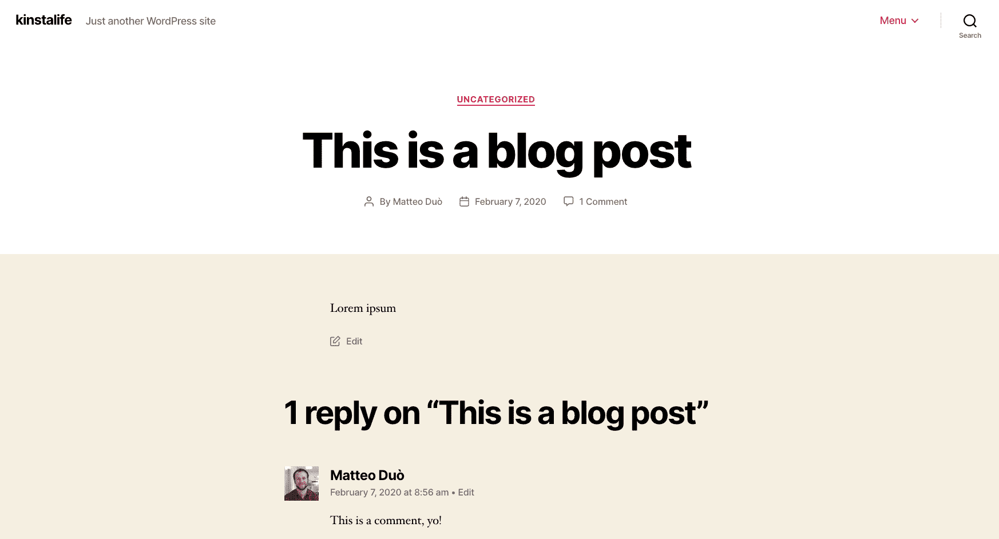
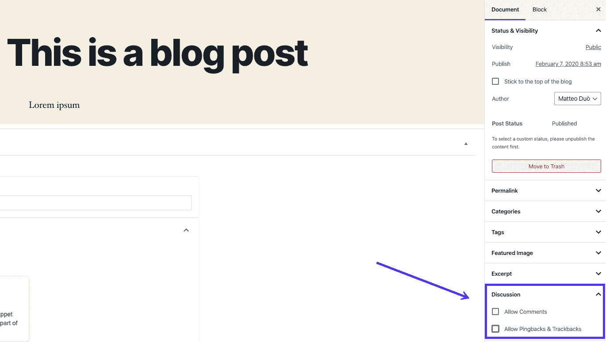
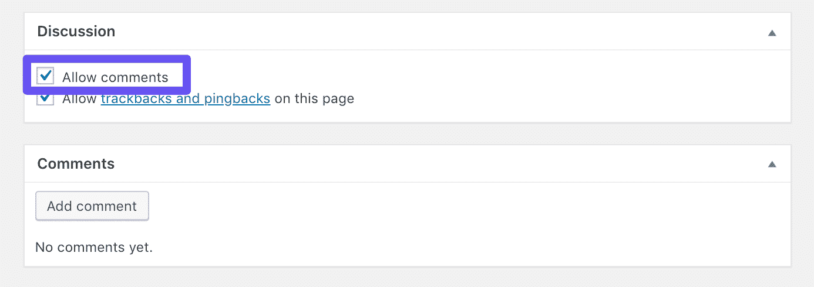
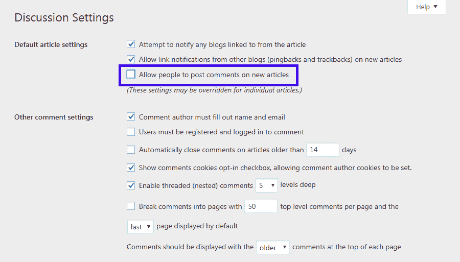
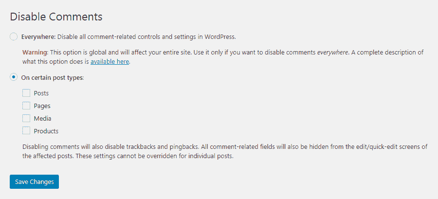

# 如何在 WordPress 中禁用评论(以及为什么你可能想这么做)

> 原文:[https://kinsta.com/blog/wordpress-disable-comments/](https://kinsta.com/blog/wordpress-disable-comments/)

WordPress 评论系统是一个很有价值的功能。让访问者在你的帖子上留下评论可以增加参与度，并提供各种其他好处。同时，这并不是每个网站都需要或想要的功能。

幸运的是，如果你不使用它们，*有*可能**禁用 WordPress 评论**。除了删除不需要的功能，这可能是减少垃圾邮件和加快你的 WordPress 网站速度的聪明方法。

在这篇文章中，我们将更多地讨论为什么你可能想要在 WordPress 中禁用评论。然后，我们将带你通过三个快速简单的方法来做到这一点。

 ### **更喜欢看[视频版](https://www.youtube.com/watch?v=O3kQb5dNJnI)？**


## 为什么你会选择禁用 WordPress 评论

如今人们很容易忘记，但是 WordPress 最初是作为一个博客平台而存在的。尽管自那以后它已经成长了很多，但它的许多核心功能仍然集中在对博客和类似类型的网站有用的功能上，例如[，一个相当强大的评论功能](https://wordpress.org/support/article/comments-in-wordpress/):



Example of a comment on a WordPress site


WordPress 允许访问者对你的网站内容发表评论。默认情况下，页面禁用此功能，帖子启用此功能。这是有意义的，因为您很少希望允许静态网页上的评论。


> 需要在这里大声喊出来。Kinsta 太神奇了，我用它做我的个人网站。支持是迅速和杰出的，他们的服务器是 WordPress 最快的。
> 
> <footer class="wp-block-kinsta-client-quote__footer">
> 
> 
> 
> <cite class="wp-block-kinsta-client-quote__cite">Phillip Stemann</cite></footer>

[View plans](https://kinsta.com/plans/)

另一方面，评论区确实可以增强你的博客文章、新闻文章和其他及时的内容。

尽管如此，并不是每个网站都需要或者都将受益于评论区。事实上，有时候最好完全禁用 WordPress 评论。这样做有意义的一些情况包括:

*   当你没有博客时，或者你使用[“文章”内容类型](https://kinsta.com/blog/wordpress-custom-post-types/#wordpress-post-types-posts)来创建不同类型的内容(如产品页面)。
*   你的网站主要致力于通过[静态页面](https://kinsta.com/blog/wordpress-vs-static-html/)提供信息，而不是产生对话。
*   你在经营一个商业网站，你担心评论会使你的网页显得不够专业。
*   你想鼓励你的读者在你的帖子和页面之外的地方交流，比如在一个专门的论坛中[。](https://kinsta.com/blog/wordpress-forum-plugins/)

不管你运行的是什么类型的网站，在 WordPress 中关闭评论还有其他一些潜在的好处。

例如，你不必担心垃圾评论会使你的网站看起来混乱，或者用垃圾链接填满你的帖子。此外，禁用评论意味着你的页面会更精简，这对你网站的性能有积极的影响。

每个网站都是不同的，所以你需要权衡评论对你特定的定位和受众的利弊。如果你决定部分或全部禁用评论，有很多简单的方法可以实现。

## 如何禁用 WordPress 中的评论(3 种方法)

有很多方法可以在 WordPress 中禁用评论。三个主要选项是使用 WordPress 的内置设置、一个插件和一些自定义代码。

每种方法都有其优点，并且在特定的场景中更有用。你可以通读这三部分，或者使用下面的链接跳到你最感兴趣的部分。

 ### 1.使用 WordPress 的内置选项禁用评论

禁用 WordPress 评论的第一个也是最简单的方法是使用平台中已经包含的设置。这是一个快速解决方案，尽管有一定的限制(我们稍后会讨论)。

但是，如果您只想完全关闭注释，这通常是最好的方法。

有两种方法可以选择，这取决于你是想在 WordPress 中禁用某个帖子或页面的评论，还是整个网站的评论。

#### 选项 1:关闭对特定帖子或页面的评论

首先，让我们看看如何关闭一个特定帖子或页面上的评论。

但是，请记住，默认情况下，页面的注释是禁用的，因此，如果在某个时候启用了注释，您只需在单个页面上将其关闭。

首先，打开有问题的文章或页面。然后，查看右边的工具条。您应该会看到一个标有“讨论:继续并打开它”的部分:



Disabling comments on a WordPress post


在这里，你会发现两种选择。要禁用评论，只需取消选中允许评论框。然后，确保保存或更新页面或帖子，访问者将无法再在上面留下评论。

作为参考，以下是使用经典编辑器的用户可以看到的所有内容:



The Discussion settings and Allow comments checkbox in the Classic Editor


但是，请记住，这不会删除页面或帖子上预先存在的评论。

为此，你需要在你的 WordPress 仪表盘的评论标签下手动删除它们。

#### 选项 2:全局关闭注释

另一方面，如果你决定不允许对你网站上的任何帖子发表评论，该怎么办？在这种情况下，你也想在 WordPress 中全局禁用评论。

您可以通过导航至设置>讨论来完成此操作:



WordPress’ Discussion settings


在这里，只需取消选中允许人们对新文章发表评论选项。这意味着所有在你的网站上创建的帖子都将被禁止评论。

这种特殊的方法有两个缺点。首先，很像上面的选项，它不会从你的网站上删除任何现有的评论(你仍然需要手动删除它们)。

此外，这也不会禁用对现有帖子的评论，只会禁用对新帖子的评论。幸运的是，您也可以使用一个小技巧来处理这些内容。在同一个页面上，找到**自动关闭评论**的文章早于 _ 天选项，选中复选框，并在字段中添加 0。

 ## 注册订阅时事通讯


### 想知道我们是怎么让流量增长超过 1000%的吗？

加入 20，000 多名获得我们每周时事通讯和内部消息的人的行列吧！

[Subscribe Now](#newsletter)

这将关闭您站点当前帖子的所有评论部分。当与前一个设置结合使用时，这具有全局禁用您的注释部分的效果。

### 2.使用 WordPress 插件禁用评论

我们上面看到的设置很容易访问，并且可以让你在你的 WordPress 站点上禁用评论。然而，它们并没有给你提供对过程的很多控制。此外，你可能会有一些繁琐的清理工作要做。

如果你想微调评论在你的网站上的工作方式，或者只是在寻找一个更快更优雅的解决方案，你可能要考虑选择一个专用的插件。

有一些工具可以帮助你关闭 WordPress 评论。让我们来看看其中的两个。

#### 选项 1:安装一个免费插件

如果你的预算有限，或者你想要一个非常简单的解决方案，你可以看看免费插件[禁用评论](https://wordpress.org/plugins/disable-comments/):


The Disable Comments WordPress plugin


这个插件使管理员能够全局禁用评论，或者仅针对特定的帖子类型禁用评论。Disable Comments 拥有超过 100 万的活跃安装量和 4.9 的五星评级，因此受到强烈推荐。另外，它很容易使用。

安装插件后，你会在设置>禁用评论中找到它的新选项:



Disable Comments plugin settings


如您所见，您的选择非常简单。只需点击一下，你就可以在你的网站上禁用任何地方的评论。

或者，您可以为帖子、页面或自定义帖子类型关闭它们。这可以让你禁用 WordPress 对图片和其他媒体文件的评论，以及对 WooCommerce 产品的评论。

最后，只需点击保存更改按钮。请记住，这些设置不能通过常规的 WordPress 讨论设置或在单个帖子和页面上启用评论来覆盖。

如果你的网站上有多个用户，并且想要阻止其他人重新启用评论功能，这是一个有用的解决方案。

厌倦了慢热的主持人？Kinsta 的设计考虑了速度和性能。[查看我们的计划](https://kinsta.com/plans/?in-article-cta)

#### 选项 2:选择高级解决方案

当然，上面的插件不是你处理 WordPress 站点评论区的唯一选择。也可以考虑购买一个[高级插件](https://kinsta.com/blog/wordpress-free-vs-paid-themes/)。一个解决方案是使用 [perfmatters 插件](https://perfmatters.io/)，它是由 Kinsta 的一个团队成员开发的:


The perfmatters WordPress plugin


这个插件旨在[提高你的 WordPress 网站的性能](https://kinsta.com/blog/query-monitor/)，并提供一套功能，如简化的仪表板和各种幕后调整，以最小化潜在的缓慢和膨胀。

此外，perfmatters 包括一个非常简单的选项，用于关闭 WordPress 中的评论。你可以在选项标签下的插件设置中找到它(该设置被标记为禁用评论)。通过切换此选项，您可以全局启用或禁用注释，而无需担心任何附加设置。

与之前的插件相比，这个插件对评论设置的控制不够精细。然而，如果你只是想关闭你的 WordPress 评论，并且你也希望[加速你的网站](https://kinsta.com/learn/speed-up-wordpress/)，这个工具可以毫不费力地为你处理这两项任务。

### 3.通过自定义代码禁用注释

如果以上两个选项都不能提供足够的控制，或者你想要更多的选项，但又不想在你的网站上添加其他插件，你可以使用自定义代码来代替。

通过这种方法你能完成什么自然取决于你的技术技能和经验，但是简单地禁用你网站的评论部分是相当简单的。

你可以使用一些基本的 HTML 命令将评论部分从你的 WordPress 主题中移除。请注意，编辑你的 WordPress 主题的源代码是有风险的，如果操作不当，可能会破坏你的网站。

最重要的是，最佳实践建议[在执行此类活动时创建一个子主题](https://kinsta.com/blog/wordpress-child-theme/)。如果你不喜欢自己做这个，你可能想把工作外包给一个 [WordPress 开发者](https://kinsta.com/blog/hire-wordpress-developer/)。

如果你有兴趣自己尝试这种技术，确保首先在一个[试运行环境](https://kinsta.com/help/staging-environment/)上测试它，并且总是[备份你的生产网站](https://kinsta.com/help/wordpress-backups/)，然后再将改变发布。

现在，在您最喜欢的 HTML 编辑器中打开您的 page.php 文件，查找以下代码行:

```
<?php comments_template( '', true ); ?>
```

继续用下面这行代码替换它:

```
<!-- Begin Comment
<?php comments_template( '', true ); ?>
End Comment -->
```

这将关闭所有站点页面上的评论部分，既删除现有评论又阻止新评论。

要对您站点的帖子执行同样的操作，请导航到您的 single.php 文件并找到以下代码:

```
<?php comments_template(); ?>
```

然后，用以下代码替换它:

```
<!-- Begin Comment
<?php comments_template(); ?>
End Comment -->
```

这样，你就可以在你的帖子和页面上禁用 WordPress 评论了。

请记住，如果需要，您需要对其他文章类型重复这个过程。

[Are you taking advantage of comments on your site? If not, then why keeping them at all as they could open the door to spammers and slow down your site? Check out how to disable them! 🗣🦥Click to Tweet](https://twitter.com/intent/tweet?url=https%3A%2F%2Fbit.ly%2F31HeLzg&via=kinsta&text=Are+you+taking+advantage+of+comments+on+your+site%3F+If+not%2C+then+why+keeping+them+at+all+as+they+could+open+the+door+to+spammers+and+slow+down+your+site%3F+Check+out+how+to+disable+them%21+%F0%9F%97%A3%F0%9F%A6%A5&hashtags=wordpresshelp%2Cwptips)

## 摘要

有时，你会希望鼓励你网站的访问者提出问题并开始相互讨论。然而，如果你想阻止垃圾内容或者想提高性能，你可能想禁用 WordPress 评论。

有三种主要方法可以做到这一点。您可以使用以下方式禁用 WordPress 上的评论:

1.  WordPress 的内置选项。
2.  一个 WordPress 插件，例如禁用评论或性能问题。
3.  自定义代码。

现在，轮到你了:你在你的网站上保持评论功能吗？是不是？在评论区分享你的经验吧！

* * *

让你所有的[应用程序](https://kinsta.com/application-hosting/)、[数据库](https://kinsta.com/database-hosting/)和 [WordPress 网站](https://kinsta.com/wordpress-hosting/)在线并在一个屋檐下。我们功能丰富的高性能云平台包括:

*   在 MyKinsta 仪表盘中轻松设置和管理
*   24/7 专家支持
*   最好的谷歌云平台硬件和网络，由 Kubernetes 提供最大的可扩展性
*   面向速度和安全性的企业级 Cloudflare 集成
*   全球受众覆盖全球多达 35 个数据中心和 275 多个 pop

在第一个月使用托管的[应用程序或托管](https://kinsta.com/application-hosting/)的[数据库，您可以享受 20 美元的优惠，亲自测试一下。探索我们的](https://kinsta.com/database-hosting/)[计划](https://kinsta.com/plans/)或[与销售人员交谈](https://kinsta.com/contact-us/)以找到最适合您的方式。