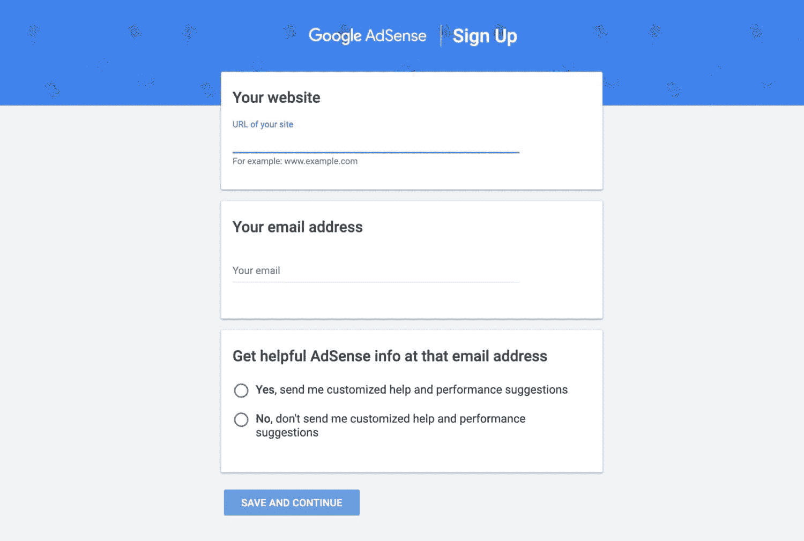
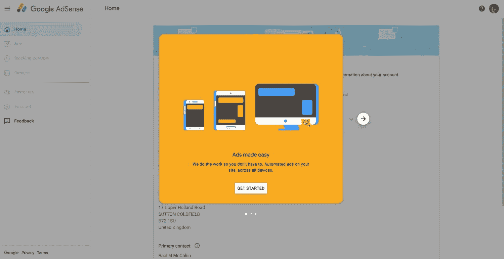
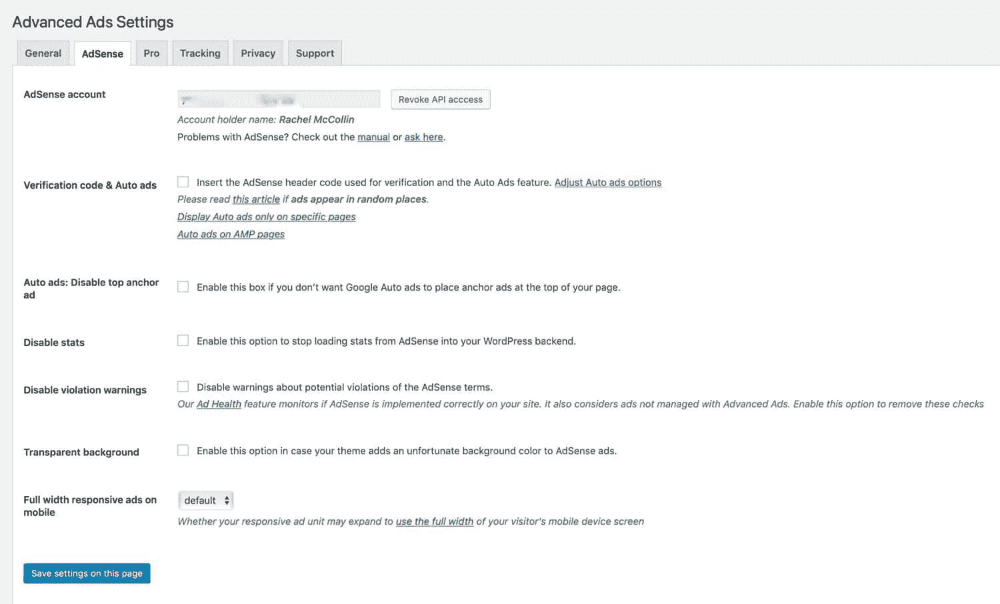
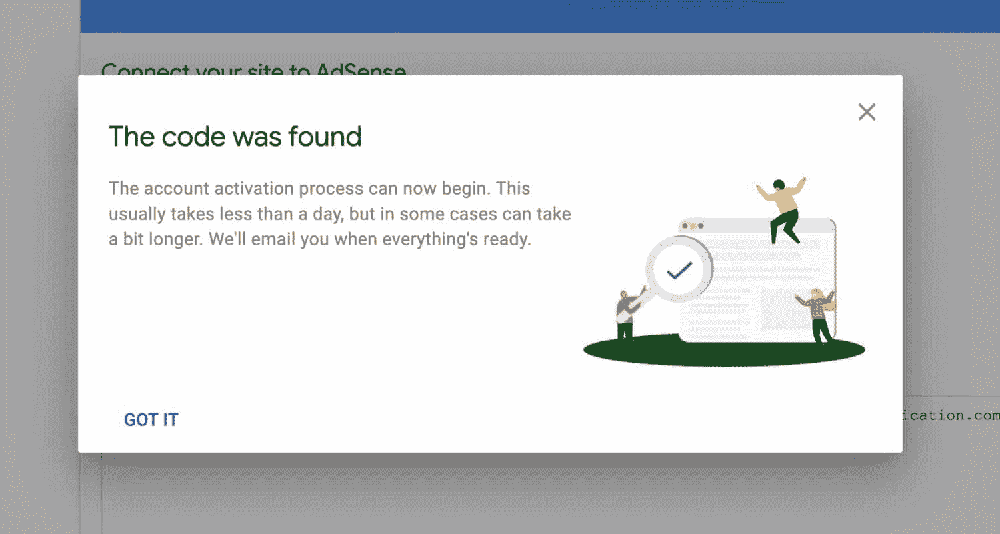
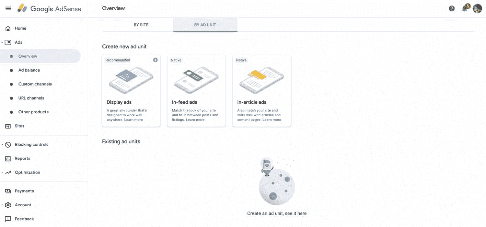
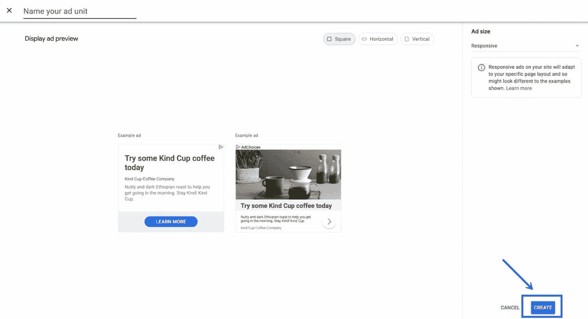
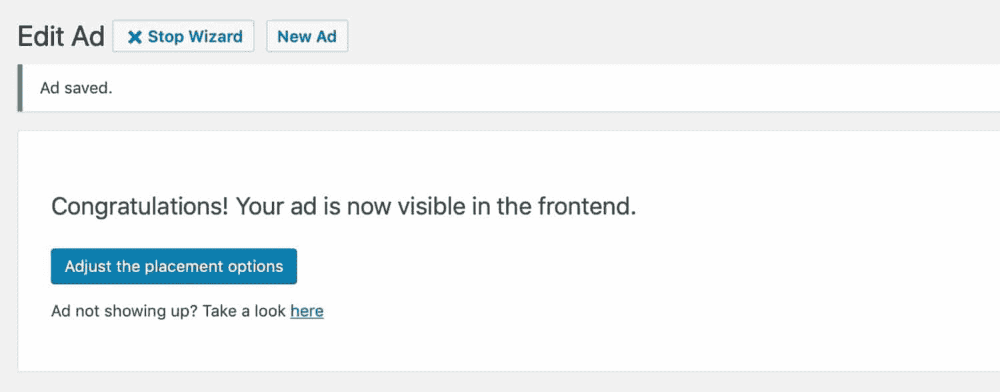
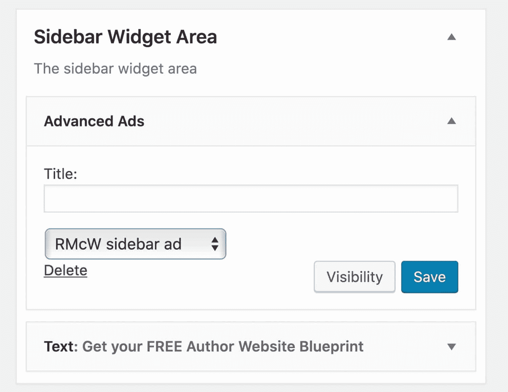
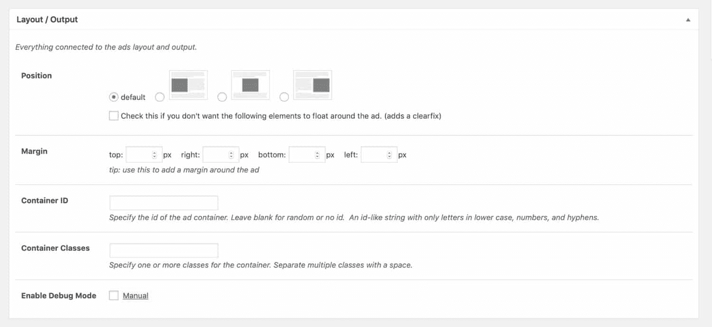

# 如何将 Google AdSense 添加到 WordPress(带插件和手动)

> 原文:[https://kinsta . com/blog/how-to-add-Google-adsense-to-WordPress/](https://kinsta.com/blog/how-to-add-google-adsense-to-wordpress/)

在你的网站上投放广告是最常见的赚钱方式之一。Google AdSense 是 Google 的平台，允许任何网站所有者在他们的网站上运行广告并从中赚钱。

如果你想从 Google AdSense 中获得更多，或者你喜欢从你的网站中赚钱，这个指南将帮助你了解更多关于 Google AdSense 如何工作以及如何在你的 WordPress 网站上使用 AdSense。

## 什么是 Google AdSense？

Google AdSense 可能是你可以用来在你的网站上运行广告的最著名的平台(尽管不是你唯一的选择，查看[AdSense 替代方案](https://kinsta.com/blog/adsense-alternatives/))。这些广告由谷歌提供，基于人们访问你网站的浏览历史。

所以当一个人访问你的网站时，他们会看到另一个人的不同广告。例如，如果你[运营一个旅游博客](https://kinsta.com/blog/how-to-start-a-travel-blog/)，你会显示与预订网站相关的广告。如果你在经营一个商业网站，来自 [B2B 公司](https://kinsta.com/blog/b2b-lead-generation/)的广告就会出现。

但是 Google AdSense 比这更聪明。它知道每个访问你网站的人在网上看了什么，并会根据这些信息定制广告。这意味着他们更有可能点击广告，因此你更有可能从中赚钱。

### Google AdSense vs Google Adwords

[Google Adwords](https://kinsta.com/blog/how-to-use-google-adwords/) 是谷歌的另一个广告平台，但它做的工作非常不同。


Google Adwords 不是让网站所有者显示广告，而是让你创建将显示在 Google 搜索结果页面上的广告。

查看[如何为您的业务使用 Google AdWords(初学者指南)](https://kinsta.com/blog/how-to-use-google-adwords/)开始使用它。

现在，回到 Google Adsense…

### 在你的 WordPress 网站上运行 AdSense 的利弊

为什么要在你的网站上放别人的广告？毕竟，你的网站是为了推广自己的业务而存在的。

在某些情况下，你不希望运行第三方广告。相反，你可以选择为你自己的产品做广告，鼓励找到你网站的人浏览你的产品。

如果你想这样做，你可以使用这篇文章中描述的插件将你自己的广告放到你的网站中，而不需要使用 AdSense。

但是如果你的网站有固定的流量，并且没有通过销售产品或服务直接赚钱，那么投放广告是从你的网站赚钱的好方法。因此，如果你的 WordPress 网站拥有大量的受众，但并没有直接销售给这些受众，广告可能是一个很好的赚钱方式。

## 如何创建 Google Adsense 帐户

所以你决定用 Google Adsense 在你的 WordPress 网站上投放广告。你如何开始？

第一步是建立一个 AdSense 帐户。为此，首先进入 [Google AdSense](https://www.google.com/adsense/signup/new/lead) 网站。



Google Adsense


在这里，您需要添加您的网站地址和电子邮件地址。选择您是否希望被添加到邮件列表中，以获得投放广告的提示。输入这些并点击**保存并继续**按钮。

如果你已经有一个谷歌帐户，你的帐户细节将会出现，这样你就可以确认你想使用这个帐户。如果没有，请单击**使用不同的帐户**链接并登录到您想要使用的帐户。或者，如果你还没有谷歌帐户，你需要设置一个。

 *### 信息

如果你使用 Gmail 或 YouTube，你将拥有一个谷歌账户。* 

选择您的国家或地区，阅读并接受条件，然后点击**创建账户**。

然后，您将被带到一个屏幕，该屏幕将引导您完成设置帐户的过程。点击**开始**按钮。



Google AdSense wizard


首先输入你的联系方式(或者如果你有一个现有的账户，检查一下)。点击**提交**继续。

然后你会看到一些代码，你可以用它来连接你的网站到 AdSense。这就是我们接下来要看的。

### 如果您的 AdSense 帐户未被批准，该怎么办

一旦你建立了你的帐户，**你必须等待谷歌验证你的详细资料并批准你的帐户**，然后你才能运行任何广告。有时，您的帐户申请可能会被拒绝。

如果发生这种情况，您将收到一封电子邮件，说明您的帐户被“拒绝”的原因。在大多数情况下，原因与你网站的问题有关，这可能包括缺乏[内容](https://kinsta.com/learn/content-marketing/)、[代码或安全问题](https://kinsta.com/blog/wordpress-security/)，或者谷歌认为是[剽窃的内容](https://kinsta.com/blog/content-scraping/)。

如果你的网站是全新的，它有更高的机会因为缺乏内容而被拒绝。谷歌希望知道它的广告是在高质量的正版网站上提供的，这将为这些广告带来流量。

因此，与其立即重新申请，不如花些时间来改进你的网站。[给它添加更多的内容](https://kinsta.com/blog/content-length/)。[修复任何安全问题](https://kinsta.com/knowledgebase/disclose-security-vulnerability/)。确保你发布的所有内容都是你的或者你有权利发布，并且你没有从互联网上的其他地方复制。

一旦你确信你已经解决了谷歌警告你的任何问题，并且你的网站运行良好，那么你可以重新申请。

你不必等到你的帐户被批准后再连接到你的站点，所以让我们开始吧。

## 如何将 Google AdSense 连接到你的 WordPress 站点

将 Google AdSense 添加到 WordPress 的下一步是将你的 WordPress 站点连接到你的 AdSense 账户。通过这种方式，谷歌能够正确投放广告。

你可能已经注意到 Google Adsense 给了你一些代码，你可以添加到你的站点的`<head>`部分。抵制诱惑，打开仪表板中的主题编辑器并输入它。当你[更新你的 WordPress 主题](https://kinsta.com/blog/how-to-update-wordpress-theme/)时，新的代码将会丢失，你的广告将会中断。

相反，请使用以下选项之一。

### 用插件连接 WordPress 和 Google AdSense

将 Google Adsense 添加到 WordPress 最简单的方法就是使用一个 Adsense 插件，比如 [Advanced Ads](https://wordpress.org/plugins/advanced-ads/) 。

这将允许你在不访问文件的情况下将代码添加到你的站点，并且还将管理为你显示广告的过程，而不需要你使用 [widgets](https://kinsta.com/blog/wordpress-dynamic-sidebars-widgets/) 。它也给了你一个[古腾堡广告区](https://kinsta.com/blog/gutenberg-wordpress-editor/)，这样你就可以把它们添加到你帖子中任何你想添加的地方。

下面是如何使用这个插件为你的 Google Adsense 帐户添加代码。

首先安装并激活插件。进入**高级广告>设置**然后点击**站长**标签。

点击**连接到 Adsense 账户**按钮。然后，系统会提示您使用与 AdSense 相同的帐户登录 Google。一旦你这样做了，你将被要求确认你对插件从 Google Adsense 访问数据感到满意。


Advanced Ads – AdSense tab


然后，您将看到一个屏幕，上面有一段代码供您粘贴到应用程序中。复制这个，然后关闭弹出窗口。将其粘贴到接下来出现的屏幕中。

现在, **AdSense** 选项卡将填充您帐户的详细信息。



AdSense tab with account details


顶部字段将有你唯一的 AdSense 帐户标识符。下面有一个添加验证码的复选框。检查一下，以便插件可以将代码添加到您站点的`<head>`部分。然后点击**保存本页设置**按钮，继续验证代码。

#### 用插件将 AdSense 代码添加到你的 WordPress 站点的头部

如果你不想使用插件来管理整个广告流程，也不想(或不能)编辑主题中的代码，你可以使用插件[向页面的页眉或页脚](https://kinsta.com/knowledgebase/add-code-wordpress-header-footer/)添加代码(在这种情况下，是页眉)。

[Head，Footer 和 Post Injections](https://wordpress.org/plugins/header-footer/) 插件允许你将代码复制到一个设置屏幕中，然后插入到你的站点的页眉或页脚中。

安装插件，然后进入**设置>页眉页脚**。


Header and Footer settings screen


现在回到你的谷歌 AdSense 账户，复制谷歌给你的链接代码。返回 WordPress，将其复制到每一页的 **<头>页部分**字段。

点击**保存**按钮。现在跳到用 AdSense 验证代码的部分。

### 如何手动添加 Google AdSense 代码到你的 WordPress 站点

下一个选择是手动添加 Google AdSense 给你的代码到你的 WordPress 主题中。这是一种更轻量级的方法，没有插件添加的额外代码，如果你喜欢编辑你的主题，这可能是你的首选。

如果你在你的网站上使用第三方主题，你绝对不能直接编辑主题中的代码。这是因为当您下次更新主题时，您所做的任何更改都将丢失。

如果是这样的话，你需要[创建一个子主题](https://kinsta.com/blog/wordpress-child-theme/)。从你的父主题复制 header.php 的**文件，然后编辑它。WordPress 将使用该文件，而不是来自父主题的文件。**

如果你不想这么做，使用上面的插件可能会更容易。

在你的主题中打开**header.php**文件，找到文件开头的`<head>`部分。

向下滚动该部分的底部，找到显示`wp_head();`的行。

除此之外，将提供给你的代码复制到你的 Google Adsense 账户中。保存文件。

现在跳到用 AdSense 验证的部分。

#### 通过自定义插件手动添加 Google AdSense 代码

如果你喜欢编写插件，那么另一种添加代码的方式就是编写你自己的插件。

这是最好的方法，如果你在每个页面上有不止一个广告，这将加速你的网站，因为脚本不会被调用超过一次。

在你的 **wp-content/plugins** 文件夹中创建一个新的插件。

首先添加注释文本，告诉 WordPress 这个插件是做什么的(确保你编辑的代码反映了你的名字，URI 等等)。):

```
<?php
/*
Plugin Name: Google AdSense Code
Plugin URI: https://kinsta.com
Description: A plugin to add the script for AdSense to this site
Author: Rachel McCollin
Author URI: https://rachelmccollin.com
Text Domain: kinsta
Version: 1.0
*/
```

现在，在它下面，添加一个函数来将来自 Google AdSense 的脚本入队:

```
function kinsta_adsense() {
 wp_enqueue_script( 'adsense', '//pagead2.googlesyndication.com/pagead/js/adsbygoogle.js', false );
}
add_action( 'wp_enqueue_scripts', 'kinsta_adsense' );
```

这将添加使 Google Adsense 工作的脚本，但它不会链接到您的 Adsense 用户帐户。为此，您需要为您的插件添加一个额外的功能:

```
function kinsta_adsense_id( $tag, $handle ) {
 if ( 'adsense' !== $handle ) {
  return $tag;
 }
 return str_replace( ' src', ' data-ad-client="ca-pub-111111111111111" src', $tag );
}
add_filter( 'script_loader_tag', 'kinsta_adsense_id' );
```

在这段代码中，您需要用您自己的 AdSense 帐户的唯一标识符替换`ca-pub-111111111111111`。

保存插件并激活它。

### 用 Adsense 验证链接

无论你用什么方法将代码添加到你的站点，你都需要用 Adsense 来验证它。

现在回到 AdSense，选中**我已经将代码粘贴到我的站点**复选框。

然后谷歌会检查你的网站，看看是否能找到代码。您应该会看到一条消息，告诉您成功了。



Code found on site


## 如何在 Google Adsense 中创建广告单元

既然你已经将你的 WordPress 站点链接到了 Google AdSense，是时候创建一个广告单元了。这是您在 Google AdSense 中创建的一个单元，它将用于向您的网站发送广告。

广告单元是允许广告在其中显示的一段代码。实际显示的广告将根据您的设置和用户的浏览历史而有所不同，因此您可以创建一个广告单元，它将在不同的时间显示多个广告。

如果你想在网站的不同部分显示不同的广告(例如在页面顶部有一个[横幅广告](https://kinsta.com/blog/banner-ad-sizes/)，在侧边栏有一个方形广告)，你可以创建不止一个广告单元。

在您的 Google AdSense 帐户中，您会看到一个通知，告诉您您的帐户已激活。点击**设置广告**按钮。

或者，如果你的账户已经激活，进入**广告>概述**并点击**广告单元**标签。



Ad Unit tab in Google Adsense


Google Adsense 提供了三种类型的广告供您选择:

*   展示广告是通用的广告，但通常在你的内容流之外，在页眉、页脚或侧边栏中效果最好。这些是最灵活和可定制的广告，但是访问者可以忽略它们，因为它们不在他们正在查看的页面区域内。
*   馈入广告将被放置在你的存档页面的内容流中，在文章列表之间。这些会在你的主博客页面或存档页面上引起人们的注意。
*   文章内广告将被放在你文章的内容中。这些东西的好处是在人们看的地方，但有些人觉得它们很烦人。

让我们从制作展示广告开始，因为这是最简单的。

点击**显示广告**进入设置屏幕。完成以下步骤:

1.  给你的广告命名:用户不会看到这个，所以用一些能帮助你再次识别它的东西。
2.  选择广告的格式:水平、垂直或方形。你选择哪一个取决于你打算把它放在哪里(方形广告在侧边栏看起来不错，而水平广告在页眉或页脚效果更好)。
3.  选择广告尺寸是固定的还是响应式的:响应式广告是默认的，将在不同尺寸的屏幕上调整大小。不要忘记，大多数人可能会在手机上查看你的广告，所以坚持使用**响应式**选项是个好习惯。

点击**创建**按钮。



Display ad setup screen


你现在有了你的第一个广告单元。Adsense 将为您提供将它添加到您的网站所需的代码。你是否需要使用这个取决于你在你的网站上插入广告的方法——如果你使用的是插件，那就没必要了。

现在让我们把广告添加到我们的网站。

## 如何在你的 WordPress 站点中插入来自 Google AdSense 的广告

一旦你用 Google Adsense 创建了一个广告，你需要把它插入你的 WordPress 站点。

记住:当你在网站上添加广告时，你插入的是一个广告单元(而不是广告本身)。当用户访问你的网站时，广告将被获取并显示，这取决于谷歌认为用户最有可能对哪个广告做出回应。

### 在哪里放你的广告

在你把你的广告单元插入你的网站之前，花些时间考虑一下最佳的广告位置。这将根据你的网站布局和设计以及你从哪里获得大部分流量而有所不同。

## 注册订阅时事通讯


### 想知道我们是怎么让流量增长超过 1000%的吗？

加入 20，000 多名获得我们每周时事通讯和内部消息的人的行列吧！

[Subscribe Now](#newsletter)

广告不是人们来你网站的目的。他们来寻找更多关于你的信息，或者消费他们通过搜索找到的[内容。满屏的广告会给人留下这样的印象:你的网站只是为了从广告中赚钱而存在，而不是为了提供](https://kinsta.com/blog/what-does-seo-stand-for/)[优质内容](https://kinsta.com/blog/evergreen-content/)。我们都看过这些网站…我们都立即使用后退按钮离开它们！

因此，考虑一下人们会点击的广告与人们想要消费的内容之间的比例。鼓励他们逗留更长时间，并再次回来，这最终会让你赚更多的钱。

规划广告投放时，请考虑:

*   定位:广告是否在一个能吸引人们注意力的位置，但不会主导页面或阻止人们消费你网站的内容？
*   尺寸:广告是否足够大以至于引人注目，但又没有大到占据页面或者让人们看不到你的内容？

这是一个好主意，运行一些广告，测试他们的表现如何，然后再尝试一些不同的广告单元配置，直到你找到一个最适合网站和你的访问者。严格的测试意味着你能从广告中赚更多的钱，并赢得你的观众的忠诚。

有几种不同的方式来插入你的广告，这取决于你是使用插件还是手动插入代码。

让我们先来看看你是如何用插件做到这一点的。

### 使用插件在 WordPress 中插入广告

你可以使用插件来管理插入广告的整个过程，或者简单地添加代码。Google Adsense 有一系列可用的[插件，这里我将向你展示如何使用两种不同的方法。](https://kinsta.com/blog/wordpress-advertising-plugin/)

#### 使用插件将广告代码插入你的网站

你的第一个选择是使用我们之前使用的 [Head、Footer 和 Post Injections](https://wordpress.org/plugins/header-footer/) 插件来添加将你的站点链接到 Google Adsense 的代码。你也可以用它来添加代码到你的页面和文章中。

如果你还没有安装插件，现在安装并激活它，然后进入**设置>页眉和页脚**。点击**帖子**标签。


Posts tab


现在回到 Google Adsense，为你的广告单元抓取代码。如果它在创建时没有打开，请进入 **Ads > Overview** ，在列表中找到广告单元，点击它旁边的代码符号。


Ad Unit on Google AdSense


在您的站点中，将代码粘贴到 **Posts** 选项卡的相关字段中。如果您想为移动和桌面创建两个不同维度的广告单元，可以在每个字段中粘贴不同的代码。或者，如果你想在手机和桌面上插入广告，粘贴到两者。

点击屏幕底部的**保存**按钮，您的广告单元位置将被保存。

#### 使用插件自动插入广告

如果你不想担心复制和粘贴代码，并且你已经使用了 [Advanced Ads](https://en-gb.wordpress.org/plugins/advanced-ads/) 插件来链接你的站点和你的 AdSense 账户，如上所示，你可以使用该插件将你的广告单元插入到你的站点中。

进入高级**广告>广告**。选择 **AdSense Ad** 单选按钮，点击**下一步**。

该插件将找到你在谷歌广告中创建的广告单元。选择您想要使用的，然后点击**下一个**按钮。*如果插件没有找到你的广告单元，从 AdSense 复制代码，它会设置广告。*


Add New Ad in Advanced Ads


然后，系统会提示您定义广告不显示的条件。例如，你可能决定不向[登录的访问者](https://kinsta.com/blog/wordpress-user-registration-plugins/)显示广告，或者在特定的页面上隐藏广告，比如你的登录页面(如果有的话)。

如果你喜欢在所有条件下显示广告，保留默认设置，然后点击**下一个**按钮。

之后，你会被要求选择你想在哪里显示广告。你可以选择在内容之前，内容之内，内容之后，使用一个短代码或一些 PHP，在侧边栏或标题。如果你想使用自定义位置，你必须升级插件。

我将在内容后选择**。点击首选选项，插件会将广告放在该位置。**



Advanced Ads congratulations message


如果你要选择侧边栏或页脚，插件会直接把你带到 **Widgets** 屏幕，在那里你可以把**Advanced Ads**Widgets 拖入你的侧边栏并进行配置。直接从**窗口小部件**或者定制器来做更容易，这样你就不用进入插件设置窗口了。

将微件拖到您想要显示它的微件区域，并选择您想要显示的广告单元。



Advanced Ads sidebar widget


广告将会出现在你的网站上。

### 手动插入广告单元代码

如果你不想使用插件，你可以选择手动插入广告单元的代码。

有两种方法可以做到这一点:将代码粘贴到文本小部件中，或者将代码粘贴到主题的模板文件中。

厌倦了你的 WordPress 站点缓慢的主机？我们提供超快的服务器和来自 WordPress 专家的 24/7 世界级支持。[查看我们的计划](https://kinsta.com/plans/?in-article-cta)

让我们来看看每一个。

#### 1.在文本小部件中插入广告代码

将广告插入网站的最简单方法之一是将代码复制到文本[小部件](https://kinsta.com/blog/wordpress-widgets/)中。然而，只有当你的主题在你想要显示你的广告的位置有一个窗口小部件区域时，这才会起作用。

进入**外观>小部件**或者打开定制器，选择**小部件**。选择要显示广告的部件区域。

将自定义 HTML 小部件添加到小部件区域。打开小部件，复制广告单元的 Google Adsense 代码。当你设置广告单元时，确保你使用的布局适合你的小工具区域。正方形很好。


AdSense code in HTML widget


#### 2.在主题模板文件中插入广告代码

只有在您有权编辑主题的情况下，您才应该这样做，因为您必须将代码插入到每个模板文件中，这些模板文件显示您希望广告出现的内容。如果你正在使用一个第三方主题，总是[创建一个子主题](https://kinsta.com/blog/wordpress-child-theme/)并编辑它，否则你的更改将在下次更新主题时丢失。

如果你的主题在模板文件中包含了[动作或者过滤钩子](https://kinsta.com/blog/wordpress-hooks/)，你可以使用它们来编写你自己的插件来添加代码。我将很快向您展示如何做到这一点。

首先，[选择您想要显示广告的内容类型](https://kinsta.com/blog/wordpress-custom-post-types/#difference)。让我们假设是单篇文章，在这种情况下，你需要编辑 post.php 的**。**

 **如果你正在使用一个子主题，从你的父主题复制一个**posts.php**到你的子主题。然后你将编辑它，WordPress 将使用它来显示单篇文章，而不是来自父主题的等价文件。

如果你的主题没有一个**post.php**文件，那么复制模板层次结构中的下一个文件:它将是 single.php、**singular.php**或**index.php**。

调用你的复制文件**post.php**并删除与文章无关的部分(如果你没有信心这样做，要么保持文件原样，要么使用插件插入广告)。

在你的主题模板文件中找到你想要显示广告的位置，并从你的 Google Adsense 帐户中复制代码。你可以通过进入**广告>概述**找到你想要使用的广告，点击它旁边的代码图标。

现在保存模板文件，广告将显示在您的内容中。

#### 在函数中插入广告代码

一个更健壮的方法是编写你自己的插件，将代码与你的主题中的动作挂钩。

如果你的主题在内容中有动作挂钩，你可以写一个函数，然后把它挂钩到相关的动作挂钩上，输出模板文件中那个位置的代码。

我要想象一下，我的主题有一个钩子叫 kinsta_after_content，在内容之后。我只想在单页上显示我的广告，所以我将包含一个条件标签来确保这一点。

你可以将这段代码添加到你的**functions.php**文件中，或者为它创建一个插件。

```
function kinsta_insert_adsense_after_content() {
 if( is_singular( ‘post’ ) { ?>
  // add the script from AdSense here
 <?php }
}
add_action( ‘kinsta_after_content’, ‘kinsta_insert_adsense_after_content’ );
```

脚本代码直接取自 Adsense。请注意，我已经包含了关闭和打开 PHP 标签，因为脚本不在 PHP 中。

保存您的文件，并检查您的网站-广告应该会显示。

## 如何改变你的广告外观

无论你使用哪种方法来实现 Google AdSense，你的广告现在都应该显示在你的 WordPress 站点的正确位置。


Ad displayed below WordPress content


如果您的广告看起来不太合适，请尝试更改定位或布局选项，或者在该位置使用不同的广告单元。

然而，如果你想调整你的广告，你可以。

### 调整您的广告布局

无论你用什么方法将你的广告单元添加到你的 WordPress 站点，它现在都会显示在你选择的位置。

但是如果看起来不太对呢？

#### 用插件调整你的广告布局

如果你使用一个插件来显示广告，它可能会让你调整你的广告的外观和确切的定位。例如，您可以让您的内容环绕您的广告。

在高级广告插件中，进入**高级广告>广告**。选择您想要调整的广告。

向下滚动到**布局/输出**部分(如果看不到，可能需要停止向导)。



Layout/Output section


在这里，您可以配置包装和浮动，您可以将类或 ID 添加到您的广告容器中，以便您可以在您的[主题的样式表](https://kinsta.com/blog/wordpress-child-theme/#the-stylesheet)中或通过定制器中的 [**附加 CSS** 选项](https://kinsta.com/blog/wordpress-css/#how-to-customize-your-wordpress-theme-with-css)对其进行样式化。

#### 用手动方法调整您的广告布局

如果你已经使用手动方法将 Adsense 代码添加到你的 WordPress 网站，你可以通过添加一个包含元素来设置代码的样式。

例如，如果你要为你的广告写一个插件，你需要调整代码如下:

```
function kinsta_insert_adsense_after_content() {
 if( is_singular( ‘post’ ) { ?>
  
   // add the script from AdSense here
  
 <?php }
}
add_action( ‘kinsta_after_content’, ‘kinsta_insert_adsense_after_content’ );
```

我使用了一个 side 元素，因为它的内容不是主要内容的一部分，而是次要内容。

### 调整广告定位

如果你想自动将广告放在侧边栏之外的地方，或者内容之前或之后，有插件可以帮你做到这一点。

一个流行的投放广告的地方是在内容流中。你可以把它们放在中间，这样当访问者向下滚动一篇文章时，它们会吸引眼球，或者让它们左右浮动，这样内容会围绕着它们弯曲，保持用户浏览你的内容的方式。

[广告插入器](https://wordpress.org/plugins/ad-inserter/)插件被设计成在一系列位置插入你的广告。它可以让你插入广告:

*   在内容之前或之后。
*   在任意段落或多个段落之前或之后。
*   图像之前或之后。
*   相对于职位中的给定位置。
*   在评论或摘录之前或之后。

广告插入器的工作原理是让你为每个广告创建广告块。对于每一个，您可以指定希望它出现在哪种内容类型中以及希望它出现在哪里。


Ad Inserter settings


根据需要创建尽可能多的标签，并将它们插入到您希望它们出现的位置。

或者， [Adsense Reloaded](https://wordpress.org/plugins/quick-adsense-reloaded/) 插件可以让你在一个页面的多个 pf 位置显示多个广告。位置包括内容的开头和结尾、特定段落之后、更多标签之后等等。它包括编辑文章时可以添加的短代码，以及可以编码到模板文件中以快速插入广告的快速标签。

## 充分利用 Google AdSense 和 WordPress

现在你已经实现了你的 Google AdSense 代码，并且在你的 WordPress 站点上运行了单元广告，你的工作还没有完成。

如果你想让你的广告为你努力工作，你需要维护和监控它们。

为此，你可以通过进入 **Ads > Overview** 并点击广告名称右侧的报告图标，在 Google AdSense 中追踪广告收入。

谷歌会给你点击次数、收入等数据。使用这些数据来确定哪些广告对你最有利可图。如果一个广告单元更适合你，你可能会选择在你网站的其他地方复制它来替换其他表现如此好的广告单元。

确保你也[监控你的网站统计数据](https://kinsta.com/blog/google-analytics-alternatives/)并检查你的广告没有对你的[跳出率](https://kinsta.com/blog/how-to-reduce-bounce-rate/)或人们浏览的页面数量产生任何负面影响。如果广告分散了人们浏览你网站的注意力，你可能需要调整它们。

定期花些时间在这些优化任务上会帮助你获得尽可能高的广告效果，并确保你从中赚更多的钱。

并且不要忘记:如果人们打算点击你的广告，你首先需要他们访问你的网站，所以确保你[回顾你的 SEO](https://kinsta.com/blog/best-seo-plugins-for-wordpress/) 并且使它尽可能有效。

## 如何配合 Google AMP 使用 Google AdSense

如果你网站的大部分流量来自移动设备(在许多网站上确实如此)，你可能会从使用 [Google AMP](https://kinsta.com/blog/google-amp/) 中受益。让我们来看看这是如何工作的，以及你如何将它与你的广告相结合。

### Google AMP 是什么？

Google AMP 是 Google 加速移动页面的缩写。AMP 旨在加快你的网站在移动设备上的速度，并提高你在搜索引擎中的排名。

它通过访问谷歌的缓存来工作，缓存存储和传送你的内容，因此它可以更快地加载。你可以用它来加速你网站的登陆页面，降低跳出率，以及广告的。

### 将 AMP 与 Google Adsense 和 WordPress 一起使用

你可以通过安装一个 AMP 插件在 WordPress 上使用 AMP。大多数广告插件也兼容 AMP。例子包括上面提到的免费插件的高级版本 [Ad Inserter Pro](https://adinserter.pro/documentation/adsense-ads#amp) ，以及 WP 的[AMP](https://ampforwp.com/advanced-amp-ads/)，这也是一个高级插件。

[Wanna make an additional stream of income through your site? Check out this thorough tutorial on getting started with Google AdSense and WordPress!Click to Tweet](https://twitter.com/intent/tweet?url=https%3A%2F%2Fkinsta.com%2Fblog%2Fhow-to-add-google-adsense-to-wordpress%2F&via=kinsta&text=Wanna+make+an+additional+stream+of+income+through+your+site%3F+Check+out+this+thorough+tutorial+on+getting+started+with+Google+AdSense+and+WordPress%21&hashtags=adsense%2Cwordpress)

## 摘要

将 Google AdSense 添加到 WordPress 并显示广告可以帮助你赚到新的一笔钱，并且可以成为你完美的副业。特别是，如果你有很高的流量，而你的网站不是为销售你自己的产品或服务而设计的。

要将 WordPress 链接到您的 Google AdSense 帐户，您有几个选项可供选择:

*   使用插件。
*   将代码添加到主题的页眉或页脚中。
*   手动添加代码。
*   创建自定义插件。

现在你知道一切你需要开始兑现一些钱从谷歌广告。你对 Google AdSense 有什么体验？请在下面的评论中告诉我们！

* * *

让你所有的[应用程序](https://kinsta.com/application-hosting/)、[数据库](https://kinsta.com/database-hosting/)和 [WordPress 网站](https://kinsta.com/wordpress-hosting/)在线并在一个屋檐下。我们功能丰富的高性能云平台包括:

*   在 MyKinsta 仪表盘中轻松设置和管理
*   24/7 专家支持
*   最好的谷歌云平台硬件和网络，由 Kubernetes 提供最大的可扩展性
*   面向速度和安全性的企业级 Cloudflare 集成
*   全球受众覆盖全球多达 35 个数据中心和 275 多个 pop

在第一个月使用托管的[应用程序或托管](https://kinsta.com/application-hosting/)的[数据库，您可以享受 20 美元的优惠，亲自测试一下。探索我们的](https://kinsta.com/database-hosting/)[计划](https://kinsta.com/plans/)或[与销售人员交谈](https://kinsta.com/contact-us/)以找到最适合您的方式。**