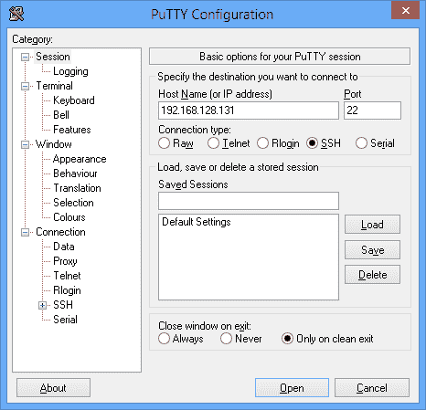
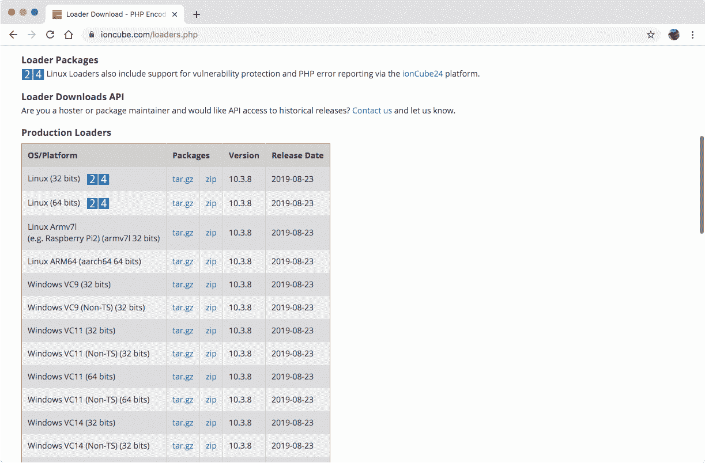
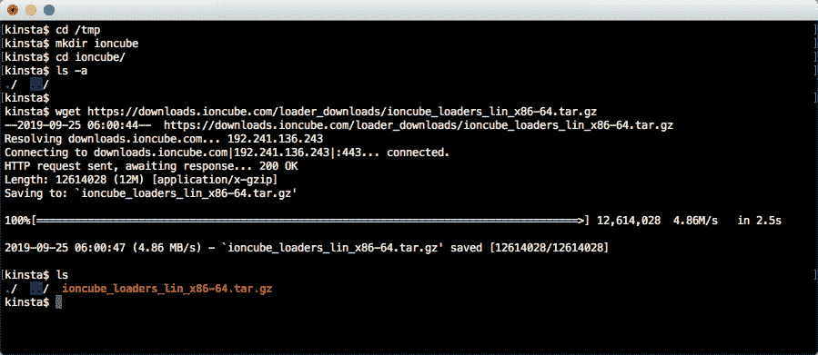
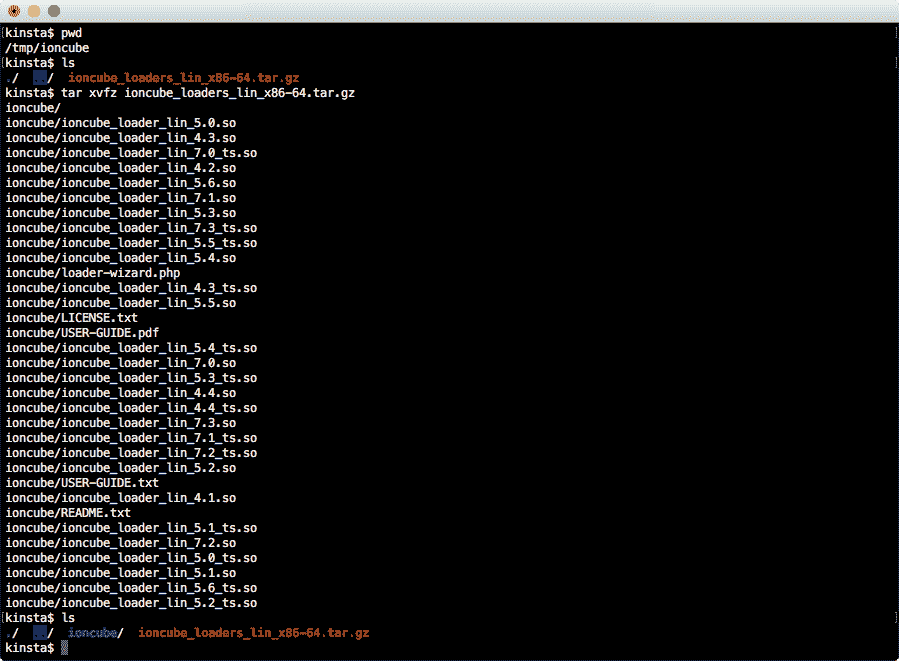
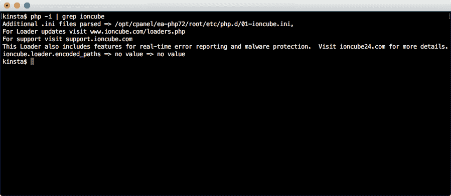
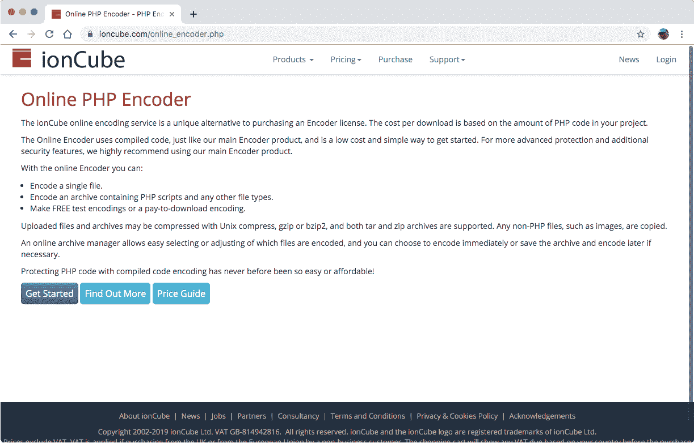
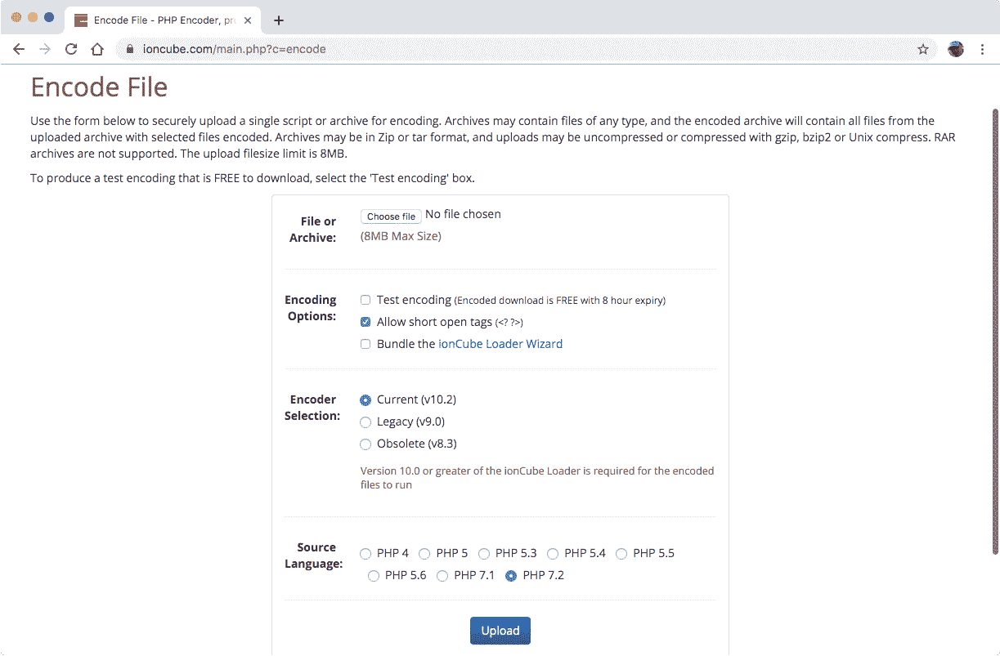

# 如何安装 ionCube Loader(分步教程)

> 原文:# t0]https://kinta . com/blog/ioncube loader/

如果你需要在你的应用程序中加密 PHP 代码，那么一个非常受欢迎的选择是 [ionCube](https://www.ioncube.com) ，它被设计成可以很好地与小型和企业级应用程序集成。

通常，在应用程序发布之前，PHP 源代码首先通过 [ionCube 编码器](https://www.ioncube.com/php_encoder.php)。这可以保护代码不被人阅读或编辑。

但是，默认情况下，加密的 PHP 源代码不能直接在服务器上执行。在 PHP 引擎处理它之前，需要对它进行解密。

这就是 ionCube 加载器的用武之地。

## 介绍

它于 2002 年首次发布，是一个 PHP 扩展，可以动态解密(之前加密的)代码，并准备好与 PHP 应用程序的其余部分一起执行。

一切都是为了安全。如果 PHP 应用程序包含专有代码/算法，或者需要软件许可功能，那么使用 ionCube 是保护源代码的理想解决方案。

要对 PHP 文件进行编码，你首先需要购买 ionCube 编码器。还有一个在线版本的编码器可用，它支持为测试目的免费加密 PHP 代码(下面将详细介绍)。


> Kinsta 把我宠坏了，所以我现在要求每个供应商都提供这样的服务。我们还试图通过我们的 SaaS 工具支持达到这一水平。
> 
> <footer class="wp-block-kinsta-client-quote__footer">
> 
> 
> 
> <cite class="wp-block-kinsta-client-quote__cite">Suganthan Mohanadasan from @Suganthanmn</cite></footer>

[View plans](https://kinsta.com/plans/)

至于 ionCube loader，任何人都可以免费下载并安装到他们的服务器上。ionCube loader 有各种不同的版本，每一个版本都是为特定的系统(Linux、Windows、macOS 等)设计的。)，以及 32 位或 64 位架构。

下载后，您需要安装与您服务器上运行的 PHP 版本相匹配的 ionCube 加载器版本，因为每个可用的下载都包含多个版本的 ionCube 加载器，适用于所有不同的 PHP 版本[。](https://kinsta.com/blog/php-benchmarks/)

如果你不确定你需要下载和安装什么版本，那么不要担心，我们很快会详细讨论这个问题。

顺便提一下，如果你使用 HHVM (HipHop 虚拟机)来处理 PHP，那么你需要知道 ionCube loader 不支持 HHVM。

然而，这主要是一个有争议的问题，因为从 3.30 版本开始， [HHVM 就停止了对 PHP](https://kinsta.com/blog/hhvm-wordpress/) 的支持。所以这只有在你使用旧版本的 HHVM 时才有意义。如果你还在使用 HHVM，并且需要用 ionCube 加密 PHP 文件，那么你必须切换到一个更标准的支持 ionCube 的 PHP 引擎。
T3】

## 准备安装

为了完成 ionCube loader 的手动安装，最好先熟悉常用的[终端命令](https://ss64.com/bash/)。如果您已经熟悉终端，请随意跳到下一部分。

在本指南中，我们引用了以下终端命令:

*   [cat](https://ss64.com/bash/cat.html)–将文件内容输出到终端。
*   [CD](https://ss64.com/bash/cd.html)–改变当前工作目录。
*   [CP](https://ss64.com/bash/cp.html)–复制一个或多个文件。
*   [echo](https://ss64.com/bash/echo.html)–向终端输出消息。
*   grep-强大的基于文本的搜索。
*   [head](https://ss64.com/bash/head.html)–输出文件的开始几行。
*   [ls](https://ss64.com/bash/ls.html)–列出文件和目录。
*   创建一个新的目录。
*   [nano](https://www.nano-editor.org/)–终端窗口内的简洁文本编辑器。
*   [ssh](https://ss64.com/bash/ssh.html)–创建一个新的远程 SSH 连接。
*   从档案中提取文件。
*   [wget](https://www.gnu.org/software/wget/manual/wget.html)–通过 HTTP 下载文件。

了解这些终端命令的作用以及如何使用它们将使 ionCube loader 的安装过程变得更加容易。有关每个命令的更多详细信息，请单击链接。

### 在 MyKinsta 中启用 ionCube 加载器

如果你是 Kinsta 的客户，可以在 MyKinsta 中启用 ionCube loader。要启用 ionCube loader，请转到**站点>工具> ionCube Loader，**并按下“启用”按钮。目前，ionCube loader 只能在使用 PHP 7.4 或 8.1 的网站上启用(PHP 8.0 不支持 ion cube)。 **ionCube 对 Kinsta 的客户是免费的，可以安装在任何计划上**。

[](https://kinsta.com/wp-content/uploads/2019/12/mykinsta-enable-ioncube-loader.jpg)

Enable ionCube loader in MyKinsta.


如果您不是 Kinsta 客户端，我们将在下面带您了解如何在 VPS 上手动安装 ionCube loader。确保你拥有完全的 SSH 访问权限，并且能够轻松执行 T2 终端命令。


## ionCube 加载器的手动安装

在您的服务器上手动安装 ionCube loader 需要一组特定的步骤。根据您的具体服务器设置，这个过程可能略有不同，但是只要您运行的是基于 Linux 的服务器，差异应该是最小的。

在安装过程中，我们将详细介绍以下每个步骤:

1.  [通过 SSH](#ssh-connect) 远程连接到您的站点。
2.  [下载并解压 ionCube Loader PHP 扩展](#download-ioncube-loader)。
3.  [复制 ionCube 加载程序。所以文件](#copy-dot-so-file)。
4.  [配置和服务器重启](#configure-and-reboot-server)。
5.  [验证 ionCube 加载器安装](#verifying-installation)
6.  [测试 ionCube 安装](#testing-installation)
7.  [检查安装问题的错误日志](#checking-error-logs)

### 通过 SSH 远程连接到您的站点

在我们可以下载并开始安装 ionCube loader 之前，我们需要通过 SSH(安全 Shell)建立一个到服务器的安全远程连接。这已经成为通过命令行与服务器交互的标准方法，我们将在 ionCube loader PHP 扩展的安装过程中进行扩展。

要打开一个新的 SSH 连接，您需要准备好以下信息，每次登录时都必须输入这些信息:

*   主机名
*   通道数
*   用户名
*   密码

提前查找这些信息并记下来是个好主意。通常，这些信息可以在你的服务器 [cPanel](https://kinsta.com/knowledgebase/what-is-cpanel/) 或者像 [MyKinsta](https://kinsta.com/mykinsta/) 这样的仪表板中找到。如果你找不到你要找的信息，你的主人可以帮忙。

您也可以使用 SSH 密钥连接到您的远程服务器。这种方法通常被认为是通过 SSH 连接的更安全的方式。您的服务器应该支持这两种方法。

如果您想使用 SSH 密钥，而不是在每次登录时输入用户名/密码组合，那么请看一下本[综合指南](https://kinsta.com/help/connect-to-ssh/)了解更多信息。

如果你使用的是 macOS 或 Linux 操作系统，那么内置终端就可以进行 SSH 访问。然而，如果你使用的是 Windows，你需要使用 SSH 客户端，比如 [PuTTY](https://www.putty.org) ，因为这个特性在默认情况下是不可用的。



PuTTY – Windows SSH Client


在本指南的剩余部分，我们将使用 macOS 终端。要通过 SSH 连接到您的服务器，您需要以下详细信息:

*   用户名
*   主机名
*   通道数
*   密码(SFTP)

SSH 终端命令采用以下形式:

```
ssh [[email protected]](/cdn-cgi/l/email-protection) -p portnumber
```

端口号通常是`22`，但对于您的特定服务器，它可能会有所不同。例如，共享服务器和专用服务器可能使用不同的端口号，因此如果您不确定，请在尝试连接之前咨询您的主机提供商。

一旦输入了`ssh`命令，就会提示您输入密码，之后远程 SSH 连接完成，您就可以直接访问服务器了。


Remote SSH Connect to Server


### 下载并解压缩 ionCube Loader PHP 扩展

有不同版本的 [ionCube loader](https://www.ioncube.com/loaders.php) 可供下载。这些按平台和发布日期列出，以便更容易选择与您的特定系统相关的正确版本。



ionCube loader download archives


您可以选择订阅 ionCube 加载器更新，以确保您的加载器扩展保持最新版本。

为了找出哪一个加载程序版本适合您的服务器，我们可以使用 PHP 命令来显示详细的 PHP 配置数据。

```
[phpinfo()](https://www.php.net/manual/en/function.phpinfo.php)
```

要使用这个 PHP 函数输出所需的数据，请完成以下步骤:

*   通过 SSH 连接到您的服务器。
*   创建一个 PHP 文件。
*   添加 [`phpinfo()`功能](https://kinsta.com/knowledgebase/phpinfo/)。
*   将文件保存在根网站文件夹中
*   在浏览器中显示。
*   在文档中搜索 *ionCube* 引用。
*   完成后删除文件。

仅仅显示服务器 PHP 配置数据就要做很多工作。幸运的是，通过终端有一种更简单的方法。

运行`php -i`命令将从 PHP CLI 引擎获得与`phpinfo()`相同的响应。然而，我们只希望输出前几行，因为这包含了 PHP 运行的服务器环境的相关信息。

这可以通过以下方式实现:

```
php -i | head -n 5
```

这将输出以下信息:


Determining ionCube Loader Version


如您所见，我们的特定服务器是基于 Linux 的，而`x86_64`指的是 64 位系统。所以我们应该下载的 ionCube 加载程序是 tar.gz 档案库的 64 位 Linux 版本。确保下载与您的系统相关的 ionCube 加载器归档文件。

ionCube 加载器归档文件应该下载到一个临时文件夹中，所以在我们做任何其他事情之前，让我们现在创建一个:

```
cd /tmp
mkdir ioncube
cd ioncube/ 
```

要实际下载 ionCube 归档文件，请使用`wget`命令。

```
wget 
https://downloads.ioncube.com/loader_downloads/ioncube_loaders_lin_x86-64.tar.gz 
```

这会将 ionCube 加载器包下载到临时文件夹中，并输出下载进度，直到下载完成。



Download ionCube Archive


成功下载存档文件后，将其解压缩到同一个`/tmp`文件夹中，使用:

```
tar xvfz ioncube_loaders_lin_x86-64.tar.gz 
```



Extract ionCube Archive


这会将所有存档文件提取到一个新的`ioncube`文件夹中。用`ls ioncube`列出它们:


ionCube Loader Files


如您所见，有多个扩展名为`.so`的单独的 ionCube 加载器文件。每个文件名都包含一个不同的数字，代表服务器上运行的 PHP 版本，所以安装正确的版本很重要。

前面，我们运行了命令`php -i | head -n 5`来获取服务器操作系统信息。前几行输出也给出了 PHP 版本，在我们的例子中是`7.2.22`。

为了快速确定我们应该使用哪个 ionCube loader 文件，只列出包含`_7`的文件，以便更容易只看到感兴趣的文件。

我们可以通过将输出从`ls`传送到`grep`来过滤文件列表:

```
ls ioncube | grep _7
```

这导致:


Filtered ionCube Loader Files


与我们的 PHP 版本最匹配的是**ion cube _ loader _ Lin _ 7.2 . so**。还有另一个匹配的文件叫做**ion cube _ loader _ Lin _ 7.2 _ ts . so**，但是我们可以忽略它，因为它是线程安全的版本，与我们特定的服务器设置无关。

顺便说一句，如果你想知道的话。所以文件是一种代表“共享对象”的库文件。这些有点类似于 DLL(动态链接库)文件，如果你是 Windows 用户，你可能会很熟悉。

### 正在复制 ionCube 加载程序。所以归档

要完成 ionCube 加载器的安装，我们只需要将*ion cube _ loader _ Lin _ 7.2 . so*文件复制到 PHP 扩展文件夹中。

## 注册订阅时事通讯


### 想知道我们是怎么让流量增长超过 1000%的吗？

加入 20，000 多名获得我们每周时事通讯和内部消息的人的行列吧！

[Subscribe Now](#newsletter)

要找到 extensions 文件夹的位置，请输入以下终端命令:

```
php -i | grep extension_dir
```

它返回包含所需信息的字符串。

```
extension_dir => /opt/cpanel/ea-php72/root/usr/lib64/php/modules => /opt/cpanel/ea-php72/root/usr/lib64/php/modules
```

不要忘记，这可能是您自己的服务器所独有的。现在我们知道了目标文件夹，我们可以复制 ionCube 加载器文件。

```
sudo cp /tmp/ioncube/ioncube/ioncube_loader_lin_7.2.so /opt/cpanel/ea-php72/root/usr/lib64/php/modules
```


Copy ionCube loader to the installation directory


现在 ionCube 加载器在正确的位置，但是我们需要让 PHP 知道扩展是可用的，以及它安装在哪里。

我们可以通过编辑主 *php.ini* 配置文件并添加一个新的 *zend_extension* 条目来指定到*ion cube _ loader _ Lin _ 7.2 . so*的路径。

然而， [php.ini 通过终端](https://kinsta.com/knowledgebase/the-uploaded-file-exceeds-the-upload_max_filesize-directive-in-php-ini/#3-create-or-edit-phpini-via-ftp)编辑起来很麻烦，但是我们可以利用 php 支持使用定制配置文件的优势来解决这个问题。

唯一的警告是，这些必须位于特定的目录中，我们可以通过输入:

```
php -i | grep 'additional .ini files'
```


Find the custom PHP configuration folder


我们现在拥有了创建自定义配置文件并将其添加到正确位置的所有信息。

```
bash -c 'echo "zend_extension=/opt/cpanel/ea-php72/root/usr/lib64/php/modules/ioncube_loader_lin_7.2.so" > /opt/cpanel/ea-php72/root/etc/php.d/00-ioncube.ini' 
```

注意我们的习俗*。ini* 文件以 *00* 为前缀，这是一种在其他 PHP 配置文件之前加载它的方式，以确保它运行时不会与其他自定义配置文件冲突。


### 配置和服务器重启

现在应该可以正确安装 ionCube loader PHP 扩展了。但是，在我们使用它之前，我们需要做一些整理工作。

安装后，请务必执行以下操作:

*   重新加载服务器
*   重启 PHP 引擎
*   清除网站缓存

可以通过命令行重新加载服务器，但具体的命令会因不同的服务器设置而异。因为我们在我们的服务器上运行 [Nginx](https://kinsta.com/knowledgebase/what-is-nginx/) ,所以我们使用:

```
sudo /etc/init.d/nginx reload
```

PHP 可以直接从 cPanel 或 dashboard 重启。重启 PHP 通常需要几秒钟，完成后会显示一个弹出通知。

你应该做的最后一件事是[清除站点缓存](https://kinsta.com/blog/wordpress-clear-cache/)，以确保你看到的是对服务器配置的最新更改。

一旦完成了这些最后的步骤，ionCube loader 现在应该已经在您的服务器上正确安装和配置了，可以解密 PHP 编码的文件了。

### 正在验证 ionCube 加载程序安装

要验证 ionCube loader 是否已正确安装和配置，您可以做几件事情。

厌倦了低于 1 级的 WordPress 托管支持而没有答案？试试我们世界一流的支持团队！[查看我们的计划](https://kinsta.com/plans/?in-article-cta)

首先，使用`php -i`

如果安装了 ionCube loader，那么详细信息将显示在输出中。

但是，这会向终端输出大量数据，您必须手动滚动这些数据来查找 ionCube 引用。事实上，`php -i`的输出通常超过 1000 行文本。

您可以使用`php -i | wc -l`终端命令来查看输出行的确切数量。

手动搜索终端输出实际上是不可行的，所以我们可以将来自`php -i`的输出直接输入到`grep`命令中，并且只返回我们感兴趣的信息。

为此，请在终端窗口(仍通过 SSH 连接到您的 web 服务器)中输入以下内容:

```
php -i | grep ioncube
```



Display PHP configuration information


如果您看到对 ionCube loader 的引用，则说明安装已成功。

您还可以通过`php -v`终端命令访问关于 ionCube 加载器的信息。这将显示 ionCube 加载程序的特定版本(如果已安装)。


Display PHP version information


如果您没有通过`php -i`或`php -v`看到任何与 ionCube 相关的输出，那么安装可能有问题。在这种情况下，您可以根据需要尝试重做一些(或全部)安装步骤，看看是否能解决问题。

如果问题仍然存在，请联系您的主机，他将能够为您提供所需的适当操作。

另一个推荐的方法是创建一个 [phpinfo 页面](https://kinsta.com/knowledgebase/phpinfo/)，加载它，然后搜索“ioncube”。这样你就能知道 ionCube 是否安装成功，安装的版本是什么。

### 测试 ionCube 安装

除了简单地验证是否安装了 ionCube loader 之外，还值得进行一次现场测试，以确保在生产文件上使用该扩展之前，它能够按预期工作。

现在，让我们通过编码一个 PHP 文件并测试它在上传到服务器时是否正确执行来完成这项工作。编码 PHP 代码最简单的方法之一是使用[在线编码器](https://www.ioncube.com/online_encoder.php)。



Online ionCube encoder


在上传要编码的文件之前，您需要注册一个免费的 ionCube 帐户。点击**登录**菜单项，按照屏幕提示创建账户。

登录后，您将可以访问编码器[上传页面](https://www.ioncube.com/main.php?c=encode)。



Upload PHP file to be encoded


通常情况下，为生产代码编码 PHP 文件是收费的，但出于测试目的是免费的。

任何编码的测试文件都只能通过 ionCube decoder PHP 扩展进行主动解码，解码时间最长可达 8 小时(T1)，超过 8 小时后，这些文件将失效，无法解码。但是这足够测试一切正常工作了。

创建一个测试 PHP 文件并上传到在线编码器。确保选中测试编码框。

然后，上传的文件被自动放入队列中进行编码。如果这个过程成功，几秒钟后你会看到一个页面，显示结果以及一个**下载**链接来访问编码文件。


Encoded uploaded ionCube files


当您下载文件时，您会注意到它被附加了当前时间戳，以区别于原始文件。

例如，我们最初的文件名**ioncuber-loader-test.php**被编码，然后作为【ioncuber-loader-test-encoded-190924-100632.php】T2 供下载。

您可以在测试文件中包含任何您喜欢的有效 PHP 代码。对于我们的测试 PHP 文件，我们添加了一个简单的函数，它返回一个与消息一起显示的数字。

```
 <?php

function mySecretFunction() {
  return '42';
}

echo "<h1>ionCube Loader Test Page</h1>";
echo "<p>Output of encoded function: " . mySecretFunction() . 
"</p>"; 
```

相比之下，通过编码器运行后，下载的文件包含以下内容:

```
 <?php //0059b
// 10.2 72
// 
// IONCUBE ONLINE ENCODER EVALUATION
// THIS FILE IS LICENSED TO BE USED FOR ENCODER TESTING
// PURPOSES ONLY AND SHOULD NOT BE DISTRIBUTED
// 
if(!extension_loaded('ionCube Loader')){$__oc=strtolower(substr(php_uname(),0,3));$__ln='ioncube_loader_'.$__oc.'_'.substr(phpversion(),0,3).(($__oc=='win')?'.dll':'.so');if(function_exists('dl')){@dl($__ln);}if(function_exists('_il_exec')){return _il_exec();}$__ln='/ioncube/'.$__ln;$__oid=$__id=realpath(ini_get('extension_dir'));$__here=dirname(__FILE__);if(strlen($__id)>1&&$__id[1]==':'){$__id=str_replace('\\','/',substr($__id,2));$__here=str_replace('\\','/',substr($__here,2));}$__rd=str_repeat('/..',substr_count($__id,'/')).$__here.'/';$__i=strlen($__rd);while($__i--){if($__rd[$__i]=='/'){$__lp=substr($__rd,0,$__i).$__ln;if(file_exists($__oid.$__lp)){$__ln=$__lp;break;}}}if(function_exists('dl')){@dl($__ln);}}else{die('The file '.__FILE__." is corrupted.\n");}if(function_exists('_il_exec')){return _il_exec();}echo("Site error: the ".(php_sapi_name()=='cli'?'ionCube':'[ionCube](http://www.ioncube.com)')." PHP Loader needs to be installed. This is a widely used PHP extension for running ionCube protected PHP code, website security and malware blocking.\n\nPlease visit ".(php_sapi_name()=='cli'?'get-loader.ioncube.com':'[get-loader.ioncube.com](http://get-loader.ioncube.com)')." for install assistance.\n\n");exit(199);

?>
HR+cPrb0lpjMgGF/p2/rAXWaVsF5lgbOo0LYkBQu2sZ7cHDIXwoQ+LPTtnDTw0hOl5Yfp7CvmV5c
bV90201GkQl3Lr5trbc0XXBJxV+hFqwsyPhXemDwQ37Lf0HHckqLWF5yXiIoErSIQzS8RbI1n49R
e2kRxmrwA+P2WbIZabhhXUPGZcn91NmJyW4qKz3xynZh+nvarORpi8tXqwPA3QUY7QZtwABJQs3U
lLpo3+X9sowLMgzttHBNNcGOZ73HVSgZ9eUtTRCeaswT4geKbT2qa0LgL8vhtl7RuymBklX1Rm0Q
1Aete/XaFhX6YG+B66t6nXBisZ5+P1O3YomFuW+rhbMbT1w3lk+MY+Ri5SCnRuvMig8ZWkchG3wX
XMpoGoP2uWectVSOROY+vmaGD+WTFjEFyw1C93T5qU4If5Ql/AdXA7s+ISvH8D5rqKSheLfnBQ2d
yx5yu5FEMrJwLA9g2g3xf2OSV5X1+1DmkRVEvY0tcukjjYVCcvbDKSBQpigXvYiTHAouI5ANmYbR
pMURAoAO9gUSm3Bul7HZdaQRwH2Fyp3na3hWGiSTdp5EXEDMTKRWtiB5nPPQ3MmVO6F2Er62h3Ov
N0oR6uCDj/y11u3Re6BQ2laN2k9m9ylnsMYketpe+OOMaoA6+n1yVpYWkBra+vr+Veh9+oQkXQBP
ZG4bUtd+4UIWW057ZMkKS4+2S3dSDHjcU/Op9ZSp2VFpSOlaqssNgA9WMGP0b8xhbTOPx6FqgY09
/WnmQyto9goSeIfAcc1braP74ILD9DLwVRG1aXHIC6WGhPYzafs+gut8DHebHUzSPj3JYu9t6/w2
1Nnuc5Dso5SnAa8v2AabXUvZBpQrYTf8tY1L0zL8sqTIvTlv/tRCpsu4hrwFg7hqx+6OsXaWiLwY
xtfwBfCbGS1a/c2+OhUujEllco6gB1KoekhLv9xVj70cRWRgnf+nSCcCc2bFjk4+VtJh+07M9CRO
vqaTu78gagPGMVFYebH5AvOLOKn8Ao1A1lX+GdiD0mLr8BAQ2jrZx1i8wZ0ILNuKRFWvFnYK4Bjg
SYImW2oc6Mg/u50B/Y+mjAeIbpUfm+Ksetd5n2sFetQt831K3u891bKBPw8AzqtGzhLjihFhORCG
BIwx+aA8AvUMeR4Uuk/FdyxATCqly93/crGkCwUQWrvPY5hA9KvtmOFvYPUVpuFZKS5BPzUySat3
ChtDQpr7H7N9phQvoSZ7pTBOGoyfVDTn1abQVMYQXbrW+yee+wBnGiUpGpR3MgkUPHKX/N36+P8o
Ld5obAtVtNjgiQjcYwI6KkrNmH22sqHlILAnR7yUn0== 
```

这与原始源代码完全不同，因此编码器已经完成了它的工作！

现在重要的问题是:安装的 ionCube decoder 扩展是否能够分析文件并对其进行解码，以便它可以作为正常的 PHP 代码执行？

为了找到答案，我们将这两个 PHP 文件上传到服务器，并在浏览器中查看它们。首先是包含原始 PHP 代码的原始文件。


Raw PHP file test


页面按预期显示。现在是编码的 PHP 文件。


Encoded PHP file test


这显示完全相同，因此验证 ionCube 解码器扩展已安装并正常工作。

### 检查安装问题的错误日志

验证安装是否成功的最后一件事是查看服务器错误日志，查找与 ionCube 安装相关的最新条目。

如果您在错误日志中看到类似以下内容的任何内容，那么您需要联系您的主机，以便他们可以进一步调查:

```
PHP Fatal error: The file 
/www/sitename_xxx/public/wp-content/themes/theme-name/functions.php was encoded by the ionCube Encoder for PHP 5.6 and cannot run under PHP 7.1
```

访问错误日志所需的步骤因主机而异，因此如果您不确定错误日志位于何处，最好先进行检查。

Kinsta 客户可以在他们的 MyKinsta 仪表板中查看[错误日志。](https://kinsta.com/knowledgebase/wordpress-error-log/)

[Need to encrypt PHP in your application? Learn how to use and install ionCube Loader with this in-depth guide!Click to Tweet](https://twitter.com/intent/tweet?url=https%3A%2F%2Fkinsta.com%2Fblog%2Fioncube-loader%2F&via=kinsta&text=Need+to+encrypt+PHP+in+your+application%3F+Learn+how+to+use+and+install+ionCube+Loader+with+this+in-depth+guide%21&hashtags=ioncube%2Cphp)

## 摘要

到目前为止，希望您已经安装了 ionCube Loader PHP 扩展并在您的服务器上运行。让我们花点时间来回顾一下我们所做的事情。

我们了解到，ionCube loader 是一个 PHP 扩展，它有一个专门的目的，就是在服务器请求时，即时解密先前加密的 PHP 文件。

为此，当使用 SSH 连接连接到服务器时，需要通过一系列终端命令正确安装加载程序。

一旦建立了与服务器的安全连接，就可以开始 ionCube loader 扩展安装过程，该过程可以分为一系列步骤:

1.  将正确的 [ionCube loader](https://www.ioncube.com/loaders.php) 档案文件下载到服务器上的临时文件夹中。
2.  提取下载的档案。选择合适的**。所以** ionCube loader 文件从众多的解压文件中匹配 PHP 的安装版本。
3.  复制 ionCube 加载器**。所以把**文件放到 PHP 扩展文件夹中。这将是一个固定的位置，对于您的特定 [PHP 安装](https://kinsta.com/blog/install-php/)来说是唯一的。
4.  通过编辑主 **php.ini** 文件或创建自定义**，在 PHP 中启用 ionCube 加载器。ini** 文件。添加一个新的`zend_extension`指向安装的 ionCube 加载器文件的位置。
5.  要真正开始处理加密的 PHP 文件，需要重新加载服务器，并重启 PHP 引擎。执行此操作的确切过程因服务器而异。有时也有必要清除站点缓存。
6.  使用`php -i`和`php -v`命令，通过终端验证 ionCube 安装是否成功。
7.  最后一步是进行现场测试，以确保 ionCube 加载器按预期工作。你可以使用[在线编码器](https://www.ioncube.com/online_encoder.php)免费加密 PHP 文件，只要只是为了测试目的。

如果在安装过程中出现任何问题，或者只是为了省心，您还可以检查服务器日志中可能出现的任何错误。

现在轮到你了:你对 ionCube Loader 有什么体验？请在评论中告诉我们！

* * *

让你所有的[应用程序](https://kinsta.com/application-hosting/)、[数据库](https://kinsta.com/database-hosting/)和 [WordPress 网站](https://kinsta.com/wordpress-hosting/)在线并在一个屋檐下。我们功能丰富的高性能云平台包括:

*   在 MyKinsta 仪表盘中轻松设置和管理
*   24/7 专家支持
*   最好的谷歌云平台硬件和网络，由 Kubernetes 提供最大的可扩展性
*   面向速度和安全性的企业级 Cloudflare 集成
*   全球受众覆盖全球多达 35 个数据中心和 275 多个 pop

在第一个月使用托管的[应用程序或托管](https://kinsta.com/application-hosting/)的[数据库，您可以享受 20 美元的优惠，亲自测试一下。探索我们的](https://kinsta.com/database-hosting/)[计划](https://kinsta.com/plans/)或[与销售人员交谈](https://kinsta.com/contact-us/)以找到最适合您的方式。