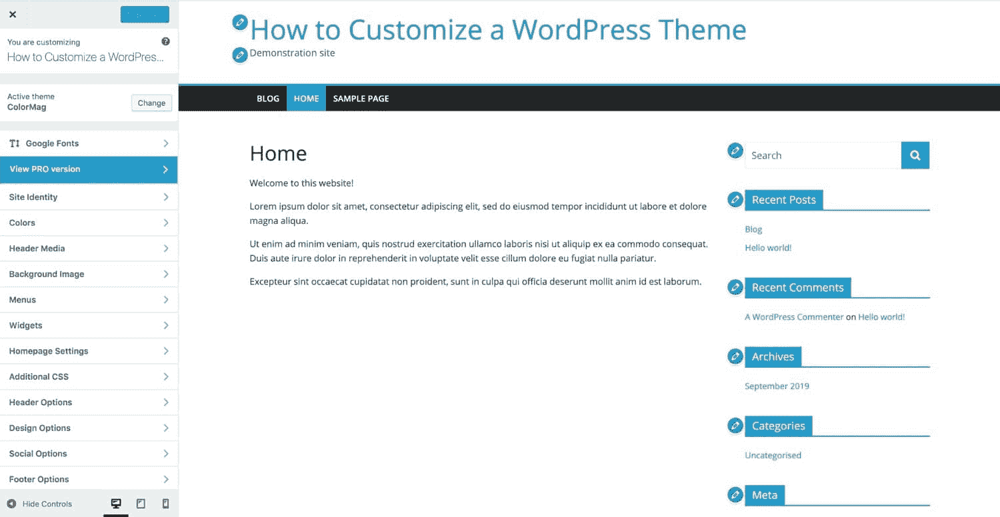
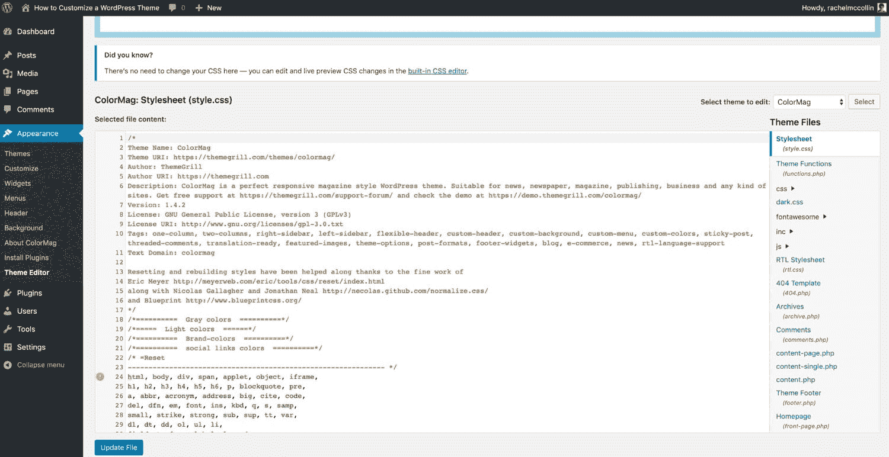
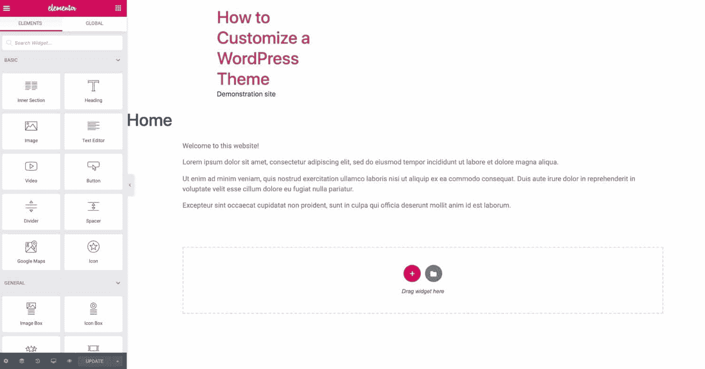
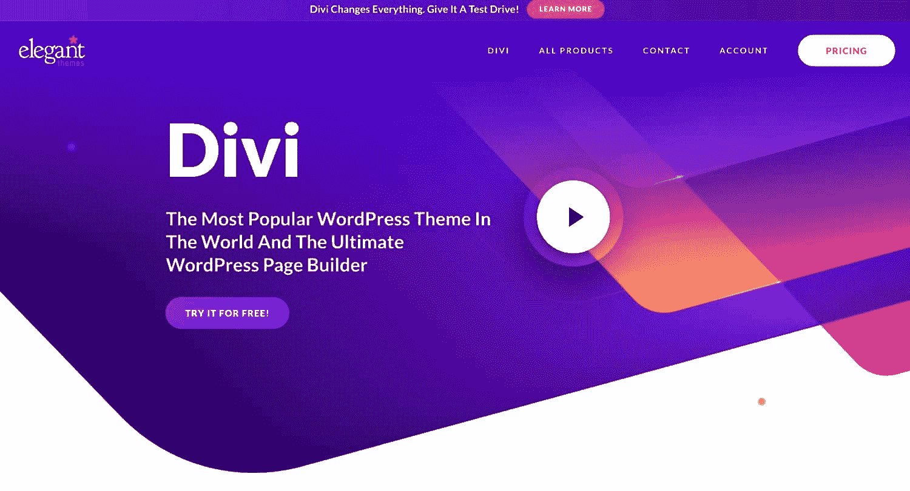
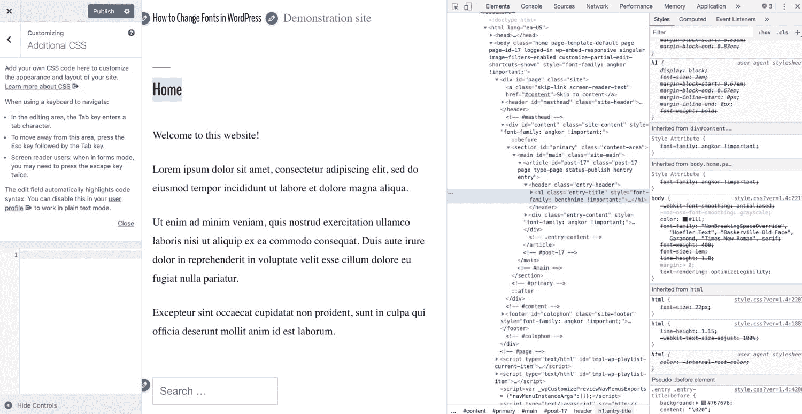
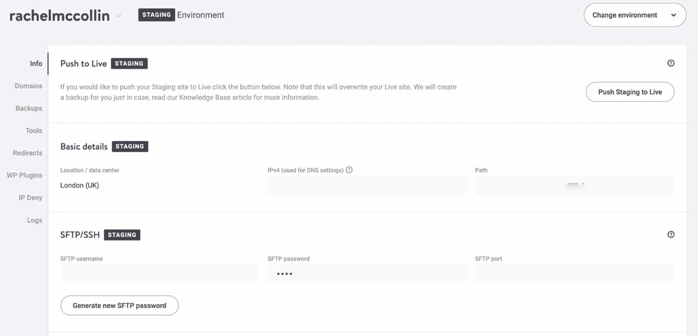
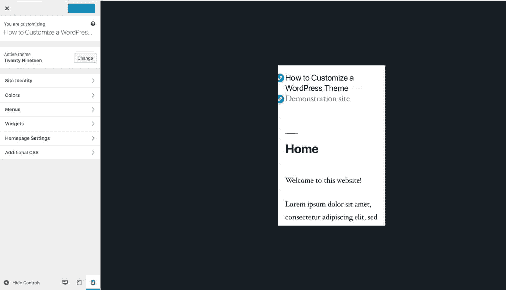

# 如何定制你的 WordPress 主题(5 个步骤)

> 原文:[https://kinsta.com/blog/how-to-customize-wordpress-theme/](https://kinsta.com/blog/how-to-customize-wordpress-theme/)

如果你已经[安装了一个 WordPress 主题](https://kinsta.com/blog/how-to-install-a-wordpress-theme/)但是它不太适合你，你可能会感到沮丧。有很多选项可供你定制你的[主题](https://kinsta.com/best-wordpress-themes/)。

挑战在于找到正确的方法来做这件事。

在这篇文章中，我将指导你定制你的 WordPress 主题，帮助你决定哪一个适合你，并告诉你如何安全有效地完成它。

### **更喜欢看[视频版](https://www.youtube.com/watch?v=Ug74WmYV5Ws)？**

## 自定义主题的选项

在我们开始改变你的主题之前，了解有哪些选项是值得的，因为它们适合不同的情况。

以下是您可用选项的概述:

> 需要在这里大声喊出来。Kinsta 太神奇了，我用它做我的个人网站。支持是迅速和杰出的，他们的服务器是 WordPress 最快的。
> 
> <footer class="wp-block-kinsta-client-quote__footer">
> 
> 
> 
> <cite class="wp-block-kinsta-client-quote__cite">Phillip Stemann</cite></footer>

[View plans](https://kinsta.com/plans/)

*   如果你想给你的主题添加功能，安装一个插件。
*   根据你的主题，使用你的 [WordPress 管理](https://kinsta.com/knowledgebase/wordpress-admin/)屏幕中的定制器来[定制字体](https://kinsta.com/blog/how-to-change-font-in-wordpress)，颜色，也许还有布局。
*   如果你正在使用一个[页面生成器](https://kinsta.com/blog/wordpress-page-builders/)主题，使用它的特性来定制你的站点设计。
*   如果你已经安装了一个框架主题，使用一个可用的子主题来定制你的站点，以及管理界面上的任何定制选项。
*   如果你的主题是特定于你的站点的，并且你觉得这样做很舒服，直接编辑主题的代码。
*   如果你想编辑第三方主题的代码，[创建一个子主题](https://kinsta.com/blog/wordpress-child-theme/)。

如果你想[编辑代码](https://kinsta.com/knowledgebase/edit-wordpress-code/)，你有很多选项可用，从使用[块编辑器](https://kinsta.com/blog/gutenberg-wordpress-editor/)，到定制器，一直到编辑文件。我们将在这篇文章中讨论它们，但是让我们从最简单的选项开始:安装一个插件。

## 你真的需要定制你的主题吗？

有时候你根本不需要定制你的主题:相反，你需要[安装一个插件](https://kinsta.com/knowledgebase/how-to-install-wordpress-plugins/)。

主题决定了你网站的设计:它的外观和显示内容的方式(使用我们的[主题检测工具](https://kinsta.com/tools/what-is-my-ip/wordpress-theme-detector/)来识别你喜欢的设计的潜在主题)。插件增加了额外的功能。

如果你想做的改变侧重于功能而不是设计，考虑自己安装一个插件。这可能是你需要编写的插件，也可能是你从插件目录下载的插件，或者是你购买的插件。

如果你发现自己想要编辑主题中的 functions.php 文件，问问自己:

> 如果我将来切换主题，我还想保留这个功能吗？

如果答案是肯定的，那么代码应该放在一个插件中，而不是你的主题中。

使用插件而不是主题的好例子包括添加[小工具](https://kinsta.com/blog/wordpress-widgets/)，注册[自定义帖子类型](https://kinsta.com/blog/wordpress-custom-post-types/)和分类，创建自定义字段和添加额外功能，如[商店](https://kinsta.com/blog/wordpress-ecommerce-plugins/)或 SEO 增强。

## 通过 WordPress 管理界面定制你的 WordPress 主题

如果你想做的改变是以设计为中心的，并且相对简单，你可以通过管理界面来做。定制器给你各种各样的选项来调整你的主题:你能得到什么取决于你的主题。你可能会在外观菜单中看到一个叫做编辑器的东西。避开这一点，原因我将很快描述。

### 通过定制器定制你的主题

定制你的 WordPress 主题最简单的方法是使用 WordPress 定制器。

您可以通过以下两种方式之一进行访问:

*   查看您的网站时(当您登录后)，单击屏幕顶部管理栏中的**自定义**链接。
*   在管理界面中，点击**外观>定制**。

这将带您到定制。

The WordPress Customizer

在上面的截图中，我安装了一个名为 [ColorMag](https://wordpress.org/themes/colormag/) 的免费主题，它有很多定制选项。它为定制器添加了一些设计功能，包括标题图像、社交媒体、类别颜色和一个设计选项选项卡，该选项卡带您进入更多选项卡，您可以在这些选项卡中对站点的布局和设计进行更改。

不同的主题有不同的定制选项，但是新的主题似乎一直在添加越来越多的定制选项。如果你发现一个你喜欢但不太适合你的主题，你可能会发现定制它正好给你你需要的设计和布局。

### 主题编辑器(以及为什么不用它)

在你的管理界面中，你可能会注意到一个叫做主题编辑器的选项，你可以通过**外观>主题编辑器**来打开它。

The WordPress theme editor

这使您可以访问主题中的文件，这意味着您可以直接编辑它们。

不要。

即使你习惯于编写 CSS 或 PHP，像这样编辑你的主题中的文件也是一个非常糟糕的主意，原因有二:

*   如果你已经购买或下载了一个第三方主题，你所做的任何更改都将在你下次更新主题时丢失(并且[出于安全原因](https://kinsta.com/blog/how-to-update-wordpress-theme/)你应该保持你的主题更新)。
*   更重要的是，如果你做了一个破坏你的站点的更改，它不会被跟踪，文件的前一个版本也不会被更改。你可能会不可挽回地破坏网站。

如果你想编辑你的主题中的代码，你应该使用代码编辑器(查看[最佳免费 HTML 编辑器)](https://kinsta.com/blog/free-html-editor/)，并且你不应该编辑你的 live 站点中的文件，直到你已经在 [WordPress 暂存站点](https://kinsta.com/blog/wordpress-staging-site/)上测试过它。如果您需要编辑第三方主题，您应该通过子主题来完成。在这篇文章的后面会有更多关于这两方面的内容。

WordPress 知道使用主题编辑器有多不安全:当你试图访问它时，它甚至会给你一个警告。

Warning not to use the WordPress theme editor

所以接受 WordPress 的建议:不要使用主题编辑器！

## 使用页面生成器和框架来定制你的 WordPress 主题

大部分 WordPress 主题都有定制选项，这意味着你可以通过定制器对设计和布局进行修改。

但是有些主题更进一步，被设计成可扩展和显著定制的。这些主题被称为主题框架。

另一个选择是使用一个插件，让你用一个用户友好的界面设计你的网站:这些被称为页面生成器。

### 使用页面生成器自定义您的主题

页面生成器插件旨在让您轻松设置网站的设计，使用一个界面让您看到您得到的内容。

你安装一个带有兼容主题的页面生成器插件，然后使用它给你的选项，完全按照你想要的方式设计你的网站。

最著名的页面生成器之一是 [Elementor](https://en-gb.wordpress.org/plugins/elementor/) ，但是你可以在我们的[页面生成器综述](https://kinsta.com/blog/wordpress-page-builders/)中找到一些替代方案。

页面生成器让你可以通过拖放界面编辑你的文章和页面，这意味着你可以看到你的内容将会是什么样子，并且可以使每个页面看起来都是独一无二的。

下面，我使用的是带有 [Hello Elementor 主题](https://kinsta.com/blog/fastest-wordpress-theme/#hello-elementor)的 Elementor 页面生成器，与之兼容。

The Elementor interface

页面生成器为您的页面布局和设计提供了很大的灵活性。如果你习惯了像 [Wix](https://kinsta.com/blog/wix-vs-wordpress/) 这样的网站建设者，他们可以帮助[轻松过渡到 WordPress](https://kinsta.com/blog/wix-to-wordpress/) 。如果你喜欢你的 WordPress 内容的 WYSIWYG 界面，他们可以帮助你快速设计你的页面。

### 使用主题框架定制你的主题

页面生成器的另一种选择是主题框架。这些是设计用于协同工作的主题套件。有一个父主题是框架，还有一个子主题的选择，你可以用它来定制主主题，让它看起来像你想要的样子。

主题框架的一个例子是 [Divi](https://kinsta.com/blog/wordpress-page-builders/#divi) ，它有定制选项，可以让你进一步调整子主题的设计，包括一个类似于页面生成器的拖放界面。

The Divi theme

推荐阅读: [Divi vs Elementor: WordPress 页面生成器插件对比](https://kinsta.com/blog/divi-vs-elementor/)

## 编辑你的 WordPress 主题代码

如果你习惯于[编辑 CSS 和/或 PHP](https://kinsta.com/knowledgebase/edit-wordpress-code/) ，那么你可以编辑你的主题中的代码来定制你的主题。

这给了你最大程度的控制。

如果你正在编辑你自己的主题，它是特定于你的站点的，并且是专门为它开发的，那么你可以直接编辑主题。但是如果你正在使用一个第三方主题并想要编辑它，你应该创建一个子主题以避免 T2 在下次更新主题时丢失你的修改。

### 编辑主题文件

编辑你的 WordPress 主题的第一步是理解哪个主题文件控制什么，以及你需要编辑哪个。

#### 样式表

每一个 WordPress 主题都有一个样式表，叫做 style.css，它包含了所有设计你的站点的代码:布局、字体、颜色等等。

## 注册订阅时事通讯

### 想知道我们是怎么让流量增长超过 1000%的吗？

加入 20，000 多名获得我们每周时事通讯和内部消息的人的行列吧！

[Subscribe Now](#newsletter)

例如，如果您想要更改主题中的颜色，您可以对样式表进行编辑。如果您想添加一个新的字体，您可以使用样式表将它应用到不同的元素，比如正文和标题。

编辑样式表时要注意:特殊性意味着元素的代码并不总是来自您认为的地方。元素将从页面层次结构中位于它们之上的其他元素继承样式，除非您添加特定于较低元素的样式。

要发现什么样的 CSS 影响了页面上的哪些元素，您可以使用浏览器中的检查器来查看 CSS(本例中为 Chrome DevTools):

Inspecting code in a WordPress site with Chrome DevTools

然后，您可以使用它来编写新的 CSS，以页面上的单个元素或一系列元素或类为目标。

如果所有这些关于元素、类和特性的讨论对你来说是新的，你可能想要避开直接编辑你的主题的 CSS。至少在你进一步了解 CSS 及其工作原理之前是这样。

#### 函数文件

另一个几乎每个主题都会有的文件是函数文件(functions.php)。这是一个让一堆东西在你的主题中工作的文件。在里面，您可以找到注册主题特性的代码，比如特色图片、小部件等等。

如果你想在你的主题中添加功能代码，这里就是你要添加的地方。但是要注意:在大多数情况下，你真的应该写一个插件。问问你自己:

> 如果我将来切换主题，我还想保留这个功能吗？

如果答案是肯定的，那么就写一个插件，而不是在函数文件中添加代码。插件不必很大:没有什么可以阻止你用几行代码创建一个插件。

函数文件都是用 [PHP](https://kinsta.com/blog/is-php-dead/) 编写的，所以你需要熟悉它。不要盲目地复制你通过谷歌搜索找到的代码:花点时间弄清楚这些代码是做什么的，并理解它们。这样你就不太可能添加不尽如人意的代码。

#### 主题模板文件

主题中的大多数文件都是主题模板文件。这些文件决定了 WordPress 在给定页面上输出什么内容，并且是根据[模板层次](https://kinsta.com/blog/wordpress-child-theme/#how-wordpress-chooses-template-files)选择的。

如果你想改变内容在一个给定的文章类型、页面或文档中的输出方式，你需要编辑其中一个文件或者创建一个新的文件。

例如，假设你的主题有一个 archive.php 文件，用于输出[类别和标签](https://kinsta.com/knowledgebase/what-is-taxonomy/)的归档页面。您想要更改标签的输出方式。所以你创建了一个名为“tag.php”的文件，这个文件是基于 archive.php 的。

再次强调，编辑文件时要小心:它们可能会破坏你的网站。总是首先使用像 [DevKinsta](https://kinsta.com/devkinsta/) 和/或 [WordPress staging](https://kinsta.com/wordpress-staging/) 站点这样的工具在本地安装上进行测试。

无论您需要编辑哪种文件类型，您都应该正确地进行编辑。阅读下面关于最佳实践的部分，了解如何以一种不会破坏您的站点并且不会给您带来安全问题的方式编辑您的代码。

### 使用子主题自定义第三方主题

如果你在网站上运行的主题来自第三方，并且你想编辑代码，你需要[创建一个子主题](https://kinsta.com/blog/wordpress-child-theme/#create)。

这是因为如果你直接编辑主题，然后更新它(这是你应该做的)，你会丢失你所做的所有更改。

厌倦了慢热的主持人？Kinsta 的设计考虑了速度和性能。[查看我们的计划](https://kinsta.com/plans/?in-article-cta)

创建子主题包括四个步骤:

1.  在 **wp-content/themes** 中新建一个文件夹。
2.  在该文件夹中，创建一个样式表。在样式表中，告诉 WordPress 这是您现有主题的子主题。
3.  将您想要编辑的文件的副本添加到子主题中，并在那里进行编辑。
4.  激活站点中的子主题。

WordPress 将总是使用子主题中的文件来输出内容，除非在父主题中有更高层次的文件。如果同一个文件有两个版本，它将使用子主题中的一个。这意味着子主题中的新文件将覆盖父主题中的文件。

## 定制 WordPress 主题的最佳实践

所以你打算定制你的主题。在你继续做改变之前，遵循这些提示来确保你做得安全，并且你不会破坏你的站点，使它容易受到攻击，或者丢失你的代码。

### 如果可能，在不编辑代码的情况下进行自定义

如果您可以通过定制器或管理屏幕中的其他地方进行定制，这比编辑代码更安全。

只有当你熟悉 CSS(对于样式表)和 PHP(对于其他主题文件)并且知道如何安全地做时，才编辑代码。

### 使用本地开发网站进行更改

如果你正在编辑你的主题中的代码或者创建一个子主题来进行修改，你应该在本地安装的 WordPress 上做开发工作，你的主题已经安装好了，你的内容是从你的站点上复制的。

这样，您就有了一个真实站点的镜像来测试您的更改。在本地网站上工作对你的实时网站没有任何影响，而且会更快。

即使您正在使用定制器，使用站点的本地版本进行测试也是有帮助的，因为您可以发布您的更改并测试它们，而不会影响现场站点。

一旦你测试了你的主题的变化，你可以上传到你的现场，或者，更好的是，你可以在一个临时网站上测试，然后[把它推到现场](https://kinsta.com/help/push-staging-live/)。

### 使用版本控制

当您对主题进行更改时，您应该使用版本控制来跟踪您的更改。

最简单的方法是改变主题的版本号并保留两个版本的副本。但是如果你的要做好版本控制，你需要使用像 [GitHub 这样的服务来跟踪你的变化](https://kinsta.com/knowledgebase/what-is-github/)。

这样，如果某个更改导致了问题，您可以轻松地回滚它，而不必进行手动编辑。

如果你是团队的一员，版本控制会更有帮助，因为你可以看到其他成员在做什么。请务必阅读我们的 [git vs Github 指南](https://kinsta.com/knowledgebase/git-vs-github/)。

### 使用临时站点来测试您的更改

如果你可以访问一个 staging site(比如 Kinsta 的[免费 staging](https://kinsta.com/help/staging-environment/) 随所有计划一起提供)，在你的 live 站点上激活你的主题的新版本(或者新的子主题)之前进行测试是最安全的方法。

myKinsta staging

这是因为任何本地站点都会和你的实时站点有一些不同:它在不同的服务器上(在你的本地机器上创建的)，它可能运行不同的 PHP 版本或者任何其他运行你的站点的工具。

在你的升级服务器上复制一份你的网站，然后上传并激活你的新主题。彻底测试你的网站，确保一切正常，然后你就可以把你的改变发布到你的网站上了。

### 让你的主题有针对性

你需要对你的主题做的任何改变都可以在手机和桌面上使用。

随着越来越多的人通过手机访问互联网，以及来自谷歌的的 [Mobile-first index，现在你的主题在手机上工作可能比在桌面上工作更重要。所以你对主题所做的任何改变都需要](https://kinsta.com/blog/google-mobile-first-index/)[移动友好](https://kinsta.com/blog/web-design-best-practices/#mobile-responsiveness)或者最好是移动优先。

这将主要适用于您对样式或布局所做的任何更改:检查新布局是否适用于移动设备，以及您是否添加了媒体查询，以便布局能够适应不同的屏幕大小。

如果你的[主题没有响应](https://kinsta.com/blog/responsive-web-design/)，它会对你的[搜索引擎排名](https://kinsta.com/blog/google-patents-seo-ranking-factors/)和[转化率](https://kinsta.com/blog/conversion-rate-optimization-tips/)产生负面影响。

如果你不能使用很多不同的移动设备进行测试，你可以使用类似于 [BrowserStack](https://www.browserstack.com/) 的工具来查看你的网站在不同设备上的表现。您还可以使用浏览器中的开发工具和定制器中的响应视图。

Responsive tools in the WordPress Customizer

### 确保您的自定义不会影响可访问性

对主题的任何更改也需要让有残疾或感觉障碍的用户能够访问。

这不仅仅是确保你的网站能在屏幕阅读器上工作:其他的考虑因素如配色方案和字体大小对很多人来说也很重要。

如果你对你的主题所做的改变是为了让颜色更亮或者文本更小，请再考虑一下:这可能会让人们很难阅读你的网站或者与你的网站互动。

在你做任何改动之前，使用一个[可访问性检查器](https://www.w3.org/WAI/ER/tools/)来测试你的网站，确保它没有排除用户。

### 坚持 WordPress 编码标准

如果你正在编辑你的主题中的代码或者创建一个子主题，你必须确保你的代码符合 [WordPress 编码标准](https://codex.wordpress.org/WordPress_Coding_Standards)。

这些标准的存在是为了确保代码的一致性和质量，避免[代码变得一团糟](https://kinsta.com/blog/is-wordpress-code-really-a-mess/)。PHP、CSS 和 JavaScript 都有标准，所以花些时间去检查那些与你相关的标准，并确保你遵循它们。

如果你现有的 WordPress 主题编码良好，并且你以一种与此一致的方式编写任何新的代码，你正在确保你的代码是兼容的。请确保您对主题所做的任何更改都添加了注释，以便您或其他人在将来回来处理代码时知道您做了什么。你可能认为你不会忘记，但是几个月后，你会很容易忘记为什么要编辑一行代码。

[Need to customize your #WordPress theme to make it unique? There are plenty of options! Pick the right one for you in our in-depth guide! 👚👔Click to Tweet](https://twitter.com/intent/tweet?url=https%3A%2F%2Fkinsta.com%2Fblog%2Fhow-to-customize-wordpress-theme%2F&via=kinsta&text=Need+to+customize+your+%23WordPress+theme+to+make+it+unique%3F+There+are+plenty+of+options%21+Pick+the+right+one+for+you+in+our+in-depth+guide%21+%F0%9F%91%9A%F0%9F%91%94&hashtags=wpthemes%2Cwordpress)

## 摘要

定制你的 WordPress 主题并不困难。有时候，使用定制器来改变字体、颜色或者你的[图标](https://kinsta.com/knowledgebase/wordpress-favicon/)是一个简单的例子(确保阅读我们关于 [WordPress 字体](https://kinsta.com/blog/wordpress-fonts/)的深入指南)。其他时候，你必须创建一个新的子主题来添加一个新的模板文件到主题中。

你可以选择定制你的主题，包括使用插件或者定制器，直接编辑 WordPress 主题的代码，或者创建一个子主题。

确定适合您的选项并安全地进行自定义，所有这些都不会破坏您的站点。

* * *

让你所有的[应用程序](https://kinsta.com/application-hosting/)、[数据库](https://kinsta.com/database-hosting/)和 [WordPress 网站](https://kinsta.com/wordpress-hosting/)在线并在一个屋檐下。我们功能丰富的高性能云平台包括:

*   在 MyKinsta 仪表盘中轻松设置和管理
*   24/7 专家支持
*   最好的谷歌云平台硬件和网络，由 Kubernetes 提供最大的可扩展性
*   面向速度和安全性的企业级 Cloudflare 集成
*   全球受众覆盖全球多达 35 个数据中心和 275 多个 pop

在第一个月使用托管的[应用程序或托管](https://kinsta.com/application-hosting/)的[数据库，您可以享受 20 美元的优惠，亲自测试一下。探索我们的](https://kinsta.com/database-hosting/)[计划](https://kinsta.com/plans/)或[与销售人员交谈](https://kinsta.com/contact-us/)以找到最适合您的方式。