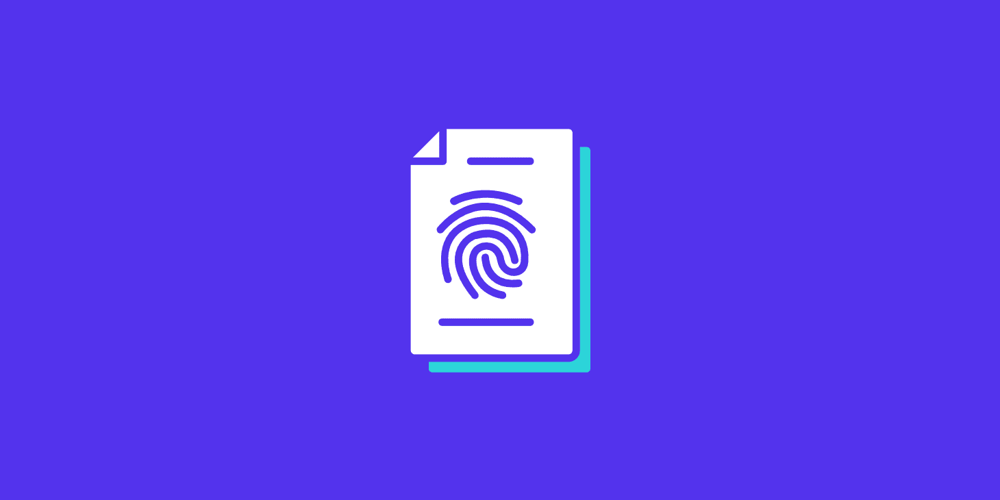
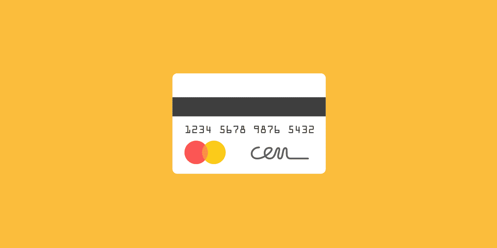
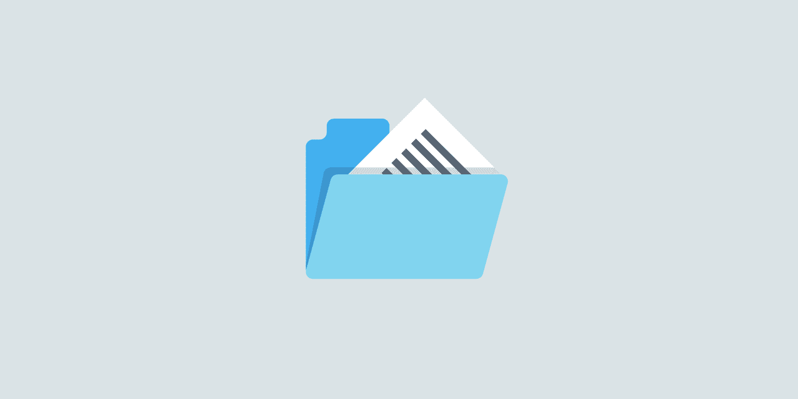
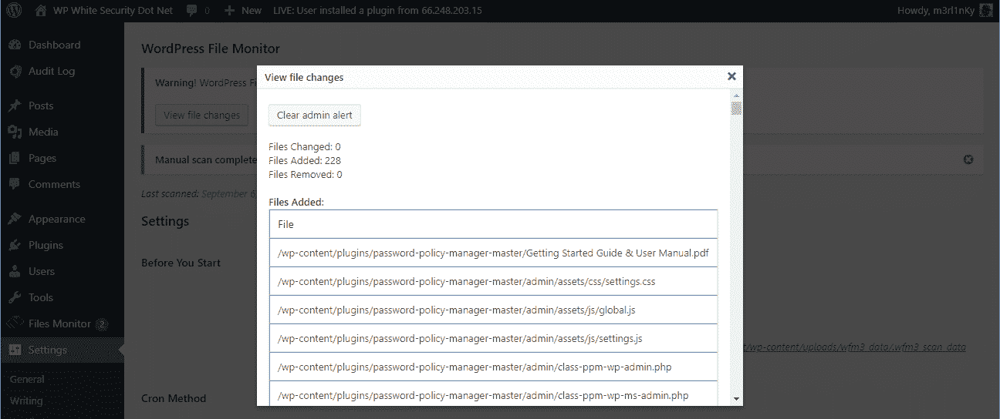
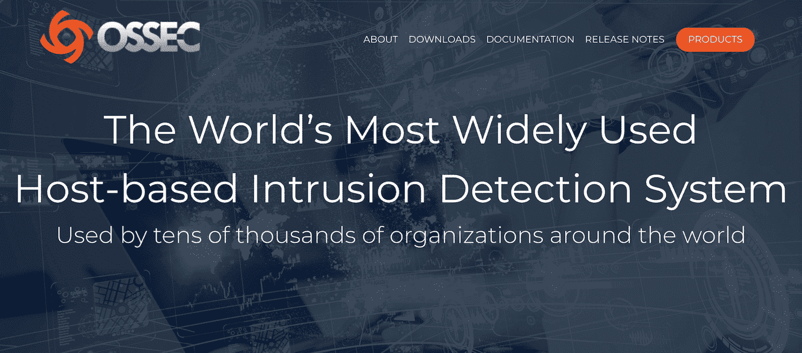

# 什么是文件完整性监控？(以及为什么您需要了解更多信息)

> 原文:[https://kinsta.com/blog/file-integrity-monitoring/](https://kinsta.com/blog/file-integrity-monitoring/)

使用强密码[的默认和最新的 WordPress 安装是非常安全的](https://kinsta.com/blog/is-wordpress-secure/)。然而，在互联网上生存是不够的。

这就是文件完整性监控(FIM)发挥作用的地方。文件完整性监控工具或插件监控您站点的文件，并在文件上传、编辑、删除等任何更改时向您发出警报。

文件完整性监控有助于您提前发现安全漏洞，并识别可能使您的网站遭受黑客攻击的错误。

在本帖中，我们将为您提供文件完整性监控的全面介绍，并解释它如何提高您站点的安全性。我们也将分享一些不同的工具和插件，你可以用它们在你的 WordPress 站点上实现这个安全解决方案。

我们开始吧！

 <kinsta-auto-toc heading="Table of Contents" exclude="last" list-style="arrow" selector="h2" count-number="-1">## 文件完整性监控简介

当涉及到保护和维护网站和[服务器](https://kinsta.com/blog/nginx-vs-apache/)等基础设施时，文件完整性监控是关键。这个解决方案验证给定环境的完整性，也就是说，它检查站点文件的内容是否发生了意外的更改。

您可以使用文件完整性监控来检测操作系统、web 服务器和 web 应用程序(如 WordPress)中的文件更改。它甚至可以用于监控基于文件的软件解决方案，如[数据库](https://kinsta.com/knowledgebase/wordpress-database/)和配置文件。

<link rel="stylesheet" href="https://kinsta.com/wp-content/themes/kinsta/dist/components/ctas/cta-mini.css?ver=2e932b8aba3918bfb818">

使用文件完整性监控解决方案的组织更有可能在早期发现安全漏洞，使他们有更好的机会保持在线并阻止任何重大损害。因此，文件完整性监控主要被认为是一种安全解决方案。

然而，这个解决方案也可以实现其他目标。在某些情况下，它可以监控以下方面的软件和操作系统配置更改:

*   服务器上的开放端口配置。
*   web 服务器和网络服务配置。
*   在服务器上运行或停止服务(守护程序)。

甚至计划中的文件更改有时也会给你的 WordPress 站点带来问题。通过使用文件完整性监控跟踪您的所有修改，您可以轻松确定与文件更改相关的错误的可能原因。

这使得故障排除速度更快，因此您可以[让您的站点立即恢复运行](https://kinsta.com/blog/restore-wordpress-from-backup/)。

## 文件完整性监控的工作原理

文件完整性监控的工作原理是获取站点文件的“指纹”,然后相互比较。如果指纹不同，这意味着文件已经改变。

为了创建指纹，文件完整性监视器(也称为文件完整性扫描器)扫描单个文件，并通过对文件运行[加密哈希函数](https://en.wikipedia.org/wiki/Cryptographic_hash_function)来创建“校验和”——与该文件相关联的唯一数据字符串。

Site file fingerprints

文件完整性监控对于检查其他文件属性也很有用，例如权限和修改日期。这些检查是至关重要的，因为即使是文件权限的简单更改也可能使系统受到攻击。

## 为什么文件完整性监控很重要

使文件完整性监控成为必备安全解决方案的一个方面是它的双重优势，即被动和主动安全解决方案。

### 作为主动安全性的文件完整性监控

主动安全的一个例子是识别开发人员在您的网站上工作时所犯的错误，这些错误可能会暴露您的网站。错误的文件权限、包含敏感信息的剩余文件(如数据库备份或源代码文件)是文件完整性监控可以主动识别的安全威胁的典型例子。

### 作为反应式安全性的文件完整性监控

文件完整性监控解决方案还可以指出在遭受黑客攻击后您的站点上[发生了什么变化，或者恶意软件被注入了哪些文件。](https://kinsta.com/blog/wordpress-hacked/)

除此之外，它甚至可以通过监控重要的 WordPress 站点文件来检查网站设置的变化，比如[wp-config.php](https://kinsta.com/blog/wp-config-php/)和[。htaccess](https://kinsta.com/knowledgebase/wordpress-htaccess-file/) 文件。

多亏了这些关键信息，你可以将你的网站恢复到之前的(干净的)状态，并在尽可能短的时间内清理掉任何类型的恶意软件或“坏代码”。

### 合规要求

对于某些人来说，法律可能还要求进行文件完整性监控。[支付卡行业数据安全标准](https://www.pcisecuritystandards.org/documents/PCIDSS_QRGv3_1.pdf) (PCI DSS)要求合规站点:

> 部署更改检测机制(例如，文件完整性监控工具)以提醒人员注意未经授权的修改

管理网站访问者的敏感信息是一项严肃的责任。如果您在网站上存储任何类型的客户数据，尤其是持卡人数据，启用文件完整性监控有助于您确保此类数据不会被任何人篡改，并使您符合法律规定。

PCI DSS

## 为什么你的 WordPress 站点需要文件完整性监控

WordPress 是一个网络应用程序，它由两种类型的文件组成:非可执行文件和可执行文件。

前者多为日志和[媒体文件](https://kinsta.com/blog/wordpress-media-library/)。日志通常由插件和主题生成，而媒体文件是那些你上传到你的网站的[，比如图像、视频、pdf 等等。它们是不可执行的，因为 web 服务器不执行它们，而只是为它们服务。](https://kinsta.com/knowledgebase/bulk-upload-files-wordpress-media-library-ftp/)

大部分不可执行文件存储在 WordPress 的/wp-content/uploads/目录中。对不可执行文件的更改不会对您网站的[安全性](https://kinsta.com/knowledgebase/disclose-security-vulnerability/)、[性能](https://kinsta.com/blog/debugging-wordpress-performance/)或功能产生影响。事实上，默认情况下，大多数文件完整性监控解决方案都不扫描这些文件。

另一方面，可执行文件包括 [PHP](https://kinsta.com/blog/is-php-dead/) 、JavaScript 和其他包含站点源代码的文件，如 WordPress 核心、插件、主题和您可能有的任何自定义 web 应用程序。可执行文件中的更改可能会发生，但仅当您:

*   [更新 WordPress 核心](https://kinsta.com/knowledgebase/wordpress-core/)
*   [安装新主题](https://kinsta.com/blog/how-to-install-a-wordpress-theme/)或[插件](https://kinsta.com/blog/uninstall-wordpress-plugin/)。
*   [更新你的主题](https://kinsta.com/blog/how-to-update-wordpress-theme/)或者一个[现有的插件](https://kinsta.com/knowledgebase/manually-update-wordpress-plugin/)。
*   卸载(删除)插件或主题。
*   定制你的 WordPress 安装代码，一个主题，或者一个插件(一般不推荐)。

对你的 WordPress 站点的可执行文件的任何其他改变都可能是入侵、[恶意软件注入](https://kinsta.com/knowledgebase/malware-security/)或开发者错误的迹象。在你的 WordPress 站点上运行一个文件完整性监控插件可以帮助你在这些问题对你的网站的安全和功能造成真正的威胁之前发现它们。

简单回顾一下:文件完整性监控可以帮助您识别本应删除的测试文件、大多数恶意软件注入(建议:我们对 [SQL 注入](https://kinsta.com/blog/sql-injection/)的深入指导)——包括后门、重定向、特洛伊木马和任何其他有害的文件更改。

当与[活动日志](https://kinsta.com/partners/wp-security-audit-log/)结合使用时，文件完整性监控可以让您全面了解您的站点上一直在发生什么。您可以进行黑客攻击后的取证，以确定哪些文件是被攻击的目标以及被谁攻击，还可以增强文件周围的安全性，以防止未来的攻击。

## 两种不同类型的文件完整性监控方法

文件完整性监控的基础总是相同的:比较在不同时间点获取的单个文件的指纹。有几种方法可以实现这一点。

 ## 注册订阅时事通讯

### 想知道我们是怎么让流量增长超过 1000%的吗？

加入 20，000 多名获得我们每周时事通讯和内部消息的人的行列吧！

[Subscribe Now](#newsletter)

### 1.将文件与中央存储库进行比较

一种常用的方法是通过使用 WordPress 插件将指纹与中央存储库进行比较(更多关于插件的内容见下文)。在这种情况下，插件会将你网站的 index.php 文件的指纹与 WordPress 最新发布的 index.php 文件的指纹进行比较。

使用这种方法的优点是，您可以很容易地确认您的文件是否与原始文件相同。但是，由于您将数据与中央存储库进行比较，因此存在一些缺点:

*   该解决方案无法识别分布式配置文件中的更改，如。htaccess 和 wp-config.php。
*   如果你自定义你的网站代码，你会被误报。
*   该插件只能比较已知应用程序(WordPress core)的文件，有时也比较流行插件的文件。
*   这些解决方案无法检测定制应用程序或插件的变化，因为没有什么可以与之比较。
*   您的网站的安全性取决于供应商更新原始指纹的速度或中央存储库的可用性。

Comparing files

### 2.将文件与自己生成的数据进行比较

由于基于中央存储库的方法的局限性，比较两组自己生成的数据是首选方法，也是最佳实践所建议的。这种类型的解决方案通过将指纹与他们自己以前的扫描进行比较来检测文件更改。

这意味着插件在安装时生成第一个指纹。然后，当它再次扫描文件时，它会将新的指纹与原始扫描的指纹进行比较。无论何时记录到文件变更，你都可以配置插件来自动接受变更或者向你发送警告。

这种方法优于前一种方法，因为它有以下优点:

*   它可以检测自定义代码中的变化。
*   系统会适应您的网站(您可以验证更改并更新指纹，从而支持持续定制)。
*   它报告的假阳性明显更少。

由于这些原因，当寻找一个文件完整性监控工具或插件时，你会希望选择一个基于自生成数据的工具。

## 您可以使用 3 种文件完整性监控工具来保护您的站点

有几种不同的文件完整性监控解决方案可用。我们将它们分为以下三个基本类别。让我们从头开始！

### 1.服务器级软件解决方案

这些解决方案安装在 web 服务器的操作系统上，并检查 web 服务器上的所有文件。这意味着只有当你有自己的网络服务器或 VPS 时，你才能使用它们。

市场上有几种选择，例如:

与宕机和 WordPress 问题做斗争？Kinsta 是一款考虑到性能和安全性的托管解决方案！[查看我们的计划](https://kinsta.com/plans/?in-article-cta)

*   [绊网](https://www.tripwire.com/products/tripwire-file-integrity-manager/)
*   [Trustwave](https://www.trustwave.com/en-us/)
*   [质量保证](https://www.qualys.com/apps/file-integrity-monitoring/)

作为服务器级的解决方案，这些并不是专门针对 WordPress 驱动的网站。所以他们可能会产生很多假阳性。最重要的是，它们非常昂贵，并且需要高级知识来设置和管理。

### 2.WordPress 插件

如果你想要一个更适合 WordPress 的文件完整性监控解决方案，有各种插件可以完成这个任务。

#### 网站文件更改监视器

网站文件更改监视器是 WordPress 的专用[文件完整性监控插件。它是免费的，当它检测到文件变化时，它会通过电子邮件提醒你。](https://www.wpwhitesecurity.com/wordpress-plugins/website-file-changes-monitor/)

File changes view with menu

该插件使用自己生成的数据进行文件比较，您可以启动按需扫描。这是一个完全可配置的 WordPress 文件完整性监控解决方案，你可以排除文件和目录，配置扫描时间表，等等。

真正让这个插件与众不同的是，它是唯一一个完全了解 WordPress 核心、插件和主题变化的插件。

#### WordPress 文件监视器

[WordPress File](https://wordpress.org/plugins/file-changes-monitor/) Monitor 也是一个专用的文件完整性监控插件，使用自己生成的数据进行比较。然而，它不知道 WordPress 核心，插件和主题的变化，你可能会得到许多关于文件变化的误报。

False-positive alerts

误报警报可能会对网站产生非常负面的影响，因为不了解安全的用户无法验证警报是由关键事件还是仅仅是安全的文件更改生成的。

#### 其他插件选项

以上是 WordPress 仅有的文件完整性监控插件。其他具有文件完整性监控功能的插件是一体化安全解决方案的一部分，如 [Sucuri Security](https://kinsta.com/blog/sucuri-firewall/) 、 [iThemes security](https://kinsta.com/blog/wordpress-security-plugins/#ithemes-security) 和 [Wordfence](https://kinsta.com/blog/wordpress-security-plugins/#wordfence-security) 。

这两个插件都使用了将文件与中央存储库进行比较的方法，并且不知道站点结构的变化，也就是说，它们只识别 WordPress 核心和一些流行插件的变化。

## 3.开源文件完整性监控工具

如果你不喜欢插件，你可以考虑使用开源工具来监控你的文件。例如，Tripwire 提供了其平台的[开源版本，提供免费的安全功能，包括文件监控。也就是说，这个版本不如付费版本有效。](https://github.com/Tripwire/tripwire-open-source)

另一个要考虑的开源平台是 [OSSEC](https://www.ossec.net/) :

The OSSEC platform

这是一个流行的免费安全解决方案，它能够执行文件监控任务。然而，像我们提到的许多其他工具一样，它在服务器级别工作。虽然它可以和 WordPress 一起使用，但只有在你有专用服务器或 VPS 的情况下它才能工作。

此外，如果您选择 OSSEC，您将需要做一些高级配置，但它可能仍然不是最准确的解决方案。

开源安全平台最有趣的一点是，如果您了解代码，您可以调整这些工具以包含扩展的功能并满足您的偏好和需求。

[Concerned about the security of your site? Learn what File Integrity Monitoring is and take it to the next level! 💪🔐Click to Tweet](https://twitter.com/intent/tweet?url=https%3A%2F%2Fkinsta.com%2Fblog%2Ffile-integrity-monitoring%2F&via=kinsta&text=Concerned+about+the+security+of+your+site%3F+Learn+what+File+Integrity+Monitoring+is+and+take+it+to+the+next+level%21+%F0%9F%92%AA%F0%9F%94%90&hashtags=wpsecurity%2Cwordpress)

## 摘要

WordPress 安全是一件严肃的事情。采取预防性措施来保护您的网站、内容、业务和用户数据是关键。文件完整性监控只是游戏的一部分。同样重要的是有一个 [WordPress 备份系统](https://kinsta.com/help/wordpress-backups/)来恢复你的文件，以防攻击发生。

在这篇文章中，我们展示了文件完整性监控是如何满足这两种需求的，并分享了你可以在 WordPress 站点上使用的三种类型的文件完整性监控解决方案:

1.  服务器级软件解决方案，如 Tripwire(有效，但可能非常昂贵)。
2.  免费的 WordPress 插件，如[网站文件更改监视器](https://wordpress.org/plugins/website-file-changes-monitor/)。
3.  开源工具，如 OSSEC。

您对文件完整性监控有任何疑问吗？请在下面的评论区告诉我们！

* * *

让你所有的[应用程序](https://kinsta.com/application-hosting/)、[数据库](https://kinsta.com/database-hosting/)和 [WordPress 网站](https://kinsta.com/wordpress-hosting/)在线并在一个屋檐下。我们功能丰富的高性能云平台包括:

*   在 MyKinsta 仪表盘中轻松设置和管理
*   24/7 专家支持
*   最好的谷歌云平台硬件和网络，由 Kubernetes 提供最大的可扩展性
*   面向速度和安全性的企业级 Cloudflare 集成
*   全球受众覆盖全球多达 35 个数据中心和 275 多个 pop

在第一个月使用托管的[应用程序或托管](https://kinsta.com/application-hosting/)的[数据库，您可以享受 20 美元的优惠，亲自测试一下。探索我们的](https://kinsta.com/database-hosting/)[计划](https://kinsta.com/plans/)或[与销售人员交谈](https://kinsta.com/contact-us/)以找到最适合您的方式。</kinsta-auto-toc>