# 如何在 WordPress 中改变字体(改变大小，颜色，优化)

> 原文:[https://kinsta.com/blog/how-to-change-font-in-wordpress/](https://kinsta.com/blog/how-to-change-font-in-wordpress/)

字体可以决定一个乏味的网站和一个漂亮的网站。通过学习如何在 WordPress 中改变[字体，你可以让你的网站看起来现代、专业、有品牌。](https://kinsta.com/blog/modern-fonts/)

但是在你的 WordPress 网站中使用[字体的最好方法是什么，你如何为你的设计选择合适的字体？](https://kinsta.com/blog/wordpress-fonts/)

在本指南中，我将带你了解你需要知道的关于 WordPress 字体的一切。您将了解到:

## 字体:术语

让我们先来看看网络上关于字体的术语。

*   Web 字体(又名 [HTML 字体](https://kinsta.com/blog/html-fonts/))是托管在第三方网站上并链接到您网站的字体。
*   本地托管字体就是(托管在你网站的服务器上。)
*   网页安全字体是一种有限范围的字体，预装在(几乎)所有的电脑上，你可以相当自信地说，所有的访问者都可以使用。

让我们来看看为你的网站添加字体的选项。


## 如何给你的 WordPress 站点添加字体(选项)

在开始添加字体到你的网站之前，如果你了解可供你选择的字体会有所帮助。


字体是你网站设计的一部分，所以在大多数情况下，它们会通过你的主题来编码——但并不总是这样。在某些情况下，你可能会决定使用一个插件在你的网站上启用更多的字体。

以下是可供您选择的一些选项:

*   通过安装一个插件来使用网络字体，比如谷歌字体。
*   通过将网页字体编码到你的主题中并将其加入队列来使用网页字体(并不像听起来那么复杂)。
*   在你自己的网站上托管你的字体，并将它们添加到你的主题中。

有两个主要的区别——你是否使用网站外部托管的网络字体，或者你是否选择自己托管你的字体文件。在本指南中，我们将看看各自的优缺点。

让我们从网页字体开始:为什么你会选择使用它们，以及将它们添加到你的网站的方法。

## 在 WordPress 中使用 Web 字体

Web 字体是向网站添加字体的最流行的方式，因为它们可以很容易地添加各种字体。

### 什么是网页字体？

Web 字体是托管在第三方提供商网站上的字体。你不用把文件复制到你自己的网站上，而是链接到提供商的网站上，文件就从那里被拉进来。

这意味着您可以访问大量的字体，而不必使用自己主机上的服务器空间。这也意味着，如果字体文件随着时间的推移而改变，您不必更新您的文件，您将自动从提供商那里获得文件的新版本。

网络字体可以是免费的，也可以是付费的，通常是通过订阅。一些受欢迎的提供商有:

*   [谷歌字体](https://fonts.google.com/)。免费网络字体的最大供应商。您还可以将他们的所有字体下载到您的计算机上，这意味着如果您想要使用与您的网站相同的字体来创建离线材料，您可以这样做。而且都是免费的。
*   [Adobe Edge Web 字体](https://edgewebfonts.adobe.com/)。这些也是免费的。虽然它们是为 Adobe 产品设计的，但它们在任何网站上都可以很好地工作。
*   [Fonts.com](https://www.fonts.com/browse)是字体的高级提供商，如果你必须将你的网络字体与你的印刷材料中的字体相匹配，并且该字体不能通过免费提供商获得，你可能需要使用它。
*   [fontfabric](https://www.fontfabric.com/fonts/) 是一家字体设计公司，提供用于网页字体和在线的高级字体。你需要为这些付费，但会得到比使用谷歌字体更个性化的东西。

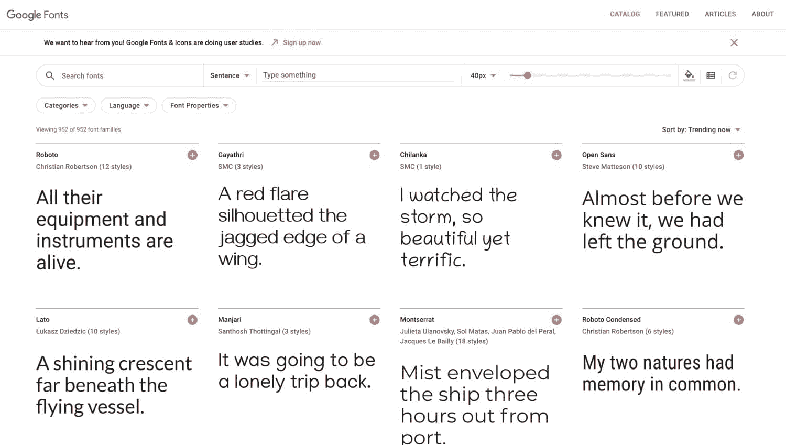

Google Fonts


所有这些提供商都允许你通过添加一些代码到你的 WordPress 站点(T1)或者有时通过使用插件(T3)的 T2，直接从他们的服务器提供字体，这意味着你不需要添加任何代码。

Web 字体不同于 web 安全字体。万一您的网站访问者由于某种原因无法连接到 web 字体，您可以使用这些字体作为 web 字体的备用字体。在这篇文章的后面，我会告诉你怎么做。

### 为什么要使用 Web 字体？

那么现在你知道什么是 web 字体了，为什么你会选择使用它们而不是托管自己的字体呢？

以下是一些好处:

*   易用性:添加几行代码或安装一个插件比下载和上传字体文件更快，如果你将来决定改变字体，也更容易。
*   字体范围:网络字体有数千种，而且这个列表还在不断增加。
*   更新:如果字体文件需要更新，可能要添加可变字体(不久将会有更多)或添加额外的字符，您的站点将可以访问新版本，而无需您做任何事情。

大多数网站使用网络字体，并以网络安全字体作为备份。有了 WordPress，这很容易做到。

### 为你的网站寻找最好的网络字体

决定使用网页字体后，你现在面临一个艰难的决定:使用哪种字体？

在过去的好时光里，所有的 web 开发人员都可以使用那些预装的 web 安全字体，这是一个非常容易的决定。你想用衬线字体还是无衬线字体？(衬线字体在每个字符的一个较大的笔画末端有一个小的线条或笔画，无衬线字体没有。)做了那个决定，你的选择就非常有限了。

但是现在，世界是你的了。

以下是一些帮助您为网站选择最佳字体的提示:

*   看看你的印刷材料。有没有已经在使用的字体可以作为网页字体？如果没有，能找到类似的吗？
*   看看你的竞争对手的网站。他们使用哪种字体？我不建议你复制它们，但是可能有一些风格可以向你的网站用户传达正确的形象。
*   想想你想用你的字体传达什么样的心情。有些字体看起来更现代，有些更传统。有些很有趣，有些更严肃。
*   正文坚持使用易于阅读的[字体，如果你愿意，标题可以使用更有趣的字体。](https://kinsta.com/learn/blogging-tips/#give-readers-your-very-best)
*   从[中挑选最受欢迎的谷歌字体](https://kinsta.com/blog/best-google-fonts/)——这些字体将为网站访问者所熟悉，并且易于阅读。

一旦你选择了你的字体，花些时间尝试一下。像 Google Fonts 这样的字体提供商可以让你输入自定义文本，看看你选择的字体是什么样子。一旦你在字体中看到你自己的文本，它可能会帮助你决定那是否是适合你的字体。


Experimenting with your font


记住，使用网络字体可以很容易地改变你的字体，这样你就可以在开发你的主题或者设置你的网站时切换到另一个选项。

### 如何用 WordPress 插件添加网页字体

你已经选好了字体，现在是时候把它添加到你的网站上了。

如果你不喜欢在你的主题文件中添加代码，你可以安装一个插件，让你访问谷歌字体，并在你的网站上使用任何你想要的字体。

Google 字体排版插件可以让你访问整个 Google 字体库，并让你通过 WordPress 定制器查看它们。

像安装其他插件一样，在你的网站上安装插件，然后激活它。

进入**外观>定制**访问定制器。你会看到一个关于**谷歌字体**的部分。

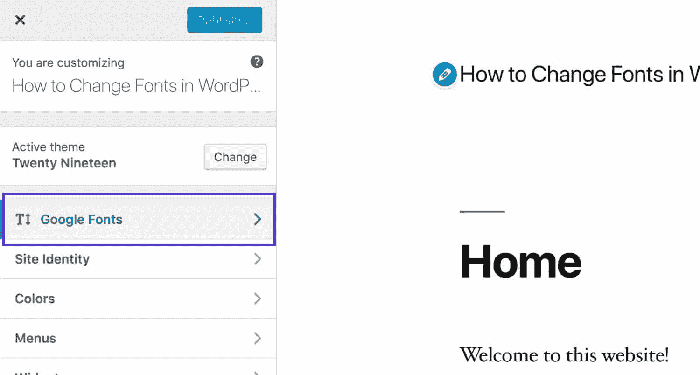

Google Fonts in Customizer


单击该链接访问您的字体设置。按如下方式配置它们:

**基本设置**:为你的正文和标题，以及任何按钮配置默认字体。在下面的截图中，你可以看到我为正文添加了一种易于阅读的衬线字体，为标题添加了一种更有特色的字体。

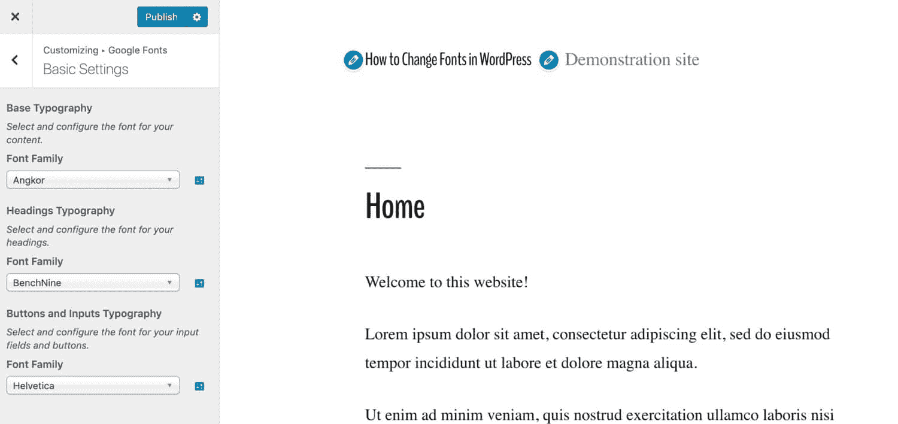

Configuring basic settings


**高级设置**:在这里你可以配置品牌(网站标题和描述)、导航(你的菜单)、内容和标题，你的侧边栏和页脚。你也可以加载字体而不用分配给任何东西，这意味着你可以[将它们添加到定制器中的任何自定义 CSS](https://kinsta.com/blog/wordpress-css/) 中。

字体加载:如果有你不需要的字体粗细(比如粗体、斜体之类的)，你可以在这里取消它们，这样它们就不会不必要地降低你网站的速度。

**调试**:如果字体没有正常工作，使用这个来强制显示字体。

花一些时间处理这些设置，并在定制器中测试它们，以确保它们按照您想要的方式工作。然后，当您对设置满意时，单击**发布**按钮。不要在没有点击**发布**的情况下离开定制器，否则您将丢失您的更改。

#### 编辑字体颜色

插件的免费版本不允许你编辑字体的颜色。要做到这一点，你必须要么购买高级版本，要么使用定制器中的**附加 CSS** 选项。

返回定制程序的主屏幕，点击**附加 CSS** 选项卡。你会看到一个空白的文本区域，你可以[添加你自己的 CSS](https://kinsta.com/blog/wordpress-css/) 。

要找到需要样式化的元素，选择它并[使用浏览器中的代码检查器](https://www.lifewire.com/get-inspect-element-tool-for-browser-756549)找出它已经具有的颜色样式。

下面我正在使用谷歌浏览器，我瞄准了一个`h1`元素。

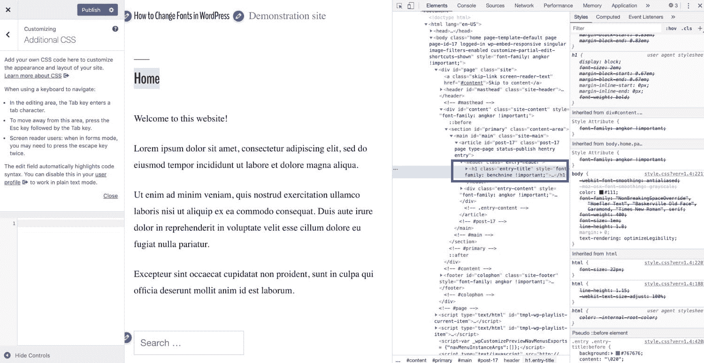

Inspecting your code in Chrome


在我的主题中，它继承了 body 元素的颜色。我想补充一些更具体的东西。在 CSS 的文本区域中，键入元素的 CSS 和要使用的颜色。我的看起来像这样:

```
h1 {
 color: #f542f5;
}
```

这给了我一个亮粉色的 h1 元素:

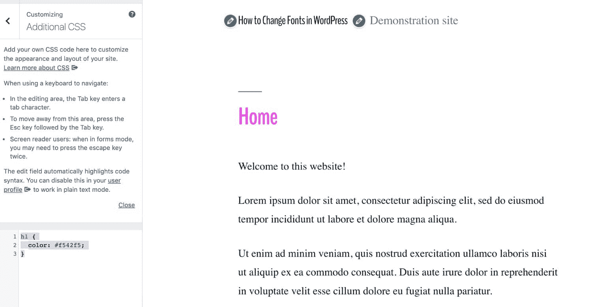

Changing the color of the heading


您可以对任何想要添加颜色的文本元素重复此操作，也可以对任何想要添加其他屏幕选项中没有的自定义字体重复此操作。如果你想知道字体使用什么样的 CSS，请阅读这篇文章中关于通过 CSS 修改字体的部分。

### 如何手动添加 Web 字体

如果你不想在你的网站上添加额外的插件，也不想访问你的主题代码，你可以通过[在你的函数文件和样式表](https://kinsta.com/knowledgebase/edit-wordpress-code/)中添加一些代码来安装和使用网络字体。

如果您的站点使用您可以编辑的定制主题，那么您可以从您的主题中编辑函数文件和样式表。但是如果你使用的是你[从 WordPress 主题目录](https://kinsta.com/blog/how-to-install-a-wordpress-theme/)购买或获得的第三方主题，那么你需要[创建一个子主题](https://kinsta.com/blog/wordpress-child-theme/)。然后你需要给它两个文件:【functions.php 和 **style.css** 。

让我们完成手动添加网页字体到你的主题的过程。在这个例子中，我将使用谷歌字体，因为这是最常用的，而且是免费的。

#### 选择字体并抓取链接

首先从谷歌字体中选择你的字体。通过单击它旁边的加号图标将其添加到您的库中。

点击屏幕底部你的库的标签，你会看到一些代码可以添加到你的站点上。如果您想添加额外的字体粗细和样式，单击**自定义**选项卡并选择您想要的。然后回到**嵌入**标签。

不要完全复制代码:你将会使用它，但是不是在你的站点标题的部分调用字体，而是将字体放入队列。这是在 WordPress 中正确的做法。

相反，从“嵌入字体”部分，只复制字体的链接。

对我来说，谷歌字体给了我这个代码:

```

```

我只需要复制这一点:

```
https://fonts.googleapis.com/css?family=Raleway
```

#### 将字体排入队列

打开你的主题的函数文件，添加如下内容，用谷歌给你的链接替换我的字体的链接:

```
function kinsta_add_google_fonts() {
 wp_register_style( 'googleFonts', 'https://fonts.googleapis.com/css?family=Raleway');
 wp_enqueue_style( 'googleFonts');
}
add_action( 'wp_enqueue_scripts', 'kinsta_add_google_fonts' );
```

这将使 Google 字体服务器中的样式排队。如果将来需要添加更多的字体，可以在函数中添加新的一行，或者添加到同一行，如下所示:

```
function kinsta_add_google_fonts() {
 wp_register_style( 'googleFonts', 'https://fonts.googleapis.com/css?family=Merriweather|Raleway');
 wp_enqueue_style( 'googleFonts');
}
add_action( 'wp_enqueue_scripts', 'kinsta_add_google_fonts' );
```

这将使 Merriweather 和 Raleway 字体排队。

#### 将字体添加到样式表中

这还不能让字体在你的站点中工作:你仍然需要把它添加到你的主题的样式表中。

在你的主题中打开 **style.css** 文件，并添加代码以使用你的 web 字体来设置单个元素的样式。确保你[将它添加到任何现有的字体 CSS](https://kinsta.com/knowledgebase/combine-external-css/) 之后，否则它可能会被覆盖。

您将决定使用什么样的元素，但是通常正文元素使用易读的字体，标题使用更花哨的字体。

```
body {
 font-family: 'Raleway', sans-serif;
}

h1, h2, h3 {
 font-family: 'Merriweather', serif;
}
```

在上面的例子中，页面上的所有内容都将使用 Raleway 字体，除了 h1、h2 和 h3 元素，它们将使用 Merriweather。

现在，保存您的样式表并检查您的站点，以确保一切都如您所愿。如果新字体没有显示，尝试[清除浏览器缓存](https://kinsta.com/knowledgebase/how-to-clear-browser-cache/)并检查这些字体没有被样式表中较低的字体样式覆盖。这就是为什么在样式表底部添加新样式或者用新样式替换现有字体样式(甚至更好)是个好主意。

#### 添加备份字体

可能会有这样的情况，有人访问您的网站，但由于某种原因无法访问 web 字体文件。也许他们的网络连接[很差](https://kinsta.com/blog/facebook-statistics/#making-it-a-mobile-company)或者使用的是不能显示网页字体的旧设备。或者你的网络字体提供商有技术问题。

因此，准备一份备份是个好主意。

Google fonts 给你的代码已经有了简单指定`serif`或`sans-serif`的备份，但是我们可以更进一步。

使用已经安装在访问者机器上的网络字体，然后包括第二个备用字体`serif`或`sans-serif`，以防他们使用的移动设备甚至没有网络字体。

回到你的样式表，编辑你的 CSS，使它看起来像这样:

```
body {
 font-family: 'Raleway', Helvetica, sans-serif;
}

h1, h2, h3 {
 font-family: 'Merriweather', Georgia, serif;
}
```

这意味着如果一切顺利，访问你网站的人将会看到你的网页字体；但如果不是，他们会看到 Helvetica 或佐治亚州，否则，他们会看到他们的浏览器能够加载的任何衬线和无衬线字体。


## 在 WordPress 中托管你自己的字体

一些开发人员不喜欢使用 web 字体，而是在他们自己的服务器上托管字体，您可能就是其中之一。

这可能有一个或多个原因，包括[安全性](https://kinsta.com/blog/wordpress-security/)、[性能](https://kinsta.com/blog/wordpress-performance-plugins/)或预算。

如果你关心性能，你可以用很多方法来优化你的网页字体的性能，这将在本文的后面讨论。但是如果你决定走当地路线，你需要知道如何去做。

### 为什么要托管自己的字体？

使用 web 字体通常更容易，可以为您提供更多的灵活性，并且在服务器上占用更少的空间。但这并不意味着不存在本地托管字体不合适的情况。

您可能希望在本地托管字体的原因包括:

你可能会发现你可以避开这些问题

*   由于安全原因，您可能不喜欢从第三方提供商那里获取资源，因为您知道您自己站点的安全性是由您控制的。
*   你可能会发现使用第三方服务会影响你网站的性能。
*   您可能已经购买了一个字体文件，并希望使用它。确保您的许可证包括网站使用和印刷材料使用。
*   你的站点可能是本地托管的，例如在一个内部网上，当用户使用它时，他们将无法访问 web 字体。

### 在哪里可以找到您可以在本地托管的字体

许多网络字体也可以下载用作本地托管字体，但你必须检查许可证是否允许这样做。在谷歌字体的情况下，这是允许的。

您还会发现，有些字体不是 web 字体，您可以下载并自己托管。你可以下载到你电脑上的任何字体文件也可以上传到你的网站并储存在那里。如果你需要使用一种网络字体以外的字体来搭配你的[品牌](https://kinsta.com/blog/wordpress-site-examples/)，这将是一个解决方案，但要确保你的许可允许这样做。

### 如何将本地托管的字体添加到你的 WordPress 站点

你知道你想在本地托管你的字体，你如何着手设置呢？

该过程不同于使用 web 字体。您必须[将文件](https://kinsta.com/blog/increase-max-upload-size-wordpress/)上传到您的站点，并在样式表中链接到它们，而不必将它们放入函数文件中。

#### 下载并转换字体

从下载您想要使用的字体开始。在谷歌字体中，你可以在你的库中查看字体时点击下载图标。

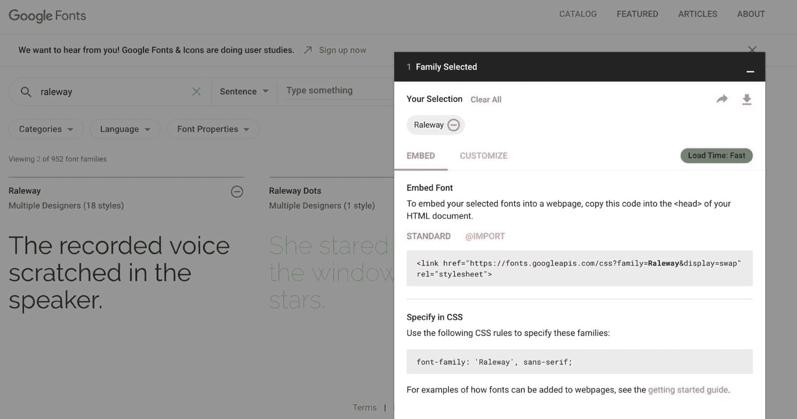

Downloading fonts from Google Fonts


在你的电脑上解压字体文件，删除任何你不需要在你的网站上使用的字体粗细:没有必要上传你不会使用的文件。

要在您的网站上使用，这些文件需要在。woff 格式。如果它们不是(如果你是从谷歌字体得到的，它们就不会是)，你可以使用类似于 [Convertio](https://convertio.co/ttf-woff/) 的服务来转换它们。

#### 上传字体到你的主题

现在将字体文件上传到**WP-内容/主题/主题名**中的[你的主题](https://kinsta.com/blog/wordpress-free-vs-paid-themes/)，其中**主题名**是你主题的文件夹。将任何字体文件放在主题中它们自己的文件夹中是一个好主意，例如一个 **fonts** 文件夹。

如果您正在使用第三方主题，[为您的字体文件和样式表创建一个子主题](https://kinsta.com/blog/wordpress-child-theme/)。

## 注册订阅时事通讯


### 想知道我们是怎么让流量增长超过 1000%的吗？

加入 20，000 多名获得我们每周时事通讯和内部消息的人的行列吧！

[Subscribe Now](#newsletter)

完成后，您需要将字体添加到样式表中。

#### 在 CSS 中添加字体

打开主题的样式表。

像这样添加代码，用您自己的字体替换我使用的字体:

```
@font-face {
 font-family: ‘Raleway';
 src: url( “fonts/Raleway-Medium.ttf”) format(‘woff’); /* medium */
 font-weight: normal;
 font-style: normal;
}

@font-face {
 font-family: ‘Raleway';
 src: url( “fonts/Raleway-Bold.ttf”) format(‘woff’); /* medium */
 font-weight: bold;
 font-style: normal;
}

@font-face {
 font-family: ‘Merriweather';
 src: url( “fonts/Merriweather.ttf”) format(‘woff’); /* medium */
 font-weight: normal;
 font-style: normal;
}
```

根据需要添加更多内容。注意，如果你想用粗体、斜体等。字体的变化，你需要使用`@fontface`来声明每一个，然后[为每一个](https://css-tricks.com/whats-deal-declaring-font-properties-font-face/)指定粗细或样式，就像我在上面用 Raleway 为粗体和正常粗细所做的那样。

现在为元素添加样式，就像使用 web 字体时一样:

```
body {
 font-family: 'Raleway', Helvetica, sans-serif;
 src: url( “/fonts/Raleway-Medium.ttf” );
}

h1, h2, h3 {
 font-family: 'Merriweather', Georgia, serif;
}
```

您本地托管的字体现在将与您的主题一起工作。


## 如何在 WordPress 中更改字体

现在你知道如何用两种方法之一在你的 WordPress 站点中安装字体。编辑他们怎么样？那改变他们呢？

您可以通过以下三种方式之一编辑字体:通过定制器，在文章或页面编辑屏幕中，或者使用 CSS。

让我们来看看改变字体样式、颜色和大小的每一个选项。

### 如何在 WordPress 中改变字体样式

让我们看看，如果您使用块编辑器或经典编辑器，我们如何做到这一点。

#### 在块编辑器中更改字体样式(古腾堡)

如果你使用的是带有[古腾堡编辑器](https://kinsta.com/blog/gutenberg-wordpress-editor/)的 WordPress 最新版本，你可以在文章或页面中编辑文本时改变其样式。

选择您想要编辑的块，一个样式菜单将出现在它上面。


Gutenberg block styling


选择你想要编辑的文本，然后点击图标，使其变成粗体或斜体。如果你点击旁边的箭头，你会发现你也可以选择删除线。

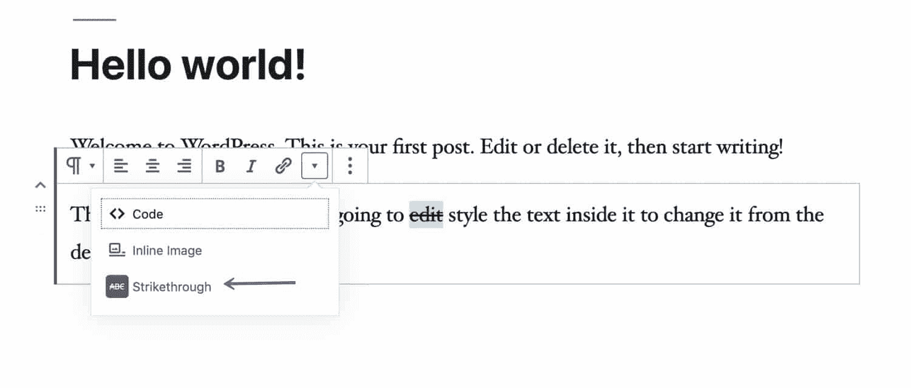

Strikethrough in Gutenberg


#### 在经典编辑器中更改字体样式

如果你运行的是旧版本的 WordPress 或者你安装了[经典编辑器](https://en-gb.wordpress.org/plugins/classic-editor/)插件，你也可以编辑字体样式。(如果不想要古腾堡编辑器，不如[更新 WordPress](https://kinsta.com/knowledgebase/wordpress-core/) ，[禁用古腾堡](https://kinsta.com/blog/disable-gutenberg-wordpress-editor/)。)

经典编辑器在主编辑面板上方包括一个工具栏，您可以在其中更改文本的样式。如果您点击工具栏右侧的切换图标，您可以访问更多选项，包括删除线。

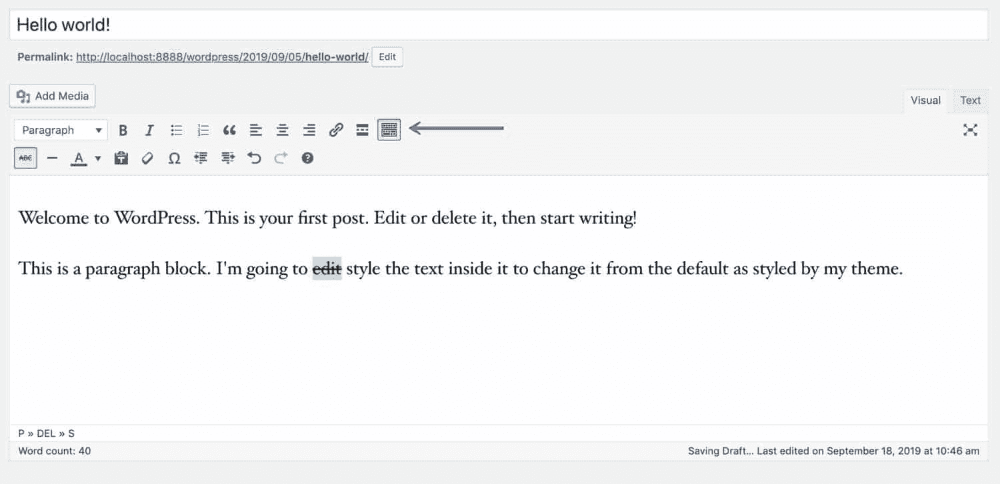

Classic editor styling toolbar


#### 在定制器中更改字体样式

如果您想要更改特定元素的字体样式，可以通过向定制器添加手动 CSS 来实现。

打开定制器，点击**附加 CSS** 。这将打开一个屏幕，您可以在其中输入 CSS。


Additional CSS in the Customizer


现在，您可以在框中输入字体的 CSS。因此，如果您想将所有 h1 和 h2 元素更改为斜体，您应该添加这个 CSS:

```
h1, h2 {
 font-style: italics;
}
```

#### 更改样式表中的字体样式

如果您愿意在样式表中添加代码，这是一种更好的方法。

如果你使用的是第三方主题，[为你自己的风格创建一个子主题](https://kinsta.com/blog/wordpress-child-theme/)，否则当你更新主题时，你所做的任何更改都将丢失。你必须在子主题中创建一个样式表来告诉 WordPress 这是一个子主题:这是你放置新字体样式的地方。

如果您使用自己的主题，可以在自己的样式表中编辑和修改 CSS。这个文件是 **style.css** ，你可以在 **wp-content/themes** 的主题文件夹中找到它。

在样式表的末尾添加任何字体样式，这样它就不会被已经存在的字体样式所抵消。或者更好的是，删除并覆盖任何现有的字体样式，除非您想保留它。

用 font-weight 更改元素的粗细:

```
span.featured {
 font-weight = bold;
}
```

用 font-style 更改元素的样式:

```
span.featured {
 font-style = italic;
}
```

用文本对齐方式更改对齐方式:

厌倦了你的 WordPress 站点缓慢的主机？我们提供超快的服务器和来自 WordPress 专家的 24/7 世界级支持。[查看我们的计划](https://kinsta.com/plans/?in-article-cta)

```
span.featured {
 text-alignment: center;
}
```

### 如何在 WordPress 中改变字体颜色

另一个你可能想做的改变是改变站点中某些文本的颜色。小心不要走极端:你的主题是用搭配得很好的颜色设计的，如果你添加了太多的颜色，看起来会很俗气和不专业。

#### 在古腾堡更改字体颜色

古腾堡文本块让您编辑文本颜色和背景。为此，打开您想要修改的模块，点击屏幕右侧**模块**部分的**颜色设置**选项卡。

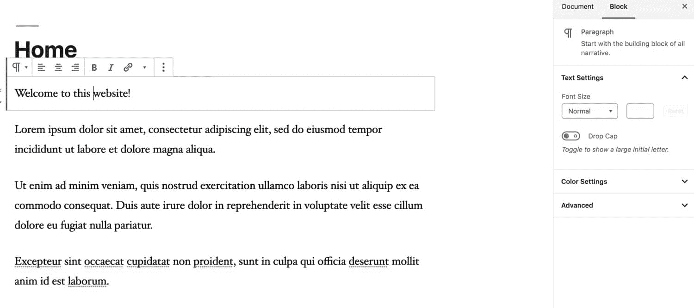

The color settings tab


在这里，您可以编辑文本块的背景颜色和文本颜色。

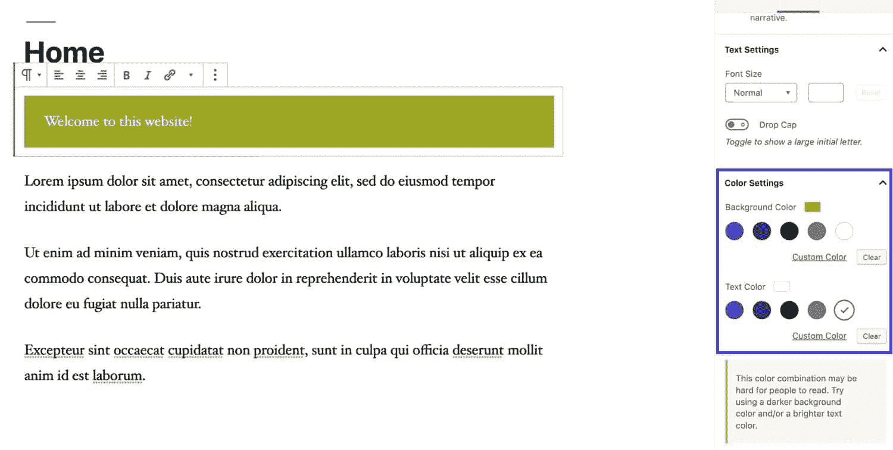

Custom colors in a block


注意，如果你使用的颜色组合不利于可访问性，WordPress 会警告你，就像我上面用的例子一样。避免过度使用颜色的诱惑——毕竟你选择主题是因为它的颜色设计适合你的网站，添加更多的颜色会让它看起来过于花哨。

如果您单击**颜色设置**选项卡下面的**高级**选项卡，您还可以向该块添加一个类，然后您可以在定制器或样式表中对其进行样式化。例如，如果你添加了一个类`.featured`到你的块中，你就可以使用这个类来设计它的样式。

#### 在经典编辑器中更改字体颜色

经典编辑器的工具栏允许您更改所选文本的颜色。所以你可以选择一个单词并改变它的颜色。下面我做了一个红色的句子。

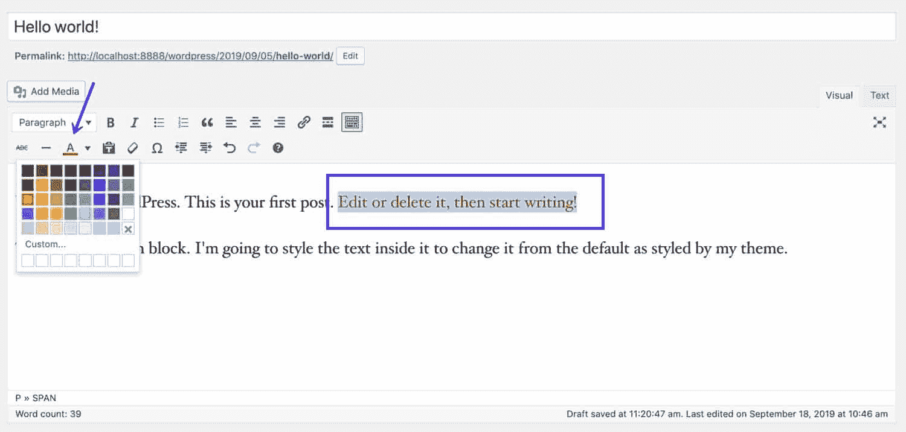

Changing colors in the classic editor


虽然这在理论上确实给了你足够的灵活性，但是要小心过度使用它。如果你开始在文本中添加更多的颜色，可能会导致网站难以阅读，不利于网站的可访问性。

#### 在定制器中更改字体颜色

如果你的主题包括改变[网站配色方案](https://kinsta.com/blog/website-color-schemes/)的选项，这是最好的选择。

例如，在下面的站点中，我使用了一个主题，让我为整个主题选择一个新的配色方案。这有助于确保新的颜色能够很好地协调一致。


Editing the color scheme in the Customizer


这个选项会根据你的主题而有所不同——有些主题可以让你针对标题、链接和其他元素改变它们的颜色。

如果你想改变特定元素的颜色，但是你的主题没有这个选项，你可以在定制器中添加 CSS 来实现。

选择**自定义>附加 CSS** ，并在文本框中输入您的 CSS。

例如，如果你想改变`h1`标题的颜色，你可以输入:

```
h1 {
 color: #564534;
}
```

如果这不起作用，您可能需要添加更具体的 CSS。在我的主题中，站点标题链接的颜色是用`#site-title` ID 编码的，所以我需要添加这个 CSS:

```
#site-title a {
 color: #564534;
}
```

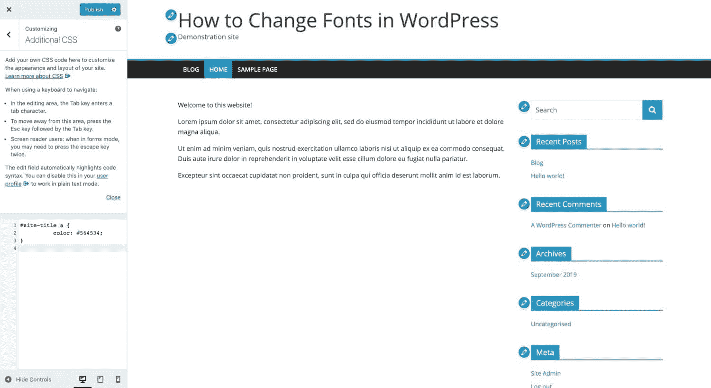

Additional CSS – color


用你自己的颜色替换我上面用的颜色。

当您对您的更改感到满意时，单击**发布**按钮。

#### 更改样式表中的字体颜色

与字体样式一样，您也可以编辑主题的样式表(或创建子主题)来更改[字体颜色](https://kinsta.com/blog/html-font-color/)。

以色换色。下面我使用`body`元素来改变我的网站文本的主色:

```
body {
 color = #222222;
}
```

确保您覆盖了相同元素的任何现有样式，并且如果您希望继承该样式的任何元素具有不同的颜色，也要对它们进行样式化。所有文本都将继承 **body** 元素的颜色，除非它有自己的样式。

### 在 WordPress 中更改字体大小

出于可访问性的原因，您可能希望您的字体比主题中的默认字体大。例如，您可能认为小部件区域中的标题太小。

#### 在古腾堡更改字体大小

使用 Gutenberg 编辑器，您可以更改每个块中文本的大小。

选择块，然后点击屏幕右侧块菜单中的文本设置选项卡。您可以使块中的文本变小或变大，如下所示。

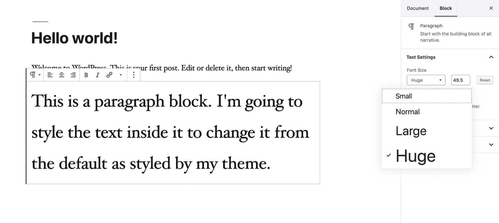

Editing font size in Gutenberg


小心不要做得太多:如果你页面上的所有段落都是不同的大小，它会看起来杂乱无章，难以阅读。

#### 在经典编辑器中更改字体大小

经典编辑器没有给你选择特定文本和改变其大小的选项:所以如果你需要这个功能，你需要升级到 Gutenberg。不好意思！

#### 在定制器中更改字体大小

根据您的主题，您可以选择在定制器中更改字体大小，或者更改整个站点的字体大小，或者针对标题和正文。

如果你的主题不包括改变字体大小的定制选项，但是你可以使用**附加 CSS** 选项。转到**定制>附加 CSS** 并在框中键入 CSS。

下面我用这个 CSS 把小部件区域的标题做得更大:

```
h2.widget-title {
 font-size: 3em;
}
```

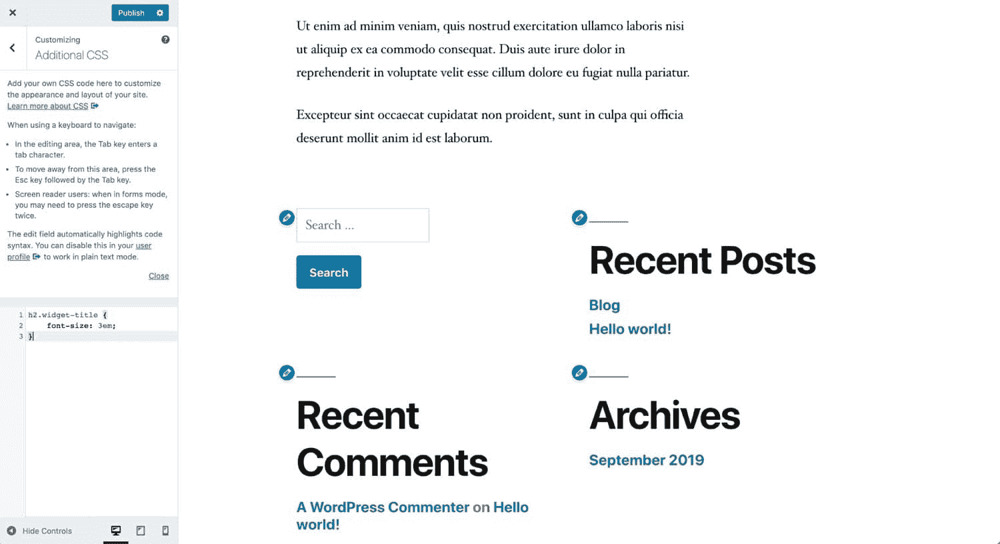

Styling font size with additional CSS


也许这有点太大了，但是它给了你一个大概的概念。

#### 更改样式表中的字体大小

更改样式表中字体的大小与更改任何其他字体样式的方式类似。

如果你想改变站点中所有文本的大小，你可以使用`body`元素:

```
body {
 font-size: 14px;
}
```

对于`body`元素，你使用像素，但是对于其他元素，你使用`em`，所以大小是相对于`body`元素的大小。

```
h1,
#site-title {
 font-size: 2em;
}
```

请记住，如果您要对主题样式表中的字体进行更改，请先在开发或[暂存站点](https://kinsta.com/help/staging-environment/)上进行测试，这样您就不会冒破坏您的实时站点的风险。

## 如何优化 WordPress 中的字体

无论你使用网络字体还是本地托管字体，尽你所能优化你的字体是有意义的。

在这里，我会给你一些优化字体的技巧，包括速度和设计。

### 优化字体以提高性能

如果你在你的网站上使用网络字体，你会想尽一切办法确保它们尽可能快地被发送到你的页面上，并且它们被托管在其他地方的事实不会减慢速度。

*   使用缓存来确保页面不需要在每次加载时都重新构建。Kinsta 托管计划带有内置的缓存。
*   使用网络字体提供商，该提供商通过[内容交付网络](https://kinsta.com/help/kinsta-cdn/)或 CDN 交付字体。谷歌字体做到了这一点，它加快了字体的交付速度。
*   只使用你需要的字体。不要将样式表中不使用的字体(粗细、样式)加入队列。如果您发现以后需要它们，您可以随时添加它们。
*   如果使用 web 字体，请确保将其正确排队。不要在样式表中使用@import 行，即使这是您的 web 字体提供商告诉您要做的。
*   手动添加 CSS 时，将其添加到主题的样式表中，而不是添加到 header.php 文件的部分。这就是为什么将 CSS 手动编码到主题中比使用定制器或块更好的原因之一，因为这两者都会将内联 CSS 添加到页面中，而不是添加到样式表中。
*   考虑使用 CSS 内联来减少几毫秒的页面加载时间。这个过程使用 base64 编码将 CSS 从样式表添加到页面，然后再加载页面，这样浏览器就不必加载额外的文件。考虑到上面关于不要编写内联 CSS 的建议，这似乎是违反直觉的，但它仍然可以从一个单独的 CSS 文件开始工作，并不意味着手动编写内联 CSS。如果你正在加载多种字体，[内联可以稍微加快你的站点速度](https://www.bramstein.com/writing/web-font-anti-patterns-inlining.html)。
*   使用[缩小](https://kinsta.com/knowledgebase/combine-external-css/#combine-external-css-in-wordpress)来减小样式表的大小。如果你是 [Kinsta 的客户](https://kinsta.com/plans/?plan=visits-business1&interval=month)，利用位于 [MyKinsta 仪表板](https://kinsta.com/mykinsta/)中的[代码缩小功能](https://kinsta.com/help/kinsta-cdn-code-minification/)，这很容易做到。这使得客户只需点击一下鼠标，就能实现 CSS 和 JavaScript 的自动缩小，无需人工操作就能加速他们的网站。
*   如果你在本地托管字体，只上传你需要的字体、字体粗细和样式的文件。使用@font-face 声明只添加那些您需要的变体。
*   考虑使用 CDN 来托管你自己的字体，而不是托管在你自己的服务器上。
*   当托管自己的字体时，包括附加格式:woff2、woff、ttf 和 eot。浏览器可以选择加载速度最快的版本。
*   如果你为你的站点标题使用不同的字体，只将你需要的字符加入队列，而不是整个字体库。

因此，如果您的站点标题是 Kinsta，您可以通过确保样式表如下所示来进行一点性能改进:

```
function kinsta_add_title_font() {
 wp_register_style( 'googleFonts', ‘https://fonts.googleapis.com/css?family=Raleway&text=“kinsta');
 wp_enqueue_style( 'googleFonts');
}
add_action( 'wp_enqueue_scripts', 'kinsta_add_title_font' );
```

### 为设计优化字体

除了优化你的字体性能之外，确保它们在视觉上得到优化也是有意义的:它们与你的网站设计和你的离线材料相适应。

如果你使用一个插件或者一个子主题来添加额外的字体到已经和你的主题捆绑在一起的字体之上，这种情况尤其明显。如果有太多的字体、太多的颜色和样式，你的主题看起来会有混乱的风险。

在向网站添加额外的字体之前，请考虑以下几点:

*   新字体与您现有的字体一致吗？它们传达了相似的风格或情绪吗？
*   如果您需要匹配已用于印刷材料的字体，但不能使用与网页字体相同的字体，请尝试在谷歌字体上找到尽可能接近的匹配。
*   你选择的字体和你的品牌一致吗？如果你在经营一个严肃的企业，你不会想使用漫画 San(事实上，无论你在经营什么样的网站，你都不会想使用漫画 San)。
*   如果您要更改字体的颜色，请尝试使用主题设计中已经存在的颜色或与之相协调的颜色。添加太多的颜色会让你的网站看起来花哨和不专业。
*   如果你想在 Google Fonts 上挑选一对字体，试着使用类似于 [fontpair](https://fontpair.co/) 的服务来找到两种搭配得很好的字体。

你在设计中使用的字体会影响访问者到达你的网站时的印象。确保你已经考虑到了这一点，并选择了能够强化你的品牌的字体。

### **使用可变字体**

可变字体是一种新的字体，可以更有效地在你的网站上添加更多的字体。

它们允许在一个字体文件中存储更多的信息，所以如果你想改变你的字体(粗体、斜体等)。)，不必加载多个字体文件，只需加载一个即可。

对于具有多种字体粗细、样式和倾斜的字体，这可以节省大量的文件空间，并使字体排队或通过@fontface 添加字体的过程更加容易。

最新版本的 Chrome、Edge、Firefox、Safari 支持可变字体，但旧版浏览器不支持；所以如果你真的使用它们，你需要一个后备方案。目前还没有很多可变字体。谷歌字体不包括任何，但谷歌支持该规范，所以很可能会随着时间的推移添加。

字体开发人员正在努力[创造更多可变字体并提高它们的可靠性](https://www.monotype.com/resources/articles/variable-fonts-making-the-promise-a-reality/)，因此值得关注进展，以便一旦可变字体变得更加稳定，您可以使用可变字体来优化您的字体。

[Fonts are taken for granted but they're crucial for ANY website (no exceptions). Learn how to change font, font size, and font color in WordPress! 🎨👨‍👦Click to Tweet](https://twitter.com/intent/tweet?url=https%3A%2F%2Fkinsta.com%2Fblog%2Fhow-to-change-font-in-wordpress%2F&via=kinsta&text=Fonts+are+taken+for+granted+but+they%27re+crucial+for+ANY+website+%28no+exceptions%29.+Learn+how+to+change+font%2C+font+size%2C+and+font+color+in+WordPress%21+%F0%9F%8E%A8%F0%9F%91%A8%E2%80%8D%F0%9F%91%A6&hashtags=webfonts%2Ctypography)

## **总结**

在你的 WordPress 网站上改变字体不是一件简单的事情。你有不同的选择:

1.  通过安装插件使用网络字体。
2.  通过将 web 字体编码到你的主题中并将其加入队列来使用它们。
3.  托管您的字体。

然后，你应该专注于如何优化你的字体以获得更好的性能。如果你遵循这个指南中的提示，你不仅可以在 WordPress 中改变字体，还可以在你的主题中更好的控制它们。

想整理你的页面或博客布局，让你的读者关注你的内容吗？然后，看看这个:[如何移除 WordPress 中的侧边栏(4 种方法)](https://kinsta.com/knowledgebase/remove-sidebar-wordpress/)。

* * *

让你所有的[应用程序](https://kinsta.com/application-hosting/)、[数据库](https://kinsta.com/database-hosting/)和 [WordPress 网站](https://kinsta.com/wordpress-hosting/)在线并在一个屋檐下。我们功能丰富的高性能云平台包括:

*   在 MyKinsta 仪表盘中轻松设置和管理
*   24/7 专家支持
*   最好的谷歌云平台硬件和网络，由 Kubernetes 提供最大的可扩展性
*   面向速度和安全性的企业级 Cloudflare 集成
*   全球受众覆盖全球多达 35 个数据中心和 275 多个 pop

在第一个月使用托管的[应用程序或托管](https://kinsta.com/application-hosting/)的[数据库，您可以享受 20 美元的优惠，亲自测试一下。探索我们的](https://kinsta.com/database-hosting/)[计划](https://kinsta.com/plans/)或[与销售人员交谈](https://kinsta.com/contact-us/)以找到最适合您的方式。