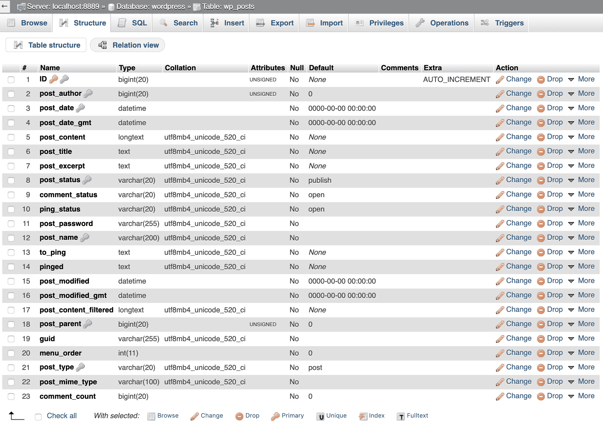
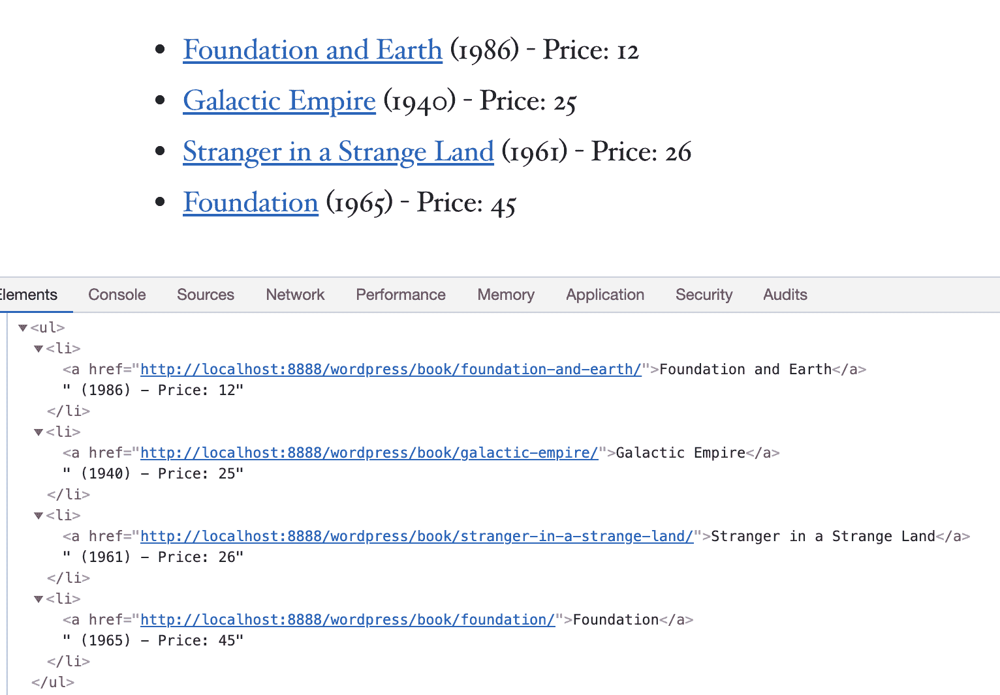

# 如何使用这个有用的 PHP 函数来创建文章列表

> 原文:[https://kinsta.com/blog/wordpress-get_posts/](https://kinsta.com/blog/wordpress-get_posts/)

WordPress `get_posts`是一个强大的功能，允许[开发者](https://kinsta.com/blog/hire-wordpress-developer/)从 [WordPress 数据库](https://kinsta.com/knowledgebase/wordpress-database/)中检索内容片段。您可以详细指定您正在寻找的帖子、页面和[自定义帖子类型](https://kinsta.com/blog/wordpress-custom-post-types/)，获取您的自定义结果集，然后像 PHP/MySQL 忍者一样过滤和排序这些项目。

但是如果你不是 PHP 专业人士，不要害怕，有无数的 [PHP 教程你可以观看或阅读](https://kinsta.com/blog/php-tutorials/)来学习这门语言。你只需要对 PHP 有一点点[的了解，就可以创建定制的帖子列表显示在你的网站上，因为`get_posts`函数保存了一组参数，允许构建简单或高级的查询。](https://kinsta.com/blog/is-php-dead/)

使用 WordPress `get_posts`有两个步骤:

*   首先，您必须构建您的自定义查询。实际上，它看起来不会像一个 MySQL 查询，你也不会写任何`SELECT`语句。您只需要定义一个参数数组，并将其传递给`get_posts`函数。WordPress 将这个数组转换成一个真实的**安全的** MySQL 查询，在数据库中运行，并返回一个帖子数组。
*   其次，您必须用 foreach 循环遍历由`get_posts`返回的结果集。

也就是说，在这篇文章中，我们将首先深入上面提到的关键概念，特别是`get_posts`如何工作，如何构建自定义查询，以及如何在前端站点显示数据。
然后，我将提供一个真实的例子，其中有一段代码，您可以在测试和开发的阶段环境中获取、编辑和使用。

注意:我们通常区分文章、页面和自定义文章类型。在本文中，**我们使用术语*“帖子”*来表示常规博客帖子以及页面和自定义帖子类型**。所有这些帖子类型都存储在数据库的*‘WP _ posts’*表中。文章类型之间的主要区别在于*‘post _ type’*字段的值。**从开发者的角度来看，帖子、页面、自定义帖子类型都是帖子**。

*   [WordPress get _ posts 函数介绍](#get-posts)
*   [如何使用 get_posts 参数构建查询](#parameters)
*   [如何显示 get_posts 数据](#display)
*   真实世界的例子:显示一个高度定制的帖子列表，带有一个定制的短代码

## WordPress get_posts 功能介绍

法典对[和`get_posts`功能](https://developer.wordpress.org/reference/functions/get_posts/)的描述如下:

> 检索最新文章的数组，或者匹配给定标准的文章。

我们可以这样使用`get_posts`:


```
$args = array(
	'numberposts'	=> 20,
	'category'		=> 4
);
$my_posts = get_posts( $args );

if( ! empty( $my_posts ) ){
	$output = '<ul>';
	foreach ( $my_posts as $p ){
		$output .= '<li><a href="' . get_permalink( $p->ID ) . '">' 
		. $p->post_title . '</a></li>';
	}
	$output .= '</ul>';
}
```

上面的函数检索指定类别中最新的 20 篇博客文章(默认情况下，`'post_type'`是`'post'`)并返回一组`$post`对象。您可以迭代数组以在屏幕上显示帖子。很简单，对吧？

`get_posts` [使用`WP_Query`](https://kinsta.com/blog/wp-query/) 来检索 post 项，并且它保留了一个与`WP_Query`中相同的参数数组(很少有例外)。因此，我们有一个庞大的变量列表，可以用来构建我们的自定义查询。这些参数分为以下 [15 类](https://developer.wordpress.org/reference/classes/wp_query/#parameters):

*   作者参数
*   类别参数
*   标签参数
*   分类参数
*   搜索参数
*   帖子和页面参数
*   密码参数
*   发布类型参数
*   订单& Orderby 参数
*   日期参数
*   自定义字段(后元)参数
*   权限参数
*   Mime 类型参数
*   缓存参数
*   返回字段参数

快速浏览一下上面的列表可以让你了解到你可以在 WordPress 数据库上构建和运行的各种定制查询。因此，让我们更深入地研究查询参数，并开始构建我们的帖子列表。


## 如何用 WordPress get_posts 构建查询

每一类参数都与同一条信息相关。例如，我们可以构建一个查询来检索来自指定作者或排除指定作者的文章，通过 ID 或 nicename 定义作者。同样，我们可以构建查询，通过类别、标签、分类、日期、自定义字段等获取帖子。

### 如何使用参数构建简单的查询

许多参数可以以非常相似的方式使用，不管它们属于哪一类。例如，以下参数允许按文章作者查询数据库:

*   `author`(*int*)–作者 ID
*   `author_name` ( *字符串*)——作者的`user_nicename`
*   `author__in` ( *数组*)–多个作者 id 的数组
*   `author__not_in`(*array*)–从结果集中排除的多个作者 id 的数组

我们如何使用这些参数？

在下面的例子中，参数`'author'`指定我们想要 ID = 1 的作者写的最近的博客文章:

```
$my_posts = get_posts( array( 'author' => 1 ) );
```

相同的*‘author’*参数允许以不同的方式查询数据库:

```
// return an array of posts from specific authors
$my_posts = get_posts( array( 'author' => '1,5,12' ) );
```

```
// return an array of posts excluding the specified author
$my_posts = get_posts( array( 'author' => -1 ) );
```

因此，根据参数的值，您将得到一个结果集，其中包含来自单个作者(整数)、来自多个作者(逗号分隔值的列表)或排除一个作者(负值)的文章。

其他参数提供了额外的灵活性。例如，下面对`get_posts`的调用返回来自多个作者的最新博客文章的数组:

```
// return an array of posts from multiple authors
$my_posts = get_posts( array( 'author__in' => array( 1, 5, 12 ) ) );
```

我们也可以排除多个作者:

```
// return an array of posts from multiple authors
$my_posts = get_posts( array( 'author__not_in' => array( 1, 5, 12 ) ) );
```

类似地，我们可以使用类别参数、标签参数、文章类型参数，但有一些特定的区别。例如，请参见类别参数:

*   `cat` ( *int* )
*   `category_name` ( *弦*)
*   `category__and` ( *阵*)
*   `category__in` ( *阵*)
*   `category__not_in` ( *阵*)

反正不是所有的参数都像这些参数那么好用。此外，我们可以使用类别参数、文章类型参数、mime 类型参数等。所有这些都在一个查询中。这意味着我们可以对结果集中的项目进行粒度控制，并且我们可以基于帖子类型、自定义分类和自定义字段来构建更高级的查询。

所以，让我们潜得更深！

### 如何在 WordPress 中构建高级查询

让我们前进一步，使用一个基于定制文章类型和定制分类法的更高级的查询。假设您有以下帖子类型:

**名称**:图书
**分类名称**:图书 _ 类别、图书 _ 作者
**支持**:标题、编辑、缩略图、摘录、自定义字段

#### 自定义帖子类型和自定义分类

假设您想要在指定的`book_category`自定义分类中列出最近的书籍。下面是一组参数:

```
$args = array(
	'post_type'		=> 'book',
	'tax_query'		=> array(
		array(
			'taxonomy'	=> 'book_category',
			'field'		=> 'slug',
			'terms'		=> 'sci-fi'
		)
	),
);
```

上面的论点只是告诉 WordPress 检索`'sci-fi'` `'book_category'`中的所有书籍。

`'tax_query'`参数接受一个参数数组的数组(即数组的数组)。这些嵌套数组允许基于多个分类法构建非常复杂的查询，如下例所示:

```
$args = array(
	'numberposts'	=> 10,
	'post_type'		=> 'book',
	'relation'		=> 'AND',
	'tax_query'		=> array(
		array(
			'taxonomy'	=> 'book_category',
			'field'		=> 'slug',
			'terms'		=> 'sci-fi'
		),
		array(
			'taxonomy'	=> 'book_author',
			'field'		=> 'term_id',
			'terms'		=> 22
		)
	)
);
```

这些参数允许我们检索由 ID #22 的`'book_author'`编写的`'sci-fi'` `'book_category'`中最新的 10 个`'book'`帖子类型的列表。`'relation'`参数设置`'tax_query'`中列出的每个分类之间的逻辑关系。上面我们将其值设置为`AND`,因为我们需要检索属于作者#22 写的`'sci-fi'`类别`AND`的所有书籍。

#### 如何使用自定义字段参数构建元查询

有时，您可能需要基于特定的自定义字段键和/或值来构建帖子列表。

```
$args = array(
	'meta_key'		=> 'cover',
	'meta_value'	=> 'paperback',
	'meta_compare'	=> '='
);
```

这些参数允许我们通过自定义字段键和值来检索所有帖子。`'meta_compare'`设置测试`'meta_value'`参数值所需的操作员。这里的`'meta_value'`是`'='`，也是默认值。

可用值有`'='`、`'!='`、`'>'`、`'>='`、`'<='`、`'LIKE'`、`'NOT LIKE'`、`'IN'`、`'NOT IN'`、`'BETWEEN'`、`'NOT BETWEEN'`、`'NOT EXISTS'`、`'REGEXP'`、`'NOT REGEXP'`或`'RLIKE'`。

这是一个非常简单的例子，但是我们可以构建更高级的查询。在下一个示例中，我们在数据库中查询 2010 年以后出版的奇幻书籍:

```
$args = array(
	'post_type'		=> 'book',
	'meta_key'		=> 'year_published',
	'meta_value_num'	=> 2010,
	'meta_compare'	=> '>',
	'tax_query'		=> array(
		array(
			'taxonomy'	=> 'book_category',
			'field'		=> 'slug'
			'terms'		=> 'fantasy'
		)
	)
);
```

我们可以走得更远。在下一个示例中，我们将一个帖子类型与一个自定义分类和两个自定义字段混合在一起:

```
$args = array(
	'post_type'		=> 'book',
	'tax_query'		=> array(
		array(
			'taxonomy'	=> 'book_category',
			'field'		=> 'slug'
			'terms'		=> array( 'fantasy' )
		)
	),
	'meta_query'	=> array(
		'relation'		=> 'AND',
		array(
			'key'		=> 'year_published',
			'value'		=> 2010,
			'type'		=> 'numeric',
			'compare'	=> '>',
		),
		array(
			'key'		=> 'price',
			'value'		=> array( 10, 25 ),
			'type'		=> 'numeric',
			'compare'	=> 'BETWEEN',
		)
	)
);
```

这里我们设置了一组参数来检索 2010 年后出版的价格分别为 10 美元和 25 美元的奇幻书籍。

## 注册订阅时事通讯


### 想知道我们是怎么让流量增长超过 1000%的吗？

加入 20，000 多名获得我们每周时事通讯和内部消息的人的行列吧！

[Subscribe Now](#newsletter)

您可以看到`'meta_query'`参数的工作方式非常类似于`'tax_query'`参数。它保存了一个数组的数组，允许我们基于多个元键/值对构建高级查询。有关查询参数的完整列表和大量示例，请参见 [`WP_Query`文档](https://developer.wordpress.org/reference/classes/wp_query/)。

### 为什么 get_posts 仅限 5 篇 WordPress 帖子？

`get_posts`函数采用与`WP_Query::parse_query()`相同的参数([参见抄本](https://developer.wordpress.org/reference/classes/WP_Query/parse_query/))，但是一些特定的参数使它的工作方式与`WP_Query`对象略有不同。

也许您在查询中没有使用`'numberposts'`参数，并且您想知道为什么您在列表中只看到 5 个项目。

默认情况下，你在**设置→阅读**管理页面中设置的文章数量决定了 WordPress 查询检索的文章数量。无论如何，如果你不为`'numberposts'`或`'posts_per_page'`指定一个自定义值，`get_posts`会返回不同数量的文章。

*   `'numberposts'`是要检索的文章总数。它是`WP_Query`中`'posts_per_page'`的别名，但两者有区别:默认情况下，使用`get_posts`时**检索的文章数量是 5 篇**，而`WP_Query`中的`'posts_per_page'`默认为你的 WordPress 博客每页的文章数量。您可以通过为参数数组中的`'numberposts'`或`'posts_per_page'`设置自定义值来覆盖默认值。

除了`'numberposts'`之外，以下参数是`get_posts`特有的:

*   `'category'`是逗号分隔的类别 id 列表。它是`WP_Query`中`'cat'`参数的别名。
*   `'include'`是以逗号分隔的帖子 id 列表。这是`WP_Query`中`'post__in'`参数的别名。
*   `'exclude'`是以逗号分隔的帖子 id 列表。
*   `'suppress_filters'`指定是否抑制过滤器。该参数默认为`get_posts`中的`true`，默认为`WP_Query`中的`false`([见轨道](https://core.trac.wordpress.org/browser/tags/5.2/src/wp-includes/class-wp-query.php#L709))。

`get_posts`功能在`wp-includes/post.php`中定义。你可以通过查看源代码来深入了解`get_posts`是如何工作的，无论是在轨道上的[(WordPress 5.2)](https://core.trac.wordpress.org/browser/tags/5.2/src/wp-includes/post.php#L1901)还是在你本地的 WordPress 安装中。

### 订购项目

`'orderby'`和`'order'`对结果集中的项目进行排序。你可以按照`'ID'`、`'author'`、`'title'`、`'name'`、`'type'`、`'date'`、`'modified'`、`'parent'`、`'rand'`、`'comment_count'`等多种方式对帖子进行排序，按升序或降序排列。

如果您有一个简单的查询，您只需要为`'order'`和`'orderby'`设置一个值。在以下示例中，文章按文章名称以升序排序:

```
$args = array(
	'author'	=> '1,5,12',
	'orderby'	=> 'name',
	'order'		=> 'ASC'
);
```

这很简单。但是如果您有一个高级查询呢？例如:我们可以在高级元查询中通过一个或多个自定义字段值对项目进行排序吗？

WordPress 4.0 和 [WordPress 4.2 对`'orderby'`和`'meta_query'`参数带来了重要的改进](https://make.wordpress.org/core/2015/03/30/query-improvements-in-wp-4-2-orderby-and-meta_query/)。我们现在有了一个新的语法，可以通过元查询的特定子句进行排序。多亏了新的语法，我们可以使用索引从`'orderby'`参数创建对元查询的特定子句的引用。

由于这些改进，上例中的元查询可以写成如下形式:

```
$args = array(
	'meta_query'	=> array(
		'relation'		=> 'AND',
		'year_clause' => array(
			'key'		=> 'year_published',
			'value'		=> 2010,
			'type'		=> 'numeric',
			'compare'	=> '>',
		),
		'price_clause' => array(
			'key'		=> 'price',
			'value'		=> array( 10, 25 ),
			'type'		=> 'numeric',
			'compare'	=> 'BETWEEN',
		)
	),
	'orderby' => 'price_clause',
);
```

在上面的例子中，我们通过`'price_clause'`对元素进行排序。

厌倦了 WordPress 的问题和缓慢的主机？我们提供世界一流的支持，由 WordPress 专家提供 24/7 服务和超快的服务器。[查看我们的计划](https://kinsta.com/plans/?in-article-cta)

我们可以做得更多。[从 WordPress 4.0](https://make.wordpress.org/core/2014/08/29/a-more-powerful-order-by-in-wordpress-4-0/) 开始，我们可以向`get_posts`传递一组元查询索引，而不是一个单独的索引，如下例所示:

```
$args = array(
	'meta_query'	=> array(
		'relation'		=> 'AND',
		'year_clause' => array(
			'key'		=> 'year_published',
			'value'		=> 2010,
			'type'		=> 'numeric',
			'compare'	=> '>',
		),
		'price_clause' => array(
			'key'		=> 'price',
			'value'		=> array( 10, 25 ),
			'type'		=> 'numeric',
			'compare'	=> 'BETWEEN',
		)
	),
	'orderby' => array( 'price_clause' => 'ASC', 'year_clause' => 'DESC' ),
);
```

恭喜，您已经构建了一个高级元查询，并首先按照`'price_clause'`升序排序结果，然后按照`'year_clause'`降序排序结果。

参见[法典中分类选项](https://developer.wordpress.org/reference/classes/wp_query/#order-orderby-parameters)的完整列表。

是我们在首页展示数据的时候了。

建议阅读:[如何轻松创建和使用一个 phpinfo 页面](https://kinsta.com/knowledgebase/phpinfo/)。

## 如何显示 get_posts 返回的数据

WordPress `get_posts`返回一个由 [`WP_Post`对象](https://developer.wordpress.org/reference/classes/wp_post/)组成的数组，让我们可以访问存储在`wp_posts`数据库表中的每个选中帖子的变量:

*   身份证明
*   帖子 _ 作者
*   帖子名称
*   post_type
*   帖子 _ 标题
*   发布日期
*   晚 _ 日期 _gmt
*   帖子 _ 内容
*   帖子 _ 摘录
*   帖子 _ 状态
*   注释 _ 状态
*   ping _ 状态
*   post _ 密码
*   post_parent
*   发布 _ 修改
*   post_modified_gmt
*   评论 _ 计数
*   菜单 _ 订单



wp_posts table structure in phpMyAdmin


您可以通过如下所示的`foreach`周期轻松访问这些数据:

```
$custom_posts = get_posts( $args );

if( ! empty( $custom_posts ) ){
	$output = '<ul>';
	foreach ( $custom_posts as $p ){

		$output .= '<li><a href="' 
		. get_permalink( $p->ID ) . '">' 
		. $p->post_title . '</a></li>';
	}

	$output .= '</ul>';
}

return $output ?? '<strong>Sorry. No posts matching your criteria!</strong>';
```

如果`get_posts`找到了至少一篇文章，它将返回一个项目数组，我们可以遍历这些项目来显示文章标题和到原始文章的链接。我们使用 [`get_permalink`函数](https://developer.wordpress.org/reference/functions/get_permalink/)来检索 post permalink，因为我们没有相应的`WP_Post`变量。

这很简单，但是我们如何使用 WordPress `get_posts`实现代码并构建我们的自定义帖子列表呢？

您可以通过多种方式在页面上显示帖子列表。

*   您可以通过编辑[子主题的页面模板](https://kinsta.com/blog/wordpress-child-theme/)将它们包含在页面的任何地方。
*   您可以将它们包含在[侧边栏小部件](https://kinsta.com/blog/wordpress-widgets/)中。
*   你可以用自定义短代码将它们包含在帖子的内容[中](https://kinsta.com/blog/wordpress-shortcodes/)

## 真实世界的例子:如何显示带有短代码的自定义项目列表

我将向您展示如何构建一个快速简单的短代码，您可以将它包含在您的内容中。无论如何，我不会深究短代码，因为我们已经在之前的博客文章中讨论过这个话题。

首先，在你的[本地 WordPress 安装](https://kinsta.com/blog/install-wordpress-locally/)的`wp-content/plugins`文件夹中或者在[暂存环境](https://kinsta.com/help/staging-environment/)中创建一个新目录。在这个例子中，我将目录命名为 **kinsta-shortcodes** 。

在`wp-content/plugins/**kinsta-shortcodes**/`中创建一个与新目录同名的. php 文件:`kinsta-shortcodes.php`。

在您最喜欢的文本编辑器中打开新文件，并包含以下标题:

```
<?php
/**
 * @package Kinsta_shortcodes
 * @version 1.0
 */
/*
Plugin Name: Kinsta shortcodes
Plugin URI: http://wordpress.org/extend/plugins/#
Description: This is an example plugin 
Author: Your Name
Version: 1.0
Author URI: https://yourwebsite.com/
*/
```

现在我们有了一个全新的插件，但它仍然什么也不做。浏览到你的 [WordPress 仪表盘](https://kinsta.com/knowledgebase/wordpress-admin/)中的**插件**管理界面，激活新插件，确保你已经在你的`wp-config.php`文件中将 [`WP_DEBUG`设置为`true`](https://kinsta.com/blog/wordpress-debug/#how-to-manually-enable-wordpress-debug-mode) 。

你的沙箱已经准备好接受你的攻击了。下一步是为自定义短代码注册一个挂钩:

```
/**
 * Add a hook for a shortcode tag
 */
function kinsta_shortcodes_init(){
	add_shortcode( 'kinsta_get_posts', 'kinsta_get_posts_cb' );
}
add_action('init', 'kinsta_shortcodes_init');
```

`kinsta_get_posts`是短代码名称，`kinsta_get_posts_cb`是回调，定义如下:

```
/**
 * Register a shortcode
 *
 * @param array $atts Array of shortcode attributes
 */
function kinsta_get_posts_cb( $atts ){

	// safely extract custom arguments and set default values
	extract( shortcode_atts(
			array(
				'numberposts'		=> 3,
				'post_type'			=> 'post',
				'book_category'		=> 'fantasy',
				'year_published'	=> 1900,
				'price_min'			=> 0,
				'price_max'			=> 50
			),
			$atts,
			'kinsta_get_posts'
		) );

	// define the array of query arguments
	$args = array(
		'numberposts'	=> $numberposts,
		'post_type'		=> $post_type,
		'tax_query'		=> array(
			array(
				'taxonomy'	=> 'book_category',
				'field'		=> 'slug',
				'terms'		=> $book_category,
			)
		),
		'meta_query'	=> array(
			'relation'		=> 'AND',
			'year_clause'	=> array(
				'key'		=> 'year_published',
				'value'		=> $year_published,
				'type'		=> 'numeric',
				'compare'	=> '>',
			),
			'price_clause'	=> array(
				'key'		=> 'price',
				'value'		=> array( $price_min, $price_max ),
				'type'		=> 'numeric',
				'compare'	=> 'BETWEEN',
			)
		),
		'orderby' => array( 'price_clause' => 'ASC' )
	);

	$custom_posts = get_posts( $args );

	if( ! empty( $custom_posts ) ){
		$output = '<ul>';
		foreach ( $custom_posts as $p ){

			$output .= '<li><a href="' 
			. get_permalink( $p->ID ) . '">' 
			. $p->post_title . '</a> (' 
			. get_post_meta( $p->ID, 'year_published', true ) 
			. ') - Price: ' . get_post_meta( $p->ID, 'price', true ) . '</li>';
		}

		$output .= '</ul>';
	}

return $output ?? '<strong>Sorry. No posts matching your criteria!</strong>';
```

我们设置了六个 shortcode 属性，用于定义一个参数数组，最终传递给 WordPress `get_posts`函数。如果`$custom_posts`不为空，那么`foreach`循环会生成一个无序列表的 HTML。

现在，您和您的博客作者可以使用如下简码包含帖子列表:

```
[kinsta_get_posts post_type="book" book_category="sci-fi" numberposts="4" price_min=1 price_max=250]
```

当然，您可以随意更改参数数组，并在开发网站的任何帖子或页面中运行您的测试。



An advanced list of posts built with the get_posts function


[Need to create lists of posts, pages, or custom post types in WordPress? Learn how to do it with the get_posts function! 📌👨‍💻👩‍💻Click to Tweet](https://twitter.com/intent/tweet?url=https%3A%2F%2Fkinsta.com%2Fblog%2Fwordpress-get_posts%2F&via=kinsta&text=Need+to+create+lists+of+posts%2C+pages%2C+or+custom+post+types+in+WordPress%3F+Learn+how+to+do+it+with+the+get_posts+function%21+%F0%9F%93%8C%F0%9F%91%A8%E2%80%8D%F0%9F%92%BB%F0%9F%91%A9%E2%80%8D%F0%9F%92%BB&hashtags=php%2Cwordpress)

## 摘要

get_posts 是一个强大的功能，允许开发者在你的 WordPress 网站前端的任何地方包含帖子列表。它使用了`WP_Query`,但它更容易使用，当你只需要帖子列表时，它比`WP_Query`更可取。无论如何，当你需要在[循环](https://codex.wordpress.org/The_Loop)中显示帖子时，推荐直接引用`WP_Query`。

所以，建立你的列表，测试你的代码，当你确定它工作正常时，然后(只有那时)把它推到你的网站上(但是首先[运行一个备份](https://kinsta.com/blog/wordpress-backup-plugins/))。

现在我们想听听你的意见。你使用 WordPress `get_posts`功能的体验如何？你有什么用例可以和我们分享吗？在下面的评论中这样做吧！

* * *

让你所有的[应用程序](https://kinsta.com/application-hosting/)、[数据库](https://kinsta.com/database-hosting/)和 [WordPress 网站](https://kinsta.com/wordpress-hosting/)在线并在一个屋檐下。我们功能丰富的高性能云平台包括:

*   在 MyKinsta 仪表盘中轻松设置和管理
*   24/7 专家支持
*   最好的谷歌云平台硬件和网络，由 Kubernetes 提供最大的可扩展性
*   面向速度和安全性的企业级 Cloudflare 集成
*   全球受众覆盖全球多达 35 个数据中心和 275 多个 pop

在第一个月使用托管的[应用程序或托管](https://kinsta.com/application-hosting/)的[数据库，您可以享受 20 美元的优惠，亲自测试一下。探索我们的](https://kinsta.com/database-hosting/)[计划](https://kinsta.com/plans/)或[与销售人员交谈](https://kinsta.com/contact-us/)以找到最适合您的方式。