# 如何用密码保护你的 WordPress 网站:每一种方法

> 原文:[https://kinsta.com/blog/password-protect-wordpress-site/](https://kinsta.com/blog/password-protect-wordpress-site/)

寻找一种密码保护 WordPress 的方法？有很多不同的方法可以给你的站点添加密码保护，从保护你的整个 WordPress 站点，只是一个特定的内容，甚至只是一个公开内容的一部分。

其中一些解决方案需要使用插件，而另一些则使用核心 WordPress 功能或你可以在服务器级别进行的配置。

在这篇文章中，我们将尽可能多地尝试不同的方法。总之，你将学到:

 You can click any one of the links above to jump straight to a specific method, or you can read through to learn all the methods how to password protect your WordPress site.

## 如何用密码保护你整个 WordPress 网站

如果你想用密码保护你的整个 WordPress 网站，你有两个主要的选择:

*   A plugin
*   服务器级别的 HTTP 身份验证

在这两种方法中，插件方法无疑更加用户友好，并且更适合面向用户的站点，而 HTTP 认证是一种有效的方法来保护一个 [WordPress staging 站点](https://kinsta.com/blog/wordpress-staging-site/)或者其他类型的非面向用户的站点。


> 需要在这里大声喊出来。Kinsta 太神奇了，我用它做我的个人网站。支持是迅速和杰出的，他们的服务器是 WordPress 最快的。
> 
> <footer class="wp-block-kinsta-client-quote__footer">
> 
> 
> 
> <cite class="wp-block-kinsta-client-quote__cite">Phillip Stemann</cite></footer>

[View plans](https://kinsta.com/plans/)

### 如何用插件对 WordPress 站点进行密码保护

为了用密码保护你的整个 WordPress 网站，我们推荐 Ben Huson 的[免费密码保护插件](https://wordpress.org/plugins/password-protected/)，该插件评价很高，可以在 WordPress 买到。


### 重要的

如果你在 Kinsta 托管你的站点，并且想要使用这个插件，你需要排除一个通配符 cookie。为此，请联系 Kinsta 支持部门，并为您设置特定的排除。


安装并激活插件后，您可以进入**设置→密码保护**来配置插件的设置。

勾选**密码保护状态**框，启用密码保护，并在**新密码**框中输入您想要的密码。

该插件的另一个好处是，它还让您可以选择将某些类型的用户/请求以及 [IP 地址](https://kinsta.com/tools/what-is-my-ip/what-is-my-ip/)列入白名单。如果需要，您可以配置这些选项:


How to password protect your entire WordPress site


一旦你激活它，任何试图访问你的网站的人都需要在一个精简版的 WordPress 登录页面中输入密码:

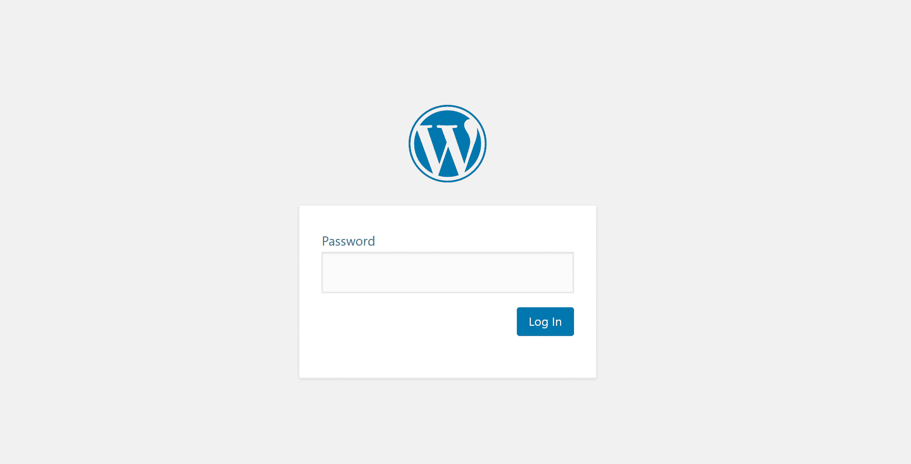

The sitewide password form


如果你想把[登录页面的](https://kinsta.com/blog/wordpress-login-url/)标志从通用的 WordPress 标志上去掉，你可以使用[免费登录标志插件](https://wordpress.org/plugins/login-logo/)。


### 如何用 HTTP 认证密码保护 WordPress 站点

有了基本的 HTTP 认证(又名 htpasswd 保护)，你可以在人们加载你的网站之前增加一层额外的密码保护，这就是为什么它是一个很好的选择。

如果你在 Kinsta 托管你的 WordPress 站点，你可以在 MyKinsta 仪表板中使用我们简单的[密码保护(htpasswd)工具](https://kinsta.com/help/htpasswd/)。您可以在网站的“工具”部分找到它。只需点击“启用”，选择用户名和密码，你就可以开始了！

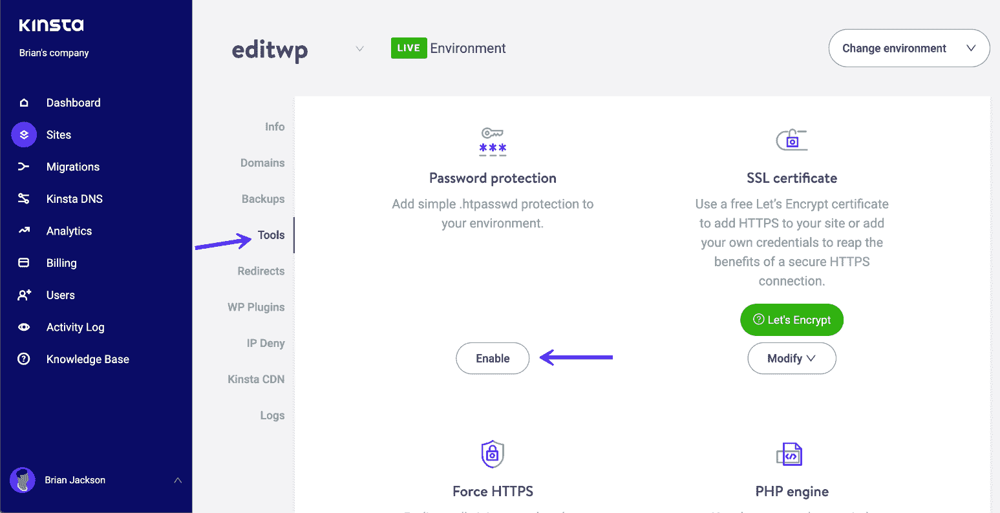

Enable .htpasswd protection


启用后，你的 WordPress 站点将需要认证才能访问。您可以随时更改凭据，或者在不再需要时将其禁用。


.htpasswd authentication prompt


## 如何用密码保护目录

需要密码保护你网站上的目录吗？也许你有一个文件夹在你的 WordPress 安装之外，你不想让公众访问它。

如果你的 WordPress 站点在 Kinsta，我们的支持团队可以帮助你。否则，您也可以使用 htpasswd 保护来实现这一点，您只需要相应地更新目录。

#### 街头流氓

要手动设置它，首先需要创建一个`.htpasswd`文件。你可以使用这个方便的[生成器工具](https://www.web2generators.com/apache-tools/htpasswd-generator)。然后将文件上传到你想要保护的目录。

```
www/user/public/protecteddirectory
```

然后用下面的代码创建一个 [`.htaccess`](https://kinsta.com/knowledgebase/wordpress-htaccess-file/) 文件，上传到你想要保护的目录的路径下。确保您更新了目录路径和用户名。

```
AuthType Basic  
AuthName "restricted area"  
AuthUserFile /www/user/public/protecteddirectory.htpasswd  
require valid-user 
```

#### Nginx

如果运行的是 [Nginx](https://kinsta.com/knowledgebase/what-is-nginx/) ，也可以用 HTTP 基本认证限制访问。查看[这篇教程](https://www.nginx.com/resources/admin-guide/restricting-access-auth-basic/)。

如果你的主机有 cPanel 的提供者，你可以用“目录隐私”工具设置一个密码保护的目录，这个工具位于文件部分。


cPanel directory privacy


## 如何用密码保护帖子、页面和电子商务产品

如果你想用密码保护一篇文章、一个页面或者一个网上商务产品，WordPress 实际上有一个内置的功能，通过它的**可见性**设置来帮助你设置。

你会在 WordPress 编辑器中找到**可见性**设置，所以你可以将它用于我们上面提到的每一种内容，以及你可能在你的网站上使用的任何其他[自定义帖子类型](https://kinsta.com/blog/wordpress-custom-post-types/)。

要开始使用:

*   打开想要添加密码保护的内容的 WordPress 编辑器。
*   在右侧边栏中找到**可见性**选项。
*   点击它。
*   选择**密码保护**并输入您想要用来解锁帖子的密码。

这是它在新的 WordPress 块编辑器中的样子:


Where to find Visibility options in the block editor


这是它在老式 WordPress 编辑器中的样子:


Where to find WordPress’ Visibility settings


发布或更新内容后，访问者将被提示输入密码，然后才能查看帖子。此外，WordPress 将在文章标题前加上“受保护”字样:

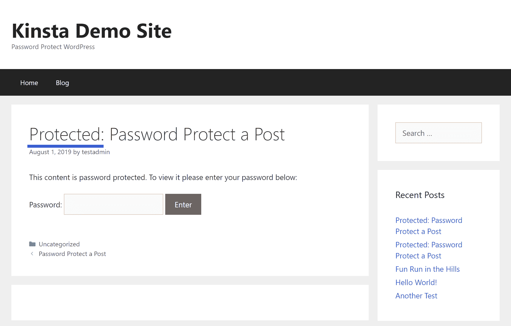

How the built-in WordPress password protection works


这种方法的一个很酷的地方是，你可以让人们通过输入一次密码来解锁多个帖子。要设置这个，你需要做的就是在多个帖子中重复使用同一个密码。很简单，对吧？

## 注册订阅时事通讯


### 想知道我们是怎么让流量增长超过 1000%的吗？

加入 20，000 多名获得我们每周时事通讯和内部消息的人的行列吧！

[Subscribe Now](#newsletter)

一旦访问者输入一次密码，**就会自动解锁所有使用相同密码**的内容。但是，如果另一个内容使用不同的密码，那么访问者仍然需要输入唯一的密码。

最后，为了让您了解这种类型的密码保护如何适用于不同的内容，下面是它如何适用于 WooCommerce 产品。您可以看到**可见性**控件正好出现在同一个位置:


How to password protect WooCommerce product


## 如何用密码保护一类 WordPress 文章

除了用密码保护个别内容，你还可以用密码保护整个类别。

这种方法的好处是，它使您更容易为多个内容添加密码保护，而且对您的访问者来说也更简单，因为他们只需要输入一次密码就可以解锁该类别中的所有内容。

要设置这个功能，你需要插件的帮助。我们建议两种选择:

1.  [密码保护类别，Barn2 Media 的高级插件](#password-protected-categories)。
2.  [访问类别密码，WordPress.org 的一个免费插件](#access-category-password)

### 如何使用受密码保护的类别

[密码保护类别](https://barn2.co.uk/wordpress-plugins/password-protected-categories/)的工作原理基本上是将你在上一节看到的相同的“密码保护”功能添加到你的类别中。

安装并激活插件后，你可以进入**文章→类别**并编辑你想添加密码的类别。在底部，你现在会看到同样的**可见性**框，你曾经用密码保护个别内容。

选择**密码保护**并输入您想要的密码。

一个很好的事情是，插件允许你添加多个密码，每个密码将解锁类别。这使您可以为每个人/组提供一个唯一的密码，以便将来需要时更容易删除访问权限:

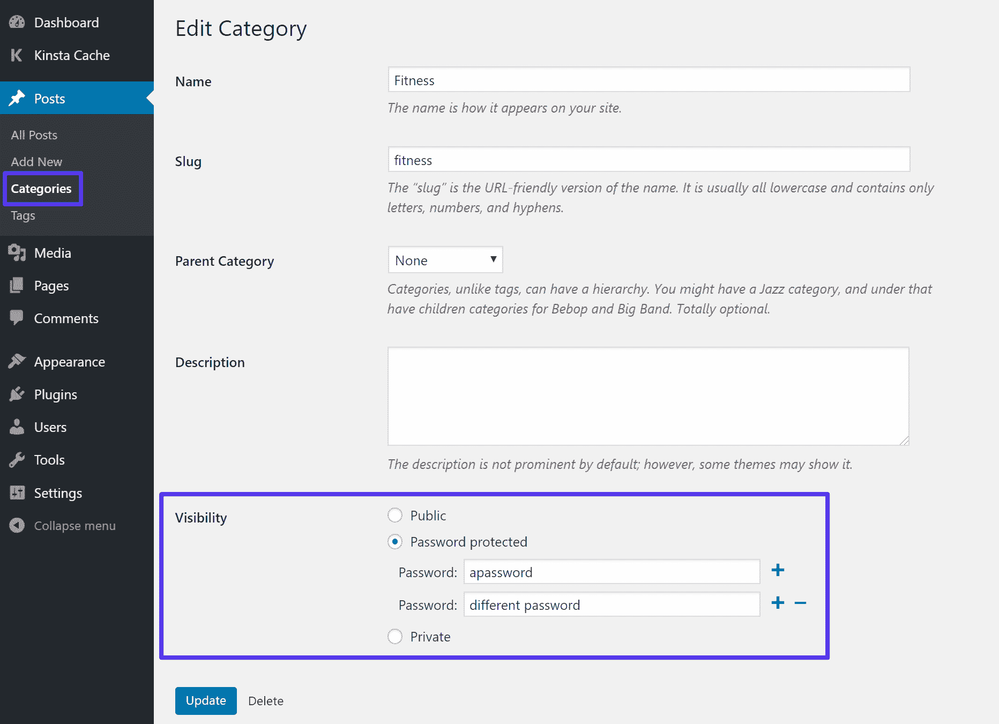

How to add a password to a category


保存更改后，当访问者试图访问受密码保护类别中的帖子时，系统会提示他们输入密码:

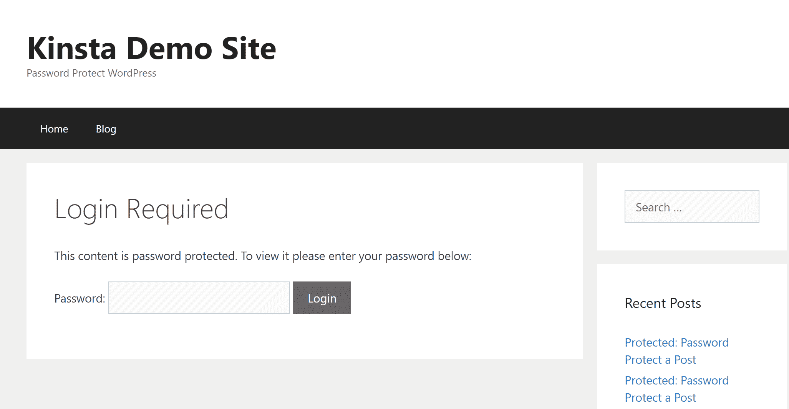

The password form to unlock the category


通过进入**设置→受保护类别**，您还可以访问一些额外的设置，让您控制插件的功能。您可以:

厌倦了体验你的 WordPress 网站的问题？通过 Kinsta 获得最好、最快的主机支持！[查看我们的计划](https://kinsta.com/plans/?in-article-cta)

*   设置密码的到期时间(例如，在访问者需要再次输入密码之前内容被解锁多长时间)。
*   选择是否仍然在站点的公共区域显示受保护类别中的内容，或者是否完全隐藏这些内容，直到有人输入密码。
*   定制您在上面看到的登录表单。

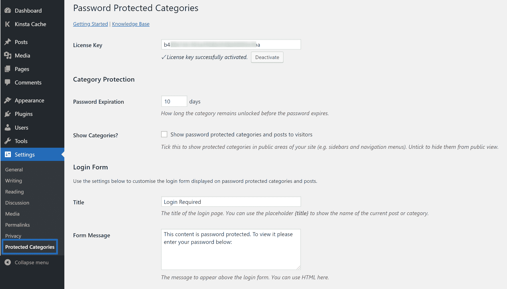

Password Protected Categories settings


如果你正在运行一个 WooCommerce 商店，这个开发者也有一个类似的插件，叫做 T2 woo commerce 保护类别。

### 如何使用访问类别密码

[访问类别密码](https://wordpress.org/plugins/access-category-password/)在 WordPress.org 免费提供。一旦你安装并激活它，你可以进入**设置→访问类别密码**。

在那里，您可以:

*   选择要使用的密码。
*   选择需要密码保护的类别。
*   将某些[用户角色](https://kinsta.com/blog/wordpress-user-roles/)列入白名单，这样他们无需输入密码就可以看到隐藏的类别。
*   选择是公开摘录还是隐藏所有内容。
*   自定义登录页面/密码保护通知。

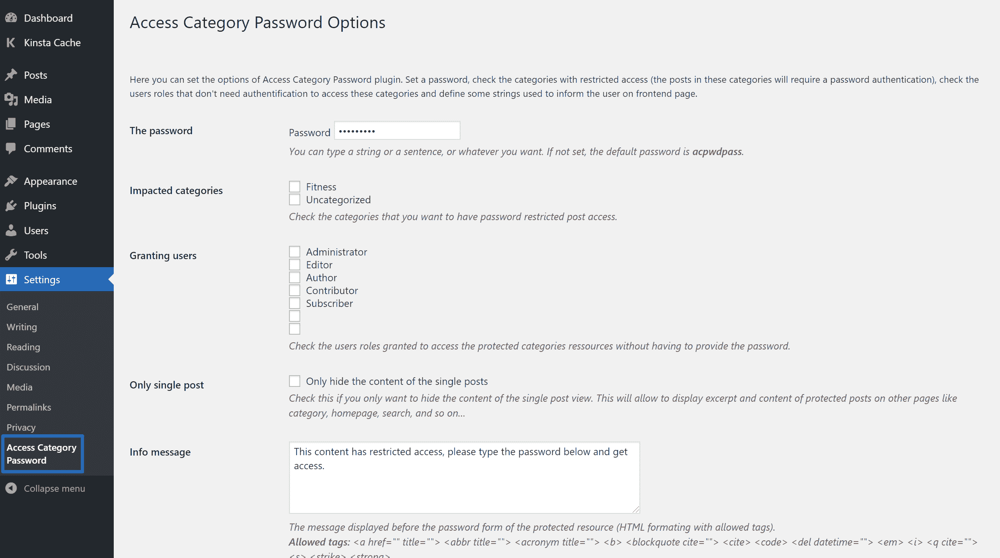

Access Category Password settings


保存更改后，访问者在尝试访问受限类别中的任何内容时，将需要输入密码。

虽然这个插件是免费的，但有一个缺点是你只能输入一个密码，你不得不对所有你想用密码保护的类别使用同一个密码。

如果你想为每个类别使用不同的密码，你最好使用上面的密码保护类别插件。

这里的另一个区别是，即使在用户输入密码之前，访问保护类别仍然显示文章标题，而上面的密码保护类别插件隐藏了标题:

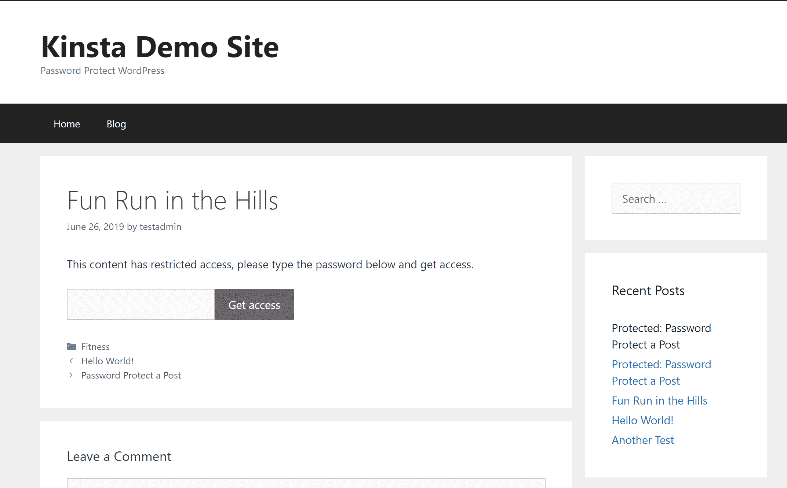

Access Category Password form


## 如何用密码保护 WordPress 文章的一部分

最后，让我们看看如何用密码保护一篇公开的 WordPress 文章的一部分的最具体的方法。

要设置这个功能，你可以使用 WordPress.org 的[免费 Passster 插件。](https://wordpress.org/plugins/content-protector/)

一旦你安装并激活了插件，进入**设置→密码**生成你将用来限制你的内容的短码。

输入您想要的密码，并选择**生成密码**:

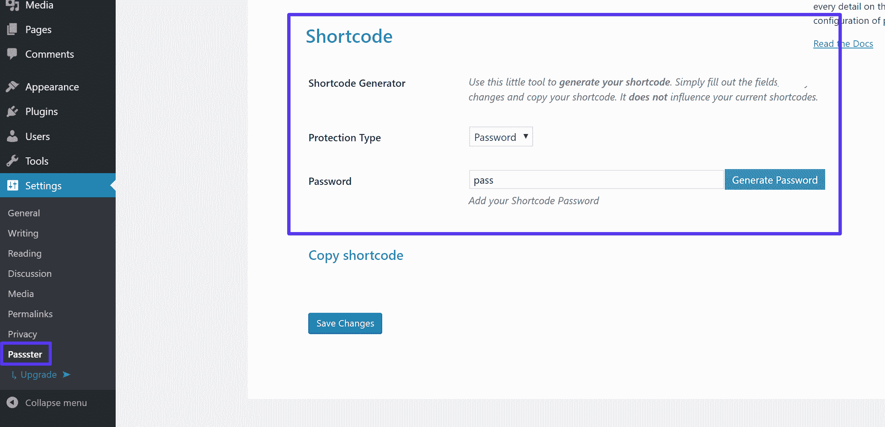

Passster shortcode generator


然后，保存您的更改并复制 Passster 给您的短代码:

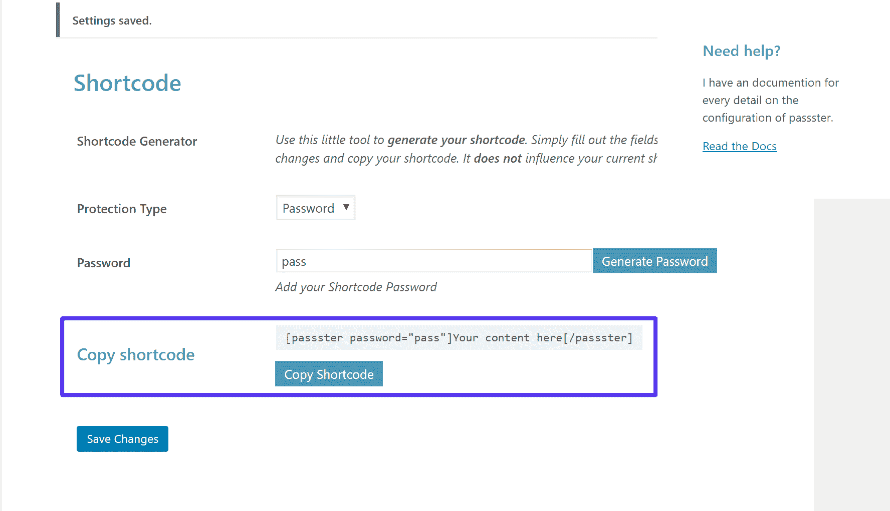

Copy the Passster shortcode


然后，将这个短代码添加到您想要使用密码保护的内容中。此外，编辑“您的内容在此处”占位符，并将其替换为您想要密码保护的内容:

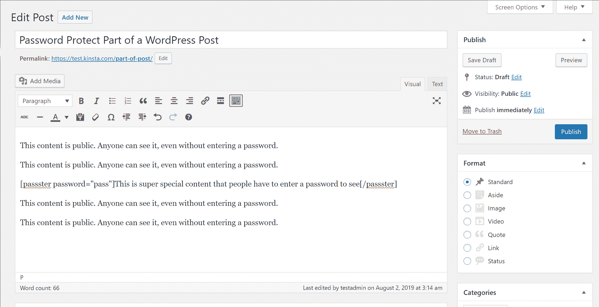

Example of the Passster shortcode


发布帖子后，下面是默认密码保护表单的一个示例:

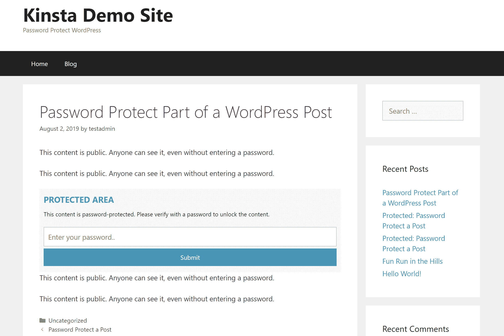

The Passster login form


要定制这个表单的外观，您可以使用 WordPress 定制器(**外观→定制**)。

在 WordPress 定制器中查找 **Passster** 部分。在那里，您可以自定义表单的文本和颜色:

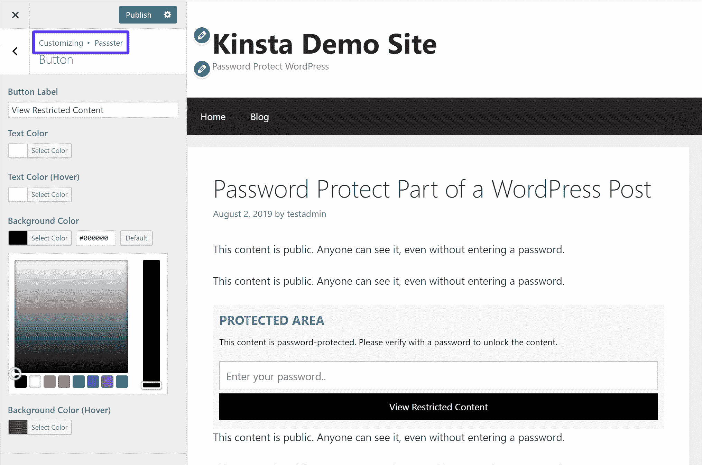

The Passster style options in the WordPress Customizer


[Need to password protect an entire blog post or just a section of it? Maybe a single category with all content in it? Check our latest guide on how to do it... it's super easy! 🔐💪Click to Tweet](https://twitter.com/intent/tweet?url=https%3A%2F%2Fkinsta.com%2Fblog%2Fpassword-protect-wordpress-site%2F&via=kinsta&text=Need+to+password+protect+an+entire+blog+post+or+just+a+section+of+it%3F+Maybe+a+single+category+with+all+content+in+it%3F+Check+our+latest+guide+on+how+to+do+it...+it%27s+super+easy%21+%F0%9F%94%90%F0%9F%92%AA&hashtags=wordpresstips%2Cwordpress)

## 摘要

无论你想限制访问你的整个网站，部分内容，还是介于两者之间，你都有很多选择来用密码保护 WordPress。

选择最适合你的方法，遵循我们教程中的步骤，享受你新的 WordPress 密码保护功能。

关于如何用密码保护一个 WordPress 站点，还有什么问题吗？请留下您的评论，我们会尽力帮助您。

* * *

让你所有的[应用程序](https://kinsta.com/application-hosting/)、[数据库](https://kinsta.com/database-hosting/)和 [WordPress 网站](https://kinsta.com/wordpress-hosting/)在线并在一个屋檐下。我们功能丰富的高性能云平台包括:

*   在 MyKinsta 仪表盘中轻松设置和管理
*   24/7 专家支持
*   最好的谷歌云平台硬件和网络，由 Kubernetes 提供最大的可扩展性
*   面向速度和安全性的企业级 Cloudflare 集成
*   全球受众覆盖全球多达 35 个数据中心和 275 多个 pop

在第一个月使用托管的[应用程序或托管](https://kinsta.com/application-hosting/)的[数据库，您可以享受 20 美元的优惠，亲自测试一下。探索我们的](https://kinsta.com/database-hosting/)[计划](https://kinsta.com/plans/)或[与销售人员交谈](https://kinsta.com/contact-us/)以找到最适合您的方式。