# 高级自定义字段教程:您的最终指南

> 原文:[https://kinsta.com/blog/advanced-custom-fields/](https://kinsta.com/blog/advanced-custom-fields/)

WordPress 自定义字段是使 WordPress 成为一个灵活的内容管理系统的重要组成部分，而不是“T2 仅仅是一个博客平台”。

说到 WordPress 自定义字段，freemium **高级自定义字段**插件是最广为人知的名字之一。它使得在各个方面使用自定义字段变得更加容易，这也是我们今天帖子的主题。

具体来说，我们将解释为什么高级定制字段如此有价值，然后一步一步地向你展示如何将它应用到你的 WordPress 站点上。

有很多内容要讲，所以让我们开始吧…

 <kinsta-auto-toc heading="Table of Contents" exclude="last" list-style="arrow" selector="h2" count-number="-1">## 什么是 WordPress 自定义字段？他们让你做什么？

WordPress 自定义域允许你添加、存储和显示 WordPress 内容的附加信息。从更技术性的角度来看，自定义字段可以帮助您存储元数据。

即使你不熟悉这个术语，自定义字段也是你最喜欢的插件和主题的强大功能。

例如， [WooCommerce](https://kinsta.com/blog/woocommerce-tutorial/) ，这是建立电子商务商店最流行的方式，它使用自定义字段来存储产品的附加信息，如:

<link rel="stylesheet" href="https://kinsta.com/wp-content/themes/kinsta/dist/components/ctas/cta-mini.css?ver=2e932b8aba3918bfb818">


*   价格
*   重量
*   颜色

或者，如果你有一个 WordPress 事件日历插件，该插件将使用自定义字段来存储事件的额外信息，例如:

*   位置
*   开始/结束时间
*   价格

你也可以创建自己的自定义字段来存储与你的独特需求相关的信息，这就是这篇文章的内容。

[How cool are custom fields in WordPress, uh? 👨‍💻Learn how to take advantage of them with the amazing @wp_acf in our latest guide! 💪Click to Tweet](https://twitter.com/intent/tweet?url=https%3A%2F%2Fkinsta.com%2Fblog%2Fadvanced-custom-fields%2F&via=kinsta&text=How+cool+are+custom+fields+in+WordPress%2C+uh%3F+%F0%9F%91%A8%E2%80%8D%F0%9F%92%BBLearn+how+to+take+advantage+of+them+with+the+amazing+%40wp_acf+in+our+latest+guide%21+%F0%9F%92%AA&hashtags=wordpress%2Cwebdev)

### 什么时候应该使用自定义字段？

现在，您可能想知道为什么首先需要定制字段。

例如，如果你想在你的 WordPress 站点上发布一个事件，你不能把所有的信息作为常规文本放在 WordPress 编辑器中吗？

是的，你可以。但是使用自定义字段是一种更好的方法，原因如下:

*   输入更容易 —一个精心设计的自定义字段组将使输入数据变得更加容易，而不是从头开始输入。例如，您可以从日期选择器中选择日期，而不是键入日期。
*   **一致性** —您在自定义字段中输入的信息将始终根据您的设置显示，这意味着它将在整个网站中保持一致。
*   **简单的更新和维护** —如果你想改变未来信息显示的方式，你只需更新一个东西，而不必单独编辑每篇文章。

### WordPress 包括内置的自定义字段功能

WordPress 实际上包含了为你的内容添加自定义字段的内置功能。在 [classic TinyMCE 编辑器](https://kinsta.com/blog/wordpress-tinymce-editor/)中，您可以从**屏幕选项**区域启用此功能。或者，在[新块编辑器](https://kinsta.com/blog/gutenberg-wordpress-editor/)中，您可以从**选项**区域启用它:

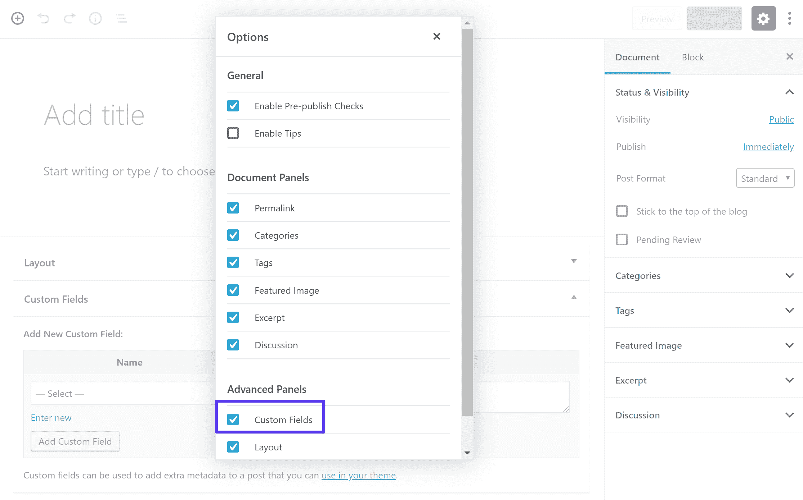

How to access custom fields in block editor


然后，您可以使用键/值对输入自定义字段数据:

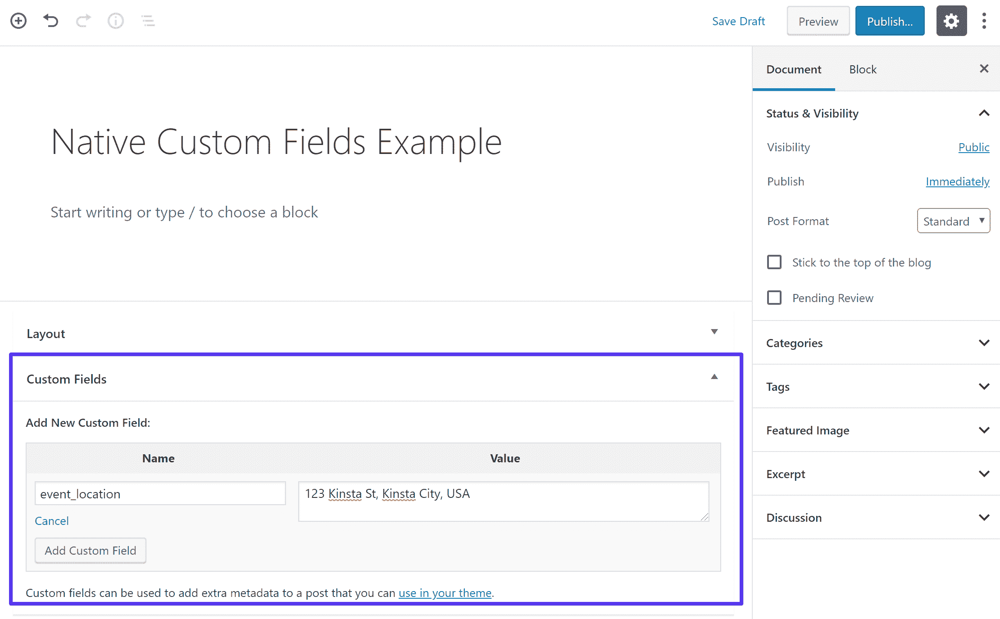

The built-in WordPress custom fields functionality


这个本地自定义字段功能是完全实用的，但它不是最用户友好的做事方式，这就是为什么许多人转向高级自定义字段插件的原因。
<kinsta-advanced-cta language="en_US" type-int-post="48437" type-int-position="0"></kinsta-advanced-cta>

## 高级自定义字段使它变得更加容易

简而言之，[高级定制字段](https://www.advancedcustomfields.com/)使得在 WordPress 中使用定制字段变得更加容易……几乎在所有方面。

它简化了在你的 WordPress 仪表盘中添加和管理自定义字段的界面，也简化了在你的站点前端显示自定义字段信息的过程。这一事实有助于解释为什么它活跃在超过 100 万个网站上，并在超过 1000 条评论中获得了 T2 4.9 星的评级。

在后端，它将让您创建用户友好的元框，包括预先选择的字段类型。因此，除了通用的键-值对接口(就像上面看到的那样)，您还可以使用日期选择器、复选框等等:


Advanced Custom Fields in the block editor


总之，高级自定义字段提供了 30 多种不同的字段类型，您可以将其添加到仪表板中的任何区域，包括帖子、用户、分类、媒体、评论，甚至自定义选项页面。

您可以在处[查看每个字段类型的详细信息。](https://www.advancedcustomfields.com/resources/#field-types)

高级定制字段也使得显示这些信息变得容易得多，包括记录良好的函数、短代码、Gutenberg 块等等。

或者，你可以找到与其他工具的集成，比如一些[拖放 WordPress 页面生成器](https://kinsta.com/blog/wordpress-page-builders/)。

### 高级自定义字段免费与专业:你需要哪一个？

高级自定义字段既有免费的，也有负担得起的高级版本。

对于大多数基本用途，免费版完全没问题。它让您可以访问几乎所有的字段类型，以及上面概述的所有节省时间和用户友好的功能。

如果你只是想存储一些关于你的内容的额外信息，免费版本是你所需要的。

也就是说，专业版确实增加了一些非常方便的功能，帮助您以更有趣的方式使用高级自定义字段:

*   **重复字段** —这些字段允许您逐个重复某些字段/字段组。例如，如果您正在向事件添加关于发言者的信息，repeater 字段将帮助您处理有多个发言者的情况(*您可以根据需要多次“重复”发言者的字段，这使您可以处理有多个发言者的边缘情况*)。
*   **ACF 块** —将您的字段显示为块古腾堡，而不是元框。如果您正在为客户构建一个网站，并希望为他们提供一种输入和可视化自定义字段数据的简单方法，这将非常方便。
*   **灵活的内容字段** —从其他字段创建布局。这有点像基于自定义字段信息的轻量级页面生成器。
*   **图库字段** —将多幅图像上传到单个字段。

还有一些其他的不同，比如选项页面、克隆字段的能力、对关系字段的改进以及其他一些小的调整。

你可以在这里看到 ACF PRO 的所有功能。

ACF PRO 在单个网站上每年使用 49 美元，在 10 个网站上每年使用 149 美元(T2)，在无限网站上每年使用 249 美元(T4)。

如果有疑问，从免费版本开始，直到你弄清楚你到底需要什么功能。如果需要，您可以随时升级。
<kinsta-advanced-cta language="en_US" type-int-post="48437" type-int-position="1"></kinsta-advanced-cta>

## 高级自定义字段教程:如何添加您的字段

现在让我们深入实际的高级定制字段教程，我将向您展示如何创建和显示您的第一组定制字段。

对于这个例子，假设[你有一个关于跑步的博客](https://kinsta.com/blog/how-to-monetize-a-blog/)。你非常喜欢跑步，你想和你的读者分享你的日常锻炼。具体来说，在每篇博文中，你都想分享一次跑步:

*   **目的** —假设你有两种不同类型的跑步:“速度训练”和“条件训练”。
*   **距离** —你跑步的距离。
*   **开始时间** —您开始跑步的时间。
*   **完成时间** —您完成跑步的时间。
*   **地点** —你跑步的地点。

为了收集这些信息，您需要添加五个自定义字段。

值得注意的是，您将在本高级自定义字段教程中学习的原则适用于任何用例。我们只是挑选一个具体的例子，因为它有助于有一个切实的例子来联系。

我们将把本教程分为两部分:

1.  如何在后端添加和管理您的自定义字段。
2.  如何在网站前端显示自定义字段信息？

### 1.创建新的字段组

一旦您安装并激活了来自 WordPress.org 的[免费版高级自定义字段，请前往**自定义字段>添加新字段**创建您的第一个**字段组**。](https://wordpress.org/plugins/advanced-custom-fields/)

顾名思义，“字段组”是一组一个或多个定制字段，它们一起显示在你的 [WordPress 仪表盘](https://kinsta.com/knowledgebase/wordpress-admin/)中。

在本例中，您将创建一个包含五个自定义字段的字段组。

给你的字段组起个名字，然后选择它的**位置**。在这个例子中，我们想为常规的 WordPress 博客文章显示这些自定义字段，所以你可以把它作为默认的**文章**。

但是，如果您想在其他地方显示您的自定义字段，比如在一个[自定义文章类型](https://kinsta.com/blog/wordpress-custom-post-types/)旁边，或者带有一个分类，您可能想改变这一点。您还可以设置多个规则，在多个位置显示您的字段:

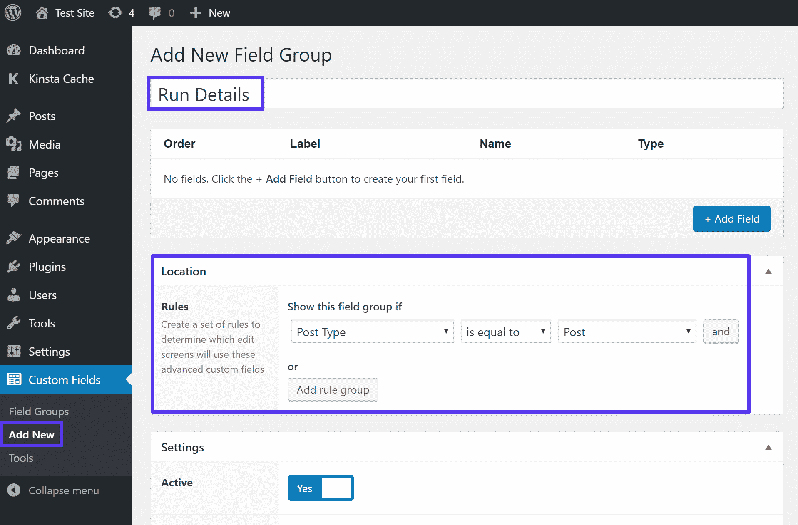

Create a new ACF field group


### 2.添加自定义字段

接下来，单击 **+添加字段**按钮来添加您的第一个自定义字段:


Add a new field


这将打开许多选项，但你不一定需要填写所有内容。

两个最重要的选择是:

*   **字段标签** —这是将出现在编辑器中的内容。它还将用于生成字段名，这是您将在代码中使用的。您不需要更改字段名称(尽管如果需要的话您可以这样做)。
*   **字段类型** —这是您想要收集的信息类型。例如，您想要一个**号码**字段来收集号码信息，或者一个**电子邮件**字段来收集电子邮件地址。

对于第一个字段，您需要一个**单选按钮**字段类型:


Configuring a field


再往下，您可以在**选择**框中输入单选按钮选择选项:

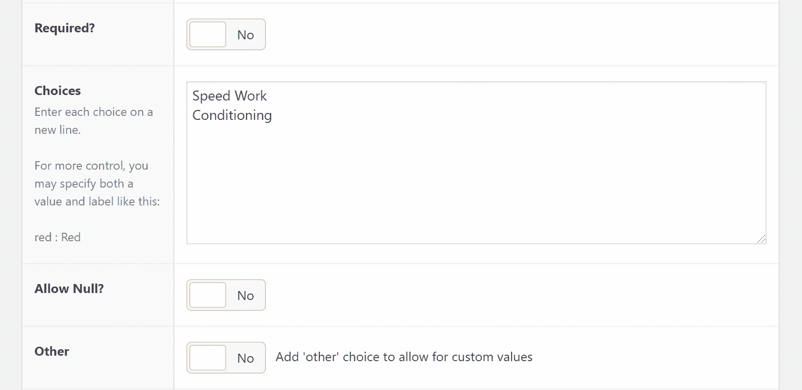

Enter radio box options


您还可以做出许多其他选择，比如某个字段是否是必填字段以及默认值。您可以根据自己的需要随意配置。

让我们看另一个例子:一个收集跑步距离的定制字段。这一次，您需要一个**数字**字段类型:


Creating a number field


您还可以通过选择**附加**距离单位来使事情变得更加用户友好。如果你愿意，你也可以添加一个**最小值**和**最大值**的验证。例如，你可能不会参加 1000 英里长跑(如果你参加了，天啊，你就是终极阿甘)！


More field settings


只需对您想要收集的所有其他自定义字段重复该过程。完成后，它应该看起来像这样:


5 different ACF fields


### 3.配置设置并发布

要完成事情，向下滚动到**设置**框。在这里，你可以控制你的字段如何在 [WordPress 编辑器](https://kinsta.com/?s=wordpress+editor)中显示。

 ## 注册订阅时事通讯


### 想知道我们是怎么让流量增长超过 1000%的吗？

加入 20，000 多名获得我们每周时事通讯和内部消息的人的行列吧！

[Subscribe Now](#newsletter)

大多数情况下，您可以将它们保留为默认值。但是如果你想的话，你可以随意改变。例如，你可以选择在常规的 WordPress 编辑器上面显示你的自定义字段:

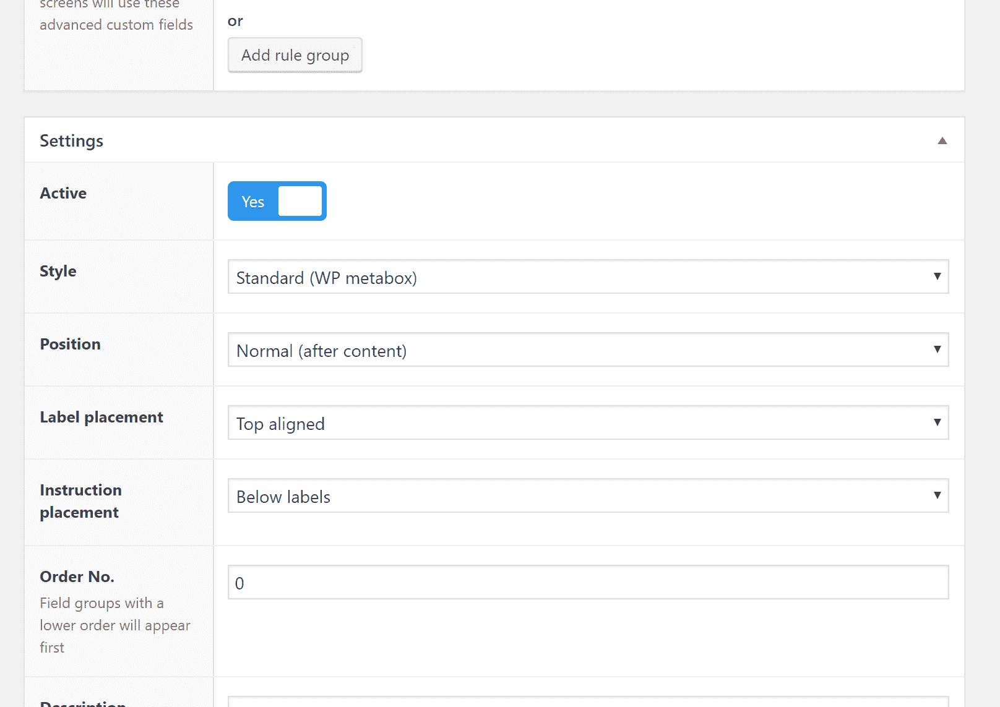

Configuring the ACF field group settings


一旦您做出选择，**发布**您的领域组以使其生效。

### 4.在 WordPress 编辑器中添加一些信息

发布您的字段组后，当您创建新帖子时，您将看到您的字段出现。

默认情况下，它们会一起出现在经典 TinyMCE 编辑器和新块编辑器中的编辑器下方:


Advanced Custom Fields in the block editor


你在这里输入的信息将被存储在你的站点的 [WordPress 数据库](https://kinsta.com/knowledgebase/wordpress-database/)中，以便于检索(你将在我们的高级定制字段教程的下一部分看到这一点)。

### 探索条件逻辑

在我们继续前进之前，让我们快速绕道。

看，高级自定义字段如此受欢迎的原因之一是因为它允许所有有趣的实现。

这里有一个强大的选项是**条件逻辑**，它允许您根据前一个字段的回答来显示/隐藏字段。

让我们看一个简单的例子来说明这是如何工作的…

假设你想[写关于食物的博客](https://kinsta.com/blog/how-to-start-a-food-blog/)，你的[旅行](https://kinsta.com/blog/how-to-start-a-travel-blog/)，或者除了跑步之外的任何事情。当你写一个关于非跑步的话题时，显示关于跑步信息的自定义字段没有多大意义，对吗？

如果不是自动显示您刚刚创建的所有定制字段，而是添加一个定制字段，说明“这篇文章是一次运行吗？”：

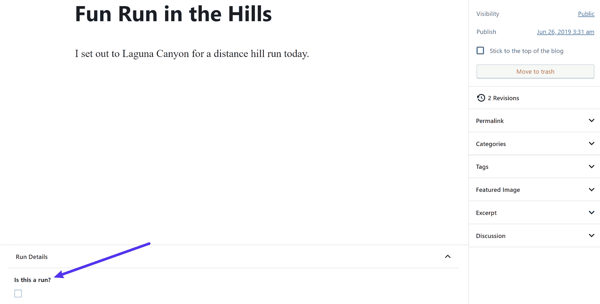

Conditional logic example


如果您选中该框，则运行信息字段会自动出现。如果您不选中它，它们将保持隐藏状态:

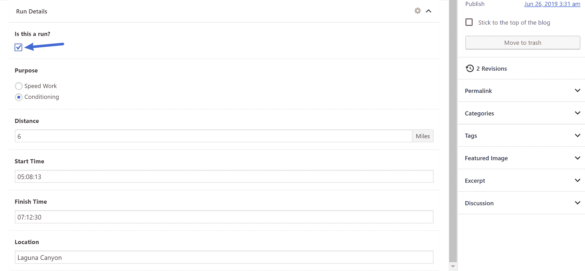

The other fields display when checked


这就是条件逻辑允许你做的！

为此，您可以编辑您的字段组，并添加一个新的 **True / False** 字段来表示“这是一次运行吗？”：

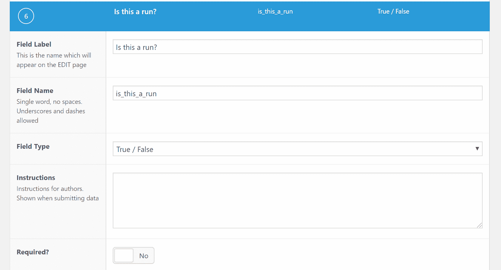

Adding a True/False field


然后，您可以编辑现有的字段并打开**条件逻辑**，这样每个字段只在“这是一次运行吗？”字段被选中:

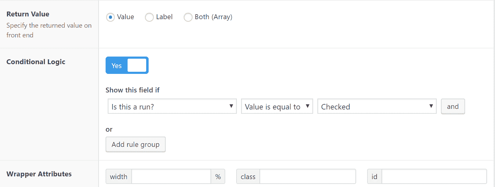

Adding conditional logic to other fields


 <kinsta-advanced-cta language="en_US" type-int-post="48437" type-int-position="2">## 如何在前端显示高级自定义字段

好了，我们已经完成了高级自定义字段之旅的一半。现在，您可以向自定义字段添加信息，将它与相关的文章类型相关联，并将其存储在数据库中。

然而，仍然有一个潜在的问题:来自自定义字段的信息还没有出现在前端的任何地方！

也就是说，即使您已经为博客文章的编辑器添加了一些自定义字段，您的博客文章在前端看起来仍然像一篇普通的博客文章:

厌倦了 WordPress 的问题和缓慢的主机？我们提供世界一流的支持，由 WordPress 专家提供 24/7 服务和超快的服务器。[查看我们的计划](https://kinsta.com/plans/?in-article-cta)


No custom fields on frontend


让我们解决这个问题。

有几种不同的方法可以在网站前端显示高级自定义字段数据。您选择的具体方法将取决于您的需求和知识水平。以下是实现这一目标的三种不同方式:

1.  你的主题的模板文件 —这需要一点技术知识，但在大多数时候这是最好的方法，尤其是如果你习惯于使用你的主题的模板文件。
2.  [用一个短代码](#shortcode) —如果你只是想逐个插入自定义字段数据，这是一个超级简单的好选择。然而，这需要更多的手工工作，因为你需要给每个帖子添加[短码](https://kinsta.com/blog/wordpress-shortcodes/)。
3.  使用 Elementor Pro —这很棒，因为它完全消除了使用 PHP 的需要，但它是一个高级产品，这也意味着你需要使用 Elementor Pro 进行模板化。

你可以点击上面直接跳到一个特定的方法，或者你可以通读所有的方法。由你决定。

### 如何在主题模板文件中添加高级自定义字段

显示定制字段信息的第一种方法是将高级定制字段的 PHP 函数直接添加到子主题的模板文件中。

这有点高级，因为它需要你深入到你的主题的模板文件中，但是它保证了你的定制字段每次都会自动显示在同一个地方。

具体来说，您需要为有问题的文章类型编辑**单个**模板。

对于一篇普通的博客文章来说，这是**single.php**。或者，一些主题将事物分解成模板部分。例如，对于[第二十九个主题](https://kinsta.com/blog/twenty-nineteen-theme/)，你实际上需要编辑【content-single.php】模板部分**。**

如果你在这里感到迷茫，你可能想用不同的方法。

一旦你为你的单篇文章找到了主题模板文件，你就可以使用高级定制字段的函数来显示一个字段的信息。举个例子，

```
<?php the_field('FIELD_NAME'); ?>
```

[点击这里](https://www.advancedcustomfields.com/resources/the_field/)了解更多信息。

例如，要显示“目的”字段，您可以使用

```
<?php the_field('purpose'); ?>
```

编辑字段组时，可以找到字段名称:

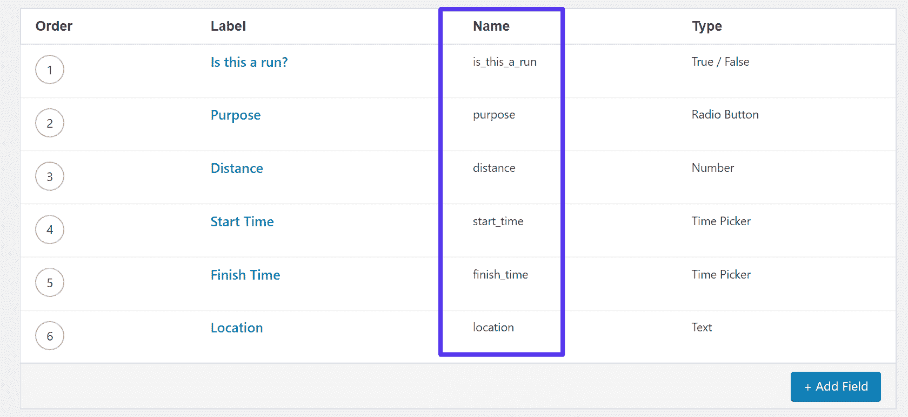

Where to find ACF field name


因此，将一点 HTML 标记与 PHP 结合起来，您可能会得到类似这样的东西来显示所有字段:

```
<div class="run-information">
<ul>
<li><strong>Purpose:</strong> <?php the_field('purpose'); ?></li>
<li><strong>Distance:</strong> <?php the_field('distance'); ?></li>
<li><strong>Start Time:</strong> <?php the_field('start_time'); ?></li>
<li><strong>End Time:</strong> <?php the_field('finish_time'); ?></li>
<li><strong>Location:</strong> <?php the_field('location'); ?></li>
</ul>
</div>
```

要将它添加到常规的文章内容之上，您可以将它添加到主题模板文件中的 **the_content()** 之上:

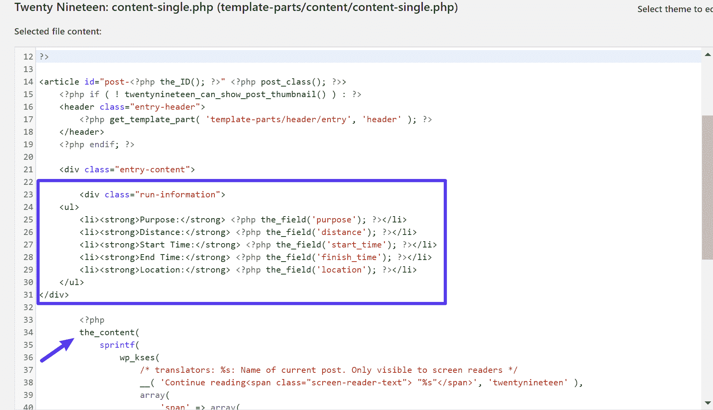

Where to add code in theme template file


现在，在刷新博文后，你可以在常规的 WordPress 内容上面看到定制字段数据:

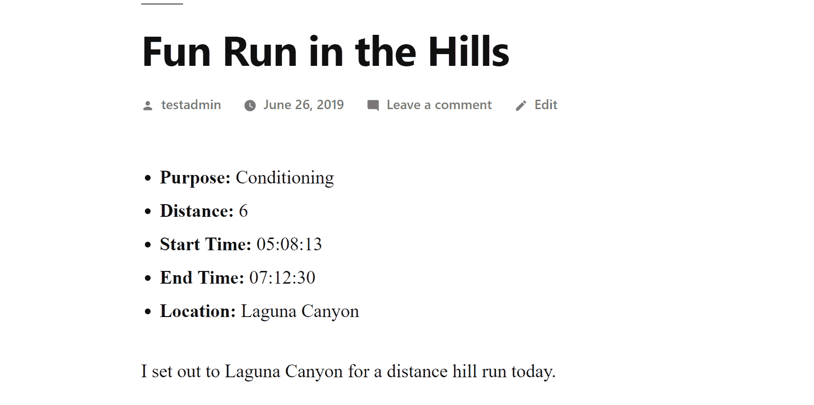

You can now see fields on the frontend


要了解更多信息，[请查看高级自定义字段的完整文档](https://www.advancedcustomfields.com/resources/#functions)。

### 如何用短代码显示高级自定义字段数据

要更简单地显示自定义域的数据，还可以使用短代码。但是，这样做的缺点是，每次想要显示自定义字段时，都需要添加短代码。没有简单的方法来自动完成这项任务。

简短代码是这样的:

```
[acf field="FIELD_NAME"]
```

例如，如果你在 WordPress 编辑器中输入:


Using shortcodes to display ACF data


然后，你的站点的前端看起来会和之前的主题模板方法完全一样:


The shortcodes look identical to the theme template file


### 如何用 element 或 pro 显示高级自定义字段

[Elementor](https://kinsta.com/blog/wordpress-elementor/) 是最受[欢迎的 WordPress 页面生成器](https://kinsta.com/blog/wordpress-page-builders/#elementor)之一。它允许您使用可视化的拖放编辑来构建您的设计。另外， [Elementor 是 Kinsta 的官方合作伙伴之一](https://kinsta.com/partners/elementor/)。

有了 Elementor Pro 这个付费的附加组件，你还可以构建你的主题模板文件，包括一个从高级自定义域插入动态自定义域数据到你的设计中的选项。

如果你想要在你的模板中自动包含自定义字段数据的灵活性，但是不喜欢直接对你的主题模板文件进行代码编辑的话，这是一个很好的选择。

首先，你可以去**模板>主题生成器**为你的帖子创建一个新的元素或模板:


Create a new Elementor Single template


你可以为你的**帖子标题**和**帖子内容**添加常规元素或小部件。然后，为了显示定制字段数据，您可以添加常规的 [**文本编辑器**](https://kinsta.com/blog/best-text-editors/) 小部件。这里唯一的区别是，您没有编辑文本，而是选择了**动态**选项:

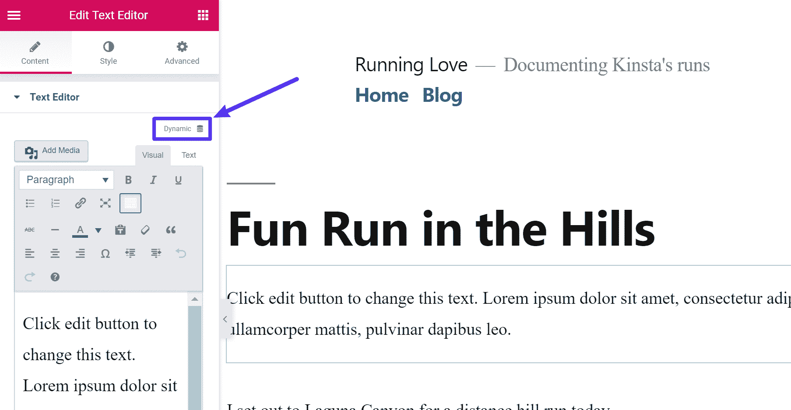

The Elementor Pro “Dynamic” option


之后，您可以从下拉列表中选择 **ACF 字段**:


Select “ACF Field”


在那里，您可以选择使用高级自定义字段添加的特定字段:

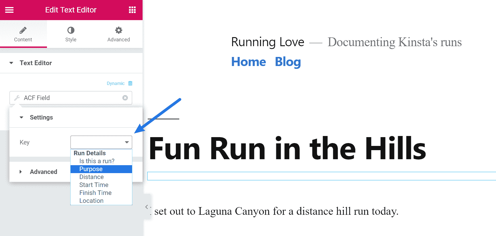

Select the specific field you want to display


您还可以使用**高级**折叠标签来预先计划或附加信息，这允许您添加标签和单位:

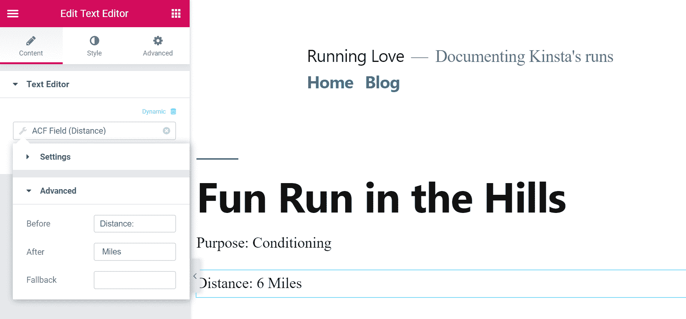

Prepend or append information


很简单，对吧？现在只需对其他自定义字段重复以上步骤！

## 摘要

使用高级自定义字段，您可以通过易于使用的解决方案，用更多数据和信息来丰富您的页面和博客文章。更多:你可以开始为你的网站上的任何内容收集额外的信息，然后在前台显示给你的访问者。

为此，您有三种选择:

*   你的主题的模板文件
*   用短代码
*   使用元素或专业版

你在这篇文章中获得的知识将让你释放 WordPress 的深层潜力，建立 100%定制的网站，远远超越 WordPress 的博客根基。

剩下的唯一问题是:

您将使用高级自定义字段创建什么？在下面的评论中与我们分享吧

* * *

让你所有的[应用程序](https://kinsta.com/application-hosting/)、[数据库](https://kinsta.com/database-hosting/)和 [WordPress 网站](https://kinsta.com/wordpress-hosting/)在线并在一个屋檐下。我们功能丰富的高性能云平台包括:

*   在 MyKinsta 仪表盘中轻松设置和管理
*   24/7 专家支持
*   最好的谷歌云平台硬件和网络，由 Kubernetes 提供最大的可扩展性
*   面向速度和安全性的企业级 Cloudflare 集成
*   全球受众覆盖全球多达 35 个数据中心和 275 多个 pop

在第一个月使用托管的[应用程序或托管](https://kinsta.com/application-hosting/)的[数据库，您可以享受 20 美元的优惠，亲自测试一下。探索我们的](https://kinsta.com/database-hosting/)[计划](https://kinsta.com/plans/)或[与销售人员交谈](https://kinsta.com/contact-us/)以找到最适合您的方式。</kinsta-advanced-cta></kinsta-auto-toc>