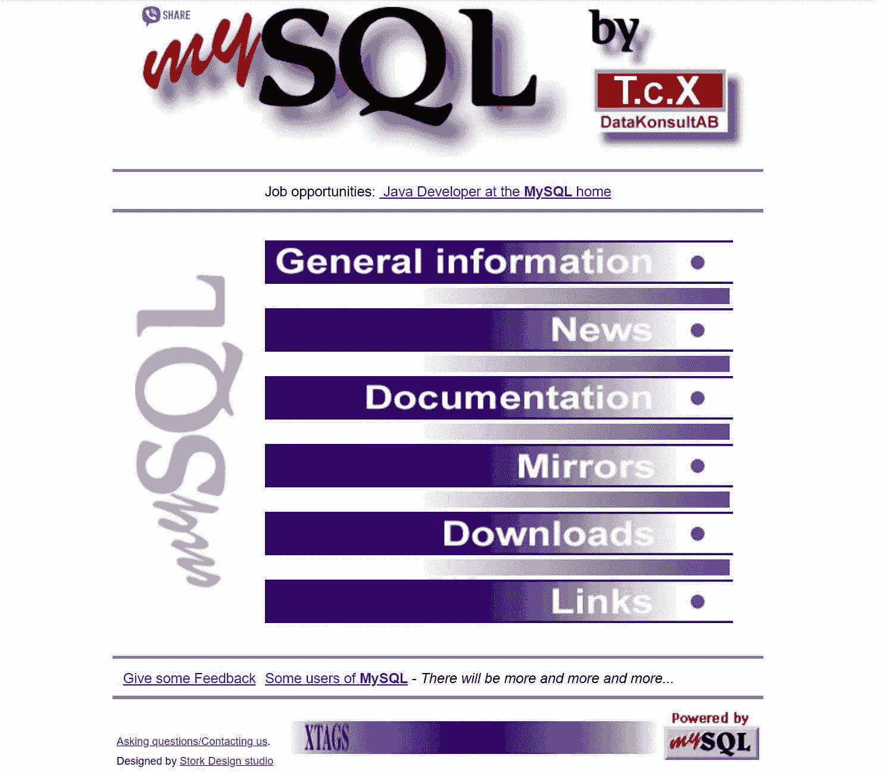
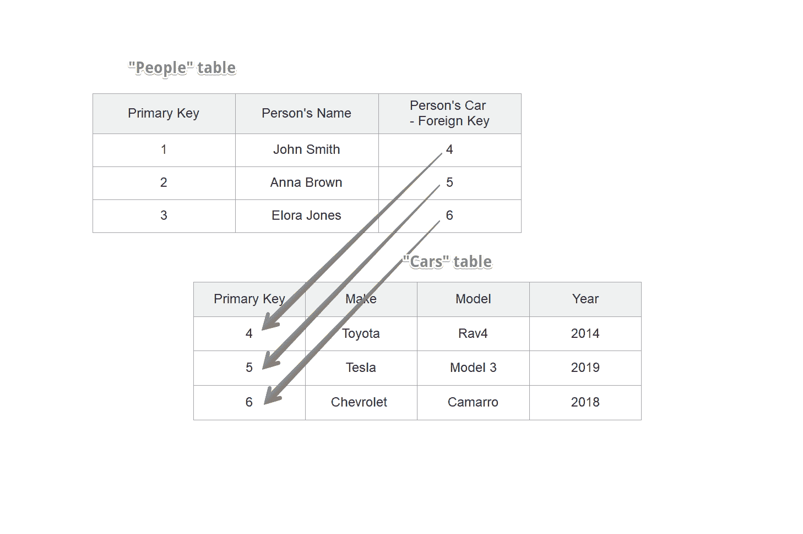
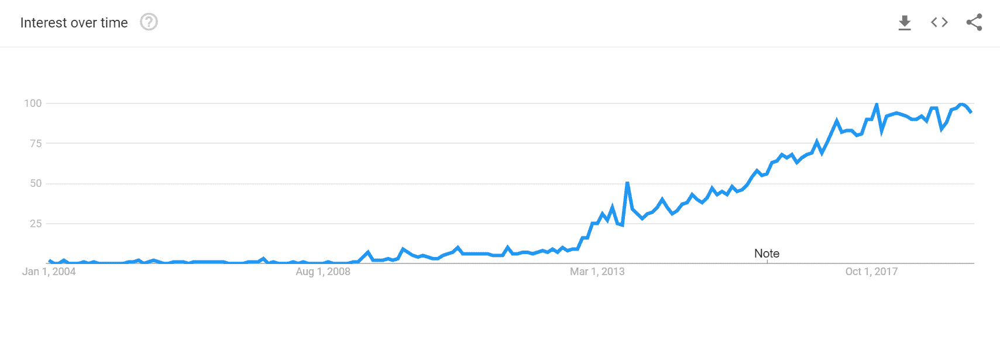
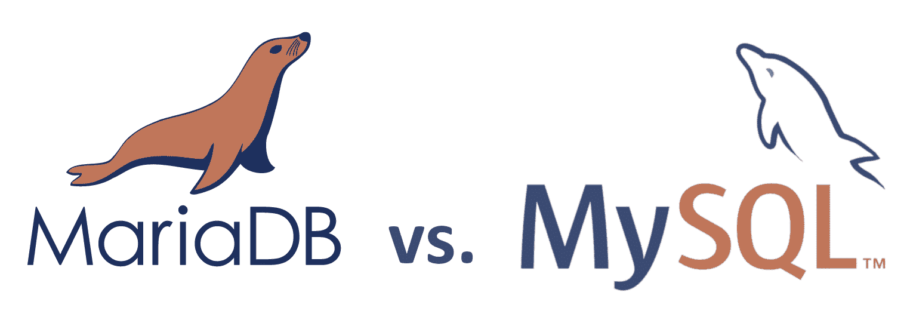

# MariaDB vs MySQL:数据库技术概要

> 原文:[https://kinsta.com/blog/mariadb-vs-mysql/](https://kinsta.com/blog/mariadb-vs-mysql/)

在之前的一篇文章中，我们讲述了 Apache web 服务器的故事，它在互联网崛起中的作用，以及它的市场份额是如何被像 Nginx 这样的竞争对手蚕食的。Apache 是 [LAMP 堆栈](https://en.wikipedia.org/wiki/LAMP_(software_bundle))—*Linux+Apache+MySQL+PHP—*的一部分，毫不夸张地说，超过一半的互联网都归功于 LAMP。

今天，我们将看看 MariaDB 和 MySQL 之间的一些差异，这两种相似但不同的数据库技术用于支持全球数百万个网站。

 <kinsta-auto-toc heading="Table of Contents" exclude="last" list-style="arrow" selector="h2" count-number="-1"><link rel="stylesheet" href="https://kinsta.com/wp-content/themes/kinsta/dist/patterns/featured-snippet.css?ver=264ec3d754b6bff57ae9">

## MariaDB 与 MySQL 的区别

即使 MariaDB 是 MySQL 的一个分支，这两个数据库管理系统仍然有很大的不同:

*   MariaDB 是完全 GPL 许可的，而 MySQL 采用双许可方法。
*   每一种都以不同的方式处理线程池。
*   MariaDB 支持许多不同的存储引擎。
*   在许多情况下，MariaDB 提供了改进的性能。

Support

## 什么是 MySQL

MySQL 是一种关系数据库(RDBMS ),它于 1995 年问世，由[迈克尔·蒙蒂·维德纽斯](https://twitter.com/montywi)和[大卫·阿克斯马克](https://en.wikipedia.org/wiki/David_Axmark)创建。它是在市场被微软和甲骨文的专有(且昂贵)解决方案主导的时候创建的。

Old MySQL page from 1998 (Image source: [Archive.org](https://web.archive.org/web/19980701000000*/https://www.mysql.com/))

MySQL 如今是一个典型的品牌。正如我们今天所知，它在建设互联网的过程中发挥了关键作用。[Linux 杂志上的这篇文章](https://www.linuxjournal.com/article/9224)揭示了它早期的一些情况。

<link rel="stylesheet" href="https://kinsta.com/wp-content/themes/kinsta/dist/components/ctas/cta-mini.css?ver=2e932b8aba3918bfb818">

> Kinsta 把我宠坏了，所以我现在要求每个供应商都提供这样的服务。我们还试图通过我们的 SaaS 工具支持达到这一水平。
> 
> <footer class="wp-block-kinsta-client-quote__footer">
> 
> 
> 
> <cite class="wp-block-kinsta-client-quote__cite">Suganthan Mohanadasan from @Suganthanmn</cite></footer>

[View plans](https://kinsta.com/plans/)

MySQL 早期采用双许可——并使用 GNU GPL 作为其免费版本——为后来的许多其他软件供应商铺平了道路。

[用迈克尔·维德纽斯的话说](http://www.h-online.com/open/features/Open-core-or-dual-licensing-The-example-of-MySQL-1367824.html)关于双重许可:

> *…由于 MySQL 是一种基础设施产品，可以很容易地嵌入到其他产品中，我们可以向那些希望将 MySQL 嵌入到他们的产品中，但不想让他们的产品开源的人出售许可证。*

作为 LAMP 堆栈的一部分，服务器部署的 web 应用程序通常不嵌入 MySQL 并分发它们的代码。这意味着任何人都可以在自己的网络产品中自由使用该软件。

在公开发布后不到十年， [MySQL 就统治了](https://www.theregister.co.uk/2005/10/18/mysql_marketshare_numbers/)开源关系数据库市场。

Google Trends 显示，全球网络搜索对 MySQL 的兴趣在 2004-2005 年间达到顶峰:

Interest in MySQL over time

使用 MySQL 的一些值得注意的公司包括:

*   [脸书](https://gigaom.com/2011/12/06/facebook-shares-some-secrets-on-making-mysql-scale/)，2011 年的一份报告提到了多达*“每秒 6000 万次查询，每秒近 400 万次行更改”*和 MySQL 处理*“几乎每一次用户交互:喜欢、分享、状态更新、提醒、请求。”*
*   网飞的[其平台的计费部分](https://medium.com/netflix-techblog/netflix-billing-migration-to-aws-451fba085a4)
*   [Youtube](http://highscalability.com/blog/2012/3/26/7-years-of-youtube-scalability-lessons-in-30-minutes.html)
*   [Booking.com](https://www.youtube.com/watch?v=iNxqZSbaHYQ&feature=youtu.be)
*   [Airbnb](http://nerds.airbnb.com/how-we-partitioned-airbnbs-main-db/)
*   和许多其他人。

促成 MySQL 崛起和被采用的另一个值得一提的因素是 phpMyAdmin。

PhpMyAdmin 是一个基于网络的数据库管理工具，可以追溯到 1998 年，它很早就进入了共享主机提供商的管理控制台，包括 [cPanel](https://kinsta.com/knowledgebase/what-is-cpanel/) 。这是一个用 PHP 编写的工具[，它使得在 LAMP 服务器上管理 MySQL 变得很容易。导入、导出、编写复杂的查询、删除和创建表、进行复杂的搜索，这些都是 phpMyAdmin 在用户无需使用 Linux 终端的情况下实现的。
<kinsta-advanced-cta language="en_US" type-int-post="49230" type-int-position="0"></kinsta-advanced-cta>](https://kinsta.com/knowledgebase/what-is-php/)

### WordPress 和 MySQL

MySQL 的流行背后的一个因素无疑是 WordPress，它今天驱动了大约 60%的 CMS 系统或者整个 web 的 34%。
WordPress 是由马特·莫楞威格和迈克·利特尔于 2003 年创建的，作为另一个项目的分支。它是用 PHP 编写的，使用 MySQL 作为它的数据库，当它出现时，它的采用像野火一样迅速。

WordPress 很快成为开源软件概念的同义词，其底层服务器也是如此。DisplayWP 有一张[漂亮的图表](http://displaywp.com/wordpress-minimum-mysql-version/),列出了每个 WordPress 版本所需的最低 MySQL 版本。

推动 MySQL 被采用的因素之一是其许可的 GPL 方面。因为它与 Linux 兼容，所以它开始默认包含在 Linux 发行版中。今天它默认包含在 Ubuntu 中。

### MySQL 和关系数据库模型概述

MySQL 被认为是一个 RDBMS(关系数据库管理系统)。关系数据库模型[可以追溯到 20 世纪 70 年代](https://en.wikipedia.org/wiki/Edgar_F._Codd)，正如[“Codd 的十二条戒律”](https://en.wikipedia.org/wiki/Codd%27s_12_rules)所概述的。简而言之，这个模型将数据组织到由列和行组成的表中。每一行都由一个键唯一标识(用 SQL 术语来说就是*主键*)。

这些*主键*可以被用作其他表用来定义特定行的*关系*的一种钉。因此，关系数据库表中的外键列将引用另一个表中的主键列，从而定义不同表中行之间的关系。

正如 [Essential SQL 所解释的，](https://www.essentialsql.com/what-is-the-difference-between-a-primary-key-and-a-foreign-key/)"***主键**由一列或多列组成，其中包含的数据用于**唯一标识表中的每一行**"D* 主键列中的数据必须唯一，不能为空。在关系数据库*中，“表只有一个主键，它的定义是强制性的。”*
同时，***外键**是一个表中一列或多列的集合，引用另一个表中的主键。您不需要放置任何特殊的代码、配置或表定义来正式“指定”外键。*

Relational database model in MySQL

这样，使用关系数据库，就有可能以复杂的方式对数据建模，并定义各种数据之间的连接。在上面的简单示例中，我们有两个表，表中的行可以相互关联，例如，每个人拥有一辆汽车。

 ## 注册订阅时事通讯

### 想知道我们是怎么让流量增长超过 1000%的吗？

加入 20，000 多名获得我们每周时事通讯和内部消息的人的行列吧！

[Subscribe Now](#newsletter)

我们可以根据我们需要的逻辑来查询这些数据，我们可以根据不同的标准集来过滤结果集，并且我们可以用比我们上面概述的更复杂的方式来构造我们的查询。

由于这个原因，关系数据库(以及一般的数据库)使用特定于领域的语言，其中 SQL(代表[结构化查询语言，](https://en.wikipedia.org/wiki/SQL)是 RDBMS 使用的最流行的语言，如果不是唯一的语言的话。

### 由 Sun 收购

2008 年，MySQL 背后的公司 MySQL AB 被 Sun Microsystems 收购。这家公司开发了 JAVA、Solaris 和 Unix 操作系统，是不同计算机技术的重要贡献者。据商业新闻[报道，当时](https://www.businesswire.com/news/home/20080116005349/en/Sun-Microsystems-Announces-Agreement-Acquire-MySQL-Developer):

> *“Sun Microsystems，Inc. (NASDAQ:JAVA)今天宣布，它已达成一项最终协议，以大约 10 亿美元的总代价收购 MySQL AB，这是一个开源图标和世界上增长最快的开源数据库之一的开发者”*

这将很快证明，这次收购并不足以阻止 Sun 的垮台，但它描绘了一幅 MySQL 在那个时代有多么强大的画面。

### 神谕

甲骨文公司是迄今为止最大的闭源数据库供应商。

它是 MySQL 的直接竞争对手，实际上是 MySQL 当时成为的 GPL、免费、开源软件模式的对立面。

当甲骨文在 2010 年收购 Sun 和 MySQL 时([以此战胜 IBM](https://qr.ae/TWtv5x)),[自由/开源软件](https://www.gnu.org/philosophy/floss-and-foss.en.html)世界认为这是像《星际迷航》中博格攻击一样“邪恶”的事情。一个用户回忆起 Quora 上的事件[:](https://www.quora.com/Why-did-Oracle-buy-MySQL-if-they-dont-even-make-money-out-of-it)

> MySQL 对甲骨文来说是一个严重的威胁——当时甲骨文数据库的收入占总收入的 80%以上(考虑到维护它所需的骨干人员，利润甚至更多)。
> 
> MySQL 取得了重大进展——拥有价值数百万美元的网站许可证的财富 50 强大公司正在将数据库(尤其是只读数据库)从 Oracle 转移到 MySQL，因为管理费用要低得多。我知道，我帮助做了一些。
> 
> MySQL 社区中的许多人希望增加一些功能，使 Oracle 的免费版本变得过时。MySQL 肯定会走上这条路。工具越来越成熟，拉里害怕了。
> 
> 因此，甲骨文收购 MySQL 是为了确保其对品牌的控制，分散社区，并从无知的大众手中拯救其旗舰产品。
> 
> 这是一个合乎逻辑的结论，因为 MySQL 在当时变得如此流行，以至于它可能被视为对甲骨文核心业务的真正威胁。正如 Geekflare 的 Ankush Thakur [所说的](https://geekflare.com/mysql-to-mariadb-migration/)， *MySQL 变得如此流行，以至于很快，开发人员忘记了 SQL 和 MySQL 是两回事。*

在收购发生之前，2009 年底，蒙蒂·维德纽斯(Monty Widenius)，他在那一年[离开 MySQL 团队](http://monty-says.blogspot.com/2009/02/time-to-move-on.html)建立了自己的 fork 和数据库公司，在他的博客上发表了一个戏剧性的呼吁[(我们将引用刚刚开始的话):](http://monty-says.blogspot.com/2009/12/help-saving-mysql.html)

> ***帮助拯救 MySQL***
> 
> 我，MySQL 的创建者 Michael "Monty" Widenius，紧急请求您帮助将 MySQL 从 Oracle 的魔掌中拯救出来。如果没有你的直接帮助，甲骨文可能随时会拥有 MySQL。通过写信给欧洲委员会(EC ),您可以支持这项事业，并帮助确保 MySQL 产品作为开源项目的未来发展。

尽管如此，收购还是在一个月后进行了，这让开源社区的许多人感到沮丧。Widenius [已经离开了 Sun](http://monty-says.blogspot.com/2009/02/time-to-move-on.html) ，组建了 Monty Program AB，分叉了 MySQL，为 MariaDB 奠定了基础。同时带着许多 MySQL 开发人员。

直到今天，人们仍在质疑蒙蒂恐惧的合法性。尤其是，由于最糟糕的情况根本没有发生:甲骨文收购 MySQL 并不是为了杀死它。

有些人认为 MySQL 被甲骨文收购仅仅是收购 Sun 的“附带受害者”。回到 2009 年，那些关注数据库市场的人有理由担心。

警告就在那里。MySQL 主要存储引擎的开发者 InnoDB 是一家来自芬兰的公司，2005 年被甲骨文收购。后来，他们被完全并入甲骨文，终止了原来的公司。2006 年，甲骨文收购了 Berkeley DB T1 的创造者，Berkeley DB T1 是另一个不太重要的 T2 BDB T3 存储引擎的提供商。他们在兜圈子。

## 什么是 MariaDB

2009 年 10 月，MariaDB 在 MySQL 5.1.38 的基础上发布了第一个版本,版本为 5.1.38 Beta。这是一个叉，意为 *[【确保 MySQL 代码库永远免费】](https://www.computerworld.com.au/article/457551/dead_database_walking_mysql_creator_why_future_belongs_mariadb/)。*

在分叉的时候，最普遍的担心是这次收购是一次恶意收购，目标是杀死 MySQL。事实证明，这种担心至少部分是没有根据的。

同样在 2009 年，Monty Program AB 和 Percona，一家提供优质 MySQL 服务的公司，[建立了开放数据库联盟](https://www.infoq.com/news/2009/05/mysql-open-database-alliance/)。他们的目标是*“统一所有与 MySQL 相关的开发和服务，为 MySQL 相关的社区、企业和技术专家面临的碎片化和不确定性提供解决方案。”*

[想法](https://www.percona.com/about-us/pressreleases/mysql-founder-monty-widenius-and-percona-ceo-peter-zaitsev-launch-the-open-database-alliance)是*“成为 MySQL 开源数据库的行业中心，包括 MySQL 和衍生代码、二进制文件、培训、支持以及 MySQL 社区和合作伙伴生态系统的其他增强功能”*

回过头来看:这些步骤可能阻止了著名数据库出现更糟糕的情况。
<kinsta-advanced-cta language="en_US" type-int-post="49230" type-int-position="1"></kinsta-advanced-cta>

## MariaDB 与 MySQL:兼容性

MariaDB 的 MySQL 分支(以 Widenius 的女儿命名)的全部目的是确保未来对 MySQL 的访问及其进一步发展。这就是为什么 MariaDB 被认为是一个完全的二进制替代物(T1)，也就是说，一个“插入式”替代物，使 MySQL 的所有用户能够在他们的系统上互相交换。

MySQL 是一个客户端-服务器应用程序，它的服务器程序 *mysqld、*它的客户端 *mysql、*以及辅助程序，如 *mysqldump、*都与 MariaDB 同名。

用 MariaDB 替换 MySQL 对大多数应用程序和目的来说是一个无缝的过程，尤其是 WordPress。现有的软件，从[流行的 CMS 工具](https://kinsta.com/wordpress-market-share/)到像 phpMyAdmin 这样的应用程序，都是开箱即用的，实际数据可以从一个导出/导入到另一个，而无需任何更改。

在比较数据库技术时，您应该将我们与您当前的主机进行比较。了解为什么我们的平台是一致、可靠的，并且是业界最快的平台之一。[免费试用 kin sta](https://hubs.ly/H0pklC_0)。

MariaDB 的[声明的目标](https://mariadb.com/kb/en/library/what-is-the-goal-of-mariadb/)是保持与 MySQL 的兼容性。据 [MariaDB 网站](https://mariadb.com/kb/en/library/mariadb-vs-mysql-compatibility/)报道，

*   *数据和表格定义文件兼容。*
*   所有客户端 API 和协议都是兼容的。
*   MySQL 和 MariaDB 上的文件名、二进制文件和路径是相同的。
*   *端口和插座是一样的。*
*   所有 MySQL 连接器——PHP、Perl、Python、Java 和其他——都与 MariaDB 一起工作。
*   就像 MySQL 一样，MySQL 客户端包可以与 MariaDB 互换使用。

每月进行合并，以确保兼容性，并从 Oracle 获得任何新功能和错误修复。

## MariaDB vs MySQL:分叉背后的原因

MariaDB 发布背后有多种原因。人们担心甲骨文会为了保护其更有利可图的主要产品而杀死其日益增长的竞争对手，这无疑是最大的担忧之一。用户将会失去一个奇妙的免费产品！

其他原因与确保 MySQL 保持免费和开源有关。如今，MariaDB 的所有功能都是完全 GPL 许可的，而 MySQL 则保持双许可的方式，高级功能在专有的[付费许可下许可](https://www.mysql.com/products/enterprise/):

> " *MySQL 企业版包括最全面的高级功能、管理工具和技术支持，可实现最高水平的 MySQL 可扩展性、安全性、可靠性和正常运行时间。它降低了开发、部署和管理业务关键型 MySQL 应用程序的风险、成本和复杂性。”*

如果我们在这里比较两者，MariaDB 有明显的优势，这是由它发布时的 GPL 许可证提供的。由于专有代码库，Oracle 不能合法地利用 MariaDB 代码并将其合并到他们的数据库中。

维德纽斯[承诺](https://www.linux.com/news/special-qa-monty-widenius) : *“当甲骨文发布 MySQL 的闭源扩展时，我们也会发布一个开源的。”*

### 社区事务

分叉背后的另一个原因是保持项目的“开放性”，因为它是一个社区驱动的项目([像 WordPress](https://kinsta.com/knowledgebase/what-is-wordpress/) )，它的方向和开发就像它的许可证一样是开放的。如果我们看一下[提交日志](https://github.com/mysql/mysql-server/commits/8.0)，很容易得出结论，大部分 MySQL 代码来自内部开发人员。例如，甲骨文的开发者[感谢来自社区的偶然和显著的贡献](https://mysql.wisborg.dk/2019/05/01/mysql-server-8-0-16-thanks-for-the-contributions/)，但这远没有 MariaDB 的开放，也远没有 MySQL 曾经的样子。

客观地看，[在撰写本文时，Maria db server repository](https://github.com/MariaDB/server)有超过 186k 个提交、370 多个分支和 200 个贡献者。另一方面，[MySQL](https://github.com/mysql/mysql-server)，有超过 148k 个提交，9 个分支，72 个贡献者。

关于 MariaDB 开发的讨论，它的方向，关于特性的投票，等等。在[公开邮件列表](https://launchpad.net/~maria-developers/+join)上完成:

The “Maria developers” team

除了这个，还有[玛丽亚讨论](https://launchpad.net/~maria-discuss)邮件列表。

Maria Captains 是一个值得信赖的开发团队，开发人员可以向他们提交补丁。正如团队在 Launchpad 上的页面所说:

> “队长是可信的开发人员，对主 MariaDB 树有写权限。 *如果你想在树中添加一个补丁，提交到 maria-developers 列表，一个或多个队长将与你一起审核、批准补丁，并最终将其推送到适当的 MariaDB 树中。”*

MariaDB 生动的开发过程已经证明了它比 Oracle 封闭的开发过程更有优势。

2012 年底，MariaDB 基金会成立，负责监督数据库的开发。

分叉后不久，许多最初的 MySQL 开发人员跳槽加入了 MariaDB 项目。像 Red Hat、CentOS、Arch Linux、Debian、OpenSuse、Slackware、Fedora 等 Linux 厂商都改用 MariaDB 作为默认的 RDBMS，还有 BSD 发行版、FreeBSD 和 OpenBSD，而 Ubuntu 包括 MariaDB。整个列表可以在这里找到[。](https://mariadb.com/kb/en/library/distributions-which-include-mariadb/)

阿里云、腾讯、IBM、微软、Booking.com 等公司成为白金赞助商。

对于 Kinsta 来说，作为最好的[应用](https://kinsta.com/application-hosting/)、[数据库](https://kinsta.com/database-hosting/)、[管理 WordPress 托管](https://kinsta.com/wordpress-hosting/)，有趣的是在[中 MariaDB 基金会董事会](https://mariadb.org/about/board/)是来自 Automattic 的人，这是 WordPress 的创造者已经接受 MariaDB 的明显标志。

在拆分后的几年里，MariaDB 有了活跃的发展，以至于由于 2012 年引入的一整套新功能，MariaDB 从 5。*版本号，兼容 MySQL，到 10.0 ，想要体现它已经实现的功能上的飞跃。

由于性能原因，维基媒体基金会在 2013 年宣布将维基百科转换为 MariaDB。同样的事情也发生在[谷歌](https://www.theregister.co.uk/2013/09/12/google_mariadb_mysql_migration/)身上，它的用户名单现在包括德意志银行、星展银行、纳斯达克、威瑞森、Craigslist 等。

在 MySQL 用户中，我们有 GitHub、美国海军、NASA、特斯拉、网飞、微信、脸书、Zendesk、Twitter、Zappos、YouTube、Spotify。

自从 MySQL 的第一版发布以来，人们对它的兴趣一直在稳步增长，[正如谷歌搜索趋势所显示的:](https://trends.google.com/trends/explore?q=%2Fm%2F09gc20r&date=all)

Interest in MariaDB over time

 <kinsta-advanced-cta language="en_US" type-int-post="49230" type-int-position="2">## MariaDB 与 MySQL 的主要区别

虽然 MariaDB 可能一开始就与 MySQL 完全兼容，但我们可以预计他们的道路在未来会更加分歧。

MariaDB vs MySQL

在他的最后一篇博客文章中，Widenius [祝贺 Oracle](http://monty-says.blogspot.com/2018/04/congratulations-to-oracle-on-mysql-80.html) 在 MySQL 8.0 版本上所做的工作，概述了一些差异和警告，例如:

线程池:与 Apache 相比，类似于 Nginx server 解决的问题，MySQL 为每个客户端连接分配线程，这相当于在 pc 上启动整个程序，效率非常低。 [MariaDB 在 5.5 版本中推出了自己的解决方案](https://mariadb.com/kb/en/library/thread-pool-in-mariadb/)

[隐形](https://mariadb.com/kb/en/library/invisible-columns/) [列](https://mariadb.com/kb/en/library/invisible-columns/)是 MariaDB 从 10.3.3 开始的专属特性。它们不会在 SELECT *语句中返回结果，也不需要在 INSERT 语句中被赋值。

MariaDB 在其时态数据类型中引入了[微秒](https://mariadb.com/kb/en/library/microseconds-in-mariadb/)。

存储引擎: [MariaDB 使用的](https://mariadb.com/kb/en/library/storage-engines/)包括 *XtraDB、InnoDB、MariaDB ColumnStore、Aria、Archive、Blackhole、Cassandra 存储引擎、Connect、CSV、FederatedX、Memory 存储引擎、Merge、Mroonga、MyISAM、MyRocks、QQGraph、Sequence 存储引擎、SphinxSE、Spider、TokuDB* 。 [ColumnsStore](https://mariadb.com/kb/en/library/mariadb-columnstore/) 在性能方面很有意思，因为它使线性伸缩处理数 Pb 的数据成为可能。在他们的博客上有更多关于它的信息[。](https://mariadb.com/resources/blog/tag/columnstore/)

[MySQL 存储引擎](https://dev.mysql.com/doc/refman/8.0/en/storage-engines.html)有 *[InnoDB](https://kinsta.com/knowledgebase/convert-myisam-to-innodb/) ，MyISAM，Memory，CSV，Archive，Blackhole，Merge，Federated，Example* 。

数据库视图[是一个特性](https://hackr.io/blog/mariadb-vs-mysql#Database_Views)，其中 MariaDB 通过只查询必要的表引入了显著的优化。

MySQL 引入的一些功能有 [JSON 原生数据类型](https://dev.mysql.com/doc/refman/8.0/en/json.html)，[MySQL 8.0](https://dev.mysql.com/doc/mysql-shell/8.0/en/)版本中的 MySQL Shell 它允许 javascript 和 python 脚本——并且不与 MariaDB、[基于 SHA-256 的认证插件](https://dev.mysql.com/doc/refman/8.0/en/caching-sha2-pluggable-authentication.html)一起工作，提高了 mysql_native_password 的安全性。

在这里，您可以找到 MariaDB 和 MySQL 之间差异的[完整列表](https://mariadb.com/kb/en/library/mariadb-vs-mysql-features/)，以及前者与后者相比的优势。

[MariaDB vs MySQL: what's the best pick? Learn the story behind these database technologies in our latest rundown! 📜Click to Tweet](https://twitter.com/intent/tweet?url=https%3A%2F%2Fkinsta.com%2Fblog%2Fmariadb-vs-mysql%2F&via=kinsta&text=MariaDB+vs+MySQL%3A+what%27s+the+best+pick%3F+Learn+the+story+behind+these+database+technologies+in+our+latest+rundown%21+%F0%9F%93%9C&hashtags=mysql%2Cwebdev)

## 摘要

MySQL 隶属于世界上最大的商业数据库供应商。这么多全职工程师夜以继日地开发优质的新功能，我们已经有了一些分歧点。另一方面，MariaDB 通常会在溢价增加时赶上，但这并不总是立竿见影的，也没有保证。

话虽如此，但在许多情况下，MariaDB 提供了改进的性能。除此之外，更灵活的补丁和更新、更稳定的开源未来以及更多的乐观，您将会看到为什么在 Kinsta 我们不仅是粉丝，而且还使用 MariaDB 作为我们的[性能驱动的服务器堆栈](https://kinsta.com/features/)的一部分。

* * *

让你所有的[应用程序](https://kinsta.com/application-hosting/)、[数据库](https://kinsta.com/database-hosting/)和 [WordPress 网站](https://kinsta.com/wordpress-hosting/)在线并在一个屋檐下。我们功能丰富的高性能云平台包括:

*   在 MyKinsta 仪表盘中轻松设置和管理
*   24/7 专家支持
*   最好的谷歌云平台硬件和网络，由 Kubernetes 提供最大的可扩展性
*   面向速度和安全性的企业级 Cloudflare 集成
*   全球受众覆盖全球多达 35 个数据中心和 275 多个 pop

在第一个月使用托管的[应用程序或托管](https://kinsta.com/application-hosting/)的[数据库，您可以享受 20 美元的优惠，亲自测试一下。探索我们的](https://kinsta.com/database-hosting/)[计划](https://kinsta.com/plans/)或[与销售人员交谈](https://kinsta.com/contact-us/)以找到最适合您的方式。</kinsta-advanced-cta></kinsta-auto-toc>