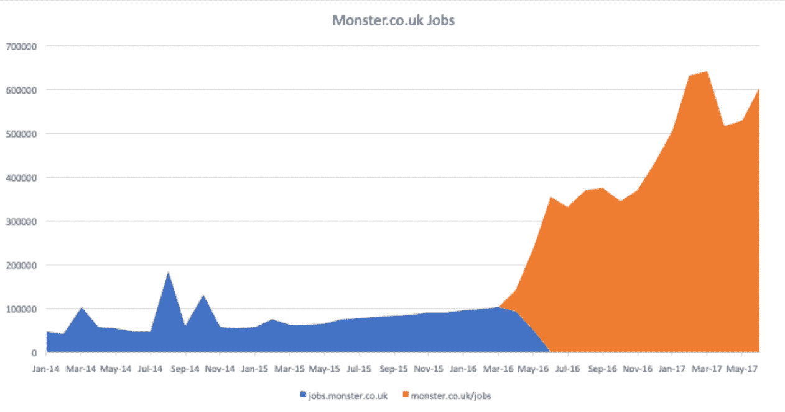
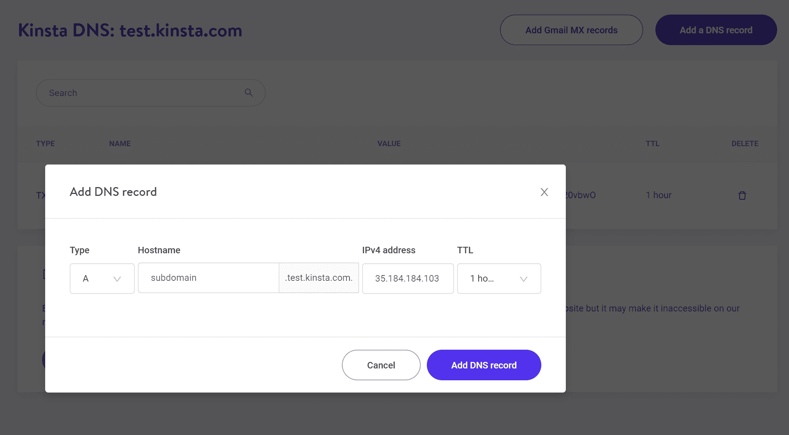
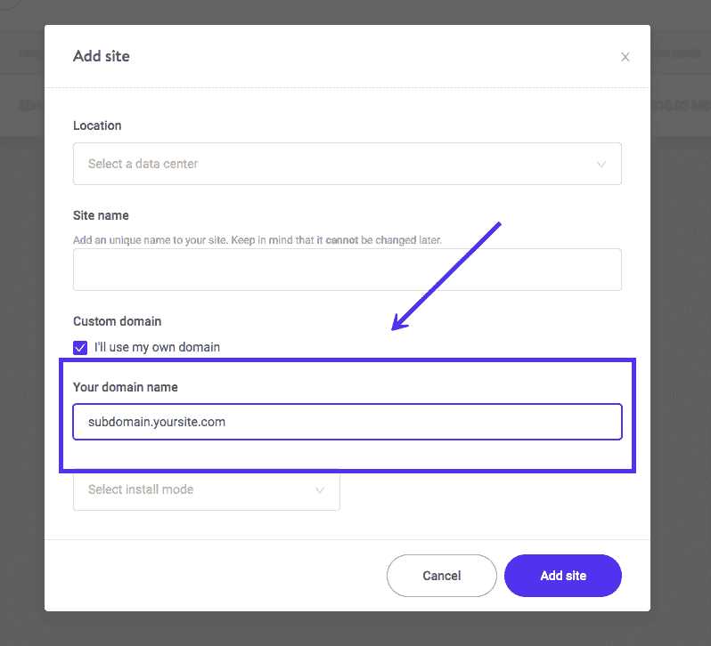
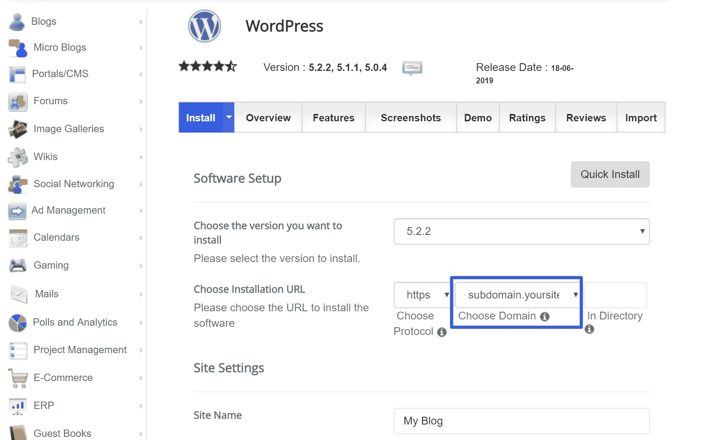
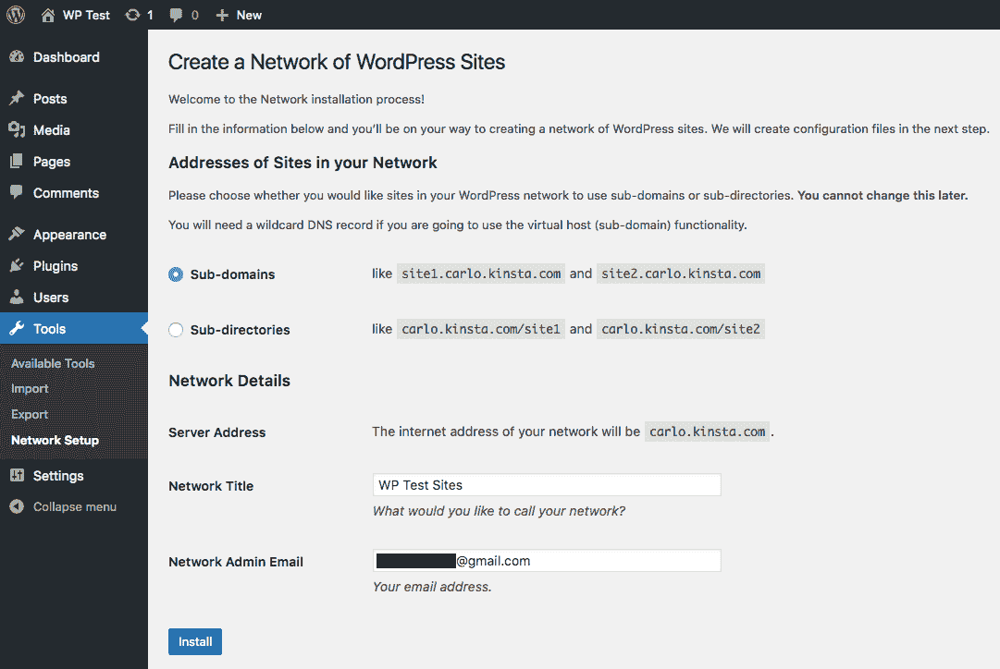
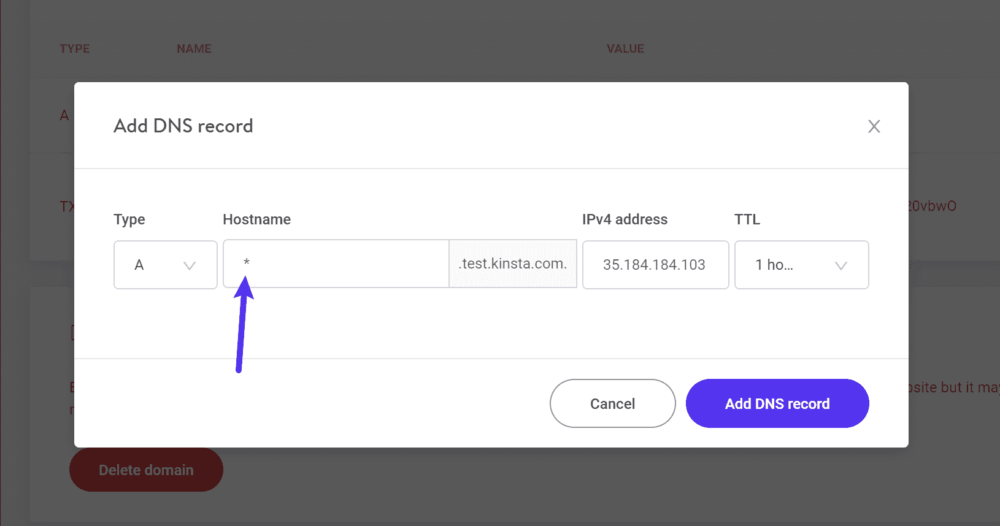

# WordPress 子域指南:SEO 影响，如何设置它们，并有效地使用它们

> 原文:[https://kinsta.com/blog/wordpress-subdomain/](https://kinsta.com/blog/wordpress-subdomain/)

子域是域名的一个附加部分，位于主域之前。例如，**subdomain.maindomain.com**。

你可以添加尽可能多的子域，每个子域都被视为自己独特的域(尽管并不总是适用于[SEO](https://kinsta.com/blog/what-does-seo-stand-for/)——更多信息请见本文)。

在本帖中，我们将从子域及其 SEO 效果的一般讨论开始，以及使用子域的利与弊。

然后，我们将从“什么”转到“如何”，并向你展示如何使用一个 WordPress 子域来创建[不同的 WordPress 安装](https://kinsta.com/help/new-site/)在不同的子域上。或者，你也可以使用一个 WordPress 安装来驱动子域上的多个站点。

 <kinsta-auto-toc heading="Table of Contents" exclude="last" list-style="arrow" selector="h2" count-number="-1">[What's the best option for a WordPress site: subdomains vs subfolders? Is SEO affected by them? We know the answers! 🙋Check them out in our guide!Click to Tweet](https://twitter.com/intent/tweet?url=https%3A%2F%2Fkinsta.com%2Fblog%2Fwordpress-subdomain%2F&via=kinsta&text=What%27s+the+best+option+for+a+WordPress+site%3A+subdomains+vs+subfolders%3F+Is+SEO+affected+by+them%3F+We+know+the+answers%21+%F0%9F%99%8BCheck+them+out+in+our+guide%21&hashtags=domainnames%2Cseo)

## 使用子域对搜索引擎优化的影响

当谈到使用子域对 SEO 的影响时，你会发现两边都有人。

<link rel="stylesheet" href="https://kinsta.com/wp-content/themes/kinsta/dist/components/ctas/cta-mini.css?ver=2e932b8aba3918bfb818">

> Kinsta 把我宠坏了，所以我现在要求每个供应商都提供这样的服务。我们还试图通过我们的 SaaS 工具支持达到这一水平。
> 
> <footer class="wp-block-kinsta-client-quote__footer">
> 
> 
> 
> <cite class="wp-block-kinsta-client-quote__cite">Suganthan Mohanadasan from @Suganthanmn</cite></footer>

[View plans](https://kinsta.com/plans/)

通常，争论发生在使用**子文件夹**(yoursite.com/topic)和**子域** (topic.yoursite.com)之间。

例如，在 Kinsta，我们为 Kinsta 博客使用一个子文件夹——“kin sta . com/**blog**”。然而，你会发现许多其他成功的企业选择使用子域作为他们的博客。比如 HubSpot 用“**博客** .hubspot.com”。

一些专家说，这两种方法之间几乎没有影响，而其他人说，在大多数情况下，你应该尽量避免子域，因为它会对 SEO 产生负面影响。根据谷歌的约翰·穆勒的说法

> "谷歌网络搜索可以使用子域或子目录."

他说，谷歌可能需要更长一点的时间来找出子域名，但从长远来看，这两者之间没有区别，你应该选择最适合你的一个。他唯一的告诫是，无论你选择哪一个，你都应该努力坚持你的长期选择。

然而，不管 Google 怎么说，有许多 SEO 案例研究指出，在大多数情况下，子文件夹是紧密联系主题的一种更好的方法。

例如，Monster.co.uk[从一个子域转移到一个子文件夹后，流量](https://www.getcredo.com/subdomain-vs-subdirectory-whats-best-for-seo/)猛增:

Monster.co.uk before/after moving to subdomains

当然，你也会发现一些相反方向的案例研究，HubSpot 博客是一个很好的指示器，表明你可以使用一个子域，但仍然是成功的。

事实上，这是一个如此有争议的话题，以至于上面约翰·穆勒的视频在 Twitter 上引发了一场辩论，[哪个搜索引擎圆桌会议在这里记录了](https://www.seroundtable.com/seo-google-fight-subdomains-subdirectories-25126.html)。

那么真相在哪里呢？不幸的是，我们无法获得[谷歌的算法](https://kinsta.com/blog/google-patents-seo-ranking-factors/)，所以我们永远无法真正知道。

谷歌说这没关系，但是当内容与主域名密切相关时，大多数 SEO 专家似乎更喜欢子文件夹而不是子域名。

一个好的经验法则是:

*   如果内容与根域密切相关，请使用子文件夹。例如，在 Kinsta，我们为我们的博客使用一个子文件夹(**kinsta.com/blog**)，因为它与 Kinsta 根域上的其他内容密切相关。
*   如果内容与根域相当独立，考虑一个子域。例如，我们使用**my.kinsta.com**作为我们[客户托管仪表板](https://kinsta.com/mykinsta/)的 URL，因为这些仪表板是私有的，与 Kinsta 网站的前端内容无关。

 <kinsta-advanced-cta language="en_US" type-int-post="49153" type-int-position="0">## 使用子域的利弊

为了完成使用子域的理论，让我们来看看使用子域的利与弊:

**优点**:

*   没有额外的费用。您可以创建尽可能多的子域，而无需购买新域。
*   谷歌表示，使用子域和子文件夹来分隔网站内容没有长期的区别。
*   子域使得创建使用相同根域的独立 WordPress 安装变得容易。虽然你可以把 WordPress 安装在一个子文件夹中，但是由于潜在的 URL 冲突，这会使它变得有点棘手。
*   您可以从同一个根域推出多个独立的产品，这有助于保持您的品牌。例如，**music.amazon.com**。

**缺点**:

*   许多 SEO 专家认为，对于 SEO 来说，子域不如子文件夹，尤其是如果你打算放在子域上的内容与根域密切相关。
*   即使谷歌一视同仁地对待子域，它仍然需要花费更多的努力来建立到那个子域的链接。
*   因为子域是独立的域，所以很难将它们集成到站点的其他部分。例如，如果你使用单站点 WordPress 安装，你需要两个单独的安装——一个用于你的主域名，一个用于子域。
*   你需要在谷歌搜索控制台中添加每个子域作为一个单独的网站属性[。](https://kinsta.com/blog/google-search-console/)

<link rel="stylesheet" href="https://kinsta.com/wp-content/themes/kinsta/dist/patterns/featured-snippet.css?ver=264ec3d754b6bff57ae9">

## WordPress 子域 vs 子文件夹:哪个对 SEO 更好？(摘要)

官方，谷歌说没关系。然而，许多 SEO 专家更倾向于使用子文件夹而不是子域。根据以下规则做出选择:

*   如果内容与根域密切相关，请使用子文件夹，如 yoursite.com/blog.
*   如果内容独立于根域，使用子域，如 dashboard.yoursite.com。

Support

## 如何建立一个 WordPress 子域网站

现在你已经知道了更多关于子域的优点和缺点，让我们深入研究如何将子域应用到你的 WordPress 站点。

 ## 注册订阅时事通讯

### 想知道我们是怎么让流量增长超过 1000%的吗？

加入 20，000 多名获得我们每周时事通讯和内部消息的人的行列吧！

[Subscribe Now](#newsletter)

有两种主要的方法来设置 WordPress 子域安装。没有对错之分，您只是想选择最符合您需求的方法:

1.  **独立的 WordPress 安装**——使用这种方法，你将在一个子域上创建一个 100%独立的 WordPress 安装。例如，一个 WordPress 安装在 yoursite.com 的**，另一个 WordPress 安装在 sub.yoursite.com 的**(或者仅仅一个安装在子域上)。****
*****   **WordPress Multisite —** 通过这种方法，你可以使用一个 WordPress 安装来支持一个或多个子网站。例如，你可以让 yoursite.com 的**，以及 sub.yoursite.com 的**和 example.yoursite.com 的**都从同一个 WordPress 安装中运行。**********

 ******以下是开始使用这两种方法的方法:

### 如何在子域上安装 WordPress

如果你想在一个子域上安装 WordPress，这个过程通常和在你的根域上安装 WordPress 是一样的——你只需要首先把你的子域添加到你的域的 DNS 或者通过你的托管仪表板。

如果你在 Kinsta 托管，你可以通过在 Kinsta DNS 区域添加一个**一个**记录或者 **CNAME** 记录来添加一个子域。[在 Kinsta](https://kinsta.com/help/dns/) 了解更多关于使用 DNS 的信息。

How to add a subdomain in Kinsta DNS

如果您使用的是使用 cPanel 的不同主机，您可以使用 [cPanel](https://kinsta.com/knowledgebase/what-is-cpanel/) 的**子域**工具将子域添加到您已经添加到 cPanel 的任何根域:

How to add a subdomain in cPanel

一旦你配置了你的子域，你可以在那个子域安装 WordPress，就像你在根域一样。

例如，如果你在 Kinsta 托管，你可以使用 Kinsta 的**添加站点**工具在那个子域创建一个新站点:

How to install WordPress on a subdomain at Kinsta

或者，如果你在其他地方托管，大多数 WordPress 自动安装工具也允许你在一个子域创建一个新的 WordPress 安装:

厌倦了体验你的 WordPress 网站的问题？通过 Kinsta 获得最好、最快的主机支持！[查看我们的计划](https://kinsta.com/plans/?in-article-cta)

How to install WordPress on a subdomain with an autoinstaller

最后，你也可以在那个子域手动安装 WordPress 。

### 如何设置 WordPress 多站点子域安装

有了 WordPress Multisite，你可以创建一个 WordPress 站点的网络，这些站点都是由同一个 WordPress 安装支持的。

你的“主”WordPress 安装将是**yoursite.com**，然后你可以给每个网站自己的子域，比如:

*   **site 1**your site . com
*   **site 2**your site . com
*   等等。

当你安装 WordPress Multisite 时，你可以在设置过程中选择**子域**或**子目录**，如下所示:

How to choose subdomains during WordPress Multisite install

如果你在 Kinsta 上主持，Kinsta 的**添加站点**工具可以让你立即激活 WordPress Multisite，并且还会给你选择**子域**的选项:

The Kinsta Multisite installer tool

除了在多站点设置过程中选择子域选项，您还需要创建一个通配符子域条目。此条目允许您创建新的网络站点，并自动将流量导向正确的站点。

您可以创建一个通配符子域条目，方法是将带有“*”(星号)的 **A** 记录或 **CNAME** 记录添加到您域的 DNS 中。例如，它是这样看待金斯塔的:

How to add a wildcard subdomain

为了更深入地了解如何配置 WordPress Multisite，[查看我们的完整指南来设置 WordPress Multisite](https://kinsta.com/blog/wordpress-multisite/) 。

## 如何将 WordPress 从子域名移到根域名

如果你在一个子域上安装了 WordPress，然后想在将来的某个时候将 WordPress 从子域移动到根域，这个过程就像你将一个 WordPress 站点从一个根域迁移到一个完全独立的根域一样。

同样，子域本质上只是一个单独的域名。因此，从“**sub.yoursite.com**到【anothersite.com】T2 与从“**yoursite.com**到**anothersite.com**是一样的。

要详细了解如何做到这一点，请查看我们关于如何改变你的 WordPress 域名的完整指南。

## 摘要

子域可以让你在根域的“下面”创建一个额外的域名。

当您想要在子域和父域的内容之间添加一些分隔时，子域会特别有用。例如，Kinsta 将其主机仪表板放在 my.kinsta.com，亚马逊将其音乐服务放在 music.amazon.com 的 T2。

然而，许多 SEO 专家更喜欢内容紧密相关的子文件夹，比如你的博客。

如果你想在 WordPress 中使用一个子域，你可以在每个子域上创建完全独立的 WordPress 安装，或者你可以使用一个 WordPress 多站点网络在子域上创建独立的站点，它们都由同一个 WordPress 安装支持。

关于如何在 WordPress 中使用子域，你还有什么问题吗？留下评论让我们知道！

* * *

让你所有的[应用程序](https://kinsta.com/application-hosting/)、[数据库](https://kinsta.com/database-hosting/)和 [WordPress 网站](https://kinsta.com/wordpress-hosting/)在线并在一个屋檐下。我们功能丰富的高性能云平台包括:

*   在 MyKinsta 仪表盘中轻松设置和管理
*   24/7 专家支持
*   最好的谷歌云平台硬件和网络，由 Kubernetes 提供最大的可扩展性
*   面向速度和安全性的企业级 Cloudflare 集成
*   全球受众覆盖全球多达 35 个数据中心和 275 多个 pop

在第一个月使用托管的[应用程序或托管](https://kinsta.com/application-hosting/)的[数据库，您可以享受 20 美元的优惠，亲自测试一下。探索我们的](https://kinsta.com/database-hosting/)[计划](https://kinsta.com/plans/)或[与销售人员交谈](https://kinsta.com/contact-us/)以找到最适合您的方式。******</kinsta-advanced-cta></kinsta-auto-toc>