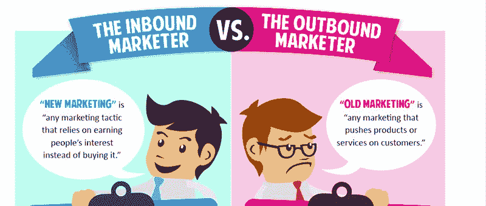
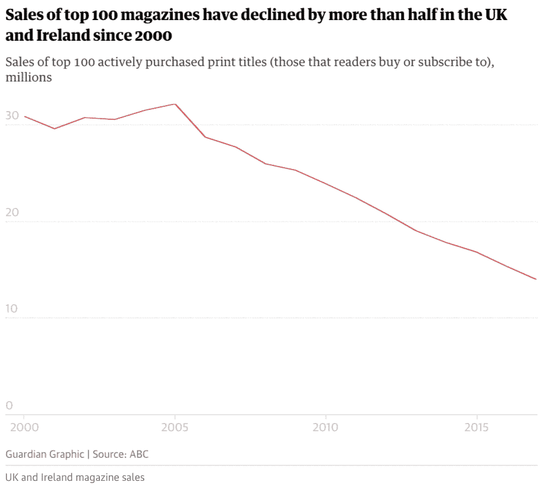
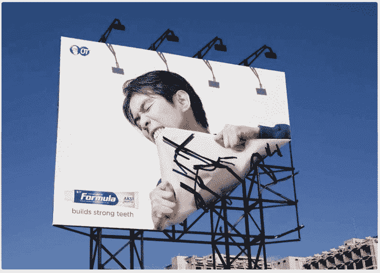
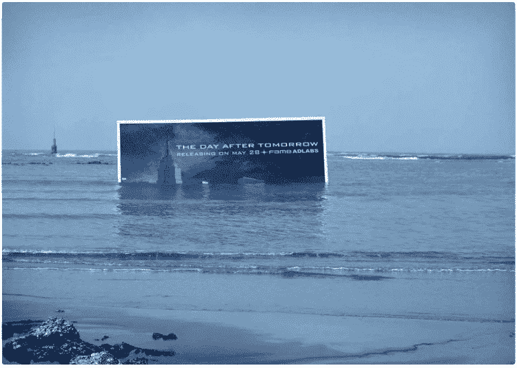

# 什么是外向营销？(以及为什么你不应该忽视它)

> 原文:[https://kinsta.com/blog/outbound-marketing/](https://kinsta.com/blog/outbound-marketing/)

外向营销是关于接触潜在客户。

这是人们听到“营销”这个词时的想法——陌生电话、广告牌、电视广告、广播广告、传单等。听起来有点过时，不是吗？

但是这些都是让潜在客户了解你的产品的方法……而且很有效！

然而，出站营销正在失宠，尤其是在网上营销圈。

但是这种对它的否定是正当的吗？

 <kinsta-auto-toc heading="Table of Contents" exclude="last" list-style="arrow" selector="h2" count-number="-1">## 内向营销与外向营销

直到最近，在人类历史上，外向营销几乎是营销你的产品的唯一方式。

想想传统市场。商人不能只是坐在那里等着顾客来找他们。为了销售，他们不得不兜售他们的商品。此外，他们需要比竞争对手更响亮、更有侵略性，以吸引人们的注意力。

<link rel="stylesheet" href="https://kinsta.com/wp-content/themes/kinsta/dist/components/ctas/cta-mini.css?ver=2e932b8aba3918bfb818">

大众媒体的发明，如报纸、广播和电视，仅仅意味着不再是商人在市场上争夺顾客，而是公司通过广告在媒体上争夺顾客。

但是后来互联网改变了一切。突然之间，消费者可以很容易地在任何主题上自学，比较各种报价，并研究他们的购买。他们不必再盲目依赖公司提供的信息。

这就是集客营销的由来。当所有这些潜在客户已经在寻找你卖的任何东西时，[以一种让他们容易找到你的产品的方式来定位你的业务](https://kinsta.com/blog/features-vs-benefits/)是有意义的。现在你可以让顾客来找你，而不是你去找他们。

### 集客营销

[集客营销](https://kinsta.com/blog/inbound-marketing/)是吸引那些知道自己有问题并积极寻找解决方案的潜在客户。

它包括搜索引擎优化、建立博客、T2、建立电子邮件列表、在会议上发言以及在你的领域树立思想领袖的地位。

集客营销的主要优势是成本更低。[内向销售线索的平均成本比外向销售线索低 61%。](https://www.invespcro.com/blog/how-effective-is-inbound-marketing/)这并不奇怪。说服那些已经对你的提议感兴趣的人更容易。

然而，重要的是要明白，尽管集客营销更便宜，**但它不是免费的**。你要么是 T2 自己制作内容，这需要时间，要么是 T4 雇人为你制作，这需要钱。

集客营销也需要大量的前期工作，可能需要一段时间才能看到显著的效果(如果你是从零开始，至少需要 1-2 年的持续努力)。

此外，正如营销顾问 Mark Schaefer [在几年前的一篇文章中建议的那样，由于免费内容的激增，内容营销从长远来看可能不是一种可持续的战略。](https://businessesgrow.com/2014/01/06/content-shock/)

他认为，由于惊人的内容数量，获得(并保持)人们的注意力变得越来越难，这意味着制作内容将会有一个负 ROI 的时刻。

当然，我们还没有到那一步，但这仍是值得考虑的事情。

### 外向营销

外向营销是指接触潜在客户，他们可能意识到自己有问题，但并不积极寻找解决方案。

发传单、购买报纸、杂志和电视广告以及在广告牌上做广告等方法经常被批评为昂贵、撒网太广以及缺乏确定投资回报率的方法。

此外，陌生电话和陌生电子邮件也会招致恶名，因为它们被视为“无聊”和侵扰性的。谁想解决这个问题？

然而，尽管有这些缺陷，但如果做得好，外向营销可以非常有效，它还可以让你立即看到你努力的结果，而不是等待几周，几个月甚至几年。

你提出了你的提议。人们要么买，要么不买。

不管怎样，你会得到市场的即时反应，然后可以做出相应的调整(这在你还没有验证产品的时候尤其有价值)。

然而，外向营销比内向营销更昂贵，因为你不是有机地获得流量，而是购买流量。

这也更具破坏性。没有人喜欢主动推销。陌生电话、陌生邮件和广告真的很烦人，尤其是当你对产品不感兴趣的时候。

这就是为什么确保你的提议与你要联系的人相关是如此重要。

## 对外营销(词汇表):

当一家公司试图通过一般媒体广告(如电视广告、广告牌、报纸)或通过直接和亲自接触(如会议、电话推销和电子邮件推销)来接触消费者时，就会出现外向营销。

最有效的对外营销策略是:

1.  冰冷的电子邮件和冰冷的电话
2.  搜索广告
3.  贸易展览

Support
 <kinsta-advanced-cta language="en_US" type-int-post="48306" type-int-position="4">## 外向营销 vs 内向营销:哪个更受欢迎？

根据 Hubspot[State of Inbound 2018](https://cdn2.hubspot.net/hubfs/3476323/State%20of%20Inbound%202018%20Global%20Results.pdf)报告，世界各地的公司都更喜欢集客营销。

Inbound Marketing adoption worldwide

有道理。

如果做得好，集客营销会非常强大。像 Buffer 这样的公司取得了巨大的成功。难怪其他人也想分一杯羹呢？

我是集客营销的超级粉丝。然而，关于集客营销和外呼营销的对话往往对后者有偏见。

似乎有相当多的人将集客营销视为终极目标，而将出站营销视为属于历史垃圾箱的遗迹。但这是为什么呢？

## 外向营销:为什么名声这么差？

问题是，关于集客营销和外呼营销的讨论似乎变得有些意识形态化了。

这里有一个图表，很好地概括了人们对这个问题的普遍态度:

Outbound Marketing vs Inbound Marketing

集客营销以新颖时尚的方式出现，强调“赢得人们的兴趣”

另一方面，对外营销显得陈旧过时，强调“向顾客推销产品或服务”

这似乎暗示着主动向潜在客户提供报价是错误的。这里不仅仅是关于有效性，也是关于道德的。

所以我们直说吧。只要产品做了你承诺它会做的事，用外向营销推广产品绝对没有错。

还有，我们不要忘了这里重要的一点:**营销策略应该根据它们产生的结果来判断**，出站营销方法可以很好地发挥作用。

所以，不要因为它们不时尚就不重视它们。你应该做对你的生意最有利的事情。

## 利用外向营销发展业务的 5 种方法

好了，现在你已经了解了外向营销的优势和劣势，你可能想知道如何利用它来发展你的业务。
<kinsta-advanced-cta language="en_US" type-int-post="48306" type-int-position="5"></kinsta-advanced-cta>

### 排名第一的冰冷邮件

冷邮件是指未经请求发送给一个你以前没有交往过的人的邮件。

[在](https://kinsta.com/blog/email-marketing-best-practices/) [SaaS 初创企业](https://kinsta.com/blog/saas-marketing/)的早期，通过电子邮件联系潜在客户可能是一种有效的客户获取策略。

例如，LeadFuze 的创始人 Justin McGill，[在 12 个月内](https://www.effectivefounder.com/podcast/justin-mcgill-leadfuze-interview/)使用冰冷的电子邮件获得了 3 万美元的 MRR(每月经常性收入)。

具体流程如下:

1.  找到并接触你的目标客户。
2.  制定个性化的推广计划(不是典型的营销信息)。
3.  后续行动

他使用自己的产品来查找潜在客户的电子邮件地址，这使它变得更容易，但没有它也可以做到，所需要的只是研究。

贾斯汀是如何制作第一封电子邮件的？他应用了 QVC 公式:

*   问题。“试着用一个与他们的业务相关的问题作为开场白。”

*   价值主张。“不要喋喋不休地说你的服务有多好，你能提供什么，试着传达核心信息，突出你的独特之处。”

*   结束行动号召(CTA)。直接问他们是否能在接下来的几天内发言，或者给他们一些寻求答案的收尾问题，以便得到一些回应。

下面是一封遵循 QVC 公式的电子邮件的例子:

 ## 注册订阅时事通讯

### 想知道我们是怎么让流量增长超过 1000%的吗？

加入 20，000 多名获得我们每周时事通讯和内部消息的人的行列吧！

[Subscribe Now](#newsletter)

The “QVC” email formula

他还为收件人提供了一个选项，通过在底部添加这一行来选择退出任何后续活动:

附注:如果你不是谈论此事的合适人选，请告诉我。此外，如果你不希望我跟踪你，你也可以让我知道这一点！”

保持邮件简短非常重要。*“一般来说，我推荐三到四句话(最多五句)”*贾斯汀说。

在最初的电子邮件之后，他继续提供价值。他建议发送一份关于你的一个客户及其结果的案例研究。

Justin 说他们看到了这一系列电子邮件的巨大成功:

1.  QVC 电子邮件
2.  个案研究
3.  增值(最近的博客文章链接、相关新闻文章、另一个案例研究等)
4.  分手邮件(让他们知道你不会再跟进)

他指出，你可以通过使用像[reply fy](https://replyify.com/)、 [Outreach](https://www.outreach.io/) 和 [Quickmail](https://quickmail.io/) 这样的工具来自动化很多事情。或者，如果你是 Gmail 的铁杆粉丝，你可以尝试一下 [Streak](https://www.streak.com/) ，这将帮助你自动跟踪你的所有对话(顺便说一句，这是我首选的外联工具)。

如果你得到了积极的回应，该怎么办？麦克吉尔继续说道:

> 然而，这里的关键是不要草率行事，在你的后续邮件中努力将它们转化为销售。理想情况下，一旦他们表示有兴趣增加您达成交易的机会，您就需要与他们通电话。*当他们有兴趣与你交谈时，强化价值主张，并给他们一个明确的行动号召，以预约时间。”贾斯汀解释道。他推荐使用[日历](https://calendly.com/)进行日程安排。*

冰冷的电子邮件可能是获得初始客户最直接的方式，因为你直接接触你的目标受众，并向他们展示你的产品。

不要因为没有回应而气馁。Justin 说只有 1%-10%的人会对你感兴趣。这是一个数字游戏，所以你需要发送大量冷冰冰的电子邮件才能得到结果。

### #2 陌生电话

陌生来电是指主动打给一个你以前没有接触过的人。

由于害怕被拒绝，人们倾向于避免陌生来电。当你向某人提出一个提议，而他们说“不”时，你会感到刺痛。此外，任何销售人员都会告诉你，礼貌的“不”远不是你能得到的最糟糕的答案，没有人想被电话另一端的陌生人斥责。所以根本不打电话是很诱人的。

但这可能是一个错误。如果方法得当，电话推销可能是一种有效的销售方法。但是你怎么才能做对呢？

Chris Orlob 和 the Gong.io [使用人工智能分析了超过 90，000 个陌生来电](https://blog.insidesales.com/cold-calling/anatomy-successful-cold-calling/)。他们发现了什么？

*   使用这五个技巧来创造一个好的开头:说出潜在客户的名字:“嗨，约翰！”)、说出你的全名(*“我叫克里斯·奥尔洛布”*)、说出你的公司名称(*“我为 Gong.io 工作”*)、使用模式中断法加上一句*“你最近怎么样？”问题，*并陈述您打电话的原因(*“John，我打电话的原因是……”*)。

*   尽量减少发现问题。不要试图在销售电话中收集潜在客户的信息。请记住，这次通话的目的是安排一次会面，仅此而已。

*   尽量把你的推销时间保持在 37 秒左右。显然，在一次普通的电话推销中，推销的时间只有 25 秒，但在成功的电话推销中，时间达到了 37 秒。

Chris 还提供了一些建议，告诉你如何确保潜在客户在约定的时间出现，如果你设法与他们会面的话。

他建议把会议安排在下午，并保持在一个小时以内。

厌倦了体验你的 WordPress 网站的问题？通过 Kinsta 获得最好、最快的主机支持！[查看我们的计划](https://kinsta.com/plans/?in-article-cta)

克里斯指出，最好的销售人员更像象棋大师，而不是即兴喜剧演员。他们提前想好事情，以便为每个电话做好准备。他们遵循一种他们知道对自己有效的特定结构。他们很难出其不意，因为他们预料到可能会出什么差错。

如果您想获得关于他们调查结果的更深入的报告，请观看 Chris 在电话推销中的演讲:

<kinsta-video src="https://www.youtube.com/watch?v=WpuAkOR8fAw"></kinsta-video>

### #3 传单

每个不幸在街上散发传单的人都知道，一般来说，人们对它们不感兴趣。

我们都曾站在这种互动的另一边。你正忙着自己的事情，突然一个陌生人塞给你一张纸。

现在，你是一个有礼貌的人，不想冒犯他们，所以你等到你转过街角，才把传单放进垃圾桶。

这可能会让你对传单产生怀疑。这是真的，在街上把它们随便分发给一些人并不是对你的资源的最好利用。

然而，他们可能会在你的目标受众经常出没的地方工作，例如，如果你是一家科技初创公司，你可以尝试在科技会议上分发传单。

请记住，传单必须提供价值。例如，您可以提供访问独家内容、免费一个月、25%的折扣等。给他们一个理由*不*把它扔进垃圾桶。

### #4 印刷广告

你可能已经听说印刷媒体正在慢慢死去，但却是必然的死亡。是真的。人们不再像以前那样买那么多报纸和杂志了。

事实上，据《卫报》报道，自 2000 年以来，前 100 名杂志的销量已经下降了一半以上。

Sales of newspaper in the UK and Ireland

然而，根据同一篇文章，*“小众出版物抓住了读者群，因为普通出版物屈服于数字媒体的冲击”*。这对你意味着什么？

这意味着，如果你在目标受众喜欢的利基出版物上购买版面，平面广告仍然是接触潜在客户的有效方式。

所以，举个例子，如果你卖渔具，不要在一般杂志上做广告。即使是男性杂志也可能过于普通。找一份专门迎合钓鱼爱好者的出版物。这样你会得到最大的回报。

当然，你不能只是扔在一起一个无聊的广告，并期待伟大的结果，你需要有创意，如果你想抓住读者的注意力。

你甚至可以让你的印刷广告更具互动性。

例如，我们都在杂志上看到过数不清的汽车广告，现在我们大多数人只是简单地浏览一下，甚至没有登记汽车的品牌，更不用说其他细节了。

但是看看这个标致的广告:

<kinsta-video src="https://www.youtube.com/watch?time_continue=75&amp;v=Ko-N8O6j6p4"></kinsta-video>

是的，他们在平面广告里放了一个安全气囊，真的。这是一个你会记得的广告，对吗？

现在，你不必像标致那样疯狂，但你需要确保你的广告在读者之前看过的无数广告中脱颖而出。需要灵感？

查看 Hubspot 的 [*【可以补充数字活动的 15 个聪明的互动平面广告例子】*](https://blog.hubspot.com/marketing/interactive-print-ads) 。

有一种方法来跟踪广告的投资回报率也是一个好主意。你看，当有人点击，比如说，一个脸书的广告，分析会告诉你他们来自哪里。但是你不能从平面广告中得到这些，所以很难知道他们的效果如何。那么你能做什么呢？

简单。提供一个特别的优惠，让你可以追踪广告带来的销售额。例如，你可以有读者需要剪下的实体优惠券，或者他们需要在结账时输入的优惠券代码，甚至是给那些在柜台展示广告照片的人的折扣。看看什么最适合你的目标受众。不要瞎飞！

### #5 广告牌广告

广告牌上的广告似乎太过时了。谁还会这么做呢？实际上，很多公司。

然而，有效地做到这一点比平面广告需要更多的创造力，因为人们要么在散步、做白日梦，要么开车飞驰而过，这意味着你需要抓住他们的注意力，并保持足够长的时间来传达你的信息。

Canva 发表了一篇名为*【50 个会让你停下脚步的精彩广告牌广告(以及你能从它们身上学到什么)】*的文章，其中他们展示了一些精彩的广告牌广告。

例如，人们不得不承认，奥美&马瑟·雅加达的牙齿护理配方广告是很难错过的。对于这样一个平凡的产品来说，这是一个很酷的广告，对吗？

“Bite” by Ogilvy & Mather Jakarta

或者，看看 Fame Adlabs 如何在水下广告牌上为灾难电影*《后天》*做广告。它有那种启示的感觉，不是吗？

“Day After Tomorrow” campaign by Fame Adlabs

这是 Ubi Bene 为宜家设计的广告牌广告。你看着它…然后你说“等等，什么？”

Ubi Bene for Ikea

所有这些广告有什么共同点？

它们作为一种模式中断，立即抓住你的注意力。你必须是一个相当心不在焉的人，走过或开车经过这些广告牌而没有注意到它们。一旦你看到这些广告，你不会马上忘记它们。也许你甚至会告诉你的朋友。

这就是你应该瞄准广告牌广告。让人们注意到，让人们记住，让人们谈论。

[Outbound marketing is a whole different ball game than inbound marketing. ⚾️ Here's why you shouldn't ignore it.Click to Tweet](https://twitter.com/intent/tweet?url=https%3A%2F%2Fkinsta.com%2Fblog%2Foutbound-marketing%2F&via=kinsta&text=Outbound+marketing+is+a+whole+different+ball+game+than+inbound+marketing.+%E2%9A%BE%EF%B8%8F+Here%27s+why+you+shouldn%27t+ignore+it.&hashtags=outbound%2Cmarketing)

## 摘要

不要被“外向营销已经过时”的说法所迷惑。那只是胡说八道。营销应该以它得到的结果来衡量，而不是以你的偏见来衡量。毫无疑问，如果做得恰当，并针对正确的客户类型，外向营销方法可以非常有效，并带来巨大的成果。

当然，所有属于外向营销方法的策略并不适用于所有类型的业务。最重要的是，公平地说，并不是所有的企业都想在对外宣传或任何营销活动中投入大量预算。

集客营销被证明是一种更具成本效益的营销和发展业务的方法，然而[需要时间才能看到切实的成果](https://kinsta.com/blog/bootstrapping-startup/)。另一方面，外向营销需要更大的预算，但它能让你几乎立即获得反馈，并在更短的时间内抓住客户的注意力。

这可能足以完成交易。

* * *

让你所有的[应用程序](https://kinsta.com/application-hosting/)、[数据库](https://kinsta.com/database-hosting/)和 [WordPress 网站](https://kinsta.com/wordpress-hosting/)在线并在一个屋檐下。我们功能丰富的高性能云平台包括:

*   在 MyKinsta 仪表盘中轻松设置和管理
*   24/7 专家支持
*   最好的谷歌云平台硬件和网络，由 Kubernetes 提供最大的可扩展性
*   面向速度和安全性的企业级 Cloudflare 集成
*   全球受众覆盖全球多达 35 个数据中心和 275 多个 pop

在第一个月使用托管的[应用程序或托管](https://kinsta.com/application-hosting/)的[数据库，您可以享受 20 美元的优惠，亲自测试一下。探索我们的](https://kinsta.com/database-hosting/)[计划](https://kinsta.com/plans/)或[与销售人员交谈](https://kinsta.com/contact-us/)以找到最适合您的方式。</kinsta-advanced-cta></kinsta-auto-toc>