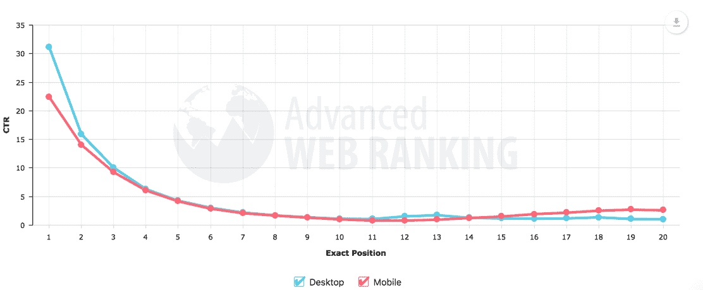
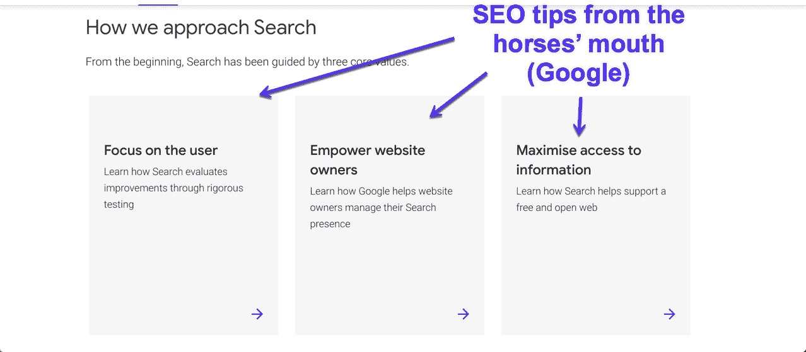
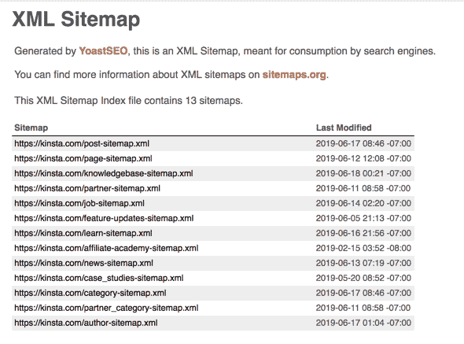
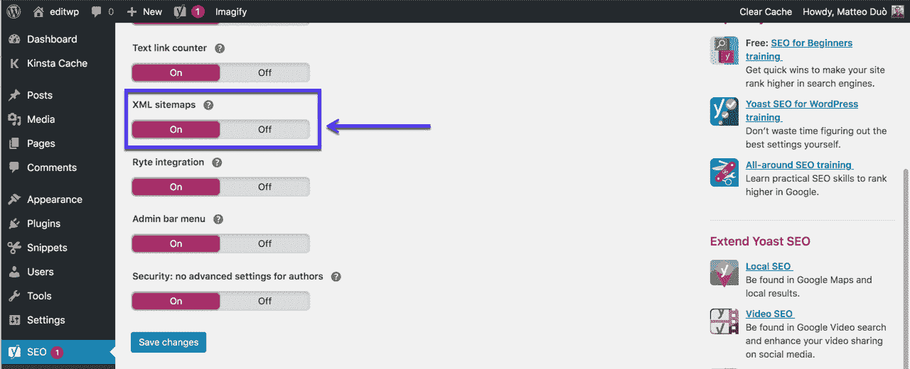
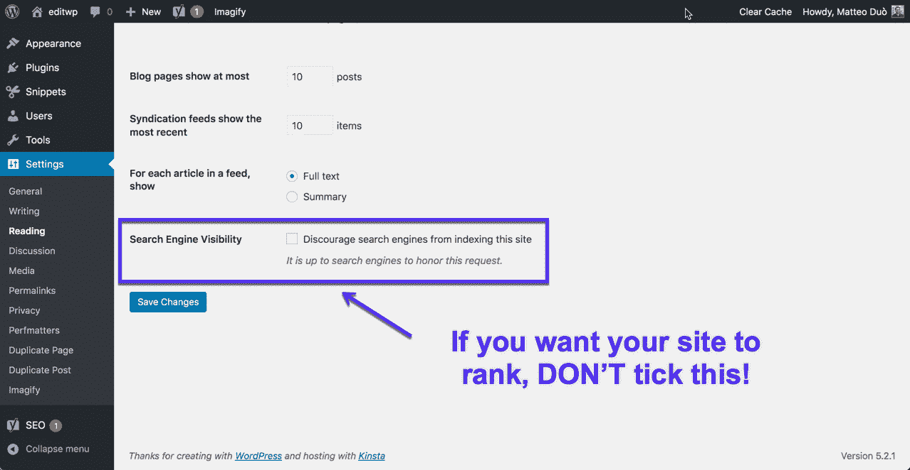
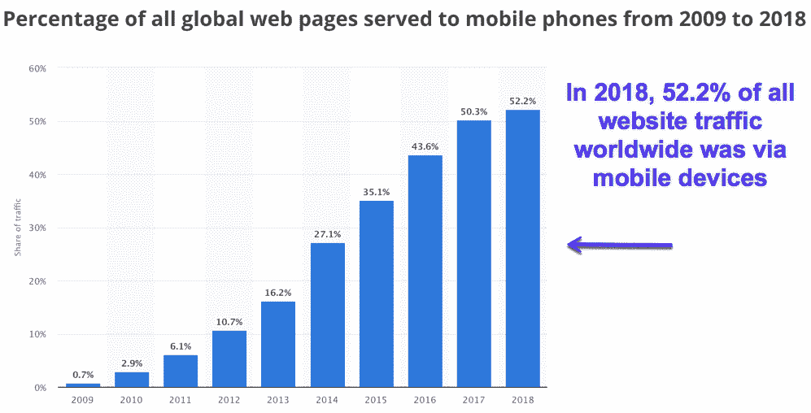
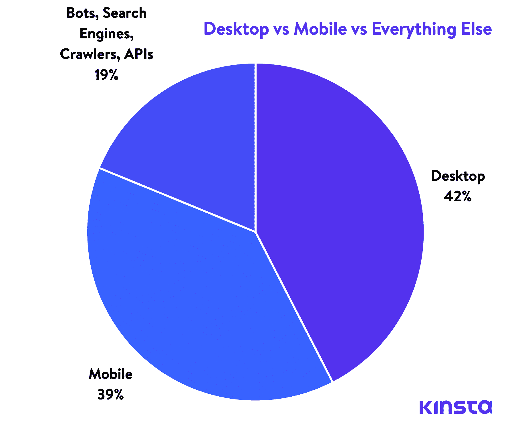
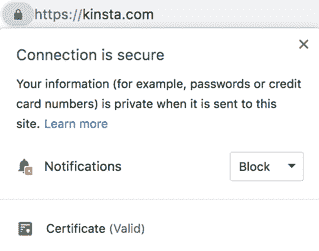
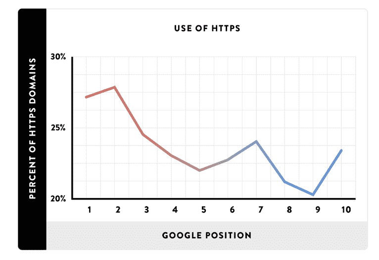
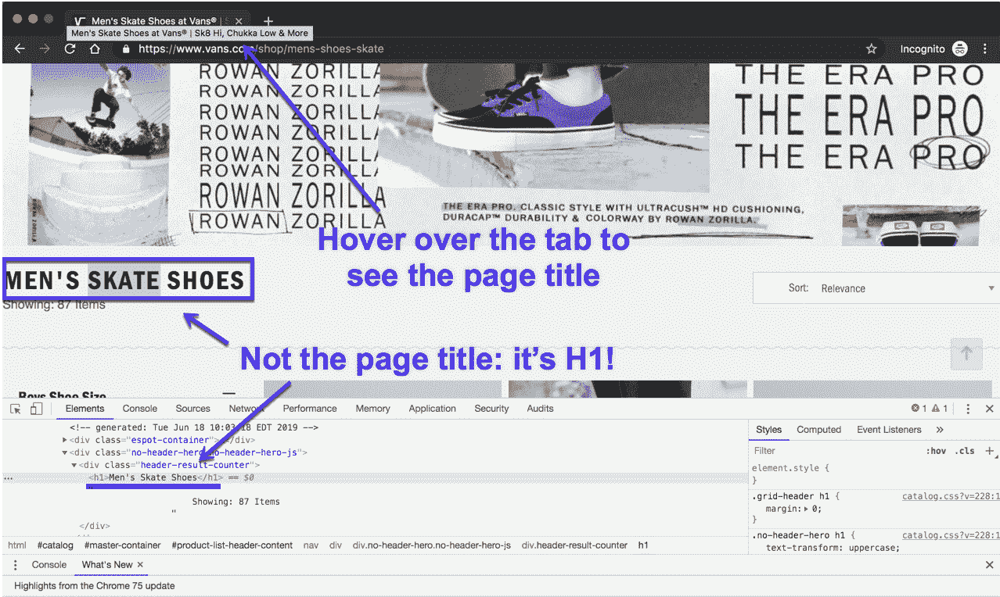

# SEO 代表什么？(+ 7 网站排名初学者技巧)

> 原文:[https://kinsta.com/blog/what-does-seo-stand-for/](https://kinsta.com/blog/what-does-seo-stand-for/)

所以[你听说过 SEO](https://kinsta.com/?s=seo) ，但是你不确定它到底是什么意思。或者也许你不确定它如何能帮助你实现目标。

搜索引擎优化是任何网站的主要营销任务。

如果你是新手，这可能会让人望而生畏。为了从 SEO 中获得最大收益，理解它是什么、它如何工作以及它为什么能帮助你是很重要的。

所以……

 ## “SEO”代表什么？

SEO 代表搜索引擎优化。

这是一个激烈辩论的话题，网上有很多关于它的内容:

SEO in SERPs

让我们更详细地探讨一下:

### 什么是 SEO？

SEO 是改进你的网站，使其在搜索引擎的搜索结果中排名靠前的过程。通常人们关注的是出现在谷歌，但也有必应。

这一切都是为了让用户访问你的网站，而不直接支付广告费用。哦，这是一个非常喜欢缩写词的市场营销学科:

*   SERP–搜索引擎结果页面
*   CTR–点击率
*   CTA–行动号召
*   CRO–转化率优化
*   user 用户体验

## “SEO”的简单含义是:

**SEO** 是搜索引擎优化的简称。它指的是一套战略和战术，侧重于推动更多的流量从搜索引擎到您的网页，以及改善，帮助您的网站在搜索引擎结果页排名更高。

Support

## 为什么你应该关心搜索引擎优化(提示:免费的网站流量)

研究[显示](https://www.advancedwebranking.com/ctrstudy/)谷歌首页的网站获得了大部分点击。谷歌网站的点击率随着排名越靠后而稳步下降。

CTR study

如果你的 SEO 做得好(我们马上就会看到)，你的有机流量会随着时间的推移而增加，而付费广告需要持续的资金。

考虑到搜索引擎驱动了 93%的网站流量，这对你的网站来说是很大的潜在访问量。

谷歌每天都变得越来越聪明和先进。但是它仍然需要一些帮助。

理解 SEO 和优化你的网站将帮助你给搜索引擎提供他们需要的信息，这样你就能得到你想要的结果。

[SEO drives 93% of all website traffic! But what does #SEO stand for? Where should you start to optimize and rank your site faster? Get our in-depth guide with actionable tips! 📈Click to Tweet](https://twitter.com/intent/tweet?url=https%3A%2F%2Fkinsta.com%2Fblog%2Fwhat-does-seo-stand-for%2F&via=kinsta&text=SEO+drives+93%25+of+all+website+traffic%21+But+what+does+%23SEO+stand+for%3F+Where+should+you+start+to+optimize+and+rank+your+site+faster%3F+Get+our+in-depth+guide+with+actionable+tips%21+%F0%9F%93%88&hashtags=seo%2Cwordpress)

### 有什么条件？

[SEO 总是在变](https://kinsta.com/blog/google-patents-seo-ranking-factors/)。

随着搜索引擎变得越来越先进和算法的改变，一些策略停止工作，新的出现。

但有一点是肯定的:SEO 是长期流量的最佳来源之一。这可能是一项艰苦的工作，你可能不会在一夜之间看到多少收益，但这是一项投资。

**SEO 是马拉松，不是短跑**。一些前期的工作可以在以后的有机交通中得到回报。

SEO improvement graph

虽然付费广告、社交媒体和其他付费渠道可以让你的网站立即获得流量，但如果你停止付费，流量也会停止。另一方面，SEO 可以成为持续的流量来源。
T3】

## 搜索引擎基础(以及如何看待 SEO)

搜索引擎被设计来寻找信息和提供答案。

当谈到如何进行搜索时，谷歌会查看数百万网页，为用户提供最相关的信息。

SEO tips from Google

### 如何看待 SEO

众所周知，谷歌希望为用户的查询提供最佳答案，在解决 SEO 问题时，我们可以记住三条规则:

*   规则 1:谷歌是用来回答人们的问题的。
*   规则 2:谷歌知道的比我们和 SEO 专家都多。
*   规则 3:谷歌想要答案，而不是排名技巧。

那么你需要做些什么来获得你的排名网站呢？

回答问题比网上任何人都好。尽量不要把事情复杂化。不要试图用经常是短期的策略来欺骗谷歌。

看，搜索引擎优化很简单。:)

## 7 SEO 初学者基础

希望你现在开始看到 SEO 并没有那么复杂。

事实上，这很简单。至少最基本的是。

掌握一些 SEO 基础知识会对你网站的排名产生很大的影响。毕竟，大多数运营网站的人都不是 SEO 专家。

只要做对几件事，你就能在短时间内让谷歌给你带来流量。

听起来不错吧？我们走吧。

### 1.使用搜索引擎友好的内容管理系统(如 WordPress)

首先，如果你的网站不能被谷歌抓取，它就不会被索引，也不会排名。

这到底是什么意思？

谷歌使用自动爬虫(或机器人)来查找网站，索引内容，并对它们进行排名。因此，如果这些爬虫无法访问您的网站，您的网站将无法进入索引。

如果你的网站没有被索引，这意味着谷歌不会对你的网站进行排名。如果你想让谷歌抓取和索引你的网站(为什么你不想)，有几件事你需要从一开始就设置好。

进入:**技术 SEO** 。

不要被这个吓倒。技术性搜索引擎优化就是确保你的[网站正确加载](https://kinsta.com/learn/page-speed/)并且对谷歌可见。技术需求确实在变化，但是保持你的网站对谷歌爬虫的可访问性的需求将会一直存在。

使用 WordPress 作为你的 [CMS](https://kinsta.com/knowledgebase/content-management-system/) 就像给你自己一个创建搜索引擎友好网站的开端。有几个 [SEO 插件](https://kinsta.com/blog/best-seo-plugins-for-wordpress/)可以帮你完成繁重的工作，所以你不需要担心会破坏任何东西。

这里有一些你可以在 WordPress 中做的重要的事情来帮助你的网站被抓取和索引:

#### 创建 XML 站点地图

XML 站点地图是一个列出你网站上所有页面的文件，看起来像这样:

XML Sitemap

你的网站地图通常位于 yourdomain.com/sitemap.xml.

如果你使用的是 Yoast 这样的插件(就像上面的例子)，创建一个站点地图是很简单的。

[安装 Yoast SEO 插件](https://kinsta.com/blog/yoast-seo/)。转到**常规**，然后在顶部的选项卡中选择**功能**。从这里，您将能够打开 XML 站点地图并保存更改。

XML sitemaps in Yoast plugin

现在你只需要将这个网站地图提交给[谷歌搜索控制台](https://kinsta.com/blog/google-search-console/)。如果你还没有建立和验证它，[这个指南](https://kinsta.com/blog/google-site-verification/)告诉你怎么做。

#### 生成 Robots.txt 文件

Robots.txt 是一个文本文件，它告诉搜索引擎在你的网站中可以去哪里，不可以去哪里。它看起来会像这样:

Robots.txt file example

就像 sitemap 一样，Yoast 插件可以为您生成一个 robots.txt 文件。

在 Yoast 插件中，进入**工具** > **文件**编辑器，你会看到一个按钮“创建一个 robots.txt 文件”

虽然只是一个简单的文本文件，但如果设置不正确，会严重影响网站的索引。因此，这份指南值得一读。

#### 取消勾选“阻止搜索引擎”设置

这是一个简单的方法，但是会对你的搜索引擎优化工作产生负面影响。这只是一个简单的勾选框，阻止搜索引擎索引你的网站。

这通常在一个网站处于开发阶段时使用，以防止它在完成之前出现在 Google 中。要找到这个，进入**设置** > **阅读**，向下滚动你会看到:

WordPress indexing settings

### 2.确保你的网站可以在移动设备上运行(也就是响应式设计)

早在 2016 年 11 月，谷歌宣布了其[移动优先指数](https://kinsta.com/blog/google-mobile-first-index/)。这基本上意味着谷歌会先看看你的网站在移动设备上的表现，然后再对其进行索引和排名。

 ## 注册订阅时事通讯

### 想知道我们是怎么让流量增长超过 1000%的吗？

加入 20，000 多名获得我们每周时事通讯和内部消息的人的行列吧！

[Subscribe Now](#newsletter)

很难想象没有智能手机的人比有智能手机的人更难。因此，当得知超过 51%的手机用户在手机上搜索时发现了一家新公司或新产品时，应该不会感到惊讶。

根据[这项研究](https://www.statista.com/statistics/241462/global-mobile-phone-website-traffic-share/)，2018 年全球所有网站流量的 52.2%是通过手机产生的:

Mobile traffic 2018 (Image source: Statista.com)

自 2009 年以来，这一数字也逐年稳步上升。更重要的是，根据谷歌的数据，手机上的查询比桌面上多了 278 亿次。
还需要说服吗？以下是你需要一个在手机上运行的[网站的更多原因:](https://kinsta.com/blog/wordpress-mobile-plugin/)

*   网站可用性——你希望人们能够在你的网站上走动。谷歌也是如此。[响应式网页设计](https://kinsta.com/blog/responsive-web-design/)让人们可以方便地四处走动，从而改善用户体验，享受更多的现场时间。这也是[网页设计最佳实践](https://kinsta.com/blog/web-design-best-practices/)之一。
*   页面速度——你希望你的网站[加载得更快](https://kinsta.com/learn/speed-up-wordpress/)(稍后会详细介绍)。
*   跳出率(Bounce rate)——人们离开你的网站的速度有多快，因为它在手机上不能正常工作？这不是你想让你的用户(或谷歌)看到的。

#### WordPress 网站的流量比较:桌面、移动和其他

毫无疑问，移动需要成为你的重中之重。但是你真正需要关注和磨练的是你的客户如何参与你的网站(阅读:他们如何购买和订阅)。在我们对 WordPress 网站的 130 亿个日志条目的[研究中，我们发现:](https://kinsta.com/blog/analyzing-log-entries/)

*   33.95 亿次请求来自桌面
*   31 亿次请求来自移动设备
*   15 亿次请求来自 API 调用、搜索引擎、爬虫、机器人等等。

Desktop vs Mobile vs Everything Else (click to view larger)

你应该从中吸取什么教训？

查看[谷歌分析](https://kinsta.com/blog/how-to-use-google-analytics/)中的数据，检查你的重要目标到底在哪里实现了。不要忽视你的用户，仅仅让你的 SEO 依赖于你在一些博客上看到的新闻，说 SEO 流量现在都是关于移动的。
T3】

### 3.获取 SSL 证书

[SSL(安全套接字层)证书](https://kinsta.com/help/how-to-install-ssl-certificate/)是安装在网络服务器上的小文件，作为网站的安全措施。

安装完成后，它们会将你的 [HTTP 切换到 HTTPS](https://kinsta.com/blog/http-to-https/) ，并激活浏览器中的挂锁符号:

SSL in Chrome

这是对 SSL 如何工作的非常简单的概述。对于 SEO 来说，重要的是要知道，拥有一个安全的站点实际上是一个排名因素。

事实上，[研究](https://backlinko.com/search-engine-ranking)已经显示出 HTTPS 和更高排名之间的积极联系:

Use of HTTPS (Image source: Backlinko.com)

Google 和其他各种主流浏览器已经透露，他们将不再支持 TLS 1.0 和 TLS 1.1。具体来说，它们将显示 [ERR_SSL_OBSOLETE_VERSION 警告通知](https://kinsta.com/knowledgebase/err_ssl_obsolete_version/),指示“不安全”的连接。

### 4.确保你有快速可靠的主机

选择正确的(见[)快速可靠的](https://kinsta.com/blog/wordpress-performance-benchmarks/))虚拟主机对你的 SEO 有很大的影响。

你去过需要很长时间才能加载的网站吗？老实说，你是等着还是离开了？

你的网站的加载时间是一个重要的排名因素，因为没有人想永远等待加载一个网页。很有可能，如果你发现自己处于这种情况，你会点击后退按钮，去别的地方。

谷歌知道人们会这样做。

主机在页面加载速度中扮演着重要的角色。如果你真的关心 SEO 的话，你需要选择一个速度快的主机。

厌倦了 WordPress 的问题和缓慢的主机？我们提供世界一流的支持，由 WordPress 专家提供 24/7 服务和超快的服务器。[查看我们的计划](https://kinsta.com/plans/?in-article-cta)

选择托管时，有几个因素需要考虑。比如:正常运行时间(以及[最小化停机时间](https://kinsta.com/blog/website-downtime/))、响应支持、安全性和[备份](https://kinsta.com/help/wordpress-backups/)。所有这些都是对你的网站 SEO 健康的重要考虑。

总之:选择一台[持续良好](https://kinsta.com/blog/wordpress-performance-benchmarks/)的主机。

### 5.从其他(相关)网站获取链接

链接(或反向链接)是从一个站点指向另一个站点的 HTML 超链接。这些都是 SEO 的重要因素。

研究表明，具有更多(或更好)反向链接的页面往往比反向链接较少的页面排名更高:

Backlinks and SEO (Image source: Backlinko.com)

搜索引擎使用链接:

*   寻找新的网页。
*   以帮助决定页面应该如何排名。

搜索引擎使用这些链接来抓取网页。他们会抓取你网站上指向其他网页的链接(内部链接),也会抓取指向其他网站的链接(反向链接)。

把这些看作是来自其他网站的信任票。但并不是所有的环节都是平等的。最好有几个与你的网站相关的好网站的链接，而不是仅仅为了链接而有大量的垃圾和不相关的链接。

链接建设是 SEO 中的一个大话题。为了不跑题，这里有一些你可以做的链接建设策略:

*   客座博客——找到你所在行业的网站，为它们写一篇文章，并链接回你的网站。
*   [断开的链接构建](https://kinsta.com/blog/broken-links/) —找到有 404 个页面的页面，让网站管理员知道并请求他们指向你的站点(如果你替换的链接/页面与断开的内容匹配)。
*   未链接的提及——找到人们在网上谈论你但没有链接到你的地方，只需请求一个链接。
*   从你的竞争对手那里窃取——找到你的竞争对手拥有的链接……并窃取它们。
*   内容再利用——将博文转换成视频，反之亦然。

显然，有更多的方法来建立链接。你可以从 Ahref 的这本指南中得到一些启发[。](https://ahrefs.com/blog/link-building/)

### 6.写人们想看的内容

你不能谈论任何与 SEO 相关的事情而不触及高质量内容的重要性。

“内容为王”这句话被说得老掉牙了，但要点很重要:**好的内容很重要**。

这里也没有秘方，好的内容只是人们想看的内容。当然，有一些[内容营销要点](https://kinsta.com/learn/content-marketing/)需要牢记在心，比如预算、工具和推广，但是你不能回避人们想要阅读的内容。

当然，事情不仅仅如此。

是的，一旦你知道该写什么(感谢做一些传统的关键字研究)，你可以做一些事情来改善搜索引擎优化的内容:

*   提高可读性——大多数人浏览网页内容，所以一定要用副标题和要点来分隔你的内容，以确保人们不会被一大堆文字吓跑。
*   [使用图片](https://kinsta.com/blog/visual-content-strategy/) —同样，使用截图、gif 和图片等视觉材料来增强你的内容。
*   更深入——更长的内容可能不总是正确的选择，但当涉及到[内容长度](https://kinsta.com/blog/content-length/)时，更长的文章通常更有深度，因此排名会更高。
*   使用事实——如果你在陈述一个事实或使用一个统计数据来说明一个观点，链接到一个支持它的研究。
*   不要忘记特色片段——只要对你的内容做一些调整，如果你[进入特色片段](https://kinsta.com/blog/featured-snippets/)，你就可以获得流量的提升。

创作[常青内容](https://kinsta.com/blog/evergreen-content/)好。但是如果你不能优化它，你可能会把有价值的排名留在桌面上。

### 7.优化你的页面(有机流量)

仅仅在你的网站上有内容是不够的。你需要对它进行优化，以在谷歌中显示你想要的关键词。

每个页面都应该有一个“焦点关键词”来优化。这并不意味着它只能排名，事实上，一个页面可以排名许多条款。但是为了简单起见，您希望围绕一个关键字来构建页面优化。

让我们看看优化的几个关键要素:

#### Title Tags

标题标签是谷歌了解你的页面内容的主要方式之一。你要确保你要排名的主要关键字在 title 标签中。

还需要指出的是，标题标签并不是你在页面上看到的标题。这些通常是 H1 或 H2 的标签。虽然它们可能相似或包含相同的关键字，但它们是两种不同的元素。

如果你使用 Chrome 浏览器(73%的互联网用户使用 Chrome 浏览器)，有一种非常简单的方法可以看到你当前所在页面的标题。

只需将鼠标悬停在选项卡上，该页面将弹出一个灰色的小框:

Page title vs H1 in Chrome

写标题标签时，请记住长度。谷歌显示的内容各不相同，但一个好的目标是 55-60 个字符或 600 个像素。

(嘶！你可以使用这个方便的 [SERP 预览工具](https://www.portent.com/serp-preview-tool)来确保你的标题标签不会太长。)

你想让你的主要关键字出现在标题中，但是要以一种自然的方式。你的标题标签通常是人们在搜索关键词的结果页面中看到的第一个东西。所以给他们留下一个好印象，让他们愿意点击阅读你的网站。

#### 元描述

如果标题标签是你页面的标题，那么元描述就是吸引人们继续阅读的一行摘要。

[元描述](https://kinsta.com/blog/meta-description-wordpress/)是另一个在实际页面上看不到的 HTML 元素。这是一个在野外的例子:

Meta description in SERPs

有时，谷歌选择不显示你的元描述，并会为你生成自己的元描述。但这并不意味着你不应该写它们。

写一个好的元描述可以帮助你让人们点击并真正访问你的网站。记住:在 SERPs 中出现只是第一步。你仍然需要让他们访问你的网站。

#### 统一资源定位器

说到 SEO，关于 URL 有两点需要记住:

*   排名——URL 是一个很小的排名因素。所以，理想情况下，你要把你想排名的主要关键字放在 URL 中。
*   用户体验——一个好的 URL 应该容易被搜索引擎和真实的人理解。考虑一下这个问题:你能仅凭网址就知道这个页面大概是什么吗？

URL structure for SEO

只要看看这个网址，我们就可以知道这个页面大概是关于男士滑冰鞋的。

### 想学习如何使用 SEO 来增加你的网站流量吗？查看我们的视频:

## 现在怎么办？(摘要)

好了，现在你知道 SEO 代表什么，它是如何工作的，以及你如何利用它来发展你的网站。

让我们快速浏览一下为了给你的网站排名你需要做的事情:

*   使用搜索引擎友好的内容管理系统(如 WordPress)。
*   确保你的网站可以在手机上运行(也就是响应式设计)。
*   获取 SSL 证书。
*   确保你有快速可靠的主机。
*   从其他(相关)网站获取链接。
*   写人们想看的内容。
*   优化你的网页(有机交通)。

现在剩下要做的就是优化你的网站。让谷歌给你送流量是一个持续的过程，不是一次性的事情。

SEO 是马拉松，不是短跑。

* * *

让你所有的[应用程序](https://kinsta.com/application-hosting/)、[数据库](https://kinsta.com/database-hosting/)和 [WordPress 网站](https://kinsta.com/wordpress-hosting/)在线并在一个屋檐下。我们功能丰富的高性能云平台包括:

*   在 MyKinsta 仪表盘中轻松设置和管理
*   24/7 专家支持
*   最好的谷歌云平台硬件和网络，由 Kubernetes 提供最大的可扩展性
*   面向速度和安全性的企业级 Cloudflare 集成
*   全球受众覆盖全球多达 35 个数据中心和 275 多个 pop

在第一个月使用托管的[应用程序或托管](https://kinsta.com/application-hosting/)的[数据库，您可以享受 20 美元的优惠，亲自测试一下。探索我们的](https://kinsta.com/database-hosting/)[计划](https://kinsta.com/plans/)或[与销售人员交谈](https://kinsta.com/contact-us/)以找到最适合您的方式。