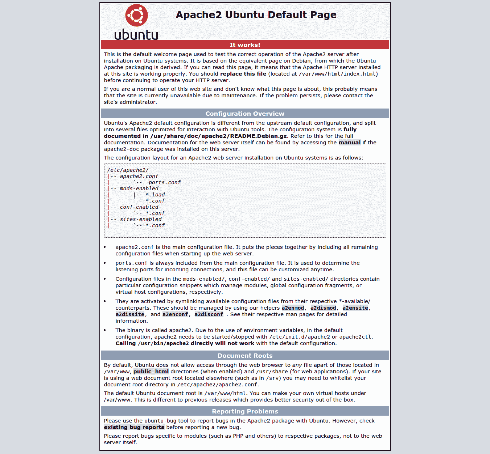
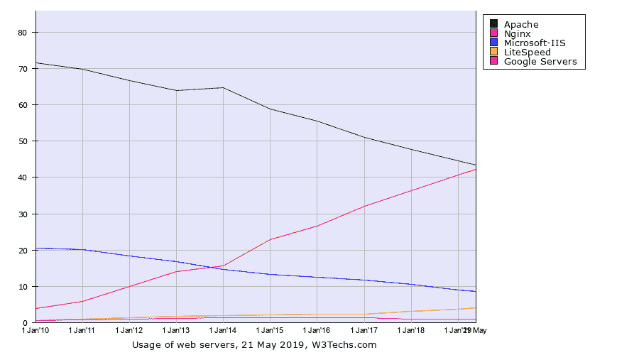
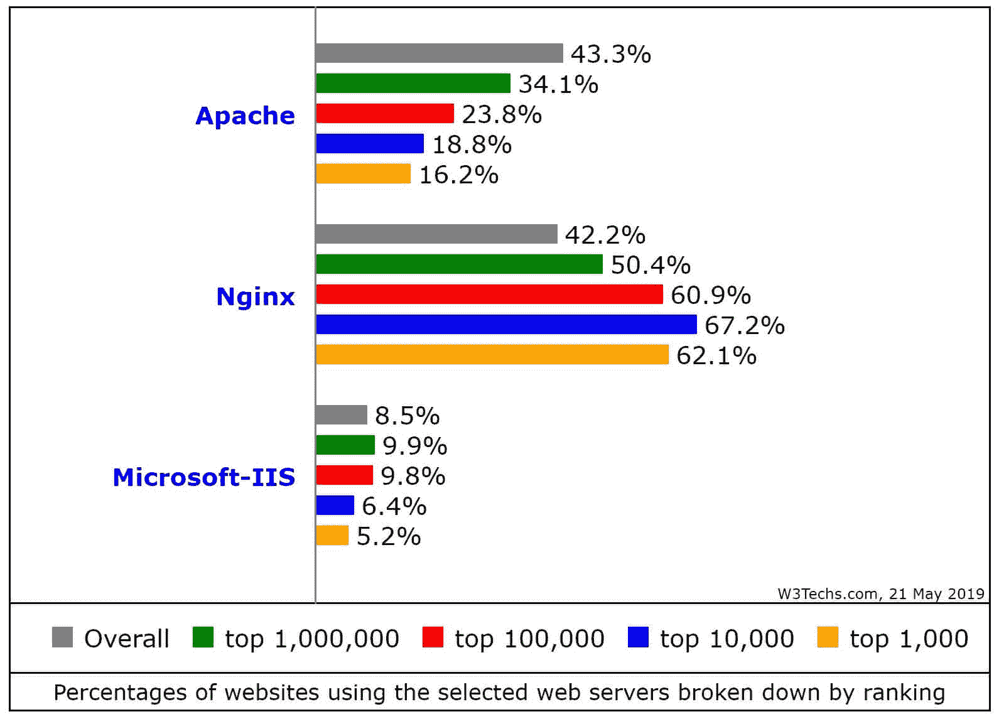
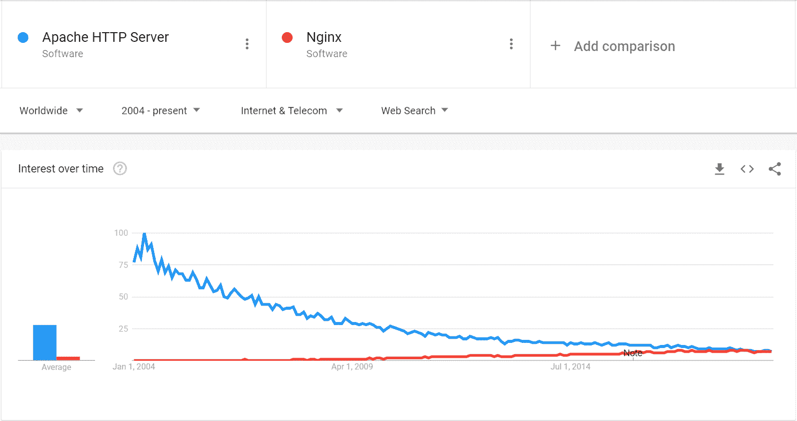
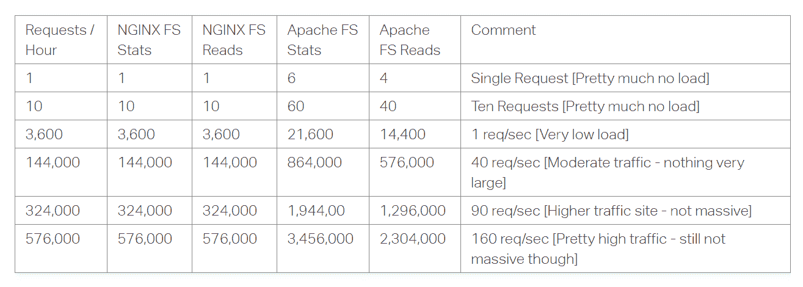
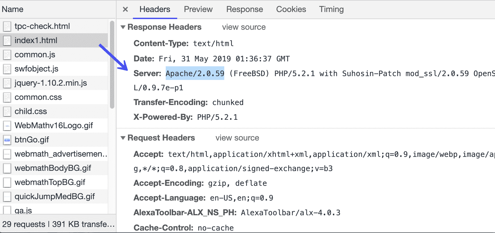
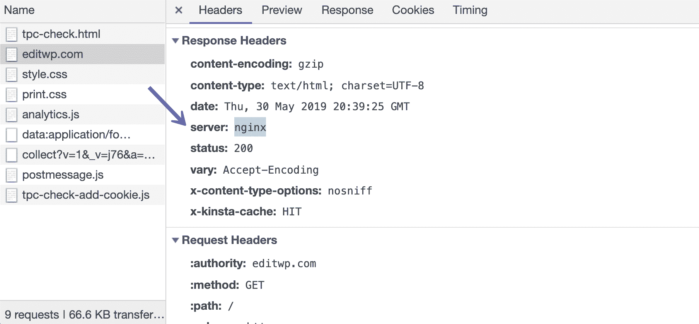

# Nginx vs Apache: Web 服务器对决

> 原文:[https://kinsta.com/blog/nginx-vs-apache/](https://kinsta.com/blog/nginx-vs-apache/)

正如我们今天所知，互联网在 90 年代开始了它的全球“征服”。整个“web”协议可以总结为一个访问者从给定的 Web 地址请求一个文档，DNS 和 IP 系统将该请求转发到正确的计算机。托管所请求的网页的这台计算机将把该网页“提供”给访问者。

网页本质上是 HTML 文档。为了能够为访问者提供不同的网页,“服务”机器需要一个服务器程序。像 Nginx vs Apache 这样的软件处理请求，分析它们，然后将相应的文档返回到访问者的浏览器中进行查看。

 <kinsta-auto-toc heading="Table of Contents" exclude="last" list-style="arrow" selector="h2" count-number="-1"><link rel="stylesheet" href="https://kinsta.com/wp-content/themes/kinsta/dist/patterns/featured-snippet.css?ver=264ec3d754b6bff57ae9">

## Nginx vs Apache

Nginx 和 Apache 是流行的 web 服务器，用于向用户的浏览器提供网页。在我们的例子中，来自一个托管的 WordPress 站点。快速统计:

*   Apache 于 1995 年首次发布，然后在 2004 年发布了 Nginx。
*   全球财富 500 强的大公司都使用这两种方法。
*   Nginx 的市场份额多年来一直在稳步增长。
*   在某些情况下，Nginx 在性能方面具有竞争优势。

Support

## 街头流氓

我们将首先深入研究 Apache，因为它是首先发布的。

在互联网出现的前几年，蒂姆·伯纳斯·李的 CERN HTTPd T1 和 T2 的 NCSA HTTPd T3 之后，1995 年首次发布的 Apache T5 迅速占领了市场，成为世界上最受欢迎的网络服务器。如今，它仍处于这一市场地位，但主要是因为传统原因。Apache 是由 Apache 基金会在 Apache 许可下开发和维护的。

<link rel="stylesheet" href="https://kinsta.com/wp-content/themes/kinsta/dist/components/ctas/cta-mini.css?ver=2e932b8aba3918bfb818">

> Kinsta 把我宠坏了，所以我现在要求每个供应商都提供这样的服务。我们还试图通过我们的 SaaS 工具支持达到这一水平。
> 
> <footer class="wp-block-kinsta-client-quote__footer">
> 
> 
> 
> <cite class="wp-block-kinsta-client-quote__cite">Suganthan Mohanadasan from @Suganthanmn</cite></footer>

[View plans](https://kinsta.com/plans/)

关于 Apache 如何得名有两个不同的故事。一个版本说这个名字来源于著名的美国土著遗产，而另一个版本说这个名字是“一个拼凑的服务器”的双关语，它是在一系列软件补丁之后出现的。

### Linux 操作系统

Apache 的巨大市场份额部分是由于它预装了所有主要的 Linux 发行版，如 Red Hat/Centos 和 Ubuntu。

Ubuntu default page

Apache 在 Linux 世界中的重要作用的一个例子是，它的服务器进程名是 HTTPd，这使得 Apache 成为 web 服务器软件的同义词。

除了是 web 服务器市场的第一个重要玩家之外，Apache 的发展部分归功于它的配置系统和它的*。htaccess* 文件。

### 。htaccess

阿帕奇用[。htaccess](https://kinsta.com/knowledgebase/wordpress-htaccess-file/) 进行配置。有很多关于如何配置、编辑和使用这个文件的[教程](https://www.askapache.com/htaccess/)，因为它在配置 Apache 如何处理传入请求方面提供了很大的灵活性。一些例子是:不同的[重定向规则](https://kinsta.com/blog/wordpress-change-domain/#option-1--adding-redirects-at-serverlevel)、[最大上传文件大小](https://kinsta.com/blog/increase-max-upload-size-wordpress/)、URL 重写、[内存限制](https://kinsta.com/knowledgebase/wordpress-memory-limit/)、目录保护(htpasswd)、[过期头](https://kinsta.com/knowledgebase/add-expires-headers-wordpress/)、[缓存控制头](https://kinsta.com/learn/speed-up-wordpress/#adding-cachecontrol-header-in-apache)、[编码头](https://kinsta.com/knowledgebase/specify-vary-accept-encoding-header/)、cookies、查询字符串操作。

另一方面，Kinsta 使用不支持的 Nginx。htaccess 文件。但是，您的中的设置和规则。htaccess 文件可以很容易地“翻译”成 Nginx 自己的重写规则语法。

Apache 的主要“优点”之一是，在服务器根目录(主网站目录)中，目录树中的每个级别或目录都可以有自己的目录。具有自己配置的 htaccess 文件。

对于共享主机服务提供商来说，这是一个梦想，因为他们可以为同一台机器上的数百名用户提供一种方式来配置他们网站的服务方式，而不会影响到其他人。客户可以在一个受限的共享托管环境中配置很多细节，同时永远不会触及全局服务器配置。

正如官方文件所说:

> “一般来说，你应该只用。当您没有访问主服务器配置文件的权限时，请使用 htaccess 文件。

然而，这种灵活性是以牺牲性能为代价的。htaccess 文件会导致性能下降，不管你实际上是否使用它们！”

每次都是。htaccess 文件，Apache 必须遍历整个目录树，从请求的 URL 或文件开始，通过所有更高的级别，直到服务器的根目录，然后为每个请求加载它们。然后，它需要处理这些文件，并为以这种方式配置的每个目录重新配置自己。

有了 WordPress 网站，事情会变得非常复杂。一个典型的 WordPress 网站可能有数百个来自不同目录的请求。

来自/wp-content/uploads/yyyy/mm 类型的目录，它通常在单个页面负载上有多个请求，通常来自不同的月份目录。然后会有/WP-content/themes/parent-theme 静态资源，/wp-content/themes/child-theme 资源:这些会包括 javascript， [css 文件](https://kinsta.com/blog/wordpress-css/)，图片。

然后还会有/wp-content/plugins，其中包含从几十个插件子目录中加载的静态文件。对于这些资源中的每一个，Apache 都必须遍历整个树来查找配置。

一项分析表明，一个典型的 WordPress 设置，对于共享主机上的网站来说相当普遍，将包括 42 个独立的。htaccess 执行和 249 个单独的查找。htaccess 文件。

这只是在网络服务器层面。访问者仍然需要等待 PHP 进程执行整个 WordPress 调用栈来创建数据库查询，并将其交给 MySQL 来组装网页并发送给访问者。

### 模块

另一个让 Apache 流行起来的是它的**动态模块系统**。

模块——作为允许用户扩展 web 服务器功能的特性——在 Nginx 和 Apache 中都存在。Apache 允许用户在安装和部署 web 服务器后安装模块，然后根据需要启用/禁用它们。基于 Debian 的发行版有一些命令允许启用和禁用这些模块，而不需要编辑任何配置文件:a2enmod 和 a2dismod。

作为 Apache 标准发行版一部分的官方模块列表是这里的[和](https://httpd.apache.org/docs/2.4/mod/)，包括从压缩、加密、日志、重定向到更高级的东西，比如用高级语法编辑请求和响应。
T3】

## Nginx

nginx (也写作 Nginx 或 Nginx)于 2004 年出现，当时它由俄罗斯开发者[伊戈尔·塞索耶夫](http://sysoev.ru/en/)首次公开发布。正如 Nginx 项目经理[欧文加勒特](https://www.nginx.com/blog/nginx-vs-apache-our-view/)所说:

> " Nginx 是专门为解决 Apache web 服务器的性能限制而编写的."

该服务器最初是在 2002 年作为 rambler.ru 网站的缩放工具而创建的。它有两个版本:开放源码，带有 [BSD 类型的许可](https://en.wikipedia.org/wiki/Simplified_BSD_License)，和 [Nginx Plus](https://www.nginx.com/products/nginx/#compare-versions) ，带有支持和额外的企业特性。

在发布之后，Nginx 主要用于服务静态文件，并作为 Apache 安装前的负载平衡器或反向代理。随着网络的发展，以及对速度和硬件使用效率的需求，越来越多的网站开始用 Nginx 完全取代 Apache，这也要归功于一个更成熟的软件。

NGINX Inc acquired by F5 Networks

2019 年 3 月，Nginx Inc [被 F5 Networks 以](https://www.sec.gov/Archives/edgar/data/1588848/000158884813000001/xslFormDX01/primary_doc.xml)[6.7 亿美元](https://techcrunch.com/2019/03/11/f5-acquires-nginx-for-670m-to-move-into-open-source-multi-cloud-services/)收购。据 Techcrunch 报道，当时 Nginx 服务器为“3.75 亿个网站和大约 1500 名付费用户”提供支持。

根据 w3techs 的[数据，Nginx 的市场份额一直在稳步增长，将 Apache 挤出并从第一的位置上赶了下来:](https://w3techs.com/technologies/history_overview/web_server/ms/q)

Web server usage

这些数据与全球所有网络服务器有关，但如果我们从排名前 100 万的网站中抽取样本，Nginx 已经存在一段时间了:

Percentage of websites using Nginx

谷歌搜索趋势似乎也反映了这一事实:

 ## 注册订阅时事通讯

### 想知道我们是怎么让流量增长超过 1000%的吗？

加入 20，000 多名获得我们每周时事通讯和内部消息的人的行列吧！

[Subscribe Now](#newsletter)

Google Search Trends: Nginx vs Apache

Netcraft 调查[提示【2019 年 4 月阿帕奇已经被 Nginx 超越。](https://news.netcraft.com/archives/category/web-server-survey/)

### Nginx 配置

Nginx 没有像 Apache 那样的配置系统，因此，尽管它更加高效和快速，但它并没有被零售主机提供商广泛采用。它不像 Apache 那样在共享环境中大放异彩。

Kinsta hosting architecture.

另一方面，正如我们所说的，由于不允许目录级配置，Nginx 比 Apache 有明显的优势。Nginx wiki 上有一篇文章比较了性能影响:

Performance impact Nginx vs Apache.png

### Nginx 模块

Nginx 模块系统是又一个将其定位为更高级选择的东西。Nginx 模块通常需要在构建时启用，这意味着涉及到更多的技术能力，并且模块的安装后添加有点复杂。

2016 年，随着 1.9.11 版本的推出，[事情发生了变化](https://dzone.com/articles/introducing-dynamic-modules-in-nginx-1911-nginx)，官方/经过验证的动态模块库被保留给付费用户。截至 2019 年 5 月，[他们宣布](https://www.nginx.com/blog/nginx-1-16-1-17-released/)开始开发对 QUIC 和 [HTTP/3](https://kinsta.com/blog/http3/) 的支持。

## 缓存的问题:Nginx vs Apache

缓存——如果我们想把它过于简化的话——可以想象成在网站访问者访问之前为他们准备内容，这样当他们“敲门”时，你就不需要去寻找他们正在寻找的内容。你已经准备好了，你没有任何等待就把它交给他们。

像 Apache 一样，Nginx 的典型设置是位于服务器和最终用户之间，以减轻对基础设施其余部分的性能影响。在这些情况下，它可以缓存静态内容，而不需要每次都从受保护的源服务器获取它。

如果我们使用 Nginx 作为一个独立的网络服务器——就像 [Kinsta LXC 容器](https://kinsta.com/knowledgebase/shared-vps-dedicated-hosting/)一样——就没有这种需要。Nginx 本身在提供静态内容方面非常高效。

然后就是动态缓存或者说[页面缓存](https://kinsta.com/blog/wordpress-cache/#page-cache)的问题。在 WordPress 网站的场景中，这意味着将为每个 URL 生成的所有 WordPress 页面存储在内存或磁盘上。

FastCGI 缓存在标准 Nginx 安装中是本地可用的。它很简单，非常强大，是 Nginx 中不常用的特性之一。

为了与 Apache 的同类产品进行比较，您应该知道 Apache 有 mod_cache 模块，据报道,该模块容易出问题，与其他模块冲突。所以 Apache 部署的标准缓存解决方案是 Varnish HTTP accelerator。虽然 Varnish 是专门的行业解决方案，但最近的一些测试[让 Nginx 缓存明显优于 Varnish。](https://deliciousbrains.com/page-caching-varnish-vs-nginx-fastcgi-cache-2018/)

你厌倦了缓慢的 WordPress 托管吗？我们在服务器级别使用全页面缓存，几乎可以即时向您的访问者提供内容。[查看我们的托管计划](https://kinsta.com/plans/?in-article-cta)

在 Kinsta，我们使用 [Nginx 进行动态 WordPress 缓存](https://kinsta.com/blog/wordpress-cache/#kinsta-cache-settings)，以及一个[专有的缓存插件](https://kinsta.com/help/kinsta-mu-plugin/)，允许对缓存的页面和由 Kinsta CDN 缓存的静态资产进行粒度控制。

## 处理请求:Nginx 与 Apache

Apache 和 Nginx 最大的区别在于它们处理请求的底层架构。

Apache 用 MPM-s 或[多处理模块](https://httpd.apache.org/docs/2.4/mpm.html)处理请求，它“负责绑定到机器上的网络端口，接受请求，并分派子进程来处理请求。”

最古老的 MPM，可以追溯到 Apache 的开端，是 [prefork 模块](https://httpd.apache.org/docs/2.4/mod/prefork.html)。单单这个模块就可以让 Apache 的性能声名狼藉。在这种模式下，Apache 为每个请求生成一个线程的新进程。

这个模块与 mod_php 一起使用，意味着 Apache server 在每个进程中都嵌入了一个 php 解释器，即使它必须提供 CSS 文件或图像。

这是低效的。Prefork 模块是 Apache 自带的默认模块。它还将连接限制到 HTTP/1。

在后来的几年里，Apache 开发了多线程 [worker mpm](https://httpd.apache.org/docs/2.4/mod/worker.html) 以及之后的 [event mpm](https://httpd.apache.org/docs/2.4/mod/event.html) 。两者都缓解了 Apache 的许多性能问题。切换到 php-fpm 使得 Apache 在今天仍然是一个有竞争力的解决方案，同时消除了。htaccess，但这有点违背了它的目的。

Nginx 使用异步、非阻塞的事件驱动架构。

解释一下区别:在 Linux/Unix 世界中，进程是运行程序。

线程是进程的子集，在一个进程执行中可以有多个线程。请将此想象为浏览器窗口中的多个选项卡。通过这种方式，程序可以利用多个 CPU 和多核、多线程 CPU 来提高执行速度。你可以阅读 Linus Torvalds 对差异的阐述。

简而言之，Apache 对每个连接都使用进程(对于 worker mpm，它使用线程)。随着流量的增加，它很快变得过于昂贵。

我们可以想象新的进程或线程的创建，比如启动计算机或启动程序。即使在最快的计算机上，也需要一些时间。随着今天的网站在一个页面上发出数百个请求，这种情况会迅速增加。

Event mpm 在优化方面走得更远一点，但是[一些](https://www.eschrade.com/page/performance-of-apache-2-4-with-the-event-mpm-compared-to-nginx/) [测试](https://stackoverflow.com/questions/27856231/why-is-the-apache-event-mpm-performing-poorly)显示它跑不过 Nginx。特别是当我们谈到静态文件时，Nginx 处理的请求是 Apache 的两倍。

Nginx 理想情况下每个 CPU/内核有一个工作进程。Nginx worker 进程的不同之处在于，每个 worker 可以处理[成千上万的网络连接。不需要为每个连接创建新的线程或进程。](https://www.nginx.com/blog/inside-nginx-how-we-designed-for-performance-scale/)

这就是为什么主要的内容交付网络，如 [Cloudflare](https://kinsta.com/cloudflare-market-share/) 、MaxCDN 和[我们的合作伙伴 key cdn](https://www.keycdn.com/partners)——或网站如[网飞](https://www.nginx.com/blog/why-netflix-chose-nginx-as-the-heart-of-its-cdn/)——发现 Nginx 对他们的内容交付至关重要。

利用 Nginx 的公司名单太长，无法一一列出，所以我们将以 WordPress.com 背后的私人公司 Automattic 结束。

Automattic 在 2008 年将他们所有的负载均衡器转换成 Nginx 用于 WordPress.com(你可以[在这里](https://barry.blog/2008/04/28/load-balancer-update/)读到它)并且将他们的服务器栈[完全迁移到 Nginx](https://www.nginx.com/success-stories/nginx-wordpress-com/) 。

## 在现实生活中检验它

如果我们想检查生产中的网站使用了什么，我们通常可以在 HTTP 响应头中找到它。这意味着我们将需要右键单击一个网站>**检查**，在开发者工具中，我们将选择网络面板，然后重新加载该网站。我们将看到网站正在加载的所有资源。如果我们选择任何特定的资源及其**标题**标签，我们通常会看到服务器信息。如果网站使用 CDN，我们可能会在服务器行中看到类似 Cloudflare 的内容，或者如果网站使用 HTTP 加速器，会看到类似 Varnish 的内容。

这是一个使用 cPanel、Apache 和 PHP 的典型共享主机设置的 WordPress 网站的例子:

Apache HTTP header

这是 Nginx 上的一个网站:

Nginx HTTP header

在左侧，如果我们展开它，我们还将能够分析每个资源的时间，并看到它对整个页面加载时间的影响。

[Nginx vs Apache: which one provides faster solutions for your WordPress sites? 🚀 Check out our web server showdown!Click to Tweet](https://twitter.com/intent/tweet?url=https%3A%2F%2Fkinsta.com%2Fblog%2Fnginx-vs-apache%2F&via=kinsta&text=Nginx+vs+Apache%3A+which+one+provides+faster+solutions+for+your+WordPress+sites%3F+%F0%9F%9A%80+Check+out+our+web+server+showdown%21&hashtags=webops%2Ccaching)

## 摘要

在本文中，我将重点放在 Nginx 和 Apache 上，并解释了帮助 Nginx 在 web 服务器领域获得更多关注的主要架构差异。这些是在我们这个资源饥渴的行业中赋予它性能优势的关键特征。

当然，并不是每个用例都有相同的优先级，Apache 或其他工具如 [Lighttpd](http://www.lighttpd.net/) 、 [IIS](https://www.iis.net/) 、 [LiteSpeed](https://www.litespeedtech.com/products/litespeed-web-server) 、 [Caddy](https://caddyserver.com/) 可能是好的解决方案。

在 Kinsta，[我们使用 Nginx](https://kinsta.com/knowledgebase/what-is-nginx/) 作为我们为 WordPress 和 WooCommerce 提供的[性能优化托管](https://kinsta.com/blog/managed-wordpress-hosting/)解决方案的一部分。每一个 WordPress 站点都有自己的独立容器，里面有运行它所需的所有软件资源(Nginx，Linux，PHP，MySQL)。这些资源是 100%私有的，不会在任何其他站点之间共享。

请务必[查看 Nginx 和我们所有的高级附加软件](https://kinsta.com/add-ons/?plan=visits-business1&interval=month)。此外，查看我们的[应用托管](https://kinsta.com/application-hosting/)和[数据库托管](https://kinsta.com/database-hosting/)服务，获得更多托管机会。

* * *

让你所有的[应用程序](https://kinsta.com/application-hosting/)、[数据库](https://kinsta.com/database-hosting/)和 [WordPress 网站](https://kinsta.com/wordpress-hosting/)在线并在一个屋檐下。我们功能丰富的高性能云平台包括:

*   在 MyKinsta 仪表盘中轻松设置和管理
*   24/7 专家支持
*   最好的谷歌云平台硬件和网络，由 Kubernetes 提供最大的可扩展性
*   面向速度和安全性的企业级 Cloudflare 集成
*   全球受众覆盖全球多达 35 个数据中心和 275 多个 pop

在第一个月使用托管的[应用程序或托管](https://kinsta.com/application-hosting/)的[数据库，您可以享受 20 美元的优惠，亲自测试一下。探索我们的](https://kinsta.com/database-hosting/)[计划](https://kinsta.com/plans/)或[与销售人员交谈](https://kinsta.com/contact-us/)以找到最适合您的方式。</kinsta-auto-toc>