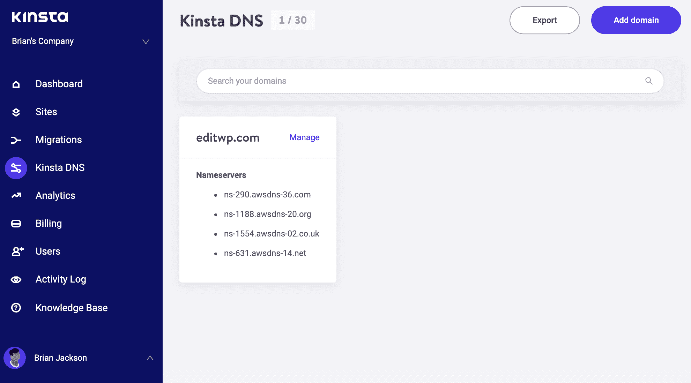
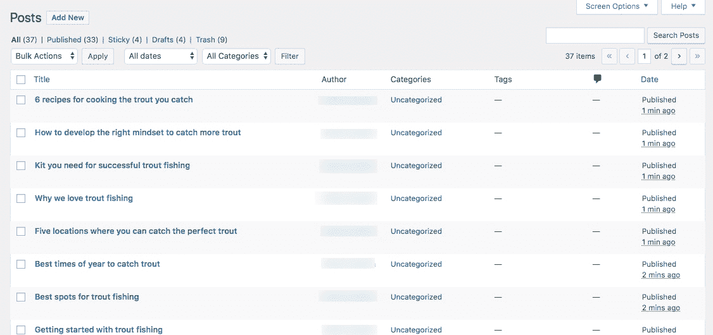
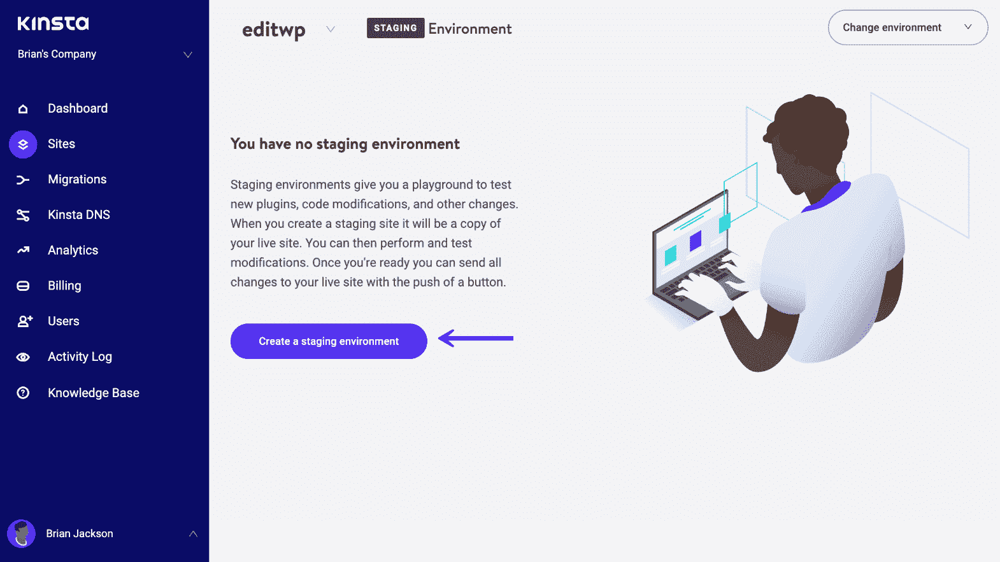
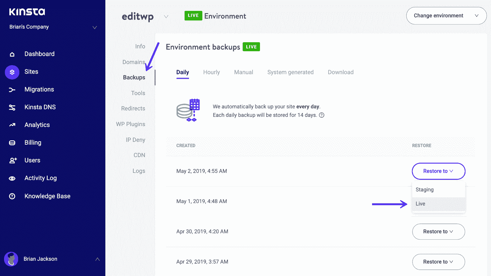
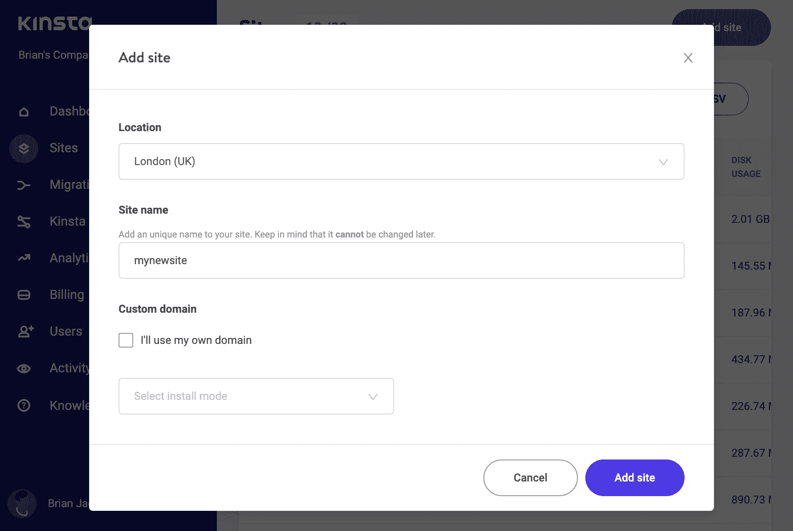
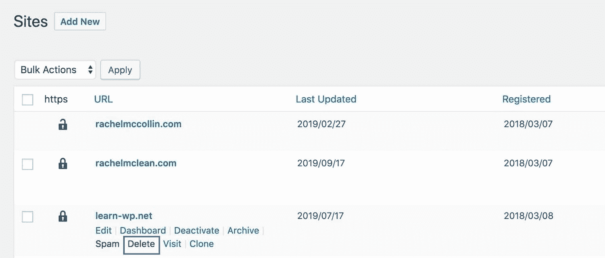
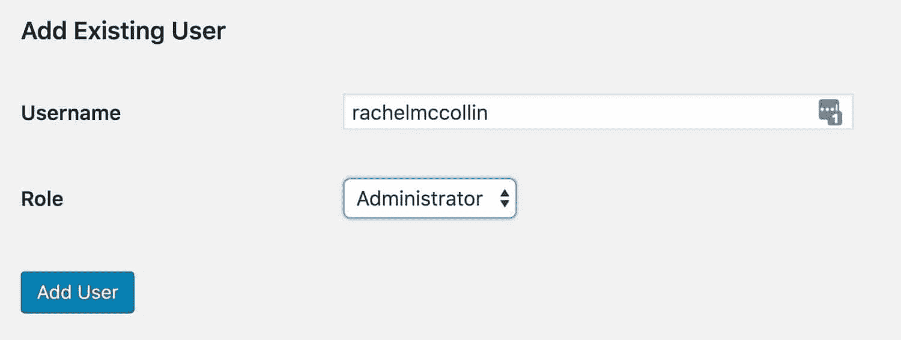
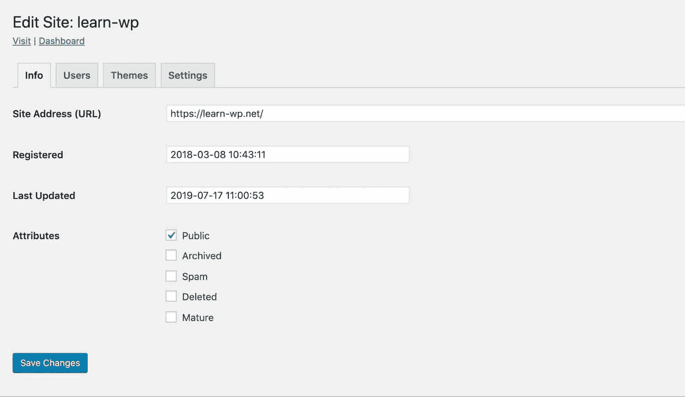

# 如何重置 WordPress (6 个真实世界的例子)

> 原文:[https://kinsta.com/blog/reset-wordpress/](https://kinsta.com/blog/reset-wordpress/)

我喜欢 WordPress，但是我不得不承认，有时候我希望找到一个“重置 WordPress”按钮，然后把它扔出窗外。

我知道，大多数时候，这是一个强大而可靠的平台。绝对比许多竞争对手更重要(否则超过三分之一的互联网用户不会使用它)。

但是有些时候事情会出错。也有 WordPress 没有出错的时候，但也许你已经出错了。你花时间创建了一个 WordPress 网站，但现在意识到这不是你所需要的。你想彻底检查它，重新设计它，或者从头再来。

在这种情况下，你可能会像我一样，试图找到一个闪亮的红色“重置”按钮，希望重置 WordPress 可以解决你所有的问题。

有时候可以。但有时，你不需要采取如此激烈的行动。

在这篇文章中，我将涵盖所有这些场景，在这些场景中，你可能想把你的 WordPress 安装扔到窗外，然后重新开始。我将帮助您确定这是否真的是您需要做的，如果不是，更合适的行动方案可能是什么。

如果你真的需要重置 WordPress，我会告诉你怎么做。你不会失望的！

### 更喜欢看[视频版](https://www.youtube.com/watch?v=-EKeyja24-Y)？


> 需要在这里大声喊出来。Kinsta 太神奇了，我用它做我的个人网站。支持是迅速和杰出的，他们的服务器是 WordPress 最快的。
> 
> <footer class="wp-block-kinsta-client-quote__footer">
> 
> 
> 
> <cite class="wp-block-kinsta-client-quote__cite">Phillip Stemann</cite></footer>

[View plans](https://kinsta.com/plans/)

## 如果你想关闭你的网站并把它移到另一个域，重置 WordPress

随着时间的推移，[域名](https://kinsta.com/blog/best-domain-registrar/)失去光彩并不罕见，你可能会意识到，当你第一次推出它时，你认为对你的网站来说完美的域名现在已经不那么好了。

也许你是出于爱好而创建了你的网站，并给它起了一个轻松的域名。[你现在已经转而经营一个专业网站](https://kinsta.com/blog/how-to-monetize-a-blog/)，并希望你的域名能反映这一点。或者你给了你的网站一个非常具体的域名，这个域名不再适用于你在网站上包含的所有内容。作为一个热衷于钓鳟鱼的人，你可能注册了 troutfishingguide.com。现在你已经扩展到捕捞其他淡水鱼，你想用 fishingguide.com 代替。

你可能认为你需要关闭你的网站并重新开始，但事实并非如此。你可以简单地[注册新域名](https://kinsta.com/blog/how-much-does-a-domain-name-cost/)并让它指向你的站点。

如果你想添加一个新的域名，但同时保留你的旧域名(这是一个好主意，以防人们继续使用它，并出于搜索引擎优化的目的)，那么你可以注册一个新的域名，并将其指向你的网站。这样你也可以添加 [301 重定向](https://kinsta.com/help/redirect-rules/)从你的旧域名到你的新域名。

Kinsta 不提供域名注册— [我们专注于托管](https://kinsta.com/features/) —所以你需要在其他地方注册一个域名，并使用你的仪表板中的 Kinsta DNS 选项将它指向我们的服务器[。](https://kinsta.com/help/dns/)

一旦你这样做了，确保它使用仪表板的 **Kinsta DNS** 部分中的工具指向你的站点。然后，您可能需要等待几个小时，让 DNS 进行解析。Kinsta 对此无法控制:等待 DNS 设置在互联网上传播是很常见的。您可以在 whatsmydns.net 的[查看您的 DNS 变更进度。](http://whatsmydns.net/)



Kinsta DNS


然后，回到你的 WordPress 网站，点击**设置>常规**。有两个字段管理您的网站地址。编辑**WordPress**字段和**站点地址**字段，这样它就是你站点的新地址(例如，从 olddomain.com 到 newdomain.com)。点击保存**更改**按钮保存您的更改。

重要提示:在 DNS 传播之前不要这样做，否则在完成下一步之后你将不能登录到你的 WordPress 管理仪表板。


WordPress General Settings screen


然后，您需要用新域名替换数据库中旧域名的所有实例。在 Kinsta 仪表板中，通过**站点屏幕**转到您的站点，然后选择**工具>搜索和替换**。在这里，您可以运行一个[搜索并替换](https://kinsta.com/knowledgebase/wordpress-search-and-replace/)，用新域名替换旧域名。


Number of replacements


如果你想保留你的 SEO 反向链接和流量，你需要从你的旧网站添加 301 重定向。我们会在关于如何改变你的域名的文章中详细讨论这个问题。

但是如果你需要一些更激烈的东西呢？


## 如果你想删除你所有的内容，重置 WordPress

有时候重置你的站点意味着删除你添加到其中的所有内容。

也许在从钓鳟鱼转向钓普通淡水鱼之后，你发现你的博客文章和页面不够宽泛，无法满足读者的需求，你想从头再来。

再说一次，你不需要完全重置 WordPress。相反，你可以删除你所有的内容。要做到这一点，从你的文章开始。点击管理菜单中的**帖子**以显示帖子屏幕。



the Posts screen


如果你在这个屏幕上看不到你发表的所有文章，有一个方法可以解决这个问题。点击顶部的**屏幕选项**选项卡。在出现的框中，编辑**每页条目数**字段，使其为一个大数字(大于已发布文章的数量)。点击**应用**按钮。

你现在会看到你所有的文章都列出来了。选中文章标题上方的**标题**列标题旁边的复选框，这将选择您的所有文章。然后点击它上面的下拉框——上面写着**批量操作**——并点击**移至垃圾桶**。然后点击旁边的**应用**按钮。你的帖子都会消失。

如果您想将它们放在废纸篓中，以防将来需要恢复它们，您可以这样做。但是这个帖子都是关于重置 WordPress 的，所以你会想知道如何彻底摆脱它们(只要你确定！).

点击帖子列表上方的**垃圾桶**链接。再次勾选**标题**列名旁边的复选框，然后选择**永久删除**。最后一次问自己是否真的想永远删除所有帖子，如果答案是肯定的，点击**应用**按钮。

您的站点现在将没有帖子。您可以对您的页面和其他内容类型(如果需要，包括媒体)重复此操作，直到您拥有一个完全空的站点。
大口！现在，您可以从头开始创建新内容。

### 使用 WordPress 插件

另一个简单快捷的方法是使用免费的 [WP 重置插件](https://wordpress.org/plugins/wp-reset/)来删除我们所有的内容。它会将您站点的数据库重置为默认安装值，而不修改任何文件。它会删除所有自定义和内容。

[](https://wordpress.org/plugins/wp-reset/)

WP Reset plugin


不管这个插件有多好，在使用它之前备份一个文件总是很重要的。

### 使用 WP-CLI

你也可以使用面向 WordPress 开发者的命令行工具 [WP-CLI](https://kinsta.com/blog/wp-cli/) 。以下命令截断帖子、评论和术语表，以清空站点的内容。它不会影响站点配置(选项)或用户:

```
wp site empty
```

参见[文档和附加参数](https://developer.wordpress.org/cli/commands/site/empty/)。感谢我们的读者之一卢克提到这一点！
T3】

## 如果你想重新设计你的网站，重置 WordPress

如果你只想重新设计你的网站，那么你不需要删除任何东西。相反，你需要为你的新设计创建或[安装一个新的主题，这将改变你现有内容的显示方式。以下是如何正确地](https://kinsta.com/blog/wordpress-statistics/)[删除你的 WordPress 主题](https://kinsta.com/blog/wordpress-delete-theme/)。

即使您也想更新您的内容，您可能会发现向现有网站添加新主题比建立一个全新的网站更容易。

当你测试、定制和/或开发你的新主题时，你需要能够在人们不知道你在做什么的情况下用你的内容来测试它。相反，你会希望他们看到旧的网站，直到新的版本准备就绪。

为此，您有两种选择:

1.  使用一个[WordPress staging environment](https://kinsta.com/wordpress-staging/)创建一个你的站点的副本，并用新的主题进行测试。一旦它准备好了，你可以上传新的主题到你的网站。
2.  安装一个插件，比如 [Theme Switcha](https://wordpress.org/plugins/theme-switcha/) ，它可以让你保持现有的主题对你网站的访问者可见，同时你可以访问另一个主题进行测试。



WordPress staging environment


我会推荐使用一个 WordPress staging site ，因为它可以让你调整内容和其他设置，而不仅仅是主题。一旦你对[你的新主题](https://kinsta.com/blog/change-wordpress-theme/)感到满意，你只需将它上传到你的网站，并对内容和设置进行任何调整，你就可以开始了。或者，如果您没有对您的生产站点进行任何更改，您也可以[将 staging 推向 live](https://kinsta.com/help/push-staging-live/) 。

这意味着当你开发新的设计时，你有一个工作网站，并且不需要删除你的 WordPress 安装或数据库。

## 如果你的网站崩溃或被黑客攻击，重置 WordPress

所以你的网站停止工作了。也许[它已经被黑了](https://kinsta.com/blog/wordpress-hacked/)，看起来一点也不像你想象中的网站。或者可能在你更新了你的主题、插件或者 WordPress 本身之后出现了问题。

是时候把网站扔出窗外，重新开始了？嗯，没有。

相反，现在是时候[从你的网站被破坏前的备份](https://kinsta.com/blog/restore-wordpress-from-backup/)中恢复它了。

你会在 Kinsta 仪表盘中找到你网站的[备份。在**站点**屏幕中选择您的站点，然后选择**备份**。找到您的站点出现问题之前的备份，然后点击**恢复到> Live** 。](https://kinsta.com/help/disaster-recovery/)



Restore WordPress from Backup in MyKinsta


或者，如果您想先测试恢复(可能您不知道哪个备份是干净的)，请选择**恢复到>转移**。然后，您可以通过点击仪表板顶部的**更改环境**按钮并选择**登台**来切换到您的登台环境。备份存储 14 天，因此请确保在问题出现后两周内恢复备份。

如果问题是在更新后出现的，而你没有备份，你总是可以回滚到一个插件或主题的早期版本，并用它替换你现有的版本。请遵循以下步骤:

*   进入你的 WordPress 管理器的主题或插件界面，找到你更新的主题或插件。
*   点击插件/主题描述下方的**查看详情**链接。这将打开一个弹出窗口，显示插件/主题的详细信息。
*   在弹出窗口的右边，点击链接**WordPress.org 插件/主题页面**。这将把你带到 WordPress.org 网站上插件或主题的页面。
*   在右侧边栏中，点击**高级视图**链接。然后向下滚动到这个页面的底部，你会发现一个下拉框，里面有主题或插件的最新版本号。点击此处，选择第二个最新版本。然后点击**下载**按钮。
*   这会将一个 zip 文件下载到您的计算机上。把它保存在你能找到的地方，然后回到你的网站。
*   回到你站点的主题或插件界面，删除你想要替换的主题或插件。
*   点击屏幕顶部的**添加新的**按钮。点击**上传插件**或**上传主题**按钮，然后选择您刚刚下载的 zip 文件。上传它，确认你想要它替换你的站点上已经存在的插件/主题版本并激活它。

唷！你现在已经安装了旧版本的主题或插件。你会在插件或主题屏幕上看到一个通知，告诉你它需要更新。忽略它，直到有另一个更新可以修复您的问题。

查看我们的教程[如何安装 WordPress 插件](https://kinsta.com/knowledgebase/how-to-install-wordpress-plugins/)以获得更多详细步骤。

## 如何完全重置 WordPress

我将要向你展示的技术包括删除你的 WordPress 站点，并在它的位置上创建一个新的。这是你不应该掉以轻心的事情。**您的旧网站将不复存在**，您将拥有一个新的空网站，您需要对其进行配置并添加内容。

## 注册订阅时事通讯


### 想知道我们是怎么让流量增长超过 1000%的吗？

加入 20，000 多名获得我们每周时事通讯和内部消息的人的行列吧！

[Subscribe Now](#newsletter)

如果您想将您的旧内容迁移过来，您可以使用导入/导出工具[从旧站点](https://kinsta.com/knowledgebase/export-wordpress-site/#built-in-tool)导出您的内容，并将其导入新站点。这可以节省你很多时间。

要从旧网站导出内容，您需要使用导出工具。

1.  在你的旧站点，进入**工具>导出**。
2.  在**下选择要导出的内容**，选择**所有内容**。
3.  点击**下载导出文件**按钮。

WordPress 将创建一个导出文件，并将其下载到您的计算机上。

如果你还想导出和导入你所有的小工具设置，你可以使用[小工具导入器&导出器插件](https://wordpress.org/plugins/widget-importer-exporter/)。使用插件从这个站点导出你的所有设置，将文件和你的帖子一起存储在你的计算机上，并保存它以备后用(确保阅读我们关于 WordPress widgets 的[深度指南)。](https://kinsta.com/blog/wordpress-widgets/)

如果您不想导出任何内容，只需忽略这些步骤，继续阅读。

您可以删除旧网站，并在 Kinsta 仪表盘中创建新网站。

在主菜单中选择**站点**，找到您想要删除的站点。点击**信息**屏幕。
向下滚动到红色大按钮，上面写着**删除网站**。

问问你自己，你是否真的想删除你的网站。如果你还没有尝试过上面的任何方法来修复你的网站上的任何问题而不删除它，我推荐你通读前面的部分来确认一下。

仍然确定要删除您的网站吗？好的，然后点击那个按钮。

系统会要求你确认你明白你在做什么，并给你一些文本输入到一个字段中。输入并点击**删除站点**按钮。


Deleting a site in Kinsta


你的网站现在已经不存在了。是时候安装一个新的，并(可选)将您的内容导入其中。

在 Kinsta 仪表盘中，转到**站点**屏幕，点击右上角的**添加站点**按钮。

然后，在弹出窗口中添加您站点的详细信息，并单击**添加站点**按钮。



Adding a site in Kinsta


现在，您的新网站已经准备就绪。转到 WordPress 管理界面开始设置。安装所有的主题和插件，并配置它们。然后，您可以从旧网站导入内容:您不需要再次手动添加内容。

要导入您的内容，请按照下列步骤操作:

1.  在 WordPress 管理菜单中，进入**工具>导入**。
2.  在 **WordPress** 下，点击**立即安装**，然后**运行导入**。
3.  从旧的 WordPress 站点导出后，WordPress 会要求你找到你下载的导出文件。这是您从旧站点导出时保存的文件。
4.  找到文件，点击**上传文件和导入**按钮。
5.  WordPress 会询问你想将新内容关联到哪个用户账户——通常是你自己的账户。它还会要求您确认是否要导入媒体。你知道。
6.  等待 WordPress 导入新内容，然后转到站点的文章部分。你会发现里面全是你的内容。

如果您还导出了您的 widget 设置，您需要在新站点中安装 Widget Importer & Exporter 插件，并使用它来导入您的 Widget 设置。

现在，花一些时间做一些定制和配置你的插件，你已经有了一个新版本的网站。当然，如果你想重置 WordPress 的原因是为了改变内容或设计，你不需要像旧网站那样工作，而是可以从头开始。

你可能也想看看我们关于如何重新安装 WordPress 的教程。

## 如何重置 WordPress Multisite

如果你运行的是一个多站点网络，或者你的站点是托管在一个多站点网络上，你可能需要重新设置你的站点。这里有两种情况:

厌倦了你的 WordPress 站点的问题和停机？通过 Kinsta 获得最好、最快的主机支持！[查看我们的计划](https://kinsta.com/plans/?in-article-cta)

*   您是网络管理员，想要重置整个网络。
*   您是站点管理员，想要在网络上重置您的站点。

让我们看看第一个选项。

### 重置多站点网络

重置整个多站点网络和重置一个独立的 WordPress 站点没有太大的不同:毕竟，你想要重置的是 WordPress 的安装。以下是一些选择。

#### 将您的网络恢复到独立的 WordPress 安装

如果您决定切换回作为独立站点而不是网络运行您的网络，您需要移除网络中的所有站点(除了基本站点)，然后关闭多站点。请遵循以下步骤:

从备份你的网络开始。 [Kinsta 的 WordPress 主机](https://kinsta.com/wordpress-hosting/)带有[免费备份](https://kinsta.com/help/wordpress-backups/)或者如果你没有权限，使用与 Multisite 兼容的备份插件。

如果您想在其他地方重新创建您的网络中的任何站点，无论是作为独立站点还是在另一个网络中，[首先将这些站点](https://kinsta.com/blog/wordpress-multisite-plugins/)迁移出您的网络。测试网站的新版本，并确保它们在您继续之前工作。

在网络管理屏幕中，转到**站点**。对于您网络中的每个站点，单击**删除**链接将其删除。这将从数据库中删除该网站，并删除所有相关文件。



Deleting a site from your network


备份你的 wp-config.php 文件。然后打开文件。找到如下一行:

`define( 'WP_ALLOW_MULTISITE', true );`

将该行编辑为:

`define( 'WP_ALLOW_MULTISITE', false );`

你还应该删除所有其他与 Multisite 相关的代码，以清理你的 [wp-config 文件](https://kinsta.com/blog/wp-config-php/)。

再次访问您的网站并[登录](https://kinsta.com/blog/wordpress-login-url/)。你现在应该发现你有一个独立的 WordPress 安装。

#### 删除网络中的所有子网站

您可能不想完全删除多站点，而是删除您添加到其中的站点。

为此，首先备份您的网络。然后[导出或迁移那些站点](https://kinsta.com/knowledgebase/export-wordpress-site/)如果你想保留它们的话。

接下来，进入**网络管理>站点**。对于中的每个站点，单击**删除**链接将其删除。

现在，您将拥有一个(几乎)空的多站点网络，只有一个基本站点，如果需要，您可以随时添加新站点。

#### 重置包括多站点在内的整个安装

如果你想重置你的整个 WordPress 安装，不仅删除子网站和网络，还删除基本网站，按照上面重置标准 WordPress 网站的说明。

不要忘记[首先将网络上的任何站点](https://kinsta.com/blog/wordpress-multisite-plugins/)迁移到其他位置。

### 重置多站点网络中的单个站点

如果您管理多站点网络中的单个站点，您可能需要重置它，以便可以重用它或从头开始。如何做到这一点将取决于你是否只有网站管理员权限，或者你是否是网络管理员。

#### 从网络中删除站点

如果你不是网络管理员，你想完全删除网站，你需要让你的网络管理员来做，因为你不能删除一个网站。不过，您可以删除所有内容——稍后我将向您展示如何删除。

开始之前，请备份网络和/或网站。如果您计划将其迁移到其他地方，您可能希望导出站点的内容(或者在网络中克隆站点)。
在**网络管理**屏幕中，进入**站点**。将鼠标悬停在站点名称上，点击**删除**。这将删除该网站。

如果需要，您可以创建一个新的空白网站来替换它。为此，点击**站点**屏幕中的**添加新的**，并遵循创建新站点的说明。然后点击**站点**屏幕中其名称下的**编辑**链接，进入站点编辑屏幕。单击**用户**选项卡，使用**添加现有用户**部分中的字段添加具有**站点管理员**角色的用户。



Adding a new user as Site Admin


#### 重置站点的域

如果你想改变网络中某个站点的域名，你可以通过**网络管理>站点**来完成。只有网络管理员可以这样做。

选择您想要编辑的站点，并点击其名称下方的**编辑**链接。



Editing your site’s name


在**站点地址**字段中，输入新地址，点击**保存更改**按钮。

在进行更改之前，请确保新域指向您的站点。在您与您的[域名注册商](https://kinsta.com/blog/best-domain-registrar/)进行设置后，DNS 更改可能需要两天才能生效。

#### 将站点重置为站点管理员

如果你不想完全删除网站，而只是想删除所有的内容或改变设计，你可以遵循上面列出的标准 WordPress 网站的一些步骤。

您可以选择的选项有:

*   通过**页面**和**帖子**屏幕删除所有内容。
*   通过**微件**屏幕或定制器删除微件。
*   激活新主题以重置网站设计。您只能激活已经安装在网络上的主题:除非您是网络管理员，否则您不能安装新的主题。

这些选项都不能完全重置网站，但如果你不想删除所有内容并重新开始，而只想彻底修改设计或内容，这可能是你的选择。
[有时候你只想重新开始。看看这 5 种重置 WordPress 的方法。🔨 点击推文](https://twitter.com/intent/tweet?url=https%3A%2F%2Fkinsta.com%2Fblog%2Freset-wordpress%2F&via=kinsta&text=Sometimes+you+just+want+to+start+over.+Check+out+these+5+ways+to+reset+WordPress.+%F0%9F%94%A8&hashtags=webdev%2CWordPress)

## 摘要

在这篇文章中，我向你展示了重置 WordPress 和清理你的站点的各种方法。

根据想要重置你的站点的原因，这可能包括从删除你的文章和页面的小操作到完全移除 WordPress 安装程序并用一个新的替换它。

在你停止使用 WordPress 之前，确保你知道**你为什么这么做**，这样你就可以选择正确的方法，而不会给自己增加额外的工作或者删除你真正想保留的数据。

* * *

让你所有的[应用程序](https://kinsta.com/application-hosting/)、[数据库](https://kinsta.com/database-hosting/)和 [WordPress 网站](https://kinsta.com/wordpress-hosting/)在线并在一个屋檐下。我们功能丰富的高性能云平台包括:

*   在 MyKinsta 仪表盘中轻松设置和管理
*   24/7 专家支持
*   最好的谷歌云平台硬件和网络，由 Kubernetes 提供最大的可扩展性
*   面向速度和安全性的企业级 Cloudflare 集成
*   全球受众覆盖全球多达 35 个数据中心和 275 多个 pop

在第一个月使用托管的[应用程序或托管](https://kinsta.com/application-hosting/)的[数据库，您可以享受 20 美元的优惠，亲自测试一下。探索我们的](https://kinsta.com/database-hosting/)[计划](https://kinsta.com/plans/)或[与销售人员交谈](https://kinsta.com/contact-us/)以找到最适合您的方式。