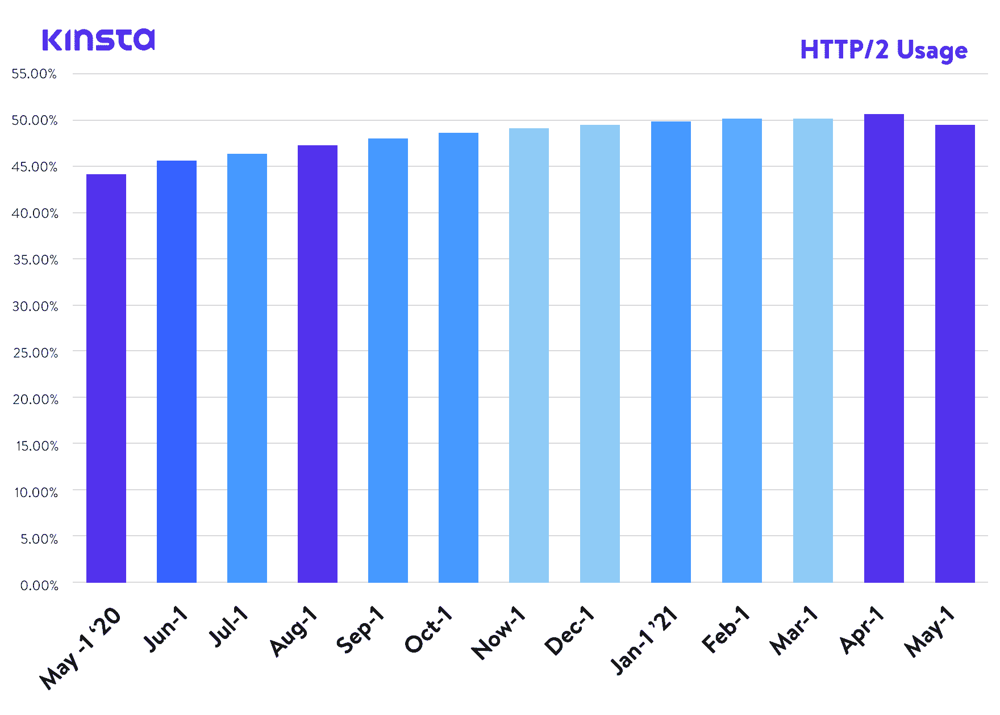
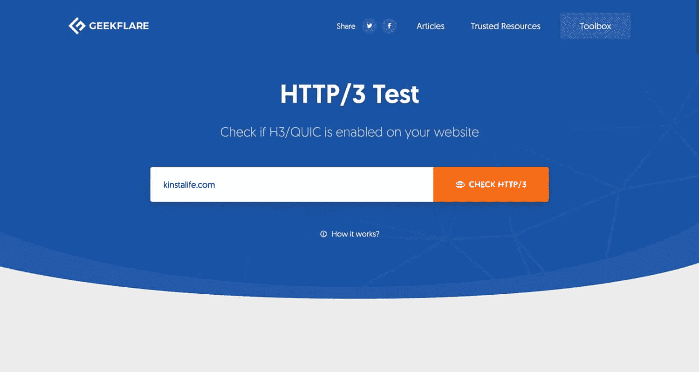
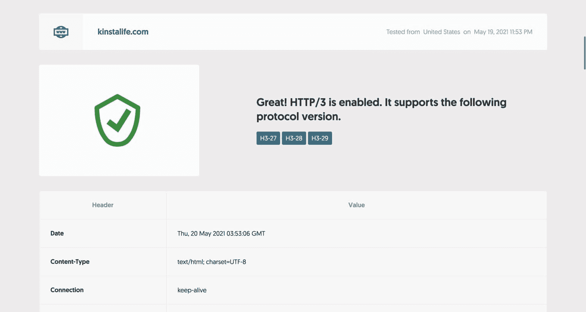
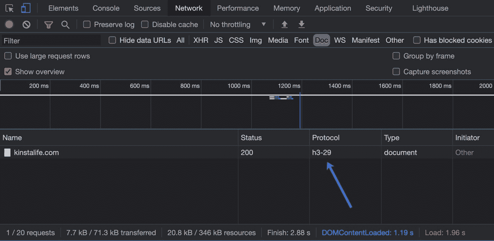
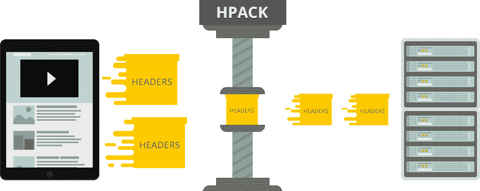
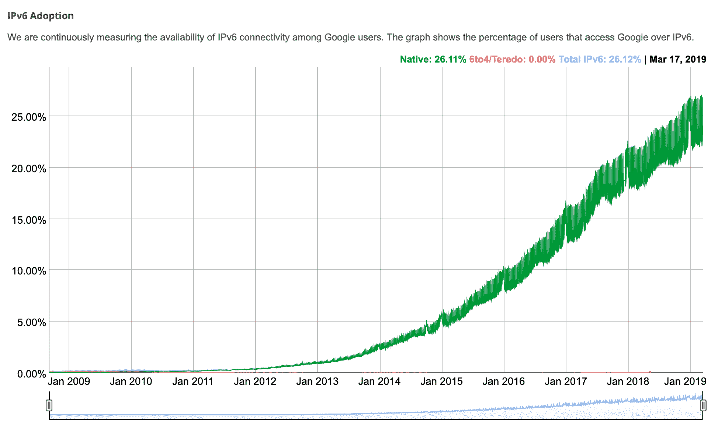
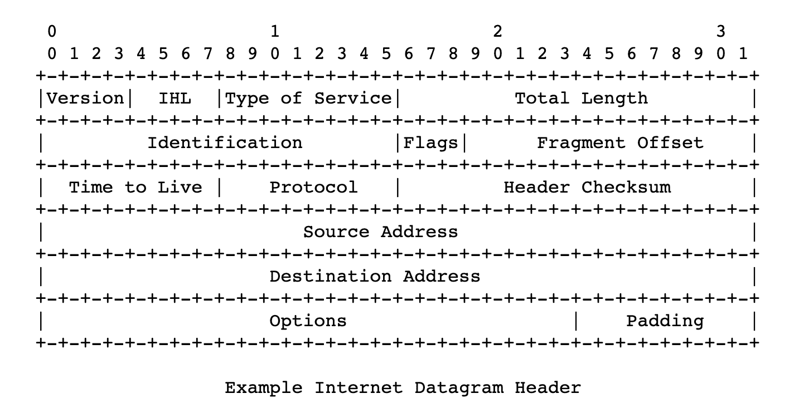
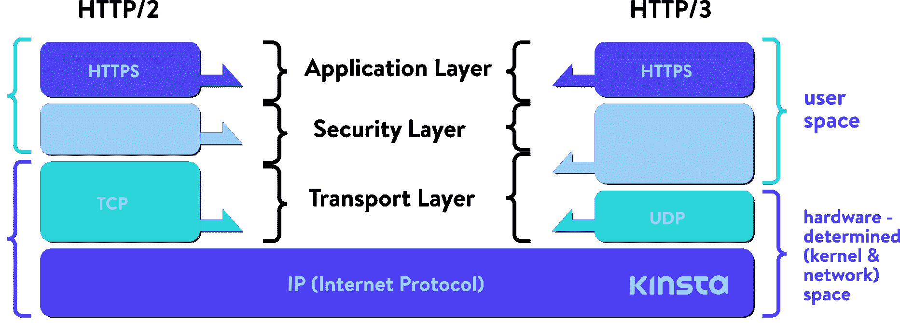
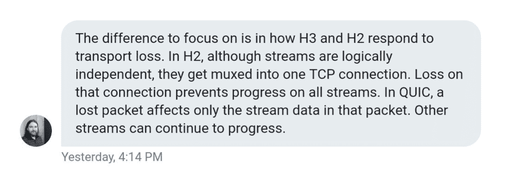

# 什么是 HTTP/3——基于 UDP 的快速新协议的内幕

> 原文:[https://kinsta.com/blog/http3/](https://kinsta.com/blog/http3/)

### TL；速度三角形定位法(dead reckoning)

2018 年 11 月，互联网工程任务组(IETF)在曼谷开会，通过了新的[互联网草案](https://tools.ietf.org/html/draft-ietf-quic-http-17)。QUIC 传输协议，一个 [HTTP/2](https://kinsta.com/learn/what-is-http2/) 的后继者，被重命名为 HTTP/3。

HTTP/3 建立在用户数据报协议(UDP)的基础上，已经被著名的互联网公司如谷歌和脸书所使用。如果你正在使用 Chrome 并连接到谷歌服务，你可能已经在使用 QUIC 了。

新版本的 HTTP 协议受益于裸机、低级 UDP 协议，并在 TCP 层定义了许多以前版本 HTTP 中的新功能。这提供了一种解决现有互联网基础设施中的限制的方法。

第一个结果是有希望的，当 IETF 的互联网草案在 2021 年 8 月到期时，我们可以期待 HTTP/3 被提升为新的第三代 HTTP 标准。

<kinsta-auto-toc heading="Table of Contents" exclude="last" list-style="arrow" selector="h2" count-number="-1">[Just like with HTTP/2, HTTP/3 will again build on these achievements to help speed up the web. 🚀Click to Tweet](https://twitter.com/intent/tweet?url=https%3A%2F%2Fkinsta.com%2Fblog%2Fhttp3%2F&via=kinsta&text=Just+like+with+HTTP%2F2%2C+HTTP%2F3+will+again+build+on+these+achievements+to+help+speed+up+the+web.+%F0%9F%9A%80&hashtags=HTTP3%2Cwebperf)

## 2022 年 HTTP/3 进展

有人说，网络行业对更快速度和更低延迟的渴望只能与谷歌 Chrome 对更多内存的渴望相匹配。

<link rel="stylesheet" href="https://kinsta.com/wp-content/themes/kinsta/dist/components/ctas/cta-mini.css?ver=2e932b8aba3918bfb818">

> 需要在这里大声喊出来。Kinsta 太神奇了，我用它做我的个人网站。支持是迅速和杰出的，他们的服务器是 WordPress 最快的。
> 
> <footer class="wp-block-kinsta-client-quote__footer">
> 
> 
> 
> <cite class="wp-block-kinsta-client-quote__cite">Phillip Stemann</cite></footer>

[View plans](https://kinsta.com/plans/)

几年前，我们[发表了一篇关于 HTTP/2](https://kinsta.com/learn/what-is-http2/) 的文章，根据 W3Techs 的说法，这是一个[的标准，现在已经达到了大约 45%的全球采用率。根据](https://w3techs.com/technologies/details/ce-http2/all/all)[我能使用](https://caniuse.com/#search=http2)吗，所有现代网络浏览器都支持它。然而我们现在正在写一篇关于该协议的下一个版本 HTTP/3 的文章。

HTTP/2 adoption trend.

在撰写本文时，HTTP/3 是一个 [IETF 互联网草案](https://tools.ietf.org/html/draft-ietf-quic-http-18)或 ID，这意味着它目前正在由[互联网工程任务组](https://www.ietf.org/about/)考虑一个即将到来的互联网标准，该任务组是一个国际*互联网标准机构*，负责定义和推广商定的互联网协议标准，如 TCP、 [IPv6](https://kinsta.com/blog/ipv4-vs-ipv6/) 、VoIP、物联网等。

它是一个开放的组织，联合了网络产业，促进了关于互联网发展方向的讨论。目前，HTTP/3 的“互联网草案”阶段是提案提升到征求意见(或[RFC](https://www.ietf.org/blog/how-read-rfc/))级别之前的最后一个阶段，我们可以考虑，出于所有意图和目的，正式的互联网协议定义。

尽管 HTTP/3 还不是官方的互联网协议，但是许多公司和项目已经开始在他们的产品中加入 HTTP/3 支持。

<link rel="stylesheet" href="https://kinsta.com/wp-content/themes/kinsta/dist/patterns/featured-snippet.css?ver=264ec3d754b6bff57ae9">

## 什么是 HTTP/3——通俗地说

HTTP/3 是超文本传输协议(HTTP)的第三个版本，以前称为 HTTP-over-QUIC。QUIC(快速 UDP 互联网连接)最初由 Google 开发，是 HTTP/2 的继任者。谷歌和脸书等公司已经在使用 QUIC 来提高网络速度。

Support

### Web 浏览器对 HTTP/3 的支持

在[网页浏览器前端](https://caniuse.com/http3)，Chrome v87、Firefox v88、Edge v87 都默认开启了 HTTP/3。对于 Safari 用户，Safari 技术预览版 v104 中增加了启用 HTTP/3 的选项。但是，目前 Safari 的稳定版本不支持 HTTP/3。
T3】

### HTTP/3 的库支持

对于希望利用 HTTP/3 技术的开发人员来说，许多流行的库已经增加了对 HTTP/3 的支持。由于 HTTP/3 仍处于 Internet 草案阶段，所以在使用下面的某个库时，您需要确保自己了解最新的更新。

*   python-[http 3](https://pypi.org/project/http3/)和 [aioquic](https://pypi.org/project/aioquic/)
*   rust-[乳蛋饼](https://github.com/cloudflare/quiche)、[奈乔](https://github.com/mozilla/neqo)和[奎因](https://github.com/quinn-rs/quinn)
*   c-[nghttp 3](https://github.com/ngtcp2/nghttp3)和 [lsquic](https://github.com/litespeedtech/lsquic)
*   go-[quicgo](https://github.com/lucas-clemente/quic-go)
*   JavaScript-[node . js](https://kinsta.com/knowledgebase/what-is-node-js/)

### 对 HTTP/3 的基础设施支持

在基础架构方面，Cloudflare 在其整个边缘网络中对 HTTP/3 的支持一直处于领先地位。这意味着启用了 Cloudflare 的站点可以利用 HTTP/3 的安全性和性能增强，而无需任何额外工作。

在 Kinsta，我们托管的所有站点都受到我们的免费 Cloudflare 集成的保护。除了企业级防火墙和 DDoS 保护，Kinsta 客户还可以访问 HTTP/3！

要测试你的站点是否支持 HTTP/3，可以使用 [Geekflare 的 HTTP/3 测试工具](https://gf.dev/http3-test)。只需输入你的域名并按下“检查 HTTP/3”按钮，该工具会让你知道你的网站是否支持 HTTP/3。

Geekflare HTTP/3 testing tool.

如果您的站点支持 HTTP/3，您应该会看到如下所示的消息。由于 kinstalife.com 托管在 Kinsta 上，HTTP/3 由于我们的 Cloudflare 集成而得到完全支持。

Kinsta supports HTTP/3 connections.

您也可以使用浏览器的检查器来检查 HTTP/3 支持。对于这个例子，我们将使用支持 HTTP/3 的最新版本的 Google Chrome。

要打开检查器，右键单击页面，然后单击“检查”并导航到“网络”选项卡。在“协议”列中，您可以看到用于连接的 HTTP 协议。HTTP/2 连接显示为“h2”，而 HTTP/3 连接显示为“H3-XX”(XX 指特定的 HTTP/3 草案)。如下图所示，kinstalife.com 支持通过“h3-29”的连接，这意味着“HTTP/3 Draft 29”。

Chrome supports the h3-29 protocol.

现在我们已经讨论了 HTTP/3 的现状，让我们深入探讨一下 HTTP/2 和 HTTP/3 之间的一些区别！
<kinsta-advanced-cta language="en_US" type-int-post="42574" type-int-position="1"></kinsta-advanced-cta>

## 一点背景知识——它始于 HTTP/2

HTTP/2 在[非阻塞下载、流水线和服务器推送](https://www.sitepoint.com/http2-background-performance-benefits-implementations/)方面带来了一些重大改进，帮助我们克服了底层 TCP 协议的一些限制。它允许我们最小化请求-响应周期和握手的数量。

HTTP/2 使得在一个 TCP 连接中推送多个资源成为可能——多路复用。我们在静态下载排序方面也获得了更多的灵活性，我们的页面现在不再受下载量线性增长的限制。

HTTP/2 push

实际上，这意味着现在一个大型 javascript 资源并不一定等于所有其他等待轮到它们的静态资源的瓶颈。

No pipelining vs pipelining (Image source: [Wikipedia](https://commons.wikimedia.org/wiki/File:HTTP_pipelining2.svg#/media/File:HTTP_pipelining2.svg), Author Mwhitlock)

再加上 HTTP/2 的头包压缩和数据传输的默认二进制格式，在许多情况下，我们有了一个更有效的协议。

HTTP/2 HPACK compression

主要的浏览器实现要求网站实现加密(SSL ),以便能够获得 HTTP/2 的好处，有时这会产生计算开销，导致速度提高不明显。甚至有些情况下，用户报告在转换到 HTTP/2 后速度变慢。

这么说吧，早期采用这个版本并不是为了心脏虚弱的人。

Nginx 实现也缺乏服务器推送特性，依赖于一个模块。并且 [Nginx 模块不是你通常可以复制的 Apache 插件模块](https://kinsta.com/blog/nginx-vs-apache/)——Nginx 必须重新编译。

虽然这些问题中的一些现在已经解决了，但是如果我们看一下整个协议栈，我们会发现主要的约束存在于比 HTTP/2 更低的层次上。

为了详细说明这一点，我们将从底层到顶层剖析当今的互联网协议栈。如果你想了解更多关于 HTTP/2 的背景知识，一定要看看我们的[终极 HTTP/2 指南](https://kinsta.com/learn/what-is-http2/)。
T3】

## 互联网协议(IP)

互联网协议(IP)定义了整个互联网拓扑的底部。我们可以有把握地说，这是互联网堆栈的一部分，如果不改变一切，包括更换整个硬件基础设施，从路由器到服务器，甚至是最终用户的机器，就真的没有商量余地。

因此，尽管协议改革可能已经到了，但如此深远的努力目前还没有出现，主要是因为我们还没有找到可行的、突破性的、向后兼容的替代方案。

我们可以将 IP 协议的起源追溯到 1974 年，追溯到电气和电子工程师协会发表的一篇论文，作者是温顿·瑟夫和鲍勃·卡恩。它详细描述了通过网络发送的数据包，通过 IP 地址路由它们，以及一个/多个网络中节点的数字定义地址。该协议定义了这些数据包或数据报的格式——报头和有效载荷。

在 1980 年的 RFC 760 T1 定义之后，IETF 在其 T2 的 791 T3 征求意见稿中采用了广泛使用的定义。这是该协议的第四个版本，但我们可以说这是第一个生产版本。

Internet Protocol (Image source: [RFC791](https://tools.ietf.org/html/rfc791))

它使用 32 位地址，这将地址数量限制在 40 亿左右。这种限制解释了为什么非商业互联网用户通过他们的 ISP 获得“动态 IP 地址”,而静态 IP 被认为是一种“附加值”,并经常被收取额外费用。

他们在定量配给。

 ## 注册订阅时事通讯

### 想知道我们是怎么让流量增长超过 1000%的吗？

加入 20，000 多名获得我们每周时事通讯和内部消息的人的行列吧！

[Subscribe Now](#newsletter)

没过多久，人们就意识到 32 位地址是不够的，而且这种短缺迫在眉睫，因此许多 RFC 都试图解决这一问题。尽管这些解决方案在今天被广泛使用，并且是我们日常生活的一部分，但可以肯定地说这些都是黑客行为。

互联网协议第 6 版或 IPv6 作为一种解决这些限制的方式出现，包括逐渐取代之前的版本。它在 1998 年成为 IETF 的标准文档草案，并在 2017 年被提升为互联网标准。

虽然 IPv4 地址空间受到其 32 位地址长度的限制，但是 IPv6 标准被给予 128 位，或者 3.4 * 10 ^ 38 个可能的地址。这应该够我们用一段时间了。

根据谷歌及其用户的 IPv6 连接，截至 2021 年 6 月，IPv6 的采用率刚刚超过 35%。

IPv6 adoption

IP 是互联网栈的基本层，定义了最基本的东西，但不保证传输、数据完整性或传输数据包的顺序。它本身是不可靠的。IPv4 的报头格式提供了报头校验和，传输节点使用该校验和来验证报头的完整性。这使得它不同于 IPv6 版本，后者依赖于底层的链路层，使其速度更快。

Internet Datagram Header (Image source: [RFC791](https://tools.ietf.org/html/rfc791))

## 了解 TCP 和 UDP 的作用

现在是时候探索 HTTP/3 在 TCP 和 UDP 中的位置了。

### 传输控制协议（Transmission Control Protocol）

虽然 IP 是我们今天所有在线通信的底层，但 [TCP(传输控制协议)](https://wikipedia.org/wiki/Transmission_Control_Protocol)是互联网协议套件的高级部分，为互联网的应用层/协议提供 web、邮件、文件传输(FTP)所需的可靠性。

这包括多步连接建立、握手、包的确定顺序和丢失包的重传。它向发送者提供传递的反馈(ack ),等等。还有校验和计算来检测错误。

所有这些都表明了许多使 TCP 成为可靠协议的步骤，使它成为我们今天使用的最臭名昭著的互联网服务的基础。

其规格[可追溯到 1974 年(RFC 675)](https://tools.ietf.org/html/rfc675) 和 [1981 年(RFC 793)](https://tools.ietf.org/html/rfc793) 至今没有实质性的变化。

然而，TCP 提供的可靠性不是没有代价的。握手、交付反馈、订购保证和校验和所需的所有往返开销可能被认为是薄弱和多余的。这使得 TCP 成为现代协议栈的瓶颈。HTTP/2 已经达到了速度提高的平台，可以在 TCP 之上实现。

### 用户数据报协议(User Datagram Protocol)

[用户数据报协议](https://wikipedia.org/wiki/User_Datagram_Protocol) (UDP)也是互联网协议族的一部分，其规范可以追溯到 [1980 年(RFC 768)](https://tools.ietf.org/html/rfc768) 。

顾名思义，它是一种基于数据报的无连接协议。这意味着没有握手，也没有订购或交付的保证。这意味着确保交付、数据完整性和其他事情的任何可能步骤都留给了应用层。这意味着建立在 UDP 之上的应用程序可以根据具体情况挑选它将采用的策略，或者它可以利用[链路层](https://wikipedia.org/wiki/Link_layer)的元素，如校验和，以避免开销。

因为 UDP 就像 TCP 一样广泛存在，所以它可以实现改进，而不需要对连接到互联网的大量设备进行固件更新，也不需要对操作系统进行重大更改。

Struggling with downtime and WordPress problems? Kinsta is the hosting solution designed to save you time! [Check out our features](https://kinsta.com/features/)

> 新协议的部署受到许多防火墙、NAT、路由器和其他中间盒的阻碍，这些中间盒只允许在用户和他们需要到达的服务器之间部署 TCP 或 UDP。–[HTTP/3 解释](https://daniel.haxx.se/http3-explained/)

黑客新闻上的这个[帖子可以帮助我们开始理解在现有网络堆栈上构建新 HTTP 版本背后的原因，而不是重新发明它(尽管还有更多内容)。](https://news.ycombinator.com/item?id=12021195)

UDP 数据包格式规范相当简单，其报头由源端口、目的端口、数据包报头和数据包数据的长度(以字节为单位)以及校验和组成。校验和可用于验证数据包报头和数据部分的数据完整性。

当底层协议层是 IPv4 时，校验和是可选的，而对于 IPv6 是强制的。到目前为止，UDP 已经被用于计算机系统时钟同步( [NTP](https://en.wikipedia.org/wiki/Network_Time_Protocol) )、VoIP 应用、视频流、DNS 系统和 [DHCP 协议](https://wikipedia.org/wiki/Dynamic_Host_Configuration_Protocol)等。

## 快速和 http/3

QUIC(快速 UDP 互联网连接)是谷歌在 2012 年首次部署的。它重新定义了网络层的边界，依赖于较低级别的 UDP 协议，重新定义了“用户空间”中的握手、可靠性特征和安全性特征，从而避免了升级互联网范围系统内核的需要。

HTTP/2 stack vs HTTP/3 stack

就像 HTTP/2 一样，这是由谷歌的 SPDY 或 speedy 引领的一项进步，HTTP/3 将再次建立在这些成就之上。

虽然 HTTP/2 确实给了我们多路复用，并减轻了行首阻塞，但它受到了 TCP 的限制。您可以对多路复用在一起的多个流使用单个 TCP 连接来传输数据，但是当其中一个流发生数据包丢失时，**整个连接(及其所有流)将被** **扣押，**也就是说，直到 TCP 完成它的任务(重新传输丢失的数据包)。

这意味着所有的分组，即使它们已经被发送并且在目的地节点的缓冲器中等待，都被阻塞，直到丢失的分组被重发。Daniel Stenberg 在他的关于 http/3 的书《T2》中称之为“基于 TCP 的线路阻塞”他声称，在 2%的数据包丢失率下，用户会更好地使用 HTTP/1，用六个连接来对冲这种风险。

**QUIC 并不拘泥于此。【QUIC 建立在无连接 UDP 协议上，连接的概念没有 TCP 的限制，一个流的故障不会影响其他流。**

正如 Cloudflare 的 Lucas Pardue 所说:

Lucas Pardue on HTTP/3

由于专注于 UDP *流*，QUIC 实现了多路复用，而不必搭载在一个 TCP 连接上。QUIC 将其*连接*建立在比 TCP 更高的层次上。QUIC 连接中的新流不会被迫等待其他流完成。QUIC 连接还受益于去除 TCP 握手开销，这减少了延迟。

思科的人制作了一个有趣的视频来解释 TCP 的三次握手:

<kinsta-video src="https://www.youtube.com/watch?v=LyDqA-dAPW4"></kinsta-video>

虽然 QUIC 取消了 TCP 可靠性特性，但它在 UDP 层之上进行了弥补，提供了数据包的重新传输、排序等功能。谷歌云平台[在 2018 年为其负载平衡器引入了 QUIC 支持](https://cloudplatform.googleblog.com/2018/06/Introducing-QUIC-support-for-HTTPS-load-balancing.html)，并在全球范围内看到了平均页面加载时间提高 8%的**，在延迟更高的地区高达 13%。**

 **在谷歌 Chrome、YouTube、Gmail、谷歌搜索和其他服务之间，谷歌能够在互联网上部署 QUIC，而无需等待 IETF。谷歌的工程师声称，2017 年，7%的互联网流量已经通过 QUIC 进行。

Google 版本的 QUIC 只关注 HTTP 传输，使用 HTTP/2 语法。来自 IETF 的人(负责标准化 QUIC 的人)认为 IETF 版本的 QUIC 应该能够传输不仅仅是 HTTP。然而，目前任何基于 QUIC 的非 HTTP 协议的工作都被搁置了。

IETF 工作组决定的另一件事是，标准化版本将使用 [TLS 1.3](https://kinsta.com/blog/tls-1-3/) 加密，而不是谷歌的定制解决方案。与旧版本相比，TLS 1.3 也有助于提高协议速度，因为它的握手需要更少的往返。 **Kinsta 在我们所有的服务器和我们的 Kinsta CDN 上支持 TLS 1.3。**

目前，谷歌继续在其产品中使用自己的 QUIC 版本，同时将其开发工作引向 IETF 标准。大多数其他互联网公司都是在 IETF 版本的基础上构建的(除了加密之外，这两个版本在其他一些方面有所不同)。

如果我们打开 Chrome 开发工具，在网络选项卡的协议栏中加载一些谷歌的产品，如 Gmail，我们会看到许多资源是通过谷歌版本的 QUIC 协议加载的。谷歌的产品也是如此，比如 Analytics、谷歌标签管理器等。

Google service QUIC

Cloudflare 发布了[一个关于标准化进程的非常广泛的更新](https://blog.cloudflare.com/http-3-from-root-to-tip/)。

虽然 UDP 确实为 QUIC 和 HTTP/3 提供了一些固有的优势，但它也带来了一些挑战。

多年来，TCP 一直是主流协议，而 UDP 则不是，所以操作系统和它的软件栈通常没有优化。因此，QUIC 的 CPU 负载/需求要高得多，据估计是 HTTP/2 的两倍。

优化深入到操作系统的内核，以及不同的路由器和设备固件。这个[红帽调优指南](https://access.redhat.com/sites/default/files/attachments/20150325_network_performance_tuning.pdf)可能会给那些更倾向于技术的人更多的启示。

我们可以说，QUIC 试图在一个更简单、更灵活的协议上重新设计 TCP 特性。

我们前面提到的 QUIC 连接结合了 TLS 和传输握手。一旦建立，它们就由唯一的 cid(连接 id)来标识。这些 id 会在 IP 发生变化时保持不变，并有助于确保不间断下载，例如，从 4G 切换到 WiFi。这是相关的，特别是因为越来越多的互联网流量是在移动设备上进行的。有人可能会问，谷歌设计这一元素是否是为了更好地跟踪不同连接和互联网提供商的用户。

TLS 是强制性的，旨在使中间设备难以篡改或嗅探流量。这就是为什么像 Cisco 这样的防火墙提供商和供应商将 UDP 协议视为一个问题，并提供禁用它的方法的原因。中间人更难检查、监督或过滤 QUIC 流量。

QUIC 流通过单向或双向的 QUIC 连接发送。流具有标识发起者的 id，以及流是单向的还是双向的，并且还提供流内流控制。

QUIC 是传输层协议，而 HTTP 是其上的一层，即应用层协议或应用协议。

由于向后兼容性是最重要的，IETF 促进了 HTTP/3 的实现，并将在响应中包括旧版本(HTTP 1 或 HTTP/2)。它将包含一个报头，通知客户端 HTTP/3 可用，以及端口/主机信息，如 [RFC 7838](https://tools.ietf.org/html/rfc7838) 中所述。

这与 HTTP/2 不同，在 HTTP/2 中，可以在 [TLS 握手](https://kinsta.com/knowledgebase/tls-vs-ssl/)中协商传输。但是由于 IETF 几乎已经采用了基于 QUIC 的 HTTP/3 作为下一个标准，我们可以期待 web 客户机越来越多地支持 HTTP/3。客户端可以缓存以前 HTTP/3 连接的数据，并在以后访问同一主机时直接连接(零往返或 0 RTT)。

## 摘要

有人认为，在 HTTP/2 标准还没有完全被采用的情况下，广泛推广 HTTP/3 还为时过早。这是一个有效的观点，但是，正如我们提到的，这个协议已经经历了大规模的测试和实现。谷歌早在 [2015](https://www.theregister.co.uk/2015/04/17/google_quic_test_results/) 就开始测试，脸书在 [2017](https://code.fb.com/networking-traffic/building-zero-protocol-for-fast-secure-mobile-connections/) 也开始测试。

2022 年，我们将拥有像谷歌 Chrome 和 Brave 这样的主流浏览器对 HTTP/3 的支持。在基础设施方面，像 [Litespeed](https://docs.litespeedtech.com/cp/cpanel/quic-http3/) 和 [Nginx](https://www.nginx.com/blog/introducing-technology-preview-nginx-support-for-quic-http-3/) 这样的 web 服务器都有 HTTP/3 的工作实现，而像 Cloudflare 这样的网络提供商已经部署了[对 HTTP/3 的全面支持](https://blog.cloudflare.com/http3-the-past-present-and-future/)。

此时，HTTP/3 仍处于互联网草案阶段，最近的修订版将于 2021 年 8 月到期。今年将是激动人心的一年，因为我们可以期待看到主要软件供应商实施新标准的举措。

* * *

让你所有的[应用程序](https://kinsta.com/application-hosting/)、[数据库](https://kinsta.com/database-hosting/)和 [WordPress 网站](https://kinsta.com/wordpress-hosting/)在线并在一个屋檐下。我们功能丰富的高性能云平台包括:

*   在 MyKinsta 仪表盘中轻松设置和管理
*   24/7 专家支持
*   最好的谷歌云平台硬件和网络，由 Kubernetes 提供最大的可扩展性
*   面向速度和安全性的企业级 Cloudflare 集成
*   全球受众覆盖全球多达 35 个数据中心和 275 多个 pop

在第一个月使用托管的[应用程序或托管](https://kinsta.com/application-hosting/)的[数据库，您可以享受 20 美元的优惠，亲自测试一下。探索我们的](https://kinsta.com/database-hosting/)[计划](https://kinsta.com/plans/)或[与销售人员交谈](https://kinsta.com/contact-us/)以找到最适合您的方式。**</kinsta-auto-toc>