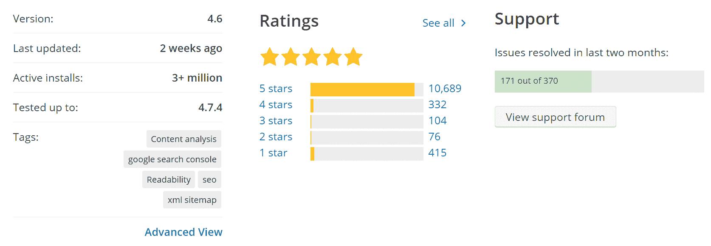
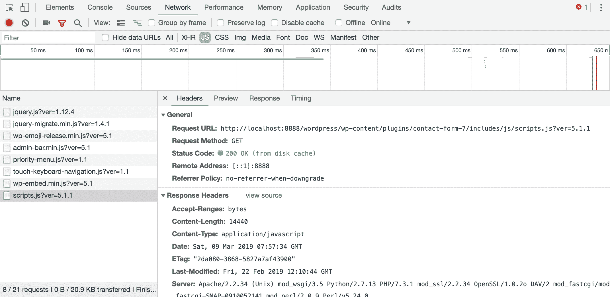
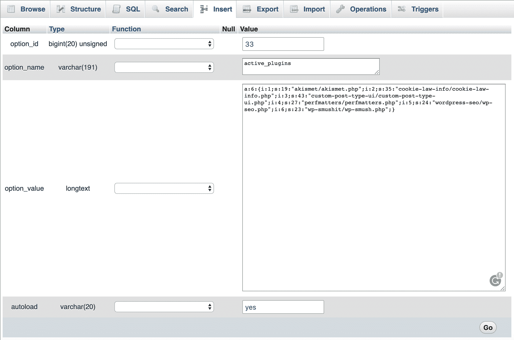
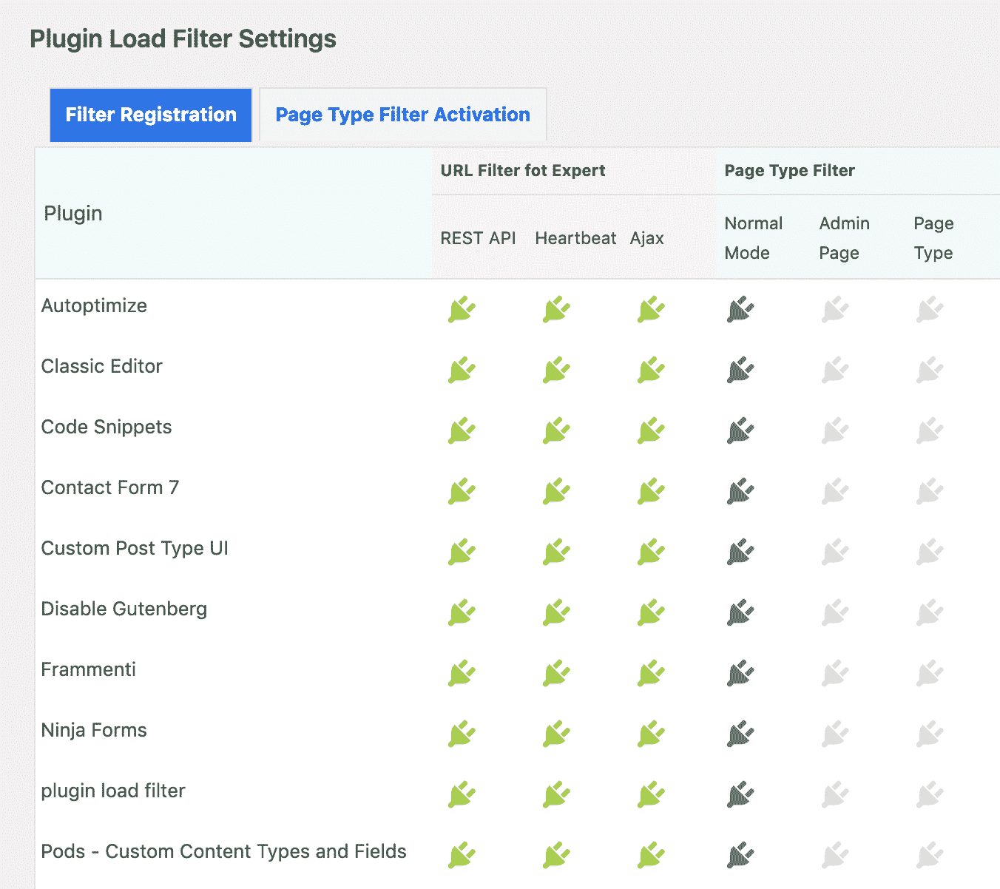
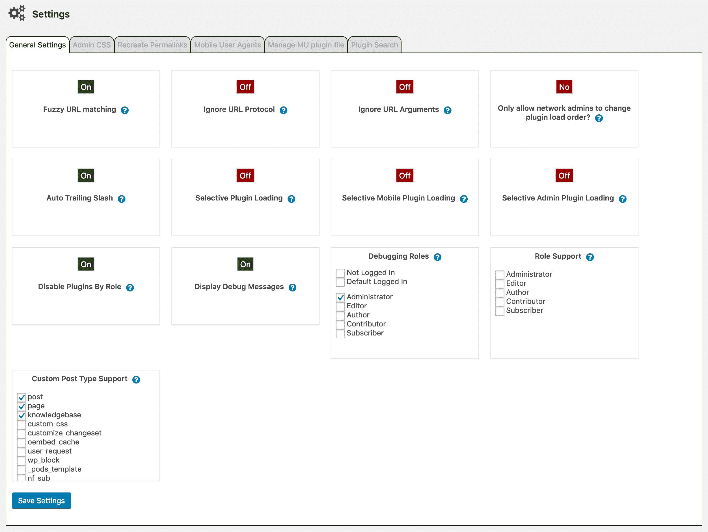
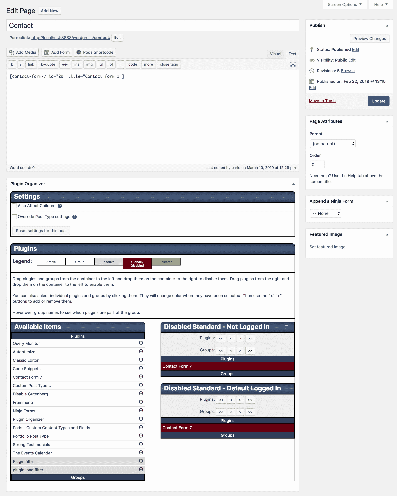

# 如何禁止 WordPress 插件加载到特定的页面和帖子上

> 原文:[https://kinsta.com/blog/disable-wordpress-plugins-loading/](https://kinsta.com/blog/disable-wordpress-plugins-loading/)

说到 WordPress 的性能，我们有很多关于插件的话要说。每个插件都添加了必须执行的 PHP 代码，通常包括脚本和样式，甚至可能针对[数据库](https://kinsta.com/knowledgebase/wordpress-database/)执行额外的查询。这意味着不必要的插件会影响[页面速度](https://kinsta.com/learn/speed-up-wordpress/)，并可能对用户体验和你的页面排名产生负面影响。

举个例子，考虑一个在首页构建和显示定制表单的插件，比如[联系表单 7](https://kinsta.com/blog/contact-form-7/) 。通常，在一个页面上只需要一个表单，但理想情况下，您可能希望使用插件的短代码在任何页面上嵌入一个表单。出于这个原因， [Contact Form 7 在你网站的每个页面](https://contactform7.com/loading-javascript-and-stylesheet-only-when-it-is-necessary/)上加载脚本和样式。

但是你真的想运行插件代码并在你的 WordPress 网站的每一页都包含脚本和样式吗？

在这篇文章中，我将向你展示如何阻止不必要的插件在特定的文章/页面上加载，这样你就可以安装额外的插件(当然不要发疯)，并且仍然让你的 WordPress 网站快速加载。为了完成这个任务，我们将在特定的文章和页面上有计划地禁用 WordPress 插件。这是一个四步流程:

*   [选择最流行的符合自己需求的插件](#rules-choosing-plugin)，比较它们的特性和对页面速度的影响。
*   在页面加载前以编程方式列出并过滤插件。
*   用阿木插件程序过滤和关闭不必要的插件。
*   使用插件过滤并停用不必要的插件。
*   [跟踪现场表现。](#track-performance)

让我们深潜。

## 选择插件时要遵循的三个一般规则

选择插件时，以下通用规则可能会有所帮助:

*   只安装来自可信开发者的编码良好的插件:考虑活跃安装、用户评级、客户支持、更新频率和任何来自 WordPress 社区的有用信息。
*   首选可扩展插件:在性能方面比较类似的插件，利用浏览器开发工具和/或在线服务，如 [Google Pagespeed Insights](https://kinsta.com/blog/google-pagespeed-insights/) 、 [Pingdom](https://kinsta.com/blog/pingdom-speed-test/) 和 [GTmetrix](https://kinsta.com/blog/gtmetrix-speed-test/) 来评估每个插件对页面加载时间的影响。
*   不要安装不必要的插件:这应该是显而易见的，但值得一提的是，出于安全和性能的原因，你永远不应该安装你并不真正需要的插件。此外，确保你不时检查你的插件，并卸载那些你不再需要和使用的插件。



WordPress Plugin Directory provides relevant information we should always take into account when choosing a plugin


### 真实生活的例子

Contact Form 7 是一个很棒的插件，可以在 WordPress 中构建和显示表单。它为我们的目的提供了一个完美的例子，因为它在每个页面上都包含以下文件，即使该页面不包含表单:


> 需要在这里大声喊出来。Kinsta 太神奇了，我用它做我的个人网站。支持是迅速和杰出的，他们的服务器是 WordPress 最快的。
> 
> <footer class="wp-block-kinsta-client-quote__footer">
> 
> 
> 
> <cite class="wp-block-kinsta-client-quote__cite">Phillip Stemann</cite></footer>

[View plans](https://kinsta.com/plans/)

*   style.css
*   脚本. js



Chrome DevTools Network panel provides detailed information about network requests made when a page is loaded


一个插件会降低你网站的速度，但是我们可以强迫 WordPress 根据请求的 URL 有选择地关闭插件。如果你是一名开发人员，请阅读下一部分，在那里我们将学习[如何以编程方式管理插件](#programmatically-list-filter-plugins)并构建过滤不必要插件的阿木插件。如果你不是开发人员，可以随意跳到专用于[插件的部分，它允许过滤和组织插件](#filter-plugins)。

## 如何以编程方式获得所有活动插件的列表

首先，你可以用一段简单的 PHP 代码获得 WordPress 网站上所有活动插件的列表。你可以在自定义插件中添加以下代码，也可以在免费 WordPress 插件的编辑器中添加，比如[代码片段](https://wordpress.org/plugins/code-snippets/)。如果你决定使用自定义插件，不要忘记添加插件头，如下图所示。



Active plugins in wp_options table


每个活动插件都存储在`wp_options`表中，其中`options_name`是`active_plugins`。所以我们可以通过一个简单的`get_option`调用来提取这些插件的列表。代码如下:

```
<?php
/**
 * @package active-plugins
 * @version 1.0
 *
 * Plugin Name: Active Plugins
 * Plugin URI: http://wordpress.org/extend/plugins/#
 * Description: This is a development plugin 
 * Author: Your Name
 * Version: 1.0
 * Author URI: https://example.com/
 */

add_shortcode( 'activeplugins', function(){

	$active_plugins = get_option( 'active_plugins' );
	$plugins = "";
	if( count( $active_plugins ) > 0 ){
		$plugins = "<ul>";
		foreach ( $active_plugins as $plugin ) {
			$plugins .= "<li>" . $plugin . "</li>";
		}
		$plugins .= "</ul>";
	}
	return $plugins;
});
```

更改插件详细信息，然后保存`active-plugins.php`文件并上传到您的`/wp-content/plugins/`文件夹。创建一个新的博客帖子，并包含`[activeplugins]`简称。它现在应该显示所有活动插件的列表。


The list of active plugins shows the folder and the name of each plugin


完成之后，我们可以更进一步，通过利用`option_active_plugins`过滤器以编程方式添加或删除插件。该过滤器属于 [option_$option_name](https://codex.wordpress.org/Plugin_API/Filter_Reference/option_(option_name)) 过滤器组，它允许在从数据库中检索到任何选项后对其进行过滤。由于所有活动插件都存储在`wp_options`表中，其中`option_value`是`active_plugins`，所以`option_active_plugins`过滤器提供了一种以编程方式激活或停用插件的方法。

所以我们可以通过编程激活一个插件。比方说，你想激活 [ACF 插件](https://kinsta.com/blog/advanced-custom-fields/)。代码如下:

```
add_filter( 'option_active_plugins', function( $plugins ){

	$myplugin = "advanced-custom-fields/acf.php";

	if( !in_array( $myplugin, $plugins ) ){
		$plugins[] = $myplugin;
	}

	return $plugins;

} );
```

在这个例子中，我们假设插件已经安装并且还没有被激活。

上面的代码只是将插件添加到我们网站每个页面的活动插件列表中。不是很有用，但是你明白了。

此外，插件应该在任何其他插件之前加载，否则，我们的代码不能像预期的那样工作。为了区分插件加载的优先级，我们必须将脚本添加到一个必须使用的插件中。


## 如何构建一个必须使用的插件来以编程方式停用插件

我们将构建一个[必须使用的插件](https://codex.wordpress.org/Must_Use_Plugins)，它是一个驻留在特定的`/wp-content`子文件夹中的插件，在任何常规插件之前运行。

不幸的是，在这种情况下，我们不允许使用条件标签，因为**条件查询标签在查询运行之前不起作用。在此之前，它们总是返回 false** 。所以我们必须检查我们的条件，比如通过解析请求 URI 和检查相应的 URL 路径。

将以下代码添加到`active-plugins.php`文件，然后将其移动到`/wp-content/mu-plugins`:

```
$request_uri = parse_url( $_SERVER['REQUEST_URI'], PHP_URL_PATH );

$is_admin = strpos( $request_uri, '/wp-admin/' );

if( false === $is_admin ){
	add_filter( 'option_active_plugins', function( $plugins ){

		global $request_uri;

		$is_contact_page = strpos( $request_uri, '/contact/' );

		$myplugin = "contact-form-7/wp-contact-form-7.php";

		$k = array_search( $myplugin, $plugins );

		if( false !== $k && false === $is_contact_page ){
			unset( $plugins[$k] );
		}

		return $plugins;

	} );
} 
```

让我们深入研究这段代码:

*   [parse_url](http://php.net/manual/en/function.parse-url.php) 返回所请求 url 的路径。
*   [strpos](http://php.net/manual/en/function.strpos.php) 查找`'/wp-admin/'`第一次出现的位置，如果没有找到字符串则返回`false`。`$is_admin`变量存储返回值。
*   该条件阻止过滤器在管理面板中运行，因此我们可以安全地访问插件设置页面。如果请求 URI 不包含`'/wp-admin/'`，那么我们调用`option_active_plugins`过滤器。
*   最后，如果当前插件不在活动插件数组中，并且当前页面的 URI 不包含`/contact/`，那么我们从`$plugins`中移除该插件。

现在保存你的插件并上传到你的`/wp-content/mu-plugins/`文件夹。**清空缓存**并将`[activeplugins]`短码添加到几个页面中。它应该只显示在`/contact/`页面的列表中。


The script.js file disappeared from the list of page assets


然后，我们只需要一点额外的 PHP 就可以一次取消插件数组。

```
$request_uri = parse_url( $_SERVER['REQUEST_URI'], PHP_URL_PATH );

$is_admin = strpos( $request_uri, '/wp-admin/' );

if( false === $is_admin ){
	add_filter( 'option_active_plugins', function( $plugins ){

		global $request_uri;

		$is_contact_page = strpos( $request_uri, '/contact/' );

		$myplugins = array( 
			"contact-form-7/wp-contact-form-7.php", 
			"code-snippets/code-snippets.php",
			"query-monitor/query-monitor.php",
			"autoptimize/autoptimize.php" 
		);

		if( false === $is_contact_page ){
			$plugins = array_diff( $plugins, $myplugins );
		}

		return $plugins;

	} );
}
```

在这个例子中，我们首先定义了一个要删除的插件数组，然后用 [array_diff](http://php.net/manual/en/function.array-diff.php) 删除它们。此函数“将 array1 与一个或多个其他数组进行比较，并返回 array1 中不存在于任何其他数组中的值”。

你可以从 Gist 下载[这个插件](https://gist.github.com/carlodaniele/5b8343dd17a64c69d04459bffad2312c)的完整代码。

现在你可以将插件上传到 **mu-plugins** 文件夹，并检查你网站的任何页面。mu 插件可以高度定制，添加更多的条件和检查更多的 URIs，但每个条件都必须手动添加到代码中，从长远来看，这个简单的 mu 插件可能很难维护，也很麻烦。

出于这个原因，你可能想看看下面的插件。

## 过滤插件的插件

作为替代，我们可以看看一些好的插件，允许我们添加可以从 WordPress 管理面板管理的过滤器。

 ## 注册订阅时事通讯


### 想知道我们是怎么让流量增长超过 1000%的吗？

加入 20，000 多名获得我们每周时事通讯和内部消息的人的行列吧！

[Subscribe Now](#newsletter)

### 插件加载过滤器

[插件加载过滤器](https://wordpress.org/plugins/plugin-load-filter/)是 WordPress 用户在几种情况下需要过滤插件的免费选项。



Plugin Load Filter allows to filter plugins in admin panel as well as in site pages


目前，它支持以下功能:

*   帖子格式
*   自定义帖子类型
*   [喷气背包](https://kinsta.com/knowledgebase/wordpress-jetpack/)模块
*   WP 嵌入式内容卡
*   专家 URL 过滤器(REST API / Heartbeat / AJAX / AMP / etc)

一旦过滤器被激活，管理员用户可以指定它在站点中的应用位置，如下图所示。


Once the filter has been activated, site admins can set their exceptions in Page Type Filter Activation tab


### 插件管理器

[插件管理器](https://wordpress.org/plugins/plugin-organizer/)是一个受欢迎的插件，拥有超过 10，000 个活跃安装和令人印象深刻的 5 星评级。这是一个更全面的插件，允许网站管理员:

*   通过帖子类型和请求 URL 选择性地停用插件
*   通过[用户角色](https://kinsta.com/blog/wordpress-user-roles/)有选择地停用插件
*   创建插件组
*   更改插件加载顺序
*   附加功能



Plugin Organizer Settings page


全局插件选项页面提供了一个拖放工具，允许管理员用户全局禁用插件，防止 WordPress 在站点的任何地方运行一个或多个插件，除非它是为单个帖子或页面指定的。同样的功能也适用于搜索页面和文章类型。


CF7 has been globally disabled


该插件在文章编辑界面中添加了一个元框，这样管理员就可以覆盖全局和文章类型设置。通过在常规设置屏幕中选择相应的项目，也可以为文章类型激活此功能。一个很棒的特性是插件组织者调试消息，它为站点管理员提供了关于影响每个站点页面的插件的有用信息。

更多信息可以在他们的[文档](https://www.sterupdesign.com/dev/wordpress/plugins/plugin-organizer/documentation/)中找到。



Plugin Organizer custom metabox on the contact page


### 性能插件

一种部分不同的方法来自于 [Perfmatters](https://perfmatters.io) 插件。这是一个额外的选择，允许网站管理员根据 URL 或自定义帖子类型有选择地加载主题和插件资产。这是一个插件和主题优化的好工具。事实上，它是由来自 Kinsta 的团队成员开发的！

Struggling with downtime and WordPress problems? Kinsta is the hosting solution designed to save you time! [Check out our features](https://kinsta.com/features/)


Perfmatters script manager


这个插件有一个叫做脚本管理器的特性，在这里所有的东西都被插件或者主题名组合在一起。这使得一次性禁用整个插件，或者其中的单个 [CSS](https://kinsta.com/blog/wordpress-css/) 和 JavaScript 文件变得非常容易。

你甚至可以用 regex 禁用脚本。这对于具有更复杂的 URL 结构或动态生成页面的站点尤其有用。

这是非常强大的，可以大大提高你的 WordPress 站点(尤其是你的主页)的速度。这可以用来做什么的几个例子:

*   社交媒体共享插件应该只加载在你的帖子上。你可以很容易地在任何地方禁用它，只加载文章类型，甚至自定义文章类型。
*   流行的 Contact Form 7 插件会在每个页面和帖子上加载自己。你可以很容易地禁用它，只在你的联系人页面上启用。
*   如果你已经升级到了 [WordPress 5.0](https://kinsta.com/blog/wordpress-5-0/) ，但是没有使用 Gutenberg block editor，也许你还在使用 classic editor，这里有两个额外的前端脚本，你可以禁用它们:`/wp-includes/css/dist/block-library/style.min.css`和`/wp-includes/css/dist/block-library/theme.min.css`

从这个[对性能问题](https://woorkup.com/disable-scripts-wordpress/)的回顾中可以看出，**将它们的总加载时间减少了 20.2%** 。仅在他们的主页上，他们就能够[将 HTTP 请求的数量](https://kinsta.com/blog/make-fewer-http-requests/)从 46 个减少到 30 个！页面大小也从 506.3 KB 缩减到 451.6 KB。


Speed test with perfmatters plugin


> 使用[@ _ perfmates](https://twitter.com/_perfmatters?ref_src=twsrc%5Etfw)节省了 25%(和 500KB)的总页面大小——这是在使用插件管理器进行大量优化后实现的。我很震惊，通过微调每页下载的 js/css，我节省了多少。
> 
> —凡妮莎(@科技诗人)[2019 年 3 月 14 日](https://twitter.com/technologypoet/status/1106076464875659264?ref_src=twsrc%5Etfw)