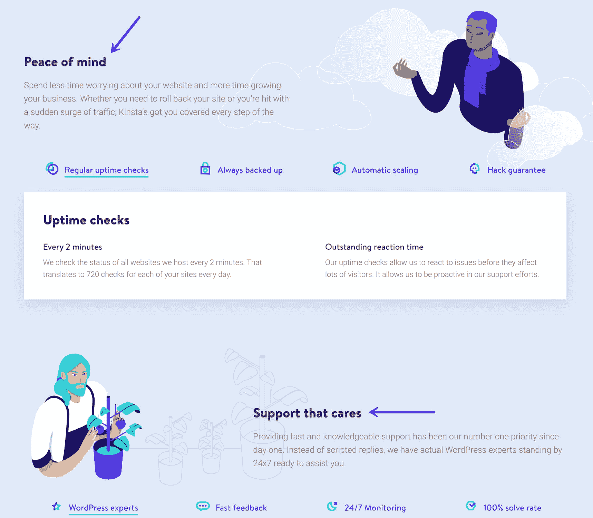
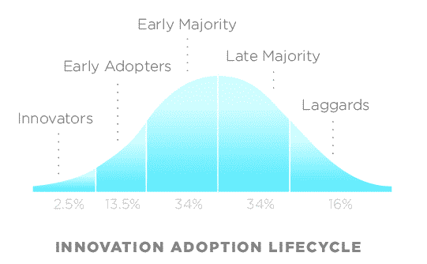
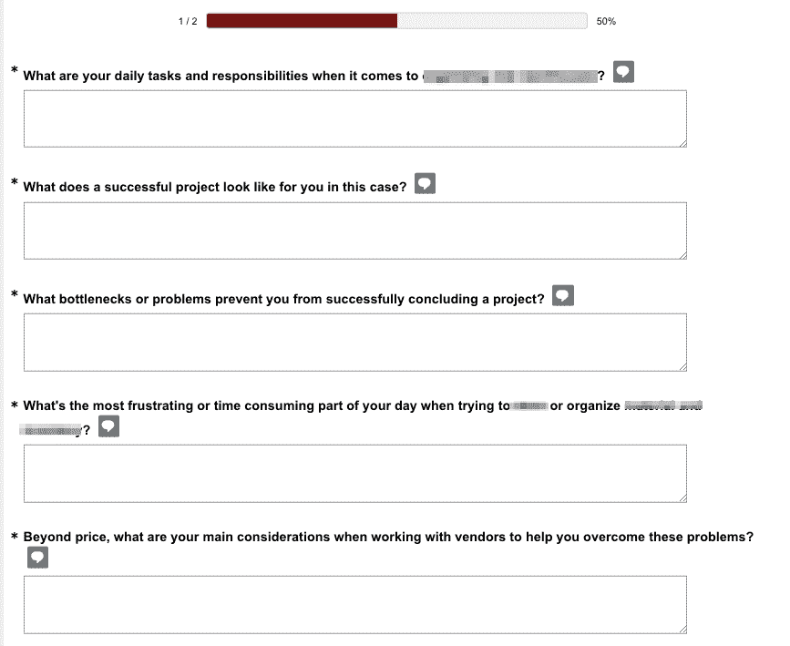
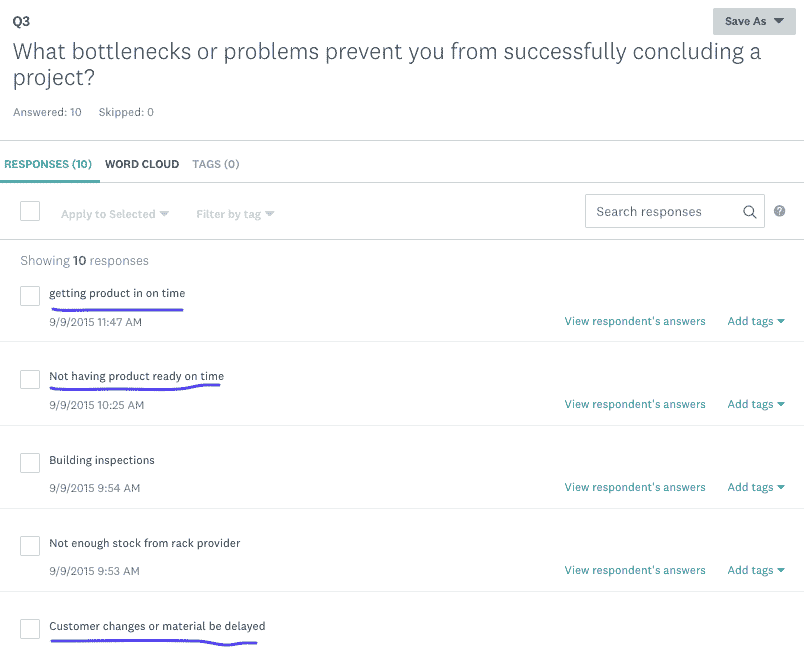
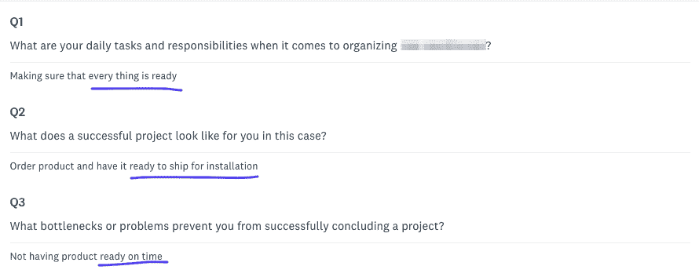
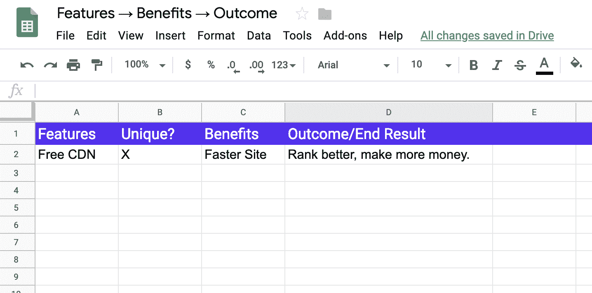
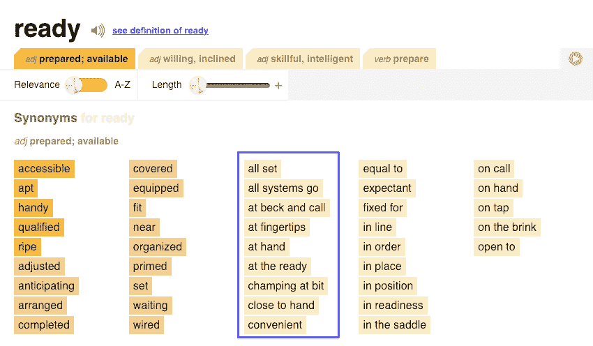
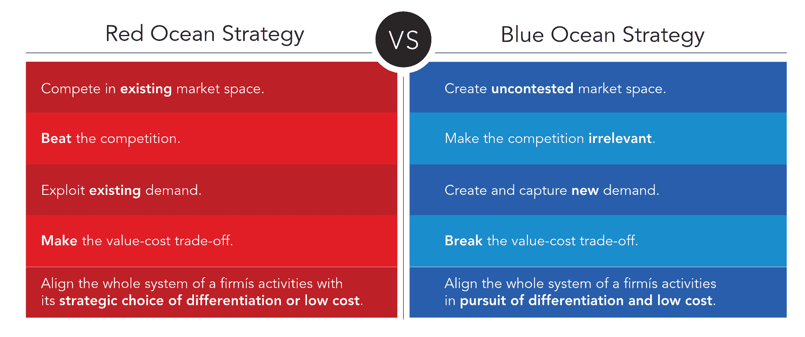
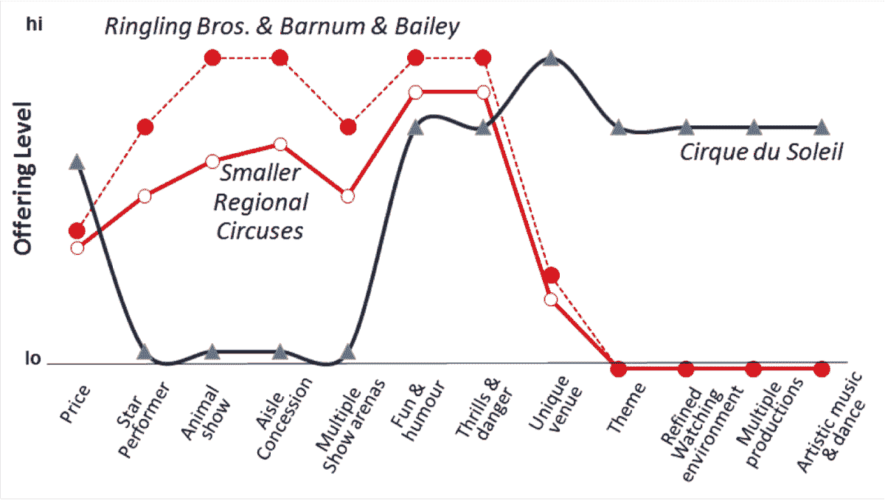
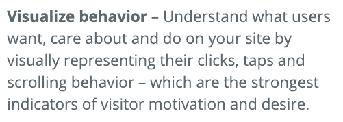

# 营销特点与优势——您使用的方法是否正确？

> 原文:[https://kinsta.com/blog/features-vs-benefits/](https://kinsta.com/blog/features-vs-benefits/)

古老的销售谚语说，事实说话，故事销售。

不幸的是，现实中并没有那么简单。尤其是在更多的技术产品或空间中，人们需要确切地知道他们正在得到什么。

因此，当谈到营销功能与优势时，你必须走钢丝。你需要突出具体的特点，这样精明的买家就可以很容易地看出你是如何比较的，同时不要疏远那些可能不关心你所卖商品的复杂性的主流买家。

走得太远，你就会遇到问题。但这也可能导致许多其他问题，比如迫使你在价格上竞争，因为你吹嘘的营销功能与你的客户可能看到的好处没有共鸣。

以下是这种情况经常发生的原因，以及如何通过**将您的功能转化为客户乐意支付更多的利益**和结果来一劳永逸地避免这种情况。

*   你的公司在价格上竞争吗？
*   [如何改进你的客户研究](#customer-research)
*   [如何最终将所有功能转化为收益](#features-into-benefits)

[营销你的特色至关重要。但是您需要向您的客户展示优势和价值/成果！💥 点击推文](https://twitter.com/intent/tweet?url=https%3A%2F%2Fkinsta.com%2Fblog%2Ffeatures-vs-benefits%2F&via=kinsta&text=Marketing+your+features+is+essential.+But+you+need+to+demonstrate+the+benefit+and+value%2Foutcome+to+your+customers%21+%F0%9F%92%A5&hashtags=marketing%2CCRO)

## 你的公司在价格上竞争吗？

还记得十年前购买虚拟主机的情况吗？

你输入了一些大人物的领域。您滚动查看了计划和定价是如何划分的。你基本上需要一个工程学位来加密它，即使他们都在运行 cPanel/WHM。🤣

> Kinsta 把我宠坏了，所以我现在要求每个供应商都提供这样的服务。我们还试图通过我们的 SaaS 工具支持达到这一水平。
> 
> <footer class="wp-block-kinsta-client-quote__footer">
> 
> 
> 
> <cite class="wp-block-kinsta-client-quote__cite">Suganthan Mohanadasan from @Suganthanmn</cite></footer>

[View plans](https://kinsta.com/plans/)

计划 X、Y 和 Z 只是根据它们之间的带宽或存储的总大小来划分的。然而，大多数非技术消费者对带宽如何转化为他们的站点需求一无所知。

那么他们做了什么？当然是默认最便宜的选项！

不仅仅是一个公司的计划，而是整个行业。如果竞争对手 A 的带宽或存储与竞争对手 B 的相当，但便宜 10 美元？最便宜的公司会赢。

那是因为他们陷入了功能竞争，而不是利益竞争。

谢天谢地，今天情况有所改善。查找新主机时，会有大量选项，从必须指定的功能，到每个功能对客户的意义。当我们在 2017 年[重新推出我们的网站](https://kinsta.com/blog/new-kinsta/)时，我们对这个话题进行了很多思考。我们想营销什么？特点或好处。

如果您访问我们的主页或[专题页面](https://kinsta.com/features/)，您会发现我们试图**关注优势**，使用的术语有:

*   高枕无忧，按需扩展，终极速度，像诺克斯堡一样安全。
*   关心他人的支持，无需排队等候支持，没有解决不了的问题。
*   用户友好但功能强大，由开发人员为开发人员构建。

Marketing benefits vs features

[竞争到底](https://kinsta.com/blog/race-to-the-bottom/)和仅仅在功能和价格上竞争的问题是双重的。

1.  注重成本的消费者忠于价格，而不是品牌。这就是为什么 Expedia 上的酒店尽可能降低价格，看起来很便宜，但却在顾客入住时以每天 50 美元的度假费用欺骗他们。问题是，它训练客户在他们的星级偏好中寻找最低的标价，而不是通过名字或声誉来寻找你的品牌。
2.  价格竞争也侵蚀了利润，随着时间的推移，这实际上对公司产生了反作用，因为它减少了他们可以再投资于提高产品质量的利润。这意味着从长远来看，你的产品或服务会变得越来越差，破坏客户保持和真正的口碑推荐，从而发展一个大的、[持久的业务](https://kinsta.com/blog/recurring-revenue-model/)。

不幸的是，当你在功能上严格竞争时，你经常会陷入无人区。你不可能通过收取溢价来推动未来的增长。但你也无法抢占市场份额，因为总会有更大的公司可以对这些功能进行基准测试，并降低你的价格。

幸运的是，有一个解决方案。这其实很简单。

咨询巨头[麦肯锡](https://www.mckinsey.com/business-functions/marketing-and-sales/our-insights/how-b2b-companies-talk-past-their-customers)发现大多数 B2B 公司都犯了**的严重错误，即优先考虑客户实际上并不太关心的事情**。他们从不同行业的各种形状和大小的企业公司中挑选，并能够编辑出一个非常一致的观点。然后，他们对 700 名高管进行了调查，以确定*如何*和*为什么*购买。

所有这些公司都喜欢宣扬社会责任、可持续性和全球影响力。然而，这些似乎对购买者对品牌实力的感知影响甚微。

然而，更令人担忧的是相反的情况:

> 反之亦然:顾客对品牌实力认知的两个最重要的主题——有效的供应链管理和专业的市场知识——是 B2B 供应商最少提及的。

不过，最后一个很有趣。

> 客户认为最重要的诚实和开放的对话是我们样本中 90 家公司根本没有强调的三个主题之一。除了这些脱节，我们的分析显示，领先的 B2B 公司强调的品牌主题之间有着惊人的相似性，这表明人们倾向于从众，而不是创造出强烈的差异化品牌信息。

所有这些研究使麦肯锡得出结论:大多数 B2B 公司都绕过他们的客户 。换句话说，他们说了很多实际上没有那么多的东西，客户基本上不太关心。

B2B companies talking past customers (Image source: McKinsey & Company)

类似的研究显示了完全相同的问题。CMO.com 报道的一项研究发现:

> 79%的顾客表示，在他们考虑购买之前，品牌必须证明他们理解并关心我。

换句话说，他们需要帮助将他们的技术术语翻译成客户真正理解(和重视)的东西。

比如你还记得 Windows RT 吗？大概不会。

Windows RT (Image source: [ExtremeTech](https://www.extremetech.com/computing/159838-windows-rt-8-1-still-slow-still-plagued-by-the-desktop-still-useless))

那是因为它实际上存在的时间并不长。它基本上放弃了你能想到的每一个类别，包括速度、性能、差异化和集成。

然而，主要的问题是，它从来没有定义它是为谁服务的，以及它如何帮助他们。通过[当时的寄存器](http://www.theregister.co.uk/2013/01/18/7_reasons_windows_rt_was_doa/?page=1):

> 尽管 Windows RT 有很多缺点，但如果 Redmond 成功地传达了它的受众是谁，它可能还有机会。但它没有。Surface RT 发布三个月后，仍然很难说 RT 设备的目标市场是谁。

值得称赞的是，Windows 自己解释说，他们在解释 Windows RT 和 Windows 8 有何不同方面做得不够。

问题是，随着时间的推移，这变得更加棘手。当你跨越鸿沟时，你定位产品的方式与你进入主流时大不相同。(比如说，虚拟主机！)

因此，你不仅要担心一种产品相对于所有其他产品在市场上的定位。您还必须找出在整个技术生命周期采用范围内为人们定位产品的最佳方式。

Innovation Adoption Lifecycle (Image source: [Wikipedia](https://en.wikipedia.org/wiki/Technology_adoption_life_cycle))

创新者可能会因为与主流消费者完全相反的原因而喜欢一种产品。

开发者可能希望他们的虚拟主机账户有更多的高级功能(最新版本的 PHP，SSH 等)。)，而非技术业务人员可能希望相反，这样他们就不会意外地搞砸任何事情(自动备份、免费 SSL、24/7 支持)。

解决这个问题的唯一方法是通过**更好地理解客户为什么做出他们所做的决定**。以下是我们发现的有用信息。

## 如何改进你的客户研究

大多数公司都知道他们的客户是谁。他们了解人口统计，如年龄范围、地点等。不幸的是，当试图确定*他们为什么购买*时，这些信息几乎毫无用处。

心理学帮助你发现这些主要的激励因素。但是收集这种洞察力通常很困难(也很昂贵)。不过，这个过程不一定那么具有挑战性。以下是基本步骤:

*   第一步:你最好的客户在哪里，他们将你的产品/服务视为投资，而不是成本？
*   **第二步:**在深入探讨*为什么你*之前，首先弄清楚他们为什么购买你的产品/服务。在主机方面，首先是为什么[管理的 WordPress 主机](https://kinsta.com/blog/managed-wordpress-hosting/)比共享主机或 DIY 更好。然后，到了[为什么 Kinsta](https://kinsta.com/why-us/) vs 任何其他主机，像 [WP 引擎](https://kinsta.com/wp-engine-alternative/)、[场地](https://kinsta.com/siteground-alternative/)、[飞轮](https://kinsta.com/flywheel-hosting-alternative/)和[可压](https://kinsta.com/pressable-alternative/)。
*   **第三步。**回顾一个人的一天，找出他们想做什么，想完成什么，以及是什么阻碍了他们。

这包括从[客户评价](https://kinsta.com/kinsta-reviews/)到[客户访谈](https://kinsta.com/blog/customer-retention/)甚至[网站可用性测试](https://kinsta.com/blog/website-usability-testing/)的一切。简单的调查也可以。

你想回答的问题是:

*   人们想要什么？
*   为什么他们得不到？
*   你的产品如何帮助他们克服这个障碍？

以下是我们之前用来从客户那里获取这些信息的确切提问顺序:

What customers want

换句话说，它在问:

1.  你生活中的一天是什么样子的？
2.  你的首要任务和责任是什么？
3.  “成功”是什么样子的？
4.  你为什么会取得这样的成功？
5.  这些延迟或障碍的最大问题是什么？
6.  您如何评价这些延迟或障碍的解决方案？

简单吧？你所需要的是最多 5-7 个问题。你可以开始看到基于人们反应的模式匹配。当然，这些可能会因您所在的行业而异。

这里有一个与房地产相关的例子，突出了完成一个成功项目的一些最大的难点。查看来自不同人的含糊不清的答案:

Bottleneck answers

啊。现在我知道他们想要什么了！我知道“及时准备好产品”对他们来说可能比再节省 5%更有价值。

您还可以深入研究每个人的回答，看看他们是如何依次回答所有问题的:

Responses

嗯…听起来他们很在乎截止日期！

这不完全是火箭科学。你所做的只是揭示他们真正的动机(他们购买的原因)，而不是你认为他们可能感兴趣的东西。

然后，当谈到定位您的产品时，您只需向他们重复他们刚刚告诉您的内容。

诀窍是在重新评估你的特征时加入“这样”。在电子表格的左边，记下你所有的关键产品特性。仔细检查竞争对手，确保他们是独特的或与众不同的。

 ## 注册订阅时事通讯

### 想知道我们是怎么让流量增长超过 1000%的吗？

加入 20，000 多名获得我们每周时事通讯和内部消息的人的行列吧！

[Subscribe Now](#newsletter)

然后回答“以便”首先将功能转化为客户利益，然后是结果或具体示例。

Features, benefits, and outcome

以下是 WordPress 托管的情况:

1.  **特色**:免费 CDN。
2.  **好处**:你的站点会更快。
3.  结果:你会排名更高，赚更多的钱，降低跳出率。

如果“按时准备”是上面房地产调查中的一个热点问题，你可以交叉引用你的特性列表来查看帮助那个人按时交付产品的所有属性，不管是什么。

然后你可以用“交钥匙”或任何相关短语或同义词改写登陆或定价页面:

Synonyms

“随叫随到”、“触手可及”等。都是不错的选择。

*特色 XYZ 随时为您服务，因此产品将按时交付，您再也不会有另一个成本高昂的项目超支。*

你的应用或服务的成本——无论多贵——与项目超支或失去业务的最终成本相比，几乎总是相形见绌。所以现在你的价格对他们来说是保护未来收益的投资。不仅仅是另一项单项支出。

让我们看看其他几个现实生活中的例子。这里有一个电子邮件营销平台，隐藏名字是为了保护无辜。

Benefit example

不太令人信服，对吧？

这是一次勇敢的努力。但问题是，只有最书呆子的客户才真正关心“有针对性的电子邮件自动化”大多数人只是想要“定向电子邮件自动化”能带给他们的东西。

现在，将其与 MailChimp 的“电子邮件自动化”进行比较:

Good benefit example

这足以让任何优秀的[抄袭黑客](https://copyhackers.com/)喜极而泣:

1.  “自动化您繁忙的工作”
2.  “永远在线营销”
3.  “在正确的时间向正确的人传达正确的信息”
4.  “每次都不做工作”

太美了。所有这些的要点是将一切归结为你可以在整个网站上一致使用的信息。

它(应该)从客户研究开始。不是人口统计，而是潜在的购买动机。然后，你可以用另外三个技巧来建立这个早期的工作。

## 如何最终将所有功能转化为优势

将功能转化为优势是一个漫长的过程。但是，使用客户研究来推动下面三个技巧可以帮助你更快、更顺利地完成转变。

1.  [调整你的定位，使“价值”具体化](#value)
2.  [不要用行话淡化你的价值主张](#jargon)
3.  [你总是可以依靠 PAS 公式](#pas-formula)

### 技巧 1:微调你的定位，使“价值”具体化

不可否认，蓝海战略非常理论化。但是思考练习确实提供了一个有用的框架，让你思考如何重新定义顾客从你的产品中获得的价值。

Struggling with downtime and WordPress problems? Kinsta is the hosting solution designed to save you time! [Check out our features](https://kinsta.com/features/)

这样做的目的是避免与竞争对手正面直接竞争。至少，避免在你永远无法击败他们的地方与他们正面竞争。

回到价格上来。在你的领域里，你不可能比那些最大的人价格更低。例如，我们永远也不可能比得上 GoDaddy 的价格，也不想这样做。你无法超越亚马逊亚马逊。

但是你可以改变游戏规则。你可以在几个领域翻翻剧本，选择把市场的某些部分让给他们，因为你要专注于几个别人跟不上的领域。

Red Ocean Strategy vs Blue Ocean Strategy (Image source: [Blue Ocean](https://www.blueoceanstrategy.com/what-is-blue-ocean-strategy/))

例如，在客户支持方面，GoDaddy 的规模和商业模式对他们不利。响应时间很慢，你得到的剪切粘贴式的答案也没什么用。阅读关于[廉价 WordPress 主机](https://kinsta.com/blog/cheap-wordpress-hosting/)如何真正工作的真相。

《蓝海战略》一开始就用了 Yellowtail(葡萄酒)和 Cirque Du Soleil 的例子来说明这些观点。

例如，后者甚至选择不用明星力量、动物或特许权来参与大多数马戏表演。他们甚至都不在乎。但他们引入了一些新的领域，如主题或提高生产价值，使演出价格远远高于典型的马戏团，并疯狂增长。他们现在甚至进一步涉足娱乐领域，涉足体育和主题公园。

Blue Ocean Strategy example (Image source: Bloomberg)

对竞争对手网站的功能列表进行基准测试并不总是对你有帮助。它甚至可能伤害你。因为顾客不会*购买*一系列功能。他们会购买能最快最容易解决问题的东西。那你是怎么做到的，比其他人做得更好？

### 提示 2:不要用行话淡化你的价值主张

定义你的价值主张已经够难了。但实际上恰当地交流可能更难。

这是因为人们很容易一头扎进行话、俚语和流行语中。用带宽数字和各种各样的技术废话来引导*说服你的客户*是很有诱惑力的。或者更糟，一堆笼统、模糊的描述，到头来实际上没有任何意义。

不要这样做。

我们先来看另一个‘meh’的例子。这并不可怕，但也不完全清楚。为了保护无辜，名字又一次被模糊了。有点像警察节目里那些模糊的脸。

Jargon example

值得称赞的是，他们谈论创收。下面，在截图下面，他们会详细介绍一些细节。但是仍然很难分析它们到底是做什么的，或者它们相对于其他的价值。

这里还有一个不太令人鼓舞的例子:

Jargon example

我敢打赌，你根本不知道这些是什么产品，也不知道它们指的是什么功能。

现在，举个好例子:

Define value

哦。现在有道理了！如果客户不明白你在说什么，他们会跳到定价页面，比较价格，选择最便宜的。因为他们就是这样被训练的。

### 提示 3:你总是可以依靠 PAS(问题、焦虑、解决方案)公式

古训是，人不买钻，买洞。

Problem agitate solution

那么，钻头的转速就无关紧要了。至少，除非你能解释这个速度是如何导致更快更准确的孔*的，这样*你房间里的所有照片都可以在十分钟或更短的时间内挂直。

PAS(问题解决方案)可以帮助您规划每个功能、优势和结果:

*   **问题**:你的网站在移动端太慢。
*   **鼓动**:慢速移动网站[排名会更差](https://searchengineland.com/google-speed-update-page-speed-will-become-ranking-factor-mobile-search-289904)。
*   **解决方案**:CDN 将立即减轻您主机的负载，并确保您网站的资产(图片、 [CSS](https://kinsta.com/blog/wordpress-css/) 、JSS)以闪电般的速度传送到移动设备。

像这样的公式和框架的存在是为了帮助你摆脱自己的头脑，避免知识的诅咒。很容易陷入阻碍你了解顾客观点的困境。

通过强迫你从客户的问题(相对于你自己的问题)开始(而不是结束),在 PAS 之后构建每个功能可以防止这种情况。

例如，每个人都知道 helpdesk 软件下的所有知识库。这并不完全令人信服或新颖。但是 PAS 会翻转脚本，帮助您解释知识库会给您带来什么结果:

PAS example

知识库现在不仅仅是一些功能。这是一个帮助客户自助的工具，从而将您的资源从等式中移除。

*   **问题**:一对一的支持很难(也很贵)扩展。
*   **激荡**:人们期待答案在[少于五分钟或者少于](https://www.drift.com/blog/lead-response-report-2018/)。
*   **解决方案**:知识库使客户能够帮助自己获得即时答案，而您不会碍手碍脚，减慢整个过程。

如果您能够将同样的信息应用于每个垂直市场，让它直接面向每个潜在客户，那就更有说服力了:

PAS example

相同的基本信息，但更具体地针对医疗保健购买者，他们可能会淹没在患者和家属不断提出的问题的海洋中。你不能忽视或拒绝他们。他们的担忧正是他们拜访你的医院或诊所的原因。但是你可以提供另一种选择来帮助他们，同时在这个过程中为你的实践节省大量的时间和金钱。

## 摘要

你不能总是在网上说假设的话。你不能总是试图用含糊的故事来推销你的立场。客户需要知道当他们准备好的时候，他们可以从哪里得到事实。

但这并不意味着你的营销材料读起来也需要像一份技术报告。

仅仅强调功能可能会适得其反，因为这会迫使客户仅仅用价格来说明你和其他竞争者之间的区别。“与你的客户交谈”不仅简单，而且基本上是大多数技术公司的主流。

诀窍是首先从客户的角度理解“价值”的含义。你可以通过开始询问他们的日常目标，他们对成功的看法，以及是什么阻碍了他们实现成功来发现这一点。这样，你就可以剥开洋葱的皮，找出它们最重要的事情。

一旦你知道了这些，你的工作就是围绕*客户最看重*(并愿意支付)的东西来定位你的产品和服务。这不仅会让竞争变得无关紧要，还会让你的成本看起来像是一项投资，比他们给你的报酬要高得多。

营销你的特色是绝对必要的。但前提是你能够将每一项都转化为收益和成果，让客户确切了解他们得到的是什么，而不是花钱买的。

* * *

让你所有的[应用程序](https://kinsta.com/application-hosting/)、[数据库](https://kinsta.com/database-hosting/)和 [WordPress 网站](https://kinsta.com/wordpress-hosting/)在线并在一个屋檐下。我们功能丰富的高性能云平台包括:

*   在 MyKinsta 仪表盘中轻松设置和管理
*   24/7 专家支持
*   最好的谷歌云平台硬件和网络，由 Kubernetes 提供最大的可扩展性
*   面向速度和安全性的企业级 Cloudflare 集成
*   全球受众覆盖全球多达 35 个数据中心和 275 多个 pop

在第一个月使用托管的[应用程序或托管](https://kinsta.com/application-hosting/)的[数据库，您可以享受 20 美元的优惠，亲自测试一下。探索我们的](https://kinsta.com/database-hosting/)[计划](https://kinsta.com/plans/)或[与销售人员交谈](https://kinsta.com/contact-us/)以找到最适合您的方式。