# 如何为你自己或客户创建一个自定义仪表板

> 原文:[https://kinsta.com/blog/wordpress-custom-dashboard/](https://kinsta.com/blog/wordpress-custom-dashboard/)

想在你的站点上创建一个 WordPress 自定义仪表板吗？

您可能希望为您的客户或第三方用户(如自由撰稿人或博客作者)创建更加个性化的体验。或者，您可以在自己的网站上工作，只是在寻找一种方法来创建一种更简化的、与您的工作流相匹配的管理体验。

不管你为什么想创建一个 WordPress 自定义仪表盘，这篇文章都会帮助你。在其中，你将学习如何定制 WordPress 仪表盘的所有方面，包括如何:

*   [给 WordPress 仪表盘贴上白色标签，包括更改徽标和添加你自己的品牌](#whitelabel)
*   [隐藏 WordPress 管理菜单项(*或添加你自己的菜单项或子菜单* )](#menu)
*   [创建新的仪表板小部件以显示额外信息](#widgets)
*   [在文章/页面列表中添加新列，以提高工作效率](#columns)
*   [改变你的仪表板的美学(*像一个新的设计方案* )](#themes)
*   [定制 WordPress 登录页面](#login)

我们将从向您展示如何使用一个多功能插件开始。然后，我们将分享一些更合适的工具，以更深入地处理我们上面提到的特定定制领域。开始定制吧！

[WordPress makes it easy to customize the back-end of your admin dashboard! 🖌️ Check out how.Click to Tweet](https://twitter.com/intent/tweet?url=https%3A%2F%2Fkinsta.com%2Fblog%2Fwordpress-custom-dashboard%2F&via=kinsta&text=WordPress+makes+it+easy+to+customize+the+back-end+of+your+admin+dashboard%21+%F0%9F%96%8C%EF%B8%8F+Check+out+how.&hashtags=WordPress%2Cwebdev)

### 关于绩效的合理警告

在我们开始学习教程之前，重要的是要记住，大量定制你的 WordPress 仪表盘可能会导致后端性能变慢(或者在某些情况下，它可能会加载得更快，这取决于你在做什么)。这通常只会影响那些登录到您的网站，而不是前端。你网站的前端应该主要从 [WordPress 缓存](https://kinsta.com/blog/wordpress-cache/)提供服务。

和 WordPress 的所有东西一样，测试前后都很重要。或者更好的是，在推广到您的生产站点之前，先在[试运行环境](https://kinsta.com/help/staging-environment/)中进行这些更改。如果每天都有客座博主或客户登录到网站的后端，这一点尤其重要。**你的 WordPress 仪表盘的速度很重要**，很多时候，当涉及到性能优化时，它被忽略了。

<link rel="stylesheet" href="https://kinsta.com/wp-content/themes/kinsta/dist/components/ctas/cta-mini.css?ver=2e932b8aba3918bfb818">

> Kinsta 把我宠坏了，所以我现在要求每个供应商都提供这样的服务。我们还试图通过我们的 SaaS 工具支持达到这一水平。
> 
> <footer class="wp-block-kinsta-client-quote__footer">
> 
> 
> 
> <cite class="wp-block-kinsta-client-quote__cite">Suganthan Mohanadasan from @Suganthanmn</cite></footer>

[View plans](https://kinsta.com/plans/)

## White Label CMS 插件:WordPress 定制仪表板的一体化工具

免费的白色标签 CMS 插件是一个很好的一体化 [CMS](https://kinsta.com/knowledgebase/content-management-system/) 解决方案，可以让你快速定制 WordPress 仪表盘的大多数方面。这里有一个你可以用它来构建的例子:

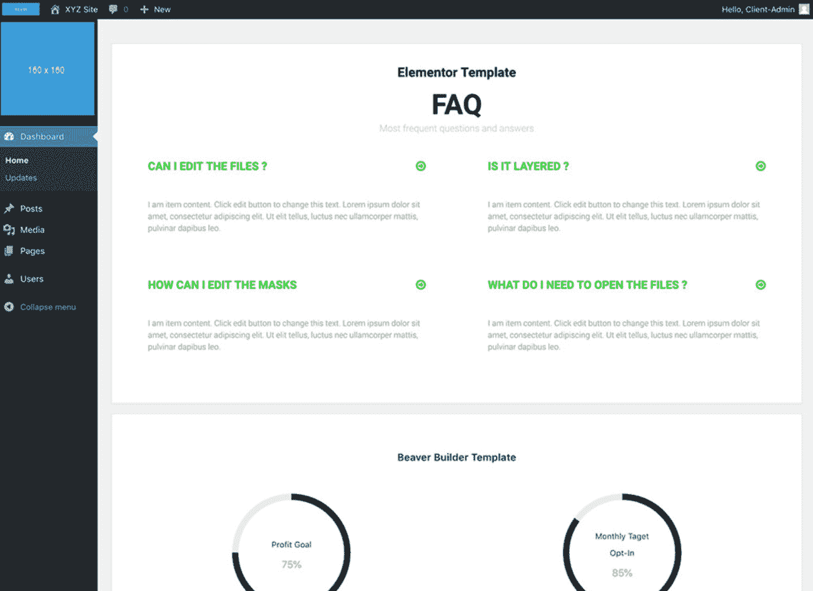

Example of a custom dashboard built with White Label CMS

这个插件是作为开发人员为客户创建更具定制外观的仪表板的解决方案而推出的，但如果您在自己的网站上工作，它也很有价值。

总之，它可以帮助您:

*   用你自己的品牌替换通用的 WordPress 品牌
*   自定义 [WordPress 登录页面](https://kinsta.com/blog/wordpress-login-url/)
*   添加您自己的自定义仪表板小部件欢迎面板
*   将您自己的 RSS 提要作为仪表板小部件包含在内
*   隐藏边栏或顶部工具栏中的菜单项
*   禁用 WordPress 工具栏

下面是使用方法…
<kinsta-advanced-cta language="en_US" type-int-post="39694" type-int-position="0"></kinsta-advanced-cta>

### 步骤 1:运行安装向导

安装并激活插件后，进入**设置→白标 CMS** 运行设置向导。

首先，你可以输入你自己的信息来替换默认的 WordPress 品牌:

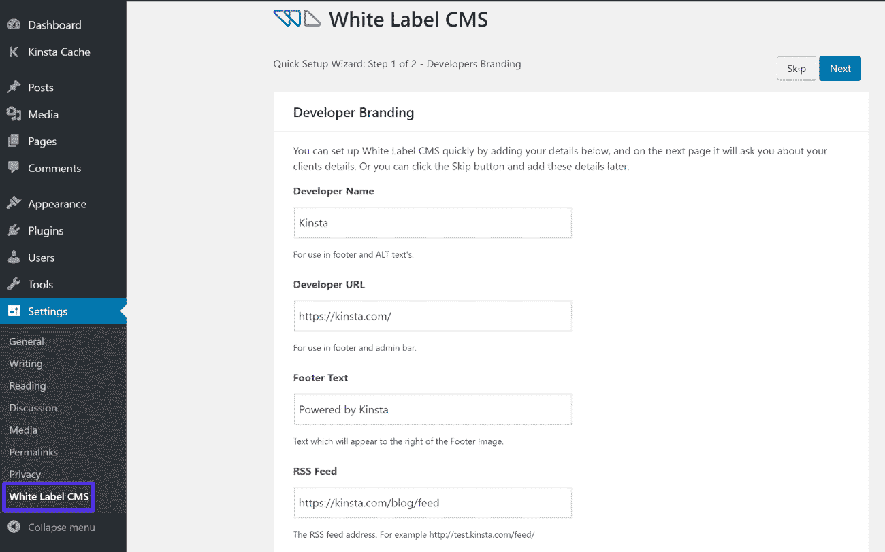

White Label CMS setup wizard

然后，在下一页上，您可以添加您的客户信息(*，如果适用的话*):

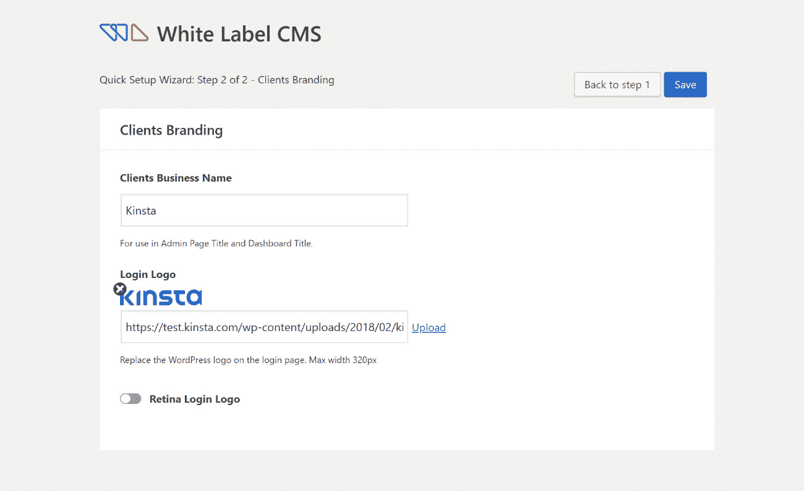

White Label CMS setup wizard part 2

### 步骤 2:定制其他品牌

一旦你完成设置向导，你将解锁完整的设置区域，这使你能够访问许多其他设置。

在**品牌**选项卡中，您可以配置设置，以便:

*   选择要隐藏的通用 WordPress 品牌的部分
*   如果需要的话，用你自己的品牌替换它

例如，如果你向下滚动到**管理栏品牌**部分，你可以添加你自己的标志来替换界面左上角的 WordPress 标志。

下面是用 [Kinsta favicon](https://kinsta.com/knowledgebase/wordpress-favicon/) 替换后的样子:

Enter custom branding

### 步骤 3:自定义登录页面

一旦你完成了品牌设置，你可以进入**登录**页面标签来定制 WordPress 登录页面。

除了添加您自己的徽标和/或[背景图片](https://kinsta.com/blog/wordpress-background-image/)，您还可以:

*   隐藏注册/忘记密码链接
*   隐藏“返回”链接
*   更改表单各部分的颜色

Customize the login page

### 步骤 4:添加自定义仪表板小部件

如果需要的话，**仪表板**标签允许你添加定制的仪表板部件，这些部件将出现在 WordPress 仪表板主页上。

下面是一个可能的例子:

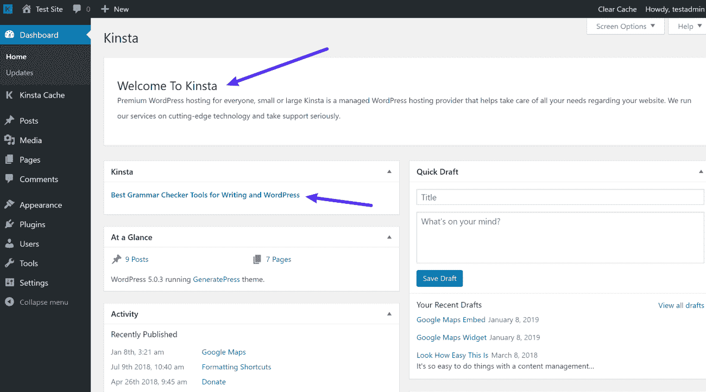

Example of a custom dashboard panel

你也可以添加自己的 HTML，让你包括图像和视频。或者，你甚至可以使用一个 [Elementor 模板](https://kinsta.com/blog/elementor-templates/)或者 Beaver Builder Pro 模板，如果你已经安装了其中一个[页面构建器插件](https://kinsta.com/blog/wordpress-page-builders/):

How to add custom dashboard panel

### 步骤 5:自定义侧边栏菜单和工具栏

如果你的网站上有很多插件，WordPress dashboard 工具条和工具栏会变得有点拥挤。

为了帮助您解决这个问题，**菜单**选项卡允许您对其他用户隐藏某些菜单项。您只需根据需要打开或关闭它们:

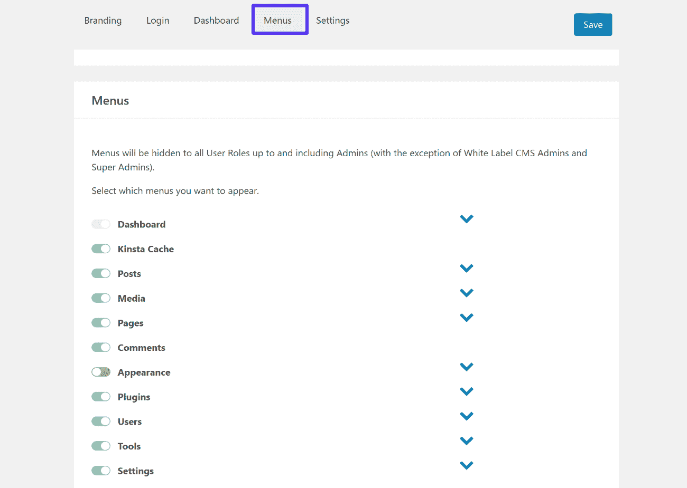

Hide WordPress dashboard menu items

**这是如何使用一个单一的一体化工具**定制 WordPress 管理仪表板的快速介绍。

现在，我们将介绍一些针对仪表板特定区域的更详细的插件。

## 如何定制管理菜单:添加、删除或重新排列菜单项

如果你对定制 WordPress dashboard 侧边栏菜单特别感兴趣，你可以使用一个名为[管理菜单编辑器](https://wordpress.org/plugins/admin-menu-editor/)的专用插件。

 ## 注册订阅时事通讯

### 想知道我们是怎么让流量增长超过 1000%的吗？

加入 20，000 多名获得我们每周时事通讯和内部消息的人的行列吧！

[Subscribe Now](#newsletter)

该免费增值插件将让您:

*   更改菜单项的名称，添加你自己的图标、 [CSS 类](https://kinsta.com/blog/wordpress-css/)等。
*   重新组织菜单项，就像创建一个新的父类别。
*   创建链接到自定义 URL 的自定义菜单项。

要开始，从 WordPress.org 安装并激活插件。然后，您可以进入**设置→菜单编辑器**来定制您的仪表盘菜单:

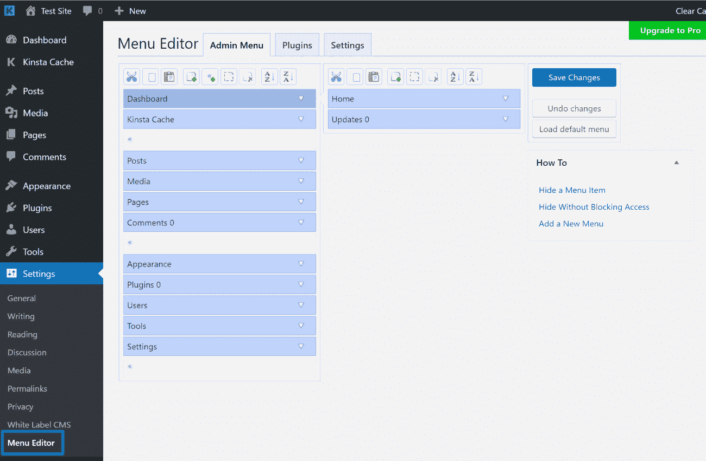

The Admin Menu Editor interface

## 如何创建新的自定义仪表盘小工具

如果你想更灵活地创建定制的仪表盘[小部件](https://kinsta.com/blog/wordpress-widgets/)或定制的欢迎面板，你可以使用[免费的仪表盘小部件套件插件](https://wordpress.org/plugins/dashboard-widgets-suite/)。

此插件允许您自定义仪表板中的列数，以及为以下各项添加新的仪表板小部件:

*   自定义注释
*   [RSS 源](https://kinsta.com/blog/wordpress-rss-feed/)
*   社会化媒体
*   列表
*   其他 [WordPress 小工具](https://kinsta.com/blog/wordpress-widgets/)
*   理论体系
*   调试日志
*   错误日志

要开始，从 WordPress.org 安装并激活插件。然后，进入**设置→仪表盘小工具**配置插件。

在**通用设置**选项卡中，您可以更改列数并选择[哪些用户角色](https://kinsta.com/blog/wordpress-user-roles/)可以看到小工具。然后，您可以使用其他选项卡来启用和配置特定的小部件:

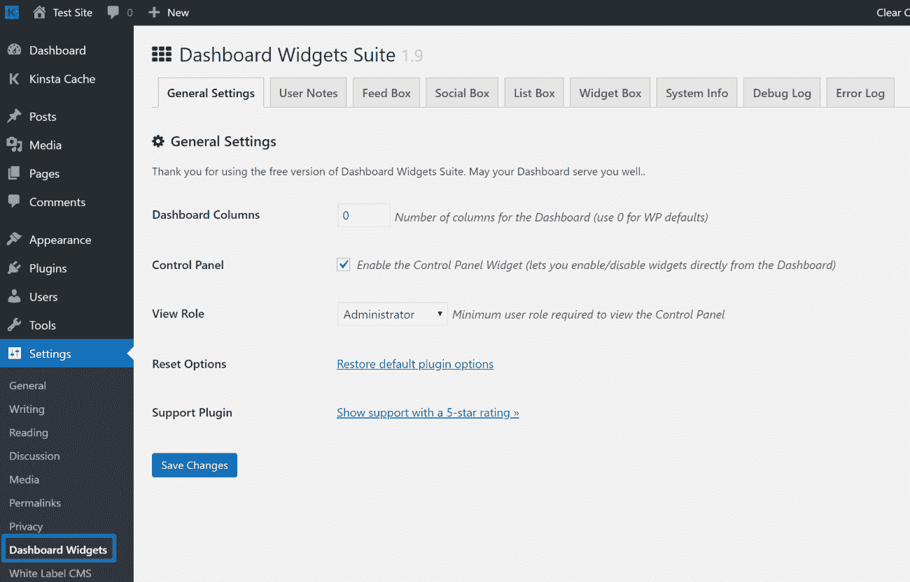

Dashboard Widgets Suite settings

然后，您可以转到您的**仪表板**区域，根据需要重新排列您的新部件:

<kinsta-advanced-cta language="en_US" type-int-post="39694" type-int-position="1"></kinsta-advanced-cta>

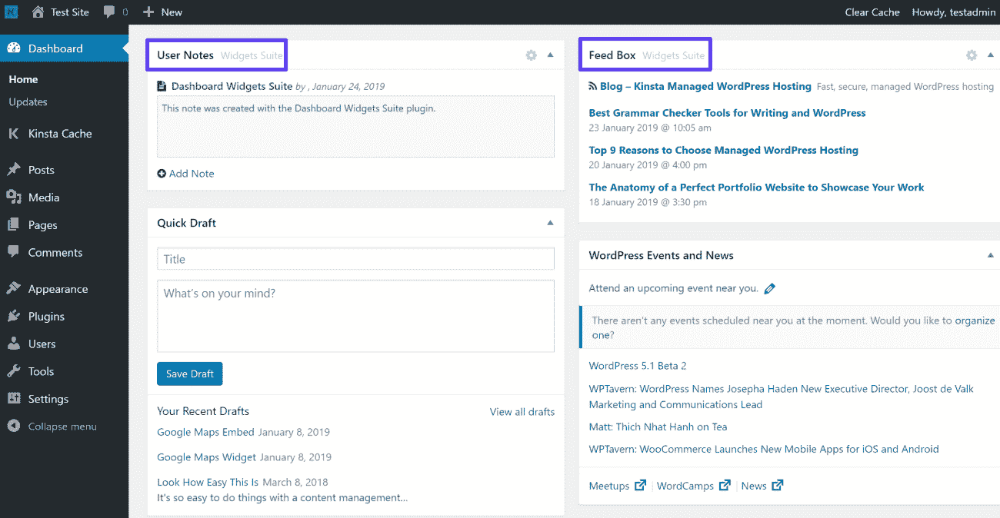

仪表盘小部件套件

中的小部件示例

## 如何在 WordPress 文章或页面列表中添加新的栏目

通过“文章或页面列表”，我们指的是列出所有文章、页面或自定义文章类型项目的管理页面。

控制该区域的一种方法是使用本机**屏幕选项**设置:

The Screen Options settings

不过，为了更加灵活，您可以使用[免费管理专栏插件](https://wordpress.org/plugins/codepress-admin-columns/)。

Struggling with downtime and WordPress problems? Kinsta is the hosting solution designed to save you time! [Check out our features](https://kinsta.com/features/)

安装并激活该插件后，您可以进入**设置→管理栏**添加新栏或删除/重新排列现有栏。

该插件的免费版本包括从特色图片到帖子的预计阅读时间的所有栏目:

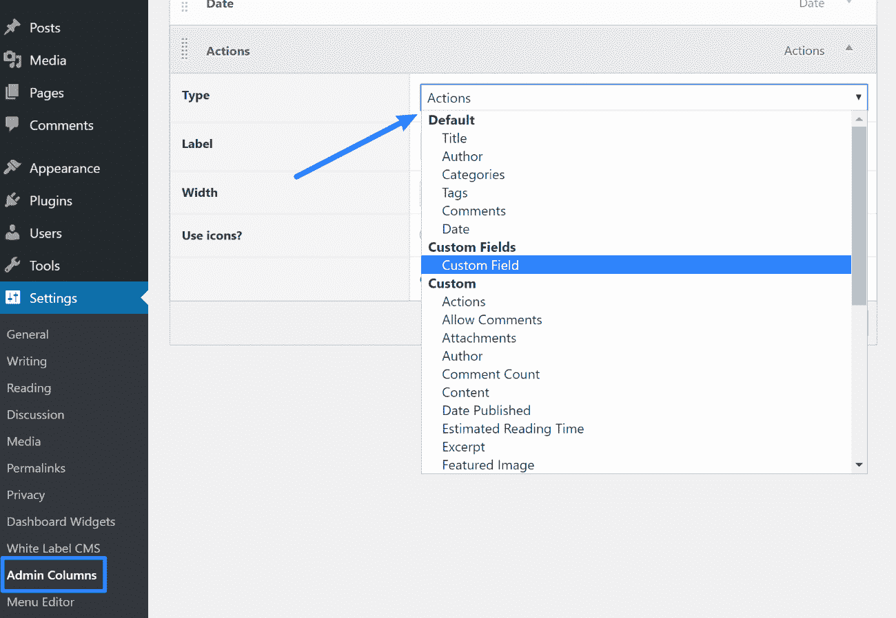

The Admin Columns interface

如果你使用类似于[高级定制字段](https://kinsta.com/blog/advanced-custom-fields/)的东西，你也可以将你的定制字段作为它们自己的列。

使用管理列插件可以轻松调整您的内容工作流程，提高工作效率。T3】

## WordPress 管理主题插件——焕然一新

WordPress 管理主题不是真正意义上的“主题”。相反，它们是插件，充当你的后端仪表板区域的主题。

与上面的方法不同，它们不会改变你的 WordPress 仪表盘区域的布局和功能。相反，他们只是给你一个新的面貌。

这里有一些我们最喜欢的…

### 警察

管理主题将扁平化的设计原则应用到你的 WordPress 管理面板上。它还为您提供了一些基本的白色标签功能。

激活插件后，您的仪表盘看起来会是这样的:

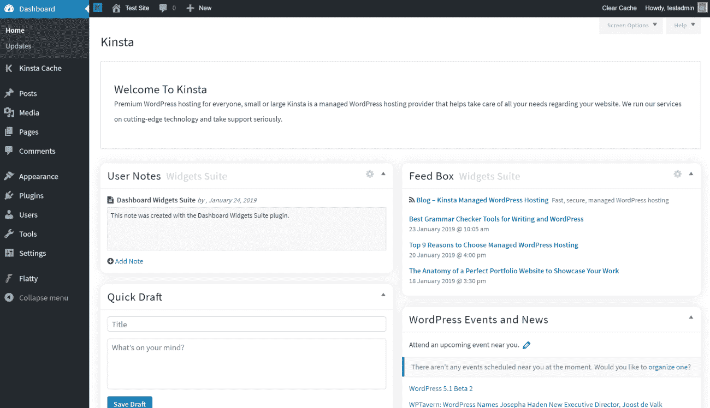

Flatty WordPress admin theme

### Aquila 管理主题

Flatty 增加了扁平的设计原则，而 Aquila 为你的管理面板增加了一个漂亮的材料设计外观。它还为您提供了一些额外的选项来定制菜单项、品牌和小部件。

激活插件后，您的仪表盘看起来会是这样的:

Aquila WordPress admin theme

### Kodeo Admin UI

重新设计你的整个管理界面，包括经典 WordPress 编辑器中的按钮。

激活插件后，您的仪表盘看起来会是这样的:

Kodeo 管理主题

 <kinsta-advanced-cta language="en_US" type-int-post="39694" type-int-position="2">## 如何定制 WordPress 登录页面

最后，虽然从技术上来说，它不是你的管理仪表板的一部分，但是你的 WordPress 登录页面仍然在让人们首先进入仪表板方面起着重要的作用。

有几个高质量的插件可以帮助你定制你的 WordPress 登录页面，但是[定制登录页面定制器](https://wordpress.org/plugins/colorlib-login-customizer/)是一个很好的起点，因为它可以让你使用本地的 WordPress 定制器可视化地定制你的登录页面。

一旦你安装并激活插件，你可以点击新的**登录定制器**菜单项来打开 WordPress 定制器。

在这里，您将在右侧看到实时预览，在左侧看到各种定制选项:

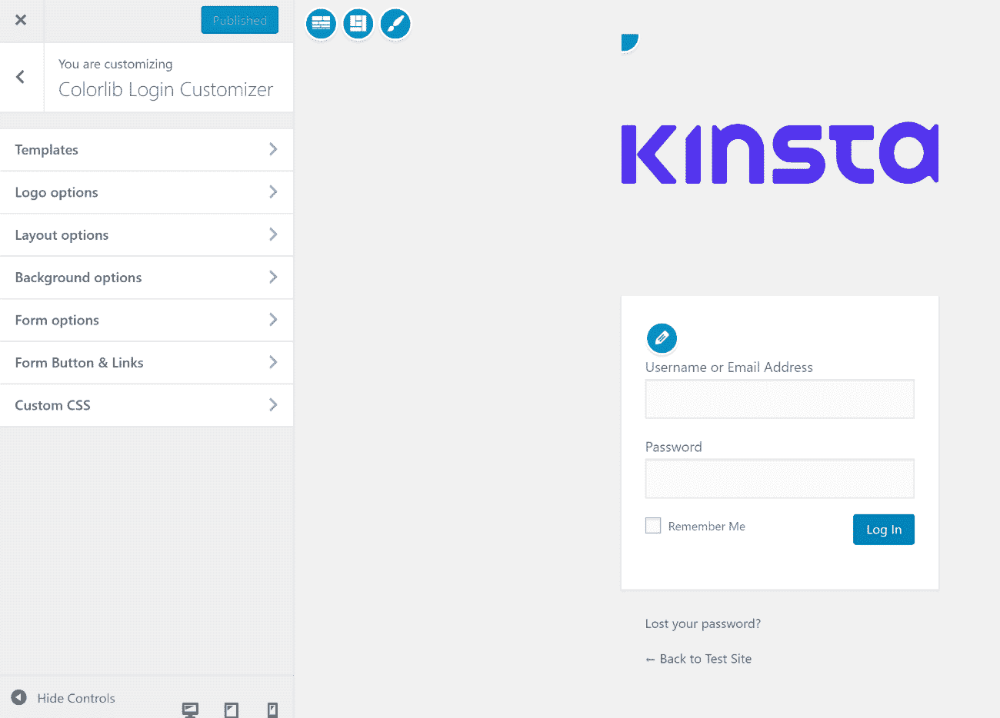

How to customize the login page

如果需要，您可以简单地自定义默认布局。或者，如果您想要进行更大的更改，您可以应用一个全新的模板，然后在此基础上进行自定义:

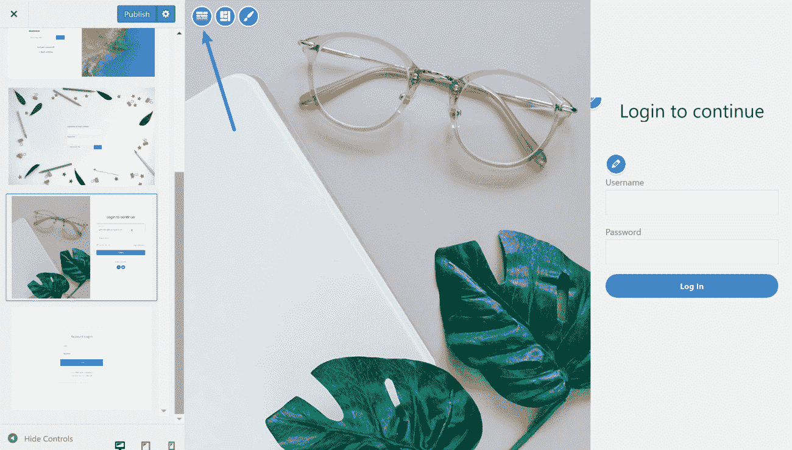

One of the pre-made login page templates

## 今天就创建一个定制的 WordPress 管理仪表板！

对于定制 WordPress 管理仪表板大部分区域的一体化解决方案来说，[免费白标 CMS 插件](https://wordpress.org/plugins/white-label-cms/)是一个很好的开始选项。

然后，如果你决定想要更多的功能来定制你的 WordPress 管理仪表板的特定区域，你也可以找到一些特定功能的定制插件，包括:

*   管理菜单编辑器定制管理菜单
*   [仪表板小部件套件](https://wordpress.org/plugins/dashboard-widgets-suite/)用于添加新的自定义仪表板小部件
*   [管理专栏](https://wordpress.org/plugins/codepress-admin-columns/)向帖子列表添加新专栏
*   WordPress 管理主题完全改变你的仪表板的风格
*   定制登录页面定制器来定制 WordPress 登录页面

关于如何创建 WordPress 自定义仪表板，你还有其他问题吗？请在评论区告诉我们！

* * *

让你所有的[应用程序](https://kinsta.com/application-hosting/)、[数据库](https://kinsta.com/database-hosting/)和 [WordPress 网站](https://kinsta.com/wordpress-hosting/)在线并在一个屋檐下。我们功能丰富的高性能云平台包括:

*   在 MyKinsta 仪表盘中轻松设置和管理
*   24/7 专家支持
*   最好的谷歌云平台硬件和网络，由 Kubernetes 提供最大的可扩展性
*   面向速度和安全性的企业级 Cloudflare 集成
*   全球受众覆盖全球多达 35 个数据中心和 275 多个 pop

在第一个月使用托管的[应用程序或托管](https://kinsta.com/application-hosting/)的[数据库，您可以享受 20 美元的优惠，亲自测试一下。探索我们的](https://kinsta.com/database-hosting/)[计划](https://kinsta.com/plans/)或[与销售人员交谈](https://kinsta.com/contact-us/)以找到最适合您的方式。</kinsta-advanced-cta>