# 谷歌地图指南:嵌入或不嵌入插件

> 原文:[https://kinsta.com/blog/wordpress-google-maps/](https://kinsta.com/blog/wordpress-google-maps/)

想在你的网站上嵌入 WordPress Google Maps 内容吗？

像 WordPress 中的许多东西一样，根据你想要包含的地图内容的类型，有几种不同的方式可以将谷歌地图嵌入到你的网站中。

在这篇文章中，我们将首先向你展示如何在没有插件的情况下在 WordPress 中添加谷歌地图。然后，我们将推荐一些*可以*帮助你嵌入谷歌地图的插件，以及这样做的一些好处。我们还将深入探讨如何正确使用 Google Maps API，这是现在必需的。

最后，我们将以在 WordPress 上使用谷歌地图的一些性能考虑来结束，并分享一些关于如何保持你的 WordPress 站点快速加载的技巧，即使你确实需要嵌入谷歌地图。

你可以点击下面的链接直接跳到某个特定的部分，或者通读全文。

*   [现在需要谷歌地图 API](#google-maps-api)
*   [如何在没有插件的情况下在 WordPress 中添加谷歌地图](#withoutplugin)
*   给你更多灵活性的谷歌地图插件
*   [谷歌地图性能效果及提高性能的技巧](#performance)

## 现在需要谷歌地图应用编程接口

截至 2018 年 6 月 11 日，谷歌地图现在需要一个 **API 密钥。如果你已经在你的网站上安装了谷歌地图，但它不再工作了，这可能就是原因。或者说，您缺少 API 键。好消息是，对于你们中 99%的人来说，它应该仍然是免费的。下面是[谷歌地图 API 定价](https://cloud.google.com/maps-platform/pricing/sheet/)。**

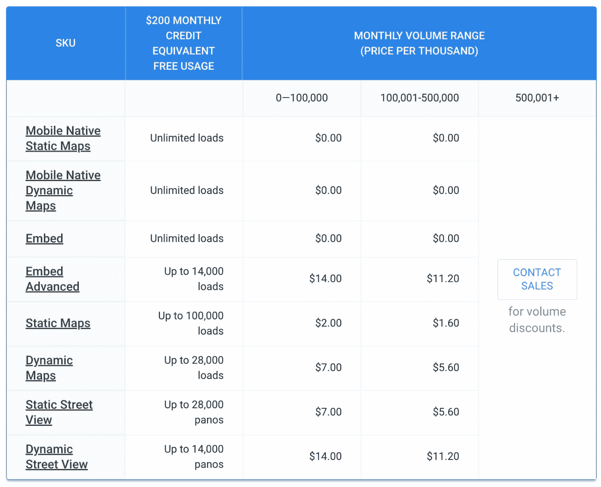

Google Maps API pricing


谷歌还会在你的账单账户上每月给你 200 美元的信用额度，以抵消你的使用成本。因此，正如你所看到的，除非你产生了成千上万的请求，否则在你的网站上使用谷歌地图不会花费你任何东西。


还有什么变化？什么也不做，但是如果你想在 WordPress 中使用谷歌地图，你现在需要做以下事情:

1.  注册一个谷歌云平台控制台账户，并进行配置。
2.  添加您的账单信息，即使您可能从未收到过账单。
3.  将 API 密钥添加到您的谷歌地图嵌入代码或插件设置中。

 ### 如何获得谷歌地图 API 密钥

以下是如何获得谷歌地图 API 密钥的步骤。

### 第一步

进入[谷歌云平台控制台](https://cloud.google.com/console/google/maps-apis/overview)。如果您还没有帐户，请创建一个，这是免费的。

### 第二步

选择或创建一个项目。

### 第三步

设置您的付费帐户。即使他们会要求你将信用卡存档，你也不应该被收费，除非你确实超过了高使用限额。

### 第四步

您将被要求选择一种或多种产品。这取决于你使用的地图类型。例如，如果你在没有插件的情况下在你的 WordPress 站点[上嵌入一张地图(如下面的步骤所示)，那么你应该选择 Google Maps Embed API。](#withoutplugin)


Google Maps Embed API


如果你正在使用类似于 [Google Maps Widget](#plugins) 的插件(如下面的步骤所示)，那么你会选择 Google Maps 静态 API。

如果你使用第三方插件或主题，他们应该有关于他们使用的谷歌地图部署类型的文档。不要担心，您总是可以添加多个类型，并在以后更改它们。

### 第五步

点击“启用”


Enable Google Maps API


### 第六步

点击“API ”,然后在“凭证”下，您将看到您的 API 密钥。


Google Maps API key


### 第七步

如果你只是简单地嵌入你的谷歌地图 API 密匙，它会以纯文本的形式显示在你的源代码中。因此你应该对此加以限制，否则，人们可能会在他们的 WordPress 站点或项目上使用你的 API 密匙，从而增加你的使用量。

要做到这一点，只需点击您的 API 键的名称，它将允许您添加一个限制。对于你的 WordPress 站点，简单地添加一个 HTTP referrer 就足够了。如`https://yourdomain.com/*`。这将允许它只在你的网站上打电话。

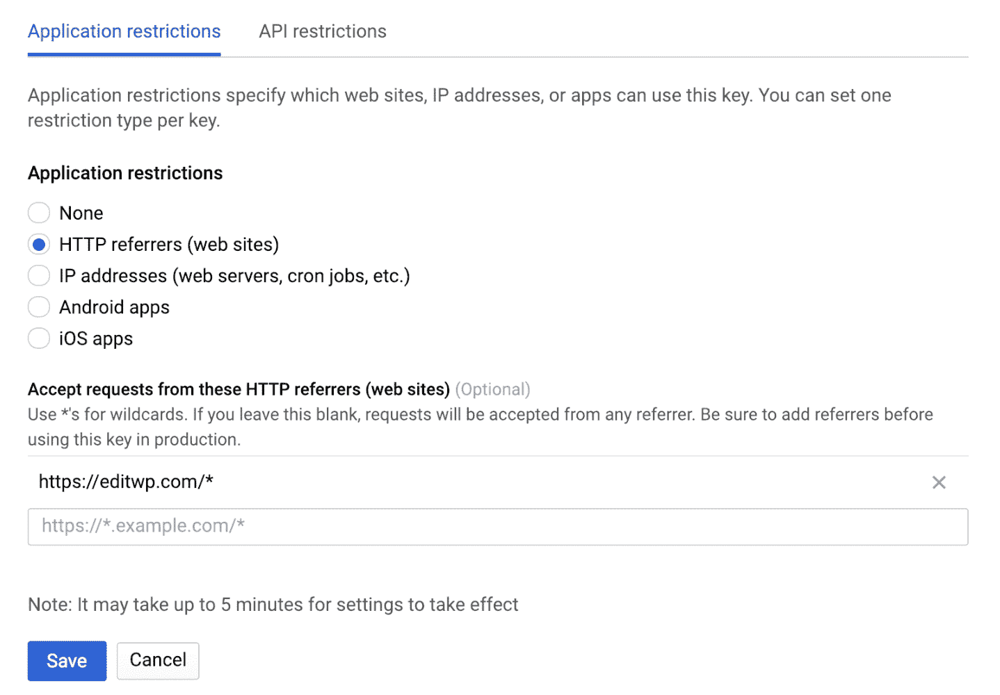

谷歌地图 API 关键限制


 ## 如何在没有插件的情况下在 WordPress 中添加谷歌地图

如果您只想嵌入一个简单的地图，而不需要自定义位置标记或其他注释等更详细的功能，您可以使用日常使用的普通谷歌地图网站，在没有插件的情况下嵌入谷歌地图。

它是这样工作的…

### 步骤 1:复制谷歌地图嵌入代码

首先，使用 Google Maps 网站创建您想要嵌入的地图。

例如，如果您想要嵌入一个地点标记，请在 Google Maps 中打开该地点。或者，如果您想要嵌入方向，请在谷歌地图中打开方向。

一旦你有了想要嵌入的地图，点击左上角的汉堡菜单:


How to access the embed code


在菜单项列表中，选择**共享或嵌入地图**的选项:

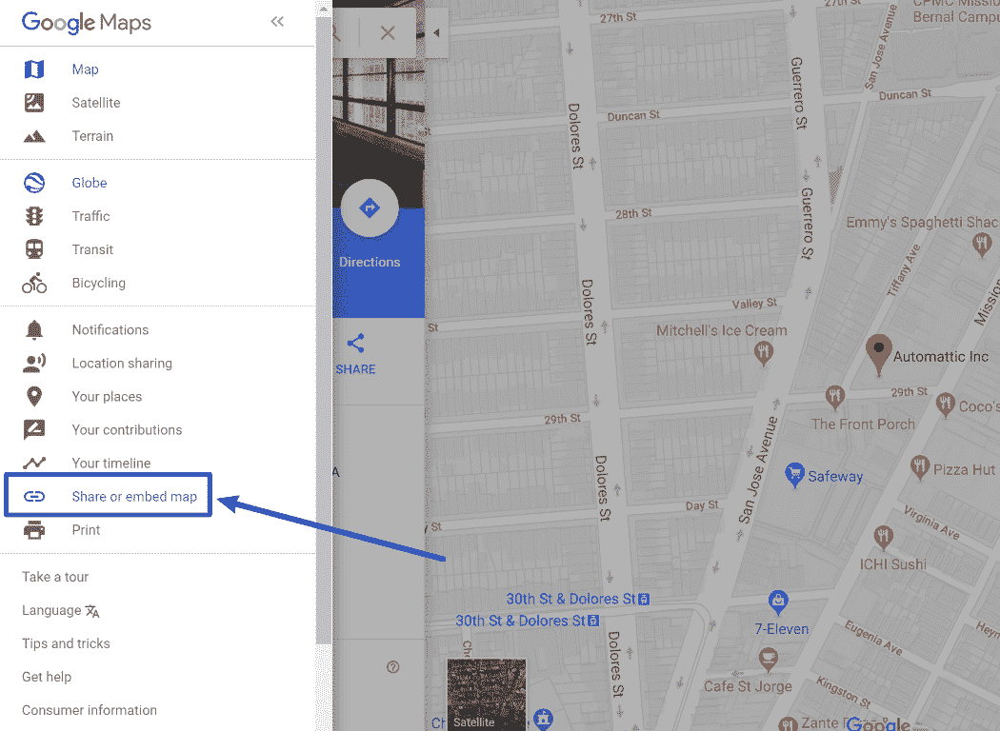

Open the embed options


这将打开一个**共享**弹出窗口。在弹出窗口中，点击**嵌入地图**标签。

然后，您可以使用下拉菜单选择所需的尺寸。对于大多数 WordPress 网站来说，默认的大小很好，但是如果需要的话，你可以放大或者缩小地图。

完成后，点击**复制 HTML** 按钮复制嵌入代码:

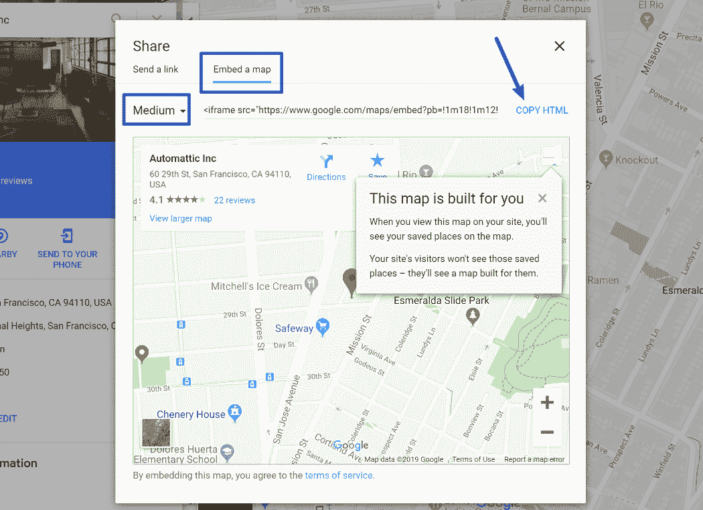

The Google Maps embed code


然后，您需要将 API 密钥添加到代码中。因此，您的代码应该如下所示:

```
<iframe src="https://www.google.com/maps/embed/v1/search?key=YOUR_API_KEY&parameters allowfullscreen></iframe>
```

### 第二步:添加谷歌地图嵌入代码到 WordPress 网站

现在，你所需要做的就是将嵌入的代码添加到你的 WordPress 站点中你想要包含你的地图的文章或页面中。

如果你使用的是与 WordPress 5.0 一起发布的新的 WordPress Gutenberg 块编辑器，你可以通过添加一个**定制 HTML** 块并将嵌入代码粘贴到块中来实现。**别忘了添加你的 API 键**。


How to add the embed code in WordPress block editor


你可以通过点击块上方的**预览**按钮来预览你的地图。

如果你还在使用经典的 TinyMCE 编辑器，你可以通过打开**文本**标签并粘贴代码来添加谷歌地图嵌入代码:

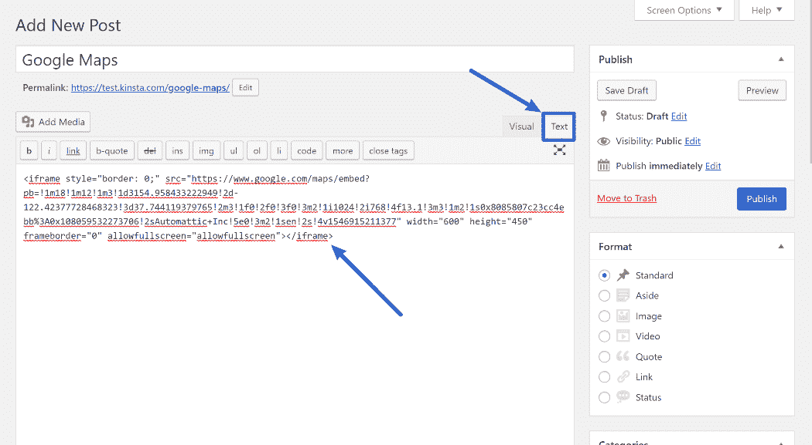

How to add the embed code in WordPress Classic editor


一旦你添加了代码，你可以返回到**可视化**标签来查看你的地图的实时预览。

就是这样！你刚刚学习了如何在没有插件的情况下在 WordPress 中添加谷歌地图。


## 使用谷歌我的地图嵌入更复杂的地图，无需插件

如果你想在多位置标记、自定义注释等方面更有创意。，你仍然可以做到这一点，而不需要谷歌的“我的地图”服务插件。

“我的地图”是谷歌的官方工具，可以让你创建和分享自己的自定义地图。使用它，您可以创建类似于下面的示例的东西，其中有许多自定义标记和当用户单击标记时显示的自定义信息:

 ## 注册订阅时事通讯


### 想知道我们是怎么让流量增长超过 1000%的吗？

加入 20，000 多名获得我们每周时事通讯和内部消息的人的行列吧！

[Subscribe Now](#newsletter)

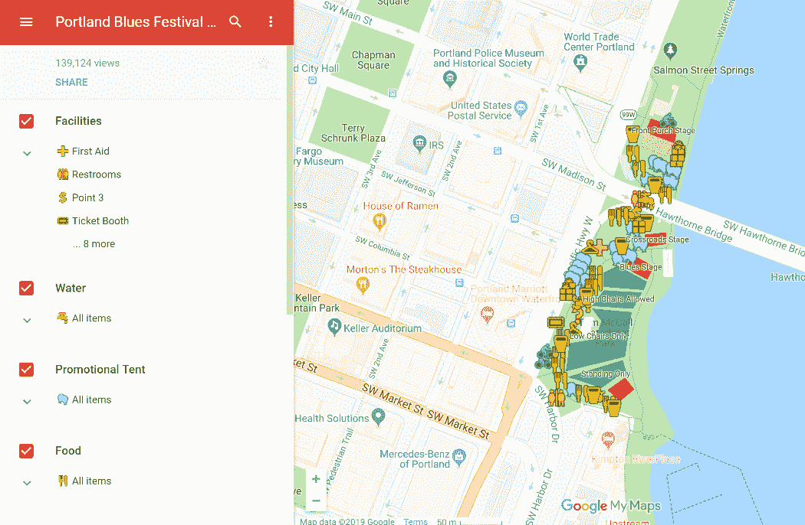

Google My Maps example


以下是如何使用它来添加自定义谷歌地图到 WordPress。

### 步骤 1:在谷歌我的地图中创建你的地图

首先，[前往谷歌我的地图](https://www.google.com/maps/about/mymaps/)并创建一张新地图。在这里，您可以使用地图构建器界面来构建您的地图:

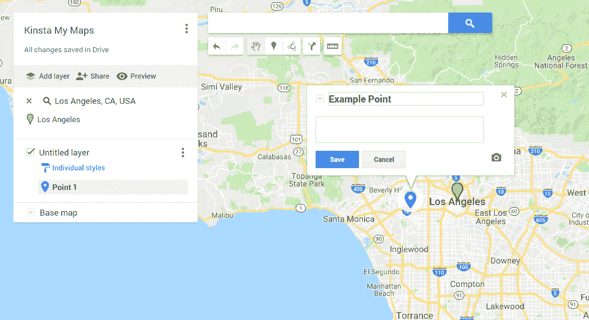

The Google My Maps interface


虽然我们不会涉及太多的细节，这个界面可以让你建立一些非常有创意的地图。为了更深入地了解，Google 的这篇帮助文章涵盖了许多重要的功能。

### 步骤 2:生成嵌入代码

完成地图构建后，您需要生成嵌入代码。

但是，在获取代码之前，您首先需要公开您的地图。为此，点击**共享**按钮。然后，点击弹出窗口中的**更改**…:

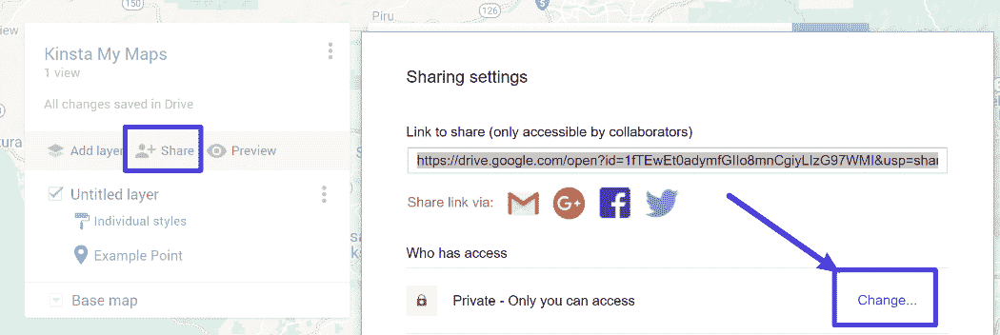

Google My Maps Sharing Settings


然后，选择上的**-**网页公开**，点击**保存**:**


Turn on Link Sharing


完成后，点击地图标题旁边的下拉菜单，选择**在我的网站上嵌入**以生成实际的嵌入代码:

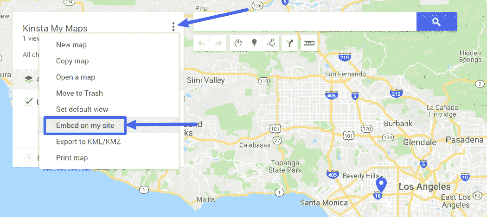

Access the My Maps embed code


这将打开一个弹出窗口，显示您应该复制的代码。不要忘记添加您的 API 密钥。


The My Maps embed code


### 步骤 3:添加嵌入代码到 WordPress 站点

现在，你可以把嵌入代码添加到你的 WordPress 站点上，就像你从普通的 Google Maps 网站上获得嵌入代码一样。

如果你不确定该怎么做，[点击这里，从](#addcode)跳转到教程的那个部分。

## 使用 WordPress 谷歌地图插件

除了上面的手动方法，还有大量的 [WordPress Google Maps 插件](https://kinsta.com/blog/wordpress-map-plugin/)可以帮助你在网站上嵌入地图。

有几个原因可以让你考虑使用这些插件中的一个，而不是手动方法:

Struggling with downtime and WordPress problems? Kinsta is the hosting solution designed to save you time! [Check out our features](https://kinsta.com/features/)

*   他们让你用一个简单的界面创建更复杂的地图。
*   你可以做任何事情，而不必离开你的 WordPress 仪表盘。
*   其中一些链接到了 WordPress。例如，你可以将地图标记链接到 WordPress 文章。
*   其中一些可以帮助你优化谷歌地图的性能。

对于所有这些插件，在开始嵌入地图之前，您需要生成自己的 Google Maps API 密钥。本教程将向你展示如何做到这一点。

### 谷歌地图小工具

[Google Maps Widget](https://wordpress.org/plugins/google-maps-widget/) 是一个简单的 Google Maps 插件，可以让你使用 Google Maps 静态 API 嵌入地图，通过嵌入静态图像而不是交互式地图，提供了一种性能更友好的方法(*我们将在下一节*中对此进行更多解释)。

如果你想要简单轻便的东西，这是一个很好的选择。一旦你激活它，你将需要抓取你的[谷歌地图 API 键](#google-maps-api)并将其插入插件的设置中。你可以将谷歌地图添加到你网站上的任何部件区域。然后，访问者可以在 lightbox 中打开一个更大的交互式地图版本:

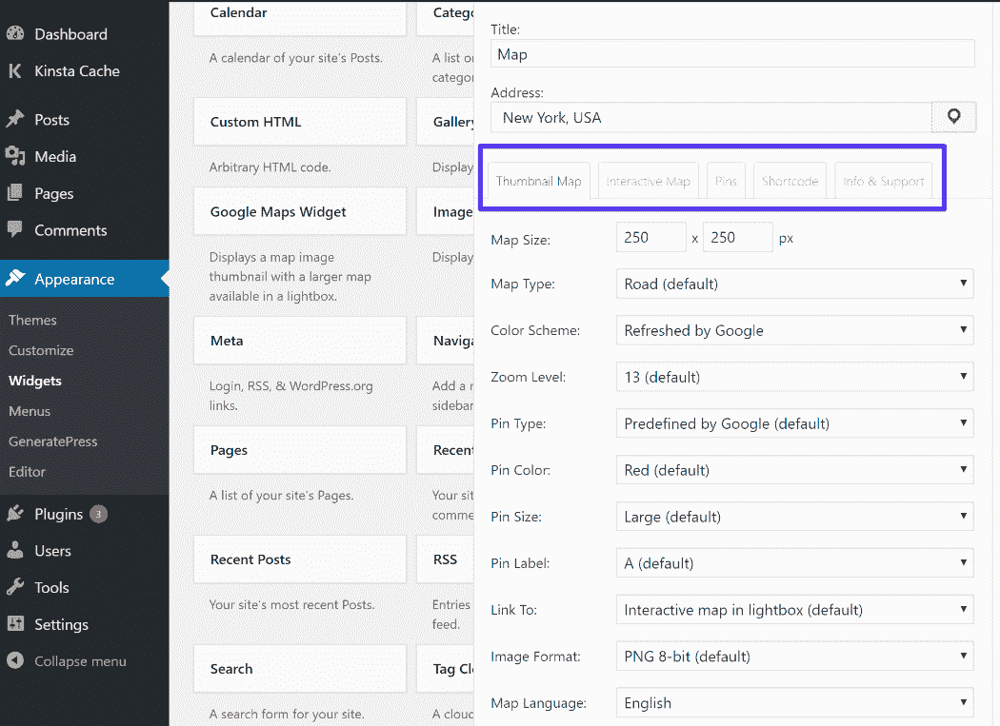

The Google Maps Widget interface


如果需要，您还可以立即使用交互式地图，专业版允许您使用短代码在网站的任何位置嵌入地图。

### 谷歌地图简易版

[Google Maps Easy](https://wordpress.org/plugins/google-maps-easy/) 帮助您使用自己的标记和注释创建自定义地图。

添加标记时，您可以上传自己的自定义图标，在标记描述中包含文本和图像，等等。您还可以控制地图的功能，例如选择是否允许用户放大:

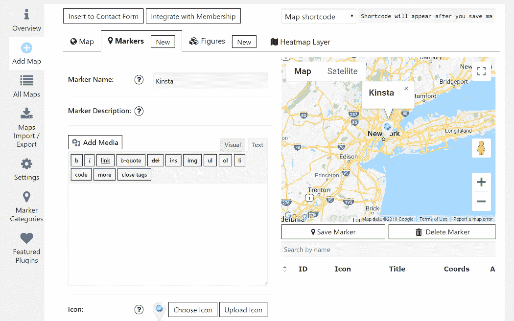

Google Maps Easy interface


一旦构建了地图，就可以使用短代码或 PHP 函数来嵌入它。

### Intergeo

Intergeo 是另一个流行的选项，可以让你用自定义标记创建自己的地图，并控制地图功能。

一旦你安装并激活了插件，你就可以在你的 WordPress 仪表盘上创建你的地图了:

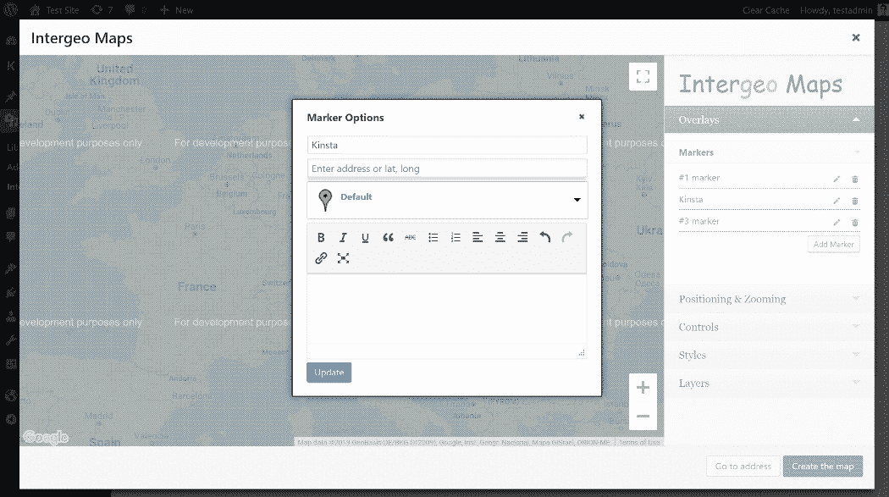

Intergeo interface


然后，您可以使用短代码将它们嵌入到网站的任何地方。

### 谷歌地图嵌入的古腾堡区块

谷歌地图嵌入的古腾堡块是一个简单的插件，它为新的 WordPress 古腾堡块编辑器增加了一个专用的谷歌地图块。

有了这个模块，您可以嵌入任何地址，还可以选择:

*   规模
*   缩放级别
*   交互式地图与静态地图(*同样，后一种方法有助于提高性能)*

它不会让你创建自己的自定义地图-但如果你使用新的块编辑器，只是想一个简单的方法来包括一些简单的地图，这是一个方便的选择。

## 谷歌地图会让你的 WordPress 网站变慢——不要让它变慢

虽然谷歌地图可以让你通过它的交互式地图在网站上嵌入大量很酷的功能，但这是一个性能上的权衡，因为它需要加载大量的脚本来支持所有的交互式功能。

长话短说，嵌入交互式谷歌地图会让你的网站变慢。

有几种方法可以解决这个问题。

首先，如果你不需要人们能够在你的网站上交互式地浏览你的地图*，一个不需要任何第三方工具就能让[加速](https://kinsta.com/learn/speed-up-wordpress/)的简单方法是:*

*   [拍摄地图的截图](https://kinsta.com/blog/how-to-screenshot-on-windows/)以便在您的网站上使用
*   将截图链接到 Google Maps 网站上的地图，或者当用户点击时打开一个带有交互式地图的灯箱弹出窗口。

这样，你的网站只是加载一个普通的图片，而不是所有与谷歌地图相关的脚本。

作为手动操作的替代方法，你也可以使用免费的 [AWEOS 谷歌地图 iframe 每次点击加载插件](https://wordpress.org/plugins/aweos-google-maps-iframe-load-per-click/)。这个插件自动替换谷歌地图嵌入的通用占位符图像。然后，如果用户点击**加载地图**按钮，它将加载完整的谷歌地图嵌入:

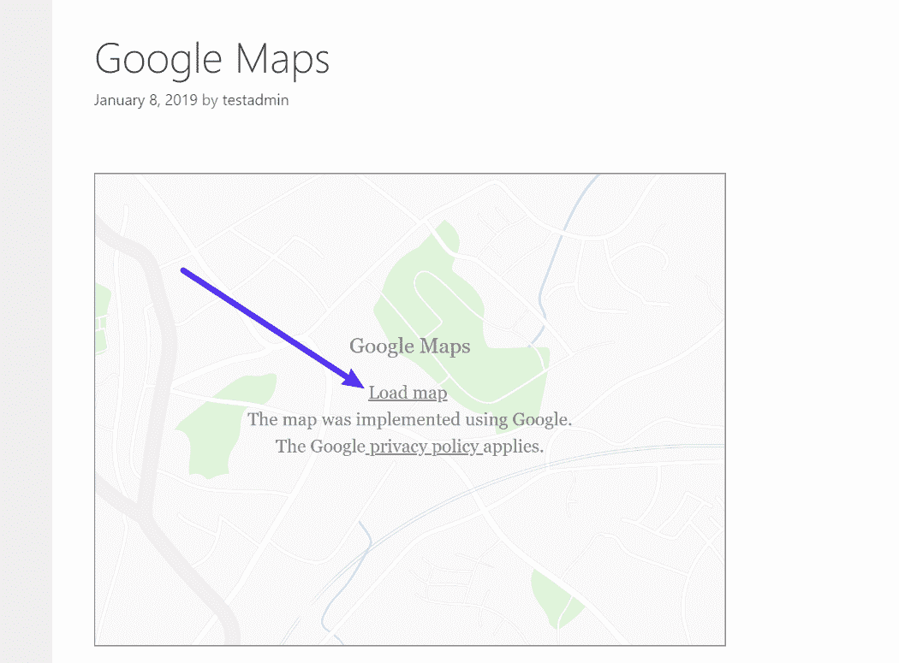

Google Maps placeholder image


或者，您也可以使用 Google Maps 静态 API，它返回一个不带任何 JavaScript 的常规图像。一些谷歌地图插件——包括[谷歌地图插件](https://wordpress.org/plugins/google-maps-widget/)和[谷歌地图嵌入的古腾堡块](https://wordpress.org/plugins/embed-gutenberg-block-google-maps/)——让你在创建地图时使用静态 API。

然而，我们意识到，有时这种静态方法并不能解决问题，很多人希望立即嵌入交互式谷歌地图体验。

如果是这样的话，另一个加速谷歌地图的好方法就是使用**懒加载**。通过延迟加载，你的网站会等待加载任何隐藏的谷歌地图，直到访问者开始向下滚动页面。这让你的初始页面加载速度更快，同时还能让你嵌入交互式谷歌地图内容。

我们已经写过[如何延迟加载图片和视频](https://kinsta.com/blog/wordpress-lazy-load/)，谷歌地图也是同样的想法。

有几个插件可以让你做到这一点。例如， [a3 延迟加载插件](https://wordpress.org/plugins/a3-lazy-load/)让你延迟加载 [iframe 嵌入的](https://kinsta.com/blog/wordpress-iframe/)，其中包括谷歌地图:


Lazy load Google Maps


其他选项包括:

*   [BJ 懒载](https://wordpress.org/plugins/bj-lazy-load/)
*   [WP 火箭惰性装载](https://wordpress.org/plugins/rocket-lazy-load/)
*   [简易懒人装载机](https://wordpress.org/plugins/easy-lazy-loader/)

## 摘要

如果你只是想在你的网站上嵌入一个简单的地图，你可以使用内置的嵌入代码功能将谷歌地图添加到 WordPress，而无需插件。或者，您可以使用 Google My Maps 工具创建自己的自定义地图并嵌入其中。

除了这些手动方法，还有大量的[谷歌地图 WordPress 插件](https://kinsta.com/blog/wordpress-map-plugin/)可以给你很多控制，而不会让你离开你的 WordPress 仪表盘。

无论选择哪种方法，都要注意使用谷歌地图的性能影响。尽量只在绝对必要时使用谷歌地图，并考虑占位符图片或延迟加载等策略来减少对性能的负面影响。

关于在 WordPress 上使用谷歌地图，你还有其他问题吗？请在评论中告诉我们！

* * *

让你所有的[应用程序](https://kinsta.com/application-hosting/)、[数据库](https://kinsta.com/database-hosting/)和 [WordPress 网站](https://kinsta.com/wordpress-hosting/)在线并在一个屋檐下。我们功能丰富的高性能云平台包括:

*   在 MyKinsta 仪表盘中轻松设置和管理
*   24/7 专家支持
*   最好的谷歌云平台硬件和网络，由 Kubernetes 提供最大的可扩展性
*   面向速度和安全性的企业级 Cloudflare 集成
*   全球受众覆盖全球多达 35 个数据中心和 275 多个 pop

在第一个月使用托管的[应用程序或托管](https://kinsta.com/application-hosting/)的[数据库，您可以享受 20 美元的优惠，亲自测试一下。探索我们的](https://kinsta.com/database-hosting/)[计划](https://kinsta.com/plans/)或[与销售人员交谈](https://kinsta.com/contact-us/)以找到最适合您的方式。