# 野生和有趣的脸书统计和事实(2022)

> 原文:[https://kinsta.com/blog/facebook-statistics/](https://kinsta.com/blog/facebook-statistics/)

因为脸书是世界上最大的社交网站，拥有超过 22 亿的月活跃用户，所以脸书有很多疯狂有趣的统计数据也就不足为奇了。令人兴奋的脸书统计数据和事实包括那些埋藏在该公司的起源，到其最新的项目，因为它继续确保其在世界大部分地区的主导地位和权力，为投资者，营销人员，甚至你的普通脸书用户提供见解。

[Facebook is the largest social networking site in the world. Check out these wild and interesting facts! 🤓Click to Tweet](https://twitter.com/intent/tweet?url=https%3A%2F%2Fkinsta.com%2Fblog%2Ffacebook-statistics%2F&via=kinsta&text=Facebook+is+the+largest+social+networking+site+in+the+world.+Check+out+these+wild+and+interesting+facts%21+%F0%9F%A4%93&hashtags=smm%2Cmarketing)

## 脸书社交媒体革命的起源

2004 年 2 月 4 日，马克·扎克伯格与哈佛大学的同学和室友爱德华多·萨维林、安德鲁·麦科勒姆、达斯汀·莫斯科维茨和克里斯·休斯一起创办了脸书。

Facebook founders (Image source: [Le Journal de Montréal](https://www.journaldemontreal.com/2015/06/18/decouvrez-le-visage-des-fondateurs-de-grandes-entreprises-web))

今天这个影响力空前的强大公司的起源是扎克伯格创建的一个名为“Facemash”的网站。这个网站从哈佛大学九所学院的在线“脸谱”上提取照片，并要求用户选择“更性感”的人。

Facesmash (Image source: [IncomeDiary](https://www.incomediary.com/9-ways-you-can-be-more-like-mark-zuckerberg))

不用说，校园管理人员并不以为然。他们关闭了网站，并威胁扎克伯格将被精英学校开除。扎克伯格没有被吓倒，他有了另一个想法。这一次，扎克伯格决定将带有照片和基本信息的校园学生名录(被称为“脸书”)放到网上。这个想法不完全是扎克伯格的，因为哈佛已经计划做同样的事情。然而，扎克伯格认为学校花了这么长时间才把它们放上去是很可笑的，所以他建立了自己的网站。该网站最初名为“TheFacebook.com”，只对哈佛学生开放，后来对波士顿地区的学生和常春藤盟校的学生开放。到 2006 年，它对任何年满 13 岁的人开放。

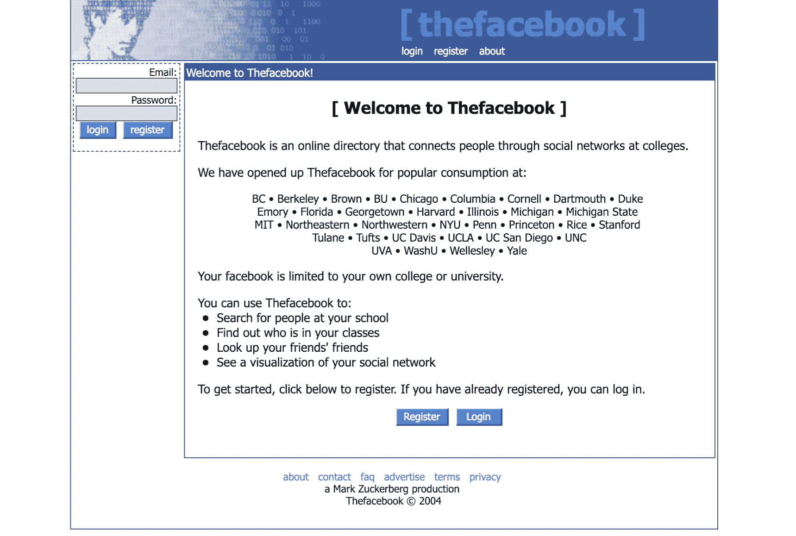

Thefacebook (Image source: [The Wayback Machine](https://web.archive.org/web/20040608145805/http://www.thefacebook.com:80/))

当然，甚至在脸书向所有人开放之前，扎克伯格就发现自己陷入了法律纠纷，因为他的同学卡梅隆·文克莱沃斯、泰勒·文克莱沃斯和迪维娅·纳伦德拉起诉他涉嫌窃取他们的想法。根据协议，他们每人获得了 120 万股公司股票。2004 年公司成立时，肖恩·帕克成为脸书的第一任总裁，在获得 PayPal 联合创始人彼得·泰尔的 50 万美元天使投资后，公司搬到了加州的帕洛阿尔托。第二年，该公司在以 20 万美元收购 facebook.com 后，去掉了名字中的“The ”,转到了现在的域名“Facebook . com”。2007 年，脸书推出了 Facebook Marketplace，允许用户发布分类广告。也是在那一年，脸书应用开发者平台被引入，允许开发者在脸书上创建应用和游戏。接下来的一年对这个社交媒体巨头来说是重要的一年。2008 年，它在爱尔兰都柏林建立了第一个国际总部。此外，还推出了脸书聊天，以及诸如你可能认识的人、脸书墙和脸书连接等功能。
T3】

> 需要在这里大声喊出来。Kinsta 太神奇了，我用它做我的个人网站。支持是迅速和杰出的，他们的服务器是 WordPress 最快的。
> 
> <footer class="wp-block-kinsta-client-quote__footer">
> 
> 
> 
> <cite class="wp-block-kinsta-client-quote__cite">Phillip Stemann</cite></footer>

[View plans](https://kinsta.com/plans/)

## 挖掘脸书的人口统计数据

脸书有多少用户？看看这些脸书用户统计数据:截至 2018 年第二季度，脸书拥有 22.3 亿月活跃用户，其中 68%的[美国人使用社交媒体平台](http://www.pewinternet.org/2018/03/01/social-media-use-in-2018/)。尽管美国人非常依赖社交媒体网站，但超过 85%的脸书用户来自美国和加拿大以外的地区。

Monthly Facebook users (Image source: [Statista](https://www.statista.com/statistics/264810/number-of-monthly-active-facebook-users-worldwide/))

脸书在 2008 年 8 月 26 日突破了 1 亿用户大关。到 2010 年 7 月，它已经拥有 5 亿用户。第二年，脸书在[的页面浏览量突破了 1 万亿次](https://www.huffingtonpost.com/2011/08/24/facebook-hits-1-trillion-page-views_n_935725.html)。同年，尼尔森发现脸书是美国第二大访问量网站和 T4 最受欢迎的社交网站。然后，2012 年 9 月，脸书达到[10 亿用户](http://newsroom.fb.com/News/One-Billion-People-on-Facebook-1c9.aspx)，2017 年达到[20 亿用户](https://techcrunch.com/2017/06/27/facebook-2-billion-users/)。尽管脸书在几乎所有人群中都相当受欢迎，但它正在失去对青少年的吸引力。只有 51%的 13-17 岁青少年使用脸书，而其他社交媒体平台在这方面做得更好:85%的人在 YouTube 上，72%的人在 Instagram 上，69%的人在 Snapchat 上。这些青少年的最新数据显示，与三年前使用脸书的青少年的 71%相比，有了显著下降。

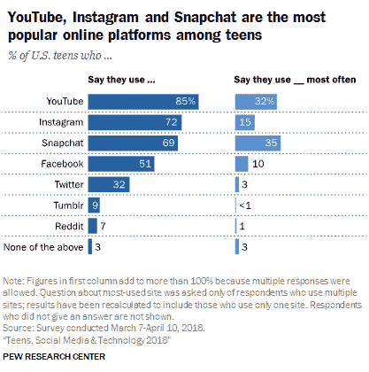

Teens using Facebook ([PEW Research Center](http://www.pewinternet.org/2018/05/31/teens-social-media-technology-2018/))

当梳理青少年的数据时，一个有趣的脸书统计数据上升到首位，即低收入家庭的青少年倾向于脸书。尽管使用脸书的女性比男性多——分别为 74%和 62%——脸书的最大用户群是 25-34 岁的男性，占所有用户的 18%。

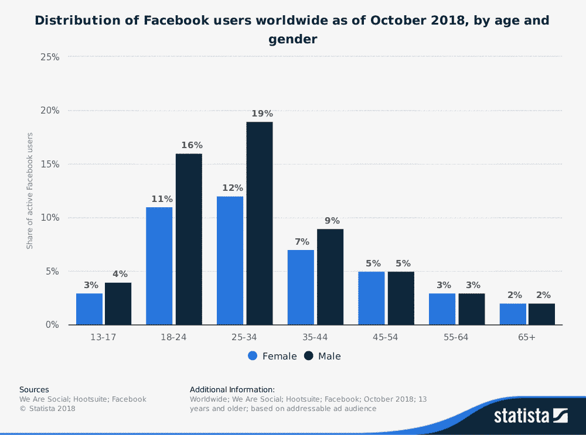

Facebook users by age and gender (Image source: [Statista](https://www.statista.com/statistics/376128/facebook-global-user-age-distribution/))

有这么多的人在脸书上忙来忙去，当意识到任何给定的用户与另一个用户之间只有 3.57 度的距离时，真是令人震惊。尽管普通的脸书用户有 338 个朋友，但他们认为 T2 只有 28%的朋友是真正的或亲密的朋友。

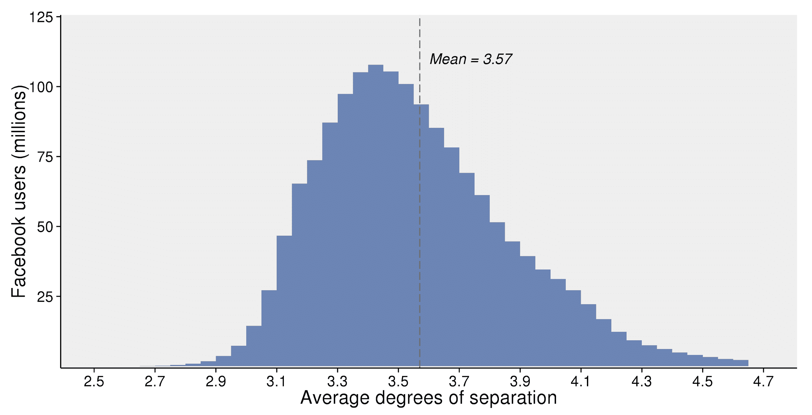

Facebook average degrees of separation (Image source: [Facebook Research](https://research.fb.com/three-and-a-half-degrees-of-separation/))

另一个疯狂的脸书统计数据是，普通脸书用户联系的真正朋友比他们从未见过面的人少，这些人占用户联系的 39%。此外，通过其他有趣的脸书统计数据，结果显示 47%的父母在社交媒体平台上与他们的孩子成为朋友。

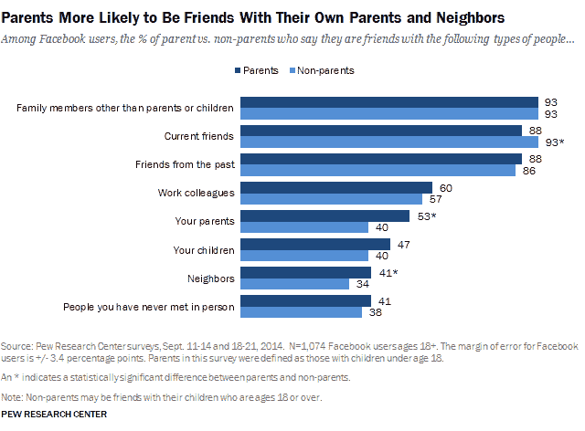

Facebook friends with parents (Image source: [PEW Research Center](http://www.pewinternet.org/2015/07/16/parents-and-social-media/))

## 脸书数据和使用统计

脸书每天产生 4pb 的数据，也就是 100 万 GB。所有这些数据都存储在所谓的 Hive 中，它包含大约 300 的数据。这种巨大的内容生成量无疑与这样一个事实有关，即脸书用户在该网站上花费的时间比其他任何社交网络都多，每天大约花费一个小时。如果你不确定你是否是一个高于平均水平的脸书用户，你现在可以利用该网站的工具“你在脸书的时间”来计算，你猜对了，[你在该网站上花了多少时间](http://fortune.com/2018/08/01/facebook-instagram-time-tracking-tool/)。

Minutes spent per day on social apps (Image source: [Recode](https://www.recode.net/2018/6/25/17501224/instagram-facebook-snapchat-time-spent-growth-data))

对脸书用户来说，关注他们的使用情况很重要的一个原因是这个网站容易让人上瘾。大约四分之三的脸书用户每天都会访问该网站，51%的用户每天会访问几次。

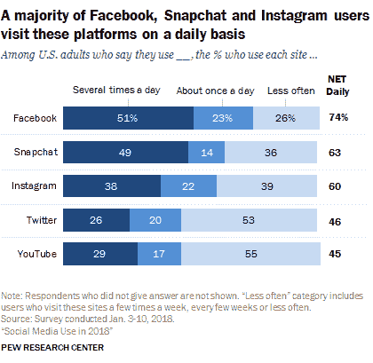

Daily usage Facebook (Image source: [PEW Research Center](http://www.pewinternet.org/2018/03/01/social-media-use-in-2018/))

事实上，Harris Poll 最近的一项调查显示，用户发现脸书是最难放弃使用的社交媒体网站。虽然扎克伯格是一名程序员，但他实际上主修心理学，这可能解释了他对开发一个如此令人上瘾的网站的见解。参与该网站的人数不断增加，每分钟大约有 400 名[用户](http://www.smartinsights.com/internet-marketing-statistics/happens-online-60-seconds/)注册脸书。当然，在那[的一分钟](https://blog.microfocus.com/how-much-data-is-created-on-the-internet-each-day/)，脸书发生的事情远不止 400 人的加入。每 60 秒发布 51 万条评论，更新 29.3 万条状态，400 万个帖子被赞，上传 13.6 万张照片。但是，这对脸书来说还不够。为了寻找增加与帖子和广告互动的方法，脸书在 2016 年发布了“反应”选项。在该功能发布后的一年里，超过 3000 亿次反应被使用。当然，并不是所有关于脸书的互动、反应，甚至是描述都是合法的。事实上，脸书在 2018 年前三个月删除了[5.83 亿个虚假账户](https://www.cnet.com/news/facebook-deleted-583-million-fake-accounts-in-the-first-three-months-of-2018/)。即使删除了数百万个账户，脸书用户数量的稳步增长意味着越来越多的帖子争夺用户的注意力。脸书承认，在任何时候，都会有超过 1500 篇报道在用户的新闻订阅中争夺一席之地。然而，脸书只选择大约 300 个故事出现在用户的订阅源中。这些故事的选择方式在 2018 年发生了变化，当时脸书宣布调整其算法，优先考虑用户的[朋友和家人](https://newsroom.fb.com/news/2018/01/news-feed-fyi-bringing-people-closer-together/)的帖子。尽管许多脸书用户对这一变化欢欣鼓舞，但对于寄希望于有机食品的公司来说，这却是个坏消息。现在，他们需要[更多地依靠付费广告](https://kinsta.com/blog/facebook-marketing/)最终出现在用户的新闻提要中。扎克伯格承认，在新的算法大修后，人们在网站上花费的时间越来越少:每天减少 5000 万分钟，每个用户只需 1-2 分钟。不仅如此，自成立以来，脸书在 2017 年第四季度首次出现美加用户群减少的情况。从第三季度的 1.85 亿增长到第四季度的 1.84 亿。虽然 100 万用户可能看起来只是沧海一粟，但值得注意的是，来自美国和加拿大的每个月活跃用户平均带来 27 美元的收入。

Facebook daily active users in the US and Canada (Image source: [Recode](https://www.recode.net/2018/1/31/16957122/facebook-daily-active-user-decline-us-canda-q4-earnings-2018))

## 使其成为一家移动公司

2014 年，扎克伯格说，“[我们现在是一家移动公司](https://venturebeat.com/2014/04/30/facebook-is-all-in-with-mobile-ceo-zuckerberg-says/)”看看这些脸书的使用统计:他不是在开玩笑；脸书专注于让移动设备成为他们 T2 关键战略 T3 的一部分。现在，95.1%的人用他们的智能手机访问脸书，这使他们能够比用他们的台式机更快地[消费内容。](https://www.facebook.com/iq/articles/shifts-for-2020-multisensory-multipliers)

Facebook device usage (Image source: [Statista](https://www.statista.com/statistics/377808/distribution-of-facebook-users-by-device/))

[A whopping 95.1% of people access Facebook with their smartphones! 😲Click to Tweet](https://twitter.com/intent/tweet?url=https%3A%2F%2Fkinsta.com%2Fblog%2Ffacebook-statistics%2F&via=kinsta&text=A+whopping+95.1%25+of+people+access+Facebook+with+their+smartphones%21+%F0%9F%98%B2&hashtags=smm%2Cmobile)

总共有 47%的脸书用户通过他们的移动设备访问网站*[。事实上，该公司在 2016 年 11 月达到了 10 亿](https://venturebeat.com/2015/11/04/47-of-facebooks-users-never-touch-the-service-on-desktop/)[纯移动月度用户](https://venturebeat.com/2016/11/02/facebook-passes-1-billion-mobile-only-monthly-users/)。几个月前，它的移动活跃用户日均突破 10 亿。*

 *

Facebook mobile monthly active users (Images source: [VentureBeat](https://venturebeat.com/2016/07/27/facebook-passes-1-billion-mobile-daily-active-users/))

2017 年，脸书发布了脸书精简版和信使精简版，这些应用程序是为生活在互联网缓慢的发展中国家的人们设计的。截至当年 6 月，脸书 Lite 用户约有 [2 亿](https://www.engadget.com/2017/02/08/facebook-lite-app-update/)。考虑到[移动设备](https://kinsta.com/blog/wordpress-mobile-plugin/)可以做的所有事情，意识到花在这些设备上的所有时间的 19%都花在了脸书上，真是令人震惊。显然，脸书在成为“移动公司”方面做得非常出色。

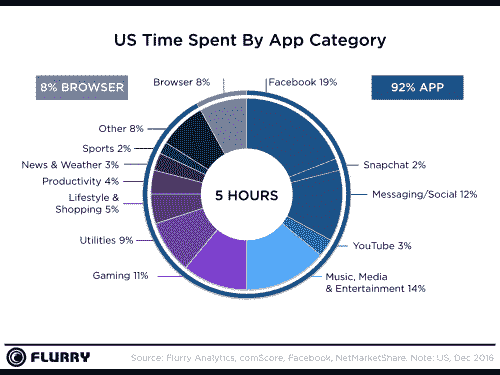

US time spent by app category (Image source: [Flurry](https://www.flurry.com/blog/us-consumers-time-spent-on-mobile-crosses-5/))

## 被称为下一个大趋势的视频

扎克伯格有一句名言，视频是继手机之后的下一个大趋势。不仅仅是视频紧随移动设备之后，移动设备为视频内容的普及铺平了道路:人们在手机上观看脸书视频的可能性[是](https://www.facebook.com/iq/articles/shifts-for-2020-multisensory-multipliers)的五倍。

平均而言，脸书每天产生超过 80 亿的视频内容浏览量；每天有超过 1 亿小时的视频被观看。尽管视频内容只占脸书内容的 3%,但它比其他类型的帖子吸引了更多的关注。

视频的平均分享量是脸书上其他内容的 89.5 倍，是该网站上分享量最大的内容类型。此外，脸书本地视频的到达率是 YouTube 链接的 10 倍，这也是越来越多的公司通过他们的 T2 脸书页面上传视频内容的原因之一，而不仅仅是分享链接。

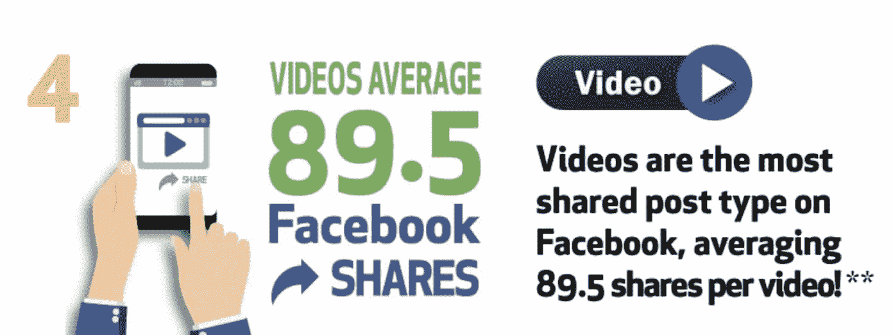

Facebook video share averages (Image source: [Mari Smith](http://www.marismith.com/8-facebook-engagement-stats-every-marketer-needs-to-know/))

关于用户在网站上观看视频内容的一个奇怪的脸书统计数据是，85%的用户在观看视频时关闭了声音，80%的用户觉得 T2 的视频自动播放声音很烦人。正因为如此，字幕视频广告可以[增加 12%的浏览量](https://www.facebook.com/business/news/updated-features-for-video-ads)。用户调整视频以获得更好结果的另一种方式是制作方形视频，这种视频在移动新闻订阅源中占据的空间比风景视频多 78%。脸书为推广视频内容所做的另一项调整是在 2016 年推出了脸书直播。自其诞生以来，已有近 20 亿人观看了约 35 亿次广播。使用脸书 Live 的趋势正在迅速增长；在过去的一年中，页面播放量增加了 50%。而且，经常直播是值得的，因为直播视频在实际播放期间的观看时间是重播时间的三倍。

## 注册订阅时事通讯

### 想知道我们是怎么让流量增长超过 1000%的吗？

加入 20，000 多名获得我们每周时事通讯和内部消息的人的行列吧！

[Subscribe Now](#newsletter)

## 算出脸书的财务数字

脸书在 2012 年进行了首次公开募股，融资 1040 亿美元，成为迄今为止新上市公司的最大估值。它筹集了 160 亿美元，成为美国历史上第三大基金。2010 年，价值 410 亿美元的脸书成为美国第三大网络公司，仅次于谷歌和亚马逊。根据该公司发布的 2018 年[第二季度收益](https://investor.fb.com/investor-news/press-release-details/2018/Facebook-Reports-Second-Quarter-2018-Results/default.aspx)，脸书未能达到其[预计收益](https://www.cnbc.com/2018/07/25/facebook-earnings-q2-2018.html)133.6 亿美元，实际收益为 132.3 亿美元。广告收入也低于预期的 131.6 亿美元，实际收入为 130.4 亿美元。脸书确实表示，它预计今年的收入增长率会更低，因为该公司专注于不产生收入的故事，并加强隐私和安全，以符合一般数据保护法规( [GDPR](https://kinsta.com/blog/wordpress-gdpr-compliance/) )。收入下降还可能归因于一系列与隐私和 2016 年美国总统大选相关的负面公关问题。尽管脸书的投资组合中有许多金融奖项，但他们也有一些不那么令人愉快的情况，例如成为第一家在一天内损失超过 1000 亿美元股票的公司，这是在 2018 年 7 月 26 日。

### 脸书收购

对于许多脸书用户来说，脸书和 Messenger 没有区别。然而，该公司在 2011 年 3 月将 Messenger 作为独立应用发布，此前[从 Beluga](https://techcrunch.com/2011/03/01/facebook-beluga/) 收购了它。现在大约有 12 亿人使用 Messenger。然而，Messenger 对于脸书的消息应用程序组合来说是不够的。2014 年 2 月，该公司以 190 亿美元收购了 [WhatsApp，这是迄今为止最大的一笔收购。收购的目标是让该公司打入国际信息领域。WhatsApp 价格高昂的一个主要原因是其用户的快速增长，每天](https://www.forbes.com/sites/parmyolson/2014/10/06/facebook-closes-19-billion-whatsapp-deal/)[有 100 万用户。这家社交媒体巨头的另一项重大收购是 2012 年以 10 亿美元收购 Instagram，就在它首次公开募股的前一个月。此次收购将一家社交媒体竞争对手变成了脸书的独立照片应用。展望娱乐和社交媒体的未来，2014 年 3 月，脸书以 20 亿美元的现金和股票收购了 Oculus VR。Oculus VR 是一家为游戏制作虚拟现实耳机的公司。当被问及他对公司的愿景是什么时，扎克伯格表示，他计划将 Oculus VR 不仅用于游戏。具体来说，他想让它成为一个更多体验的平台。他举的一个例子是，他可以坐在家里观看场边篮球赛。另一个例子是用户与他们的医生进行一对一的对话。](https://www.businessinsider.com/why-facebook-buying-whatsapp-2014-2)

## 脸书商业统计

到 2007 年，脸书拥有超过 10 万个公司网页，允许企业展示他们的信息，吸引潜在客户。在接下来的十年里，这个数字飞速增长；目前有超过 6000 万的脸书商业网页。这些页面是脸书生态系统不可或缺的一部分，不仅仅是因为广告收入，还因为用户与它们互动。近 40%的人喜欢或关注脸书页面，以便获得特别优惠。结果还表明，32%的人经常使用脸书页面，每个月在脸书页面上留下超过 50 亿条评论。

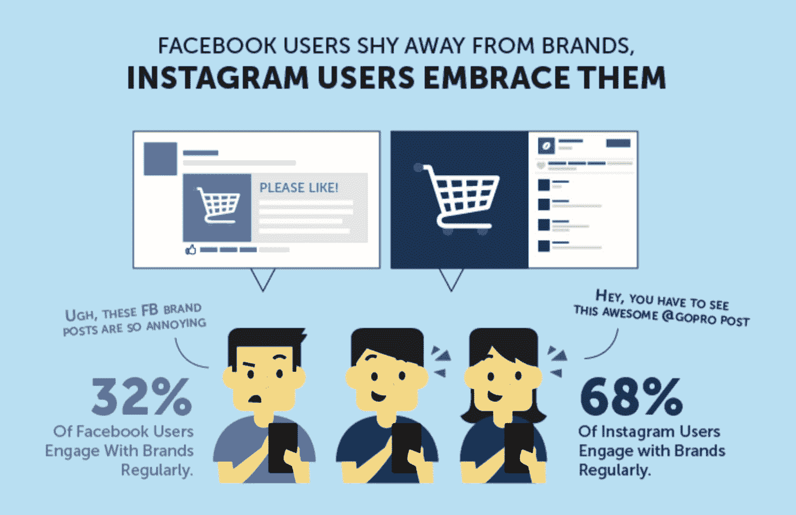

Facebook engagement (Image source: [Ecommerce CEO](https://www.ecommerceceo.com/why-brands-should-embrace-instagram-instead-of-facebook/))

甚至在脸书的新算法实施之前,《脸书邮报》的平均有机接触率为页面总受众的 2.6%。现在，这个数字肯定更低了，这使得企业增加职位和为脸书推广职位留出营销资金变得更加重要。有趣的是，追随者越少的页面，接触率和参与度越大。9gag 和 BoredPanda 等病毒出版商深受脸书算法变化的影响，参与度大幅下降。

Facebook-influence declines (Image source: [Digiday](https://digiday.com/media/viral-publishers-see-sharp-engagement-drops-facebook/))

然而，任何单个品牌的参与度都取决于他们在创建与受众产生共鸣的帖子方面的流利程度。大量使用推广帖子可能会让用户失去兴趣，近 60%的用户不喜欢太多的推广帖子。

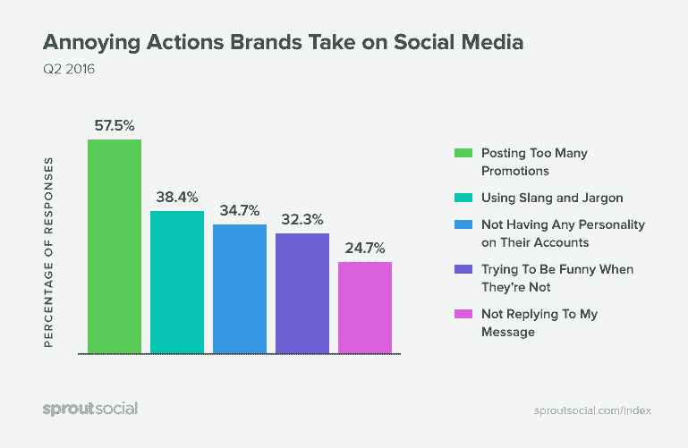

Annoying actions brands take on social media (Image source: [SocialMediaToday](http://www.socialmediatoday.com/social-business/new-study-looks-what-makes-people-unfollow-brands-social))

平均而言，品牌[每天发布八次](https://sproutsocial.com/insights/facebook-stats-for-marketers/)，其中许多利用了详细说明[发布](https://sproutsocial.com/insights/facebook-stats-for-marketers/)最佳时间的研究，这些研究通常认为周四和周五是将你最重要的内容放到网上的最佳时间。为了让你的品牌获得成功，挖掘你自己对一周中高参与度的日子和一天中高参与度的时间的洞察力是很重要的。当然，由于 40%的脸书用户[不喜欢任何品牌页面](http://www.kentico.com/company/press-center/press-releases/2014/kentico-digital-experience-survey-68-don%E2%80%99t-pay-att)——企业让自己的内容受到关注的最佳方式是利用脸书的广告。

## 脸书广告的优势

脸书的大部分收入来自广告收入。营销人员每年花费数十亿美元，根据用户档案锁定目标客户。由于 93%的营销人员经常使用脸书广告，2018 年仅在 Q1，该公司就从广告中赚了 118 亿美元。

Facebook ad revenue (Image source: [VentureBeat](https://venturebeat.com/2018/04/25/over-90-of-facebooks-advertising-revenue-now-comes-from-mobile/))

脸书在 2017 年获得了近 400 亿美元的广告收入，占全球广告市场 2030 亿美元的 20%。有趣的是，[在使用脸书广告作为营销活动一部分的 300 万家企业中，约 70%](https://www.facebook.com/business/news/3-million-advertisers) 位于美国境外。社交媒体巨头对移动的关注再次推动了其广告收入的成功，脸书 91%的广告收入来自针对移动设备的[广告](https://venturebeat.com/2018/04/25/over-90-of-facebooks-advertising-revenue-now-comes-from-mobile/)。脸书广告如此受众多营销人员欢迎的一个原因是，较大的预算并不一定意味着更多的曝光。这使得它对中小型企业特别有吸引力。在所有行业中，脸书广告的平均每次点击成本为 1.72 美元，平均点击率为 0.9%。虽然乍一看，这些数字可能并不惊人，但事实证明，点击过脸书广告的人中有 26%已经购买了。

Struggling with downtime and WordPress problems? Kinsta is the hosting solution designed to save you time! [Check out our features](https://kinsta.com/features/)

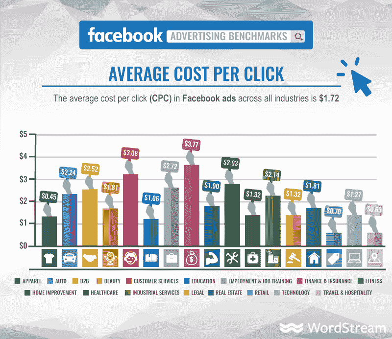

Facebook ads average CPC

毫不奇怪，人们更有可能点击与他们的兴趣相关的广告，这就是脸书相关性得分的来源。相关性分数取决于参与度。高相关性分数意味着更多的参与度和更低的广告成本。例如，相关性分数为 3 的成本比分数为 8 的成本高 73%。而且，它的 CTR 得分低 77%。

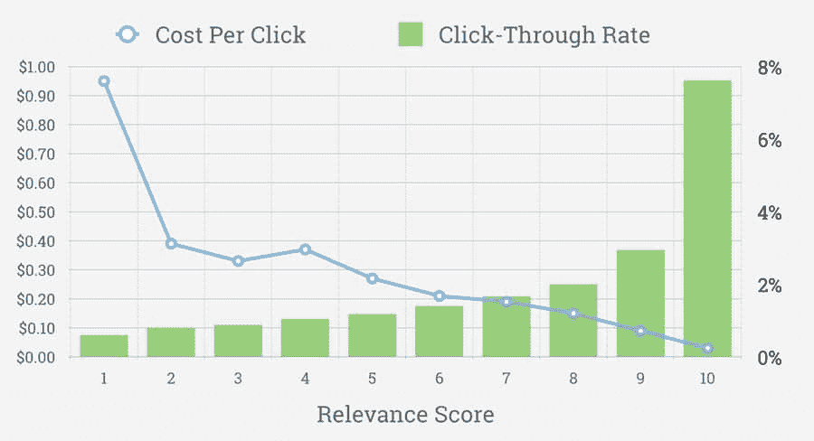

Facebook CPC and CTR (Image source: [AdEspresso](https://adespresso.com/blog/facebook-ads-relevance-score/))

为了迎合商业的需要，脸书开发了几种类型的广告。最有效的形式之一是视频。然而，脸书研究发现，脸书视频广告价值的 47%发生在视频的前[三秒](https://www.facebook.com/business/news/value-of-video)。这意味着想要利用脸书视频广告的营销人员需要直奔主题。在其他形式的广告中，归根结底是使用正确的形象，这占了广告效果的 75-90%。

## 脸书面临着比盈利能力更大的问题

作为世界上最大的公司之一，脸书并没有毫发无损地度过它的 14 岁生日。从个人信息传播到假新闻，该公司面临的重大社会问题超出了应有的范围。

### 假新闻

大约 45%的美国成年人从脸书网站获取新闻，尽管只有 5%的美国人“非常”相信他们从该网站获取的新闻。美国人[不太相信他们从社交媒体网站获得的信息。约 37%的美国人信任社交媒体新闻，85%的人信任地方新闻机构的信息，72%的人信任全国性新闻机构。来自朋友和家人的新闻介于国家新闻和地方新闻之间，有 76%的人信任他们。2015 年，脸书的算法被编程为省略误导性内容。用户也可以标记“虚假或欺骗性新闻”然后，在 2016 年，他们宣布了通过开发新产品、与事实检查员合作、回击有虚假故事的网站以及启动脸书新闻项目来解决虚假信息传播问题的计划](http://www.journalism.org/2017/05/10/democrats-republicans-now-split-on-support-for-watchdog-role/#trust-in-news-organizations-divides-on-party-lines-trust-in-social-media-very-low-for-both-parties)[。尽管如此，俄罗斯巨魔在脸书传播假新闻以影响 2016 年美国总统大选的后果继续削弱脸书用户对通过该平台发现的新闻的信任。](https://www.cnbc.com/2016/12/15/facebook-tackles-fake-news.html)

### 脸书隐私

脸书和其他科技巨头的许多批评者的另一个主要担忧是用户的数据隐私。脸书最近的丑闻围绕着剑桥分析公司。这家分析公司因涉嫌通过脸书收集超过 8700 万人的数据而受到调查。剑桥分析公司(Cambridge Analytica)获取的数据被认为是用来通过“[心理目标](http://fortune.com/2018/04/10/facebook-cambridge-analytica-what-happened/)”影响 2016 年大选甚至英国退出欧盟的结果。

## 脸书展望未来

尽管被要求在国会面前就俄罗斯干预总统选举作证，脸书需要扑灭许多其他火灾，但该公司继续向前看，为自己的研发团队提供资金。

### Facebook Watch

Facebook Watch 是大约一年前首次向美国用户推出的视频点播服务。现在[对所有脸书用户](https://newsroom.fb.com/news/2018/08/facebook-watch-global/)开放。与 Amazon Originals 一样，Facebook Watch 在其频道上托管独特的内容。合作伙伴制作内容，保留 55%的收入——脸书抽成 45%。目前，脸书正在探索如何[使他们的节目更具互动性](https://variety.com/2018/digital/news/facebook-watch-aims-to-reinvent-tv-with-new-interactive-shows-1202849582/)，这可能采取虚拟现实的形式。

### 虚拟现实

在 2014 年购买 Oculus VR 的[之后，扎克伯格宣布了他让](https://www.businessinsider.com/facebook-to-buy-oculus-rift-for-2-billion-2014-3)[10 亿人进入 VR](https://www.theverge.com/2017/10/11/16459636/mark-zuckerberg-oculus-rift-connect) 的目标。这个目标可能很快就会成为现实，因为脸书在 2018 年 5 月推出了该公司的独立耳机 Oculus Go。

Facebook Oculus Go (Image source: [Recode](https://www.recode.net/2018/5/1/17305254/oculus-go-virtual-reality-headset-on-sale-how-to-buy))

Oculus Go 售价 199 美元，不需要高端智能手机来操作。

### 向右滑动脸书约会

2018 年 5 月，脸书宣布将开发自己的[约会服务](https://techcrunch.com/2018/05/01/facebook-dating/)——直接与流行的 Tinder 应用竞争。截至 8 月，它仍处于测试阶段。目前，它没有被设计成一个独立的应用程序，而是脸书本身的一个功能。

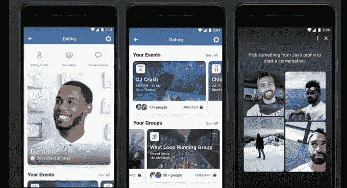

Facebook dating (Image source: [TechCrunch](https://techcrunch.com/2018/08/03/facebook-dating-feature/))

### 脸书的《工作场所》

脸书的《工作场所》是该公司对商业协作工具的一次尝试。它完全独立于用户的个人脸书帐户，需要一个工作电子邮件帐户来设置。最初于 2016 年宣布，脸书试图利用用户对该平台的熟悉，以及它与其他常用商业应用和工具集成的轻松程度。该工具的标准层仅通过邀请提供。有兴趣获得 premium 帐户的公司可以开始注册，无需邀请。

## 其他随机脸书统计和事实

如果让你猜猜扎克伯格一年挣多少钱，那会是数百万——很高的数百万，你可能不会错。但是，如果你猜到他的工资是多少，你就不会接近了。扎克伯格的年薪只有可笑的 1 美元。虽然扎克伯格的脸书网址是[https://www.facebook.com/zuck](https://www.facebook.com/zuck)，但它原本是[www.facebook.com/4](http://www.facebook.com/4)，因为他是第四个加入该网站的人。现在，他的旧网址只是重定向到他的新网址。尽管脸书在世界上有巨大的吸引力，但它在世界上最大的在线市场之一——中国却不见了。事实上，脸书在中国是被禁止的。这对于任何一个 T4 的粉丝来说都是一种耻辱，c 罗是社交媒体网站上最受欢迎的名人，拥有 1.22 亿粉丝。在这方面，夏奇拉以 1.02 亿粉丝获得银牌。

## 摘要

这家社交媒体巨头在世界上的相关性日益增长，从它最初作为一个评价这个人有多热的网站开始，这意味着它的历史充满了有趣的脸书统计数据，可以帮助你了解该公司的轨迹。

尽管脸书已经失去了对青少年的吸引力，这可能会给该公司带来问题，但营销人员仍在该网站上投入数十亿美元做广告，因为它有能力根据人口统计和兴趣锁定用户。

无论你如何使用脸书，了解正确的脸书统计数据将帮助你最大限度地利用社交媒体平台。如果脸书是你的主要社交渠道之一，一定要阅读我们的最佳 WordPress 脸书插件列表。没有看到你最喜欢的脸书统计数据或事实？在下面的评论区分享吧！

* * *

让你所有的[应用程序](https://kinsta.com/application-hosting/)、[数据库](https://kinsta.com/database-hosting/)和 [WordPress 网站](https://kinsta.com/wordpress-hosting/)在线并在一个屋檐下。我们功能丰富的高性能云平台包括:

*   在 MyKinsta 仪表盘中轻松设置和管理
*   24/7 专家支持
*   最好的谷歌云平台硬件和网络，由 Kubernetes 提供最大的可扩展性
*   面向速度和安全性的企业级 Cloudflare 集成
*   全球受众覆盖全球多达 35 个数据中心和 275 多个 pop

在第一个月使用托管的[应用程序或托管](https://kinsta.com/application-hosting/)的[数据库，您可以享受 20 美元的优惠，亲自测试一下。探索我们的](https://kinsta.com/database-hosting/)[计划](https://kinsta.com/plans/)或[与销售人员交谈](https://kinsta.com/contact-us/)以找到最适合您的方式。*