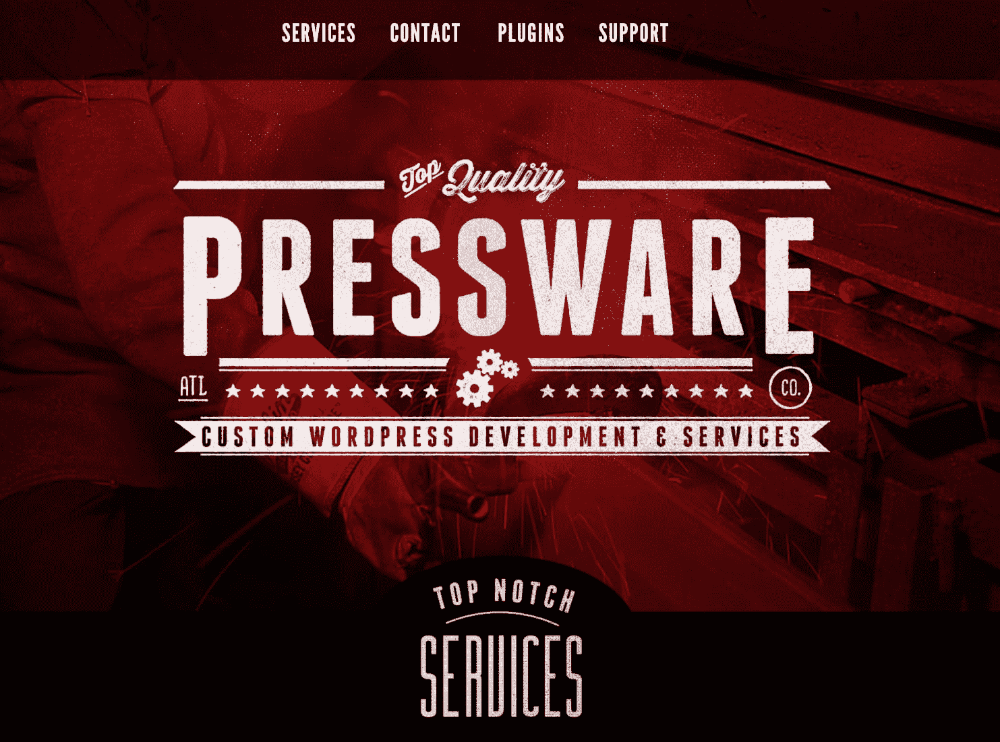

# 金斯塔·金并:汤姆·麦克法兰访谈

> 原文:[https://kinsta.com/blog/interview-tom-mcfarlin/](https://kinsta.com/blog/interview-tom-mcfarlin/)

Tom Mcfarlin 经营 Pressware，专注于为小企业和个人提供高质量的定制 WordPress 解决方案。他还写关于软件开发和 WordPress 的博客。你可以在推特上找到汤姆。这是我们最近对他的采访，作为我们[金斯塔·金并](https://kinsta.com/?post_type=post&s=kingpin)系列的一部分。

### Q1:你的背景是什么，你是如何开始使用 WordPress 的？

实际上，这是一个有点长的回答。

当我大约 10 岁的时候，我第一次对计算机产生了兴趣。当我很小的时候，我们有一个苹果的谎言，但我太小了，不能真正进入它。但是当我们有了第一台 PC(4MB 内存的 386)并在上面安装了 Wolfenstein 和 Doom 时。玩那两个游戏的那一刻，我就被迷住了。

Apple IIe (Image source: [The Centre for Computing History](http://www.computinghistory.org.uk/det/209/Apple-IIe/))

像许多同龄的孩子一样，我对电子游戏感兴趣，所以我玩了各种各样的游戏，如《星球大战:黑暗力量》、《毁灭战士》、《毁灭战士 II》、《沃尔芬斯坦》和《国王的探索》(第六部是最好的，这是无可争议的:)。

就互联网而言，我第一次“上网”是通过 Prodigy 的 14.4 波特调制解调器。但是一会儿还有更多。

然而，我使用这台机器的次数越多，我就越对我在屏幕上看到的东西感兴趣。具体来说，显示器上显示的米色盒子里发生了什么？此外，它如何响应鼠标和键盘的输入？

后来，我学会了所有关于磁盘、内存(和页面错误)、中断等等的知识。但那是十年后的事了。

总之，在那段时间，我花了很多时间在美国在线上，偶然发现了一个专门为计算机程序员设计的论坛(我不是，但非常好奇)。

> Kinsta 把我宠坏了，所以我现在要求每个供应商都提供这样的服务。我们还试图通过我们的 SaaS 工具支持达到这一水平。
> 
> <footer class="wp-block-kinsta-client-quote__footer">
> 
> 
> 
> <cite class="wp-block-kinsta-client-quote__cite">Suganthan Mohanadasan from @Suganthanmn</cite></footer>

[View plans](https://kinsta.com/plans/)

这最终导致我对 C 语言(特别是 Borland C\C++编译器)以及 Linux 的各种发行版(我第一次接触到它是 Slackware，然后是 Red Hat，但我离题了)有了可怕的准备。

无论如何，当 C 语言太难懂的时候，我学习了似乎更适合我的速度的 Visual Basic(至少在我 10 岁的时候)。

所以我买了一份 Visual Basic 3.0(横跨九张软盘)，开始尝试编写程序。我最终转向了 Visual Basic 5.0，并使用了我父母慷慨购买的另外两本书。

我完全被吸引住了，想继续学习这个，就我而言，我想以此为职业。

从初中到高中，再到大学。在那里，我在大学期间学习了计算机科学，重点是软件工程。

当我在学校的时候，大学的计算学院正在寻找一些学生来定期写博客，讲述他们在学校的经历。这包括写下学习材料、参加学生活动以及谈论在校生活的感受。

这是向学校展示学生生活的一种方式，但我不介意。

我喜欢写作。此外，学校选择让我们使用 WordPress 作为我们的博客平台。这是我第一次使用这个软件。我花了一些时间破解预装的主题，臭名昭著的 Kubrick，并编写了一些小的助手函数来实现一些功能，但没有什么花哨的。尽管如此，它在最终引导我做我今天所做的事情中发挥了作用。

哦！我真的毕业了，获得了计算机科学的学士学位。这是我第一次买 386 时就想去的地方。所以成就解锁或者随便你怎么称呼它。😄

除了在高中的短暂时间里，我认真考虑过组建一个乐队并从事专业工作，我基本上知道自己想做什么，并追求它，以此为职业，并继续在这个领域工作。

我不认为这些是理所当然的。

### Q2:读者应该知道你最近在 WordPress 做了些什么？

现在，我正在用 WordPress 做一些事情，所有这些我都用来谋生，并以某种方式为整个 WordPress 经济做贡献。

排名不分先后:

*   在[tommcfarlin.com](https://tommcfarlin.com/)每周至少写三次博客(目标是每周至少一篇针对会员的帖子)。
*   正在将一些会员内容转换成电子书。
*   专门为博客作者构建一套插件。
*   为小型企业和个人构建定制的解决方案，通常需要将第三方 API 与 WordPress 集成，并让系统相互通信以解决特定的业务需求。
*   运行[印刷机](https://pressware.co/)。

Pressware

虽然我喜欢编写和发布内容，并帮助他人找到更容易做到这一点的方法，但我看到许多人开始通过插件寻找第三方集成，这是我真正喜欢做的事情。

似乎有在这种能力下使用 WordPress 的需求，探索通过 REST API 可以做什么，与其他 API 通信，以及围绕它构建系统是很有趣的。

### Q3:在职业生涯中，你遇到了哪些挑战？

尽管我喜欢做我正在做的事情，也喜欢和我一起工作的客户，但在这个过程中肯定会有挑战(而且很可能永远都会有)。

我还没听说过有人在一个并非如此的行业工作的故事。这些挑战有些是业务层面的，有些是 WordPress 层面的。

 ## 注册订阅时事通讯

### 想知道我们是怎么让流量增长超过 1000%的吗？

加入 20，000 多名获得我们每周时事通讯和内部消息的人的行列吧！

[Subscribe Now](#newsletter)

首先，我倾向于在“需要知道”的基础上学习东西(就像开发人员喜欢说的那样，可能是“JIT”或“及时”)。😄也就是说，每当有新的东西被引入到 WordPress，我都会及时了解添加了什么，它的目的是什么，它的目标是解决什么，以及文档在哪里。

即使我不参与其中，我也会努力关注围绕它的讨论，然后我会意识到某个特性或一组 API 是存在的，以防我需要它们。我发现，每当我需要它们的时候，我的效率是最高的，而不是获得它们并且可能永远不会使用它们。

其次，从一个与商业更相关的角度来说，我有几次在我发表的东西、我陈述的东西或者我处理项目的方式上犯了错误。当然，这种感觉从来都不好，但我会尽我所能进行必要的对话，以了解特定的情况，利用它们，并在前进的过程中应用它们。

最后，我在这个行业面临的最后一个挑战是确保我在我认为最重要的核心能力领域保持相关和最新。

例如，因为 WordPress 专注于向后兼容性——就我而言，这是有充分理由的——所以很容易适应旧的代码编写方式或不太现代的工具。因此，最终引入的东西确实让我们的生活变得更容易，让编写代码成为一种极好的体验，但我们最终没有采用它们，因为我们觉得我们不需要这样做。

这是一种“如果它没坏，就不要修理它”的心态。但这是正确的心态，因为这不是什么东西坏了没坏的问题。更多的是“如果有什么事情你可以润色，为什么不花时间去做呢？”言外之意就是你有时间做，对吧？但是你明白我的意思。

这就是我如何看待采用包管理器、新的语言特性等等。它不是修复某样东西，而是打磨——相反，是增强——某样东西。

### 在 WordPress 的世界里，有没有什么让你感到惊讶的事情？

在很大程度上，不尽然。

如果我不得不挑选一件超出我最初预期的事情，那就是定制者已经发展到了什么程度。当它第一次出现时，我很喜欢它。它简单、直观、易于使用，而且编写代码时令人愉快。

现在，它已经成为一个非常重要的特征。它几乎就像是另一个软件中的一个小软件。比如 WordPress 中的 WordPress(一个半开玩笑的玩笑，针对那些可能英语不是母语的人。😄

这是好是坏，我不知道，事实上我也没有很强的立场。但我要说，这一特性的能力被发挥到如此程度，确实让我感到惊讶。

Struggling with downtime and WordPress problems? Kinsta is the hosting solution designed to save you time! [Check out our features](https://kinsta.com/features/)

另一方面，我知道通常会有很多关于新功能或某些东西的讨论，起初可能会感到难以置信的令人生畏，特别是如果在做事情的方式上有某种类型的范式转变。

但是，在与在这个行业和他们各自的行业中也是企业家和密友的家庭成员交谈时，我还没有发现一个行业不面临起初看起来并不完全令人畏惧的事情。

有些人可能觉得他们所知道的基础正在改变。也许这是真的。或许这有些夸张。

不管怎样，“变化是不可避免的”或者“唯一不变的是变化”这样的陈词滥调浮现在脑海中。做好准备，当它发生时，不要感到惊讶。

[Be prepared for change, and when it happens, don't be surprised. 😉Click to Tweet](https://twitter.com/intent/tweet?url=https%3A%2F%2Fkinsta.com%2Fblog%2Finterview-tom-mcfarlin%2F&via=kinsta&text=Be+prepared+for+change%2C+and+when+it+happens%2C+don%27t+be+surprised.+%F0%9F%98%89&hashtags=WordPress%2Cwebdev)

### Q5:你认为 WordPress 世界的未来会是怎样的？

我没有做很多“10 年后我想在这个时候做的事情。”最多，我会预测三年，但我真的会尝试一次专注于一年、一个季度、一个月、一周和一天的事情(我的日历，以及事情，都反映了这一点)。

在接下来的一年里，我想:

*   继续与希望集成第三方系统或拥有为其业务需求构建的定制插件的客户合作。
*   完成我已经开始的电子书。
*   继续增加我博客的成员。
*   开始构建博客插件(这将花费比预期长得多的时间)。

我倾向于每年比我想做的预测更多，所以我试图每年减少一点，直到我找到正确的平衡。

### 你在 WordPress 主机中寻找什么？

从一般的角度来看，我倾向于关注大多数用户会关注的东西。例如，这些是这样的事情:

*   正常运行时间
*   安全性
*   备份
*   子域或附加域
*   HTTPS
*   [客户支持](https://kinsta.com/kinsta-support/)

对于更高级的特性，我非常喜欢面向开发人员的特性，例如:

*   快速启动暂存环境的能力。
*   通过 [SSH](https://kinsta.com/help/connect-to-ssh/) 连接。
*   在命令行上使用工具。
*   选择数据中心和缓存机制，为最终用户提供可靠的体验。

### 问题 7:当你离开笔记本电脑时，你喜欢做什么？

你很可能会发现我和家人在一起，弹吉他，健身，玩电子游戏，看电影或电视节目，或者阅读。

### 问题 8:接下来我们应该采访谁&为什么？

我推荐采访卡尔·亚历山大。他是一个非常有才华的开发人员，在北美的 WordCamps 中是一个多产的演讲者。

他高度参与 WordPress 社区，在面向对象编程方面极具天赋，并打算通过他的博客向其他人传授这些原则。

如果你想在 WordPress 的环境下更好地编写面向对象的代码，但你没有关注或阅读他发表的内容，那么你就错过了。

* * *

让你所有的[应用程序](https://kinsta.com/application-hosting/)、[数据库](https://kinsta.com/database-hosting/)和 [WordPress 网站](https://kinsta.com/wordpress-hosting/)在线并在一个屋檐下。我们功能丰富的高性能云平台包括:

*   在 MyKinsta 仪表盘中轻松设置和管理
*   24/7 专家支持
*   最好的谷歌云平台硬件和网络，由 Kubernetes 提供最大的可扩展性
*   面向速度和安全性的企业级 Cloudflare 集成
*   全球受众覆盖全球多达 35 个数据中心和 275 多个 pop

在第一个月使用托管的[应用程序或托管](https://kinsta.com/application-hosting/)的[数据库，您可以享受 20 美元的优惠，亲自测试一下。探索我们的](https://kinsta.com/database-hosting/)[计划](https://kinsta.com/plans/)或[与销售人员交谈](https://kinsta.com/contact-us/)以找到最适合您的方式。