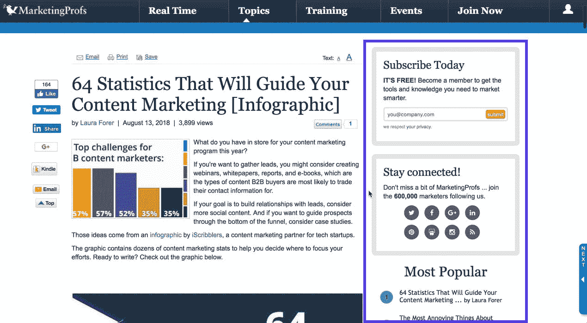
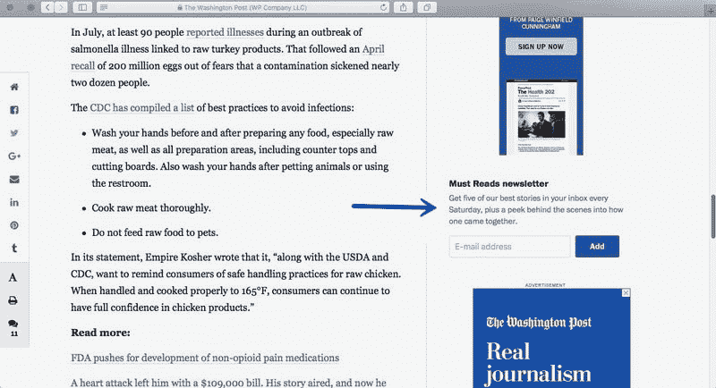
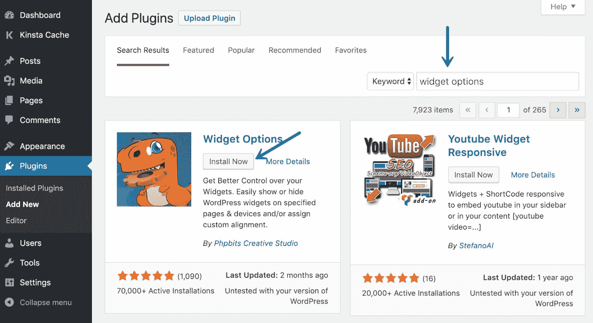
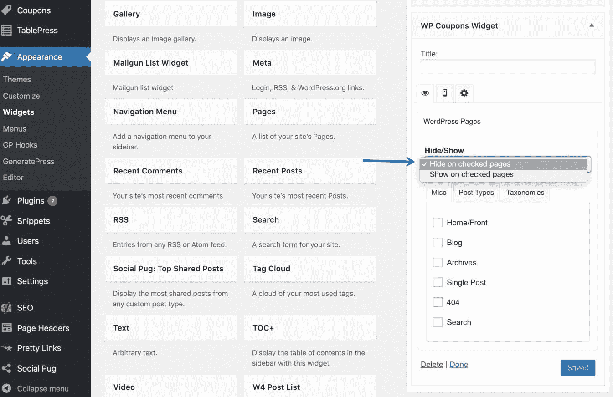
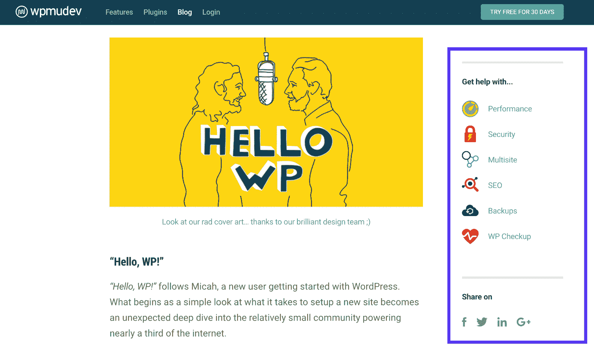
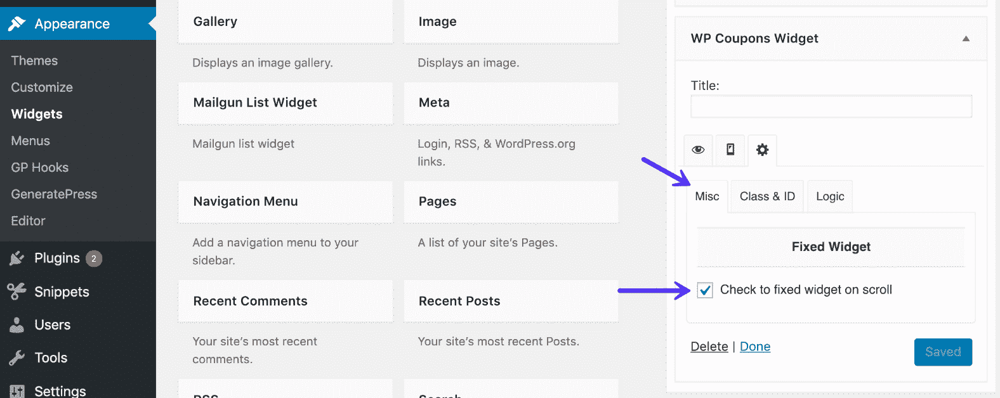

# 如何显示动态侧栏和窗口小部件来降低跳出率

> 原文:[https://kinsta.com/blog/wordpress-dynamic-sidebars-widgets/](https://kinsta.com/blog/wordpress-dynamic-sidebars-widgets/)

今天我们将深入探讨动态侧栏和窗口小部件(那些与内容相关的)；更重要的是，他们如何帮助降低你的网站的跳出率，从而提高你的转化率。

我们将向您展示如何创建侧边栏，以及基于当前页面或帖子的主题或内容向您的访问者显示他们想要看到的内容的[小部件](https://kinsta.com/blog/wordpress-widgets/)。

## 什么是跳出率？

在我向您展示如何通过显示与内容相关的侧栏和小部件来降低跳出率之前，让我们先来定义一下[跳出率](https://kinsta.com/blog/how-to-reduce-bounce-rate/#what-is-bounce-rate)。

跳出率指的是进入和离开网站而不是停留在网站上探索其他页面的**百分比。为了降低跳出率，你需要增加参与度，这能告诉你网站可用性的更多信息。当访问者发现你的内容有用时，他们会留下来，并愿意探索网站上更有用的内容。这反过来给你一个更高的转化率。访问者在你的网站停留的时间越长，销售、注册和广告收入的可能性就越大。**

当然，你希望他们呆得更久，所以你必须有能阻止他们过早离开的东西——有用的内容。

[You want users staying as long as possible, which means you need something to keep them from leaving - useful content. 📗Click to Tweet](https://twitter.com/intent/tweet?url=https%3A%2F%2Fkinsta.com%2Fblog%2Fwordpress-dynamic-sidebars-widgets%2F&via=kinsta&text=You+want+users+staying+as+long+as+possible%2C+which+means+you+need+something+to+keep+them+from+leaving+-+useful+content.+%F0%9F%93%97&hashtags=contentmarketing%2CCRO)

## 可用性:降低跳出率的关键

仅仅为网站访问者提供有用的内容是无法实现网站可用性的。你还必须优化你在每一页上显示的工具，以使它们能够相互作用。此外，这些工具还应该与特定页面上使用的内容相关。


我所指的工具是给定页面中的导航栏和所有 widget 化区域，包括侧边栏。虽然对许多人来说，导航栏在确保用户参与方面发挥了最大的作用，但你不能想当然地认为小部件区域的力量是理所当然的。当你意识到 WordPress 为你提供了许多不同的方式来轻松控制它们时，尤其如此。

侧边栏是主要的小部件占位符，它可以决定网站的可用性。为什么？—因为把你喜欢的小部件放在边栏上很方便，不用考虑这些小部件是否与主内容相关。

## 什么是 WordPress 动态(内容相关)边栏？

与主要内容相关的侧边栏指的是显示小部件的侧边栏，这些小部件是根据适用性仔细选择的，出现在给定页面上特定内容的旁边。例如，与特定博客文章相关的侧边栏将包含诸如时事通讯选择加入和相关文章之类的小部件。

下面的截图显示了[MarketingProfs.com](https://www.marketingprofs.com)侧边栏的区别。

### 播客页面(截图 A)

在这篇博客文章中，MarketingProfs 展示了以下小部件:建议、订阅链接和最受欢迎的帖子。


Dynamic sidebar (Screenshot A)


### 文章页面(截图 B)

在这篇博客文章中，MarketingProfs 展示了以下小部件:订阅选择加入、社交媒体小部件、最受欢迎的帖子。



Dynamic sidebar (Screenshot B)


## 动态侧边栏如何帮助降低跳出率

侧边栏有助于网站访问者决定下一步采取什么行动。例如，从博客文章页面，他们可以选择注册订阅时事通讯。如果您有多个时事通讯类别，您可以显示博客文章所属类别的订阅小部件。每个小工具都标有特定类别的名称，因此读者可以准确地知道他们订阅了什么。看看下面取自《华盛顿邮报》的图片。

与内容相关的边栏也有助于**有针对性的营销**。您可以创建一个侧栏，专门用于根据人口统计信息分组的站点用户。例如，您可以为网站的不同语言版本制作边栏，根据位置在边栏中显示联系链接，或者根据他们的兴趣显示产品促销。或者根据博客文章的类别创建不同的边栏。

《华盛顿邮报》将“必读”列为时事通讯的类别之一。这个小部件出现在这篇题为“美国疾病预防控制中心称，沙门氏菌污染的鸡肉在多州爆发中导致 1 人死亡，17 人患病”的文章中，以及属于同一类别的所有其他文章中。



Dynamic sidebar widget A


另一方面，这篇来自《华盛顿邮报》(Washington Post)的科技文章“脸书和 Twitter 高管下周将向国会作证”，在侧栏中显示了小部件“科技新闻电子邮件提醒”，目标读者是科技相关的故事。


Dynamic sidebar widget A


带有与内容相关的小部件的侧边栏也有助于改善搜索引擎优化。使用整个标题标签或其中的一部分作为小工具标题可以对[搜索引擎优化](https://kinsta.com/blog/what-does-seo-stand-for/)产生微小但有意义的影响。

### 向侧边栏添加相关的小部件

创建内容相关侧边栏的第一步是决定什么是相关的，什么是不相关的。决定在一个页面或帖子上显示哪些小部件需要深入理解其目的，以及最初创建该页面或帖子的原因。

例如，您创建了一个产品页面，不仅解释产品的功能、优点和定价。你这样做也是为了引导访问者购买或考虑类似或相关的产品。此外，你可能想炫耀产品的最高评级和最好的评论，可以帮助他们决定购买它。或者，您可能希望帮助他们联系销售代表来回答问题。无论他们采取什么行动，页面都必须告诉他们如何去做。侧边栏是放置行动号召按钮的最佳位置之一。因此，侧边栏成为一个非常强大的工具，让你的访问者参与到你的网站中。

例如，Kinsta 根据博客文章的类别在他们的博客上使用不同的 CTA。这有助于确保信息的针对性和文章主题的相关性。


Sidebar widget CTA


### 剔除无关的小部件

此外，决定什么不放在侧边栏和什么放在那里一样重要。页面上侧边栏和其他小部件区域的密度决定了页面的整体外观。剔除不相关或多余的小部件解决了跳出率的同样问题。事实上，一些网站可能会发现根本没有侧边栏是更好的选择。

也许你在侧边栏中放了一些小部件，因为你认为它们对你的访问者可能有用。然而，过度拥挤的页面可能会吓跑潜在客户。如果页面上发生了太多的事情，访问者可能会忘记是什么让他们首先来到这里。我指的是太多的外部广告工具或者太多的产品链接。

简而言之，决定哪些侧边栏内容是相关的，对于提高用户参与度至关重要。

### 突出显示重要的小部件

在决定将什么放入侧边栏后，您可以让某些小部件脱颖而出。一种方法是让它们出现在其他小部件区域，比如页脚。另一种方法是当用户滚动时，将它们固定并浮动在页面上。这使得用户可以立即与他们互动，而不必上下滚动。

## 下一步:选择最佳方法

既然我们已经讨论了使用哪些小部件的重要性，下一步就是选择创建这些内容相关侧栏的方法。这里有两种方法:

### 选项 1——用 WordPress 插件控制部件的可见性

控制侧边栏上小部件可见性的最简单方法之一是使用 WordPress 插件。像 [Widget Options](https://wordpress.org/plugins/widget-options/) 这样的插件让你只需简单点击几下就能做到。您可以显示或隐藏每个帖子或页面的侧边栏内容，条件包括类别、标签、页面名称等。

## 注册订阅时事通讯


### 想知道我们是怎么让流量增长超过 1000%的吗？

加入 20，000 多名获得我们每周时事通讯和内部消息的人的行列吧！

[Subscribe Now](#newsletter)

[](https://widget-options.com/)

Widget Options WordPress plugin


Widget Options 插件目前有超过 70，000 个活跃安装，令人印象深刻的 5 星评级。你可以从 [WordPress 知识库](https://wordpress.org/plugins/widget-options/)下载它，或者在你的 WordPress 仪表盘的“插件→添加新插件”下搜索“小部件选项”然后点击“立即安装”并激活插件。



Install Widget Options plugin


### 隐藏特定页面的小部件

一旦你安装并激活了插件选项插件，你可以很容易地隐藏一个特定页面的插件，只需点击几下。为了说明这一点，下面是一个优惠券小部件的截图。在小部件的设置下，现在有一个可见性选项:您可以选择在选定的页面上隐藏或显示该小部件。



Widget Options’ Hide/Show Widgets on Specific Pages


### 限制来自特定帖子的小部件

您还可以通过使用条件标签来隐藏博客文章中的小部件。使用小部件选项，这个过程比简单地隐藏页面需要更多的步骤。您需要首先[定位文章 ID](https://kinsta.com/blog/wordpress-get-post-id/) ，因为这需要包含在您想要隐藏文章的条件标签中。

要找到文章 ID，浏览到文章并将鼠标悬停(不要点击)在 WordPress 管理工具栏的“编辑文章”选项上。在浏览器的左下方，您应该会看到文章 ID #。


WordPress find post ID


一旦您有了文章 ID，您就可以将它与以下条件标签一起使用。

**隐藏多个帖子中的小工具:**

```
!is_single(array('Post ID', 'Post ID'))
```

**隐藏单个帖子中的小工具:**

Struggling with downtime and WordPress problems? Kinsta is the hosting solution designed to save you time! [Check out our features](https://kinsta.com/features/)

```
!is_single( 'Post ID' )
```

在你想在文章中隐藏的小部件上，进入“逻辑”标签，输入如下所示的标签。


WordPress widget logic


此外，如果您需要使用与页面或帖子的标题标签相关的小部件标题，您可以根据需要放置多个该小部件的副本，并为每个副本创建一个唯一的标题。

### 对移动设备隐藏小部件

您还可以限制在特定设备类型上查看页面或帖子时小部件的可见性。

由于屏幕尺寸有限，当从移动设备(如智能手机或平板电脑)上查看时，很容易使页面或帖子看起来拥挤。我们希望确保每个页面在桌面和移动视图上都不会看起来太密集。然而，我们也想利用更大的桌面屏幕在尽可能多的窗口小部件区域显示相关的窗口小部件。

例如，我们希望电子邮件选择同时出现在侧栏和页脚中。另一方面，当在移动设备上查看时，我们希望摆脱重复的窗口小部件。小部件选项允许您在移动视图中隐藏小部件。


Hide widget on mobile devices


### 修复侧边栏小部件

控制窗口小部件可见性的另一种方法是使它们固定，这意味着当用户在页面或博客文章上上下滚动时，它们会跟随用户。如果你保持侧边栏的整洁，或者只将它应用到一两个小部件上，你就不必担心它会变得太显眼。看下面的截图。WPMU Dev 在他们的博客上有一个很好的应用。

社交分享小部件漂浮在页面上，不会遮蔽主要内容，并鼓励访问者随时采取行动。这意味着他们不必向上滚动到侧边栏区域来与这些小部件交互。



Example of a fixed sidebar widget


Widget Options 提供了一个选项，您可以在其中固定任何 Widget，并在访问者滚动时跟随他们。你可以选择修复所有的侧边栏小工具，或者只选择一两个你认为比其他需要更多曝光的小工具。



Fixed sidebar widget


### 选项 2–添加自定义侧栏

第二种选择是通过编码手动创建自定义侧栏。这比使用第三方插件要繁琐一些，第三方插件只需点击几下就可以创建侧边栏。然而，因为 WordPress 提供了很多编码选项，你可以选择使用它。这样，你就可以创造出你想要的东西。

要开始，您需要注册一个 widgetized 区域。然后，将其保存并上传到您的服务器，以便从微件菜单访问它。为此，您需要将以下代码输入到您的[子主题](https://kinsta.com/blog/wordpress-child-theme/)的`function.php`文件中。或者你可以使用免费的插件，比如[代码片段](https://wordpress.org/plugins/code-snippets/)。

它附带了一些元素，您可以根据需要进行更改。请参见以下示例:

```
<?php
/*
* Create Custom Widget Area for Pages Only
*/
function page_only_custom_sidebar() {
register_sidebar(
array (
'name' => __( 'For Pages Only', 'your-site' ),
'id' => 'page-only-custom-sidebar',
'description' => __( 'Contents to this widget area will be displayed on pages only.', 'your-site' ),
'before_widget' => '<section id="%1$s" class="widget %2$s">',
'after_widget' => "</section>",
'before_title' => '<h3 class="widget-title">',
'after_title' => '</h3>',
)
);
}
add_action( 'widgets_init', 'page_only_custom_sidebar' );
?>
```

下一步是让侧边栏在网站的某个地方可见。要使其工作，请将其添加到您希望它们可见的位置的模板文件中。看看下面的代码，它的目的是让侧边栏只出现在页面上。

为此，我们将它放在主题的`page.php`文件中。在 2017 主题的情况下，这意味着它看起来像这样:

```
<?php if ( is_active_sidebar( 'page-only-custom-sidebar' ) && is_page() ) : ?>

<?php dynamic_sidebar( 'page-only-custom-sidebar' ); ?>

<?php endif; ?>
```

## 轮到你了:你如何降低跳出率？

我在这里展示的只是降低跳出率的几种方法中的一小部分。侧边栏是网站上最常被忽视的地方之一，它可以成为让访问者探索你的网站的有力工具，从而增加转化的机会。创建与内容相关的侧边栏并不困难，尤其是有了 WordPress 知识库上所有易于使用的插件。

此外，由于参与是降低跳出率的关键方法之一，要实现它，你需要[检查你网站的可用性](https://kinsta.com/blog/website-usability-testing/)。

> 为了达到可用性，请记住内容为王。你从有用的内容开始，将它们与合适的子内容(小部件、链接、与内容相关的侧栏)配对，这将鼓励他们探索你的网站。
> 
> —杰弗里·卡兰当(@ jeffreycarandng)[2018 年 11 月 1 日](https://twitter.com/jeffreycarandng/status/1057955226630545408?ref_src=twsrc%5Etfw)