# Pingdom 速度测试工具:2022 年终极指南

> 原文:[https://kinsta.com/blog/pingdom-speed-test/](https://kinsta.com/blog/pingdom-speed-test/)

今天我们想深入探讨如何更好地使用和理解来自流行网站速度测试工具 [Pingdom](https://tools.pingdom.com/) 的数据。你可以用它对你的 WordPress 网站进行瀑布分析。这可以帮助您快速诊断性能问题，而不是误诊问题。

我们经常看到 WordPress 用户在 Pingdom 速度测试工具中错误地解释数据，这有时会导致将网站配置到比以前更糟糕的状态。记住，像这样的所有工具都是作为指南使用的。它们从来都不是 100%准确的。重要的是**保持一致，在所有测试中使用相同的工具**。

 ## 什么是 Pingdom 速度测试工具？

Pingdom 是一家总部位于瑞典的公司(现为网络安全管理软件产品所有)，提供各种服务，如正常运行时间监控、页面速度监控、交易监控、服务器监控和访客洞察(RUM)。他们最出名的事情之一是他们的免费网站速度测试工具。它是 WordPress 社区中最流行的[性能测试工具](https://kinsta.com/blog/website-speed-test/)之一。

为什么这么受欢迎？嗯，首先，它可能是最容易使用的速度测试工具！不是每个人都是 web 性能专家，所以对于典型的 WordPress 用户来说，其他一些替代工具可能会让人不知所措。正如人们所说，有时少即是多。毕竟，你只关心你的网站有多快，以及如何让它变得更快。

[](https://tools.pingdom.com/)

Pingdom website speed test


Pingdom 目前允许您从全球 7 个不同地点(五大洲)测试任何网站的速度:

*   亚洲-日本-东京
*   欧洲-德国-法兰克福
*   欧洲-英国-伦敦
*   北美-美国-华盛顿特区
*   北美–美国–旧金山
*   太平洋-澳大利亚-悉尼
*   南美–巴西–圣保罗

注意:我们已经注意到，有时并非所有的测试位置都可用。这很可能是因为它已经停机维护，或者因为太多人试图在它上面运行测试而过载。如果您一直使用的测试站点位置不再存在，请在一两个小时后再次查看。很有可能，它会再次出现。


> Kinsta 把我宠坏了，所以我现在要求每个供应商都提供这样的服务。我们还试图通过我们的 SaaS 工具支持达到这一水平。
> 
> <footer class="wp-block-kinsta-client-quote__footer">
> 
> 
> 
> <cite class="wp-block-kinsta-client-quote__cite">Suganthan Mohanadasan from @Suganthanmn</cite></footer>

[View plans](https://kinsta.com/plans/)

你选择的测试地点对你网站的物理位置至关重要。这就是所谓的[网络延迟](https://kinsta.com/blog/network-latency/)发挥作用的地方。但是我们将在下面更详细地讨论这个问题。

 ## 使用 Pingdom 速度测试工具进行瀑布分析

网页由不同的资源组成，比如 HTML、JavaScript、CSS、图像和视频。每一个都会产生请求来呈现你在网站上看到的内容。通常情况下，你的请求越多，你的网站加载速度就越慢。情况并非总是如此，但大多数时候都是如此。

下面，我们将分解每个 Pingdom 部分，更详细地解释这些信息的含义，因为它与您的网站的整体性能有关，以及如何进行瀑布分析。

*   [Pingdom 摘要](#pingdom-summary)
*   [性能洞察](#pingdom-performance)
*   [响应代码](#pingdom-response)
*   [按内容类型划分的内容大小和请求](#pingdom-content-type)
*   [按域划分的内容大小和请求](#pingdom-content-domain)
*   [瀑布图](#pingdom-waterfall-chart)
*   [案例研究领域配置](#pingdom-config)

## Pingdom 摘要

当你通过 Pingdom 运行你的 WordPress 网站时，它会生成一个性能等级，一个总的加载时间，总的页面大小，以及你网站上的请求数量。在我们的例子中，它是一个运行简单数字下载的电子商务网站。它托管在金斯塔超快的服务器上。

如您所见，我们运行了第一个测试，在 Pingdom 上获得了 88/100 的分数，总加载时间为 541 毫秒，这让我们知道了我们组合资产的总大小和请求的数量。


Pingdom speed test before DNS and cache


然后我们运行了一个[额外测试](https://tools.pingdom.com/#59bb1f30f7c00000)，现在我们的总加载时间是 392 ms，页面大小和请求数量相同！这是怎么回事？🤔如果您多次通过 Pingdom 速度测试工具运行您的网站，您可能会注意到这一点。较大的网站会注意到更大的差异。

出现这种情况主要有三个原因: **DNS 缓存、CDN 缓存、WordPress**T2 缓存。这就是为什么您应该总是多次运行测试。当然，对第三方资源和 API 的外部调用也会对此产生影响。在下面的[瀑布分析](#pingdom-waterfall-chart)中找出原因。


Pingdom speed test after DNS


想在你的 WordPress 网站上获得更好的 Pingdom 分数吗？取决于你的网站和配置，它可能不总是有可能得分完美的 100/100，特别是那些运行电子商务网站和营销像素。但是简单地花些时间提高你的分数是一个很好的开始。整体速度才是真正重要的。

有时用户体验也可能胜过你在网上读到的一些网络性能技巧。**用户体验不能忘！**但是请放心，我们将在下面分享一些技巧和诀窍，告诉你我们是如何得到上面的网站的，所以请继续阅读。

[说到 web 性能优化，不能忘记用户体验！🚀 点击推文](https://twitter.com/intent/tweet?url=https%3A%2F%2Fkinsta.com%2Fblog%2Fpingdom-speed-test%2F&via=kinsta&text=When+it+comes+to+web+performance+optimization%2C+you+can%27t+forget+the+user+experience%21+%F0%9F%9A%80&hashtags=webperf%2Cwebdev)


## 提高页面性能

performance insights 部分，即现在的“改善页面性能”**于 2018 年更新，**他们删除了一些旧项目，并添加了新项目。这很可能是因为他们报告的一些建议不再像过去那样相关。说到 web 性能优化，事情是不断变化的。如果人们只是想追求完美的 Pingdom 分数，有时会很麻烦。

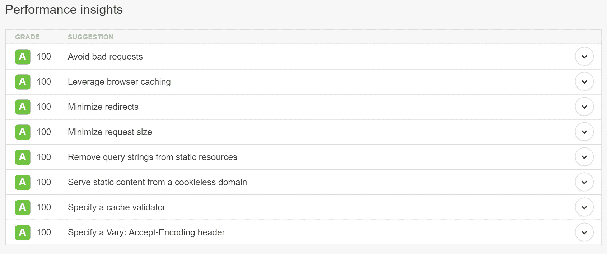

Pingdom performance insights


然而，我们把这一整节留在我们的帖子里(一些旧的和新的)，因为理解这些分数是如何计算的是很重要的。这些基本上都是基于[谷歌页面速度洞察规则](https://developers.google.com/speed/docs/insights/rules)。一般来说，如果你在你的站点上改进这些，你应该减少你的整体加载时间。

以下是改善页面性能部分中的几个类别:

*   [使用内容分发网络(CDN)](#use-cdn)
*   [避免 HTTP 404(未找到)错误](#avoid-http-404)
*   [最小化重定向](#minimize-redirects)
*   [添加过期标题](#add-expires-headers)
*   [从静态资源中移除查询字符串](#remove-query-strings)
*   [使用无 Cookie 域](#use-cookie-free-domains)
*   [跨主机名并行下载](#parallelize-downloads-across-hostnames)
*   [指定缓存验证器](#specify-cache-validator)
*   [指定一个 Vary: Accept-Encoding 头](#specify-vary-accept-encoding-header)

现在让我们深入其中的一些，看看哪些仍然适用于今天。

### 使用内容交付网络(CDN)

今天在你的 WordPress 站点上实现的最关键的服务之一是一个[内容交付网络](https://kinsta.com/blog/wordpress-cdn/) (CDN)。这些是遍布全球的服务器网络(也称为 pop)。它们被设计用来托管和交付你的 WordPress 站点的静态(有时是动态)内容，比如图像、CSS、JavaScript 和视频流。

如果你是 Kinsta 的客户，我们会在我们的托管计划中包含一个 CDN。启用它需要几次点击。CDN 的一些好处包括性能提升(更低的 TTFB 和网络延迟)、更低的带宽和托管成本，甚至还有 [SEO](https://kinsta.com/blog/what-does-seo-stand-for/) 优势。

[Kinsta 客户](https://kinsta.com/plans/?plan=visits-business1&interval=month)也可以通过使用内置于 [MyKinsta 仪表板](https://kinsta.com/mykinsta/) 中的 [代码缩小功能](https://kinsta.com/help/kinsta-cdn/#code-minification-1) 来缩小您的代码，从而享受快速而轻松的整体站点优化。这使得客户只需简单的点击就可以实现 CSS 和 JavaScript 的自动缩小，从而有效地加速他们的网站，而无需手动操作。

**重要提示:**最新更新的 Pingdom 工具目前存在一个 bug，可以正确准确地检测任何 CDN 提供商。


Use a Content Delivery Network (CDN)


我们推荐的一些第三方 CDN 提供商包括:

*   [KeyCDN](https://www.keycdn.com/) (这就是 Kinsta CDN 的动力)
*   [Cloudflare](https://www.cloudflare.com/)
*   [堆栈路径](https://www.stackpath.com/)
*   [CDN77](https://www.cdn77.com/)

在我们自己的 [CDN 速度测试](https://kinsta.com/blog/wordpress-cdn/#cdn-speed-tests)中，我们发现在某些情况下，CDN 可以**减少页面加载时间超过 50%** ！


### 避免 HTTP 404(未找到)错误

这一部分以前被称为“避免不良请求”而这个**总是相关的**！这个警告就像它听起来一样，是一个无法成功完成的请求。这通常发生在您手动链接到已经被删除的资产或图像时，导致 [404 错误](https://kinsta.com/blog/error-404-not-found/)。这在 Pingdom 中显示为一个橙色圆圈，并在响应头状态上显示 404。


Avoid bad requests – 404 error


始终确保网站上的每个请求都返回成功状态。这将确保不会对不再存在的资产生成任何查询。

### 最小化重定向

太多的重定向总是你需要小心的。简单的重定向，如单个 301 重定向，HTTP 到 HTTPS，或 www 到非 www(反之亦然)是可以接受的。很多时候，在你的网站的某些区域需要这些。然而，每一个都有你网站性能的代价。如果你开始将重定向一个接一个的堆叠起来，那么意识到它们是如何影响你的站点的性能是很重要的。这适用于页面和帖子重定向，图像重定向，一切。

一个重定向在 Pingdom 中显示为一个蓝色圆圈，在响应头状态上显示为 301 或 302。

重定向对你的网站有多大影响？让我们做一个小测试。首先，我们在联系我们页面上运行一个[速度测试](https://tools.pingdom.com/#59baff78fd800000)。我们得到的总加载时间为 417 毫秒，如下图所示。


Website speed test with no redirects


然后，我们稍微修改 URL，并运行另一个[速度测试](https://tools.pingdom.com/#59bafc3397400000)来查看多次重定向的影响。如您所见，现在加载相同的页面需要 695 毫秒。增长了 66%。呀！

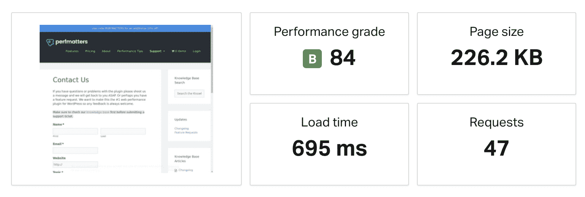

Website speed test with multiple redirects


查看我们关于 [WordPress 重定向](https://kinsta.com/blog/wordpress-redirect/)的深度文章，以及提高性能的最佳实践。

### 添加过期标题

这个建议以前被称为利用浏览器缓存。简单来说，WordPress 站点上的每个脚本都需要有一个 HTTP 缓存头(或者应该有)。这决定了文件上的缓存何时过期。要解决这个问题，确保你的 WordPress 主机有正确的`cache-control`标题和`expires`标题设置。Kinsta 在我们所有的服务器上都安装了这些头。

查看手动添加缓存头到你的服务器的步骤，并阅读我们关于如何添加过期头的指南。

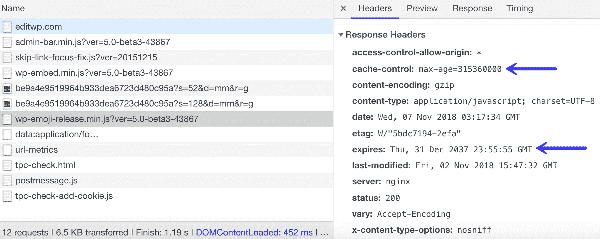

Leverage browser caching – caching headers


另一个问题是，当您加载第三方脚本时，您无权添加缓存头，因为您无法控制他们的 web 服务器。常见的罪魁祸首包括谷歌分析脚本和营销像素，如脸书和推特。要解决这个问题，你可以用一个第三方插件在本地托管你的 Google Analytics 脚本(虽然这不是官方支持的)。 [WP Rocket](https://kinsta.com/blog/wp-rocket/) 现在也可以选择在本地托管你的脸书营销像素。

本地移动脚本对站点性能的影响会有所不同。一个好处是你可以完全控制文件，并可以从你的 CDN 提供服务。这也删除了另一个第三方 DNS 请求。然而，记住这些文件可能已经缓存在人们的浏览器中也很重要。

查看我们关于如何[修复利用浏览器缓存警告](https://kinsta.com/blog/leverage-browser-caching/)的深度帖子。

### 从静态资源中移除查询字符串

另一个常见问题是处理查询字符串。您的 CSS 和 JavaScript 文件通常在它们的 URL 末尾有文件版本，比如`https://domain.com/file.min.css**?ver=4.5.3**`。一些服务器和代理服务器无法缓存查询字符串。所以通过移除它们，你有时可以提高你的[缓存](https://kinsta.com/blog/wordpress-cache/)。

或者你可以手动添加下面的代码到你的主题的`functions.php`文件中。一个更好的选择是使用像[代码片段](https://wordpress.org/plugins/code-snippets/)这样的免费插件来添加代码。这样你就不用直接编辑你的主题了。

```
function remove_query_strings() {
   if(!is_admin()) {
       add_filter('script_loader_src', 'remove_query_strings_split', 15);
       add_filter('style_loader_src', 'remove_query_strings_split', 15);
   }
}

function remove_query_strings_split($src){
   $output = preg_split("/(&ver|\?ver)/", $src);
   return $output[0];
}
add_action('init', 'remove_query_strings');
```

然而，在您立即在您的站点上去除查询字符串之前，知道为什么使用它们是很重要的。WordPress 开发者通常使用文件版本控制来解决缓存问题。

例如，如果他们推出一个更新，并将`style.css`从`?ver=4.6`更改为`?ver=4.7`，它将被视为一个全新的 URL，不会被缓存。如果您删除查询字符串并更新插件，这可能会导致缓存版本继续提供服务。在某些情况下，这可能会破坏站点的外观，直到缓存资源过期或缓存被完全刷新。

此外，一些 cdn 可以缓存查询字符串。默认情况下, [Kinsta CDN](https://kinsta.com/help/kinsta-cdn/) 能够并且确实如此。因此，如果您是 Kinsta 客户，查询字符串已经缓存在您的资产中。

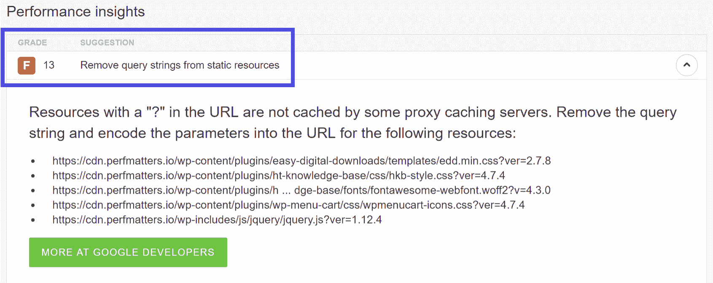

Remove query strings from static resources warning


参见我们关于如何从静态资源中移除查询字符串的深入教程。

### 使用无 Cookie 的域

我们有一篇关于处理来自无 cookie 域警告的[服务静态内容的深度文章。通常，您可以忽略这个警告，因为像](https://kinsta.com/knowledgebase/serve-static-content-from-a-cookieless-domain/) [HTTP/2](https://kinsta.com/learn/what-is-http2/) 这样的新协议现在使它变得不那么重要了。一个新的连接通常比通过相同的连接传输所有的东西更昂贵。然而，解决这个问题的两种方法是使用一个 CDN 提供商来剥离 cookies 或者创建一个单独的域或[子域](https://kinsta.com/blog/wordpress-subdomain/)。


Serve static content from a cookieless domain warning


### 用 GZIP 压缩部件

当 Pingdom 检测到一个资产没有用 GZIP 压缩[时，就会出现“用 GZIP 压缩组件”的警告。GZIP 是一种压缩方法，用于减小 HTML 文档和 CSS/JS 文件等基于文本的文件的大小。服务器上启用了 GZIP 压缩，在将网页和资源发送给访问者之前会对其进行压缩。从我们的测试中，我们看到启用 GZIP 压缩将请求的文件大小减少了 78%以上。](https://kinsta.com/blog/enable-gzip-compression/)


Compress Components with GZIP


在 Kinsta，你不必担心启用 GZIP，因为每个 Kinsta 站点都已经受益于 Brotli 压缩，这是一种比 GZIP 压缩更快的替代方法。这都要归功于我们独特的 [Cloudflare 集成](https://kinsta.com/knowledgebase/cloudflare-integration/)。这意味着你的 Kinsta 托管的网站比使用 GZIP 的竞争对手更快，在较小的设备上可以快速加载。

如果在服务器上启用 GZIP 后，您仍然看到“使用 GZIP 压缩组件”,则可能是托管站点所需外部资源的服务器没有启用 GZIP 或 Brotli 压缩。如果是这种情况，您无法改变服务器的行为。

### 跨主机名并行下载

“跨主机名并行下载”警告是由于 HTTP/1.1 和 web 浏览器受限于它们可以与主机建立的并发连接数的限制而产生的；通常是六个连接。此警告通常出现在有大量请求的网站上。在过去，绕过这个限制的唯一方法是实现他们所谓的域分片。

然而，假设您使用支持 HTTP/2 的 web 主机或 [CDN 提供商。在这种情况下，您现在可以安全地忽略这一点，因为现在可以通过单个连接并行加载多个资源。但是你也可以看看我们的教程](https://kinsta.com/blog/wordpress-cdn/)[如何通过实现域分片来修复跨主机名的并行下载警告](https://kinsta.com/blog/pingdom-speed-test/#parallelize-downloads-across-hostnames/)。

 ## 注册订阅时事通讯


### 想知道我们是怎么让流量增长超过 1000%的吗？

加入 20，000 多名获得我们每周时事通讯和内部消息的人的行列吧！

[Subscribe Now](#newsletter)


Parallelize downloads across hostnames warning


### 指定缓存验证器

这个警告指的是丢失 HTTP 缓存头，它应该包含在每个源服务器响应中，因为它们都**验证和设置缓存长度**。如果没有找到头，每次都会生成一个新的资源请求，增加服务器的负载。这些标题包括`last-modified`、`ETag`、`Cache-Control`和`Expires`。就像利用浏览器缓存警告一样，你的 WordPress 主机应该自动添加这些标题。如果你看到第三方的请求，你也无能为力，因为你无法控制他们的网络服务器。


Specify a cache validator warning


阅读我们关于如何修复[指定缓存验证器](https://kinsta.com/knowledgebase/specify-a-cache-validator/)警告的深度帖子。

### 指定 Vary: Accept-Encoding 标头

我们有一篇关于修复[指定 Vary: Accept-Encoding 头](https://kinsta.com/knowledgebase/specify-vary-accept-encoding-header/)警告的深度文章。这是一个 HTTP 头，应该包含在每个源服务器响应中，因为它告诉浏览器客户端是否可以处理内容的压缩版本。这是自动添加到所有 Kinsta 的服务器。

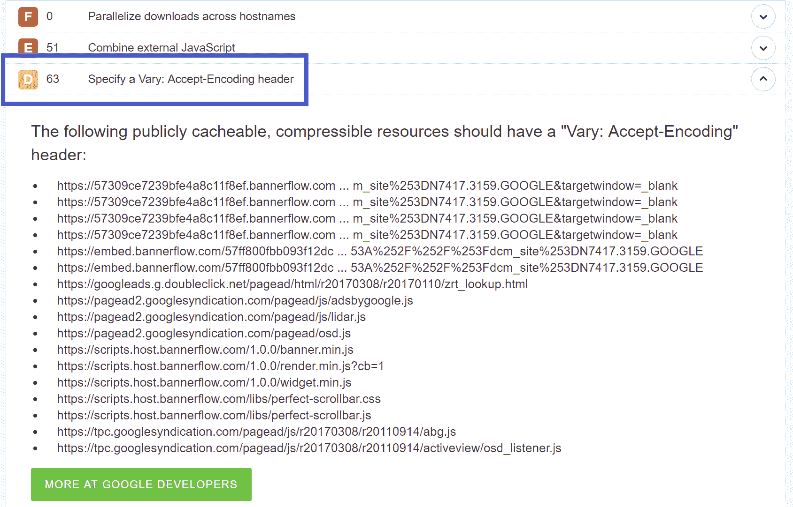

Specify a vary: accept-encoding header warning


## Pingdom 响应代码

Pingdom 速度测试工具中的以下部分是响应代码。响应代码也被称为 HTTP 状态代码，就像是一个贴在网页顶端的来自网络服务器的短消息。它是来自 web 服务器的一条消息，让您知道当收到查看页面的请求时事情是如何进行的。一些常见的有:

*   **200: “Everything is OK.”** This is the code delivered when a web page or resource acts exactly the way it’s expected to.

    

    Pingdom 200 响应代码的例子

    

*   **301: “The requested resource has been moved permanently.”** This code is delivered when a web page or resource has been permanently replaced with a different resource. It is used for [permanent URL redirection](https://kinsta.com/help/redirect-rules/).

    

    Pingdom 301 响应码的例子

    

*   **404: “The requested resource was not found.”** The most common error message of them all. This code means that the requested resource does not exist, and the server does not know if it exists.

    

    Pingdom 404 响应码的例子

    

你可以在我们关于 [HTTP 状态码](https://kinsta.com/blog/http-status-codes/)的深度文章中读到更多关于不同响应码的信息。

## 按内容类型划分的内容大小和请求

以下部分是按内容类型划分的内容大小和按内容类型划分的请求。这些都有助于快速查看哪些内容占用了您的网页上的大部分资源。根据 HTTP Archive 的数据，图片通常占网页总大小的 43%。我们通常也看到这种情况。然而，正如你在这个网站上看到的，情况并不总是这样。

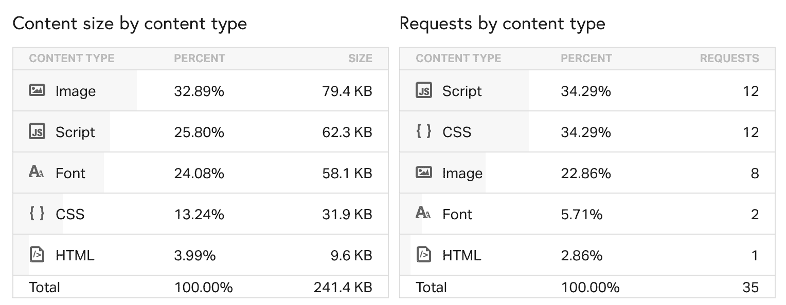

Pingdom content type


为了优化你的图片，我们强烈推荐阅读我们关于如何优化网页图片的深度文章。有很多很棒的工具和插件可以进一步压缩你的图片，并确保它们不会占据你网站页面的大部分。在我们上面的例子中，网站利用大字体的图标代替了图片。这可能是一个产生巨大影响的伟大策略。当然，在我们的[页面速度指南](https://kinsta.com/learn/page-speed/)中，我们有一些关于如何进一步减小你的内容大小的额外提示。

## 按域划分的内容大小和请求

“内容大小和域请求”部分是快速查看网站上哪些外部服务和脚本的绝佳方式。在我们的示例中，您可以看到我们从 CDN 加载了所有资产。然后是来自 web 服务器的网站的初始 HTML 文档加载，以及对 Google Analytics 域的外部调用。根据你的网站，你可能会有更多的外部服务，如脸书、Twitter、Hotjar、SumoMe、AdRoll、New Relic、CrazyEgg 等。


Pingdom requests by domain


一般来说，外部请求越少越好，因为每个外部服务都会引入延迟、TLS 握手延迟、 [DNS 查找](https://kinsta.com/blog/reduce-dns-lookups/)等。请务必在你的 WordPress 网站上阅读我们关于[识别和分析外部服务](https://kinsta.com/blog/third-party-performance/)的深度文章。

一般来说，最好尽可能减少请求的数量，将资产托管在一个地方，比如将它们转移到您的 web 服务器或 CDN。字体牛逼就是一个例子。与其链接到字体 awesome 的外部脚本，不如下载它，并直接提供它。

[When evaluating web performance, it's important to decide which files you should and shouldn't host ⚡Click to Tweet](https://twitter.com/intent/tweet?url=https%3A%2F%2Fkinsta.com%2Fblog%2Fpingdom-speed-test%2F&via=kinsta&text=When+evaluating+web+performance%2C+it%27s+important+to+decide+which+files+you+should+and+shouldn%27t+host+%E2%9A%A1&hashtags=webperf%2Cpingdom)

## Pingdom 瀑布图

最后但同样重要的是，我们有 Pingdom 速度测试工具请求部分，它会生成一个瀑布图，显示您的 web 页面上的所有请求(如下所示)。然后，您可以分析每个请求，看看是什么导致了您站点上的延迟和性能问题。当我们说我们正在做瀑布分析时，我们指的是这个。下面是每个状态颜色含义的更深入的总结和/或定义。


Pingdom waterfall analysis


### DNS(粉色)

那么什么是 DNS 呢？好吧，把它想象成一本电话簿。有一种叫做域名服务器的服务器，它保存着关于你的网站的信息，以及它应该被路由到哪个 IP 地址。当您第一次通过 Pingdom 运行您的网站时，它会执行一次新的查找，并且必须查询 DNS 记录来获取 IP 信息。这导致一些额外的查找时间。DNS 服务器的位置也很重要。


DNS delays in Pingdom


当您多次通过 Pingdom 运行您的网站时，它会缓存 DNS，因为它已经知道 IP 信息，不必再次执行查找。这就是为什么你的网站在多次运行 Pingdom 后会显示得更快。

Struggling with downtime and WordPress problems? Kinsta is the hosting solution designed to save you time! [Check out our features](https://kinsta.com/features/)

正如您在下面的屏幕中看到的，在我们运行的第二个测试中，初始文档加载的 [DNS 查找](https://kinsta.com/blog/reduce-dns-lookups/)时间是 3.6 毫秒。通常，它会下降到 0 毫秒，因为请求已经被缓存。这是一个很多人误解的领域！

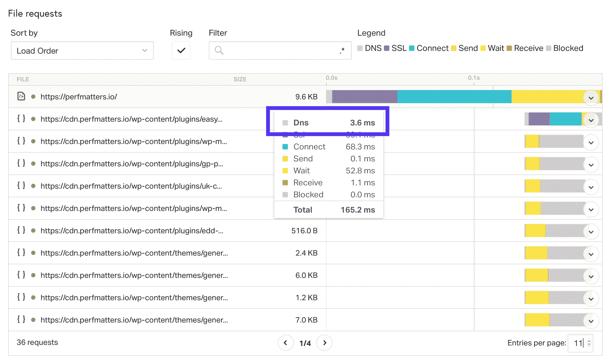

Cached DNS in Pingdom


此外，您可以通过使用[高级 DNS](https://kinsta.com/blog/premium-dns/) 服务来进一步优化它，此外它还有许多额外的好处。我们 Cloudflare 的免费 DNS 也快！查看 [Cloudflare 的自动平台优化](https://kinsta.com/blog/cloudflare-apo-wordpress/)。

为什么你的网站在多次测试后会显示得更快的其他原因。其中之一是，如果你正在使用一个内容交付网络。对于那些不熟悉 CDN 的人来说，它是一个全球服务器网络，可以缓存你的内容(JS、CSS、图片等)。)在离游客更近的地方。当你第一次通过 Pingdom 运行你的网站时，你可能不得不从 CDN fresh 获取资源。CDN 缓存的工作方式很像 DNS。一旦被缓存，它在连续加载时会快得多。

加速 DNS 的另一个技巧是使用 DNS 预取。这允许浏览器在后台对页面执行 DNS 查找。你可以通过在你的 WordPress 站点的标题中添加一些代码来做到这一点。请看下面的一些例子。

```
<!-- Prefetch DNS for external assets -->
 
  
 
```

或者，如果你运行的是 WordPress 版本 4.6 或更新版本，你可能想要使用[资源提示](https://make.wordpress.org/core/2016/07/06/resource-hints-in-4-6/)。开发者可以使用`wp_resource_hints`过滤器为`dns-prefetch`、`preconnect`、`prefetch`或`prerender`添加自定义域名和网址。

### SSL(紫色)

紫色的状态颜色代表您的浏览器进行 [SSL/TLS 握手](https://kinsta.com/knowledgebase/tls-vs-ssl/)的时间。每当你在 HTTPS 上运行一个网站时，由于加密过程(SSL/ [TLS](https://kinsta.com/blog/tls-1-3/) 握手)，都会有一个 SSL 证书和额外的时间。在我们的示例域中，我们在 Kinsta 的 web 服务器和 CDN，KeyCDN 上都有一个证书。因此，在从 web 服务器和我们的资产加载初始 HTML 文档时，都有一个 SSL 协商时间。

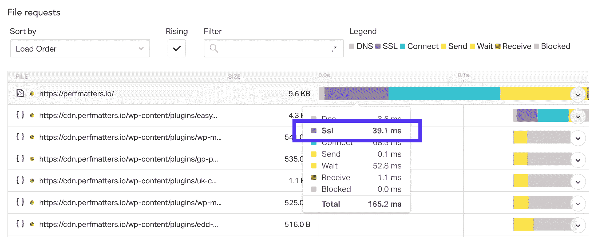

SSL load time in Pingdom


虽然运行 HTTPS 有轻微的开销，但现在这并不重要，这要感谢 HTTP/2，一种帮助加速网络的新协议！由于浏览器支持，HTTPS 需要使用 HTTP/2。查看我们的 HTTP/2 终极指南。

同样需要注意的是，即使在 2018 年，也不是所有的提供商都支持 HTTP/2。这既包括虚拟主机端，也包括 CDN 端。所以当你购买主机和 cdn 的时候，确保两者都支持它！Kinsta 为其所有 WordPress 客户端支持 HTTP/2 而自豪。

截至 2018 年年中，Pingdom 终于将其工具升级为使用 Chrome 60 及更高版本。您可以看到在请求头中使用了`user-agent`。之前他们使用的是 Chrome 39，Chrome [直到版本 49](http://caniuse.com/#feat=http2) 才支持 HTTP/2。所以我们很高兴地说 **Pingdom 工具现在在运行测试时显示了 HTTP/2** 的所有优势！👏


Pingdom HTTP/2 support


### 连接(蓝绿色)

Pingdom 中的连接时间指的是 TCP 连接，或者创建一个 TCP 连接所需的总时间。您不需要理解这是如何工作的，但这只是主机/客户机和服务器之间必须进行的一种通信方法。

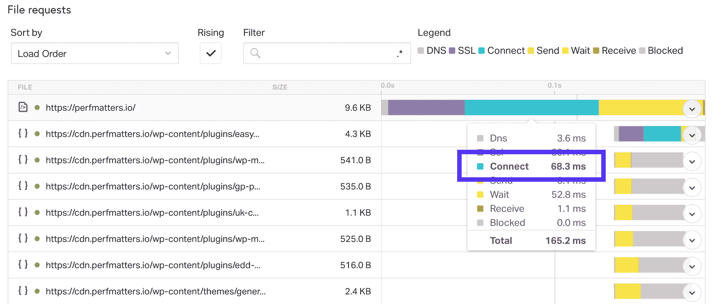

Pingdom connect time


### 等待(黄色)

Pingdom 的等待时间是指到达第一个字节的[时间，在某些工具中也称为 TTFB。](https://kinsta.com/blog/ttfb/) [TTFB](https://en.wikipedia.org/wiki/Time_To_First_Byte) 是一种用于表示 web 服务器或其他网络资源的响应性的度量。一般来说，任何低于 100 ms 的都是可以接受的，都是好的 TTFB。如果您接近 300-400 ms 的范围，那么您的服务器可能配置错误，或者是时候升级到更好的 web 堆栈了。

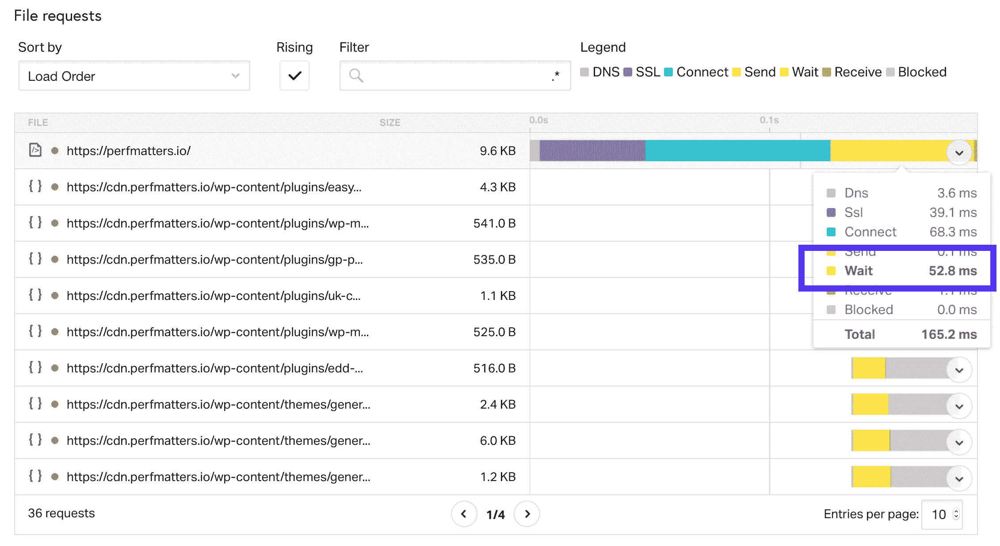

Wait time – TTFB


减少你的 TTFB 最简单的方法是什么？两个最好的方法是有效的 **WordPress 缓存**和一个 **CDN** 。所以我们来做几个测试。

### 不带 WordPress 主机缓存的 TTFB

在清空 WordPress 网站上的缓存后，我们首先[运行了一个测试](https://tools.pingdom.com/#59bac42f62000000)。这意味着它必须再次预加载缓存。我们的总加载时间是 541 毫秒，我们最初请求的 TTFB(等待时间)是 185.2 毫秒。

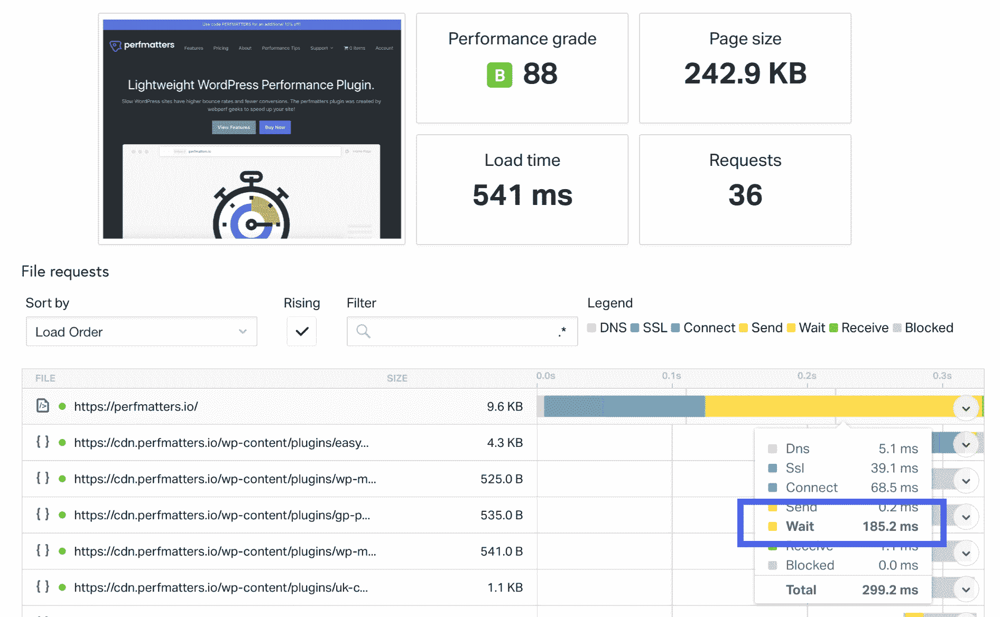

Pingdom TTFB without WordPress cache


### 带有 WordPress 主机缓存的 TTFB

然后我们重新运行测试。它现在直接从缓存提供服务。如您所见，我们的总加载时间下降到了 392 毫秒，初始请求的 TTFB 现在是 52.8 毫秒！这就是缓存的不同之处。


Pingdom TTFB with WordPress cache


如果你有一个网站为全国各地或全球各地的访问者提供服务，另一个大大降低 TTFB 的简单方法是使用 CDN。我们再次运行了一些测试来显示差异。

### 不带 CDN 的 TTFB

我们首先[在禁用 CDN 的情况下运行测试](https://tools.pingdom.com/#59bb2cfffd400000)，正如您所见，我们的总加载时间为 1.93 秒，我们在一项资产上的平均 TTFB 约为 176 毫秒。

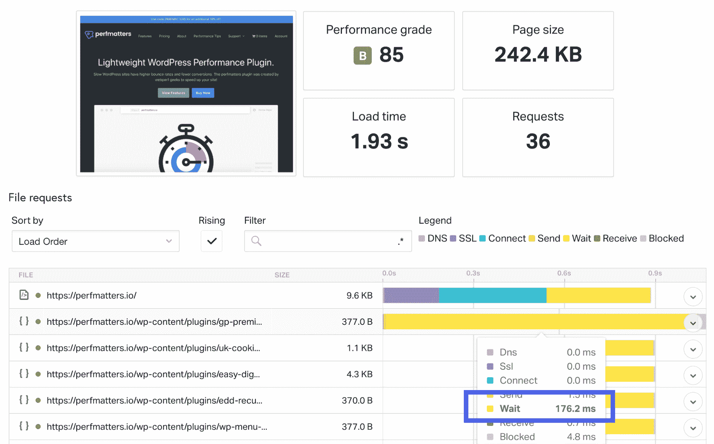

TTFB without CDN


### 带 CDN 的 TTFB

然后，我们启用我们的 CDN 并重新运行测试。我们的总加载时间降至 1.21 秒，我们在 CDN 资产上的平均 TTFB 现在为 4.6 毫秒！CDN 能带来多大的不同。

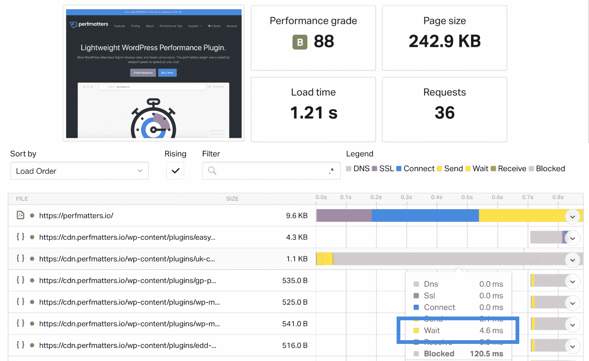

TTFB with CDN


另一个需要注意的要点是，我们选择了“太平洋-澳大利亚-悉尼”的地点来进行测试。为什么？因为我们想向你展示真正的进步。在这个例子中，我们的 WordPress 站点由 Kinsta 托管在 Google Cloud 上，位于美国的中心位置。通过对澳大利亚进行测试，我们可以展示 Kinsta CDN 缓存如何提高速度并减少 TTFB。

当然，拥有一个好的 WordPress 主机和一个精心设计的架构对于降低你的 TTFB 也是至关重要的。

### 发送(橙色)和接收(绿色)

Pingdom 中的发送和接收状态不需要太多的解释。发送时间就是 web 浏览器向服务器发送数据的时间。接收时间是 web 浏览器从服务器接收数据所花费的时间。这两者在你的测试中通常都很低或者不存在。

### HTTP 响应标头

您还可以在进行瀑布分析时单击单个请求，并查看 HTTP 响应头。这提供了有价值的信息。在下面的屏幕中，我们可以立即看到 web 服务器上启用了 [gzip，它是由缓存(](https://kinsta.com/blog/enable-gzip-compression/)[命中，否则会显示未命中](https://kinsta.com/help/mykinsta-analytics/#cache-analysis))、缓存控制头、过期头、浏览器用户代理等提供服务的。

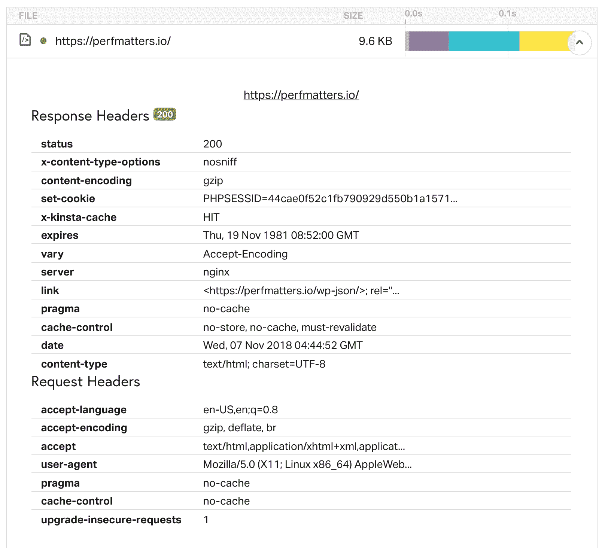

HTTP response headers


## 案例研究领域配置

如果你在我们的瀑布分析文章中看到了这一点，那你就有得吃了。看到人们分享技巧和案例研究，却不分享他们是如何做到这一点的，总是令人恼火。下面是我们对上面使用的案例研究域的精确配置！随意复制它。

### 体系结构

*   案例研究域由 Kinsta 托管在美国的 Google 云平台上(美国爱荷华州康瑟尔布拉夫斯(Council Bluffs，USA-central 1))。Kinsta 目前提供 35 个不同的数据中心供选择。GCP 的高级层网络包含在所有针对闪电般快速网络延迟的计划中。
*   Kinsta 使用 HTTP/2、 [Nginx](https://kinsta.com/knowledgebase/what-is-nginx/) 、 [MariaDB](https://kinsta.com/blog/mariadb-vs-mysql/) ，这些都有助于快速加载。
*   该网站使用的是 KeyCDN，它为 [Kinsta CDN](https://kinsta.com/help/kinsta-cdn/) 提供支持。免费 CDN 带宽包含在所有托管计划中。
*   网站**没有使用任何缓存插件**。 [Kinsta 在服务器级缓存一切](https://kinsta.com/blog/wordpress-cache/)，这大大简化了事情！
*   该网站使用的是 PHP 7.3。PHP 的新版本总是表现出巨大的性能改进。看看这些 [PHP 基准测试](https://kinsta.com/blog/php-benchmarks/)。Kinsta 允许您通过按下按钮的[在两者之间切换。](https://kinsta.com/knowledgebase/how-to-update-php-in-wordpress/)

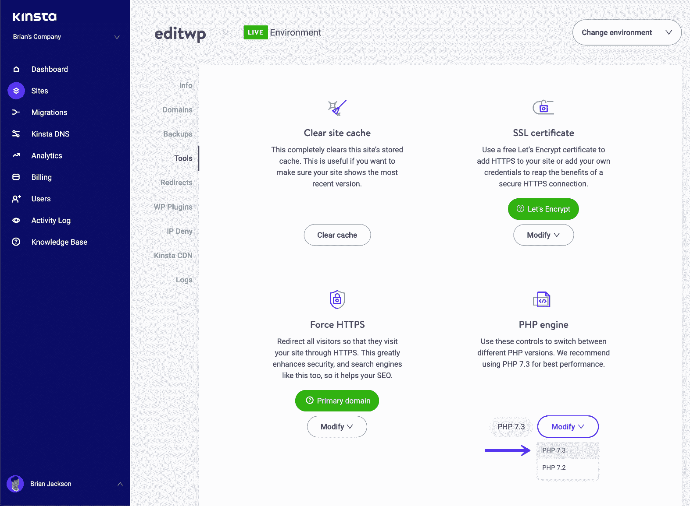

Update PHP version of WordPress site


### WordPress 插件和主题

以下是影响 WordPress 电子商务网站性能的插件列表。

*   高级[图像插件](https://wordpress.org/plugins/imagify/)用于[压缩图像](https://kinsta.com/blog/optimize-images-for-web/)。
*   免费的安全 SVG 插件用于[上传 SVG 图片](https://kinsta.com/blog/what-is-an-svg-file/)到 WordPress 网站。
*   优质的 WordPress 主题被用来建立 EDD 网站。

### 进一步阅读的推荐教程:

*   [如何消除渲染阻塞 JavaScript 和 CSS](https://kinsta.com/blog/eliminate-render-blocking-javascript-css/)
*   [如何禁用 WordPress 中的表情符号](https://kinsta.com/knowledgebase/disable-emojis-wordpress/)
*   [如何禁用 WordPress 中的嵌入功能](https://kinsta.com/knowledgebase/disable-embeds-wordpress/)
*   [如何用 WordPress 在 Google PageSpeed Insights 中打 100/100 分](https://kinsta.com/blog/google-pagespeed-insights/)
*   [如何诊断你的 WordPress 站点上的高 Admin-Ajax 使用率](https://kinsta.com/blog/admin-ajax/)

## 摘要

正如您所看到的，了解 Pingdom 速度测试工具如何更好地工作以及所有图表的含义可以帮助您在性能方面做出更加数据驱动的决策。

瀑布分析对于了解你的资产是如何加载的，以及它们是如何受到你的 WordPress 主机、物理位置、CDN 等的影响是至关重要的。我们希望这篇文章能帮助你更好地解决[网站的速度和性能](https://kinsta.com/learn/speed-up-wordpress/)问题。

有其他好的 Pingdom 技巧吗？请在评论中告诉我们！

* * *

让你所有的[应用程序](https://kinsta.com/application-hosting/)、[数据库](https://kinsta.com/database-hosting/)和 [WordPress 网站](https://kinsta.com/wordpress-hosting/)在线并在一个屋檐下。我们功能丰富的高性能云平台包括:

*   在 MyKinsta 仪表盘中轻松设置和管理
*   24/7 专家支持
*   最好的谷歌云平台硬件和网络，由 Kubernetes 提供最大的可扩展性
*   面向速度和安全性的企业级 Cloudflare 集成
*   全球受众覆盖全球多达 35 个数据中心和 275 多个 pop

在第一个月使用托管的[应用程序或托管](https://kinsta.com/application-hosting/)的[数据库，您可以享受 20 美元的优惠，亲自测试一下。探索我们的](https://kinsta.com/database-hosting/)[计划](https://kinsta.com/plans/)或[与销售人员交谈](https://kinsta.com/contact-us/)以找到最适合您的方式。