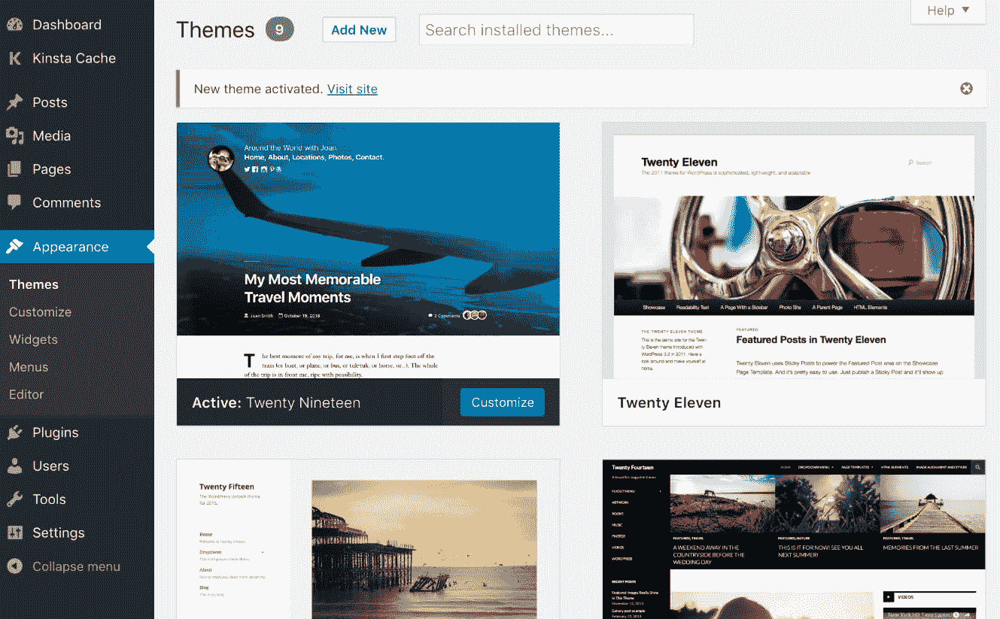
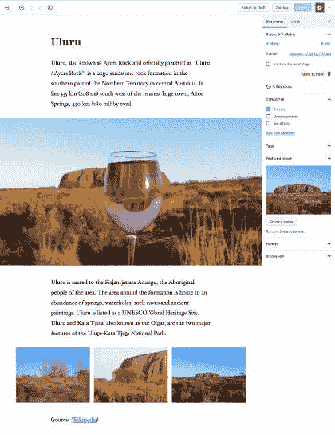
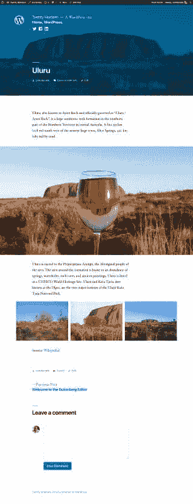
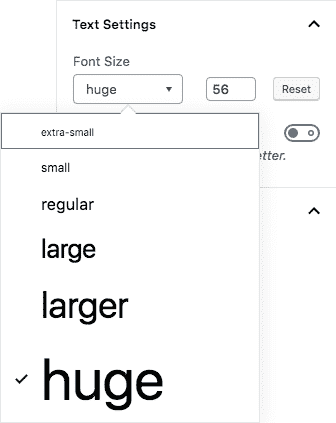

# 2019 主题介绍(古腾堡主题)

> 原文:[https://kinsta.com/blog/twenty-nineteen-theme/](https://kinsta.com/blog/twenty-nineteen-theme/)

WordPress 5.0 即将到来，我们许多人同时感到兴奋和担忧。[古腾堡](https://kinsta.com/blog/gutenberg-wordpress-editor/)给我们使用 WordPress 的方式带来了巨大的变化，如果我们在没有测试的情况下更新我们的安装，肯定会对我们的网站产生一些影响。但是不要担心，我们有一个关于如何[禁用古腾堡 WordPress 编辑器](https://kinsta.com/blog/disable-gutenberg-wordpress-editor/)(即使只是暂时的)的帖子，以防止不受支持的主题和插件破坏我们的网站。

你可能会惊讶地发现我们已经在使用 WordPress 5.0 了。事实上，我们是！正如 Matt 在 [Make WordPress 博客](https://make.wordpress.org/core/2018/10/03/a-plan-for-5-0/)上所说:

> 如果我们严格地将 5.0 版本保持在 4.9.8 + Gutenberg，我们将会有一个在新代码方面既重要又不重要的版本。都是久经沙场的。在某些方面，5.0 实际上已经过时了，一些有远见的主机已经安装并激活了 Gutenberg 进行新的安装。

这意味着我们的服务器上已经运行了 WordPress 5.0:它只是 WordPress 4.9.8，核心是 Gutenberg。其实还没完，因为 WordPress 5.0 自带了一个额外的条目，就是全新的**Twenty 19 默认主题**。


Twenty Nineteen WordPress Theme


因此，让我们深入了解一下，看看有什么新内容。

*   [关于古腾堡和二十一九](#gutenberg-twenty-nineteen)
*   [安装 219 个](#installing-twenty-nineteen)
*   [二十十九的观感](#look-feel-twenty-nineteen-theme)
*   古腾堡主题化:一个开发者的方法

 <kinsta-advanced-cta language="en_US" type-int-post="34914" type-int-position="1">## 关于古腾堡和 2019

有些人可能不喜欢古腾堡。此外，关于新编辑的争论还远未结束，但是想想古腾堡宣称的[范围:](https://make.wordpress.org/themes/2018/03/07/getting-ready-for-gutenberg/)

<link rel="stylesheet" href="https://kinsta.com/wp-content/themes/kinsta/dist/components/ctas/cta-mini.css?ver=2e932b8aba3918bfb818">


> 需要在这里大声喊出来。Kinsta 太神奇了，我用它做我的个人网站。支持是迅速和杰出的，他们的服务器是 WordPress 最快的。
> 
> <footer class="wp-block-kinsta-client-quote__footer">
> 
> 
> 
> <cite class="wp-block-kinsta-client-quote__cite">Phillip Stemann</cite></footer>

[View plans](https://kinsta.com/plans/)

> 这些自定义模块改变了用户、开发人员和主机与 WordPress 的交互方式，使构建丰富的网络内容更加容易和直观，**使发布和工作大众化，无论技术能力如何**。

这就是古腾堡的目标，2019 年将事情向前推进了一步，与古腾堡一起为古腾堡而建。这是一个最小的，字体驱动的博客主题，有一个单列布局，可以用来建立各种各样的网站，从个人博客到小型商业网站。

写 2019 年主要意味着我们正在写古腾堡。在 2019 年，古腾堡不仅允许用户创建丰富的内容，甚至可以在编辑器中建立他们的整个网站。据 Allan Cole 在博客上说，

> Gutenberg 给予用户前所未有的自由来定制他们网站的布局和设计。为了完全实现他们的愿景，用户将需要新一代灵活的主题，以利用古腾堡提供的创作自由。考虑到这一点，WordPress 5.0 将推出一个全新的默认主题:2019 年

在 2019 主题中，Gutenberg 不仅仅是一个内容构建者，**它还是一个网站构建者**，WordPress 用户将被允许利用 blocks 构建他们的整个网站。如果你还不喜欢古腾堡，大多数流行的[页面生成器插件](https://kinsta.com/blog/wordpress-page-builders/)也增加了对古腾堡的支持。

(建议阅读:[二十二十主题介绍](https://kinsta.com/blog/twenty-twenty-theme/))

[In the Twenty Nineteen theme Gutenberg is more than a content builder, it's a site builder. 🔨Click to Tweet](https://twitter.com/intent/tweet?url=https%3A%2F%2Fkinsta.com%2Fblog%2Ftwenty-nineteen-theme%2F&via=kinsta&text=In+the+Twenty+Nineteen+theme+Gutenberg+is+more+than+a+content+builder%2C+it%27s+a+site+builder.+%F0%9F%94%A8&hashtags=WordPress%2CGutenberg)

## 安装 219

2019 应该遵循新 WordPress 主要版本的发布计划。然而，WordPress 5.0 应该在 11 月 19 日发布，有可能 2019 的工作版本到那个时候还没有准备好。查看 WordPress 5.0 所有可能的[发布日期。不管怎样，这个主题可以在](https://kinsta.com/blog/wordpress-5-0/#wordpress-5-release-date) [Github](https://github.com/WordPress/twentynineteen) 上下载，并且会一直放在那里，直到它被合并到 core 中。

《2019》是基于《T2》和《古腾堡-首发-主题》《T4》的，里面加入了萨斯元素。一旦你得到了。zip 包，提取主题，并将主题文件夹上传/移动到开发安装的`/wp-content/themes`目录中。你也可以从你的 WordPress 仪表盘上传。


Uploading a new theme from the WordPress dashboard


Kinsta 客户端可以将它安装在他们的[暂存环境](https://kinsta.com/help/staging-environment/)中。如果你没有使用 Kinsta，你仍然可以[在你的本地机器](https://kinsta.com/blog/install-wordpress-locally/)上安装它。



Twenty Nineteen successfully installed


## 2019 的外观和感觉

单列布局强调内容，最适合全宽块。该主题现在支持页脚侧边栏，并带有三个导航菜单:**主菜单**和**社交链接菜单**，两者都位于页面页眉，以及位于页脚的**页脚菜单**。


Site title, site description, and menus in Twenty Nineteen header


博客页面看起来像启用了特色图像的常规博客页面。单个帖子和页面最好地展示了当前版本的古腾堡作为网站建设者的潜力。

由于它完全基于古腾堡，2019 的功能主要取决于古腾堡的开发周期和块的可用性。我们可以添加小部件块、短代码块、图库、HTML 代码等等。然而，所有这些块远远不能覆盖我们所有的需求。但幸运的是，我们有几个插件允许我们向古腾堡添加新的块，如[原子块](https://wordpress.org/plugins/atomic-blocks/)、[高级古腾堡](https://wordpress.org/plugins/advanced-gutenberg/)和[可堆叠](https://wpstackable.com/)。甚至有像[古腾堡云](https://gutenbergcloud.org/)这样的项目涌现出来。

如果你认为这个主题看起来太简单了，考虑一下《2019》仍然是一部正在制作的作品。我们不确定在 WordPress 5.0 发布时它是否会被合并到核心中，我们可以期待在未来的几年中会有一些补充和错误解决方案。此外，还有许多问题尚未解决，还有一些功能需要实现。现在 219 支持子菜单，但不支持[自定义标题和视频标题](https://github.com/WordPress/twentynineteen/issues/243)。无论如何，我们可以期待在一段合理的时间内添加更多的功能。

如果你对主题的状态感兴趣，可以查看 Github 上的[完整问题列表。](https://github.com/WordPress/twentynineteen/issues)

## 古腾堡的主题化:一个开发者的方法

开箱即用，Gutenberg 在主题中提供了对块样式的基本支持，主题开发者可以自由地用他们的自定义样式覆盖 Gutenberg 的默认样式。但是开发人员也可以完全省略自定义样式，决定完全依靠 Gutenberg 来设计网站正面的区块。

拥有一个看起来和感觉上都像结果内容的编辑器可以改善作者的写作体验，并让每个人都能对 UI 感到舒适。

无论如何，一些古腾堡的风格和表现特征需要主题明确地添加对它们的支持，这可以通过在触发`[after_setup_theme](https://codex.wordpress.org/Plugin_API/Action_Reference/after_setup_theme)`动作时调用`functions.php`文件中的`[add_theme_support](https://wordpress.org/gutenberg/handbook/extensibility/theme-support/)`来完成。下面是一个功能实现的示例:

```
function mytheme_setup() {
    // Add support for Block Styles
    add_theme_support( 'wp-block-styles' );
}
add_action( 'after_setup_theme', 'mytheme_setup' );
```

下面列出了这些古腾堡功能的精选，其中一些也受到 2019 的支持。你会在古腾堡手册中找到完整的特性列表。

### 添加对古腾堡块演示样式的支持

Gutenberg 团队的目标之一是建立一个灵活的主题风格系统，并尽可能接近“前端和编辑器之间的视觉对等”。目的是给用户一个准确的预览的内容，因为它会像在前台网站。

为了实现这个目标，团队必须将表示风格和结构风格分开。默认情况下，为了避免影响网站外观，前端不会加载外观样式。无论如何，新的主题可以利用古腾堡的表现风格，只需通过下面的注册就可以了(详见[手册](https://wordpress.org/gutenberg/handbook/extensibility/theme-support/#default-block-styles)):

 ## 注册订阅时事通讯


### 想知道我们是怎么让流量增长超过 1000%的吗？

加入 20，000 多名获得我们每周时事通讯和内部消息的人的行列吧！

[Subscribe Now](#newsletter)

```
// Add support for Block Styles
add_theme_support( 'wp-block-styles' );
```

如你所料，**Twenty 19 支持古腾堡的积木风格**。单个帖子页面在前端看起来很像编辑帖子页面，唯一的区别是特色图像，它在桌面上显示为覆盖整个视窗的[背景图像](https://kinsta.com/blog/wordpress-background-image/)。下图显示了古腾堡在后端的行动。



Gutenberg WordPress editor in full-screen mode


这是同样的帖子。



A single post page in Twenty Nineteen


### 广泛和全面的对齐

古腾堡还提供了两个额外的对齐选项:[宽和全角对齐](https://wordpress.org/gutenberg/handbook/extensibility/theme-support/#wide-alignment)，但是**你可以选择宽或全角对齐，只要你的主题支持它们**。如果是这样，古腾堡显示两个额外的对齐图标。


Wide and Full width alignment buttons in Gutenberg


下图为 2019 年**对齐中心**、**宽**和**全幅**图像。


Align center, Wide width, and Full-width compared


主题开发人员可以添加对宽对齐和全角对齐的支持，只需在函数文件中使用一条语句即可实现:

```
// Add support for full and wide align images
add_theme_support( 'align-wide' );
```

一旦我们添加了对宽对齐和全角对齐的支持，我们应该为另外两个 [CSS 类](https://kinsta.com/blog/wordpress-css/) : `alignfull`和`alignwide`提供 CSS 声明。219 提供以下款式:

```
.entry-content > *.alignwide,
.entry-summary > *.alignwide {
    margin-left: auto;
    margin-right: auto;
}

@media only screen and (min-width: 768px) {
    .entry-content > *.alignwide,
    .entry-summary > *.alignwide {
        margin-left: calc(1 * (100vw / 12));
        margin-right: calc(1 * (100vw / 12));
        max-width: calc(10 * (100vw / 12));
  }
}

.entry-content > *.alignfull,
.entry-summary > *.alignfull {
    margin-top: calc(2 * 1rem);
    margin-right: 0;
    margin-bottom: calc(2 * 1rem);
    margin-left: 0;
    max-width: 100%;
}

.entry-content .wp-block-image.alignfull img {
    width: 100vw;
    margin-left: auto;
    margin-right: auto;
}
```

注意:使用这个选项时要小心，因为如果你切换主题，它可能会导致问题(在 [Github](https://github.com/WordPress/gutenberg/issues/4342) 上阅读关于这个主题的更多信息)。

Struggling with downtime and WordPress problems? Kinsta is the hosting solution designed to save you time! [Check out our features](https://kinsta.com/features/)

### 编辑风格

编辑器样式是 WordPress 3.0 引入的一个特性，允许主题开发者添加自定义样式到 TinyMCE 编辑器中。Gutenberg 也支持这一特性，但它的工作方式与经典编辑器不同，后者将样式直接加载到编辑器的 [iframe](https://kinsta.com/blog/embed-youtube-video-wordpress/) 中。Gutenberg 添加了特定的 CSS 选择器，因为它不使用 iframe。

我们可以添加对编辑器样式的支持，如下所示:

```
// Add support for editor styles
add_theme_support( 'editor-styles' );
// Enqueue editor styles
add_editor_style( 'style-editor.css' );
```

这个功能也是 Twenty 支持的。你可以在 Gutenberg 的[编辑器风格中更深入地研究这个主题。](https://wordpress.org/gutenberg/handbook/extensibility/theme-support/#editor-styles)

### 块调色板

Gutenberg 在编辑器的颜色设置面板中提供了一个通用的颜色选择器。主题开发人员可以通过添加自定义调色板来增强这个工具，让用户可以快速选择块背景和文本的正确颜色。这是一个两步过程:

首先，我们必须提供一组颜色:

```
add_theme_support( 'editor-color-palette', array(
    array(
        'name' => __( 'hot pink', 'themeLangDomain' ),
        'slug' => 'hot-pink',
        'color' => '#f865b0',
    ),
    array(
        'name' => __( 'classic rose', 'themeLangDomain' ),
        'slug' => 'classic-rose',
        'color' => '#fbcaef',
    ),
) );
```

然后我们必须在主题的样式表中声明相应的样式:

```
.has-hot-pink-background-color {
    background-color: #f865b0;
}

.has-hot-pink-color {
    color: #f865b0;
}
```

类名以`has-`开头，后面是烤肉串情况下的颜色 slug，最后是上下文，可以是`color`或`background-color`。目前，二十十九不支持块调色板，但我们可以很容易地用一个[子主题](https://kinsta.com/blog/wordpress-child-theme/)来改变这一点。


A custom color palette in Gutenberg


相反，如果您想要禁用自定义调色板，您必须将下面一行添加到您的主题或子主题的函数文件中:

```
add_theme_support( 'disable-custom-colors' );
```

### 阻止字体大小

主题也可以覆盖 Gutenberg 的默认字体大小。下面是您应该添加到函数文件中的代码示例:

```
add_theme_support( 'editor-font-sizes', array(
    array(
        'name' => __( 'extra-small', 'themeLangDomain' ),
        'shortName' => __( 'XS', 'themeLangDomain' ),
        'size' => 10,
        'slug' => 'extra-small'
    ),
    array(
        'name' => __( 'small', 'themeLangDomain' ),
        'shortName' => __( 'S', 'themeLangDomain' ),
        'size' => 12,
        'slug' => 'small'
    ),
    array(
        'name' => __( 'regular', 'themeLangDomain' ),
        'shortName' => __( 'M', 'themeLangDomain' ),
        'size' => 16,
        'slug' => 'regular'
    ),
    array(
        'name' => __( 'large', 'themeLangDomain' ),
        'shortName' => __( 'L', 'themeLangDomain' ),
        'size' => 26,
        'slug' => 'large'
    ),
    array(
        'name' => __( 'larger', 'themeLangDomain' ),
        'shortName' => __( 'XL', 'themeLangDomain' ),
        'size' => 36,
        'slug' => 'larger'
    ),
    array(
        'name' => __( 'huge', 'themeLangDomain' ),
        'shortName' => __( 'XXL', 'themeLangDomain' ),
        'size' => 56,
        'slug' => 'huge'
    )
) );
```

新的字体大小将被添加到 Gutenberg 的文本设置中的字体大小选择器中。



Custom font sizes in Gutenberg


接下来，我们必须在主题的样式表中声明相应的样式。类名应该以`has-`开头，后面是 kebab 情况下的字体大小名称，以`-font-size`结尾。

```
.has-huge-font-size {
    font-size: 56px;
}
```

219 不提供具体的字体大小，依赖于古腾堡的默认值。

注意:请记住，为了让所有这些代码工作，您应该通过`after_setup_theme`动作来挂钩它。

## 摘要

219 可以很好地用于个人博客，你可以把它想象成一块白色的画布，而不是一个功能齐全的 WordPress 主题。当涉及到建立商业和电子商务网站时，这种最小化的方法可能会有点限制，但不要担心:新的功能应该很快就会实现，我们很快就会看到更强大的 2019 版本。

同时，你也可以看看一些已经支持古腾堡的主题。原子块、 [GeneratePress](https://generatepress.com/) 、 [Gutentype](https://themeforest.net/item/gutentype-gutenberg-wordpress-blog-theme/22486033) 和 [Divi](https://www.elegantthemes.com/blog/theme-releases/divi-feature-update-introducing-initial-gutenberg-support) 仅举几个例子，但许多其他的应该很快就会出现。随着 WordPress 5.0 的快速到来，支持 Gutenberg 不是一个选项，主题开发者应该尽快接受新的 WordPress 编辑器，以保持在竞争中的领先地位。

有没有安装二十一九或者任何支持古腾堡的主题？我们希望在下面的评论中听到你的想法。

* * *

让你所有的[应用程序](https://kinsta.com/application-hosting/)、[数据库](https://kinsta.com/database-hosting/)和 [WordPress 网站](https://kinsta.com/wordpress-hosting/)在线并在一个屋檐下。我们功能丰富的高性能云平台包括:

*   在 MyKinsta 仪表盘中轻松设置和管理
*   24/7 专家支持
*   最好的谷歌云平台硬件和网络，由 Kubernetes 提供最大的可扩展性
*   面向速度和安全性的企业级 Cloudflare 集成
*   全球受众覆盖全球多达 35 个数据中心和 275 多个 pop

在第一个月使用托管的[应用程序或托管](https://kinsta.com/application-hosting/)的[数据库，您可以享受 20 美元的优惠，亲自测试一下。探索我们的](https://kinsta.com/database-hosting/)[计划](https://kinsta.com/plans/)或[与销售人员交谈](https://kinsta.com/contact-us/)以找到最适合您的方式。</kinsta-advanced-cta>