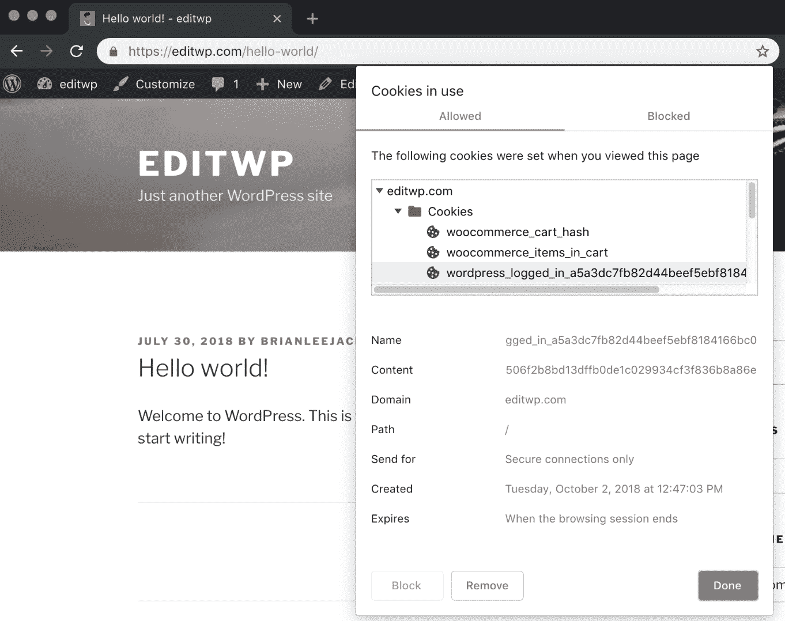
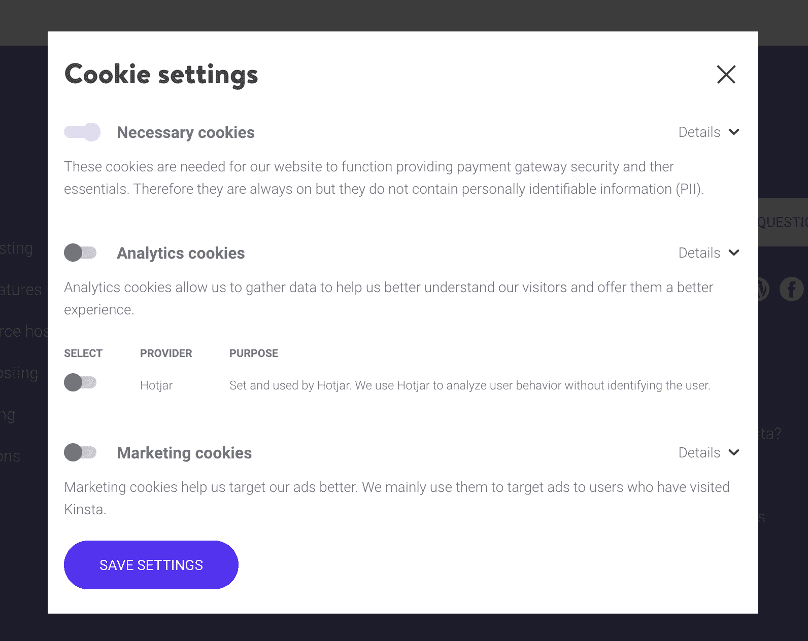

# WordPress Cookies 和 PHP 会话——你需要知道的一切

> 原文:[https://kinsta.com/blog/wordpress-cookies-php-sessions/](https://kinsta.com/blog/wordpress-cookies-php-sessions/)

1994 年，一位名叫 Lou Montulli 的计算机程序员首次发明了 Cookies。没有它们，网络将会是一个完全不同的地方。无论你是登录到 WordPress 网站的后端，还是关闭一个烦人的弹出窗口，你每天都在使用 cookies 并与之互动(即使你没有意识到)。

现在，你可能已经猜到，当我们提到 cookie 时，我们指的是用来在网站上存储重要访问者信息的 cookie，而不是美味的巧克力片。🍪

今天我们将深入探讨 cookies 和 PHP 会话这个有时令人困惑的话题。具体来说，你需要知道的关于 WordPress 如何使用它们的一切，以及在托管你的网站、定制代码或使用第三方插件时你应该知道的一些常见问题(特别是作为一名开发者)。在我们看来，这个问题讨论得还不够。

## 什么是饼干？

cookie(也称为 web cookie、跟踪 cookie、HTTP cookie、浏览器 cookie)是用户浏览器(Chrome、Firefox 等)存储的一小部分数据。)当他们访问一个网站时。它包含有关浏览活动的信息，通常用于个性化用户体验或用于身份验证和验证目的。会话 cookie 和持久 cookie 是常见的 cookie 类型。

Support

*   [饼干的种类](#types-of-cookies)
*   【WordPress Core 如何使用 cookie
*   [第三方 WordPress 插件和主题如何使用 cookie](#third-party-plugins-cookies)
*   [cookie 和 WordPress 缓存](#cookies-wordpress-caching)
*   [如何查看和清除 cookie](#see-delete-cookies)
*   [GDPR 和饼干](#gdpr-cookies)
*   [PHP 会话](#php-sessions)

## 饼干的类型

通常设置两种不同类型的 cookie:**会话 cookie**和**持久 cookie**。

### 会话 cookie

会话 cookie 也称为临时 cookie，是临时的。它们没有附加截止日期，只存储用户在**单次会话**中做了什么的信息。一个会话只是一个随机生成的/唯一的值，当有人访问一个网站时被分配。会话 cookies 临时存储在内存中，并在浏览器关闭或会话结束时自动删除。

建议阅读:[如何在 WordPress](https://kinsta.com/knowledgebase/php-memory-limit/) 中提高 PHP 内存限制。

### 持久 Cookies

正如您可能已经猜到的那样，持久性 cookiess 是那些包含过期日期的 cookie。这些会持续更长时间，并**存储在磁盘上，直到它们到期** **或被用户手动清除**。这些有时也被称为“跟踪 cookie”，因为这些类型的 cookie 是[谷歌分析](https://kinsta.com/blog/how-to-use-google-analytics/)、AdRoll、Stripe 等。全部使用。

我们的 [Kinsta 附属计划](https://kinsta.com/affiliates/)是另一个例子。当用户点击代销商链接时，一个 60 天的 cookie 就会出现在用户的浏览器中。这确保推荐人获得适当的信用，即使这个人已经多次关闭并重新打开他们的浏览器。

## WordPress 核心如何使用 Cookies

当我们提到 WordPress core 时，我们只是指在安装任何第三方插件或主题之前，组成开源项目的文件。我们喜欢称它为自然状态的 WordPress。

现在你知道了什么是 cookie 以及不同类型的基础知识，让我们来看看为什么以及【WordPress core 如何使用它们在幕后创造奇迹。有趣的事实:Cookie 最初来源于术语“[魔法饼干](https://en.wikipedia.org/wiki/HTTP_cookie#Background)”

WordPress core 使用 cookies 有两个不同的目的:

### 1.登录 Cookies

登录 cookies 包含认证细节，当用户登录到 [WordPress 管理仪表板](https://kinsta.com/knowledgebase/wordpress-admin/)时使用。根据 [WordPress Codex](https://codex.wordpress.org/WordPress_Cookies) ，设置了几个不同的会话 cookies:

*   登录时，WordPress 使用`wordpress_[hash]` cookie 来存储认证细节(限于`/wp-admin/`区域)。
*   登录后，WordPress 设置`wordpress_logged_in_[hash]` cookie。这表示您何时登录以及您是谁。

当你试图访问你的 WordPress 站点的后端时，会检查上面的两个 cookies 是否存在并且没有过期。这就是让你神奇地绕过`wp-login.php`屏幕的原因。😉

WordPress 也设置了`wp-settings-{time}-[UID]`cookie。ID 是你在 WordPress 用户数据库表中的用户 ID。这存储个人仪表板和管理界面设置。

### 2.评论 Cookies

默认情况下，当有人在博客帖子上发表评论时，会设置 cookies(有效期为 347 天)。这样，如果他们以后再来，就不必重新填写所有信息。存储以下三个 cookies:

*   `comment_author_[hash]`
*   `comment_author_email_[hash]`
*   `comment_author_url_[hash]`

然而，随着最近由于 [GDPR](https://kinsta.com/blog/wordpress-gdpr-compliance/) 隐私政策的改变，WordPress core 引入了新的工具来确保你让用户选择加入这些被设置的 cookies。如果还没有设置，这个设置可以在你的 WordPress 管理面板的“设置→讨论”下启用。选择“显示评论 cookies 选择加入复选框”选项流行的 Akismet 插件也允许你显示隐私声明。

how comments cookies opt-in

## 第三方 WordPress 插件和主题如何使用 Cookies

就像 WordPress 对某些功能使用 cookie 一样，你安装的第三方插件和[主题](https://kinsta.com/blog/how-to-install-a-wordpress-theme/)也会设置 cookie。他们中的大多数使用浏览器 cookies 和存储在`wp_options`表或他们自己的定制表中的数据库行的组合**。这是因为 WordPress 是无状态的。**

> 无状态应用程序是一种应用程序，它不会保存在一个会话中生成的客户端数据，以便在下一个会话中使用。每个会话都像第一次一样执行，并且响应不依赖于来自前一个会话的数据。–[技术目标](https://whatis.techtarget.com/definition/stateless-app)

随着新的隐私法的出台，实际了解 cookies 的设置以及它们是否为你的访问者提供了选择加入的途径变得比以往任何时候都更加重要。提示:并不是所有的 cookies 都需要选择加入。阅读我们在 [GDPR](https://kinsta.com/blog/wordpress-gdpr-compliance/) 上的深度帖子，更好地理解新要求。

以下是 cookies 用途的几个例子:

*   如果你的 WordPress 网站上有一个**弹出框**，访问者关闭了它，这通常会设置一个 cookie，这样它就不会再出现了。
*   添加到您的电子商务网站的**购物车中的商品。存储了一个 cookie，这样当您继续浏览站点时，购物车会保存您的产品。**
*   IP 地理定位功能可能会存储浏览网站的访问者的 IP 地址和纬度/经度坐标。这通常用于向特定区域显示特定内容，甚至可能将用户重定向到不同的子网站。
*   **使用类似 PrettyLinks 插件的链接缩短器跟踪点击活动**。
*   如果用户已经订阅，简讯插件可能会为他们设置一个 cookie，这样就可以完全隐藏简讯框。

实际上，WordPress 网站上的任何行为或选择加入，通常都会在幕后的浏览器中设置一个 cookie。当然，这样做的目的是尝试并帮助改善浏览器体验或通过验证提供额外的功能。

[Here's everything you need to know about WordPress and cookies. And we don't mean the yummy chocolate chip kind. 🍪Click to Tweet](https://twitter.com/intent/tweet?url=https%3A%2F%2Fkinsta.com%2Fblog%2Fwordpress-cookies-php-sessions%2F&via=kinsta&text=Here%27s+everything+you+need+to+know+about+WordPress+and+cookies.+And+we+don%27t+mean+the+yummy+chocolate+chip+kind.+%F0%9F%8D%AA&hashtags=webdev%2CWordPress)

### WooCommerce Cookies

WooCommerce 等电子商务插件通常会设置自己的额外 cookies，以便买家可以轻松地将东西添加到购物车中，存储起来供以后结账时使用，以及登录和注销他们的帐户。

为了跟踪购物车数据， [WooCommerce 设置了以下三个 cookie](https://docs.woocommerce.com/document/woocommerce-cookies/)(cookie 中不存储任何个人信息):

*   `woocommerce_cart_hash`
*   `woocommerce_items_in_cart`
*   `wp_woocommerce_session_`

前两个 cookies 包含关于购物车的信息，只是帮助 WooCommerce 知道购物车数据何时发生变化。第三个 cookie `wp_woocommerce_session_`包含每个客户的唯一代码，该代码对应于[数据库](https://kinsta.com/knowledgebase/wordpress-database/)中自定义`wp_woocommerce_sessions`表中的一个条目。

wp_woocommerce_sessions table

`wp_commerce_session_`数据之前存储在`wp_options`表中，但是在 WooCommerce 2.5 中，当他们引入了一个新的[会话处理程序](https://woocommerce.wordpress.com/2015/10/07/new-session-handler-in-2-5/)时，数据被移到了自己的自定义表中。这是为了提高性能、可伸缩性和会话管理。否则，你很快就会有一个[臃肿的 wp_options 表](https://kinsta.com/knowledgebase/wp-options-autoloaded-data/)需要清理。

### 轻松数字下载 Cookies

默认情况下，轻松数字下载使用 [WP_Session](https://ttmm.io/tech/introducing-wp_session/) ，它是浏览器 cookies 和存储在`wp_options`表中的数据库行的组合。下面是它设置的 cookie:

*   `edd_items_in_cart`

## Cookies 和 WordPress 缓存

当谈到 [WordPress 缓存](https://kinsta.com/blog/wordpress-cache/)时，这就是事情变得棘手的地方。缓存本质上是存储来自一个请求的资源并为后续请求重用这些资源的过程。基本上，它**减少了生成一个页面视图所需的工作量**。虽然这对于性能来说很好，但是对于 cookies 来说却是一个问题。

## 注册订阅时事通讯

### 想知道我们是怎么让流量增长超过 1000%的吗？

加入 20，000 多名获得我们每周时事通讯和内部消息的人的行列吧！

[Subscribe Now](#newsletter)

为什么？因为 cookies 是用来执行某个动作的，比如当你浏览 WooCommerce 网站时，保持购物车中的数据。然而，如果从缓存中提供页面，PHP 和数据库都不做任何事情，服务器只是提供页面的静态副本。

那么你能做什么呢？

### 1.使用 JavaScript

第一种选择是使用 JavaScript 动态更新页面上的内容。基本上，您有 HTML 占位符，并使用 JavaScript 通过 API 或 ajax 调用获取信息。

一个例子是在 WordPress 侧边栏中加载一个帖子列表，方法是使用 JavaScript 通过 wp-api 获取一个帖子列表，然后在侧边栏中呈现它们。在这种情况下，您可以更新文章列表，而无需从缓存中清除页面，因为数据是动态生成的。

虽然这并不理想，但就性能而言，如果可能的话，缓存总是更好。但是，如果您必须让一些内容保持动态，而页面本身可以保持静态(从缓存提供)，这是一种方法——使用 JavaScript 通过 API/ajax 调用动态下拉页面部分的内容。然而，除非你能雇佣一个 [WordPress 开发者](https://kinsta.com/blog/hire-wordpress-developer/)来构建一个定制的 JavaScript 解决方案或者一个插件的扩展，这个选项通常是不实际的。

### 2.使用管理 Ajax 调用

不能被缓存，因此你可以使用 admin-ajax 调用。一个很好的例子就是[无缓存 AJAX Widgets](https://wordpress.org/plugins/no-cache-ajax-widgets/) 插件。它进行 admin-ajax 调用，因此不必担心与服务器级或第三方缓存解决方案冲突。

然而，就像 JavaScript 一样，走这条路对于普通用户来说通常是不可行的。它还会导致其他性能问题，比如[高 admin-ajax 使用率](https://kinsta.com/blog/admin-ajax-php/)和大量未缓存的请求。

### 3.从缓存中排除页面(当 Cookie 存在时)

> 金斯塔把我宠坏了，我现在要求每个供应商都提供那样的服务水平。我们还试图通过我们的 SaaS 工具支持达到这一水平。
> 
> <footer class="wp-block-kinsta-client-quote__footer">
> 
> 
> 
> <cite class="wp-block-kinsta-client-quote__cite">Suganthan Mohanadasanfrom@ Suganthanmn</cite></footer>

[查看计划](https://kinsta.com/plans/)

除非您可以走 JavaScript 或 admin-ajax 路线，否则当存在特定 cookie 时从缓存中排除页面是最好的方法。这通常是我们推荐的，尤其是那些运行高度动态网站的网站，如 WooCommerce 和 Easy Digital Downloads。

在 Kinsta，某些 WooCommerce 和简单的数字下载页面，如 cart、my-account 和 checkout，会自动从缓存中排除。有一个服务器级别的规则，这样当检测到`woocommerce_items_in_cart` cookie 或`edd_items_in_cart` cookie 时，用户可以自动绕过缓存，以确保结帐过程平稳、同步。

我们还监听相关的已登录 cookies，并在检测到有人登录 WordPress 时将缓存设置为旁路。防止后端仪表板被意外缓存。

默认情况下，我们不会将`wp_woocommerce_session_` cookie 排除在缓存之外。根据我们的经验，大多数 WooCommerce 网站没有任何问题。这也通过增加你的缓存命中率来提高性能，同时使用更少的 [PHP 工作器](https://kinsta.com/blog/php-workers/)。

然而，由于有许多不同的 WordPress 主题和插件配置，如果需要，我们可以从缓存中排除`wp_woocommerce_session_` cookie。请联系我们的支持团队。结果是，一旦用户将产品添加到购物车中，所有后续请求都不会从缓存中得到服务，从而增加了 PHP 工作人员的使用。

Struggling with downtime and WordPress problems? Kinsta is the hosting solution designed to save you time! [Check out our features](https://kinsta.com/features/)

如果您需要从缓存中排除的自定义页面，请随时与我们的支持团队联系。同样，当涉及到排除条款时，你必须小心谨慎。太多未缓存的页面确实会降低性能。查看我们的[托管 WordPress 会员网站的注意事项](https://kinsta.com/blog/hosting-wordpress-membership-sites/)。

## 如何查看和清除 Cookies

在网站上很容易看到和清除 cookies。要查看特定站点上设置了哪些 cookies，请浏览到该站点，然后单击顶部的小挂锁图标。然后点击“Cookies”

Cookies in use

然后深入到该网站的文件夹。在下面的例子中，你可以看到我们有几个 WooCommerce cookies 集，以及`wordpress_logged_in_[hash]` cookie。您还可以看到过期时间，以及它是永久 cookie 还是会话 cookie(当浏览会话结束时)。

WordPress cookies

要删除 cookie，只需单击单个 cookie，然后单击“删除”按钮。你也可以在文件夹级别或者 Chrome DevTools 中这样做。

清除 cookies 还可以帮助您修复 [304 错误](https://kinsta.com/knowledgebase/http-304/)。

或者，您可以在浏览器中搜索或[清除所有 cookie](http://www.allaboutcookies.org/manage-cookies/google-chrome.html)。

## GDPR 和饼干

GDPR 是 2018 年 5 月 25 日生效的新隐私法。它旨在让公民重新控制他们的个人数据。我们强烈推荐您阅读我们的深度文章:[GDPR 合规的内幕](https://kinsta.com/blog/wordpress-gdpr-compliance/)(如果您还没有阅读的话)。这是一个无法用一段话概括的话题！

这里有一个例子，我们在 Kinsta 进行了一项改变，以帮助遵守新的法律。当你第一次访问我们的网站时，你可能已经看过了，你会在屏幕底部看到“接受 Cookies”的提示。这是因为现在法律要求我们为用户提供一种选择加入和选择退出 cookies 设置的方法。在不通知用户数据收集的情况下，随心所欲地运行的日子已经一去不复返了。

如果您点按“接受 cookies”，所有 Cookies 都将为用户设定。如果您点击“Cookie 设置”，我们现在提供一种方式来选择加入和退出您想要的任何 Cookie。

Cookie settings

很漂亮吧？我们的 cookie 解决方案是由我们的开发人员内部构建的，但是这里有一些有用的 [GDPR WordPress 插件](https://kinsta.com/blog/wordpress-gdpr-compliance/#gdpr-wordpress-plugins)可以帮助你完成类似的事情。同样，cookies 只是完全符合 GDPR 标准的一小部分。

## PHP 会话

PHP 会话是标准 cookie 方法的替代方法。它仍然是一个 cookie，但它被称为 PHPSESSID，通常存储在 web 服务器本身的`/tmp/`目录中。服务器知道将给定的会话与给定的请求相关联的方式是，它也存储在 HTTP cookie 中。

PHPSESSID HTTP cookie

这也可以在网站的 HTTP 标题下看到。

HTTP header set cookie PHPSESSID

PHP 会话很像一个普通的会话，当用户关闭浏览器时会话就会结束。

PHP 会话的问题都归结于性能和缓存问题。存储在浏览器 cookie 中的信息必须随着每个请求来回反弹，以便服务器知道用户是谁。这意味着对于使用 PHPSESSID 的站点，主机必须设置 PHPSESSID 来绕过缓存。然而，结果是 PHPSESSID 必须在 100%的时间内被设置为 bypass，因为与`wordpress_logged_in`不同，PHPSESSID 是在每个 PHP 请求上设置的。

所以想象一下，必须 100%地设置`wordpress_logged_in`才能让登录功能工作。这意味着即使注销的用户也必须拥有 cookie，而且 cookie 必须是他们独有的。想象一下，为了让 [WordPress 登录](https://kinsta.com/blog/wordpress-login-url/)系统工作，这是必需的。在这种情况下，每个页面视图都必须绕过缓存，以便为登录和注销的用户正确设置`wordpress_logged_in` cookie。

这就是使用 PHPSESSID 的问题。因为它是在每一个 PHP 请求中生成的，如果一个站点依赖于 PHPSESSID cookies，那么主机必须将 PHPSESSID 设置为 100%绕过缓存。否则，PHPSESSID 会被缓存，并破坏依赖它的任何功能。

我们不推荐使用 PHP 会话，它们通常不会在我们的 Kinsta 环境中工作。PHP 会话还有其他应该考虑的安全问题。

如果你在你的网站上看到使用`session_start`的代码，这意味着它在使用 PHP 会话。

许多插件和主题开发者已经转向使用浏览器 cookies 和数据库行的组合(或者在`wp_options`表中，或者在他们自己的定制表中)。如果您需要会话数据，这是更好的方法。

如果您有关于 PHP 会话的其他问题，请随时联系我们的支持团队。

## 摘要

希望现在你比以前更了解 WordPress cookies 和 PHP 会话的工作原理。Cookies 目前是世界运转的动力，对 WordPress 网站上发生的几乎所有事情都很重要。从让我们保持登录，到确保顺畅的购物车体验，甚至确保弹出窗口保持关闭。

关于饼干还有其他问题吗？🍪请在评论中告诉我们。

* * *

让你所有的[应用程序](https://kinsta.com/application-hosting/)、[数据库](https://kinsta.com/database-hosting/)和 [WordPress 网站](https://kinsta.com/wordpress-hosting/)在线并在一个屋檐下。我们功能丰富的高性能云平台包括:

*   在 MyKinsta 仪表盘中轻松设置和管理
*   24/7 专家支持
*   最好的谷歌云平台硬件和网络，由 Kubernetes 提供最大的可扩展性
*   面向速度和安全性的企业级 Cloudflare 集成
*   全球受众覆盖全球多达 35 个数据中心和 275 多个 pop

在第一个月使用托管的[应用程序或托管](https://kinsta.com/application-hosting/)的[数据库，您可以享受 20 美元的优惠，亲自测试一下。探索我们的](https://kinsta.com/database-hosting/)[计划](https://kinsta.com/plans/)或[与销售人员交谈](https://kinsta.com/contact-us/)以找到最适合您的方式。