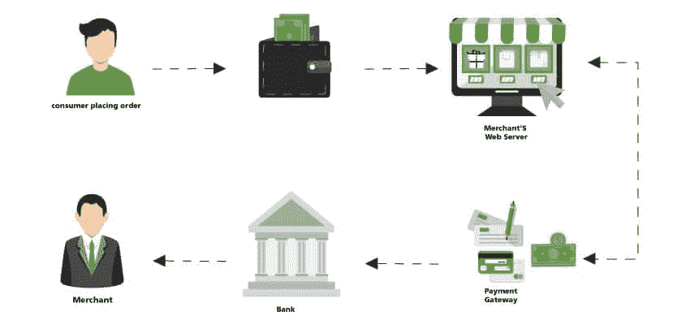
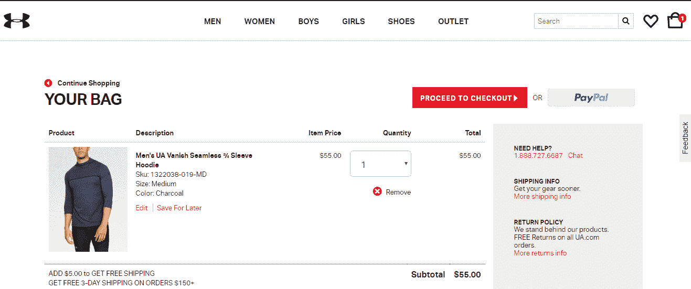
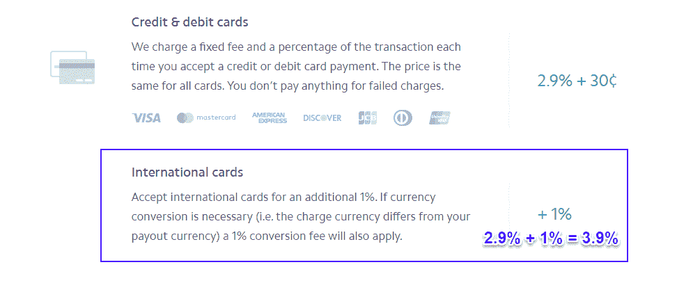

# stripe vs PayPal–你应该选择哪个支付网关？

> 原文:[https://kinsta.com/blog/stripe-vs-paypal/](https://kinsta.com/blog/stripe-vs-paypal/)

开始一项电子商务业务是一个令人兴奋的，混乱的时代。你有很多事情要考虑:你应该使用托管平台还是用插件管理你的商店？你需要什么样的策略来[提升你的销售额](https://kinsta.com/blog/ecommerce-strategies/)？

但是没有比这个问题更令人畏缩的了:你应该如何接受付款？

在你做好功课之后，你的商家 buck 将会有两个非常明确的竞争者: **Stripe 和 PayPal** 。提供可比较的功能，在两者之间选择感觉就像在苹果之间挑选……然而更多的苹果。这就是这篇文章的来源。

今天，我们将比较和对比这两个支付网关，并深入探讨 Stripe 与 PayPal 的争论。

Stripe vs PayPal

以下是行程安排:

 ## Stripe 和 PayPal 是做什么的？

[Stripe](https://stripe.com/) (成立于 2011 年)和 [PayPal](https://www.paypal.com/) (成立于 1998 年)都是支付网关，充当商家和适当的信用卡网络/金融机构之间的中间人，以授权和接受支付。

> 需要在这里大声喊出来。Kinsta 太神奇了，我用它做我的个人网站。支持是迅速和杰出的，他们的服务器是 WordPress 最快的。
> 
> <footer class="wp-block-kinsta-client-quote__footer">
> 
> 
> 
> <cite class="wp-block-kinsta-client-quote__cite">Phillip Stemann</cite></footer>

[View plans](https://kinsta.com/plans/)

这些错综复杂的关系会变得相当复杂。看待支付网关的一个简单方法是将其视为在商家和银行之间传递信息的使者。

以下是支付网关在电子商务网络中所处位置的直观分析。

Payment gateways (Image source: [Due](https://due.com/blog/knowing-differences-payment-gateways/))

支付网关并不是接受在线支付的唯一解决方案，但它是最容易着手的选择之一。

因为[与支付处理器](https://blog.clover.com/payment-gateway-vs-payment-processor-what-is-the-difference/)不同，网关为你的金融数据提供了必要的武装警卫，让它在信用卡网络、你的客户和你的商店之间传递。

换句话说，在大多数情况下，它可以帮助您摆脱对 [PCI 合规性](https://www.pcicomplianceguide.org/faq/)的依赖。如果你决定走网关路线，你会一次又一次地遇到 Stripe 和 Paypal。还有很多其他的支付网关，比如 Authorize.Net、2Checkout、brain tree(Paypal 旗下)，但是 [Stripe](https://kinsta.com/blog/stripe-vs-braintree/) 和 Paypal 是目前**最容易使用的两个**。

这也是有充分理由的:他们长期控制着市场。根据来自 Datanyze 的[数据，PayPal 被 42%的市场使用。Stripe 位居第二，约占 19%。截至 2018 年 9 月，Stripe 现在](https://www.datanyze.com/market-share/payment-processing--26/paypal-market-share)[估值 200 亿美元](https://techcrunch.com/2018/09/26/stripe-is-now-valued-at-20b-after-raising-another-245m-led-by-tiger-global/)！😮2020 年， [Stripe 收入](https://kinsta.com/stripe-revenue/)较 2019 年增长 270%，达到 74 亿美元。

Stripe vs PayPal market share (Image source: Datanyze)

### 支付网关是用来做什么的？

首先，也是最明显的，电子商务商店使用支付网关。安德玛就是一个同时使用 Stripe 和 PayPal 的商店的例子。

Stripe and PayPal (Image source: [Under Armour](https://www.underarmour.com/en-us/cart))

Perfmatters，一个 WordPress 性能插件是一个数字下载产品的例子，它接受两种支付网关。他们通过与 [Easy Digital Downloads](https://kinsta.com/blog/easy-digital-downloads/) 电子商务插件的集成来做到这一点。

EDD accept Stripe and PayPal ([Perfmatters](https://perfmatters.io))

你甚至可以使用这两个支付网关来接受捐赠。联合国儿童基金会，一个非盈利组织在他们的网站上这样做。

Stripe and PayPal donations (Image source: [UNICEF](https://www.unicefusa.org/))

(旁注:有兴趣像联合国儿童基金会一样在你的网站上接受捐款？查看我们的指南，了解如何为 [Stripe](https://kinsta.com/blog/stripe-donate-button/) 和 [PayPal](https://kinsta.com/blog/paypal-donate-button-wordpress/) 设置捐赠按钮。)

### 你应该使用一个还是两个支付网关？

以上所有这些都回避了一个显而易见的问题:如果你可以同时使用两种支付网关，为什么还要做出选择呢？

因为除非你和安德玛、联合国儿童基金会一样大，或者精通技术，有多余的时间，否则你就是在自找麻烦。

有了两个支付网关，就会有两倍多的供应商，两倍多的事情出错，*和*你可能会失去来自各自网关的[基于数量的折扣](https://home.bluesnap.com/snap-center/blog/multiple-payment-gateways/)。如果您有一个定制的后端或其他集成，围绕您所销售的产品或服务的开发可能会将这变成一项极其复杂的任务。对小企业来说不太好或不太可行。

然而，话虽如此。有时候，拥有两个支付网关对你的企业来说可能是一个优势。尤其是在其他国家。不是每个人都有信用卡，许多消费者和博客使用贝宝余额支付一切。

运行一个或两个支付网关很大程度上取决于行业、你卖的东西和你拥有的客户类型。

现在，随着这种方式，让我们最终潜入我们的对比条纹与贝宝。

## 交易成本和费用

在微支付方面，PayPal 是明显的赢家，每笔微交易的收费明显低于 Stripe。小额支付通常是 10 美元以下。

### Paypal 小额支付费用🏆

*   1.00 美元:1 美元的 5% = 5 且 5 + 5 = **10**
*   5.00 美元:5 美元的 5% = 25 且 25 +5 = **30**

### 条纹小额支付费用

*   1.00 美元:1 美元= 2.9 的 2.9%和 2.9 + 30 = **32.9**
*   5.00 美元:5 美元的 2.9% = 14.5，14.5 +30 = **44.5**

### 标准费用

但是假设你感兴趣的不仅仅是小额支付，情况就变得更加复杂了。

[PayPal 目前的费用](https://www.paypal.com/us/webapps/mpp/paypal-fees)是每笔交易的 2.9%+0.30 美元。

PayPal fee

[Stripe 的费用表](https://stripe.com/pricing)也是每笔交易 2.9% + $0.30。

Stripe fees

如你所见，他们的交易费是死的，即使你已经超过了“微观”水平。但是，一旦你开始研究细则，他们的收费会有多相似呢？这就是变得更加棘手的地方。

PayPal 对资金来源于美国境外的交易收取 4.4%的费用:

PayPal international fees

这意味着，即使客户现在是美国人，但使用国际卡，你也要支付同样的交易费。

Stripe 在这方面的收费稍微温和一些，除了 0.30 美元的固定费用之外，总共收取 3.9%的费用。

Stripe international fees

那么，在交易费之战中，谁会胜出呢？除非您正在处理常规的微交易，否则在这种情况下答案是令人愉快的。

**获胜者:条纹🏆**

现在，让我们看看这两个巨头在争议和退款费用方面的表现。

## 争议和退款费用

退款对每个相关人员来说都是痛苦的。当客户开始按存储容量使用计费时，您可以预见到的不仅仅是悬而未决的付款，您还会遇到额外的费用。

PayPal 的退款和相关费用包括未经授权的交易、未收到商品的投诉，以及对商品严重偏离描述的投诉。

当他们开始退款时，金额会退还给顾客，信用卡网络会向商家收取高达 20 美元的费用。(幸运的是，如果他们后来做出对你有利的裁决，这笔费用会退还给你。)

另一方面，Stripe 采取了一种更加直截了当的方法，在他们的文档中将争议简单地归类为退款。

通过 Stripe 解决的争议还需要支付 15 美元的小额可退还费用。此外，Stripe 还为商家提供了新的、令人惊叹的 Stripe 雷达功能，帮助他们防范信用卡欺诈。在 Kinsta，我们能够[防止 98%的信用卡欺诈](https://kinsta.com/blog/credit-card-fraud-stripe/)！

**获胜者:条纹🏆**

如果你还没有尝试 Stripe 的新雷达功能，我们强烈建议你这样做。

但在可用性和受支持的货币方面，他们会保持这种连胜吗？

## 退票费

PayPal 曾经是退款类别的赢家，因为他们会退还您的原始处理费。然而，从 2019 年 10 月 11 日起，这种情况将不复存在。

> PSA:从 2019 年 10 月 11 日开始，当您向客户退款时，Paypal 将不再返还处理费(2.9% + $0.30)。
> 
> 由于愤怒，Paypal 在五月份撤回了决定，现在无论如何都在前进，希望你不会注意到。
> 
> 钉在棺材上。再见， [@PayPal](https://twitter.com/PayPal?ref_src=twsrc%5Etfw) 。【pic.twitter.com/sAweMHxtLn T2】号
> 
> —肖恩·麦凯布(@ Sean wes)[2019 年 9 月 19 日](https://twitter.com/seanwes/status/1174826338202640385?ref_src=twsrc%5Etfw)