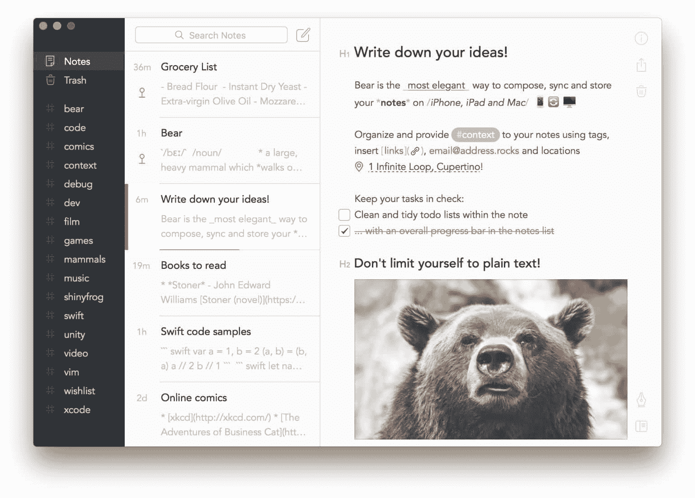
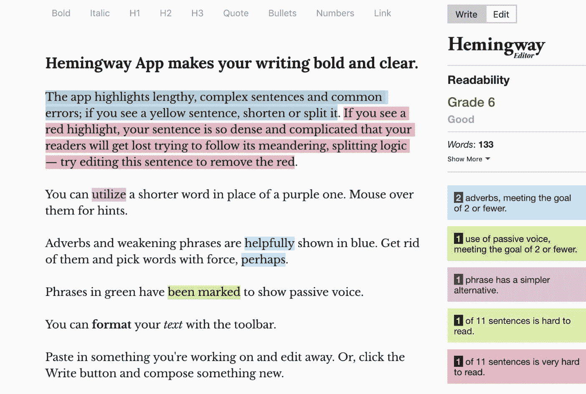

# 博客作者的 19 个校对技巧(写出更好的内容)

> 原文:[https://kinsta.com/blog/proofreading-tips/](https://kinsta.com/blog/proofreading-tips/)

校对常常没有得到应有的重视。很容易把它留到最后一分钟，然后被迫快速完成。

但是**校对是重要的**，应该被看作是写作过程中的一个关键步骤，需要大量的时间。⌛:没有什么比写了一篇非常有趣的博客文章，却发现自己错过了一些错误更糟糕的了。

校对不一定很难，只需要时间和几个好的策略。这里有一些校对你的博客的好方法。

<kinsta-auto-toc heading="Table of Contents" exclude="last" list-style="arrow" selector="h2" count-number="-1">[Proofreading helps you look professional and avoid the grammar police! 🚓 Check out these tips.Click to Tweet](https://twitter.com/intent/tweet?url=https%3A%2F%2Fbit.ly%2F2BxK3he&via=kinsta&text=Proofreading+helps+you+look+professional+and+avoid+the+grammar+police%21+%F0%9F%9A%93+Check+out+these+tips.&hashtags=proofreading%2Ccontentmarketing)

## 1.早上校对

好吧，不是每个人都是早起的人。不管你的日程安排如何，都要在一天的早些时候做好校对工作。在工作日开始时做校对意味着你会更加警觉和清醒。如果你累了就不要校对，你很可能会错过一些东西或者犯一个错误。很多人发现自己在下午昏昏欲睡，因为他们的咖啡因开始消退。

Tired (Image source: [SayingImages.com](https://sayingimages.com/sleepy-meme/))

底线:**每当你最清醒的时候，就是校对的时候**。
T3】

<link rel="stylesheet" href="https://kinsta.com/wp-content/themes/kinsta/dist/components/ctas/cta-mini.css?ver=2e932b8aba3918bfb818">

> Kinsta 把我宠坏了，所以我现在要求每个供应商都提供这样的服务。我们还试图通过我们的 SaaS 工具支持达到这一水平。
> 
> <footer class="wp-block-kinsta-client-quote__footer">
> 
> 
> 
> <cite class="wp-block-kinsta-client-quote__cite">Suganthan Mohanadasan from @Suganthanmn</cite></footer>

[View plans](https://kinsta.com/plans/)

## 2.休息一下，然后再回来

正如[学院](https://academized.com/)的校对马德琳·琼斯写道:

> 一旦你写完了，觉得你已经准备好开始编辑了，离开一会儿是个好主意。现在你的大脑太习惯于你所写的东西了，以至于不能进行适当的编辑工作。

你很可能会漏掉一些错误，因为你已经看了这篇文章一段时间了。几个小时后，甚至几天后，如果你有足够的时间，带着新鲜的眼光回来。用新鲜的眼光编辑可以让你带着一种超然的感觉去看文字，阅读那里的东西，而不是你想写的东西。

这一点在那些超长 10000+字的内容片上尤为重要！😉

## 3.特别注意标点符号

糟糕的标点符号看起来很糟糕。注意放错位置的撇号和句号。分号似乎也是很多人纠结的一件事。记住分号是用来连接单句中两个密切相关的独立分句的。

这里有一个例子:

> 明天我有一篇很大的博文要发表；今晚不能玩 Xbox 了。

上面的两个分句由分号分隔，但是如果您在它们之间加一个句点，它们可以作为自己的句子:

> 明天我有一篇很大的博文要交。今晚不能玩 Xbox 了。

如果你觉得它们令人困惑，最好避开它们。你可以不用分号就写出一篇完美的博文。

另一个博主们有时会纠结的问题是标题或页眉中哪些词要大写。有四种主要的标题大写风格:芝加哥风格，APA 风格，MLA 风格和 AP 风格。没有正确或错误的选择，但选择一个并坚持下去，这样你的写作感觉都一样。你可以随时在免费的在线工具上检查你的工作，比如[大写我的标题](https://capitalizemytitle.com/)。当你写作的时候，在你的浏览器中把它加入书签。

Capitalize titles

在一篇文章中，正确使用标点符号非常重要。
T3】

## 4.用手指或鼠标跟随

有效校对最重要的一点是慢慢读。很多人都在为此挣扎，但是有办法让事情慢下来。一种方法是在阅读时用食指指着每个单词。一些作者使用的另一个流行习惯是在他们前进的时候用鼠标突出显示单词。通过这样做，你将能够专注于每个单词。

当你校对时，自然的冲动是浏览你的文档。你觉得自己快完成了，只需要在提交之前快速浏览一遍。慢下来，你以后会感谢你自己的。👏

## 5.排除杂念，保持专注

澳大利亚帮助网站的编辑约兰达·费特建议如下:

> 在一个没有干扰的安静的地方做校对。关掉手机，远离社交媒体，关掉电视。将自己置身于一个不太可能被打扰的环境中。

有时，这甚至意味着完全断开互联网连接，打印文档，关闭笔记本电脑，用笔编辑。这也是一个好主意，有一个明确定义的编辑时间，而不是不停地编辑。如果你边走边编辑，你会不断地在写作和编辑之间来回切换模式。像这样切换模式可能会分散注意力，导致错过一些东西。

当你校对的时候，也很容易走神，不能完全集中注意力。如果你发现你在编辑的时候走神了，那么你需要**想办法让自己重新集中注意力**。如果你只是部分地集中注意力，你就不能很好地校对。校对是你需要敏锐的时候，因为它很容易错过一个错误。监控你自己，如果你发现自己偏离了，回头重新检查你校对的部分是很重要的。

当你读每个单词的时候，试着用脚或手敲击来保持注意力集中。有时候你只需要起来伸展一下，呼吸一下新鲜空气，几分钟后再回来。你常常很想一直坚持到完成，但是如果你在疲惫或分心的时候校对，你的文章质量会受到影响。

有时候在写作的时候做笔记会有所帮助，这样你就能保持写作状态，不会分心，失去思路。稍后再回来，看一下笔记，然后进行修改，会容易得多。

[Take advantage of comments in @googledocs for when you give your blog post its final proofread. ✏️Click to Tweet](https://twitter.com/intent/tweet?url=https%3A%2F%2Fbit.ly%2F2BxK3he&via=kinsta&text=Take+advantage+of+comments+in+%40googledocs+for+when+you+give+your+blog+post+its+final+proofread.+%E2%9C%8F%EF%B8%8F&hashtags=contentmarketing%2Cproofreading)

## 6.确保你有使用这些材料的许可

你的博客可以真正受益于包含来自其他人的材料，他们的知识和观点是你尊重的。在使用它来增强你的博客文章之前，确保它是没问题的。应该不用说，但是**抄袭是不行的**。如果你要使用其他人的材料，你需要注明他们是原作者，或者在你不确定的时候征得他们的同意。
T3】

 ## 注册订阅时事通讯

### 想知道我们是怎么让流量增长超过 1000%的吗？

加入 20，000 多名获得我们每周时事通讯和内部消息的人的行列吧！

[Subscribe Now](#newsletter)

## 7.找出你的弱点是什么

找出你最常犯的错误。即使是有经验的作家也会告诉你，他们有自己倾向的特定错误。也许你在混淆“二”、“太”和“到”时有问题，或者你有不正确放置撇号的坏习惯。无论你的弱点是什么，最重要的是你要找出它们，这样你就可以在校对时特别注意留意它们。

开始列出你常犯的错误，并在校对时随身携带，作为提醒。将这份清单放在手边也可以省去你在网上查找的麻烦。Google Keep 和 [Evernote](https://evernote.com/) 非常适合这类列表。

## 8.让别人阅读你的作品

如果可以的话，让一个朋友、同事或家人阅读你的帖子。没有什么比一双真正新鲜的眼睛来审视你的作品更好的了。不熟悉主题材料的人更有可能找出不一致的地方或需要更多解释的地方。因为你非常熟悉你的文章和它的主题，你的大脑可以很容易地填补你的文章缺乏解释的地方。找一个不熟悉的人，他们会给你反馈，让你的文章更容易被普通读者理解。

## 9.大声读出来

Cornelia Jefferson， [PaperFellows](https://paperfellows.com/) 的作者建议:

> 大声朗读你的文章，而不是默读。大声读出来会帮助你识别出那些不流畅的句子，或者那些读起来很别扭的句子。这也是确定你哪些句子太长的好方法。

通过在头脑中默读来编辑，发现这些缺陷的可能性要小得多。大声朗读的时候就明显多了，是不是哪里出了问题。通过大声朗读，你把自己放在读者的位置上，这有助于写作更容易理解和令人愉快。

## 10.改变字体

这听起来很简单，但有时一个简单的改变就足够了。在编辑文章之前，尝试[更改字体](https://kinsta.com/blog/how-to-change-font-in-wordpress/)或打印文章。你的眼睛已经非常习惯你输入的字体了。你已经盯着那个字体看了几个小时了，所以改变一下，让你看起来更新鲜。你也可以试着改变页边距。重要的是文字看起来不一样，这样你就可以把它当成你以前没见过的东西来接近。无意中浏览你的文章是很容易的，因为你已经看了很多遍了。

如果你有一个 WordPress 站点，有时候跳出编辑器使用不同的工具会很好。🤓对于那些在 MacOS 上的人来说，[小熊应用程序](http://www.bear-writer.com/)很棒，[字体很漂亮](https://kinsta.com/blog/modern-fonts/)(一定要阅读我们关于 [WordPress 字体](https://kinsta.com/blog/wordpress-fonts/)的深度指南)！它也可以导出到 markdown，HTML 等。为了方便转移到 WordPress。或者你可以尝试潜入古腾堡。

Bear writer app (Image source: Bear)

## 11.仔细检查你的介词

介词是像 under、on、with 和 after 这样的词。他们被用来描述某事的位置，某事发生的时间，和某事被做的方式。介词可能很难，尤其是如果英语不是你的第一语言，因为它们不一定符合逻辑。这对夫妇是星期天到达的，还是星期天到达的？如果你有困难，像 Google Ngram Viewer 这样的工具可以在图表上显示哪种方式是最常用的。如果你不确定一个单词的意思和如何使用它，你也应该查字典。

Struggling with downtime and WordPress problems? Kinsta is the hosting solution designed to save you time! [Check out our features](https://kinsta.com/features/)

## 12.分阶段校对

避免遗漏错误的一个好方法是分阶段校对，而不是试图一次看完所有内容。校对一次拼写错误，然后再校对一次行文，再校对一次标点符号，再校对一次语法，等等。一次专注于一种类型的错误会给你更高的准确率。创建一个系统，这样你就不会错过任何东西。只要确保你给自己足够的时间，因为这种方法显然会更费时。

不要 100%依赖拼写检查，因为他们并不完美；你会想把拼写作为你的一个阶段。拼写检查器无法读懂你的想法，也不知道你试图拼写的是“痛苦”，而不是“感情”尽管像 Grammarly 这样的工具可以帮助你找出常见的错误。尤其是当你在最不清醒的时候校对的时候。但是记住，你不应该这样做。😉

Grammarly example

另一个你应该看看的伟大的小工具是[海明威编辑器](http://www.hemingwayapp.com/)。它突出了冗长、复杂的句子和常见的错误。

Hemingway Editor

## 13.注意你的宫缩

是他们的还是他们的？大多数作者都知道这两者的区别，但是当你一天内打出几千个单词时，错误就会发生，拼写检查不会标记出来。留意你的宫缩和其他宫缩。错过它们真的会让你的作品显得业余。语法警察会找到你的！🚓

Grammar police (Image source: [Rysis](https://www.deviantart.com/rysis/art/Grammar-Police-150503510) on DeviantArt)

## 14.试着倒着读

校对的一个好方法是**简单地向后阅读你的文章**。当你向后读时，没有流动，所以你专注于每个单词。你将能够专注于每个单词的正确拼写，而不是被句子的内容分散注意力。这种方法确实需要相当多的时间，所以这是优先提前完成写作的又一个原因，这样你就有足够的时间校对。

## 15.在线资源可以帮助你校对

校对是很少有人喜欢做的事情，但是对于任何作家来说都是一项重要的技能。校对困难是很常见的，但是有很多资源可以用来提高你的技能。

*   [写作状态](http://stateofwriting.com/)和[我的写作方式](https://mywritingway.com/)
    *   试试这些写作指南，让你的写作过程更有条理，更易管理。写作涉及到很多步骤，按照自己的方式完成这些步骤是创作一篇令你自豪的作品的关键。这些指南将使你的写作过程更加简单和容易。
*   [萨罗](https://essayroo.com/)和[大任务](https://bigassignments.com/)
    *   校对通常是事后才想到的，是在最后一刻匆忙完成的事情。但是它和写作过程中的任何一步一样重要。这些是由[评审](https://revieweal.com/)推荐的编辑工具。你会惊讶于自己编辑和在一些专家的帮助下编辑之间的差别。
*   [ViaWriting](https://viawriting.com/) 和[studemic](https://studydemic.com/)
    *   语法是许多优秀作家都存在的问题。有很多规则要记住，很容易出错。这些语法资源可以帮助你检查你的写作，确保一切看起来专业。
*   [Boomessays](https://boomessays.com/) 和 [UKWritings](https://ukwritings.com/)
    *   简单 Grad in [Boomessays review](https://simplegrad.com/boomessays-review/) 已经认可了这些在线校对资源。不要冒险在你的博文中留下一两个错别字，这些工具可以保证你的写作完美无瑕。即使你写了一篇令人惊叹和有启发性的文章，如果有错误，对读者的影响也不会一样。使用这些工具来确保你的帖子既有趣又有价值，在技术上令人印象深刻。
*   [写人口表](https://writingpopulist.com/)和[让学生学习](https://letsgoandlearn.com/)
    *   最好的学习方法之一是看看其他作家在做什么。这些校对博客上充满了校对作者的信息和经验。从他们的错误中吸取教训，并利用这些教训来改进你的校对过程。

## 16.标题、题目和列表

很多人忘记检查和校对他们的标题、题目和清单。确保你校对一切。对于一些人来说，这有助于使这些成为校对阶段之一，以确保他们不会被遗忘。标题和题目很容易忘记，但是如果有错误，阅读的人会完全看得出来。不要忘记仔细检查帖子中的任何列表，确保号码顺序正确，没有遗漏号码。

## 17.那些最后一分钟的变化

有时候，当你在校对阶段，你意识到你需要添加一两个句子来表达清楚。当这样做的时候，重要的是你要回去重读一遍段落，以确保所有的内容都合适。对于作者来说，添加信息，然后忘记回去调整段落中的其他相关单词是很常见的。确保你在校对阶段编辑了那些额外的句子。

## 18.仔细检查你的事实、姓名和地点

重要的是你要掌握正确的事实。像拼写检查这样的工具在这里帮不了你。你需要做一些事实核查。确保你在帖子中提到的任何地点或人物都使用了正确的名称。如果你引用统计数据，确保你已经得到了他们的权利，并包括适当的引用。

如果你忘记了这一点，你的帖子会被完全破坏，给你的读者留下你甚至不知道澳大利亚的首都是哪里的印象(提示:它不是悉尼😉)一个快速的事实核查步骤不需要花太多时间，就你的可信度而言，它会带来很大的不同。只要确保你有一些可以依赖的高质量来源。

## 19.不要忘记你的格式

在最后格式化，但是要确保你没有忘记。仔细检查并确定段落间距、项目符号、列表、文本换行、缩进等格式都正确。您可能希望将这一步留到最后，因为在校对过程中事情可能会发生变化。保持格式一致。如果你把标题加粗了一次，那就在你的文章中一直这样做。挑一个自己喜欢的风格，坚持下去。

## 摘要

校对不一定很难。如果你给自己充足的时间并使用一些策略，你的博客文章将会很专业。找出你的弱点，并专注于这些方面。写完之后，在开始校对之前休息一下。注意缩写、格式和介词。

学习如何放慢速度，一个一个地读每个单词。如果这意味着用你的食指指着，或者全部倒着读，那也没关系。不要让糟糕的校对过程破坏了一篇好的博文。养成在提交前留出充足时间润色你的博客文章的习惯。找出适合你的方法，并准备好在你的校对过程中投入一些时间。

当你写博客的时候，有没有其他的校对技巧或窍门？请在下面的评论中告诉我们它们是什么。

* * *

让你所有的[应用程序](https://kinsta.com/application-hosting/)、[数据库](https://kinsta.com/database-hosting/)和 [WordPress 网站](https://kinsta.com/wordpress-hosting/)在线并在一个屋檐下。我们功能丰富的高性能云平台包括:

*   在 MyKinsta 仪表盘中轻松设置和管理
*   24/7 专家支持
*   最好的谷歌云平台硬件和网络，由 Kubernetes 提供最大的可扩展性
*   面向速度和安全性的企业级 Cloudflare 集成
*   全球受众覆盖全球多达 35 个数据中心和 275 多个 pop

在第一个月使用托管的[应用程序或托管](https://kinsta.com/application-hosting/)的[数据库，您可以享受 20 美元的优惠，亲自测试一下。探索我们的](https://kinsta.com/database-hosting/)[计划](https://kinsta.com/plans/)或[与销售人员交谈](https://kinsta.com/contact-us/)以找到最适合您的方式。</kinsta-auto-toc>