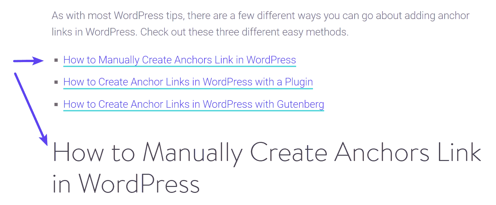
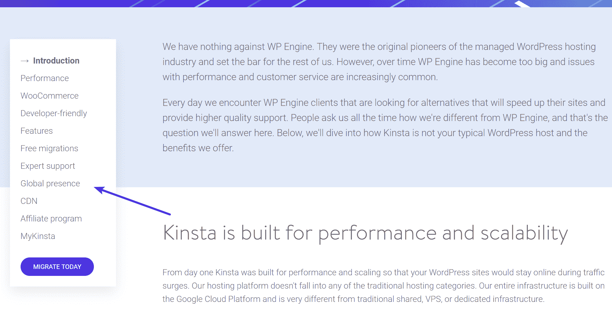
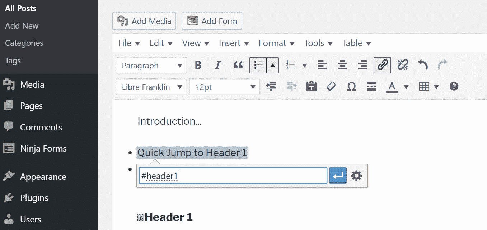
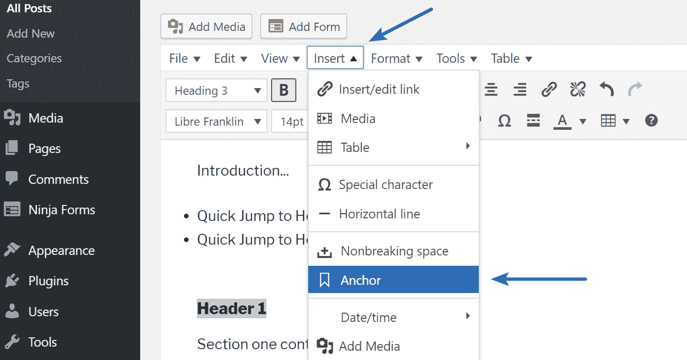
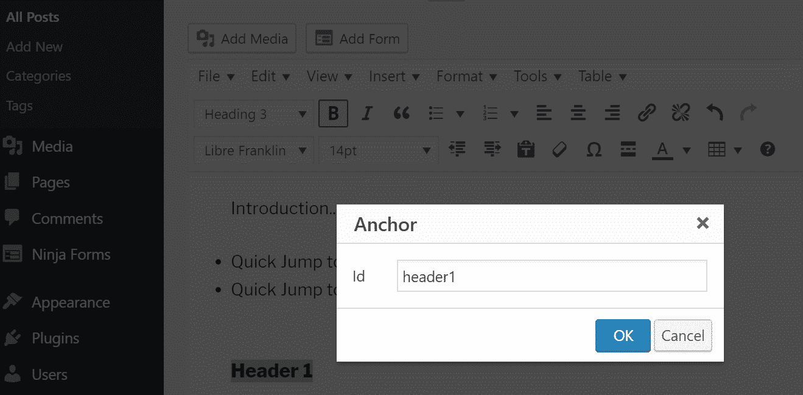
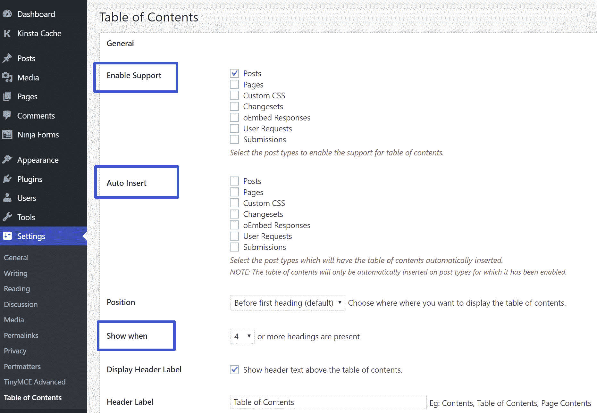
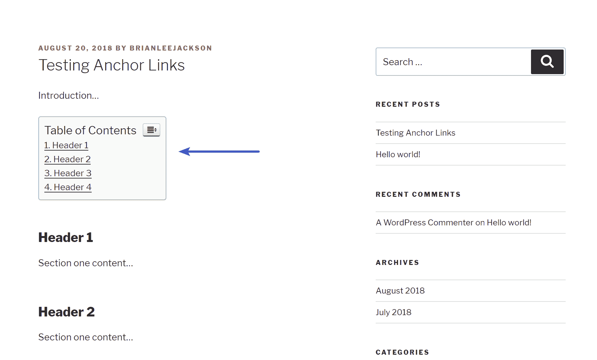
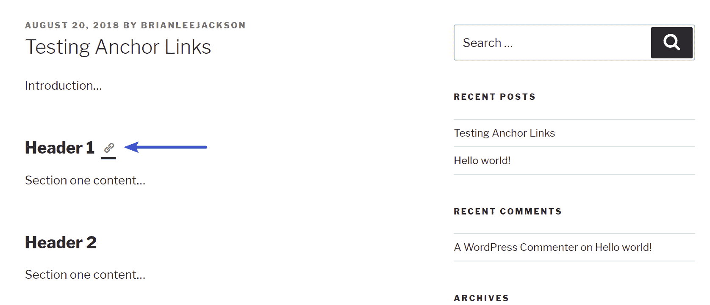
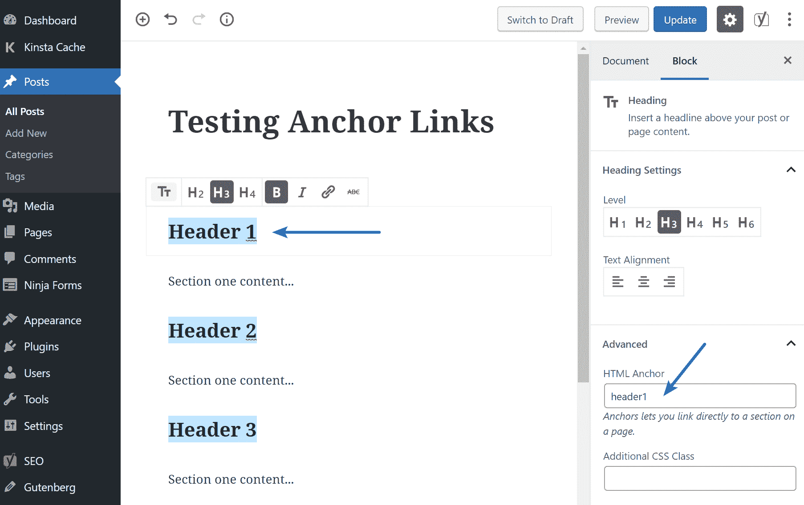

# 如何在 WordPress 中创建锚链接(3 个简单的方法)

> 原文:[https://kinsta.com/blog/anchor-links/](https://kinsta.com/blog/anchor-links/)

锚链接不是一个经常被讨论的话题，但是我们已经有了很好的结果！今天我们将深入探讨如何在 WordPress 中创建锚链接，并探究为什么你会想开始使用它们。从我们的经验来看，锚链接可以帮助改善用户体验，使浏览长格式内容变得容易得多，甚至可以让你在谷歌中获得一点优势。谁不想在谷歌获得免费优势？😉


## 什么是锚链接？

锚定链接，也称为跳转菜单链接或目录，是即时将您带到页面特定部分(或外部页面)的链接。锚目的地通常通过使用 A 元素(用 name 属性命名)或任何其他元素(用 ID 属性命名)来指定。两种方法都完全符合 W3C 标准([来源](https://www.w3.org/TR/html4/struct/links.html))。

Support

### 更喜欢看[视频版](https://www.youtube.com/watch?v=Xd3AbMsOM98)？


### 锚定链接的示例

如果你对什么是锚链接还有点困惑，不要担心。请参见下面的示例图像。我们在每一个项目符号列表项上都使用了锚链接。当你点击它们时，它会直接把你带到包含该内容的 H2 标题。你可以在后面的文章中亲自查看。锚链接可以用在任何东西上，比如文本、图像和 H1-H6 标题。



Anchor links


在很多网站上，锚链接只是用来在长篇文章的开头创建一个目录。如果你知道一个[小 CSS，你可以发挥创意](https://kinsta.com/blog/wordpress-css/)让它们看起来更时尚一点，就像我们在登陆页面上做的那样。



Anchor links on a long-form article


在其他网站上，你可能看不到锚链接，相反，它们被简单地用在标题上，这样他们就可以直接分享到特定部分的链接。


> 需要在这里大声喊出来。Kinsta 太神奇了，我用它做我的个人网站。支持是迅速和杰出的，他们的服务器是 WordPress 最快的。
> 
> <footer class="wp-block-kinsta-client-quote__footer">
> 
> 
> 
> <cite class="wp-block-kinsta-client-quote__cite">Phillip Stemann</cite></footer>

[View plans](https://kinsta.com/plans/)

### 锚链接的利与弊

仅仅因为我们在做一些事情并不意味着你应该这样做。在你的 WordPress 站点上使用锚链接时，这里有一些利弊需要考虑。

#### 赞成的意见

*   锚链接的最大优势之一是在浏览你的网站时创造更好的用户体验。说到[长篇文章](https://kinsta.com/blog/long-form-articles/)更是如此。我们发布了大量有深度的内容(4000 多字)，滚动可能会成为一种痛苦。使用锚链接允许用户立即跳转到他们感兴趣的部分。**让你的用户更快找到他们需要的东西。**
*   在标题上使用锚链接可以让你分享文章中不同部分的直接链接。这对社交媒体甚至支持团队来说都是非常棒的。例如，我们在 Kinsta 的支持团队非常依赖我们知识库文章中的锚链接，以便我们可以将用户发送到他们需要遵循的确切故障诊断步骤。我们的销售团队也利用这些来更快地回答与 Kinsta 相关的问题。
*   When it comes to search engine results pages (SERPs), results can always vary based on what shows up. However, we have seen time and time again the anchor links (jump menus) appear on our SERP listing because we’ve used them in our articles. These are awesome because they essentially **give you another line of text for your organic listing**. They can also help **increase CTR** as the user might see something related to their query that you didn’t convey in the [meta description](https://kinsta.com/blog/meta-description-wordpress/) or title.

    

    谷歌中的锚链接示例

    

*   锚链接也可以用于其他事情，比如维基百科使用的“返回页首”链接及其引文 [^](https://kinsta.com/blog/anchor-links/) 或脚注。<sup>【1】</sup>

#### 骗局

虽然我们认为好处肯定大于坏处，但这里有一些你可能要考虑的挫折。

*   锚链接或目录**可以减少每个访问者在网站上的平均停留时间**。为什么？因为他们会直接跳到他们想要的内容，而不是阅读整篇文章。然而，如果你立刻让你的访问者高兴，这可能会导致他们订阅你的时事通讯或者对你卖的东西做更多的研究。所以这可以被看作是有利或不利的一面。
*   与上述问题直接相关的是，锚链接可能会影响你的广告收入。访问者直接跳到某一部分可能会减少印象和点击。严重依赖广告的网站可能想用锚链接和目录来测试。
*   如果您正在更改域或需要添加 301 重定向，请注意片段标识符(#)永远不会发送到服务器，这一点很重要。这可能会使事情变得复杂，如果你改变你的锚链接的话。有很多方法可以用 JavaScript 解决这个问题，但是这绝不是一件容易的事情。

### 锚点链接转换

您可能还想考虑更改锚链接过渡。默认情况下，锚链接会突然跳转到页面更下方的 ID。这可能会让一些人感到不舒服。您可以更改这一点，使其成为平滑的滚动过渡。这实际上是我们在 Kinsta 博客上做的。你可以利用一个免费的插件，比如[页面滚动来识别](https://wordpress.org/plugins/page-scroll-to-id/)，或者给你的网站添加一些 CSS，比如`scroll-behavior: smooth;`。这个[栈溢出帖子](https://stackoverflow.com/questions/25020582/scrolling-to-an-anchor-using-transition-css3)为开发者提供了一些额外的提示。

和大多数 WordPress 技巧一样，在 WordPress 中添加锚链接有几种不同的方法。看看这三种不同的简单方法。是的，下面的这些链接使用了锚文本。😁

*   [如何在 WordPress 中手动创建锚链](#manually-create-anchor-links-wordpress)
*   [如何用插件在 WordPress 中创建锚链接](#anchor-links-wordpress-plugin)
*   [如何用古腾堡在 WordPress 中创建锚链](#anchor-links-wordpress-gutenberg)

## 如何在 WordPress 中手动创建锚链接

在 WordPress 中创建锚链接的第一种方法是在你的每篇文章中用 HTML 手工创建。让我们创建一个，以便您可以看到它们是如何工作的。

## 注册订阅时事通讯


### 想知道我们是怎么让流量增长超过 1000%的吗？

加入 20，000 多名获得我们每周时事通讯和内部消息的人的行列吧！

[Subscribe Now](#newsletter)

### 第一步

为您的链接创建文本，并在其上添加超链接，就像您通常为任何其他链接所做的那样。


Create an anchor link with HTML


### 第二步

而不是将其链接到 URL、帖子或页面；您将为其指定一个锚名。指定**锚点的 URIs 包含一个“#”字符**，后跟锚点名称。您可以将它命名为您想要的任何名称，尽管我们通常建议保持简短并与头的实际名称相关。

如果您查看文本视图(HTML ),它看起来像这样:

```
<a href="#manually-create-anchor-links-wordpress">How to Manually Create Anchor Links in WordPress</a>
```

以下是我们在本帖中使用的所有锚链接的例子:

```
<ul>
<li><a href="#manually-create-anchor-links-wordpress">How to Manually Create Anchor Links in WordPress</a></li>
<li><a href="#anchor-links-wordpress-plugin">How to Create Anchor Links in WordPress with a Plugin</a></li>
<li><a href="#anchor-links-wordpress-gutenberg">How to Create Anchor Links in WordPress with Gutenberg</a></li>
</ul>
```

### 第三步

接下来，您需要在希望锚链接跳转到的标题上添加一个 ID。为此，你需要在 WordPress 编辑器中切换到文本视图(HTML)。在报头上，在本例中是 H2 报头，添加 ID 和您在步骤 2 中选择的锚名。锚点名称和 ID 属性必须完全相同，链接才能工作。

```
<h2 **id="manually-create-anchor-links-wordpress"**>How to Manually Create Anchors Link in WordPress</h2>
```

## 如何用插件在 WordPress 中创建锚链接

不想每次都麻烦 HTML 代码？别担心，有一些很棒的免费 WordPress 插件，你可以利用它们轻松地给每篇文章添加链接，甚至目录。


### 用插件添加锚链接

添加锚链接最简单的方法之一是使用免费的 [TinyMCE Advanced](https://wordpress.org/plugins/tinymce-advanced/) 插件。这个插件基本上用快捷按钮给编辑器增加了额外的功能。截至撰写本文时，该插件已有超过 200 万个活跃安装，评分为 4.5 分(满分为 5 星)。

[](https://wordpress.org/plugins/tinymce-advanced/)

TinyMCE Advanced WordPress plugin


#### 第一步

安装并激活插件后，进入你的文章并在你的锚文本上创建一个超链接。而不是将其链接到 URL、帖子或页面；您将为它分配一个前面带有#的锚点名称。



Add anchor name


#### 第二步

突出显示要链接的标题。然后点击顶部的“插入”按钮，选择“锚”这个按钮出现在编辑器中是因为 TinyMCE 高级插件。



Add anchor


#### 第三步

输入您在步骤 1 中给出的锚点名称，然后单击“确定”这个插件节省了你的时间，因为你永远不必离开可视化编辑器视图。如果你用 HTML 手动操作，你必须在可视化编辑器和文本编辑器(HTML)视图之间切换。



Anchor ID


### 用插件添加目录

也许你想加速这个过程。😄如果你正在写很多有深度的内容，并且总是想在你的文章中包含一个目录(锚链列表/跳转菜单)，那么你应该利用一个目录插件。

更好的用户体验始于更好的网站主机。[免费试用 kin sta](https://hubs.ly/H0pklC_0)。

最好的免费插件之一是[简易目录](https://wordpress.org/plugins/easy-table-of-contents/)。这个插件自动为你的标题生成锚链接，让你用一个简单的短代码在你的文章中的任何地方插入你的目录。截至撰写本文时，该插件已有超过 30，000 个活跃安装，评分为 4.5 分(满分为 5 星)。

[](https://wordpress.org/plugins/easy-table-of-contents/)

Easy Table of Contents WordPress plugin


#### 第一步

安装并激活插件后，您可能需要更改一些设置。这些可以在“设置→目录”下找到

*   “启用支持”选项允许您选择要使用目录的文章类型。这很可能是你的“帖子”类型。
*   然后，您可以选择是自动插入目录还是手动插入目录。如果你的帖子有一点变化，我们可能会建议你手动修改。
*   “显示时间”选项可以让你定义在目录出现之前文章应该有多少个标题。例如，你可能不希望一个目录出现在一篇短的博客文章中，所以至少做四个或更多的标题可能是最好的。



Easy Table of Contents settings


### 第二步

要手动插入目录，只需将`[ez-toc]`简码插入你希望它出现在文章中的地方。


EZ-TOC shortcode


然后，为文章中的所有标题自动生成目录。多棒啊。



WordPress table of contents


您还可以对应该显示的内容、排除、外观等设置进行更多更改。例如，也许你总是在文章的末尾有一个“总结”的标题。您可以将该标题输入设置中的排除列表，这样它就不会包含在目录中。

另一个你可能想看看的目录插件是[简码目录](https://wordpress.org/plugins/shortcode-toc/)。这是市场上较新的插件，但它是由[詹姆斯·肯普](https://kinsta.com/blog/interview-james-kemp/)开发的，我们有幸采访了他。

### 使用插件自动在标题上添加锚链接

想简单地在你所有的标题上自动添加锚链接吗？然后你应该看看免费的 [WP 锚头](https://wordpress.org/plugins/wp-anchor-header/)插件。这将添加锚链接到您所有的 H1 H6 标题。

[](https://wordpress.org/plugins/wp-anchor-header/)

WP Anchor Header plugin


这是一个非常基本的插件，没有任何设置。只需安装它，激活它，你就可以走了。每个标题将自动获得一个锚名(来源于标题名)，它们甚至会获得一个很酷的小锚图标，当你悬停在标题上时就会显示出来。这使得访问者可以很容易地看到那里有一个链接，如果他们想复制的话。



Automatic anchor links on headers


## 如何用 Gutenberg 在 WordPress 中创建锚链接

新的[古腾堡编辑器](https://kinsta.com/blog/gutenberg-wordpress-editor/)即将面世，预计将与 WordPress 5.0 一起发布。随着它的改进和内置支持添加锚 id 到头部。

### 第一步

突出显示 Gutenberg 块中的标题，然后单击右侧的“高级”。然后你会看到一个添加 HTML 锚的选项。



Add HTML anchor in Gutenberg editor


### 第二步

如果你想链接到它，只需在你的锚文本上创建一个超链接。而不是将其链接到 URL、帖子或页面；您将为它分配一个前面带有#的锚点名称。


Add anchor link in Gutenberg


## 摘要

正如你所看到的，在 WordPress 中有很多创造性的方法来添加链接。有些比其他的容易。如果你发布了很多较长的内容，这有助于你的访问者马上找到他们想要的内容。我们也看到锚链接有助于在 SERPs 中“跳转到菜单”,这有助于增加你的有机列表的点击率。

你在你的 WordPress 网站上使用锚链接了吗？如果是这样，我们很想听听你的经历或想法。

* * *

让你所有的[应用程序](https://kinsta.com/application-hosting/)、[数据库](https://kinsta.com/database-hosting/)和 [WordPress 网站](https://kinsta.com/wordpress-hosting/)在线并在一个屋檐下。我们功能丰富的高性能云平台包括:

*   在 MyKinsta 仪表盘中轻松设置和管理
*   24/7 专家支持
*   最好的谷歌云平台硬件和网络，由 Kubernetes 提供最大的可扩展性
*   面向速度和安全性的企业级 Cloudflare 集成
*   全球受众覆盖全球多达 35 个数据中心和 275 多个 pop

在第一个月使用托管的[应用程序或托管](https://kinsta.com/application-hosting/)的[数据库，您可以享受 20 美元的优惠，亲自测试一下。探索我们的](https://kinsta.com/database-hosting/)[计划](https://kinsta.com/plans/)或[与销售人员交谈](https://kinsta.com/contact-us/)以找到最适合您的方式。