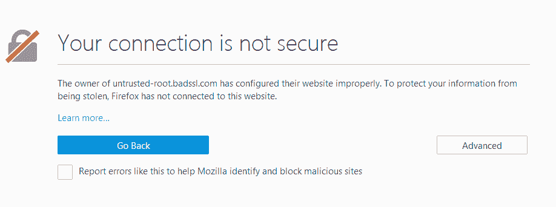
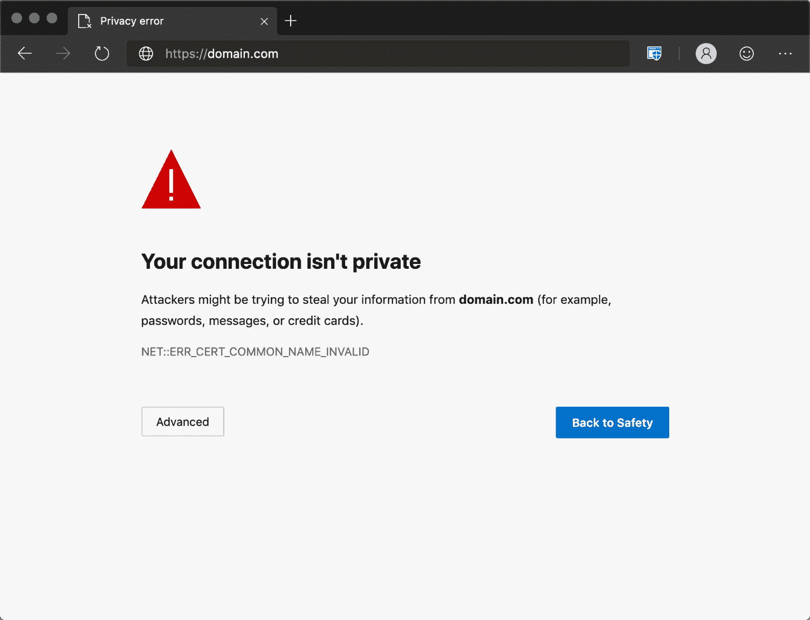
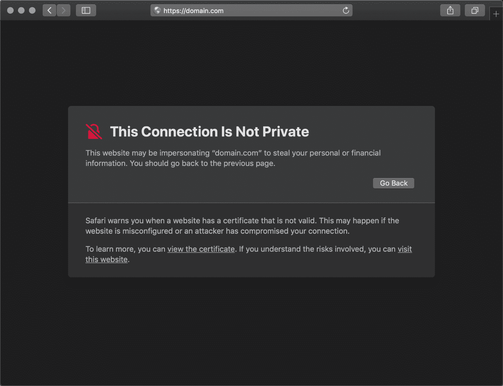
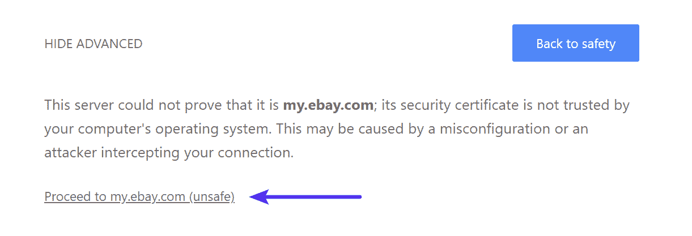
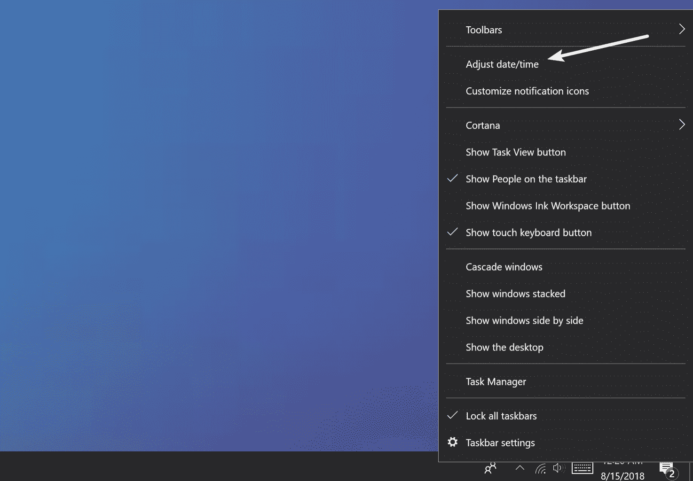
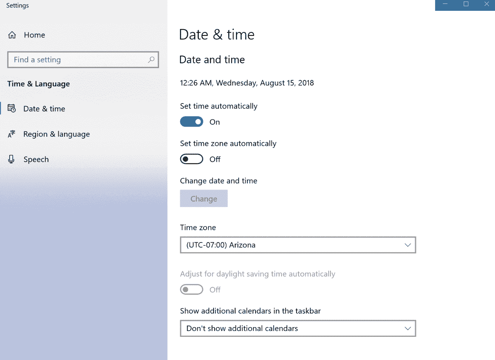
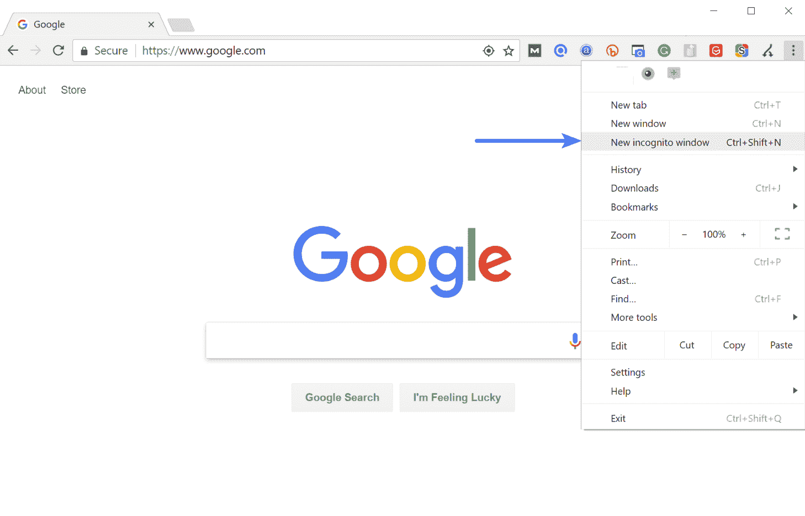
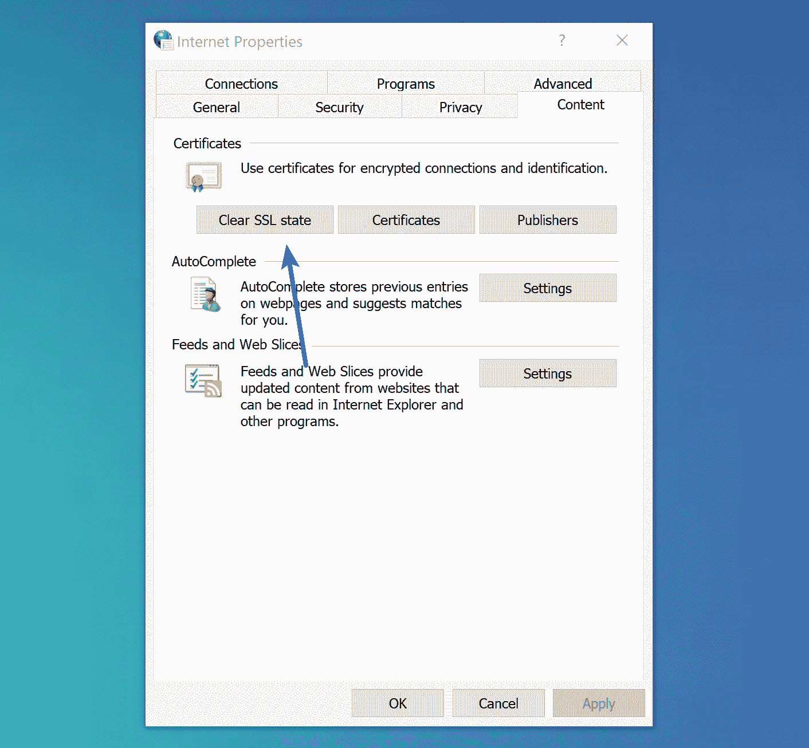

# 如何修复“你的连接不是私人的”错误(18 个技巧)

> 原文:[https://kinsta.com/blog/your-connection-is-not-private/](https://kinsta.com/blog/your-connection-is-not-private/)

Kinsta 每天与数千个不同的网站打交道，所以当涉及到不同类型的错误时，我们几乎都见过。从[数据库连接错误](https://kinsta.com/blog/error-establishing-a-database-connection/)到[白屏死机](https://kinsta.com/blog/wordpress-white-screen-of-death/)、 [ERR_CACHE_MISS](https://kinsta.com/knowledgebase/err_cache_miss/) ，以及浏览器/TLS 相关问题。

对于日常用户来说，其中一些有时会令人沮丧甚至害怕。根据错误的类型，这也可能意味着你的网站停机，这意味着你在赔钱。或者可能只是你电脑上的浏览器需要修复。

今天，我们将深入探讨“**您的连接不是私人的**”错误，并带您了解一些让事情恢复正常的方法。请阅读下面的详细内容，了解导致此错误的原因，以及将来如何避免此错误。

<kinsta-auto-toc heading="Table of Contents" exclude="last" list-style="arrow" selector="h2" count-number="-1">T3】

### 查看我们的视频指南[修复“你的连接不是私人的”错误](https://www.youtube.com/watch?v=5qU82RLqkW0)

<kinsta-video src="https://www.youtube.com/watch?v=5qU82RLqkW0"></kinsta-video>

## 什么是“您的连接不是私有的”错误？

“你的连接不是私人的”错误**只适用于运行在 HTTPS** 的网站(或者应该运行在 HTTPS)。当您访问网站时，您的浏览器会向托管该网站的服务器发送请求。然后，浏览器必须验证网站上安装的证书，以确保它符合当前的隐私标准。还会发生的其他事情包括 [TLS 握手](https://kinsta.com/knowledgebase/ssl-handshake-failed/#3-configure-your-browser-for-the-latest-ssltls-protocol-support)，根据证书授权检查证书，以及解密证书。

| **错误代码** | 您的连接不是私人的 |
| **错误类型** | SSL Error |
| **误差变化** | 你的连接不私密
你的连接不安全
你的连接不私密
这个连接不私密 |
| **错误原因** | 过期的 SSL 证书
不安全的网络
浏览器缓存和 cookie 设置
不正确的日期/时间设置
DNS 错误
VPN &杀毒软件 |

如果浏览器发现证书无效，它会自动阻止您访问该网站。这项功能内置于 web 浏览器中，以保护用户。如果证书设置不正确，这意味着数据不能正确加密，因此访问该网站是不安全的(特别是那些有登录或处理支付信息的网站)。它不会加载站点，而是会显示一条错误消息，比如“您的连接不是私有的”

<link rel="stylesheet" href="https://kinsta.com/wp-content/themes/kinsta/dist/components/ctas/cta-mini.css?ver=2e932b8aba3918bfb818">

> Kinsta 把我宠坏了，所以我现在要求每个供应商都提供这样的服务。我们还试图通过我们的 SaaS 工具支持达到这一水平。
> 
> <footer class="wp-block-kinsta-client-quote__footer">
> 
> 
> 
> <cite class="wp-block-kinsta-client-quote__cite">Suganthan Mohanadasan from @Suganthanmn</cite></footer>

[View plans](https://kinsta.com/plans/)

 <kinsta-advanced-cta language="en_US" type-int-post="30383" type-int-position="0">## 为什么会出现“您的连接不是私有的”错误？

您可能会看到“您的连接不是私有的”错误的主要原因是，您的浏览器无法验证安全套接字层(SSL)证书，这是出于安全原因所必需的。

SSL 证书使打开加密连接成为可能，因为它是安装在 web 服务器上的文本文件，其中包含诸如证书颁发的域名以及拥有该域的个人、组织或设备等信息。

考虑到所有这些，错误“您的连接不是私有的”可能是因为:

*   该网站的 SSL 证书无效或丢失。
*   SSL 证书设置不正确。
*   服务器为错误的网站提供了 SSL 证书。
*   SSL 证书不包含域名变体。

## “您的连接不是私人的”错误变体

根据您使用的 web 浏览器、操作系统，甚至服务器上的证书配置，此错误有许多不同的变体。虽然这些错误中的一些有时意味着稍微不同的事情，但是很多时候故障诊断步骤是相同的。

### 你的连接在谷歌浏览器中不是私人的

在 Google Chrome 中，如果验证证书时出现问题，错误将显示为“**您的连接不是私有的**”(如下所示)。

> 攻击者可能试图从 domain.com 窃取您的信息(例如，密码、消息或信用卡)。

Your connection is not private error in Chrome

这也伴随着一个错误代码信息，它有助于尝试和查明确切的问题。以下是你可能在谷歌浏览器中看到的一些最常见的错误代码:

*   错误 _ 证书 _ 赛门铁克 _ 传统
*   [NET::ERR _ CERT _ AUTHORITY _ INVALID](https://kinsta.com/knowledgebase/neterr-cert-authority-invalid/)
*   [NET::ERR _ CERT _ COMMON _ NAME _ INVALID](https://kinsta.com/knowledgebase/net-err_cert_common_name_invalid/)(当证书与域不匹配时会出现这种情况)
*   NET::错误证书弱签名算法
*   NET::ERR _ CERTIFICATE _ TRANSPARENCY _ 必填
*   [NET::ERR _ CERT _ DATE _ INVALID](https://kinsta.com/knowledgebase/net-err_cert_date_invalid/)
*   [错误 _ SSL _ 协议 _ 错误](https://kinsta.com/knowledgebase/err_ssl_protocol_error/)
*   [错误 _ SSL _ 版本 _ 或 _ 密码 _ 不匹配](https://kinsta.com/knowledgebase/err_ssl_version_or_cipher_mismatch/)

### 您的连接在 Mozilla Firefox 中不安全

在 Mozilla Firefox 中，错误消息略有不同，您看到的不是“您的连接不是私有的”，而是“您的连接不安全”(如下所示)。

> domain.com 的所有者配置他们的网站不正确。为了保护您的信息不被窃取，Firefox 没有连接到该网站。

This connection is not secure warning in Firefox

就像在 Chrome 中一样，它伴随着一个错误代码信息，这有助于尝试和查明问题。以下是你可能在 Mozilla Firefox 中看到的一些最常见的错误代码:

*   MOZILLA _ PKIX _ ERROR _ ADDITIONAL _ POLICY _ CONSTRAINT _ FAILED
*   SEC _ ERROR _ EXPIRED _ ISSUER _ 证书
*   秒 _ 错误 _ 过期 _ 证书
*   SEC _ ERROR _ UNKNOWN _ ISSUER
*   MOZILLA _ PKIX _ ERROR _ MITM _ 检测到
*   错误 _ 自签名 _ 证书
*   SSL _ 错误 _ 错误 _ 证书 _ 域

### 您的连接在 Microsoft Edge 中不是私有的

在 Microsoft Edge 中，您还会看到错误信息“您的连接不是私有的”

> 攻击者可能试图从 domain.com 窃取您的信息(例如，密码、消息或信用卡)。

Your Connection isn’t Private Error in Microsoft Edge

这些还伴随着错误代码信息。以下是一些最常见的错误代码:

*   NET::ERR _ CERT _ COMMON _ NAME _ INVALID(当证书与域不匹配时会出现这种情况)
*   错误代码:0
*   DLG 标志无效
*   DLG _ 标志 _ 秒 _ 证书 _ CN _ 无效

[T2】](https://kinsta.com/plans/?utm_campaign=plans&utm_source=blog-knowledgebase&utm_medium=gif-banner)

### 此连接在 Safari 中不是私有的

在 Safari 中，您会看到错误信息“您的连接不是私有的”

> 该网站可能假冒“domain.com”来窃取您的个人或财务信息。你应该回到上一页。

Your connection is not private error in Safari

## 如何修复“您的连接不是私人的”错误

有时，如果您看到“您的连接不是私有的”错误，您甚至不知道从哪里开始。根据我们的经验，这些错误通常源于两件事:第一件是**客户端问题**(您的浏览器、计算机、操作系统)，第二件是网站上的证书存在实际的**问题**(过期、错误的域、不受组织信任)。因此，我们将深入了解这两者。

 ## 注册订阅时事通讯

### 想知道我们是怎么让流量增长超过 1000%的吗？

加入 20，000 多名获得我们每周时事通讯和内部消息的人的行列吧！

[Subscribe Now](#newsletter)

以下是一些建议和需要检查以修复错误的事项(按我们看到的最常见原因排序):

<kinsta-auto-toc list-style="decimal" selector="h3" count-number="-1" sub-toc="true">T3】

### 1.尝试重新加载页面

对某些人来说，这似乎有点显而易见，但当遇到“您的连接不是私有的”错误时，您应该尝试的最简单和最先的事情之一是简单地关闭并重新打开您的浏览器，并尝试再次加载页面。可能是网站所有者正在重新颁发他们的 SSL 证书，或者是你的浏览器出了问题。

### 2.手动进行(不安全)

您的第二个选择是简单地手动进行。然而，**我们不建议这样做，除非你完全明白如果你继续的话什么都不会被加密**。如果您要输入登录凭证或输入付款详情，请务必跳到下面的后续步骤。

我们包括这个选项只是为了解释这样做的全部后果。看到这个错误很可能意味着有人试图愚弄你或窃取你发送到服务器的任何信息，你通常应该立即关闭网站。也有可能是网站已经被攻破，存在恶意重定向。如果你在公共场所，千万不要试图绕过这个屏幕。

如果您仍想继续，通常可以在错误屏幕的底部单击“Proceed to domain.com”链接。根据浏览器的不同，这有时会隐藏在“高级”选项下。注意:如果网站正在使用 [HSTS](https://kinsta.com/knowledgebase/hsts-strict-transport-security/) (HTTP 严格传输安全)这个选项将不可用，因为这意味着他们已经实现了一个从不允许非 HTTPS 连接的 HTTP 头。

Connection error proceed anyways

### 3.你是在咖啡馆还是在机场？

这听起来可能很奇怪，但☕咖啡馆和机场 Wi-Fi 网络往往是用户看到“你的连接不是私人的”错误的最受欢迎的地方之一。为什么？因为他们中的许多人仍然没有在 HTTPS 上运行所有的东西，或者即使他们运行了，也没有正确配置。这通常与您需要接受条款和协议才能登录的门户网站屏幕有关。如果您在接受门户条款之前尝试连接到 HTTPS(安全)网站，可能会弹出此错误。这里有一些简单的步骤来绕过它。

1.  连接到咖啡馆或机场的 Wi-Fi。
2.  浏览非 HTTPS 网站，如`**http://**www.weather.com`。
3.  然后登录页面应该会打开。您可以接受条款，然后登录。由于这些术语通常只由一个复选框组成，如果它不在 HTTPS 上运行，你不必太担心。一旦连接上，你就可以浏览 HTTPS 的网站。提示:如果你无法打开登录页面，你也可以尝试在浏览器中输入`1.1.1.1`([来源](https://support.google.com/chromebook/community?visit_id=638050079431077159-3817423735&rd=1))。

请记住，无论何时您使用公共 Wi-Fi，VPN 都可以通过隐藏您的流量来进一步保护您。这里有几个受欢迎的，你可能想看看:

*   [私人互联网接入](https://www.privateinternetaccess.com/)
*   隧道熊
*   [NordVPN](https://nordvpn.com/)

### 4.检查你电脑的时钟

你可能看到“你的连接不是私人的”错误的另一个很常见的原因是你的计算机的时钟被打乱了。浏览器依靠这些来正确同步以验证 SSL 证书。如果您刚刚购买了一台新电脑，尤其是第一次使用 Wi-Fi 的笔记本电脑，这种情况很容易发生。首次登录后，它们并不总是自动同步。以下是更新电脑时间的步骤。注意:这也可能发生在移动设备上。

#### Windows 操作系统

1.  右键单击右下方任务托盘中的时间。
2.  Select “Adjust date/time.”

    

    在

    

    窗口中调整日期和时间
3.  Select “Set time automatically” and optionally “Set time zone automatically.” This will update according to one of Microsoft’s NTP servers. Double check the time in the bottom right-hand task tray to make sure it’s correct. If not, you can click on the “Change” button to manually select a time zone.

    

    Windows 时区

    

4.  关闭浏览器，然后重新打开。然后尝试重新访问该网站。

#### 苹果个人计算机

1.  从苹果菜单中点击“系统偏好设置”
2.  单击日期和时间图标。如果窗口底部出现挂锁，您可能需要点按它并输入您的管理员用户名和密码。
3.  选择“自动设定日期与时间”这将根据苹果的一个 NTP 服务器进行更新。
4.  选择时区选项卡。如果它不能自动确定您的位置，只需取消选中它，以便您可以手动设置它。在地图上选择您的时区地区和城市。
5.  关闭浏览器，然后重新打开。然后重新访问网站。

 <kinsta-advanced-cta language="en_US" type-int-post="30383" type-int-position="1">### 5.尝试隐姓埋名模式

我们的下一个建议通常是清空浏览器的缓存。然而，对我们大多数人来说，说起来容易做起来难。😉如果你想检查它是否可能是你的浏览器缓存，而不清除你的缓存，你总是可以[在隐身模式](https://kinsta.com/knowledgebase/incognito-mode/)下打开你的浏览器。或者测试另一个浏览器，看看您是否仍然看到“您的连接不是私人的”错误。也不要排除 Chrome 扩展。但这将帮助你测试。

Open Chrome in Incognito mode

在 Mozilla Firefox 中，匿名模式被称为“新私人窗口”在 Microsoft Edge 中，它被称为“新 InPrivate 窗口”

### 6.清除浏览器缓存和 Cookies

如果您认为这可能是您的浏览器，在进行更深入的故障诊断之前，清除浏览器缓存始终是一个很好的故障诊断步骤。以下是在不同浏览器中如何操作的说明:

*   [如何为所有浏览器强制刷新单个页面](https://kinsta.com/knowledgebase/how-to-clear-browser-cache/#single)
*   [如何为谷歌 Chrome 清除浏览器缓存](https://kinsta.com/knowledgebase/how-to-clear-browser-cache/#chrome)
*   [如何清除 Mozilla Firefox 的浏览器缓存](https://kinsta.com/knowledgebase/how-to-clear-browser-cache/#firefox)
*   [如何清除 Safari 浏览器缓存](https://kinsta.com/knowledgebase/how-to-clear-browser-cache/#safari)
*   [如何清除 Internet Explorer 的浏览器缓存](https://kinsta.com/knowledgebase/how-to-clear-browser-cache/#ie)
*   [如何为 Microsoft Edge 清除浏览器缓存](https://kinsta.com/knowledgebase/how-to-clear-browser-cache/#edge)
*   [如何为 Opera 清除浏览器缓存](https://kinsta.com/knowledgebase/how-to-clear-browser-cache/#opera)

#### 查看视频指南[清除浏览器缓存](https://www.youtube.com/watch?v=oJ0FPBzFJdo)

<kinsta-video src="https://www.youtube.com/watch?v=oJ0FPBzFJdo&amp;t=544s"></kinsta-video>

### 7.尝试清除计算机上的 SSL 状态

在 Chrome 中清除 SSL 状态经常被忽视，但它非常方便，也很容易尝试。就像[清空你的浏览器缓存](https://kinsta.com/knowledgebase/how-to-clear-browser-cache/)一样，如果事情不同步，这也会有所帮助。要清除 Windows 上 Chrome 中的 SSL 状态，请按照下列步骤操作:

1.  单击 Google Chrome–设置图标(设置)图标，然后单击设置。
2.  单击显示高级设置。
3.  在网络下，单击更改代理设置。出现“Internet 属性”对话框。
4.  单击内容选项卡。
5.  单击“清除 SSL 状态”，然后单击“确定”。
6.  重启 Chrome。

Clear SSL state

如果你用的是 Mac，请看这些关于如何[删除 SSL 证书](https://smallbusiness.chron.com/delete-ssl-certificates-41711.html)的说明。

### 8.更改 DNS 服务器

你可以尝试的下一件事是改变你的 DNS 服务器。我们之前实际上已经看到过在使用[谷歌的公共 DNS](https://developers.google.com/speed/public-dns/docs/using)(8.8.8.8 和 8.8.4.4)或 Cloudflare 的 DNS([1.1.1.1](https://1.1.1.1/)和 1.0.0.1)时发生“你的连接不是私有的”错误。移除这个并默认回你的 ISP 的 DNS 服务器有时可以修复 [DNS 错误](https://kinsta.com/knowledgebase/dns-server-not-responding/)。Google 和 Cloudflare 并不是 100%完美的，我们不时会遇到问题。

要在 Windows 上执行此操作，请转到您的网络连接属性，并确保选择了“自动获取 DNS 服务器地址”。如果您已经将 Google 的公共 DNS 或 Cloudflare 的 DNS 添加到您的路由器，您可能还需要将其从那里移除。

Obtain DNS server address automatically

### 9.暂时禁用 VPN 和防病毒

有时 VPN 和防病毒软件会冲突或覆盖您的网络设置，包括阻止某些 SSL 证书或连接。如果你有任何运行，尝试暂时禁用它们(关闭它们)或关闭它们的“SSL 扫描”功能，看看它是否能解决 Chrome 中的“你的连接不是私人的”错误。

### 10.确保证书没有过期

在网站所有者不知情的情况下 SSL 证书过期的情况时有发生。事实上，比你想象的要多得多。甚至到世界 500 强企业！我们在几秒钟内就找到了下面这条推文。没什么大不了的，只是亨廷顿银行忘记更新他们的 SSL 证书。😨

> [@Huntington_Bank](https://twitter.com/Huntington_Bank?ref_src=twsrc%5Etfw) 您网站上用于登录我的账户的 SSL 证书似乎已经过期。谷歌浏览器每次都给我警告，不让我登录。请帮帮忙。
> 
> —黄邦贤·凯(@ jonathonkay 29)[2018 年 8 月 13 日](https://twitter.com/jonathonkay29/status/1029001665305821184?ref_src=twsrc%5Etfw)</kinsta-advanced-cta></kinsta-auto-toc></kinsta-advanced-cta></kinsta-auto-toc>