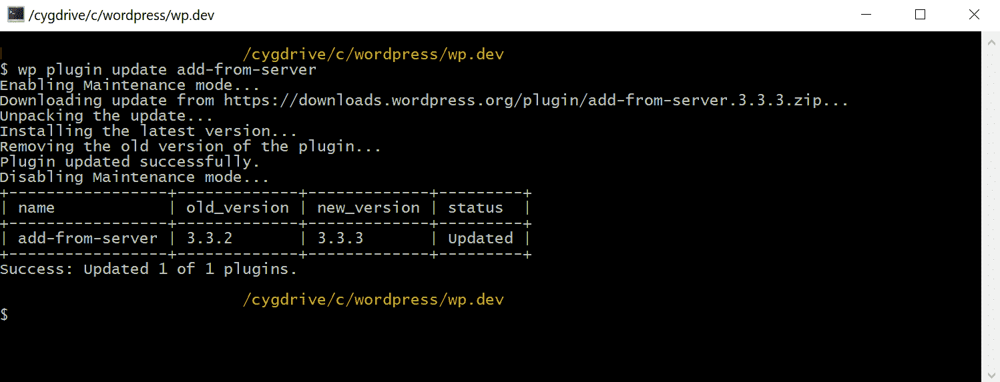

# WP-CLI v2–从终端管理 WordPress

> 原文:[https://kinsta.com/blog/wp-cli/](https://kinsta.com/blog/wp-cli/)

在 WordPress 的大部分时间里，它都是使用简单的代码库构建的，其中少量面向对象的 PHP 是最抽象的系统。然而，在过去的几年里，这种情况正在好转。从单元测试到 CSS 预处理和命令行工具，越来越多开发人员友好的资产正在涌现。在本文中，我们将看看我的最爱之一: [WP-CLI](https://wp-cli.org/) 。

<link rel="stylesheet" href="https://kinsta.com/wp-content/themes/kinsta/dist/patterns/featured-snippet.css?ver=264ec3d754b6bff57ae9">

## 什么是 WP-CLI？

WP-CLI 是一个**命令行工具**,供开发者管理 WordPress 安装的常见任务(也不常见)。它可以添加/删除用户，文章，类别，插入测试数据，在数据库中搜索和替换，重置密码，帮助解决性能问题，等等！

Support

WP-CLI 十多年来一直是一个开源项目，自 2003 年以来主要由 Daniel Bachhuber 维护。WP-CLI 的主要目标是帮助**加速 WordPress 开发者的工作流程**。

这些年来，这个项目已经变得越来越多了！它现在甚至成为了其他开源项目的需求，比如 [Trellis 和 belt](https://kinsta.com/blog/bedrock-trellis/)。截至 2017 年 1 月，WP-CLI 正式迁至 WordPress.org，目前由 Alain Schlesser 在[共同维护](https://make.wordpress.org/cli/2017/04/03/new-co-maintainer-alain-thanks-2017-sponsors/)。

[WP-CLI v2](https://make.wordpress.org/cli/2018/08/08/wp-cli-v2-0-0-release-notes/) 于 2018 年 8 月 8 日发布，因此我们也将探索一些变化和新功能。如果你是 Kinsta 客户端， **WP-CLI v2.0.1 默认安装在我们所有的服务器上**，只需 [SSH 进入你的服务器即可开始](https://kinsta.com/blog/how-to-use-ssh/)。SSH 访问包含在我们所有的托管计划中(不能通过 SSH 连接？修复 [SSH“连接被拒绝”错误](https://kinsta.com/knowledgebase/ssh-connection-refused/)。

*   [获取 WP-CLI](#getting-wp-cli)
*   [WP-CLI 的基础知识](#wp-cli-basics)
*   [通用 WP-CLI 命令](#wp-cli-commands)
*   [有用的例子](#useful-examples)
*   [远程使用 WP-CLI](#wp-cli-remotely)
*   [使用 Bash 脚本](#using-bash-scripts)

## 获取 WP-CLI

WP-CLI v2.0.0 的最低 PHP 要求已经提升到 PHP 5.4。虽然这是一个很好的进步，但我们建议您至少运行一个受[支持的 PHP](https://kinsta.com/blog/php-versions/) 版本，即 5.6 或更高版本。出于安全和性能原因，PHP 7.2 是所有 Kinsta 安装的默认版本。我们也有 PHP 7.3 和 7.4 可用。

要开始，你需要安装 WP-CLI-一个非常简单的过程。Linux 和 OSX 的步骤如下，依次发出这三个[命令](https://kinsta.com/blog/linux-commands/):

<link rel="stylesheet" href="https://kinsta.com/wp-content/themes/kinsta/dist/components/ctas/cta-mini.css?ver=2e932b8aba3918bfb818">


> Kinsta 把我宠坏了，所以我现在要求每个供应商都提供这样的服务。我们还试图通过我们的 SaaS 工具支持达到这一水平。
> 
> <footer class="wp-block-kinsta-client-quote__footer">
> 
> 
> 
> <cite class="wp-block-kinsta-client-quote__cite">Suganthan Mohanadasan from @Suganthanmn</cite></footer>

[View plans](https://kinsta.com/plans/)

```
curl -O https://raw.githubusercontent.com/wp-cli/builds/gh-pages/phar/wp-cli.phar
chmod +x wp-cli.phar
sudo mv wp-cli.phar /usr/local/bin/wp 
```

如果出现问题或你在 Windows 上，请参考[基本说明](http://wp-cli.org/)或[替代安装方法](https://make.wordpress.org/cli/handbook/installing/#installing-on-windows)。

一旦完成，您应该能够发出`wp --info`命令并获得有意义的响应。

如果您想在服务器上安装 WP-CLI，过程是相同的。请记住，对于 Kinsta 客户端，WP-CLI 已经安装。不确定您当前运行的是哪个版本？您可以随时发出`wp cli version`命令来找出答案。

## WP-CLI 的基础知识

从命令行访问 [WordPress 本身就很强大](https://kinsta.com/blog/ssh-commands/),但是在使用 bash 脚本时可以给你更多的控制和速度增益。

Bash 脚本允许您用一个命令运行一系列命令。您可以键入`bash install-and-setup.sh`并得到以下结果:

*   下载 WordPress
*   创建并填充 [`wp-config.php`](https://kinsta.com/blog/wp-config-php/)
*   创建数据库
*   安装 WordPress
*   安装并激活任何你需要的插件
*   安装并激活主题
*   下载并添加测试内容

这些是我为一个项目创建一个新的测试环境的步骤。通常这至少要花我 5-10 分钟，尤其是如果有一些插件的话。发出一个命令显然要快很多。

## WP-CLI 命令概述

如果你习惯在终端工作，WP-CLI 对你来说没什么特别的。命令总是以`wp`开头，后面是命令和子命令，后面是必需的和可选的参数，如下所示:

```
wp command subcommand requiredparam --optionalparam --optionalparam2=value
```

让我们[安装一个主题](https://kinsta.com/blog/how-to-install-a-wordpress-theme/),看看它如何与一个真实的命令一起工作:

```
wp theme install twentyseventeen --activate
```

这将在你的 WordPress 安装上安装并激活[Twenty thingtheme](https://kinsta.com/blog/twenty-seventeen-theme/)。

请注意，WP-CLI 将与您当前在终端中安装的 WordPress 一起工作。如果你切换目录到另一个 WordPress 安装，它将与那个一起工作。

## 有用的例子

简而言之，这就是 WP-CLI！虽然您可以做一些高级的事情，我们一会儿就会讲到，但是您已经知道了足够的知识，可以开始做您需要做的事情。我建议看一下[命令列表](http://wp-cli.org/commands/)，尝试其中的一些。我们将在这里看一些有用的东西，然后继续在 SSH 上使用 WP-CLI 和使用 bash 脚本。

### 安装 WordPress

我经常使用 WP-CLI 来建立测试环境，第一步是常规安装。以下是我运行的命令列表:

```
wp core download
wp core config --dbname=mydbname --dbuser=mydbuser --dbpass=mydbpass --dbhost=localhost --dbprefix=whebfubwef_ --extra-php <<PHP
define( 'WP_DEBUG', true );
define( 'WP_DEBUG_LOG', true );
PHP
wp db create
wp core install --url=http://siteurl.com --title=SiteTitle --admin_user=username --admin_password=mypassword [[email protected]](/cdn-cgi/l/email-protection) 
```

注意这有多酷！使用第一个命令下载 WordPress 的最新版本。第二个命令设置配置文件，最后是数据库访问和一些额外的 PHP。额外的常量确保我们有测试的调试选项。如果你想[了解更多关于调试 WordPress](https://kinsta.com/blog/wordpress-debug/) 的信息，我们这里有详细的指南。

第三个命令创建[数据库](https://kinsta.com/knowledgebase/wordpress-database/) (WP-CLI 使用配置文件中的数据库访问信息)，最后，我们使用几个参数安装 WordPress。

### 重新安装 WordPress 核心

你也可以使用 WP-CLI[重新安装 WordPress](https://kinsta.com/blog/reinstall-wordpress/) 核心。下面的命令将下载没有默认主题和插件的 WordPress 核心。

```
wp core download --skip-content --force
```

### 更改 WordPress URL

你可能需要或者想要[改变你的 WordPress URL](https://kinsta.com/knowledgebase/wordpress-change-url/) 有很多原因。也许你正在改变域名，移动到一个[子域](https://kinsta.com/blog/wordpress-subdomain/)，从 www 更新到非 www，到处移动文件，甚至从 HTTP 迁移到 HTTPS。无论是哪种情况，你都可以很容易地使用`wp option update`命令。下面是一个例子:

```
wp option update home 'http://example.com'
wp option update siteurl 'http://example.com'
```

### 包含详细信息的当前插件列表

要获得一个站点上当前安装的插件列表，只需使用下面的命令。在这个例子中，你可以看到我们已经安装了 Schema 和 Yoast SEO 插件。如果有可用的更新，它还将返回状态(活动/停用)和当前版本。

```
wp plugin list
```


WP-CLI plugin list


### 安装多个插件

要安装多个插件，你可以简单地添加参数。下面是一个下载并激活 3 个插件的例子:

```
wp plugin install advanced-custom-fields jetpack ninja-forms --activate
```

注意，**插件的名字来自于它们在库**中的名字。解决这个问题最简单的方法是访问他们的页面，查看 URL，或者使用`wp plugin search searchterm`，它会在终端中给你一个列表。


WordPress plugin repository URL


如果需要，你也可以用`--version`属性[安装旧版本的 WordPress 插件](https://kinsta.com/knowledgebase/download-older-versions-of-wordpress-plugins/)。

```
wp plugin install wordpress-seo --version=4.8 --activate
```

更酷的是，你可以从远程文件安装插件，而不仅仅是存储库，如果你正在开发一个插件，或者使用一个高级插件，这是很方便的。以下命令从存储库中安装两个插件，从亚马逊 S3 服务器安装一个插件。

```
wp plugin install advanced-custom-fields jetpack https://d1qas1txbec8n.cloudfront.net/wp-content/uploads/2015/06/23073607/myplugin.zip --activate
```

### 停用多个插件

要停用单个插件，您可以运行以下命令。

```
wp plugin deactivate wordpress-seo
```

要立即停用所有插件，请运行以下命令。

```
wp plugin deactivate --all
```


WP-CLI deactivate all plugins


如果您正在解决兼容性问题，并且只需一次性停用所有插件，上面的命令会很方便。然后，您可以返回并逐个启用它们，边走边测试。

### 更新插件

你也可以手动更新 WordPress 插件。下面的例子:

```
wp plugin update wordpress-seo
```



WP-CLI manually update WordPress plugin


### 数据库搜索和替换

仅仅通过复制粘贴数据库很难迁移站点的一个主要原因是数据库包含序列化的数组。如果你需要用`http://livewebsite.com`替换`http://testsite.com`的所有实例，你的序列化数组将没有意义，因为字符串计数不会匹配。

 ## 注册订阅时事通讯


### 想知道我们是怎么让流量增长超过 1000%的吗？

加入 20，000 多名获得我们每周时事通讯和内部消息的人的行列吧！

[Subscribe Now](#newsletter)

`search-replace`命令首先取消数组的序列化，然后执行[搜索并替换](https://kinsta.com/knowledgebase/wordpress-search-and-replace/)，然后重新序列化数组。您可以通过一个简单的命令来完成这项工作:

`wp search-replace oldstring newstring`

额外的参数允许你做更多的事情，包括使用`--dry-run`预览什么将被替换。

### 进出口

使用 WP-CLI 导出内容有两种方式。你可以创建一个 XML 文件，就像 [WordPress 导出工具](https://kinsta.com/knowledgebase/export-wordpress-site/#built-in-tool)一样，或者你可以导出/导入原始数据库。我发现后者在我的日常工作中更有用，它在同步网站时很方便。

`wp db export`是创建 SQL 文件所需要做的全部工作，而`wp db import file.sql`是导入它所需要做的全部工作。工作起来像一个魔咒，只是要小心不要覆盖任何你需要的东西，导入将基本上转储现有的数据库，并使用提供的 SQL 文件代替。

### 管理角色和权能

WP-CLI 可以使用`wp role`命令非常容易地为您管理角色。如果你想测试你的插件如何与自定义角色一起工作，但是你并没有在你的插件中创建角色，这是非常酷的。

```
wp role create organizer Organizer
wp cap list 'editor' | xargs wp cap add 'organizer'
wp cap add 'organizer' 'manage-events'
```

上面的命令将创建一个新角色(组织者)，将编辑角色的所有功能添加到其中，然后添加一个新功能:manage-events。使用正确的命令，你可以使用 WP-CLI 来[更改你的 WordPress 密码](https://kinsta.com/blog/change-wordpress-password/)。

### 生成测试数据

我喜欢各种类似 faker 的功能——在你的网站上添加虚拟内容，你可以用来测试。WP-CLI 内置了一些这样的函数，这里有一些函数可以生成用户、术语和帖子。

```
wp user generate --count=5 --role=editor
wp user generate --count=10 --role=author
wp term generate --count=12
wp post generate --count=50
```

### 管理 WP-Cron 事件

你可以在 WP-CLI 中管理 WP-Cron 事件和/或 WordPress Cron 作业。例如，下面的命令将提供您当前的 cron 事件列表。

```
wp cron event list
```


wp-cron event list


### 删除瞬变

您甚至可以使用以下命令删除和清除一个或所有瞬变。

Struggling with downtime and WordPress problems? Kinsta is the hosting solution designed to save you time! [Check out our features](https://kinsta.com/features/)

```
wp transient delete --all
```

如果你正在运行[多站点](https://kinsta.com/blog/wordpress-multisite/)，你将需要一个稍微复杂一点的命令。默认情况下，该命令只检查`wp_options`表。它不检查`wp_1_options`、`wp_2_options`等。

```
wp transient delete --all --network && wp site list --field=url | xargs -n1 -I % wp --url=% transient delete --all
```

### 清理 wp_options 表

由于第三方插件和主题留下的自动加载数据， [wp_options 表](https://kinsta.com/knowledgebase/wp-options-autoloaded-data/)可能是你网站上查询时间缓慢的常见原因。看看这篇来自 WP Bullet 的关于[如何使用 WP-CLI 清理你的 wp_options 表](https://guides.wp-bullet.com/using-wp-cli-doctor-command-to-fix-large-wp_options-autoload-data/)的好文章。

### 删除 WordPress 版本

在大型网站上， [WordPress 修订版](https://kinsta.com/blog/wordpress-revisions/)会很快在你的数据库中增加成千上万的不需要的行。您可以使用 WP-CLI 删除帖子修订。以下是该命令的示例:

```
$ wp post delete $(wp post list --post_type='revision' --format=ids)
```


WP-CLI delete WordPress revisions


### 控制维护模式

从 WP-CLI v2.2.0 开始，你现在可以在你的 WordPress 站点上控制[维护模式](https://kinsta.com/blog/wordpress-maintenance-mode/)。示例:

```
wp maintenance-mode activate
wp maintenance-mode deactivate
wp maintenance-mode status
```

### 使用弹性搜索索引数据

[Elasticsearch](https://kinsta.com/blog/wordpress-search/) 是一个开源的全文搜索引擎。它用于索引数据并以令人难以置信的速度搜索数据。我们为 Kinsta 客户提供这一附加服务。您可以使用 [ElasticPress WP-CLI 命令](https://github.com/10up/ElasticPress#wp-cli-commands)通过 SSH 执行索引。示例:

`wp elasticpress index [--setup] [--network-wide] [--posts-per-page] [--nobulk] [--offset] [--show-bulk-errors] [--post-type]`

### 使用多语言网站

WP-CLI v2.0.0 包括一个新的命令家族`wp i18n`，供那些使用[多语言](https://kinsta.com/blog/wordpress-multilingual/)网站的人使用。例如，你可以为 WordPress 插件或主题创建一个 POT 文件。

```
wp i18n make-pot <source> [<destination>] [--slug=<slug>] [--domain=<domain>] [--ignore-domain] [--merge[=<file>]] [--exclude=<paths>] [--skip-js]
```

参见[i18n-命令文档](https://github.com/wp-cli/i18n-command)。

### 在 WooCommerce 中使用 WP-CLI

与电子商务网站合作？🛒我们推荐查看机器人忍者的惊人的 [WP-CLI WooCommerce 开发指南](https://robotninja.com/blog/wp-cli-woocommerce-development/)来获得你可以使用的快速简单的命令。使用 WP-CLI 可以生成客户列表、订单，甚至创建批量产品。

## 远程使用 WP-CLI

你可以用 WP-CLI 做的最好的事情之一就是管理你的远程 WordPress 安装。这真的是一个网站经理的梦想成真。

要通过 SSH 在远程服务器上无缝运行 WP-CLI 命令，您之前需要 wp-cli-ssh addon 命令。但是从 [v0.24.0](http://wp-cli.org/blog/version-0.24.0.html) 开始，这已经是 WP-CLI 本身的一部分了！👏

**重要提示:**您需要在运行命令的计算机和服务器上都安装 WP-CLI。

### 配置远程服务器

您可以全局或本地配置您的服务器。要对它们进行全局配置，请使用`config.yml`文件。您也可以使用当前工作目录中的`wp-cli.yml`或`wp-cli.local.yml`文件。

服务器的配置是这样的，将它粘贴到上面提到的一个文件中:

```
ssh:

  staging:
    cmd: ssh %pseudotty% [[email protected]](/cdn-cgi/l/email-protection) %cmd%
    url: http://myseite.com
    path: /www/path/to/site/root
```

一旦所有这些都完成了，你可以输入下面的命令来更新你的远程站点上的 WordPress:

```
wp ssh core update --host=staging
```

如果你拥有或管理很多网站，我想你可以看到这是惊人的！该脚本将要求输入密码，但是如果您使用 RSA 密钥登录，您也可以不输入密码。看看这篇文章来设置一下。

## 使用 Bash 脚本

Bash 脚本通过自动化任务为您节省了更多时间。还记得我们需要输入大量命令来安装 WordPress 吗？您可以用一个 bash 脚本来完成。在一个目录中创建一个`install.sh`文件。将之前的代码粘贴到里面并保存。

```
wp core download
wp core config --dbname=mydbname --dbuser=mydbuser --dbpass=mydbpass --dbhost=localhost --dbprefix=whebfubwef_ --extra-php <<PHP
define( 'WP_DEBUG', true );
define( 'WP_DEBUG_LOG', true );
PHP
wp db create
wp core install --url=http://siteurl.com --title=SiteTitle --admin_user=username --admin_password=mypassword [[email protected]](/cdn-cgi/l/email-protection)
```

你现在需要做的就是输入`bash install.sh`，一切都会为你完成，无需用户干预。如果您管理许多站点，您可以设置所有的环境并创建一个 bash 脚本，如下所示:

```
wp ssh core update --host=clientA
wp ssh core update --host=clientB
wp ssh core update --host=clientC
wp ssh core update --host=clientD
```

当一个新的 WordPress 版本出来时，这可以节省你很多时间！因为你可以用 WP-CLI 做任何你想做的事情，你甚至可以一次在多个客户端站点上定期更新主题和插件。

## 摘要

WP-CLI 真的是开发者和网站管理员的梦想成真。作为开发人员，我们可以在瞬间创建测试站点，添加测试内容，做各种各样的[导入/导出](https://kinsta.com/knowledgebase/wordpress-export-users/)魔术。站点管理员可以用一个命令处理多个站点的站点更新和其他任务。请务必查看 [WP-CLI v2 发行说明](https://make.wordpress.org/cli/2018/08/08/wp-cli-v2-0-0-release-notes/)！

如果您还没有尝试过 WP-CLI，我强烈建议您尝试一下。还有一堆像 WP-CLI-SSH 这样的[社区命令](https://make.wordpress.org/cli/handbook/tools/)，它们增加了更多的功能！如果你遇到问题，一定要查看 [WP-CLI 常见问题文档](https://make.wordpress.org/cli/handbook/common-issues/)。

别忘了，Kinsta 基于谷歌云的架构支持 WP-CLI 开箱即用。如果你想尝试最现代的 WordPress 托管架构，并能使用 WP-CLI 等优秀工具，试试我们的托管 WordPress 托管。

* * *

让你所有的[应用程序](https://kinsta.com/application-hosting/)、[数据库](https://kinsta.com/database-hosting/)和 [WordPress 网站](https://kinsta.com/wordpress-hosting/)在线并在一个屋檐下。我们功能丰富的高性能云平台包括:

*   在 MyKinsta 仪表盘中轻松设置和管理
*   24/7 专家支持
*   最好的谷歌云平台硬件和网络，由 Kubernetes 提供最大的可扩展性
*   面向速度和安全性的企业级 Cloudflare 集成
*   全球受众覆盖全球多达 35 个数据中心和 275 多个 pop

在第一个月使用托管的[应用程序或托管](https://kinsta.com/application-hosting/)的[数据库，您可以享受 20 美元的优惠，亲自测试一下。探索我们的](https://kinsta.com/database-hosting/)[计划](https://kinsta.com/plans/)或[与销售人员交谈](https://kinsta.com/contact-us/)以找到最适合您的方式。