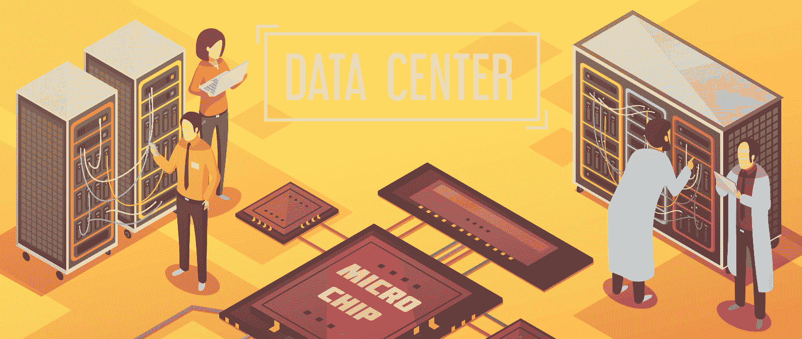

# 绿化网络:我们如何创建零碳网站

> 原文:[https://kinsta.com/blog/zero-carbon-websites/](https://kinsta.com/blog/zero-carbon-websites/)

每当我谈到绿化互联网和减少网站碳排放的话题时，人们常常茫然地看着我，然后问:“网站甚至产生碳排放吗？”

我们倾向于认为互联网是干净的、非物质的。有一股强大的推动力推动着在线服务，不仅是为了提高效率和用户体验，也是为了减少资源消耗和环境影响。然而，越来越多的证据表明**互联网对环境有着非常真实的影响**，即使我们看不到它。

[The internet has a very real environmental impact, even if we can’t see it. 🌎Click to Tweet](https://twitter.com/intent/tweet?url=https%3A%2F%2Fkinsta.com%2Fblog%2Fzero-carbon-websites%2F&via=kinsta&text=The+internet+has+a+very+real+environmental+impact%2C+even+if+we+can%E2%80%99t+see+it.+%F0%9F%8C%8E&hashtags=ecofriendly%2Ccleantech)

互联网的能源消耗和排放是巨大的。电力是互联网的命脉，被用来为数据中心、电信网络和我们用来上网的设备供电。总的来说，全球互联网的用电量比整个英国的用电量还要多(准确地说是每年 416.2 太瓦时)。

这转化为大量的碳排放。事实上，全球碳排放量的 2%来自互联网使用的电力。比如大公司使用的数据中心。这相当于全球航空业的碳排放量，大多数人认为航空业是污染最严重的行业之一。客观地说，如果互联网是一个国家，它将是世界上第六大污染国，相当于德国。

Data Centers produce a lot of carbon emissions

与许多追求效率和降低排放的其他行业不同，来自互联网的排放将在未来几年迅速增加。全球接入互联网的人数正在增加，随着数据变得更快更便宜，我们都在消费更多。YouTube、网飞和 Spotify 等流媒体服务是大量数据用户，并且增长迅速，但即使是普通网站也变得越来越数据密集型。

根据 HTTPArchive.org 的数据，今天 T2 的平均网页是 2010 年的四倍，并且还在继续增长。

Average web page growth (Source: HTTP Archive)

因此，据估计，在未来 10 年内，当我们迫切需要减少所有行业的排放时，互联网可能会增长到占全球碳排放量的 3.5%。

<link rel="stylesheet" href="https://kinsta.com/wp-content/themes/kinsta/dist/components/ctas/cta-mini.css?ver=2e932b8aba3918bfb818">

> Kinsta 把我宠坏了，所以我现在要求每个供应商都提供这样的服务。我们还试图通过我们的 SaaS 工具支持达到这一水平。
> 
> <footer class="wp-block-kinsta-client-quote__footer">
> 
> 
> 
> <cite class="wp-block-kinsta-client-quote__cite">Suganthan Mohanadasan from @Suganthanmn</cite></footer>

[View plans](https://kinsta.com/plans/)

托马斯·斯托克(Thomas Stocker)强调了这种紧迫性，他是世界领先的气候科学家之一，也是国际气候变化专门委员会(IPCC)的前联合主席。他指出:

> 2020 年至关重要。如果二氧化碳排放量超过这一日期继续上升，最雄心勃勃的减排目标将变得无法实现。(来源: [M2020](http://www.mission2020.global/about/) )

这给了我们两年的时间将我们的工业从温室气体排放增长最快的来源之一转变过来，并开始降低我们的集体排放量。作为网站设计者、开发者或网站所有者，我们必须看看我们能做些什么来减少我们自己网站的排放。

首先，我们必须理解三个简单的原则:

1.  我们无法管理无法衡量的事物。
2.  数据传输消耗电力，因此减少数据传输将减少能源和排放。
3.  可再生能源比其他能源产生的排放少得多。

 <kinsta-advanced-cta language="en_US" type-int-post="24306" type-int-position="0">## 测量网站的碳排放量

很难改进任何你无法测量的东西，直到最近，几乎不可能知道某个特定网站的排放量是多少。结果是，网页设计者、开发者和网站所有者甚至很难讨论他们网站的碳排放问题，更不用说做些什么了。

幸运的是，现在可以使用估算网站二氧化碳排放量的免费工具在[WebsiteCarbon.com](https://www.websitecarbon.com/)实现这一点，该工具提供了关于每次页面浏览的二氧化碳排放量、年度二氧化碳排放量(基于指定的页面浏览量)、年度能源消耗以及网站是否位于由可再生能源驱动的数据中心的数据。使用这个工具，你可以将自己的网站与竞争对手进行对比，并设定自己的碳减排目标。

Measuring website carbon emissions

来自这个工具的数据揭示了一些令人惊讶的事实。平均每个网页浏览量产生 6.8 克二氧化碳。这听起来可能不是很多，但它增加得很快。一个平均每月有 10，000 次页面浏览的网站每年会产生 816 千克二氧化碳。这比从伦敦飞往东京所产生的排放量还要多。

另一方面，测试中效率最高的网站是 www.muskfoundation.org、埃隆和金巴尔·马斯克的非营利基金会，每个页面浏览量仅排放 0.009 克二氧化碳。这可能是一个残酷的极简主义网站，它肯定不符合大多数现代网络用户的用户体验期望，但它确实凸显了网页可以有多高效。
T3】

## 减少来自网站的数据传输

在对我们现有网站和竞争对手网站的排放量进行基准测试后，我们可以采取措施降低排放量。由于数据传输与能源消耗和排放直接相关，我们必须做的一件关键事情是**找到让网站更高效地传输数据的方法**。有两种主要方法可以实现这一点。

 ## 注册订阅时事通讯

### 想知道我们是怎么让流量增长超过 1000%的吗？

加入 20，000 多名获得我们每周时事通讯和内部消息的人的行列吧！

[Subscribe Now](#newsletter)

首先，我们可以降低所有网页的权重(以 KB 为单位)。降低页面权重有许多额外的好处，包括更快的加载时间，这改善了用户体验和 SEO，以及减少了互联网连接有限的用户的数据使用。这对于低收入群体的移动用户和网站访问者尤其重要，尤其是在互联网数据相对于当地工资非常昂贵的发展中国家。

我们可以做一些简单的事情来减轻页面重量:

1.  我们可以干净高效地编写代码。
2.  我们可以使用矢量图形和 CSS 效果，用比 JPEGs 和 gif 等传统图像小得多的文件来创建视觉上引人入胜的体验。
3.  我们可以按比例上传图像，而不是依赖 CSS 来调整它们的大小。如果你使用的是 WordPress，这并不重要，因为它支持[响应图像](https://kinsta.com/blog/responsive-web-design/)。
4.  我们可以将大型媒体卸载给绿色环保的第三方提供商。
5.  我们可以压缩文件、图像和视频来减小文件大小，而不会明显降低质量。看看这些关于[图像优化](https://kinsta.com/blog/optimize-images-for-web/)和[有损压缩](https://kinsta.com/blog/lossy-compression/)的帖子。一点点有损压缩就可以轻松地**将一个网页缩小 90%以上！**😲压缩前后
6.  我们可以避免在视频上自动播放，如果用户感兴趣，就要求用户选择播放视频。
7.  我们可以最小化自定义字体，这实际上会增加整个页面大小的很大一部分。考虑[网页安全字体](https://kinsta.com/blog/web-safe-fonts/)是另一个很好的选择。
8.  我们可以决定不再支持 IE8 之类的旧浏览器，而只使用现代的网络字体，比如 WOFF 和 WOFF2，它们利用了更高的压缩方法。查看这篇关于使用本地字体的精简版本的教程。
9.  我们可以减少跟踪和广告脚本，它们消耗数据，却很少给用户增加任何价值。在您的网站上查看如何[分析第三方绩效](https://kinsta.com/blog/third-party-performance/)。
10.  我们可以利用移动解决方案，如 [AMP](https://kinsta.com/blog/google-amp/) 来立即删除网页的当前版本。

在一个网站的整个生命周期中，最好的规则可能是，“**如果有疑问，就不要管它**”

通常，如果我们不确定一个网站是否需要某些东西，为了安全起见，很容易把它添加进去，但实际上我们应该从相反的角度来看待它。我们应该忽略任何我们不确定的东西，然后看看是否有人忽略了它。只有当它被证明是必要的和有价值的时候，才把它添加到网站上。

实现一个[缓存解决方案](https://kinsta.com/blog/wordpress-caching-plugins/)也非常重要。缓存是存储来自一个请求的资源并为后续请求重用这些资源的过程。基本上，它通过存储主机外部的静态资源，减少了生成页面视图所需的服务器带宽。

以[应用](https://kinsta.com/application-hosting/)、[数据库](https://kinsta.com/database-hosting/)和[托管的 WordPress 主机](https://kinsta.com/wordpress-hosting/) Kinsta 为例。它们有[四种不同类型的缓存](https://kinsta.com/blog/wordpress-cache/)，都是在软件或服务器级别自动完成的:

*   字节码缓存
*   对象缓存
*   页面缓存
*   CDN 缓存

这保证了网站的加载速度尽可能快，而且由于内容是直接从缓存中提供的，服务器所需的工作也最少，因此提高了效率。

我们可以减少数据传输的第二件事是**减少页面加载的次数**。减少流量听起来像异端邪说，但实际上，有很好的理由这样做，对网站所有者和用户都有好处。虽然我们假设流量本来就是好的，但是还是存在人们访问对自己没用的页面的场景。这一点在[跳出率](https://kinsta.com/blog/how-to-reduce-bounce-rate/)统计中得到了强调，统计数据显示有多少访问者立即意识到他们加载的页面不是他们想要的。改善 SEO 和用户体验可以显著降低跳出率，同时还可以简化用户旅程，使用户能够以更少的步骤找到他们想要的信息，这意味着一个网站可以用更少的页面浏览量提供相同水平的价值。

Struggling with downtime and WordPress problems? Kinsta is the hosting solution designed to save you time! [Check out our features](https://kinsta.com/features/)

Bounce rate in Google Analytics

由于网站的数据传输简单来说就是平均页面权重乘以页面浏览量，因此减少页面权重和不需要的页面浏览量是减少网站排放量的两种非常有效的方法，同时还能改善整体用户体验。
<kinsta-advanced-cta language="en_US" type-int-post="24306" type-int-position="2"></kinsta-advanced-cta>

## 将你的网站转向可再生能源

根据 ACEEE 的一项研究，互联网(以及一个网站)使用的能源大致分为 48%用于数据中心，14%用于电信网络，38%用于终端用户设备。这当然会因每个网站和每个用户而异，但它代表了一个典型的场景。

作为网站所有者，很难或不可能控制电信网络或终端用户使用的能源。然而，您可以通过选择合适的托管提供商来控制数据中心的能源使用。大多数主机提供商使用标准的电网电力，通常对他们的能源来源知之甚少。越来越多的托管服务提供商积极为其数据中心购买可再生能源，因此碳排放量大大降低。

很难确定哪些主机提供商使用绿色能源，一般来说，最好直接询问他们是否在其数据中心使用可再生能源。绿色网络基金会有一个非常好的声称使用绿色能源的主机提供商的数据库，尽管应该指出的是它仍然值得直接检查。

众所周知，谷歌近年来引领行业绿色能源供应，并在 2017 年实现了全球 100%可再生能源的目标。这里有一些简单的事实:

*   平均而言，谷歌数据中心的能耗比普通数据中心低 50%。
*   由于他们的可再生能源和碳抵消计划，谷歌在 2016 年的净运营碳排放量为零。
*   与五年前相比，谷歌现在在相同电量的情况下提供了 3.5 倍以上的计算能力。

他们通过从遍布美国、南美和欧洲的风力和太阳能农场购买可再生能源来实现这一目标。谷歌的机器学习还能够分析海量的运营数据中心数据，以进一步改善建议和控制，将能效再提高 15%。

Renewable energy purchased (Source: [Google Cloud](https://cloud.google.com/environment/))

谷歌还使用热模型，并找到廉价和创造性的方法来管理气流。这使得他们能够将数据中心的温度提高到 80 华氏度(27 摄氏度)，从而显著降低了设施的能耗。

谷歌对可再生能源的承诺不仅对他们的用户来说是伟大的，对利用谷歌云平台的网络服务来说也是伟大的，谷歌云平台包括在 Kinsta 上托管的所有网站。

与减少数据传输不同，切换到[绿色主机](https://kinsta.com/green-hosting/)不需要对网站本身进行任何更改，可以快速轻松地完成，使我们能够以最少的麻烦大幅减少网站排放。转向绿色网站主机是减少网站排放的最简单的方法。

## 降低排放的 3 个简单步骤

我们现在可以看到，我们可以采取切实可行的措施来减少我们运营的网站的温室气体排放。

1.  基准我们的网站碳排放。
2.  通过减少页面权重和不必要的页面浏览量来减少数据传输。
3.  切换到由可再生能源供电的网络主机。

如果我们都遵循这些步骤，我们就可以改变我们的行业，创造一个真正清洁的网络，将排放量降低到符合巴黎气候协议设定的目标。最重要的是，通过这样做，我们可以为我们的用户提供更好的用户体验，从而帮助我们在网上产生更大的影响，并获得更好的投资回报。对于网站所有者、网络用户和环境来说，低碳网络是真正的三赢。

有什么想法吗？很想听听下面的故事。

* * *

让你所有的[应用程序](https://kinsta.com/application-hosting/)、[数据库](https://kinsta.com/database-hosting/)和 [WordPress 网站](https://kinsta.com/wordpress-hosting/)在线并在一个屋檐下。我们功能丰富的高性能云平台包括:

*   在 MyKinsta 仪表盘中轻松设置和管理
*   24/7 专家支持
*   最好的谷歌云平台硬件和网络，由 Kubernetes 提供最大的可扩展性
*   面向速度和安全性的企业级 Cloudflare 集成
*   全球受众覆盖全球多达 35 个数据中心和 275 多个 pop

在第一个月使用托管的[应用程序或托管](https://kinsta.com/application-hosting/)的[数据库，您可以享受 20 美元的优惠，亲自测试一下。探索我们的](https://kinsta.com/database-hosting/)[计划](https://kinsta.com/plans/)或[与销售人员交谈](https://kinsta.com/contact-us/)以找到最适合您的方式。</kinsta-advanced-cta>