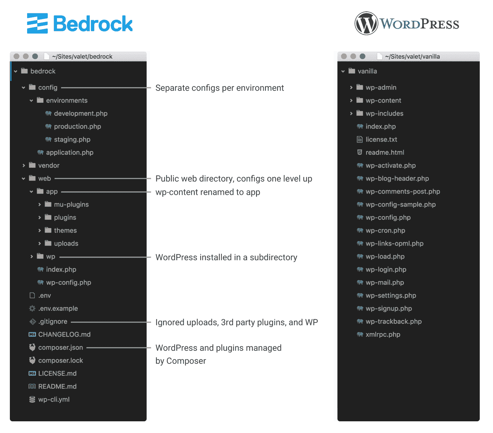
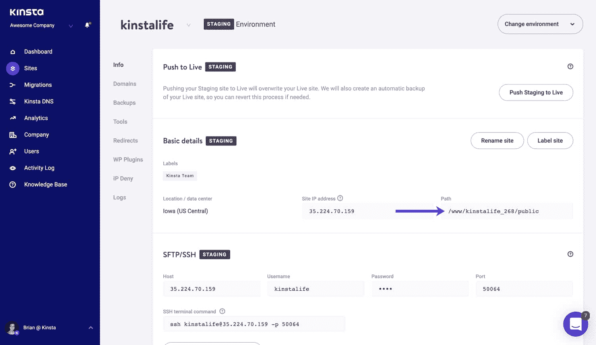
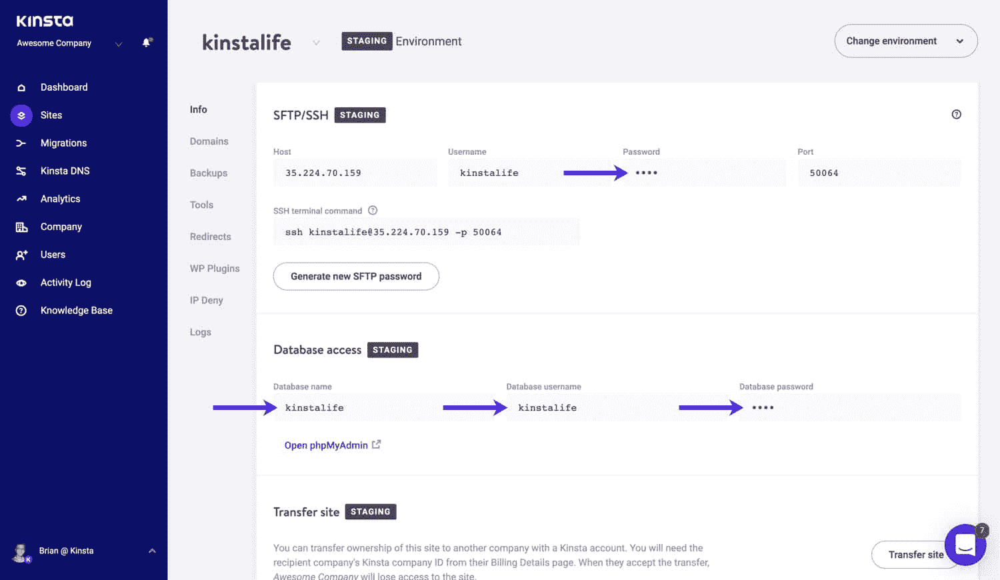
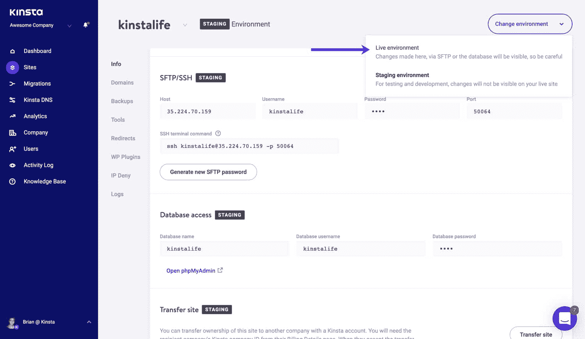

# 如何在 Kinsta 使用基岩和 Trellis(WordPress 开发)

> 原文:[https://kinsta.com/blog/bedrock-trellis/](https://kinsta.com/blog/bedrock-trellis/)

这是给所有 WordPress 开发者的帖子！

今天我们将解释如何在 Kinsta 使用和整合[基岩](https://roots.io/bedrock/)和[棚架](https://roots.io/trellis/)。

如果您以前没有听说过这两个工具，我们也将介绍它们，并希望有助于解释为什么您希望在传统设置中使用它们。

 ## 基岩和格子架

belt 和 Trellis 的存在是为了**让开发、维护和部署** WordPress 站点变得更容易。

*   基岩提供了一种管理你的 WordPress 安装的替代方法，它有一个改进的文件夹结构，现代的开发工具和改进的安全性。
*   Trellis 与基岩一起工作，创建带有一个命令部署的开发环境。

使用基岩的主要原因是为 WordPress 项目获得适当的依赖和包管理。你可能已经熟悉 JavaScript 的 [npm](https://www.npmjs.com/) 或者 Ruby 的 [Bundler](http://bundler.io/) 。PHP 也不例外，它的对等物是[作曲家](https://getcomposer.org/)。

虽然使用包管理器很常见，但对 WordPress 本身来说却不太常见，因为 WordPress 已经有了自己的插件概念。基岩集成了 Composer 来管理插件，主题，甚至 WordPress 核心本身作为依赖项。


Trellis 是一个工具，可以轻松地创建开发和生产服务器来托管 WordPress 站点。它也是专门为基于基岩的网站而创建的。Trellis 的默认用例是使用它与生产中的[流浪者](https://www.vagrantup.com/) *和*一起开发，并在这两个环境之间实现对等。

这篇文章解释了一个稍微不同的用例:Trellis 用于开发服务器，Kinsta 用于生产(和/或登台)服务器。

为什么要在 Trellis 配置的 VPS 上使用 Kinsta？因为有时候你想付钱给别人[来管理服务器，而不是自己做](https://kinsta.com/blog/sysadmin/)(特别是当你有很多客户端的时候)。Kinsta 还使扩展变得更容易，而不必处理多个服务器、负载平衡器和云上传。

许多 WordPress 主机对开发者不太友好，不提供 SSH 访问和 Composer 或 [WP-CLI](https://kinsta.com/blog/wp-cli/) 集成，而这些是使用 Trellis 和基岩的要求。谢天谢地， **Kinsta 在他们所有的托管计划**上提供 SSH 访问，从初学者到企业，这使得所有这一切成为可能。他们还可以**修改根路径**以获得正确的功能。

[Bedrock and Trellis exist to make it easier to develop, maintain, and deploy WordPress sites. 🤓Click to Tweet](https://twitter.com/intent/tweet?url=https%3A%2F%2Fbit.ly%2F2NRsAD9&via=kinsta&text=Bedrock+and+Trellis+exist+to+make+it+easier+to+develop%2C+maintain%2C+and+deploy+WordPress+sites.+%F0%9F%A4%93&hashtags=webdev%2CWordPress)

## 基岩 vs 普通 WordPress

你可能想知道为什么在传统的 WordPress 安装上使用基岩。原因是，基岩是专为现代 web 开发人员设计的**:**

 ***   特定于环境的配置文件，存储在公共 web 根目录之外
*   在单个`.env`文件中将配置与代码分开的环境变量
*   通过限制对非 web 文件的访问以及 [bcrypt 哈希密码](https://github.com/roots/wp-password-bcrypt)增强安全性
*   名为`app`的自定义 wp 内容目录
*   管理 WordPress、插件、主题和其他 PHP 依赖项的编辑器
*   不包括 WordPress 核心、插件和上传

[Raspberry Pi](https://www.raspberrypi.org/) 、 [Snopes](https://www.snopes.com/) 、 [JetBlue](http://blog.jetblue.com/) 等等，信任基岩来驱动他们的 WordPress 网站。

让我们一起来看看这两种文件夹结构:



Bedrock vs WordPress


基岩把 WordPress 安装到一个子目录中到下一个层次。基岩背后的大部分哲学受到了包括 [WordPress 特定版本](https://roots.io/twelve-factor-wordpress/)在内的[十二因素应用](http://12factor.net/)方法的启发。

## 为 Kinsta 配置 Trellis

首先，确保您的公共 SSH 密钥被添加到 MyKinsta 仪表板中。

Trellis 只需做一些更新就可以部署到 Kinsta。由于 Kinsta 从 web 服务器的角度提供了一切，因此提供您的登台和生产环境并不适用。

one-command 部署在 Trellis 中，与 Kinsta 一起工作，只需稍加配置。一旦配置完成，你就可以通过在 Trellis 中运行部署行动手册来部署你的 WordPress 站点:

```
ansible-playbook deploy.yml -e env=staging -e site=example.com --limit=kinsta_staging
```

打开你的 [MyKinsta 仪表板](https://kinsta.com/mykinsta/)，导航到你用基岩和 Trellis 设置的 WordPress 站点，以及你的[代码编辑器](https://kinsta.com/blog/free-html-editor/)，打开你项目中的`trellis`目录。

首先编辑`trellis/ansible.cfg`,将以下内容添加到顶部的`[defaults]`:

```
forks = 3
host_key_checking = False
```

### 分段配置

确保`trellis/group_vars/staging/wordpress_sites.yml`为您的暂存站点配置了正确的`canonical`:

```
wordpress_sites:
  example.com:
    site_hosts:
      - canonical: staging-example.kinsta.com
```

然后打开`trellis/group_vars/staging/main.yml`，将以下内容添加到文件末尾:

```
project_root: /www/example_123/public
www_root: /www/example_123/public
web_user: example
web_group: www-data
```

将`project_root`和`www_root`路径替换为 MyKinsta 仪表板中为您的 [Kinsta 登台环境](https://kinsta.com/help/staging-environment/)提供的正确路径。



Find your public root in MyKinsta.


接下来，通过运行`ansible-vault edit group_vars/staging/vault.yml`打开`trellis/group_vars/staging/vault.yml`进行编辑。

 ## 注册订阅时事通讯


### 想知道我们是怎么让流量增长超过 1000%的吗？

加入 20，000 多名获得我们每周时事通讯和内部消息的人的行列吧！

[Subscribe Now](#newsletter)

我们需要将`db_user`、`db_name`和`db_password`添加到`env`中。您可以在 MyKinsta 仪表板中您站点的主信息屏幕上找到这些值。



SFTP and database credentials in MyKinsta.


```
vault_wordpress_sites:
  example.com:
    env:
      db_user: "example"
      db_name: "example"
      db_password: "xxxxxxxxxxxxxxx"
      # Generate your keys here: https://roots.io/salts.html
      auth_key: ""
      secure_auth_key: ""
      logged_in_key: ""
      nonce_key: ""
      auth_salt: ""
      secure_auth_salt: ""
      logged_in_salt: ""
      nonce_salt: ""
```

最后，打开`trellis/hosts/staging`，将内容替换为:

```
kinsta_staging ansible_host=104.154.94.123 ansible_ssh_port=12345 ansible_ssh_extra_args='-o StrictHostKeyChecking=no'

[web]
kinsta_staging

[staging]
kinsta_staging
```

确保主机和 SSH 端口与 MyKinsta 仪表板中列出的相匹配。


SFTP host and port details for your staging environment.


### 生产型

现在，让我们对生产环境重复上述相同的过程。确保在 MyKinsta 仪表板中切换到您的“实时”环境。



Switch to your live environment in MyKinsta.


打开`trellis/group_vars/production/main.yml`并将以下内容添加到文件末尾:

```
project_root: /www/example_123/public
www_root: /www/example_123/public
web_user: example
web_group: www-data
```

确保将`project_root`和`www_root`路径替换为 MyKinsta 仪表板中为您的实际环境提供的正确路径。

接下来，通过运行`ansible-vault edit group_vars/production/vault.yml`打开`trellis/group_vars/production/vault.yml`进行编辑:

Struggling with downtime and WordPress problems? Kinsta is the hosting solution designed to save you time! [Check out our features](https://kinsta.com/features/)

```
vault_wordpress_sites:
  example.com:
    env:
      db_user: "example"
      db_name: "example"
      db_password: "xxxxxxxxxxxxxxx"
      # Generate your keys here: https://roots.io/salts.html
      auth_key: ""
      secure_auth_key: ""
      logged_in_key: ""
      nonce_key: ""
      auth_salt: ""
      secure_auth_salt: ""
      logged_in_salt: ""
      nonce_salt: ""
```

最后，打开`trellis/hosts/production`，将内容替换为:

```
kinsta_production ansible_host=104.154.94.123 ansible_ssh_port=12345 ansible_ssh_extra_args='-o StrictHostKeyChecking=no'

[web]
kinsta_production

[production]
kinsta_production
```

### 修改部署任务

Trellis 部署尝试重新加载`php-fpm`，我们需要将它从在 Kinsta 的服务器上运行的尝试中移除。我们还需要在部署时触发清除 [Kinsta 的缓存](https://kinsta.com/blog/wordpress-cache/)。

打开`trellis/roles/deploy/hooks/finalize-after.yml`并滚动到底部。删除`Reload php-fpm`的最后一个任务，并添加以下内容:

```
- name: Clear Kinsta cache
  uri:
    url: "{{ site_env.wp_home }}/ask-support-rep/"
    method: GET
```

在**向 Kinsta 支持代表**询问清除网站缓存的 URL 之后，替换上面的`ask-support-rep`。

### 可选:安装编写器依赖项

如果你看到一个告诉你运行“Composer Install”的屏幕，在上面的“Clear Kinsta cache”代码之前添加以下内容:

```
- name: Install Composer dependencies
composer:
command: install
working_dir: >/www/example123/public/final-path
```

`/final-path`可能会根据您的基岩/网格设置而有所不同。

## 向基岩添加 kinsta-mu 插件

基岩网站会自动安装`mu-plugins`，但是，你需要通过引入`kinsta-mu-plugins`包来安装 [Kinsta MU 插件](https://kinsta.com/help/kinsta-mu-plugin/)。这个插件(当你通过 MyKinsta 创建 WordPress 站点时默认安装)处理诸如[整页缓存](https://kinsta.com/help/full-page-caching/)和 [Kinsta CDN](https://kinsta.com/help/kinsta-cdn/) 集成之类的事情。

打开`site/composer.json`，在`repositories`数组中添加以下内容:

```
{
  "type": "package",
  "package": {
    "name": "kinsta/kinsta-mu-plugins",
    "type": "wordpress-muplugin",
    "version": "2.3.3",
    "dist": {
      "url": "https://kinsta.com/kinsta-tools/kinsta-mu-plugins.zip",
      "type": "zip"
    }
  }
}
```

然后从您的基岩/站点目录运行以下内容(或者在您的`composer.json`文件中指定 kinsta/kinsta-mu 插件作为要求:

```
composer require kinsta/kinsta-mu-plugins:2.3.3
```

要修复 CDN 路径和共享插件资源 URL 的问题，可能需要以下常量。将以下代码添加到您站点的配置文件中(在基岩站点中为**基岩/配置/应用程序. php** ):

```
/**
 * Kinsta CDN fix for Bedrock
 */
define('KINSTA_CDN_USERDIRS', 'app');

/**
 * Fix Kinsta MU Plugins URL path with Bedrock
 */
$mu_plugins_url = Config::get('WP_CONTENT_URL') . '/mu-plugins';
define('KINSTAMU_CUSTOM_MUPLUGIN_URL', "{$mu_plugins_url}/kinsta-mu-plugins");
```

如需更多信息，包括如何更新插件，请查看我们关于 [Kinsta MU 插件](https://kinsta.com/help/kinsta-mu-plugin/)的指南。

## 在 Kinsta 支持下的最后步骤

您需要做的最后一件事是通知 Kinsta 将文档根设置为什么。跳上 [MyKinsta](https://my.kinsta.com/) ，请求支持团队将你的文档根更新到`public/current/web`。

如果您之前没有获得 clear cache URL，也请咨询您的支持代表，并确保使用正确的 URL 更新`trellis/roles/deploy/hooks/finalize-after.yml`,以便在成功部署时清除 Kinsta 的缓存。

完成此更改后，您将能够通过一行代码同时部署到您的试运行和生产环境中:

```
# Deploy staging
ansible-playbook deploy.yml -e env=staging -e site=example.com --limit=kinsta_staging

# Deploy production
ansible-playbook deploy.yml -e env=production -e site=example.com --limit=kinsta_production
```

更好的是…设置一个持续集成服务，比如 CircleCI，在您提交`staging`或`master`时自动为您运行部署！

* * *

让你所有的[应用程序](https://kinsta.com/application-hosting/)、[数据库](https://kinsta.com/database-hosting/)和 [WordPress 网站](https://kinsta.com/wordpress-hosting/)在线并在一个屋檐下。我们功能丰富的高性能云平台包括:

*   在 MyKinsta 仪表盘中轻松设置和管理
*   24/7 专家支持
*   最好的谷歌云平台硬件和网络，由 Kubernetes 提供最大的可扩展性
*   面向速度和安全性的企业级 Cloudflare 集成
*   全球受众覆盖全球多达 35 个数据中心和 275 多个 pop

在第一个月使用托管的[应用程序或托管](https://kinsta.com/application-hosting/)的[数据库，您可以享受 20 美元的优惠，亲自测试一下。探索我们的](https://kinsta.com/database-hosting/)[计划](https://kinsta.com/plans/)或[与销售人员交谈](https://kinsta.com/contact-us/)以找到最适合您的方式。**