# 如何降低网站的跳出率(18 个技巧)

> 原文:[https://kinsta.com/blog/how-to-reduce-bounce-rate/](https://kinsta.com/blog/how-to-reduce-bounce-rate/)

许多人认为跳出率是一个有影响力的搜索引擎排名因素，它告诉谷歌很多关于你的网站质量的信息。保持较低的跳出率，这至少是谷歌青睐你的一种方式。然而，保持极高的跳出率，你可能会发现自己在搜索引擎中排名靠后。跳出率高也意味着你有比排名更多的问题要担心。今天，我们将与您分享一些技巧和策略，帮助您留住网站访问者！😉

## 什么是跳出率？

在我们深入探讨降低跳出率的方法之前，了解跳出率是如何计算的很重要。根据谷歌的说法，当你的网站上触发一个会话时，比如当用户打开一个页面，然后立即退出而没有触发该会话中的其他请求时，谷歌分析中的反弹就会被记录下来。跳出率就是**单页会话数除以所有会话数**。这反过来又会导致你的网站上只有一个页面被浏览过的会话的百分比。

那么什么是好的跳出率呢？嗯，根据 custommedialabs 的[数据，跳出率可能会因网站或行业的类型而有很大差异。例如，一个电子商务网站的平均跳出率可能在 20-45%之间徘徊，而一个登陆页面可能高达 90%！记住，**越低越好**。博客帖子通常有更高的跳出率，因为人们会浏览内容，如果他们没有找到他们想要的，他们就会离开。](https://www.customedialabs.com/blog/bounce-rates/)

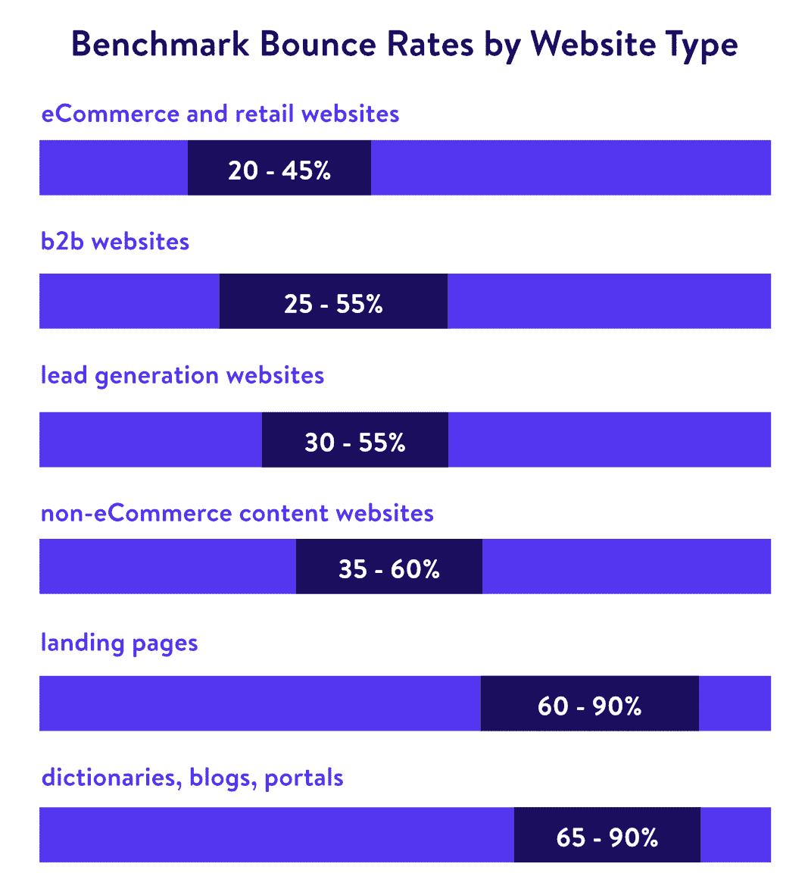

Average bounce rates by website type (Src: custommedialabs)


一些人也认为使用调整后的跳出率更好。这与 Google 的默认实现略有不同，因为您定义了一个时间限制，在此之后您可以认为用户是“参与的”超过限制后，用户将不再被视为反弹。要实现它，你需要[调整你的谷歌分析脚本](https://kinsta.com/blog/google-analytics-wordpress/)，或者你可以使用像 [CAOS](https://wordpress.org/plugins/host-analyticsjs-local/) 这样的免费插件。但是我们今天不去那个兔子洞。🐰


### 如何找到你的跳出率

跳出率显示在你的谷歌分析账户中[。有相当多的地方，你可以看到它本质上只是一个数据点，你可以关联到任何其他数据。您可能希望检查的几个常见位置是:](https://kinsta.com/blog/how-to-use-google-analytics/)

*   **行为>所有页面>跳出率**(查看哪些页面的跳出率较高或较低)
*   **采集>频道>跳出率**(查看哪种类型的流量跳出率最低)
*   **收购>来源/媒介>跳出率**(查看哪些推荐流量和媒介的跳出率最低)
*   **收购> AdWords >活动>跳出率**(看看你的 AdWords 活动的跳出率如何)

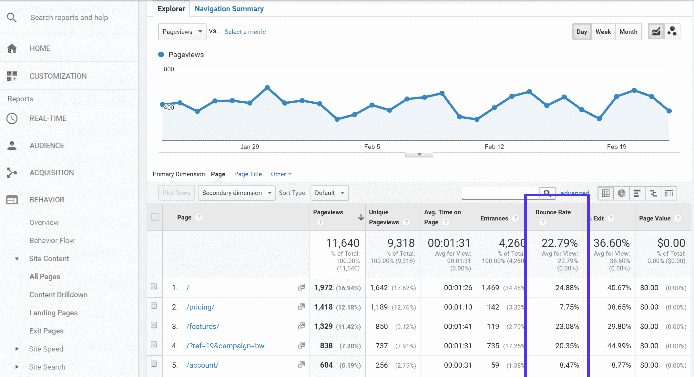

Bounce rate in Google Analytics


## 如何降低跳出率

以下是我们收集的 18 个可行的建议(很多是基于我们在自己的网站上运行的测试),关于如何降低跳出率和提高网站的用户参与度。


> 需要在这里大声喊出来。Kinsta 太神奇了，我用它做我的个人网站。支持是迅速和杰出的，他们的服务器是 WordPress 最快的。
> 
> <footer class="wp-block-kinsta-client-quote__footer">
> 
> 
> 
> <cite class="wp-block-kinsta-client-quote__cite">Phillip Stemann</cite></footer>

[View plans](https://kinsta.com/plans/)

### 1.首先优化你的流量和内容

在优化你的博客以降低流量跳出率之前，**你需要首先优化你的流量和内容**。交易是这样的:你的博客的[流量必须对你提供的内容感兴趣。因此，如果你的博客仅仅是关于](https://kinsta.com/blog/wordpress-seo/) [WordPress 主机](https://kinsta.com/wordpress-hosting/)的，而你的流量努力带来了对[应用主机](https://kinsta.com/application-hosting/)和[数据库主机](https://kinsta.com/database-hosting/)感兴趣的人，那么无论你实施了多少下面的技巧，你的跳出率都不会下降，因为你的流量根本不在乎。

你可以做的一个超级简单的改变就是优化你所有的标题(包括博客文章和页面)。例如，对于这篇博文，我们最初的标题是:

```
"How to Reduce Bounce Rate on Your WordPress Site (18 Actionable Tips)"
```

然而，由于 Kinsta 现在也提供应用程序和数据库托管，这个标题对我们的博客读者来说有点太具体了。为什么？因为我们的流量和受众是普遍关心云托管的人和企业，而不仅仅是 WordPress。所以我们把标题稍微改了一下:

```
"How to Reduce Bounce Rate on Your Site (18 Actionable Tips)"
```

这是做什么的？它有助于提高来自谷歌的流量质量。搜索的人会看到这是一篇针对网站用户的跳出率文章，而不仅仅是 WordPress 用户。这可能会增加总访问量和流量质量。这反过来降低了跳出率。像这样对所有内容进行的简单更改会产生巨大的连锁反应。


SEO title in SERPs


另一个伟大的流量优化是在谷歌分析中找出哪些流量来源已经给你带来了参与访客(最低的跳出率和最高的每次访问和平均浏览量。访问持续时间)，然后利用该信息。接触这些资源，让他们分享你的内容或合作写一篇文章。换句话说，**利用你已经拥有的数据**。
T3】

### 2.避免弹出窗口

关于弹出窗口对你的网站是有益还是有害，在博客领域有很多争论。弹出窗口有明显的优势，例如:

*   增加了选择加入率。Blog Marketing Academy 的 David Risley 使用弹出控制插件后，他的邮件列表选择加入率增加了 250%。
*   能够突出针对所有受众的特定内容(例如即将到来的网上研讨会)。

这两者都是不容忽视的好处。然而，有几个缺点:

*   有人说它们降低了网站的整体用户体验。这很可能是真的。营销人员肯定不会为了改善用户体验而使用它们。😉他们也可能导致横幅失明。
*   弹出窗口很可能会损害你的跳出率。它的速率也取决于弹出窗口的类型，比如小的或者全屏的。或者甚至是一个设置，比如向新用户显示它的次数。

如果你的首要任务之一是降低你的跳出率，那么你可能会想远离弹出窗口。但是你最不应该做的事情就是盲目地关闭你在网站上设置的弹出窗口，而不去跟踪结果。从增加参与度和减少选择加入度的角度来看权衡。然后，您可以决定是否值得启用或禁用它。

如你所见，在 Kinsta 我们不使用弹出窗口，但这是我们在权衡启用弹出窗口的利弊后做出的决定。然而，我们做了一些类似的事情，只是对用户来说不那么突兀。我们使用他们所谓的飞进选择加入。这是用优雅主题的 [Bloom 插件](https://www.elegantthemes.com/plugins/bloom/)完成的。我们将它设置为**仅在我们的博客和知识库文章上显示**，并且**仅在用户向下滚动页面 50%或更多**后显示。这可能是一个很好的中间地带。

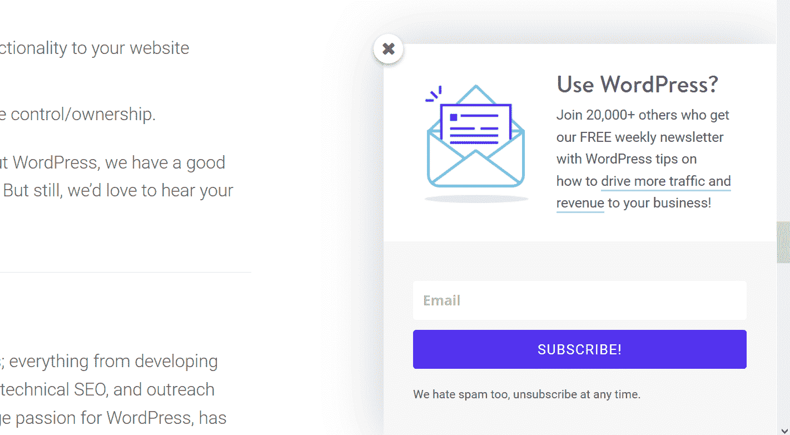

Slide in opt-in


### 3.用特定的菜单构建您的用户体验

你的[网站的菜单](https://kinsta.com/blog/wordpress-menu-plugins/)被称为导航是有充分理由的:这是你的访问者引导自己浏览你的网站的主要方式。如果他们不能很快找到答案，他们可能会反弹。大多数网站所有者不会给他们的导航系统太多的考虑，他们只是简单地放弃他们认为需要的东西:关于，服务，联系，博客等等。页面等。然而，测试哪些菜单项(顶部导航和页脚)是访问者实际使用和需要的，这是非常重要的。

你不想使用太多的导航项，但是你也需要它们来方便地找到答案。还有，考虑哪些页面对你很重要？如果你是一个电子商务网站，它是你的博客还是在你的产品/定价页面上转化客户？我们在 2017 年 11 月重新设计了 Kinsta 网站，您可以看到我们对导航所做的更改。我们删除了[关于我们的页面](https://kinsta.com/blog/about-us-page/)、博客和语言切换。我们还将定价页面的名称改为 plans，并缩短了联系按钮的名称。**有时少即是多。**


Kinsta navigation


不确定应该删除哪些菜单项？检查当前菜单导航中每一页的跳出率。然后将这些数据与像 [Hotjar](https://www.hotjar.com/) 这样的高级热图工具进行比较，它会显示哪些菜单项被点击得最多。或者你可以为谷歌分析中的每个元素设置[事件跟踪](https://support.google.com/analytics/answer/1136960?hl=en)。


Hotjar heatmap


### 4.利用空白

“空白”现象现在非常流行，在最小化主题的开发中有了巨大的增长。空白就是你网站上的空白。那里什么都没有——没有小部件，没有页脚，没有博客内容；只是你网站的背景。

如果你还没有赶上空白的潮流，你的网站设计充满了各种各样的框、栏和链接，那么你可能会严重影响你的跳出率。空白给读者的眼睛一个休息的机会。这也**引导访问者查看你的重要内容或 CTA**。

谷歌是公司利用空白空间的最大例子。他们希望人们做一件事(搜索)，任何事情都不能分散他们的注意力。

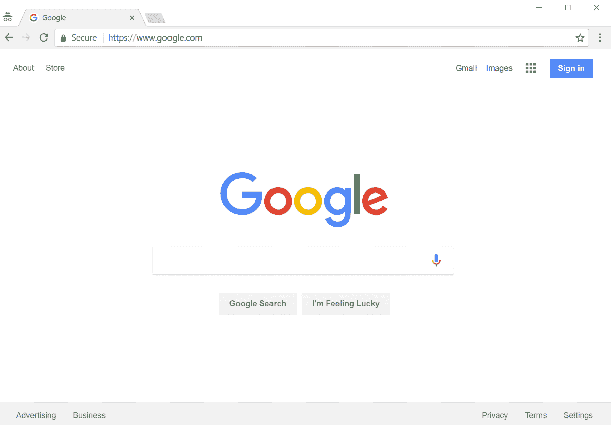

White space example


阅读更多关于空白的[力量。](https://www.interaction-design.org/literature/article/the-power-of-white-space)

### 5.确保字体不要太小

如果有一件事是人们讨厌的，那就是眯着眼睛试图阅读你网站上的内容。人们不会为了阅读你的博客内容而调整他们的关注点(不管它有多棒)。相反，它们很可能会以反弹告终。你的字体应该易于浏览。

做大。这是典型的趋势。14 px 应该是最低限度了。我们在 Kinsta 博客上对此做了进一步的阐述，使用 18 px 的字体大小。其他设计很棒的网站，比如 [Stripe](https://stripe.com) ，用的是 17 px 的字体。如你所见，它非常悦目。

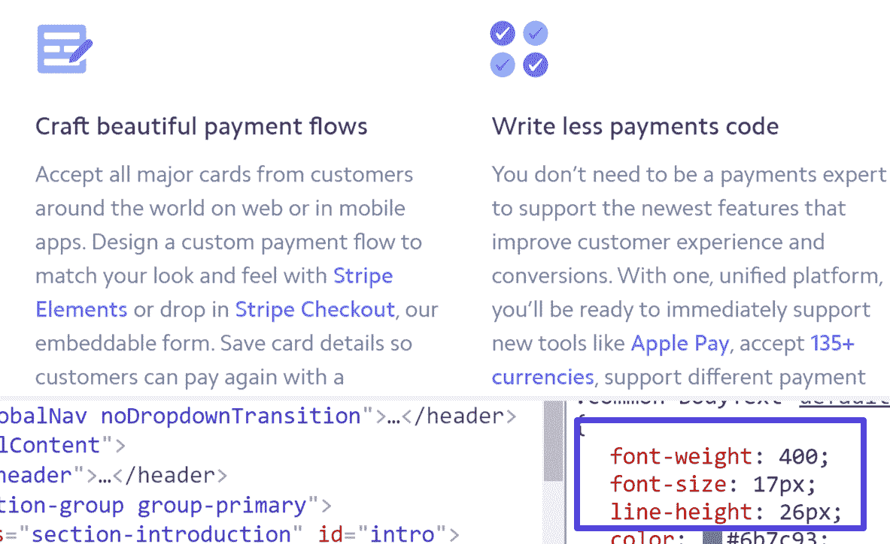

Stripe font size


如果你有一个 WordPress 站点，改变你的字体大小的一个简单的方法就是把下面的代码放到 WordPress 定制器的 CSS 部分。

```
body {
font-size: 18px;
}
```

请务必查看我们关于如何更改字体和网络字体优化的详细指南。

### 6.将相关帖子添加到您的网站

让读者停留更长时间总是一个好主意！也许他们登陆的帖子不是他们想要的，或者他们想阅读更多。所以你可以试着把它们和其他相关内容一起放在你的网站上。这通常是在你的博客文章结尾完成的。

这里有一个很大的问题，那就是很多 WordPress 相关的 post 插件在性能方面并不出色。事实上，他们可以是彻头彻尾的可怕。这通常是由于对数据库的大量站点范围的查询造成的。速度也影响反弹率，我们将在下面深入探讨。

Yoast 的团队进入了这个[话题](https://yoast.com/fast-related-posts/)，以下是他们的观点:

> 让我先问一个非常简单的问题:在一个内容页面上，你能想到的相关帖子的最快实现是什么？(有些沉闷的)答案是:**简单、老式的链接。**

我们完全同意！现在，如果你向下滚动到这篇博文的末尾，你会注意到我们有我们称之为“精选”的相关文章。并且这些实际上是由我们手动选择并分配给该职位的。这使得查询变得简单，因此不会影响整个网站的性能。它需要更多的工作吗？是的，但它实际上可以更好，因为你可以选择你真正想让读者看到什么。

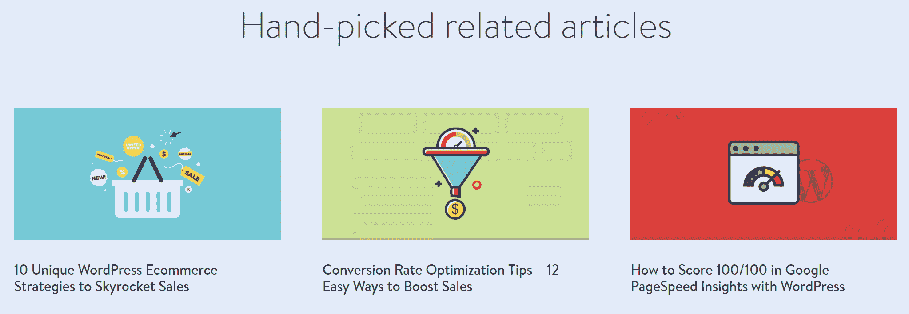

Related posts


那么我们是如何做到这一点的呢？不幸的是，那是给另一个即将到来的职位的。请务必订阅我们的时事通讯，以免错过。我们可以告诉你，我们使用了[高级定制字段](https://kinsta.com/blog/advanced-custom-fields/)插件，然后将这些字段分配给我们的博客文章类型。这使我们能够搜索和分配我们想要的任何相关内容到我们的每篇博客文章中(如下所示)。我们将发布一个完整的演练，教你如何自己设置。


Assign related posts


### 7.自定义您的 404 错误页面

404 错误页面是当访问者跟随一个无效链接到你的网站时出现的页面——一个上面还没有任何内容的链接，这触发了一个 [404 错误](https://kinsta.com/blog/error-404-not-found/)。例如，默认的 WordPress 404 错误页面显示如下:

> 哎呀！那个页面找不到了。看起来在这个地方什么也没找到。或许试试搜索？

根据你运行的主题，它可能还会列出链接到网页、类别、作者、文章和按月发布的文章。它并不真的很有帮助，因为它只是提供了太多的信息，而不是给被误导的访问者一个简单，容易的行动，他们可以遵循。404 页面的目标是防止反弹，让他们获得他们想要的信息。

## 注册订阅时事通讯


### 想知道我们是怎么让流量增长超过 1000%的吗？

加入 20，000 多名获得我们每周时事通讯和内部消息的人的行列吧！

[Subscribe Now](#newsletter)

在金斯塔这里，我们试图让我们的 404 图像有点创意，但仍然为用户提供有用的信息。我们让他们知道该页面未找到，他们可以返回主页或使用下面的搜索。我们还会展示我们最近的博客文章，并在他们需要额外帮助时提供联系方式。


404 error page


要定制你的 404 页面，你可以创建或编辑你的主题的[404.php 页面](https://codex.wordpress.org/Creating_an_Error_404_Page)。大多数都包含一个预构建的模板。或者使用免费的插件，比如 [404page](https://wordpress.org/plugins/404page/) ，它可以让你无需知道任何代码就能轻松定制。

### 8.检查拼写错误和打字错误

你的博客文章中常见的打字错误和拼写错误告诉你的访问者一件事:你不够关心你的内容(或他们),以至于没有校对你的文章几次。这很可能会以更高的反弹率解决。还会降低你的可信度，简直不专业。

当然，每个人都会犯错。我们发布的内容很多，无论我们多么小心，错别字还是会发生。重要的是**实施一个系统或工作流程来减少这些错误**。这里有几个建议。

*   养成一个习惯，在点击发布按钮之前，至少检查两次你的文章的语法、拼写和拼写错误。
*   如果有人在你的网站上看到一个错别字，并把你叫出来，不要惊慌，只要马上改正它。(不要忘了之后清理你网站上的页面缓存。如果你在社交媒体上推广你的内容，这一点尤其重要，因为它可能会吸引很多眼球。)
*   Use a browser extension like [Grammarly](https://chrome.google.com/webstore/detail/grammarly-for-chrome/kbfnbcaeplbcioakkpcpgfkobkghlhen?hl=en). Being avid writers, even we utilize this amazing tool here at Kinsta. Why? Because it will simply help catch things you might otherwise miss. It will speed up your writing workflow. The [Hemingway App is also another great free grammar checking tool](https://kinsta.com/blog/grammar-checker-tools/)!

    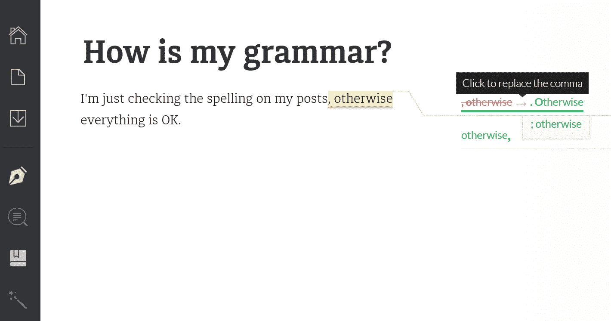

    语法上

    

### 9.在新标签页/窗口中打开外部链接

和其他人联系是很棒的——它让你和他们建立融洽的关系，建立联系，并为你的读者提供更有价值的内容。链接到高质量的外部资源甚至可以[有益于 SEO](https://www.searchenginejournal.com/study-shows-outgoing-links-have-positive-effects-on-seo/157431/) 。但是它也把你的访问者从你的网站带走了。除非您将链接设置为在新窗口或标签中打开。

对于一些人来说，这可能是一个非常有争议的话题，而且对于为什么[你不应该在新窗口](https://www.smashingmagazine.com/2008/07/should-links-open-in-new-windows/)中打开链接，肯定有很好的理由。然而，作为网站所有者，这实际上是由您来决定您更喜欢哪种方法。在 Kinsta，我们确实在新标签页中打开了链接。这有助于降低我们的跳出率，让读者更长久地关注我们的内容。

要让你的链接在一个新标签中打开，只需在编辑器中添加你的目的地 URL 时选中“在一个新标签中打开链接”(如下所示)。

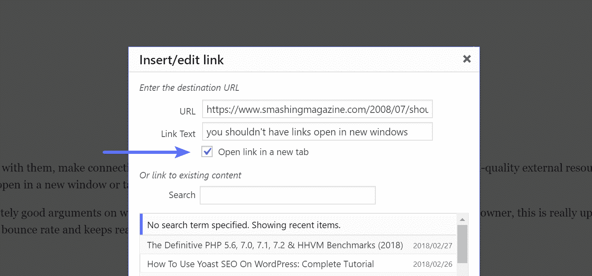

Open link in new tab


要在“文本”视图中手动操作，您可以在链接中添加一个`"target="_blank"`。

示例:`<a href="https://domain.com" **target="_blank"**>external site resource</a>`

### 10.内部链接通常

内部链接不仅仅是一个很好的 SEO 实践，而且它还能在很大程度上降低你网站的跳出率。对于那些没有意识到的人来说，内部链接就是从你网站上的一个网页链接到另一个网页。你把你的读者引向你网站上的另一个资源，这样他们在第一次浏览量之后就有东西可以浏览了。

你的博客文章中的内部链接在一篇文章中出现的与另一篇文章标题相关的短语。一个简单的方法是在添加链接时搜索现有的内容。例如，下面我们搜索了 SEO，我们内部链接了 SEO 清单帖子。当然，你也可以用 HTML 做内部链接。

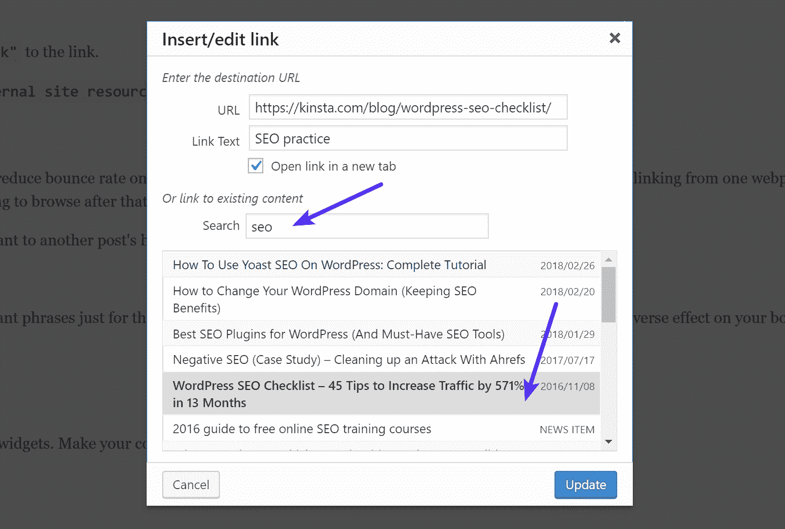

Internal link in WordPress


但是，和所有的事情一样，**内部链接适度**——不要为了多加几个链接而试图链接不相关的短语。太多，它实际上可能会对你的跳出率和[搜索引擎优化](https://kinsta.com/blog/what-does-seo-stand-for/)产生不利影响。

### 11.跨浏览器兼容，但不要太多

仅仅因为你有一个最喜欢的浏览器，并不意味着你的访问者在使用同一个浏览器。这就是为什么检查很重要。有些网站设计在不太流行的浏览器上可能会有点奇怪，比如 Internet Explorer。如果你的网站出现问题，你可能会被轻易的退回。

这里有几个方便的工具，你可以用它们同时在所有的浏览器中测试你的网站:

Struggling with downtime and WordPress problems? Kinsta is the hosting solution designed to save you time! [Check out our features](https://kinsta.com/features/)

*   [浏览器堆栈](https://www.browserstack.com/screenshots)
*   [浏览](https://www.browserling.com/)

然而，考虑到你的开发时间和有多少观众属于一个特定的浏览器问题也是很重要的。例如，假设你的网站每月有 50 万访问者。如果 IE 8 出现了渲染不正确的问题，并且你知道这将需要大量的开发时间来修复，你最好专注于更重要的任务。在某些时候，你必须让旧浏览器消亡。

但是要用数据做决定！你可以很容易地在“受众→技术→浏览器和操作系统”报告下的谷歌分析中找到，看看每个浏览器有多少访问者，以及他们的具体版本。


IE 8 users


### 12.移动就是一切

这里有一些可怕的统计数据，尤其是如果你还没有为移动设备优化你的网站:

*   截至 2017 年第四季度， [57%的互联网流量](https://www.brightedge.com/resources/research-reports/mobile-first-57-traffic-now-mobile)来自移动设备。这比 2013 年的 15%有所上升[。😲](http://www.mobify.com/blog/13-stats-to-convince-your-boss-to-invest-in-mobile-in-2013/)
*   谷歌表示，61%的用户不太可能回到他们难以访问的移动网站，40%的用户会转而访问竞争对手的网站。([米金赛&公司](http://www.mckinsey.com/insights/marketing_sales/why_marketers_should_keep_sending_you_emails)

这是巨大的！超过一半的流量可能因为他们不能正确浏览你的网站而反弹。幸运的是，今天大多数主题都是开箱即用的。但是你应该经常自己测试这个。我们推荐使用谷歌的手机友好测试工具。这也将有助于让你放心，你的网站对于[移动优先索引](https://kinsta.com/blog/google-mobile-first-index/) (SEO)是安全的。

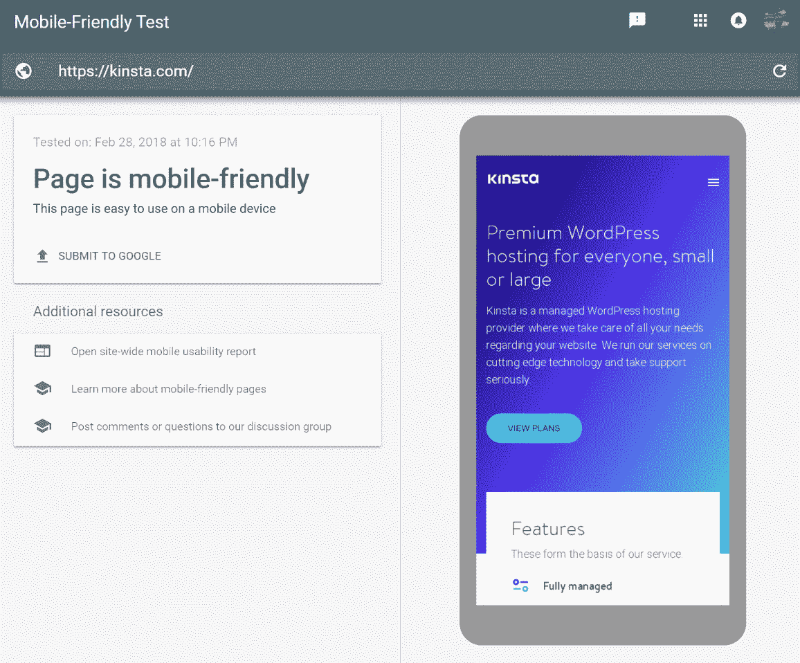

Google mobile-friendly test


如果你在紧要关头，你还可以使用一个插件来[确保它是移动&平板响应](https://kinsta.com/blog/wordpress-mobile-plugin/ "7 Plugins to Fashion WordPress For The Mobile Revolution")。虽然我们总是建议先走响应路线。响应式意味着你的网站可以自动为所有有代码没有插件的设备缩小规模。你也可以雇佣一个开发人员来帮助你提高网站的响应性。

### 13.小心广告

很多网站依靠广告赚钱，这是完全可以理解的。然而，重要的是要记住**引人注目的恼人广告会严重影响你的跳出率**。尤其是自动播放的广告。请记住，不是每个人都安装了弹出窗口拦截器。尽管现在大多数浏览器都在尝试执行这一点。

下面是一些非常讨厌的广告的例子。首先，我们有“饼干警告”出于法律原因，这是必要的，但是，由于屏幕空间的原因，在与广告配对时，也应该考虑到这一点。然后有一个非常大的横幅广告在网站的顶部，另一个介绍文章缩略图后。当你第一次登陆时，整个网站的一半以上都是广告。不好！


Example of bad advertising


这就是 [A/B 测试](https://kinsta.com/blog/wordpress-ab-testing-tools/)可以派上用场的地方。尝试在不同的位置使用较少的广告，看看它如何影响该页面的跳出率。你可能会发现访问者点击你的主页，然后突然离开。所以事实上，删除一些广告可能会增加你的收入。像[广告插入器](https://wordpress.org/plugins/ad-inserter/)这样的 WordPress 插件可以让你轻松测试不同的广告位置。或者你可以使用免费的 A/B 测试工具，如[谷歌优化](https://www.google.com/analytics/optimize/)。事实上，我们在 Kinsta 使用这款产品，并且非常喜欢。你可以在这里阅读我们详细的设置指南:[如何在 WordPress 中免费使用 Google Optimize 进行 A/B 测试](https://kinsta.com/blog/google-optimize/)

### 14.明智地组织你的内容

你可以做很多事情来明智地组织你的内容，以帮助降低跳出率。首先是使用博文标题和副标题。博客帖子——尤其是像这样的大而有深度的帖子——可以承载大量信息。所有这些信息都需要某种结构来消化，否则，访问者将很难消化所有这些信息，从而引发反弹。

用标题 (H2)和副标题(H3、H4 和 H5)组织你的博客文章。例如，在这篇文章中，我们使用了 H2 和 H3 标题的组合。并且总是在页面顶部有一个标题为的**H1。**

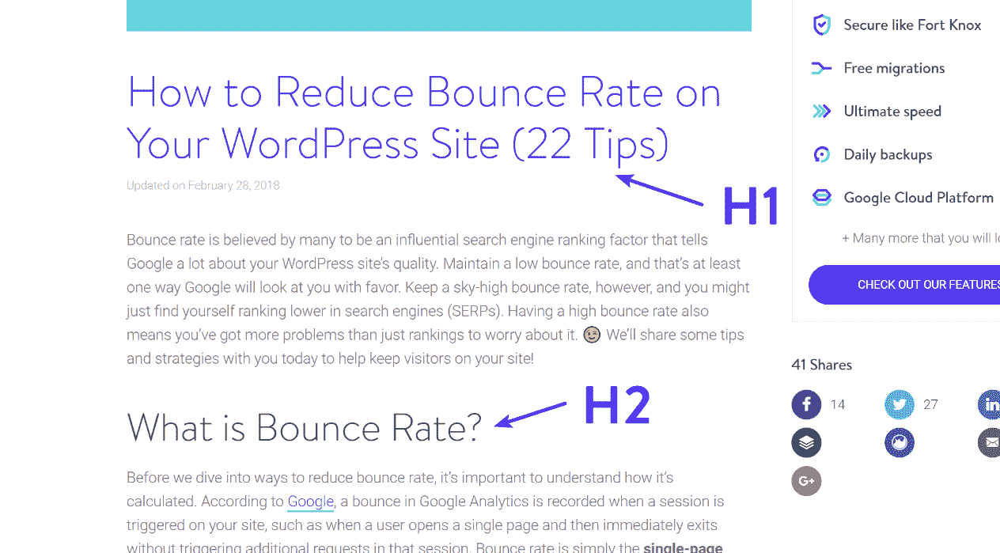

H1 and H2 headings


写下标题后，确保**使用更短的段落**。这不是高中英语，在那里段落必须至少有五个句子。这就是博客，五句话以上的段落有时会被*忽略*。

如果你真的想让你的读者阅读你的内容，而不仅仅是浏览，那么你需要把你的内容分成更短的段落。四句话通常是推荐的长度。有些博主甚至低至 2。这也可能因您发布的内容类型而异。

### 15.图像告诉一切

这个我们大概不需要过多展开，但是**图片胜过千言万语**。所以不要用 4000 字来让你的观众厌烦(提示:[内容长度](https://kinsta.com/blog/content-length/)不是最重要的因素)，用一个图像来启发他们。如果你在这篇文章中向上滚动，你会注意到我们分享的每一个跳出率提示，总有一张图片和一个例子。

找图像有困难？看看这些 [10 个令人敬畏的地方，为你的网站找到免版税的图片](https://kinsta.com/blog/free-images-for-wordpress/)。我们也是 [Iconfinder](https://www.iconfinder.com/) 的忠实粉丝，事实上，在我们的特色图片中经常使用它们。

另外，确保你的图片和你的内容布局很好地配合。我们建议尽可能使用全幅图像来填满整个内容区域。这通常对眼睛来说更容易，并且使内容更容易浏览。别忘了[优化你的图像](https://kinsta.com/blog/optimize-images-for-web/)以获得更好的性能。

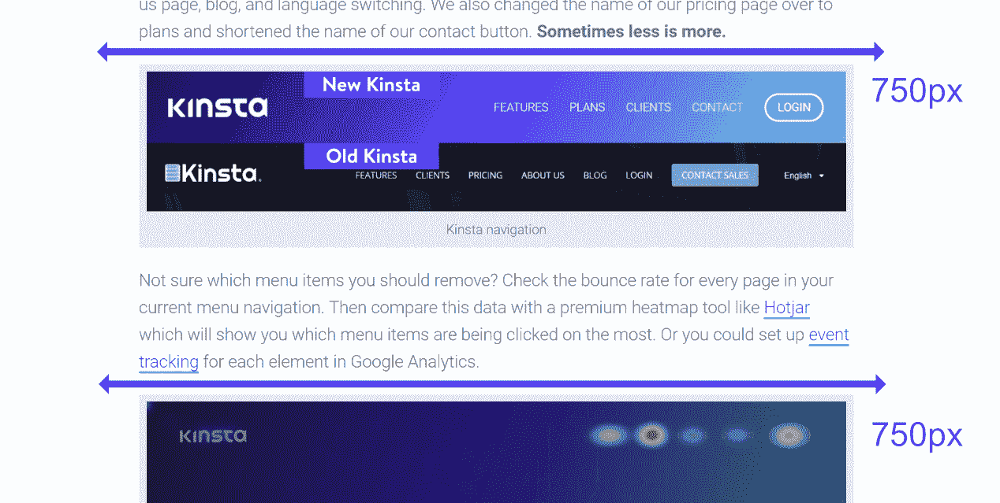

Content width images


### 16.专注于重要的事情

**你的内容是你网站最重要的部分**。句号。将用户的注意力引向内容。不要用 20 个小工具或 CTA 分散他们的注意力。让你的内容成为页面中最重要的部分。如果分心太多，你就可以和你的跳出率吻别了。

[One way to reduce your bounce rate is to treat your content like royalty. 👑Click to Tweet](https://twitter.com/intent/tweet?url=https%3A%2F%2Fkinsta.com%2Fblog%2Fhow-to-reduce-bounce-rate%2F&via=kinsta&text=One+way+to+reduce+your+bounce+rate+is+to+treat+your+content+like+royalty.+%F0%9F%91%91&hashtags=contentmarketing)

在你引导他们的注意力之后， **[确保你的内容确实有价值，](https://kinsta.com/learn/content-marketing/)** 并且在某些方面对读者有益。否则，他们会离开，没有理由再回来。简而言之，创造你自己想要阅读的有用的和[常青的内容](https://kinsta.com/blog/evergreen-content/)。所以下一次访问者点击你的网站时，他们会非常喜欢它，以至于无法让自己弹起。相反，他们只会想要更多的。

### 17.始终实施内部搜索

如果一个访问者访问了你的网站，却找不到他想要的东西，那么你可能已经做错了。但是，挽回自己并防止访问者反弹的方法是在你的网站上实现内部搜索。这很可能是游客在离开前尝试的最后一件事。

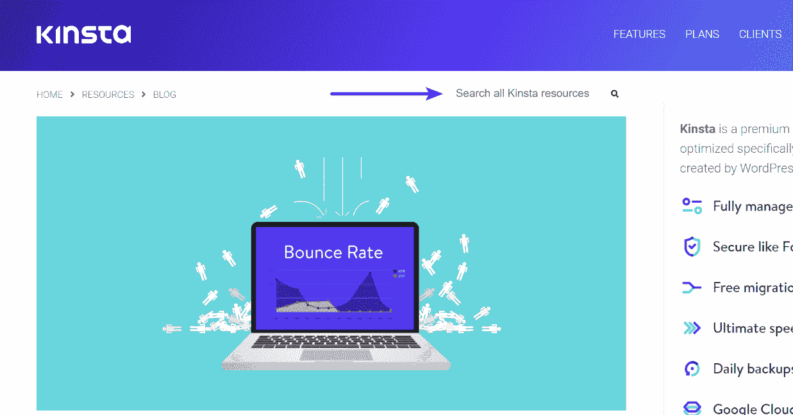

Internal search


默认情况下，你的 WordPress 安装应该包括一个可用的搜索小工具，你可以在任何一个 widget 化的位置设置它。[你的主题](https://kinsta.com/blog/how-to-install-a-wordpress-theme/)也可能有额外的内置位置，你可以利用搜索。但是无论你做什么，千万不要删除你网站的搜索功能！

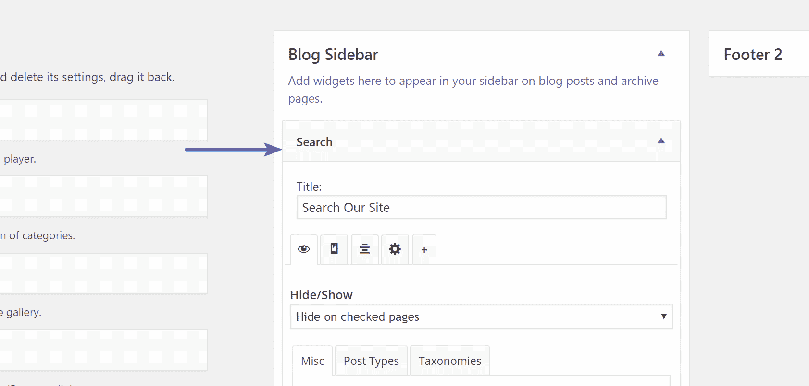

Search widget


### 18.拥有闪电般的页面加载速度

[页面加载速度](https://kinsta.com/learn/page-speed/)对你的跳出率是一个非常有影响的因素。简单地说，你的网站加载越快，你的跳出率就越低(如果其他所有变量都不变)。超过 3 秒钟加载[的网站会立即损失 40%的流量](http://blog.kissmetrics.com/loading-time/)。79%的不满意的访问者几乎从不返回慢速网站！

要获得真正闪电般的速度，你需要一个高级应用程序、数据库和托管 WordPress 主机，而这正是 Kinsta 可以帮助你的地方。我们由谷歌云平台提供支持，这意味着您的网站通过世界上最大的网络之一交付，并从靠近您的访问者的低延迟数据中心加载。我们还有一个 HTTP/2 [CDN 集成](https://kinsta.com/blog/wordpress-cdn/),可以让您进一步加快在全球交付资产的速度。

[](https://kinsta.com/wp-content/uploads/2018/02/kinsta-load-time-1.png)

Load time after moving to Kinsta


让我们向您展示 Kinsta 的不同之处。或者多读一些关于[为什么我们](https://kinsta.com/why-us/)与你尝试过的其他主机不同的内容。

## 摘要

希望这些关于如何降低网站跳出率的建议对你有所帮助。如果你做到了这一步，我们已经尽了自己的努力来降低跳出率。😉现在轮到你了。今天你将在你的站点上实现哪些？或者你有没有见过其他能产生巨大差异的优化？如果是这样，请在下面的评论中告诉我们。

* * *

让你所有的[应用程序](https://kinsta.com/application-hosting/)、[数据库](https://kinsta.com/database-hosting/)和 [WordPress 网站](https://kinsta.com/wordpress-hosting/)在线并在一个屋檐下。我们功能丰富的高性能云平台包括:

*   在 MyKinsta 仪表盘中轻松设置和管理
*   24/7 专家支持
*   最好的谷歌云平台硬件和网络，由 Kubernetes 提供最大的可扩展性
*   面向速度和安全性的企业级 Cloudflare 集成
*   全球受众覆盖全球多达 35 个数据中心和 275 多个 pop

在第一个月使用托管的[应用程序或托管](https://kinsta.com/application-hosting/)的[数据库，您可以享受 20 美元的优惠，亲自测试一下。探索我们的](https://kinsta.com/database-hosting/)[计划](https://kinsta.com/plans/)或[与销售人员交谈](https://kinsta.com/contact-us/)以找到最适合您的方式。