# 如何修复 ERR_TOO_MANY_REDIRECTS 错误

> 原文:[https://kinsta.com/blog/err_too_many_redirects/](https://kinsta.com/blog/err_too_many_redirects/)

在 Kinsta，我们会遇到很多不同的错误，ERR_TOO_MANY_REDIRECTS(也称为重定向循环)是我们经常看到的错误。通常，这发生在您的网站最近发生更改、服务器上重定向配置错误或第三方服务设置错误之后。但是不要担心，这个错误很容易修复。

查看下面关于如何修复此错误并使您的网站恢复运行的建议。

## 什么是 ERR_TOO_MANY_REDIRECTS 错误？

ERR_TOO_MANY_REDIRECTS 错误就像它听起来的那样:一些事情导致了**太多的重定向**，将你的网站送进了一个**无限重定向循环。**

从本质上来说，网站被卡住了(例如 URL 1 指向 URL 2，URL 2 又指向 URL 1，或者该域多次重定向您)，与其他一些错误不同，这些错误很少会自行解决，可能需要您采取措施来修复它。

您可能还遇到过错误“**由于可能的配置错误**，请求超过了 10 个内部重定向的限制”。

根据您运行的浏览器，此错误有几种不同的变体。


### 谷歌浏览器

在谷歌浏览器中，这个错误会显示为 **ERR_TOO_MANY_REDIRECTS** (如下图所示)或者**这个网页有一个重定向循环问题**。

> 这一页不起作用。domain.com 给你改了太多次了。

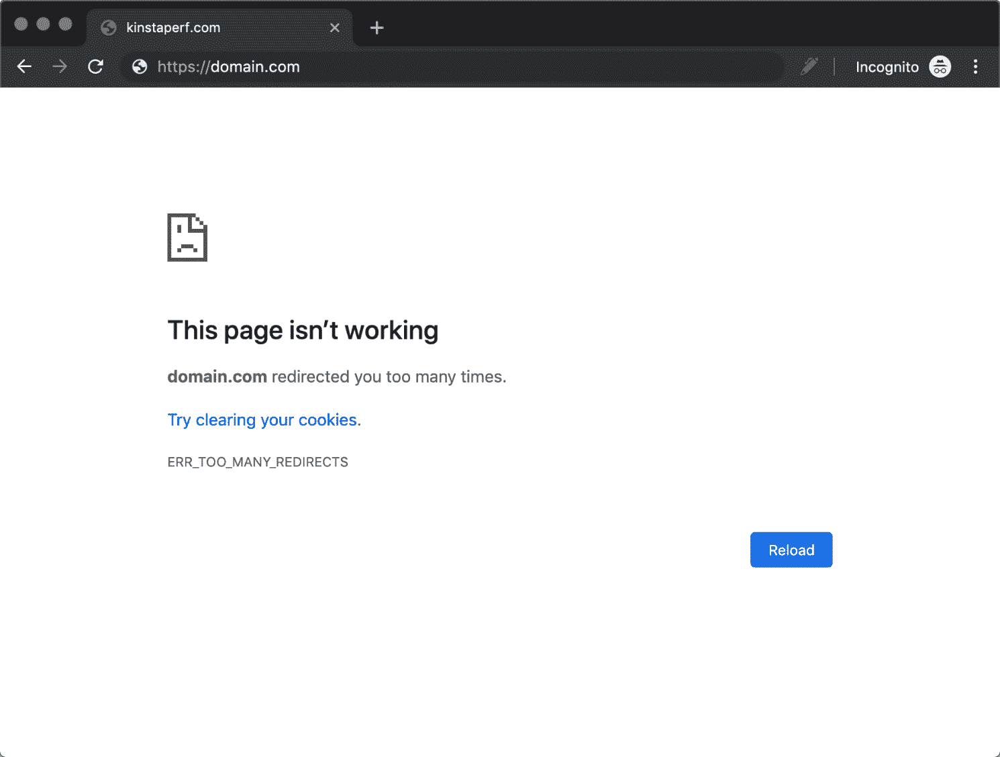

ERR_TOO_MANY_REDIRECTS in Google Chrome


(查看如何修复 Chrome 的 [ERR_CACHE_MISS](https://kinsta.com/knowledgebase/err_cache_miss/) 错误)。


> Kinsta 把我宠坏了，所以我现在要求每个供应商都提供这样的服务。我们还试图通过我们的 SaaS 工具支持达到这一水平。
> 
> <footer class="wp-block-kinsta-client-quote__footer">
> 
> 
> 
> <cite class="wp-block-kinsta-client-quote__cite">Suganthan Mohanadasan from @Suganthanmn</cite></footer>

[View plans](https://kinsta.com/plans/)

### Mozilla Firefox

在 Mozilla Firefox 中，它会显示为**页面没有正确重定向**(如下所示)。

> 连接到 domain.com 时出错。这个问题有时可能是由于禁用或拒绝接受 cookies 造成的。

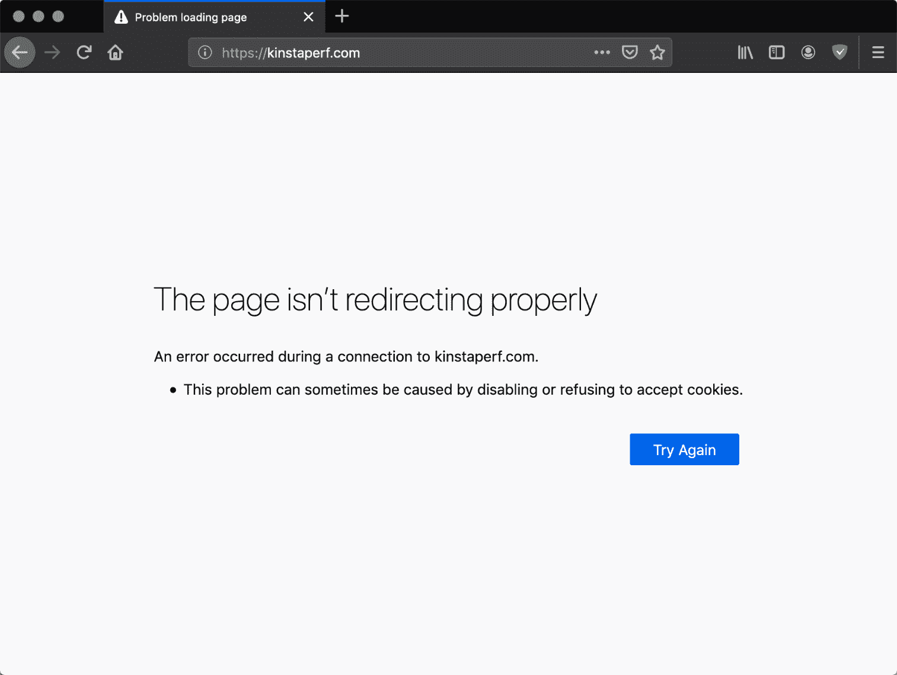

ERR_TOO_MANY_REDIRECTS in Mozilla Firefox


### 微软 Edge

在 Microsoft Edge 中，它会简单地显示为**该页面现在无法工作**(如下所示)。

> Domain.com 给你改了太多次了。

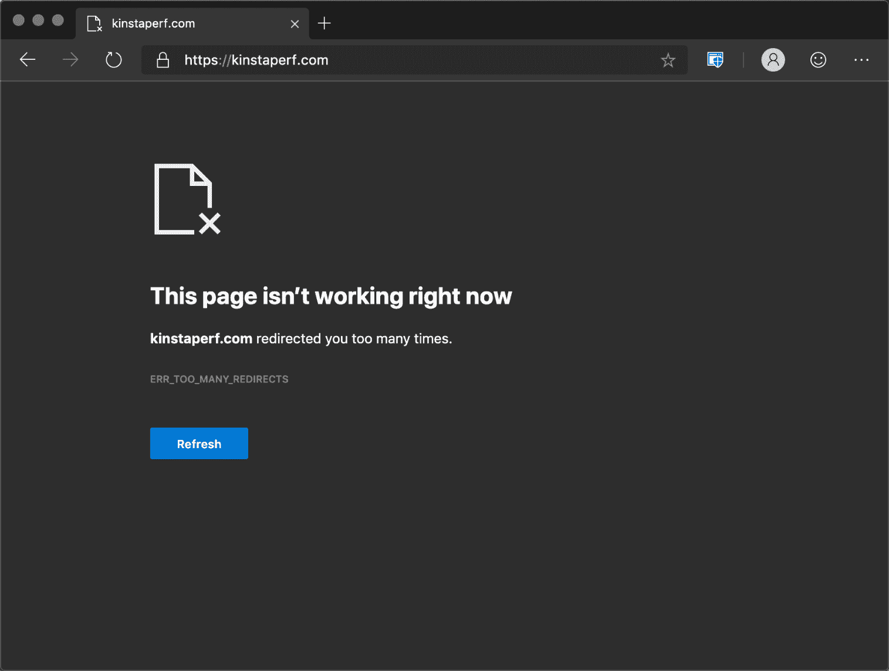

ERR_TOO_MANY_REDIRECTS in Microsoft Edge


### 旅行队

在 Safari 中会显示为 **Safari 打不开页面**(如下图)。

> 试图打开“domain.com”时发生太多重定向。如果您打开的页面被重定向到另一个页面，然后该页面被重定向到原始页面，则可能会发生这种情况。


ERR_TOO_MANY_REDIRECTS error in Safari


## 为什么会出现 ERR_TOO_MANY_REDIRECTS 错误？

当浏览器无法在重定向中的初始页面和目标页面之间建立连接时，会发生此错误。主要原因可能是:

*   错误配置的 WordPress 设置
*   错误配置的 WordPress 插件。
*   错误配置的服务器设置。
*   不正确的 HTTPS 设置。
*   浏览器缓存/cookie 的问题。
*   第三方服务的问题(如 cdn)。
*   网站或域名迁移不当。

那么如何修复 ERR_TOO_MANY_REDIRECTS 错误呢？

以下是一些建议和需要检查以修复错误的事项(按我们看到的最常见原因排序):

*   [删除特定网站上的 cookies】](#delete-cookies)
*   [清除站点、服务器、代理和浏览器缓存](#clear-cache)
*   [确定重定向循环的性质](#nature-of-redirect-loop)
*   [检查您的 HTTPS 设置](#HTTPS-settings)
*   [检查第三方服务](#third-party-services)
*   [检查你的 WordPress 站点设置](#wordpress-site-settings)
*   [暂时禁用 WordPress 插件](#disable-wordpress-plugins)
*   [检查服务器上的重定向](#redirects-on-server)

 ## 删除特定站点上的 Cookies

事实上，谷歌和 Mozilla 都在错误下方推荐“尝试清除你的 cookies”Cookies 有时会包含错误数据，这可能会导致 ERR_TOO_MANY_REDIRECTS 错误。这是一个你可以尝试的建议，即使你在一个不属于你的网站上遇到了错误。

由于 cookie 会保留您在站点和其他设置上的“已登录”状态，我们建议您只需**删除有问题的**站点上的**cookie。这样你就不会影响你经常访问的其他会话或网站。**

按照以下步骤在 Google Chrome 中删除特定网站上的 cookie。

### 第一步

在谷歌浏览器中，点击右上角的三个小点。然后点击“设置”

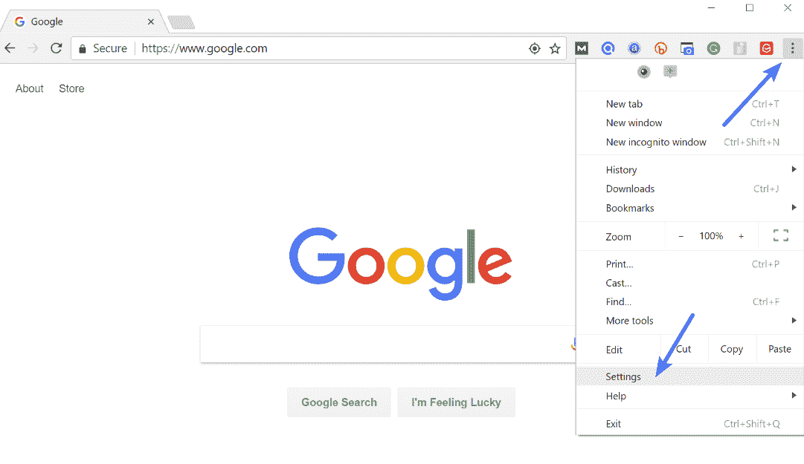

Chrome settings


### 第二步

向下滚动并点击“高级”


Chrome advanced settings


### 第三步

然后点击“内容设置”

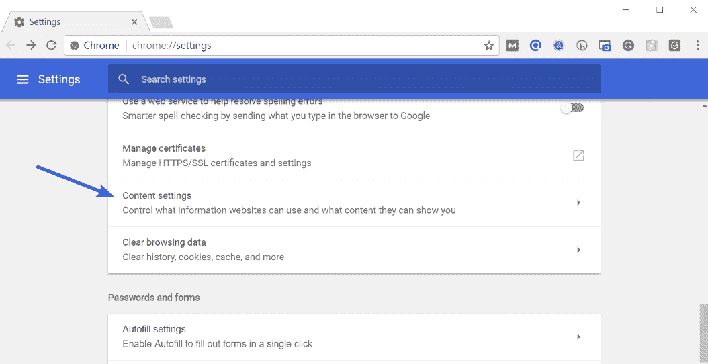

Chrome content settings


### 第四步

点击“Cookies”

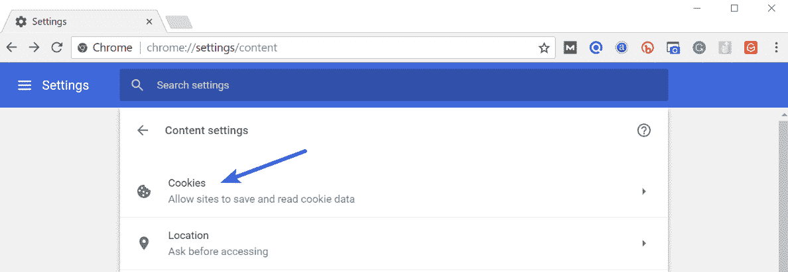

Chrome cookies


### 第五步

然后点击“查看所有 cookies 和站点数据”


Chrome see all cookies


### 第六步

搜索遇到 ERR_TOO_MANY_REDIRECTS 错误的站点(域)。然后，您可以删除当前存储在您计算机上的该域的 cookie。然后再次尝试访问该网站。

 ## 注册订阅时事通讯


### 想知道我们是怎么让流量增长超过 1000%的吗？

加入 20，000 多名获得我们每周时事通讯和内部消息的人的行列吧！

[Subscribe Now](#newsletter)

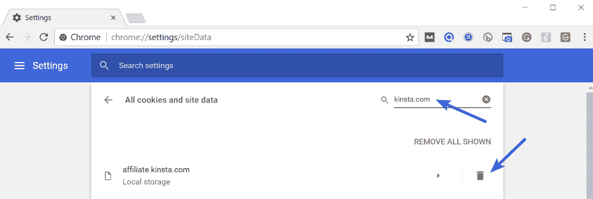

Delete cookie in Chrome


## 清除服务器、代理和浏览器缓存

由于重定向循环是可以被缓存的响应，所以总是建议你在你的 WordPress 站点、服务器、第三方代理服务，甚至是你的浏览器上清除缓存。

### 清除 WordPress 站点缓存

根据重定向循环的类型，你可能仍然能够访问你的 WordPress 管理仪表板。在这种情况下，您可以在缓存插件的设置中轻松清除缓存。这里有几个关于如何清除带有流行插件的 WordPress 缓存的快速链接:

*   [使用缓存启用程序清除缓存](https://www.keycdn.com/support/wordpress-cache-enabler-plugin)
*   [用 W3 总缓存清除缓存](https://kinsta.com/blog/w3-total-cache/#how-to-purge-w3-total-cache)
*   [用超级缓存清除缓存](https://www.youtube.com/watch?v=CaIieKPN1LU&ab_channel=SeedProd)

如果你是 Kinsta 的客户，你可以很容易地从 WordPress 管理工具栏[清除你的缓存](https://kinsta.com/blog/wordpress-clear-cache/)。


Clear Kinsta cache from WordPress admin


### 清除服务器缓存

如果你[不能访问 WordPress admin](https://kinsta.com/blog/locked-out-of-wordpress-admin/) ，许多 WordPress 主机都有自己的控制面板工具来清除你的 WordPress 站点上的缓存。

如果你是一个 Kinsta 客户，你可以在 MyKinsta 仪表板中手动[清除 WordPress 缓存](https://kinsta.com/blog/wordpress-clear-cache/)。只需点击你的网站，点击进入工具，并点击“清除缓存”按钮。然后检查您的网站，看看重定向循环是否仍然存在。

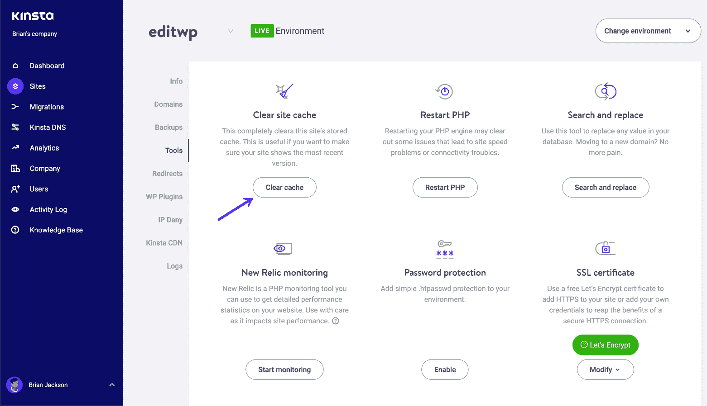

Clear WordPress cache


### 清除代理缓存

如果你使用的是第三方反向代理服务，如 [Cloudflare](https://kinsta.com/knowledgebase/install-cloudflare/) 或 Sucuri，清理他们那边的缓存也是有益的。

#### 云耀斑

要清除 Cloudflare 缓存，请登录他们的控制面板，单击“缓存”，然后单击“清除所有内容”

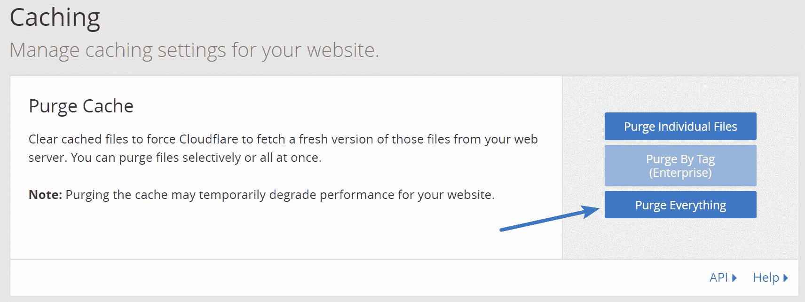

#### 苏库里

要清除 Sucuri 缓存，请登录他们的仪表板，转到“性能”并单击“清除缓存”


Clear Sucuri cache


### 清除浏览器缓存

如果你想检查看看是否是你的浏览器缓存，而不清除你的缓存，你总是可以[在隐身模式](https://support.google.com/chrome/answer/95464?co=GENIE.Platform%3DDesktop&hl=en)下打开你的浏览器。或者测试另一个浏览器，看看是否仍然看到 ERR_TOO_MANY_REDIRECTS 错误。


Open Chrome in Incognito mode


如果您确定这是由浏览器缓存引起的，那么您可以清除它。以下是在各种浏览器中如何操作的说明:

*   [如何为所有浏览器强制刷新单个页面](https://kinsta.com/knowledgebase/how-to-clear-browser-cache/#single)
*   [如何为谷歌 Chrome 清除浏览器缓存](https://kinsta.com/knowledgebase/how-to-clear-browser-cache/#chrome)
*   [如何清除 Mozilla Firefox 的浏览器缓存](https://kinsta.com/knowledgebase/how-to-clear-browser-cache/#firefox)
*   [如何清除 Safari 浏览器缓存](https://kinsta.com/knowledgebase/how-to-clear-browser-cache/#safari)
*   [如何清除 Internet Explorer 的浏览器缓存](https://kinsta.com/knowledgebase/how-to-clear-browser-cache/#ie)
*   [如何为 Microsoft Edge 清除浏览器缓存](https://kinsta.com/knowledgebase/how-to-clear-browser-cache/#edge)
*   [如何为 Opera 清除浏览器缓存](https://kinsta.com/knowledgebase/how-to-clear-browser-cache/#opera)

 ## 确定重定向循环的性质

如果清除缓存不起作用，那么您将想看看是否可以确定重定向循环的性质。我们的免费在线[重定向检查工具](https://kinsta.com/tools/redirect-checker/)可以帮助提供一些关于可能发生的事情的进一步分析。这也可以通过 cURL 来实现。

例如，在下面的网站上，它有一个 301 重定向回自己，这导致了一个错误重定向的大链。您可以跟踪所有的重定向，并确定它是否循环回自身，或者可能是一个 HTTP 到 HTTPS 的循环，我们将在下面进一步讨论如何解决这个问题。

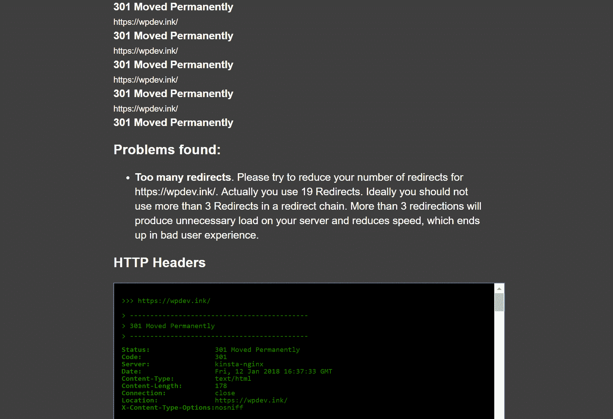

Too many redirects


[重定向路径](https://chrome.google.com/webstore/detail/redirect-path/aomidfkchockcldhbkggjokdkkebmdll?utm_source=chrome-app-launcher-info-dialog) Chrome 扩展也非常有用，它可以让你深入了解你的网站上发生的所有重定向(特定的 URL 或页面)。

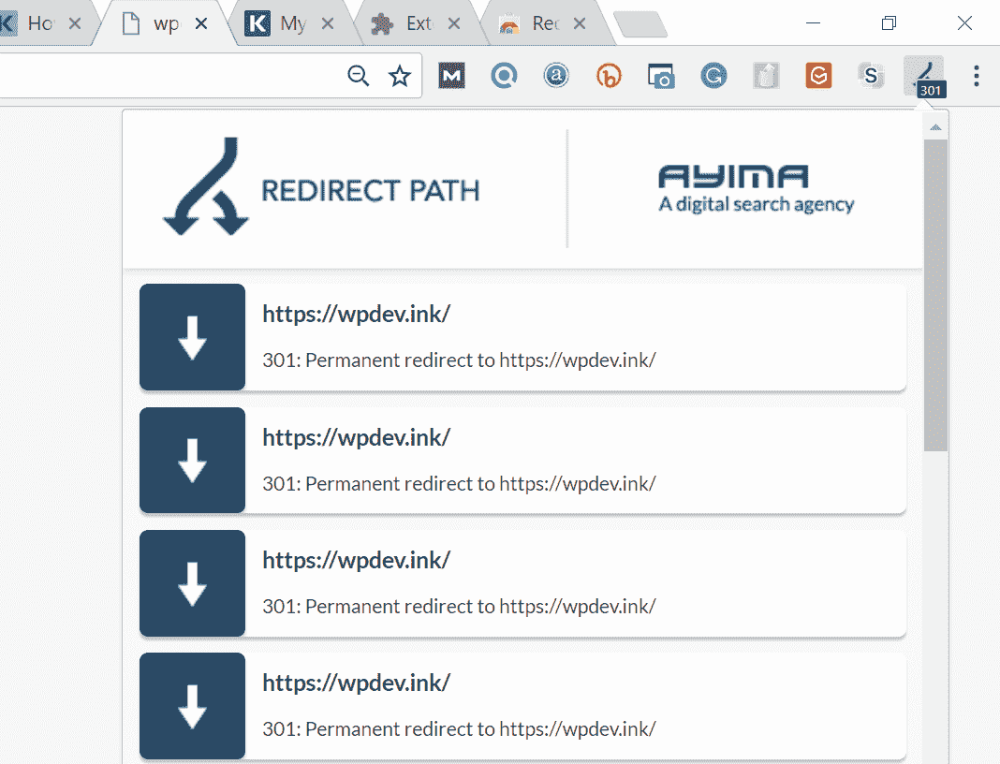

Redirect Path extension


## 检查您的 HTTPS 设置

另一件要检查的事情是你的 HTTPS 设置。很多时候，当某人刚刚[将他们的 WordPress 站点迁移到 HTTPS](https://kinsta.com/blog/http-to-https/) 却没有完成或者设置错误时，我们会看到错误的重定向发生。

[T2】](https://demo.kinsta.com/register?utm_campaign=mykinsta%20demo&utm_source=blog-knowledgebase&utm_medium=gif-banner)

### 1.不要强迫没有 SSL 证书的 HTTPS

这是目前为止我们经常看到的最常见的原因。如果你强迫你的 WordPress 站点在没有安装 SSL 证书的情况下通过 HTTPS 加载，你会立刻把你的站点扔进一个重定向循环。要解决这个问题，只需[在你的 WordPress 网站上安装一个 SSL 证书](https://kinsta.com/help/how-to-install-ssl-certificate/)。

还建议运行一个 [SSL 检查](https://kinsta.com/knowledgebase/ssl-check/)。 [SSL/TLS 证书](https://kinsta.com/knowledgebase/tls-vs-ssl/)不仅需要你的主证书，还需要安装他们所谓的中间证书(链)。这些需要正确设置。

我们建议使用 Qualys SSL Labs 提供的免费 SSL 检查工具。它非常可靠，我们在验证证书时将它用于所有的 Kinsta 客户端。只需前往他们的 [SSL 检查工具](https://www.ssllabs.com/ssltest/analyze.html)，在主机名字段中输入您的域名，然后点击“提交”如果您愿意，也可以选择隐藏公共结果的选项。在 web 服务器上扫描站点的 SSL/TLS 配置可能需要一两分钟的时间。

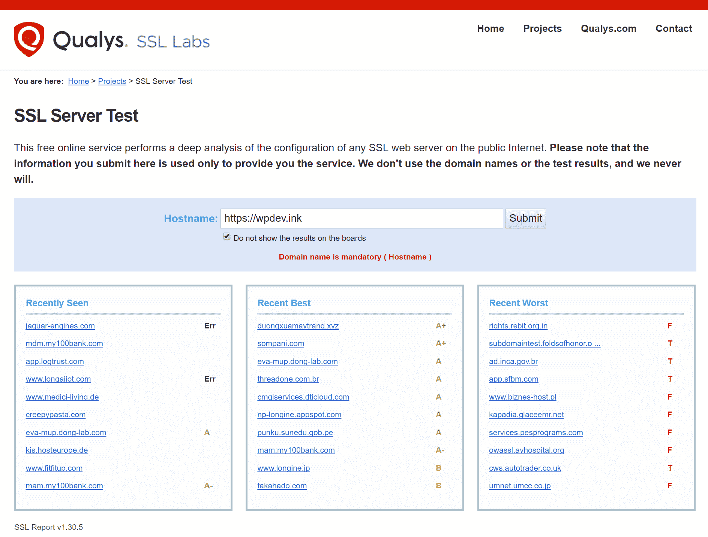

SSL test


### 2.不要使用 SSL 插件，更新你的硬编码链接

有一些免费的 SSL WordPress 插件，例如[真正简单的 SSL](https://wordpress.org/plugins/really-simple-ssl/) 插件将帮助你自动重定向到 HTTPS。但是，我们不建议将这种方法作为永久的解决方案，因为第三方插件总是会引入另一层问题和兼容性问题。这是一个很好的临时解决方案，但是你真的应该**更新你的硬编码 HTTP 链接**。

我们有一个很棒的教程，里面有 4 种简单的方法在 WordPress 中进行[搜索和替换。如果您是 Kinsta 的客户，您也可以随时联系我们的支持团队来为您完成这项工作。](https://kinsta.com/knowledgebase/wordpress-search-and-replace/)

### 3.检查服务器上 HTTP 到 HTTPS 的重定向

很有可能是您服务器上的 HTTPS 重定向规则配置错误。

#### 在 Nginx 中将 HTTP 重定向到 HTTPS

如果您的 web 服务器运行 Nginx 的[，您可以通过将以下代码添加到 Nginx 配置文件中，轻松地将所有 HTTP 流量重定向到 HTTPS。这是重定向 Nginx 上运行的 WordPress 的推荐方法。](https://kinsta.com/knowledgebase/what-is-nginx/)

```
server { listen 80; server_name domain.com www.domain.com; return 301 https://domain.com$request_uri; }
```

金斯塔的每个人都使用 Nginx。好消息是你不用担心这个。如果您需要添加重定向，只需打开快速[支持标签](https://my.kinsta.com/)，让我们知道您需要重定向到哪个域。然后我们将它添加到 Nginx 配置中。

#### 查看我们关于重定向的[视频指南](https://www.youtube.com/watch?v=PRNMpVu2XW4)


#### 在 Apache 中将 HTTP 重定向到 HTTPS

如果你的 web 服务器是运行 Apache 的[，你可以通过添加下面的代码到](https://kinsta.com/knowledgebase/what-is-apache/)[你的`.htaccess`文件](https://kinsta.com/knowledgebase/wordpress-htaccess-file/)，轻松地将你所有的 HTTP 流量重定向到 HTTPS。这是重定向在 Apache 上运行的 WordPress 的推荐方法。

```
RewriteEngine On
RewriteCond %{HTTPS} off
RewriteRule ^(.*)$ https://%{HTTP_HOST}%{REQUEST_URI} [L,R=301]
```

### 4.检查是否有太多的 HTTPS 重定向

也许你只是有太多的 HTTPS 重定向。你可以使用类似于[重定向检查器](https://smallseotools.com/redirect-checker/)的工具轻松检查你的站点，看看它使用了多少重定向。下面是一个没有正确设置的重定向的例子，使用在线工具很容易发现。您可以看到，在 www 和非 www 版本上都出现了重复的 HTTPS 重定向。

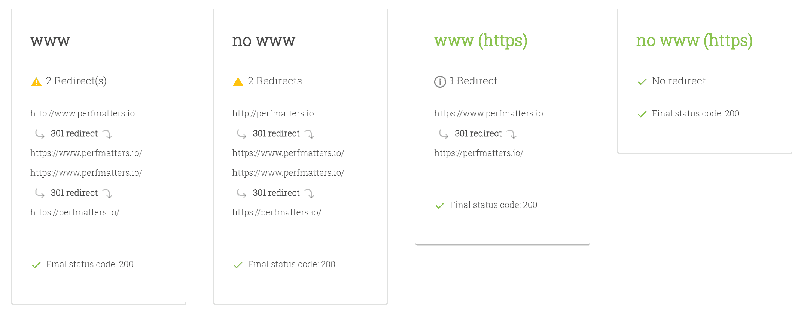

Redirects


## 检查第三方服务

ERR_TOO_MANY_REDIRECTS 也是**通常由 Cloudflare** 等反向代理服务引起的。这通常发生在他们的灵活 SSL 选项被启用，并且你已经在你的 WordPress 主机上安装了 SSL 证书的时候。为什么？因为，当选择灵活时，所有对主机服务器的请求都是通过 HTTP 发送的。您的主机服务器很可能已经有一个从 HTTP 到 HTTPS 的重定向，因此会出现重定向循环。

要解决此问题，您需要将 Cloudflare 加密设置从灵活更改为完全或完全(严格)。如果你是 Kinsta 的客户，请务必查看我们关于如何在使用 Cloudflare 时[安装 SSL 证书的步骤。](https://kinsta.com/help/how-to-install-ssl-certificate/#ssl-proxy)

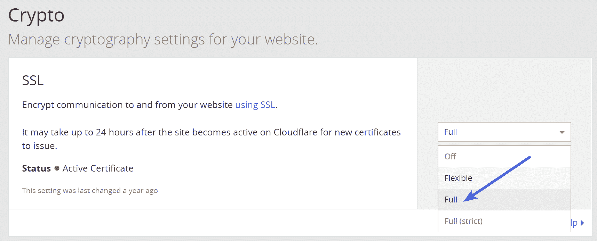

Set Cloudflare crypto level to full


你可以使用他们的[总是使用 HTTPS 页面规则](https://support.cloudflare.com/hc/en-us/articles/204144518-How-do-I-redirect-all-visitors-to-HTTPS-SSL-)将所有用户重定向到 HTTPS，而不会产生循环。使用 Cloudflare 需要注意的另一件事是他们的[转发 URL 重定向规则](https://support.cloudflare.com/hc/en-us/articles/218411427#redirects)。注意不要在域将自身指向目的地的地方创建重定向。这可能会导致无限重定向错误，并且受影响的 URL 将无法解析。

如果您使用的是 StackPath，他们有一个名为“源拉协议”的选项，只需要设置为 HTTPS。

### 仅使用 Cloudflare DNS

如果您只想使用 Cloudflare 的 DNS，而不是他们的代理/WAF 服务，那么您应该确保您的 DNS 记录设置为“仅 DNS”云将显示为“灰色”而不是“橙色”您可以在 Cloudflare 控制面板中的“DNS”选项卡下进行配置。


Cloudflare DNS only


## 检查你的 WordPress 站点设置

另一件要检查的事情是你的 WordPress 站点设置。您需要确保两个不同的字段设置正确，并且没有指向错误的域或不匹配。另一个常见的错误是，你没有使用正确的前缀来匹配网站的其余部分，无论是 www 还是 non-www。有时，人们会迁移主机或更改域名，而这些可能会在您不知不觉中发生变化。

*   WordPress 地址(URL): 到达你的博客的地址。
*   站点地址(URL): 你的 WordPress 核心文件的地址。

两者应该匹配，除非你[给 WordPress 自己的目录](https://wordpress.org/support/article/giving-wordpress-its-own-directory/)。

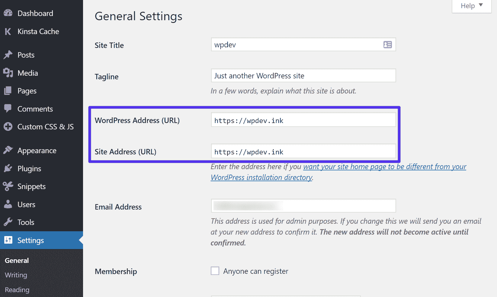

WordPress address


很有可能你无法访问你的 WordPress 仪表盘。所以你能做的就是**通过在你的 wp-config.php 文件**中输入值来覆盖上面的设置。

wp-config.php 文件通常位于你的 WordPress 站点的根目录，可以通过 FTP 、SSH 或 WP-CLI[访问。要对 WP_HOME 和 WP_SITEURL 进行硬编码，只需在文件顶部输入以下代码，更改值以反映您的域。](https://kinsta.com/knowledgebase/how-to-use-sftp/)

```
define('WP_HOME','https://yourdomain.com');
define('WP_SITEURL','https://yourdomain.com');
```

下面是一个例子，你的 wp-config.php 文件可能会是什么样子。


Change WordPress URL in wp-config.php file


或者，如果你喜欢，这里有两种额外的方法可以改变你的 WordPress URLs，而不需要访问你的管理面板:

*   [直接在数据库中更改 WordPress URL](https://kinsta.com/knowledgebase/wordpress-change-url/#wordpress-url-database)
*   [用 WP-CLI 更改 WordPress URL](https://kinsta.com/knowledgebase/wordpress-change-url/#wordpress-url-wp-cli)

一旦您手动设置了它，您就可以浏览您的站点来验证它是否修复了重定向循环。

### 多站点

如果您在[多站点](https://kinsta.com/blog/wordpress-multisite/)上更改域名，请确保也检查`wp_blogs`表。我们已经看到人们做了错误的搜索和替换，导致了无限的重定向循环。这是因为网络站点与子站点不匹配。

`wp_#_options`:每一个子站点都有一组对应于`wp_blogs`表中`blog_id`的表。转到`wp_#_options`表，其中#对应于`blog_id`，并更新该表中的“SITEURL”和“HOME”设置。

## 暂时禁用 WordPress 插件

说到 WordPress，暂时[禁用你所有的 WordPress 插件](https://kinsta.com/knowledgebase/disable-wordpress-plugins/)可能是发现问题的快速方法。例如，[重定向](https://wordpress.org/plugins/redirection/)或 Yoast SEO premium 等插件让你[实现重定向](https://kinsta.com/blog/wordpress-redirect/)。有时，这些插件的设置或更新可能会与服务器上已经设置的重定向发生冲突，从而导致重定向循环。

记住，如果你只是简单地禁用一个插件，你不会丢失任何数据。很有可能你不能访问 WordPress admin，所以你需要通过 SFTP 登录到你的服务器，然后重命名你的插件文件夹，比如 plugins_old。然后再次检查您的网站。


SFTP rename plugins folder


如果成功了，那么你需要一个接一个的测试每个插件。将你的插件文件夹重新命名为“插件”,然后一个接一个地在 if 里面重新命名每个插件文件夹，直到你找到它。您也可以尝试首先在一个[中转站点](https://kinsta.com/help/staging-environment/)上复制它。


重命名插件文件夹


## 检查服务器上的重定向

除了服务器上的 HTTP 到 HTTPS 重定向之外，检查并确保没有任何额外的重定向设置错误也是很好的。例如，一个错误的 301 重定向回自己可以关闭您的网站。通常，这些可以在服务器的配置文件中找到。

### 阿帕奇。htaccess 文件

Kinsta 只使用 Nginx，但是如果你使用的是运行 Apache 的 WordPress 主机，很可能你的`.htaccess`文件中有一个错误的规则。按照下面的步骤从头重新创建一个新的。

首先，[通过 FTP](https://kinsta.com/knowledgebase/how-to-use-sftp/) 或 SSH 登录到你的站点，将你的`.htaccess`文件重命名为`.htaccess_old`。这可以确保您有一个备份。

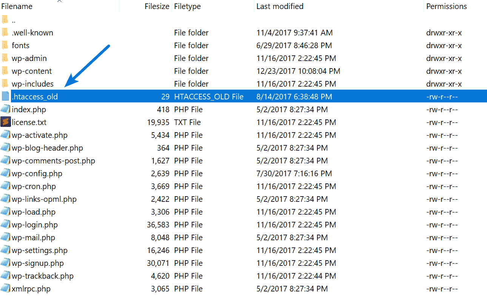

Rename .htaccess file


通常要重新创建这个文件，你可以简单地在 WordPress 中重新保存你的[永久链接](https://kinsta.com/blog/wordpress-permalinks/)。然而，如果你正处于 ERR_TOO_MANY_REDIRECTS 错误中，你很可能无法访问你的 WordPress admin，所以这不是一个选项。因此，您可以创建一个新的`.htaccess`文件，并输入以下内容。然后上传到你的服务器。以下使用默认设置。

```
# BEGIN WordPress
<IfModule mod_rewrite.c>
RewriteEngine On
RewriteBase /
RewriteRule ^index\.php$ - [L]
RewriteCond %{REQUEST_FILENAME} !-f
RewriteCond %{REQUEST_FILENAME} !-d
RewriteRule . /index.php [L]
</IfModule>
# END WordPress
```

更多例子见 [WordPress Codex](https://wordpress.org/support/article/htaccess/) ，比如多站点的默认`.htaccess`文件。


我们将有效网站管理的知识规模化，并将其转化为电子书和视频课程。点击[这里](https://kinsta.com/ebooks/wordpress/manage-multiple-wordpress-sites/?utm_campaign=how-to-speed-up-your-wordpress-site&utm_source=blog-knowledgebase&utm_medium=video)下载 2020 年管理 40 多个 WordPress 网站指南！

### Nginx 配置

如果您的主机使用 Nginx，这个文件可能会有点棘手，因为配置文件可能会因主机提供商而有所不同。我们建议联系您的主机，让他们检查您的配置文件，查找任何可能导致重定向循环或过多重定向的内容。

如果你是 Kinsta 的客户，你首先要确认你没有在我们的[重定向工具](https://kinsta.com/help/redirect-rules/)中设置错误的重定向。下面是一个从`https://domain.com/`重定向回自身的简单例子，这会导致重定向循环。


Bad 301 redirect


当位置 URL 包含在“重定向自”和“重定向至”中时，这种情况也很常见

例如，以下情况会导致重定向循环:

**重定向自:** `^/blog/about` **重定向至:** `https://domain.com/blog/about-me`

为什么？因为一旦进程到了`^/blog/about`，剩下的部分`-me`就不重要了，会造成死循环。您必须指定字符串的结尾和起始点。下面是您应该如何解决这个问题:

**重定向自:** `^/blog/about<kinsta-advanced-cta language="en_US" type-int-post="17415" type-int-position="2" **重定向至:** `https://domain.com/blog/about-me`

$字符将告诉 Nginx 停止并匹配请求，前提是字符串正好在那里，但其后没有任何内容。

当然，您可以随时打开[支持票](https://kinsta.com/help/wordpress-support-ticket/)，我们会为您检查。

### 错误配置的反向代理

ERR_TOO_MANY_REDIRECTS 错误的另一个常见原因是您正在使用一个[反向代理](https://kinsta.com/blog/reverse-proxy/)。反向代理可能非常复杂，如果配置错误，很容易将你的 WordPress 站点发送到重定向循环中。同样，如果您是 Kinsta 的客户，我们的支持团队可以在这方面提供帮助。

[Website stuck in an infinite redirection loop? 🛣 Check out these recommendations on how to get back up and running fast.Click to Tweet](https://twitter.com/intent/tweet?url=https%3A%2F%2Fbit.ly%2F2YSZlWI&via=kinsta&text=Website+stuck+in+an+infinite+redirection+loop%3F+%F0%9F%9B%A3+Check+out+these+recommendations+on+how+to+get+back+up+and+running+fast.&hashtags=WordPress%2Cwebdev)

## 摘要

重定向循环有时很难追踪。但是希望上面的一些故障诊断步骤可以帮助您解决 ERR_TOO_MANY_REDIRECTS 错误。如果我们错过了什么，请在下面的评论中告诉我们。

* * *

让你所有的[应用程序](https://kinsta.com/application-hosting/)、[数据库](https://kinsta.com/database-hosting/)和 [WordPress 网站](https://kinsta.com/wordpress-hosting/)在线并在一个屋檐下。我们功能丰富的高性能云平台包括:

*   在 MyKinsta 仪表盘中轻松设置和管理
*   24/7 专家支持
*   最好的谷歌云平台硬件和网络，由 Kubernetes 提供最大的可扩展性
*   面向速度和安全性的企业级 Cloudflare 集成
*   全球受众覆盖全球多达 35 个数据中心和 275 多个 pop

在第一个月使用托管的[应用程序或托管](https://kinsta.com/application-hosting/)的[数据库，您可以享受 20 美元的优惠，亲自测试一下。探索我们的](https://kinsta.com/database-hosting/)[计划](https://kinsta.com/plans/)或[与销售人员交谈](https://kinsta.com/contact-us/)以找到最适合您的方式。