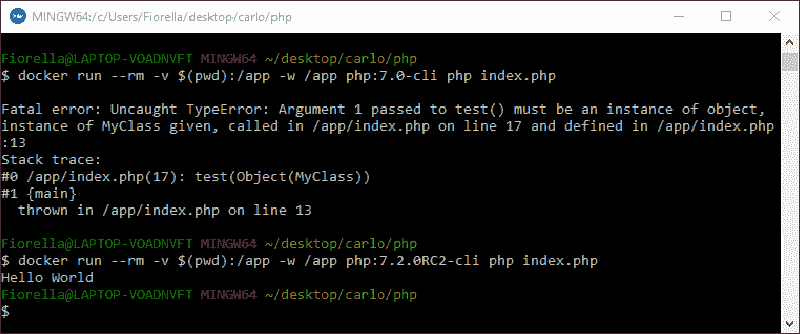
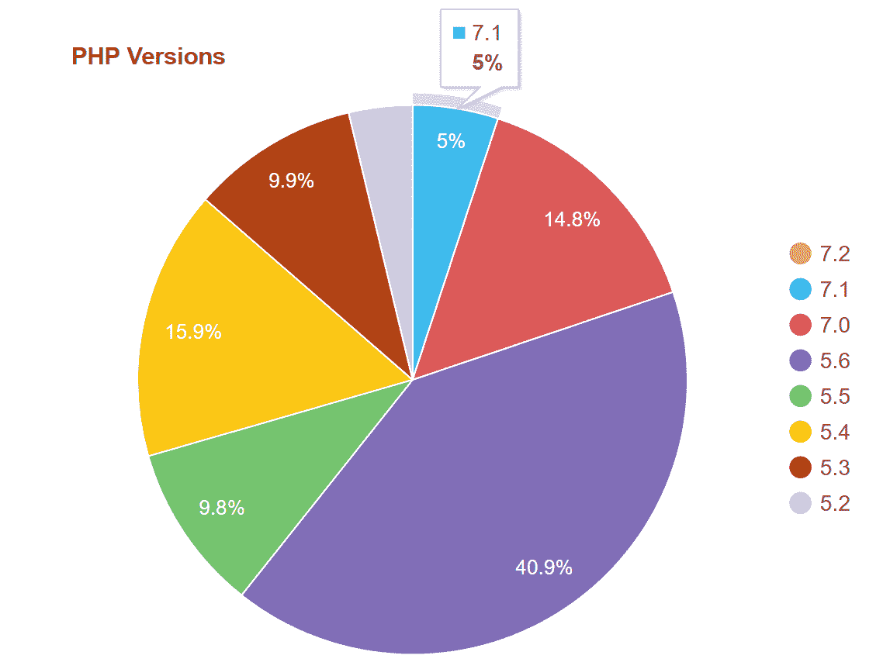
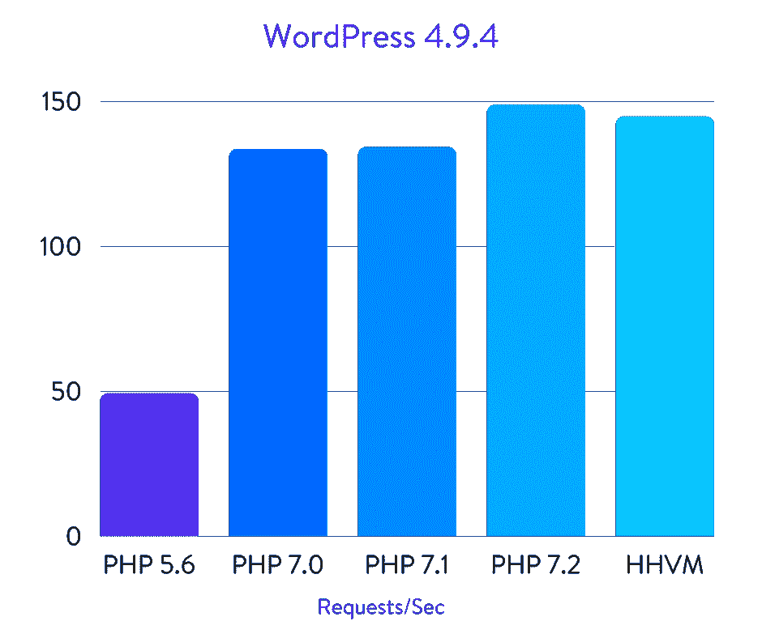
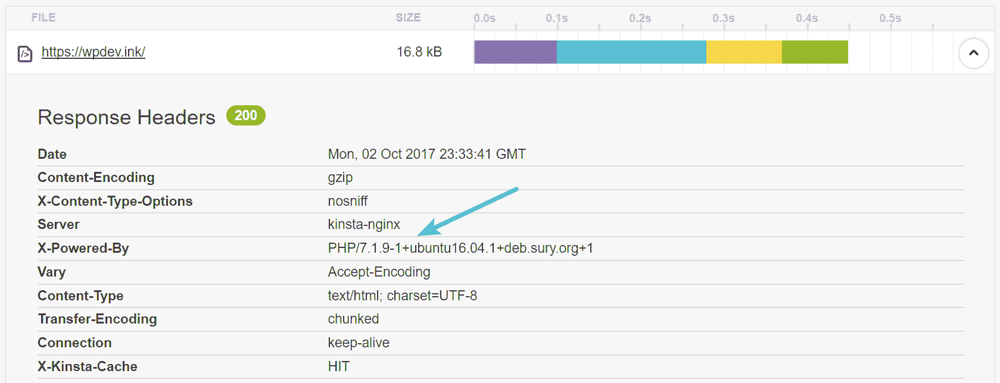
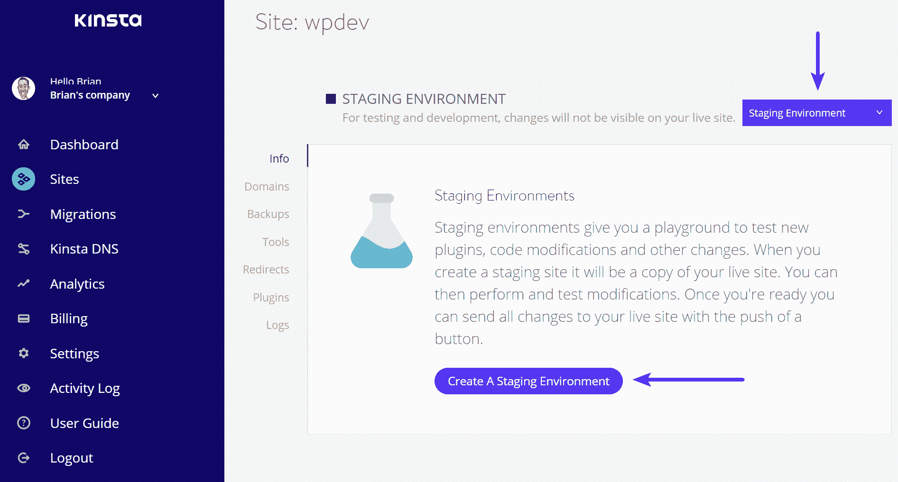
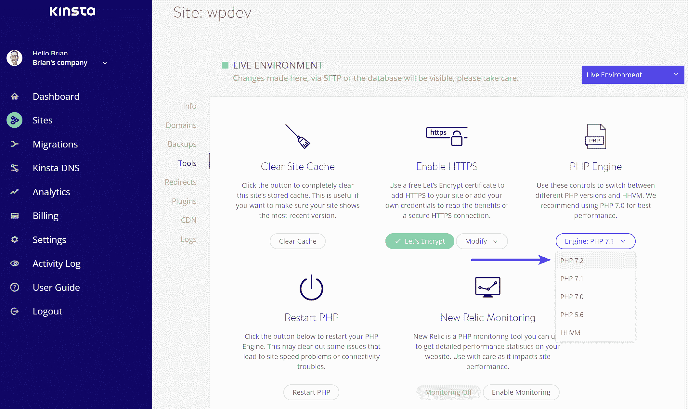

# PHP 7.2 的新特性(现已推出)

> 原文:[https://kinsta.com/blog/php-7-2/](https://kinsta.com/blog/php-7-2/)

[PHP 7.2 已经于 11 月 30 日正式发布](http://php.net/archive/2017.php#id2017-11-30-1)。这个版本有新的特性、功能和改进，允许我们编写更好的代码。在本帖中，我们将介绍 PHP 7.2 中一些最有趣的语言特性。

**更新:** [PHP 8.0](https://kinsta.com/feature-updates/php-8/) 现已对所有 Kinsta 客户端开放。

您可以在[意见征询](https://wiki.php.net/rfc#php_next_72)页面上看到完整的变更列表。

## 核心改进

### 参数类型声明

从 PHP 5 开始，我们被允许在函数声明中指定期望被传递的参数类型。如果给定值的类型不正确，PHP 就会抛出一个错误。

> [参数类型声明](http://php.net/manual/en/functions.arguments.php#functions.arguments.type-declaration)(也称为**类型提示**)指定预期传递给函数或类方法的变量的类型。

这里有一个例子:

```
class MyClass {
	public $var = 'Hello World';
}

$myclass = new MyClass;

function test(MyClass $myclass){
	return $myclass->var;
}

echo test($myclass);
```

在这段代码中，**测试**函数期望 MyClass 的**实例。不正确的数据类型会导致以下致命错误:**


> Kinsta 把我宠坏了，所以我现在要求每个供应商都提供这样的服务。我们还试图通过我们的 SaaS 工具支持达到这一水平。
> 
> <footer class="wp-block-kinsta-client-quote__footer">
> 
> 
> 
> <cite class="wp-block-kinsta-client-quote__cite">Suganthan Mohanadasan from @Suganthanmn</cite></footer>

[View plans](https://kinsta.com/plans/)

```
Fatal error: Uncaught TypeError: Argument 1 passed to test() must be an instance of **MyClass**, string given, called in /app/index.php on line 12 and defined in /app/index.php:8
```

因为 PHP 7.2 [类型提示](https://wiki.php.net/rfc/object-typehint)可以和**对象**数据类型一起使用，并且这种改进允许声明一个通用对象作为函数或方法的参数。这里有一个例子:

```
class MyClass {
	public $var = '';
}

class FirstChild extends MyClass {
	public $var = 'My name is Jim';
}
class SecondChild extends MyClass {
	public $var = 'My name is John';
}

$firstchild = new FirstChild;
$secondchild = new SecondChild;

function test(object $arg) {
	return $arg->var;
}

echo test($firstchild);

echo test($secondchild);
```

在这个例子中，我们调用了测试函数两次，每次调用传递不同的对象。这在以前的 PHP 版本中是不可能的。



Testing type hints with PHP 7.0 and PHP 7.2 in Docker


### 对象返回类型声明

如果参数类型声明指定函数参数的预期类型，则返回类型声明指定返回值的预期类型。

> [返回类型声明](http://php.net/manual/en/functions.returning-values.php#functions.returning-values.type-declaration)指定函数预期返回的变量类型。

从 PHP 7.2 开始，我们被允许对**对象**数据类型使用返回类型声明。这里有一个例子:

```
class MyClass {
	public $var = 'Hello World';
}

$myclass = new MyClass;

function test(MyClass $arg) : object {
	return $arg;
}

echo test($myclass)->var;
```

以前的 PHP 版本抛出了以下致命错误:

```
Fatal error: Uncaught TypeError: Return value of test() must be an instance of object, instance of MyClass returned in /app/index.php:10
```

当然，在 PHP 7.2 中，这段代码呼应了**‘Hello World’**。

### 参数类型扩大

PHP 目前不允许子类和它们的父类或接口之间的参数类型有任何差异。那是什么意思？
考虑以下代码:

```
<?php
class MyClass {
	public function myFunction(array $myarray) { /* ... */ }
}

class MyChildClass extends MyClass {
	public function myFunction($myarray) { /* ... */ }
}
```

这里我们省略了子类中的参数类型。在 PHP 7.0 中，这段代码会产生以下警告:

```
Warning: Declaration of MyChildClass::myFunction($myarray) should be compatible with MyClass::myFunction(array $myarray) in %s on line 8
```

从 PHP 7.2 开始，[我们可以在不破坏任何代码的情况下省略子类](https://wiki.php.net/rfc/parameter-no-type-variance)中的类型。这个提议将允许我们升级类来使用库中的类型提示，而不需要更新所有的子类。

### 列表语法中的尾随逗号

数组中最后一项后的尾随逗号是 PHP 中的有效语法[，有时鼓励使用](http://php.net/manual/en/function.array.php)以便轻松添加新项，避免因缺少逗号而导致的解析错误。从 PHP 7.2 [开始，我们被允许在](https://wiki.php.net/rfc/list-syntax-trailing-commas)[分组名称空间](http://php.net/manual/en/language.namespaces.importing.php#language.namespaces.importing.group)中使用尾随逗号。

查看列表语法中的[结尾逗号，以更好地了解 RFC 和一些代码示例。](https://wiki.php.net/rfc/list-syntax-trailing-commas)

## 安全改进

### 密码哈希中的 Argon2

[Argon2](https://en.wikipedia.org/wiki/Argon2) 是一种强大的哈希算法，被选为 2015 年密码哈希竞赛的获胜者，PHP 7.2 将为我们带来它，作为 [Bcrypt](https://en.wikipedia.org/wiki/Bcrypt) 算法的安全替代方案。
新的 PHP 版本引入了 [PASSWORD_ARGON2I](https://wiki.php.net/rfc/argon2_password_hash) 常量，现在可以在 [password_*](http://php.net/manual/en/ref.password.php) 函数中使用:

```
password_hash('password', PASSWORD_ARGON2I);
```

与仅采用一个成本因子的 Bcrypt 不同，Argon2 采用三个成本因子，区别如下:

## 注册订阅时事通讯


### 想知道我们是怎么让流量增长超过 1000%的吗？

加入 20，000 多名获得我们每周时事通讯和内部消息的人的行列吧！

[Subscribe Now](#newsletter)

*   一个**内存开销**，它定义了哈希过程中应该消耗的 KiB 数(默认值为 1<10，或 1024 KiB，或 1 MiB)
*   定义哈希算法迭代次数的**时间成本**(默认为 2)
*   一个**并行因子**，它设置散列过程中将使用的并行线程的数量(默认为 2)

三个新常数定义了默认成本系数:

*   **PASSWORD _ argon 2 _ DEFAULT _ MEMORY _ COST**
*   **PASSWORD _ argon 2 _ DEFAULT _ TIME _ COST**
*   **PASSWORD _ argon 2 _ DEFAULT _ THREADS**

这里有一个例子:

```
$options = ['memory_cost' => 1<<11, 'time_cost' => 4, 'threads' => 2];
password_hash('password', PASSWORD_ARGON2I, $options);
```

更多信息见 [Argon2 密码散列](https://wiki.php.net/rfc/argon2_password_hash)。

### 作为 PHP 核心的一部分

从 7.2 版本开始，PHP 将[钠库](https://wiki.php.net/rfc/libsodium)包含到核心中。[libna](https://www.gitbook.com/book/jedisct1/libsodium/details)是一个跨平台和跨语言的库，用于加密、解密、签名、密码散列等等。
该图书馆之前[可通过 PECL](https://pecl.php.net/package/libsodium) 获得。
有关 lib 钠函数的文档列表，请参考库[快速入门指南](https://paragonie.com/book/pecl-libsodium/read/01-quick-start.md)。
参见 [PHP 7.2:第一个将现代密码学加入其标准库的编程语言](https://dev.to/paragonie/php-72-the-first-programming-language-to-add-modern-cryptography-to-its-standard-library)。

## 贬值

以下是 PHP 7.2 [不推荐使用的函数和特性](https://wiki.php.net/rfc/deprecations_php_7_2)的列表，这些函数和特性将在 PHP 8.0 之前删除:

PHP 5.1 中的 **__autoload** 函数已经被 [spl_autoload_register](http://php.net/spl_autoload_register) 取代。现在在编译过程中遇到它时会抛出一个弃用通知。

当抛出非致命错误时，在局部范围内创建 **$php_errormsg** 变量。既然 PHP 7.2 [应该用 error_get_last](http://php.net/error_get_last) 和 [error_clear_last](http://php.net/manual/en/function.error-clear-last.php) 代替。

**create_function()** 允许使用生成的函数名、参数列表和作为参数提供的主体代码创建函数。由于安全问题和糟糕的性能，它已被标记为不推荐使用，而鼓励使用附件。

**设置为非零值的 mbstring.func_overload** ini 设置已被标记为不推荐使用。

Struggling with downtime and WordPress problems? Kinsta is the hosting solution designed to save you time! [Check out our features](https://kinsta.com/features/)

**(未设置)cast** 是一个总是返回 null 的表达式，被认为是无用的。

[parse_str()](http://php.net/parse_str) 如果提供了第二个参数，则将查询字符串解析为数组，如果没有使用，则解析为局部符号表。由于安全原因，[不鼓励](http://php.net/manual/en/security.globals.php)在函数范围内动态设置变量，所以使用没有第二个参数的 **parse_str()会抛出一个反对通知。**

**gmp_random()** 被认为是平台相关的，将被弃用。用 [gmp_random_bits()](http://php.net/manual/en/function.gmp-random-bits.php) 和 [gmp_random_rage()](http://php.net/manual/en/function.gmp-random-range.php) 代替。

**each()** 用于迭代数组，很像 **foreach()** ，但是 **foreach()** 更好，有几个原因，包括快 10 倍。现在，循环中的第一次调用将抛出弃用。

**assert()** 函数检查给定的断言，如果结果为**假**，则采取适当的措施。带字符串参数的 **assert()的用法现在已被否决，因为它打开了一个 RCE 漏洞。 [zend.assertion](http://php.net/manual/en/ini.core.php#ini.zend.assertions) ini 选项可用于阻止断言表达式的求值。**

**$errcontext** 是一个数组，包含错误生成时存在的局部变量。它作为最后一个参数传递给用[函数 set_error_handler()](http://php.net/manual/en/function.set-error-handler.php) 设置的错误处理程序。

## PHP 7.2 对 WordPress 用户意味着什么？

据官方 [WordPress 统计页面](https://wordpress.org/about/stats/)显示，截至本文撰写之时，只有 19.8%的 WordPress 用户升级到了 PHP 7。而只有 5%的人在使用 [PHP 7.1](https://kinsta.com/blog/php-7-1-0/) 。您可以看到，超过 40%的大多数用户仍然在运行 PHP 5.6。更可怕的是，超过 39%的用户正在使用不支持的 PHP 版本。截至 2016 年 12 月，WordPress.org 实际上将他们的[官方推荐](https://wordpress.org/about/requirements/)从 PHP 5.6 升级到 PHP 7 或更高版本。



WordPress PHP 7.1 stats


从性能的角度来看，上面的数字尤其令人沮丧，因为 PHP 7 已经显示出明显更快。以下是一些统计数据:

*   官方 PHP 基准测试表明，与 PHP 5.6 相比，PHP 7 允许系统每秒执行两倍的请求，而延迟几乎是 5.6 的一半。
*   Christian Vigh 也发表了一篇 [PHP 性能对比](https://www.phpclasses.org/blog/post/493-php-performance-evolution.html)文章，他发现 PHP 5.2 比 PHP 7 慢 400%。

我们还在 2018 年用 [PHP 5.6 vs PHP 7 vs HHVM](https://kinsta.com/blog/php-benchmarks/) 运行了自己的性能基准。与上面的基准类似，我们看到 PHP 7.2 每秒执行的事务(请求)几乎是 PHP 5.6 的三倍。



WordPress benchmarks


*   WordPress 4.9.4 PHP 5.6 基准测试结果:49.18 请求/秒
*   WordPress 4.9.4 PHP 7.0 基准测试结果:133.55 请求/秒
*   WordPress 4.9.4 PHP 7.1 基准测试结果:134.24 请求/秒
*   WordPress 4.9.4 **PHP 7.2 基准测试结果** : **148.80 req/sec？**
*   HHVM 基准测试结果:144.76 请求/秒

许多更新缓慢，仅仅是因为测试所有新的第三方插件和主题以确保它们正常运行需要时间。但是很多时候，归结起来就是他们还没有做。不确定你运行的是什么版本的 PHP？最简单的检查方法之一是使用类似于 [Pingdom](https://kinsta.com/blog/pingdom-speed-test/) 或 Google Chrome Devtools 的工具。第一个 HTTP 请求头通常会显示版本。



Check version of PHP


这依赖于主机不修改 X-Powered-By 报头值。如果他们这样做了，你可能看不到你的 PHP 版本，在这种情况下，你需要通过 FTP 上传一个文件。或者你也可以主动去问主人。

### 更新到 PHP 7.2

PHP 7.2 还没有完全发布，但是一旦发布，你就可以开始测试了。你可以[在本地](https://kinsta.com/blog/install-wordpress-locally/)测试你的 WordPress 站点，或者在像 [Docker](https://docs.docker.com/get-started/) 这样的环境中检查你的脚本，它允许你从命令行测试不同版本的 PHP。

或者，您可以利用一个临时环境，因为这将更类似于一个实际的生产站点。12 月 4 日，Kinsta 向所有客户端发布了 PHP 7.2。只需轻轻一点，您就可以轻松创建一个[临时环境](https://kinsta.com/help/staging-environment/)。



Test PHP 7.2 in staging environment


只需点击一下“工具”下的 PHP 引擎，你就可以开始测试，以确保你的第三方插件和主题的兼容性。一旦你确认一切正常，你可以将你的生产站点升级到 PHP 7.2 或者[将你的临时站点升级到 live](https://kinsta.com/help/push-staging-live/) 。



Change to PHP 7.2


## 结论

准备好转 PHP 7.2 了吗？希望现在您至少已经过渡到 PHP 7 了。如果您还没有，现在是开始测试的好时机。所以，升级你的脚本，检查你的代码，让我们知道你对 PHP 7.2 的第一印象。

推荐阅读:[PHP 死了](https://kinsta.com/blog/is-php-dead/)？

* * *

让你所有的[应用程序](https://kinsta.com/application-hosting/)、[数据库](https://kinsta.com/database-hosting/)和 [WordPress 网站](https://kinsta.com/wordpress-hosting/)在线并在一个屋檐下。我们功能丰富的高性能云平台包括:

*   在 MyKinsta 仪表盘中轻松设置和管理
*   24/7 专家支持
*   最好的谷歌云平台硬件和网络，由 Kubernetes 提供最大的可扩展性
*   面向速度和安全性的企业级 Cloudflare 集成
*   全球受众覆盖全球多达 35 个数据中心和 275 多个 pop

在第一个月使用托管的[应用程序或托管](https://kinsta.com/application-hosting/)的[数据库，您可以享受 20 美元的优惠，亲自测试一下。探索我们的](https://kinsta.com/database-hosting/)[计划](https://kinsta.com/plans/)或[与销售人员交谈](https://kinsta.com/contact-us/)以找到最适合您的方式。