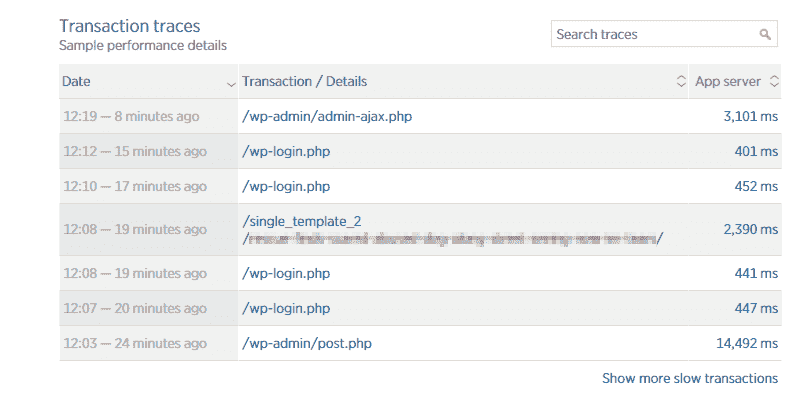
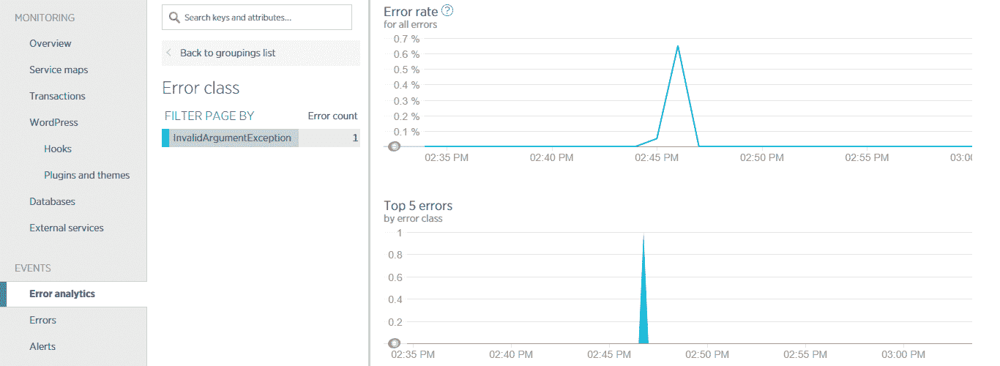
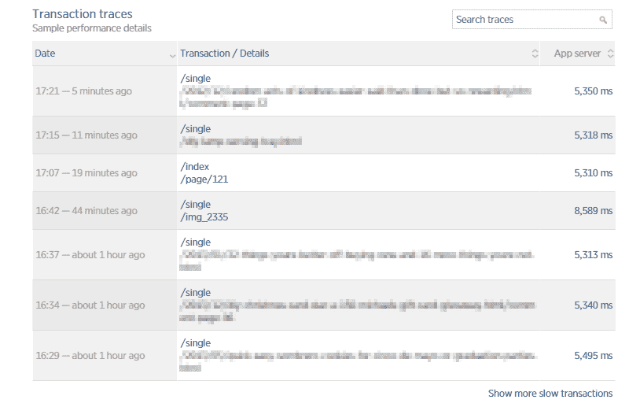
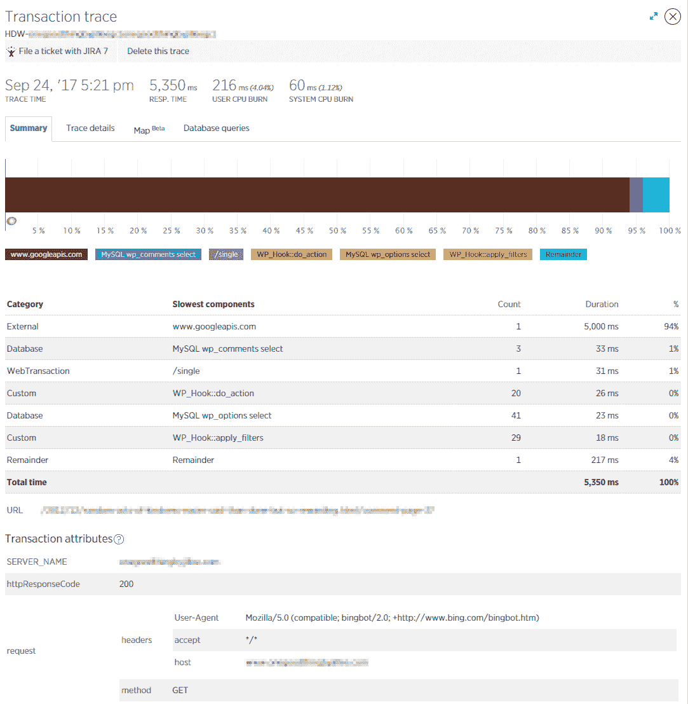
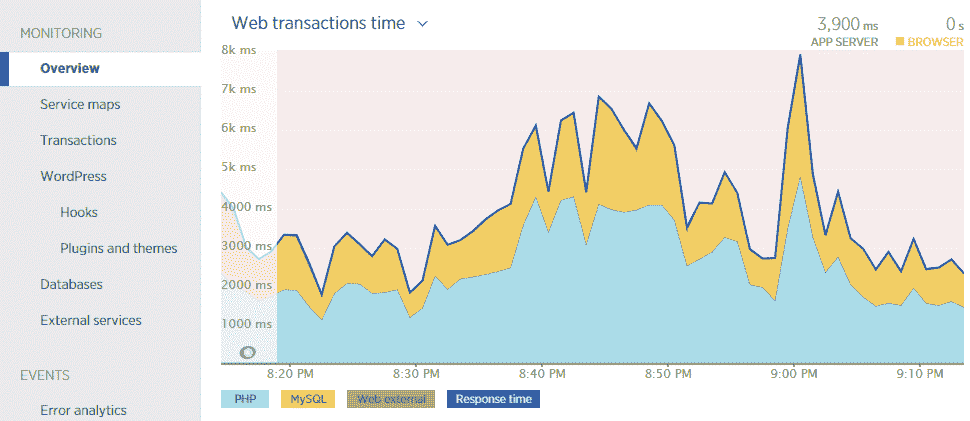
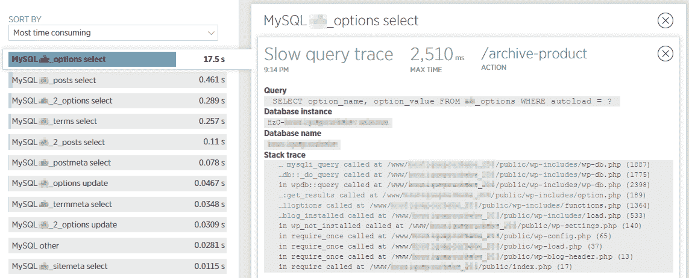

# 如何用 New Relic 找到 WordPress 的性能瓶颈

> 原文:[https://kinsta.com/blog/wordpress-performance-new-relic/](https://kinsta.com/blog/wordpress-performance-new-relic/)

[New Relic APM](https://newrelic.com/application-monitoring) 是一个强大的工具，它可以深入 WordPress 网站的内部工作，找出插件、主题模板文件、数据库查询、外部调用或编码错误[导致网站性能问题](https://kinsta.com/learn/speed-up-wordpress/)。

在 Kinsta，我们的客户可以自由地[添加他们自己的 New Relic 许可证](https://kinsta.com/help/custom-new-relic-tracking/)，这样他们就可以享受这个工具提供的强大可见性。

如果你的主机提供商不提供新的遗迹集成，你可以自己设置，如果你的网站是托管在一个自我管理的私人环境。

然而，让新遗迹运行只是一个开始。如果你从未使用过 New Relic APM(也许即使你使用过)，你可能很难充分利用这个强大的工具。在本教程中，我们将向您展示如何使用 New Relic APM 来诊断和修复您的 WordPress 站点上的性能问题。

### Info

设置新遗迹似乎太难了？Kinsta 客户可以利用 100%免费的内置 [Kinsta APM 工具](https://kinsta.com/apm-tool/)。有了它，您就能够识别性能问题、瓶颈等。又快又容易。阅读如何在你的 WooCommerce 网站上使用[和](https://kinsta.com/blog/woocommerce-apm/)[如何提高你的会员网站速度](https://kinsta.com/blog/membership-website-speed/)。

准备好变得书呆子了吗？我们开始吧！

## 新遗迹 APM 快速概览

New Relic APM

那么什么是新遗迹 APM 呢？出于我们的目的，以下定义是合适的:

> New Relic APM 是一个 web 应用程序，它提供了关于你的 WordPress 站点性能的详细信息。

你通过给 PHP 添加一个扩展来安装 New Relic。该扩展监听 PHP 处理的每个请求，然后将信息发送回 New Relic 仪表板。然后，New Relic 将这些信息组织成一系列图表，您可以使用这些图表来诊断网站的性能问题。需要注意的是，HHVM 不支持新遗迹。

> 需要在这里大声喊出来。Kinsta 太神奇了，我用它做我的个人网站。支持是迅速和杰出的，他们的服务器是 WordPress 最快的。
> 
> <footer class="wp-block-kinsta-client-quote__footer">
> 
> 
> 
> <cite class="wp-block-kinsta-client-quote__cite">Phillip Stemann</cite></footer>

[View plans](https://kinsta.com/plans/)

让我们快速浏览一下 New Relic 的主要数据可视化。

### 概观

New Relic APM overview

概述提供了网站整体性能的快速快照。您不会从这个屏幕中诊断具体的问题，但是显示 PHP、MySQL 和外部调用如何协同工作的方便的编译可以为您指出正确的方向。

[了解有关 APM 概览页面的更多信息。](https://docs.newrelic.com/docs/apm/applications-menu/monitoring/apm-overview-page)

### 处理

New Relic transactions tab

交易标签是 New Relic 中最有用的标签。

学会喜欢事务选项卡，您将能够深入到缓慢的事务中，以识别数据库调用、外部资源或降低站点速度的代码瓶颈。transactions 视图中特别令人感兴趣的是慢速事务的列表。要查看列表，请向下滚动到 transactions 选项卡的底部，查看页面的右下部分。

New Relic transaction traces

在这里你会发现一个由 New Relic 捕获的最慢的交易列表。我们现在不会在这一部分花更多的时间，但是稍后我们会解释如何使用这一部分来诊断你的网站的问题。

[了解更多关于 New Relic APM 交易页面的信息。](https://docs.newrelic.com/docs/apm/applications-menu/monitoring/transactions-page)

### WordPress 挂钩

WordPress hooks

WordPress 钩子标签提供了所有 PHP 函数消耗时间的可视化，这些函数是通过 [WordPress 动作钩子](https://codex.wordpress.org/Plugin_API/Action_Reference)触发的。对于有经验的开发人员来说，这些信息非常有用，他们可以使用这些信息从重载的钩子开始向后工作，以确定钩子触发的函数。

### WordPress 插件和主题

WordPress plugins and themes

WordPress 插件和主题标签显示插件和活动主题消耗了多少 PHP 处理时间。如果一个插件或者你的站点主题消耗了大量的时间，这个页面可以帮助你快速发现引起问题的插件或者主题。

需要注意的是:**New Relic 中的 WordPress 插件和主题标签是最容易被误用的。**

当调查一个网站性能问题时，很容易默认先检查这个标签，然后简单地停用最耗时的插件。然而，这样做就是忽略了在《新遗迹》其他地方发现的有价值的信息。这类似于治标不治本。

插件可能由于配置错误而运行缓慢，例如由于使用了[不正确的 SMTP 端口号](https://kinsta.com/blog/smtp-port/)而导致成员管理插件运行缓慢。或者一个[插件可能没有被正确卸载](https://kinsta.com/blog/uninstall-wordpress-plugin/)。这是那种你可能通过在事务选项卡中钻取一个缓慢的事务而得到的信息，你永远也不会像 New Relic 报告的那样通过简单地停用最慢的插件来解决问题。

因此，请放心使用这个选项卡，但不要排除 New Relic 提供的其他信息。

### 数据库

New Relic MySQL overview

[databases 选项卡](https://docs.newrelic.com/docs/apm/applications-menu/monitoring/databases-slow-queries-page)让您识别消耗时间最多的数据库表和查询类型。New Relic 将这些信息与进行这些查询的交易联系起来。您可以使用这些信息来识别可能需要优化的数据库表和给数据库带来过大负载的模板文件。

### 外部服务

New Relic external services

大多数 WordPress 网站依赖于一些外部服务:

*   插件、主题和核心更新由 wordpress.org 以及插件和主题开发者提供。
*   许多插件与第三方 API 集成，如 WPMU DEV 的 Smush 图像优化插件(smushpro.wpmudev.org 来自上面的截图)。
*   聊天插件一般由[外部服务](https://kinsta.com/blog/third-party-performance/)提供动力。
*   许多网站都集成了社交媒体平台，以便在这些网络上共享内容时获得最佳的呈现和性能。

当这些外部服务中的任何一个停止及时响应时，它会使您的整个网站崩溃。

[外部服务选项卡](https://docs.newrelic.com/docs/apm/applications-menu/monitoring/external-services-page)允许您快速查看哪些外部服务消耗的时间最多。然后，您可以使用该信息来确定是速度问题(服务响应缓慢)还是数量问题(对外部资源的调用太多)，并努力解决该问题。

### 误差分析

New Relic error analytics

[错误分析标签](https://docs.newrelic.com/docs/apm/applications-menu/error-analytics/error-analytics-explore-events-behind-errors#start)报告在加载你的 WordPress 站点时遇到的 PHP 错误。这些错误被分组到不同的类中，这样您就可以快速看到生成了多少不同类型的错误。这些错误还与产生错误的实际事务相关联。如果选择一个特定的错误，还可以看到生成该错误的事务的完整堆栈跟踪。

可以把错误分析想象成一个组织得更好的 PHP 错误日志。当试图跟踪产生 PHP 错误的文件和发生这些错误的事务时，它可以证明是非常宝贵的。
T3】

## 调试低速加载的页面

我们的团队使用 New Relic 进行调试的最常见问题是某个特定页面或进程需要花费非常长的时间来加载。当这种情况发生时，New Relic APM 中的**事务**选项卡几乎肯定是第一个要去的地方。

诊断一个加载缓慢的页面需要遵循的过程非常简单:

1.  复制慢事务。
2.  在新遗迹的慢速交易列表中找到交易。
3.  查看事务摘要和跟踪详细信息，以确定性能缓慢的原因。

让我们看一个这样的例子，以及如何使用 New Relic 来诊断这个问题。

 ## 注册订阅时事通讯

### 想知道我们是怎么让流量增长超过 1000%的吗？

加入 20，000 多名获得我们每周时事通讯和内部消息的人的行列吧！

[Subscribe Now](#newsletter)

### 步骤 1:复制交易

让我们看一个例子。在这个例子中，我们的客户在每次加载一篇博客文章时都会看到加载缓慢。所有其他页面加载正常，但个别职位需要几秒钟加载。

所以第一步是复制问题。在这种情况下，这意味着访问一个博客帖子几次，以确保 New Relic 捕捉到必要的日期。

注意:如果你的网站使用了页面缓存，这是我们在 Kinsta 的平台内置的，你需要在每次页面加载之间清除缓存。否则，你将从缓存中加载页面，而不是让 WordPress 生成页面。

### 第二步:找到慢交易

一旦您将慢速事务复制了几次，请转到 New Relic 并选择 Transactions 选项卡。然后向下滚动，直到在 New Relic 仪表板的右下部分看到慢速交易列表。

Slow transactions in New Relic

单击您正在调试的事务以查看详细信息。

### 步骤 3:查看交易摘要和跟踪详细信息

选择交易后，将显示交易摘要。

Slow transaction summary

该摘要让您可以看到对事务处理时间有贡献的组件的快照概述。在我们的示例事务中，对外部资源 www.googleapis.com 的调用负责 5000 毫秒的事务，而完成该事务总共需要 5350 毫秒。

虽然这是有用的信息，但 trace details 选项卡将提供我们需要的详细信息，以了解到底发生了什么。

Slow transaction trace details

trace details 选项卡提供了一个分层次的逐步瀑布图，显示了 PHP 在生成页面时处理的函数、数据库查询和外部调用。

在我们的示例事务中，跟踪细节揭示了对 Google analytics URL 的调用阻碍了这个过程。如果我们从这个请求开始向后看，它会启动一个名为`gapp_get_post_pageviews`的 PHP 函数。谷歌快速搜索该交易，发现它是谷歌分析文章浏览量插件的一部分。这个插件安装在网站上，用来给一个[粘性标题](https://kinsta.com/blog/sticky-header/)栏添加一个查看计数器。

New Relic 刚刚允许我们隔离粘性标题栏中的查看计数器，这是导致问题网站上单个博客帖子加载缓慢的主要因素。现在，这个站点的所有者确切地知道了在试图解决个别博客帖子加载缓慢的问题时应该以什么组件为目标。

Struggling with downtime and WordPress problems? Kinsta is the hosting solution designed to save you time! [Check out our features](https://kinsta.com/features/)

## 修复整体缓慢

我们为客户解决的第二个最常见的问题是抱怨整个网站加载缓慢。当每个事务都需要很长时间来加载时，可能会发生以下三种情况之一:

*   该网站急需服务器资源。
*   插件或活动主题导致问题。
*   网站数据库正在努力跟上查询的速度。

在 Kinsta，服务器资源问题很少发生，因为我们的可扩展虚拟机能够管理不同数量的负载。然而，如果网站缺乏 CPU 或 RAM，这可能会导致整体速度缓慢，New Relic 将不会锁定任何单个资源。因此，如果你确实看到整体速度缓慢，而 New Relic 表明网站的每个部分都有贡献，那么检查一下你的服务器负载，看看是否是服务器资源短缺造成的。

如果你的站点可以访问大量的服务器资源，那么下一个你想检查的地方[包括 WordPress 插件和主题标签，外部服务标签和数据库标签。](https://kinsta.com/blog/php-workers/#how-to-optimize-your-sites-php-worker-usage)

以下是总体速度缓慢的示例，可以使用这些选项卡进行诊断。

### 插件导致的整体速度缓慢

当一个插件导致整体速度变慢时，症状会根据插件正在执行的活动而有所不同。然而，在很多情况下，你会发现一个缓慢的插件会影响 WordPress 站点的每个页面。在下图中你看到的数据的网站的例子中，在网站的每个前端页面上都观察到整体缓慢。

以下是 New Relic 对网站上插件性能的评价。

WordPress plugins

您可以立即看到 **adinjector** 插件消耗的时间是第二慢的插件的 15 倍。

当你看到这样的数据时，你很容易马上认为这个插件编码很差或者无效。虽然有时是这样，但并不总是这样。插件配置错误、数据库缓慢或外部资源响应缓慢可能会导致插件消耗大量时间。

所以当你看到一个插件反应很慢的时候，检查一下 New Relic 中的其他几个屏幕来找到更多的信息是一个好主意。在决定停用插件是最好的或者唯一的方法之前，应该检查事务、数据库和外部资源。

### 外部服务导致的整体速度缓慢

如果一个网站依靠调用外部服务来产生页面浏览量，而那个服务停止响应或者花很长时间响应，结果可能是 WordPress 网站完全停止加载。

Top 5 external services

上面的图片来自制作上面的插件截图的同一个网站。如您所见，有一个外部服务在等待外部服务的总时间中占了很大一部分。

这个案例说明了为什么在得出结论之前有必要综合考虑信息。在这种情况下，被调用的服务是上一步中确定的插件的开发者。

这一信息给形势增添了一些微妙之处。本质上，问题不在于插件的代码。相反，看起来插件对开发者的网站进行了大量的调用，这些调用综合起来考虑，消耗了大量的处理时间。

如果我们更进一步，查看这个站点的一个缓慢的事务，我们可以看到这个外部调用似乎在检查有问题的插件的许可状态，这表明这个特定插件的许可可能已经过期。

在任何情况下，我们现在都可以通知该网站的所有者，adinjector 插件导致了缓慢的性能，而缓慢的性能是由于反复调用开发人员的网站来检查插件许可证的状态。

### 由不堪重负的数据库导致的整体速度缓慢

一个优化不佳的数据库会导致 WordPress 网站整体运行缓慢。我们一直推荐的一个优化是将数据库从 [MyISAM 转换成 InnoDB](https://kinsta.com/knowledgebase/convert-myisam-to-innodb/) 。在 New Relic 中，这个与数据库相关的慢度最有可能出现在两个地方:

*   首先，您将在概览中看到大量的 MySQL 活动。
*   其次，您会在 databases 选项卡中看到一个或多个数据库表消耗了大量时间。

从概览屏幕开始，一个数据库不完善的站点可能看起来像这样:

Web transactions time

要更好地了解是哪个数据库表或查询导致了问题，请转到 databases 选项卡。

MySQL overview

databases 选项卡将指出消耗时间最多的表和查询类型。如果您选择列表中的一个条目，您可以看到更多细节，包括一些示例查询。

Slow query – wp_options table

在这种情况下，数据指向 wp_options 表中自动加载的数据。果不其然，对 wp_options 表的快速分析证实，有将近 250 MB 的数据是从该表自动加载的，这使得该站点成为数据库维护和优化的明显候选。查看我们关于如何[优化 wp_options 表](https://kinsta.com/knowledgebase/wp-options-autoloaded-data/)和自动加载数据的更深入的帖子。

## 现在开始调试！

一旦你知道如何使用它，New Relic 可以成为在你的 WordPress 网站上识别 PHP 性能瓶颈的一个有价值的工具。为了充分利用 New Relic，了解 WordPress、理解每个标签报告的信息以及了解所有信息是如何相互关联的是至关重要的。

我们有另一个关于这个主题的有趣的案例研究，你一定要看看:[调试 WordPress 性能问题——事情发生清单](https://kinsta.com/blog/debugging-wordpress-performance/)

有什么新的遗迹 WordPress 小技巧吗？我们希望在下面的评论中听到他们。

* * *

让你所有的[应用程序](https://kinsta.com/application-hosting/)、[数据库](https://kinsta.com/database-hosting/)和 [WordPress 网站](https://kinsta.com/wordpress-hosting/)在线并在一个屋檐下。我们功能丰富的高性能云平台包括:

*   在 MyKinsta 仪表盘中轻松设置和管理
*   24/7 专家支持
*   最好的谷歌云平台硬件和网络，由 Kubernetes 提供最大的可扩展性
*   面向速度和安全性的企业级 Cloudflare 集成
*   全球受众覆盖全球多达 35 个数据中心和 275 多个 pop

在第一个月使用托管的[应用程序或托管](https://kinsta.com/application-hosting/)的[数据库，您可以享受 20 美元的优惠，亲自测试一下。探索我们的](https://kinsta.com/database-hosting/)[计划](https://kinsta.com/plans/)或[与销售人员交谈](https://kinsta.com/contact-us/)以找到最适合您的方式。