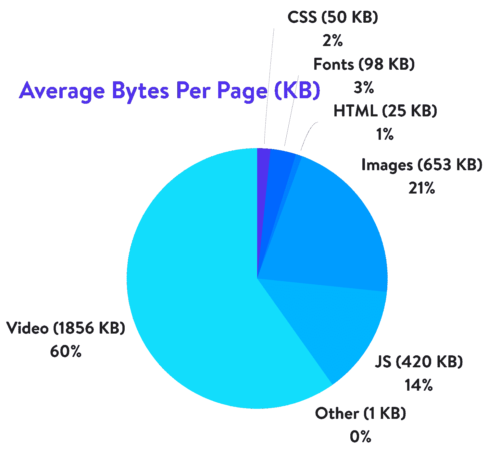
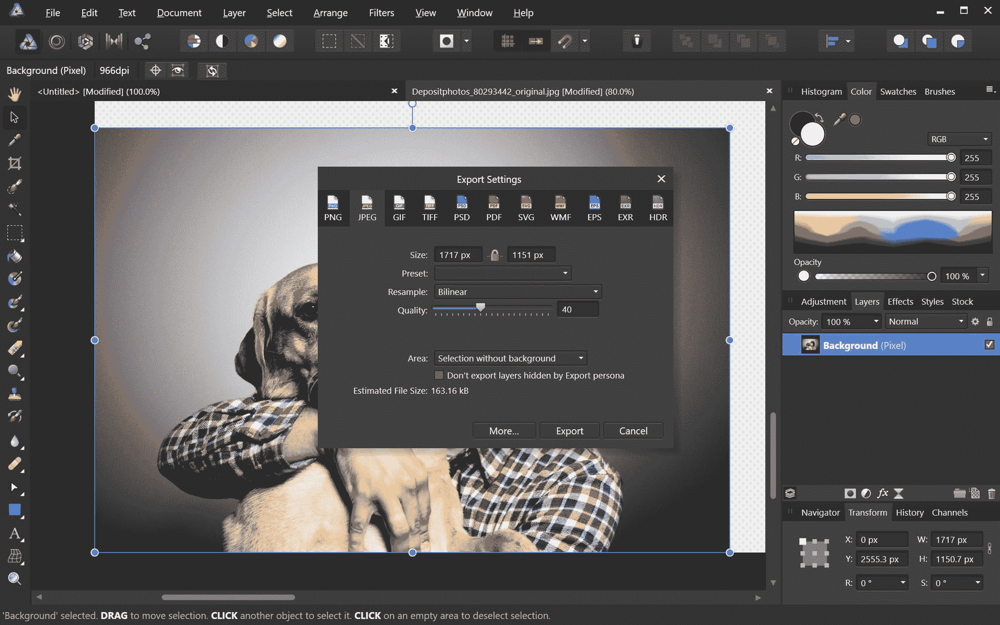
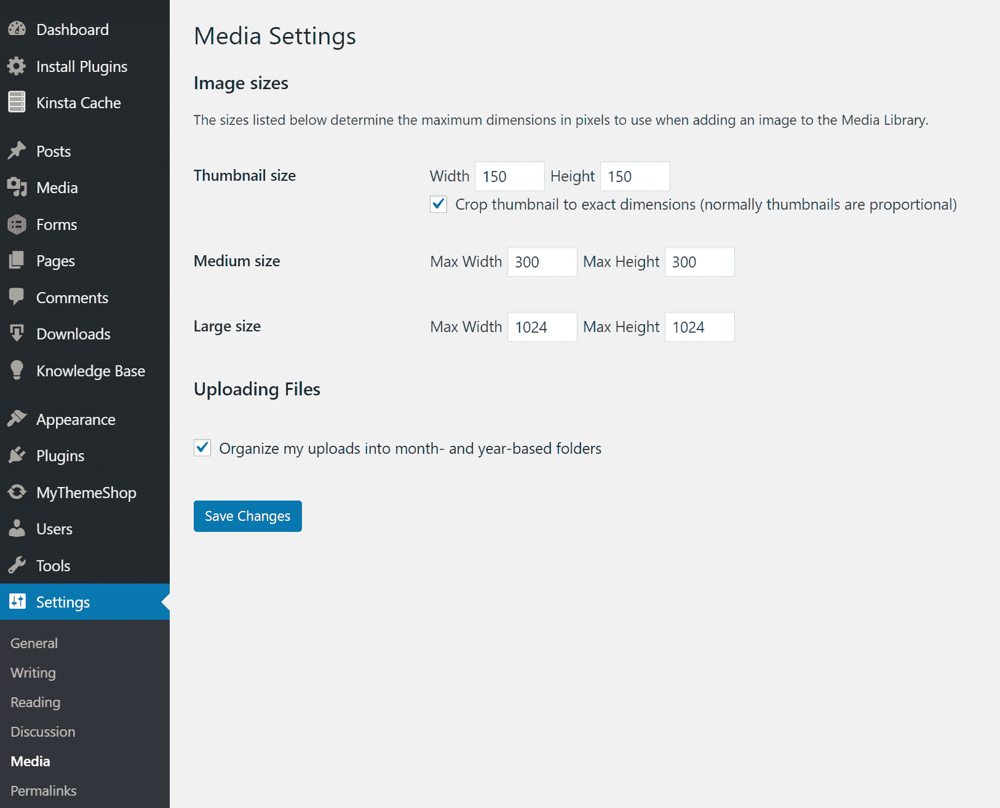
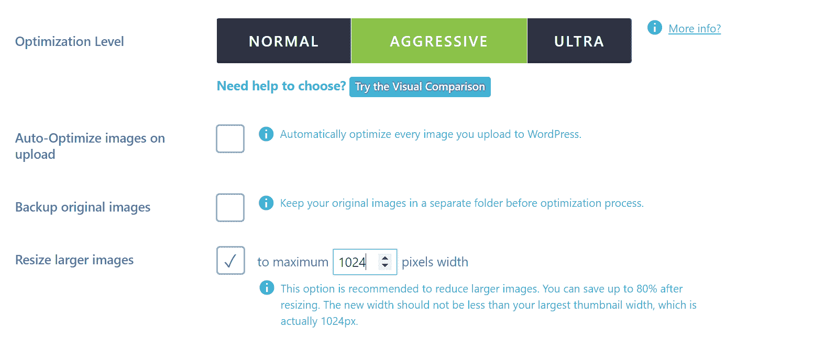
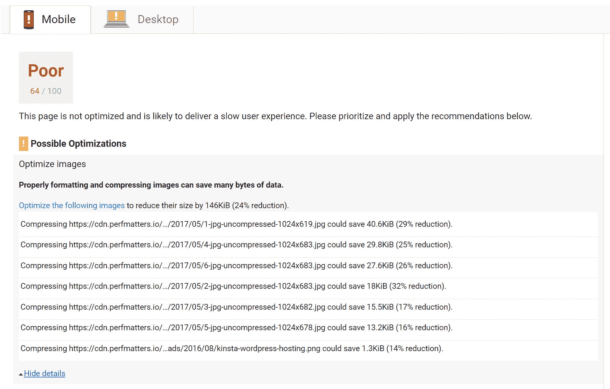

# 如何针对网页和性能优化图像

> 原文:[https://kinsta.com/blog/optimize-images-for-web/](https://kinsta.com/blog/optimize-images-for-web/)

相信我们，你不会希望谷歌讨厌你的网站。幸运的是，您可以减小图像的文件大小，以帮助提高网站的性能。

格式化它们的一个问题是修改经常会降低它们的质量(这反过来可能会让访问者讨厌你的网站)。只要你不把它们变丑，这不是一件坏事。

有一些技巧和技术可以让你减小图片的文件大小，并且仍然保持图片足够漂亮，可以骄傲地在你的网站上展示。

因此，让我们来看看如何格式化你的图像而不使它们变得难看，以及如何**为网页和性能**优化图像。

## 优化图像是什么意思？

大图片会降低你的网页速度，从而导致用户体验不佳。优化图像是使用插件或脚本**减少其文件大小**的过程，从而加快页面的加载时间。有损和无损压缩是两种常用的方法。

Support
 ### 查看我们的[视频指南](https://www.youtube.com/watch?v=rMKI-fLBTfM)为 SEO 优化图片

> Kinsta 把我宠坏了，所以我现在要求每个供应商都提供这样的服务。我们还试图通过我们的 SaaS 工具支持达到这一水平。
> 
> <footer class="wp-block-kinsta-client-quote__footer">
> 
> 
> 
> <cite class="wp-block-kinsta-client-quote__cite">Suganthan Mohanadasan from @Suganthanmn</cite></footer>

[View plans](https://kinsta.com/plans/)

## 格式化图像的好处

首先，为什么你需要格式化你的图像？有什么好处？优化图像的性能有很多好处。据 [HTTP Archive](https://httparchive.org/reports/page-weight) 统计，截至 2018 年 11 月，**图片平均占网页总权重的 21%**。所以当谈到[优化你的网站](https://kinsta.com/learn/speed-up-wordpress/)时，除了视频内容，图片是你应该首先开始的地方！

比脚本和字体更重要。具有讽刺意味的是，一个好的图像优化工作流程是最容易实现的事情之一，然而许多网站所有者忽略了这一点。

Average Bytes Per Page (KB)

下面来看看主要的好处。

*   这将提高你的页面加载速度(见下面的案例研究，它对你的速度有多大影响)。如果你的页面加载时间太长，你的访问者可能会厌倦等待，并转移到其他地方。有关优化页面加载时间的更多信息，请参见我们的[深度页面速度优化指南](https://kinsta.com/learn/page-speed/)。
*   结合一个伟大的 [SEO WordPress 插件](https://kinsta.com/blog/best-seo-plugins-for-wordpress/)它改善你的 [SEO](https://kinsta.com/blog/what-does-seo-stand-for/) 。您的网站在搜索引擎结果中的排名会更高。大文件会降低你网站的速度，而[搜索引擎](https://kinsta.com/blog/alternative-search-engines/)讨厌速度慢的网站。谷歌也有可能为谷歌图片搜索更快地抓取和索引你的图片。好奇你的流量有百分之几来自谷歌图片搜索？你可以使用一个 [Google Analytics WordPress](https://kinsta.com/blog/google-analytics-wordpress/) 插件或片段[来检查 Google 图片搜索流量](https://passion.digital/blog/how-to-check-image-traffic-in-ga/)。
*   创建备份会更快。
*   较小的图像文件使用较少的带宽。网络和浏览器会欣赏这一点。
*   在您的服务器上需要[更少的存储空间(这取决于您优化了多少缩略图)](https://kinsta.com/blog/disk-usage-wordpress/)

## 如何针对网页和性能优化图片？

格式化图像的主要目标是在最小文件大小和可接受的质量之间找到平衡。

几乎所有这些优化都有多种执行方式。最流行的方法之一是在上传到 [WordPress](https://kinsta.com/knowledgebase/what-is-wordpress/) 之前简单地压缩它们。通常，这可以在像 Adobe Photoshop 或 Affinity Photo 这样的工具中完成。其中一些任务也可以使用插件来执行，我们将在下面详细介绍。

改变你的 WordPress 主机来优化你的图片，你会发现页面加载速度提高了 45%以上。[免费试用 kin sta](https://hubs.ly/H0pklC_0)。

要考虑的两件主要事情是你使用的文件格式和压缩类型。通过选择正确的文件格式和压缩类型的组合，您可以将图像大小减少 5 倍。你必须试验每种图像或文件格式，看看哪种效果最好。

 ### 1.选择正确的文件格式

在你开始修改你的图像之前，确保你已经选择了最好的文件类型。有几种类型的文件可供您使用:

*   **PNG**–生成更高质量的图像，但文件也更大。是作为无损图像格式创建的，尽管它也可能是有损的。
*   **JPEG**–使用[有损和无损优化](https://kinsta.com/blog/lossy-compression/)。您可以调整质量级别，以获得质量和文件大小的良好平衡。
*   **GIF**–仅使用 256 种颜色。是动画形象的最佳选择。它只使用无损压缩。

还有其他几个，比如 JPEG XR 和 [WebP](https://kinsta.com/blog/webp/) ，但是它们并没有被[所有的浏览器](https://kinsta.com/browser-market-share/)普遍支持。理想情况下，对于色彩丰富的图像，你应该使用 JPEG 或 JPG，对于简单的图像，你应该使用 PNG。
(建议阅读: [JPG vs JPEG:了解最常见的图像文件格式](https://kinsta.com/blog/jpg-vs-jpeg/))

### 2.当心压缩质量和大小

这是一个过度压缩图像会发生什么的例子。第一种是使用非常低的压缩率，这将产生最高的质量(但文件更大)。第二种是使用非常高的压缩率，这导致图像质量非常低(但文件较小)。注:原图未动是 2.06 MB。

Low compression (high quality) JPG – 590 KB

High compression (low quality) JPG – 68 KB

如你所见，上面的第一张图片是 590 KB。这对于一张照片来说太大了！一般来说，如果你能将网页的总重量控制在 1 或 2 MB 以下，那是最好的。590 KB 已经是这个数字的四分之一了。第二个图像显然看起来很恐怖，但它只有 68 KB。你想要做的是在你的压缩率(质量)和文件大小之间找到一个合适的中间点。

因此，我们再次以中等压缩率拍摄了该图像，正如您在下面看到的，现在质量看起来不错，文件大小为 151 KB，这对于高分辨率照片来说是可以接受的。这比低压缩的原始照片小了近 4 倍。通常，为了获得最佳性能，png 等较简单的图像应该小于或等于 100 KB。

Medium compression (great quality) JPG – 151 KB

### 3.了解有损优化与无损优化

了解有两种类型的压缩可以使用也很重要，有损压缩和无损压缩。

**有损**–这是一个过滤器，可以消除一些数据。这将降低图像质量，所以你必须注意图像的缩小程度。文件大小可以减少很多。您可以使用 Adobe Photoshop、Affinity Photo 或其他图像编辑器等工具来调整图像的质量设置。我们上面使用的例子是使用有损压缩。

**无损**–这是一个压缩数据的过滤器。这不会降低质量，但需要在渲染之前对图像进行解压缩。您可以使用 Photoshop、 [FileOptimizer](https://nikkhokkho.sourceforge.io/static.php?page=FileOptimizer) 或 [ImageOptim](https://imageoptim.com/api) 等工具在桌面上执行无损压缩。

最好试验一下你的压缩技术，看看哪种压缩技术最适合每种图像或格式。如果您的工具有这个选项，请确保您将图像保存为 web 格式。这是许多图像编辑器中的一个选项，它将为您提供质量调整，以便您可以执行最佳压缩。你会损失一些质量，所以在不使图像难看的情况下，尝试找到最佳的平衡。

### 4.使用图像优化工具和程序

有很多工具和程序，有高级的也有免费的，你可以用来优化你的图片。

 ## 注册订阅时事通讯

### 想知道我们是怎么让流量增长超过 1000%的吗？

加入 20，000 多名获得我们每周时事通讯和内部消息的人的行列吧！

[Subscribe Now](#newsletter)

有些为您提供工具来执行您自己的优化，有些则为您完成工作。我们个人是 [Affinity Photo](https://affinity.serif.com/en-us/photo/) 的忠实粉丝，因为它很便宜，并且给你提供了与 Adobe Photoshop 几乎相同的功能。

Compressing photo in Affinity Photo

这里有一些额外的工具和程序可供查看:

*   [Adobe Photoshop](https://www.adobe.com/products/photoshop.html)
*   [Gimp](https://www.gimp.org/)
*   [Paint.NET](https://www.getpaint.net/index.html)
*   [吉萨世纪](http://www.lcdf.org/gifsicle/)
*   [JPEG Mini](https://www.jpegmini.com/)
*   [OptiPNG](https://optipng.sourceforge.net/)
*   轮胎
*   [文件优化器](https://nikkhokkho.sourceforge.io/static.php?page=FileOptimizer)
*   [ImageOptim](https://imageoptim.com/api)
*   [Trimage](https://trimage.org/)
*   【T0 图片检索. org】t1

### 5.按比例调整图像大小

在过去，你上传图片的比例，不要让 CSS 改变它们的大小是非常重要的。然而，这不再重要，因为 WordPress 4.4 现在支持[响应图像](https://make.wordpress.org/core/2015/11/10/responsive-images-in-wordpress-4-4/)(没有被 CSS 缩小)。

基本上，WordPress 会自动为上传到媒体库的每张图片创建几个尺寸。通过将图像的可用尺寸包含到一个`srcset`属性中，浏览器现在可以选择下载最合适的尺寸并忽略其他尺寸。下面是一个你的代码实际看起来像什么的例子。

srcset responsive images example in code

所以随着现在越来越多的 HiDPI 显示器，找到一个令人愉快的媒介会很好。比如说你的网站的栏或格大小的两倍或三倍，但仍然小于原来的大小。浏览器将根据设备的分辨率显示正确的选项。

WordPress 媒体库[根据您的设置](https://kinsta.com/blog/regenerate-thumbnails/)创建缩略图。但是，原作仍然保留着，没有动过。如果你想通过不保存原始图像来调整图像大小和节省磁盘空间，你可以使用像 [Imsanity](https://wordpress.org/plugins/imsanity/) 这样的免费插件。

WordPress media settings

Imsanity 允许您设置一个健全性限制，这样所有上传的图像将被限制在一个合理的大小，这个大小对于一个典型的网站来说已经足够大了。

Imsanity 在图片上传之后，但在 WordPress 处理发生之前，立即挂接到 WordPress。所以 WordPress 在所有方面的行为都是完全一样的，除了好像投稿人在上传之前已经将他们的图片缩放到一个合理的尺寸。

#### 清理您的媒体库

如果您正在寻找一种工具来节省空间，同时清理您的媒体库，您可以使用[媒体清理器](https://wordpress.org/plugins/media-cleaner/)来查找未使用的媒体文件。该插件将扫描您的所有媒体文件，并在媒体清洁器仪表板中列出未使用的文件，以便您可以浏览并删除它们。

Media Cleaner 实现了一个智能垃圾系统:当文件被删除时，它们被移动到一个垃圾目录。这样，你就可以测试你的网站一段时间，确保一切正常。如果某个文件或媒体条目丢失，您只需点击一下就可以轻松恢复它，或者在一切正常的情况下清空垃圾箱。

## 您可以使用的图像优化插件

幸运的是，有了 WordPress，你不必手工完成所有的格式化和压缩。你可以使用插件自动为你做一些工作。

有几个插件可以在你上传图像文件时自动优化它们。他们甚至会优化你已经上传的图片。这是一个方便的功能——尤其是如果你已经有一个充满图片的网站。这里有一些最好的插件来格式化你的图像以获得更好的性能。

重要的是，你不能仅仅依赖插件本身。例如，你不应该上传 2 MB 的图片到你的 WordPress 媒体库。这可能会导致你的网络主机的磁盘空间消耗非常快。

最好的方法是事先在照片编辑工具中快速调整图像大小，然后上传并使用以下插件之一进一步缩小。

 ### 1.图像优化器

Imagify Image Optimizer plugin

Imagify 由开发 WP Rocket 的同一个团队创建，你们大多数人可能都很熟悉。它与 WooCommerce、 [NextGen Gallery](https://kinsta.com/blog/wordpress-photo-gallery-plugins/#nextgen-gallery) 和 WP Retina 兼容。它还具有批量优化功能，您可以在三种不同的压缩级别之间进行选择，正常、积极和超。它还有一个恢复功能，所以如果你对质量不满意，你可以一键恢复，并重新压缩到更适合你的需要的水平。有免费版和高级版。一个免费帐户每月的图片限额为 25 MB。

用这个插件也可以去掉原始图像并调整较大图像的大小。

Resize images in Imagify

Imagify 还**在他们的第三方服务器**上压缩图像，而不是你的，这对性能非常重要。Imagify 不应该拖慢你的 WordPress 站点。

### 2.短像素图像优化器

ShortPixel plugin

[ShortPixel Image Optimizer](https://wordpress.org/plugins/shortpixel-image-optimiser/) 是一个免费的插件，每月将压缩 100 张图像，并将压缩多种类型的文件，包括 PNG、JPG、GIF、 [WebP](https://kinsta.com/blog/webp/) ，甚至 PDF 文件。它将做有损和无损图像压缩。它会将 CMYK 转换为 RGB。它将你的图像和缩略图放入云端进行处理，然后将它们带回你的网站来替换原件。它会创建原始文件的备份，以便您可以根据需要手动恢复它们。它将批量转换图库文件。文件大小没有限制。

### 3.最佳摩尔

Optimole plugin

Optimole 是一个图片优化插件，可以自动缩小你的图片，而不需要你做任何工作。当谈到你的网站的加载速度时，它有一个很大的优势，因为它完全基于云，从不提供比它们应该更大的图像，也就是说，它为访问者的视窗和浏览器显示完美的图像大小。

此外，该插件提供了惰性加载和高效的图像替换——如果访问者的互联网连接速度较慢，它会降低图像质量——这使它脱颖而出。它还会自动检测用户的浏览器，并在支持的情况下提供 [WebP](https://kinsta.com/blog/webp/) 。

Optimole 压缩的所有图像都通过快速 CDN 提供。如果您需要额外的带宽和处理空间，您可以免费试用 Optimole 或升级到高级计划。

### 4.Optimus 图像优化器

Optimus Image Optimizer plugin

Optimus WordPress 图像优化软件使用无损压缩来优化你的图像。无损意味着你不会看到任何质量损失。它支持 WooCoomerce 和多站点，并为那些已经拥有大型媒体库的用户提供了一个很好的批量优化功能。它也兼容 WP Retina WordPress 插件。有免费版和高级版。在高级版本中，你每年支付一次费用，就可以无限制地压缩图像。如果你把它和他们的 Cache Enabler 插件结合起来，你还可以[进入 WebP images](https://kinsta.com/blog/webp/) ，这是谷歌的一种新的轻量级图像格式。

### 5.WP Smush

WP Smush plugin

[WP Smush](https://wordpress.org/plugins/wp-smushit/) 有免费版和高级版。这将减少隐藏的信息，从图像，以减少大小，而不降低质量。它会扫描图像，并在你上传到你的网站时缩小它们。它还会扫描你已经上传的图片，并减少这些图片。它将一次批量发送多达 50 个文件。如果你愿意，你也可以手动刷。它将 smush JPEG，GIF 和 PNG 图像类型。文件大小限制为 1MB。

*   它与一些最流行的媒体库插件兼容，如 WP All Import 和 WPML。
*   所有图像优化都是通过无损压缩技术完成的，从而保持高质量的图像。
*   您将图像保存在哪个目录并不重要。Smush 找到并压缩它们。
*   Smush 有一个选项可以自动设置所有图像的宽度和高度，这样所有的图像都可以调整到相同的比例。

### 6.TinyPNG(也是压缩的 jpg)

TinyPNG plugin

TinyPNG 使用 TinyJPG 和 TinyPNG 服务(免费帐户可以让你每月压缩大约 100 张图像)来优化你的 JPG 和 PNG 图像。它会自动压缩新的图像和大量压缩您现有的图像。它会将 CMYK 转换为 RBG 以节省空间。它将压缩 JPEG 图像高达 60%和 PNG 图像高达 80%,而没有明显的图像质量损失。它没有文件大小限制。

### 7.图像回收

ImageRecycle – Image & PDF optimizer plugin

[imagerecycle](https://wordpress.org/plugins/imagerecycle-pdf-image-compression/)插件是一个自动图像和 PDF 优化器。这个插件不仅关注图像压缩，也关注 pdf。一个非常方便的特性是能够设置压缩的最小文件大小。例如，如果您有 80 KB 大小的图像，您可以让它自动将它们从压缩中排除。这可以确保图像和文件不会被过度压缩。它还包括批量优化和自动调整图像大小。注意:他们有 15 天的免费试用期，但这是一项高级服务，图片是使用他们的服务器上传和压缩的。他们不按月收费，而是按压缩的图片总数收费，每万张 10 美元起。

### 8.图像优化器

EWWW Image Optimizer

EWWW 图像优化器帮助你更小的图像和更快的网站。对于高级用户来说，没有大小限制和足够的灵活性，你可以使用缺省值或者完全按照你的喜好定制插件。

免费模式允许无限制的 [JPG 压缩](https://kinsta.com/blog/jpg-vs-jpeg/)和 WebP 转换，非常适合刚刚起步的爱好网站或博客。所有 EWWW IO 用户都可以使用 Bulk Optimizer 来压缩他们现有的映像，或者使用媒体库列表模式来挑选要压缩的特定映像。可以扫描其他文件夹，以确保网站上的每一张图片都得到适当的优化。

EWWW IO 甚至允许您将图像转换为下一代格式，如 [WebP](https://kinsta.com/blog/webp/) 或通过多格式转换选项为图像找到最佳图像格式。

高级压缩 API 允许您将压缩提升到一个全新的水平，而不牺牲质量，平均节省 50%。它还解锁 PDF 压缩，并包括方便的 30 天图像备份。借助可选的 Easy IO CDN，图像可自动压缩、缩放以适应页面和设备大小、延迟加载并转换为新一代 WebP 格式。

 ## 为网络案例研究优化图片

我们决定做我们自己的小案例研究和测试，向你展示优化你的网页图片会对你的 WordPress 网站的整体速度产生多大的影响。

### 未压缩的 jpg

我们首先上传了 6 个未压缩的 jpg 文件到我们的测试站点，它们的大小都超过了 1 MB。然后，我们通过 Pingdom 运行了 5 次测试，并取平均值。从下面的[速度测试](https://tools.pingdom.com/#!/dbKwjQ/https://perfmatters.io/uncompressed-jpg/)中可以看出，我们的总加载时间为 1.55 秒，总页面大小为 14.7 MB。

Speed test with uncompressed JPGs

### 压缩的 jpg

然后我们使用 Imagify WordPress 插件压缩 jpg，使用“积极设置”然后，我们通过 Pingdom 运行了 5 次测试，并取平均值。从下面的[速度测试](https://tools.pingdom.com/#!/eHwxw9/https://perfmatters.io/compressed-jpg/)中可以看出，我们的总加载时间减少到了 476 ms，总页面大小减少到了 2.9 MB。我们的总**加载时间减少了 54.88%** ，页面大小减少了 80.27% 。

Speed test with compressed JPGs

在你的网站上，几乎没有其他优化可以让你的加载时间减少 50%以上。这就是为什么图像优化如此重要，上面的过程都是由插件自动完成的。这是一个不干涉更快的 WordPress 站点的方法。

你能做的另一个戏剧性的优化就是改变你的主机。许多迁移到 [Kinsta](https://kinsta.com/) 的客户发现速度提高了 45%以上。想象一下搬到 Kinsta 并优化您的图像！

通过优化您的图像，无论是使用照片编辑工具还是 WordPress 插件，您也可以修复您在 Google PageSpeed Insights 中获得的“优化图像”警告(如下所示。)

PageSpeed Insights optimize images warning

如果你有来自速度测试工具的其他优化警告，请确保查看我们在 [Google PageSpeed Insights](https://kinsta.com/blog/google-pagespeed-insights/) 上的帖子和我们深入的 [Pingdom 漫游](https://kinsta.com/blog/pingdom-speed-test/)。

我们将有效网站管理的知识规模化，并将其转化为电子书和视频课程。点击[这里](https://kinsta.com/ebooks/wordpress/manage-multiple-wordpress-sites/?utm_campaign=how-to-speed-up-your-wordpress-site&utm_source=blog-knowledgebase&utm_medium=video)下载 2020 年管理 40 多个 WordPress 网站指南！

## 使用 SVG:你需要知道的好处

另一个建议是将 [SVG 文件](https://kinsta.com/blog/what-is-an-svg-file/)与其他图像一起使用。SVG 是一种可扩展的矢量格式，非常适用于徽标、图标、文本和简单图像。以下是几个原因:

*   SVG 在浏览器和照片编辑工具中都可以自动缩放。这是网页和平面设计师的梦想！
*   谷歌索引 SVG，就像它索引[png](https://kinsta.com/blog/svg-vs-png/)和 jpg 一样，所以你不必担心 SEO。
*   SVG 通常(不总是)比 png 或 jpg 文件小。这可能导致更快的加载时间。

Genki 写了一篇很棒的文章，他比较了 SVG、PNG 和 JPEG 的大小。下面是他在测试中比较三种不同图像类型的一些收获。

### JPG(优化大小:81.4 KB)

JPG image

### PNG(优化大小:85.1 KB)

PNG image

### SVG(优化大小:6.1 KB)

SVG image

如上所述，与 JPG 相比，SVG 的文件大小减少了 92.51%。与巴布亚新几内亚相比，为 92.83%。查看我们关于如何在你的 WordPress 网站上使用 SVG 的教程。

## 优化网页图片的最佳实践

以下是一些关于如何优化网页图片的最佳实践:

*   如果使用 WordPress 插件，**在他们的服务器上使用外部压缩和优化图片的插件**。这反过来又减少了您自己站点的负载。
*   尽可能在 png 和 jpg 中使用矢量图像。
*   使用 CDN 将您的图像快速提供给全球各地的访客。Kinsta CDN 有一个[代码缩小功能](https://kinsta.com/help/kinsta-cdn/#code-minification-1)，它直接内置在 [MyKinsta 仪表板](https://kinsta.com/mykinsta/)中。这使得 [Kinsta 的客户](https://kinsta.com/plans/?plan=visits-business1&interval=month)只需简单的点击就可以轻松实现 CSS 和 JavaScript 的自动缩小。
*   删除不必要的图像数据。
*   裁剪空白，并通过使用 CSS 提供填充来重新创建它。
*   尽可能使用 CSS3 效果。
*   以适当的尺寸保存您的图像。尽管记住 WordPress 现在支持[响应式](https://kinsta.com/blog/responsive-web-design/)图片，不需要用 CSS 调整它们的大小。
*   始终使用。您的[图标](https://kinsta.com/knowledgebase/wordpress-favicon/)的 ico 文件格式。
*   使用 web 字体而不是将文本放在图像中——缩放后看起来更好，占用的空间更少。
*   仅对具有大量形状和细节的场景使用光栅图像。
*   将位深度减小到较小的调色板。
*   尽可能使用有损压缩。
*   尝试找到每种格式的最佳设置。
*   需要动画就用 GIF。(但是[压缩你的动画 gif](https://woorkup.com/compress-animated-gif/)
*   如果您需要高细节和高分辨率，请使用 PNG。
*   使用 JPG 的一般照片和截图。
*   删除任何不需要的图像元数据。
*   尽可能自动化这个过程。
*   在某些情况下，您可能想要[延迟加载图像](https://kinsta.com/blog/wordpress-lazy-load/)以获得更快的首页渲染。
*   在 Photoshop 等工具中将图像保存为“针对网络优化”。
*   在 Chrome 中使用 WebP 来提供较小的图像。

[Don't forget to optimize your images, otherwise, your WordPress site might feel like it's in slow-mo. And you know how frustrating 'slow' is! 🐌Click to Tweet](https://twitter.com/intent/tweet?url=https%3A%2F%2Fkinsta.com%2Fblog%2Foptimize-images-for-web%2F&via=kinsta&text=Don%27t+forget+to+optimize+your+images%2C+otherwise%2C+your+WordPress+site+might+feel+like+it%27s+in+slow-mo.+And+you+know+how+frustrating+%27slow%27+is%21+%F0%9F%90%8C&hashtags=WordPress%2Cwebdev)

一旦你格式化了你的图片以获得更好的性能，并且遵循了最佳实践，你的站点将会更受搜索引擎、浏览器和网络的欢迎，并且为你的读者提供更快的加载速度。哦，一定要看看我们关于[热链接](https://kinsta.com/blog/hotlinking/)的教程，防止人们窃取你的图像和带宽。

你是否为了更好的表现格式化了你的图像？你是手动格式化它们，使用插件，还是两者都用？有没有其他你推荐的工具或插件？你有什么要补充的吗？请在下面的评论中告诉我们你的技术和最佳实践！

* * *

让你所有的[应用程序](https://kinsta.com/application-hosting/)、[数据库](https://kinsta.com/database-hosting/)和 [WordPress 网站](https://kinsta.com/wordpress-hosting/)在线并在一个屋檐下。我们功能丰富的高性能云平台包括:

*   在 MyKinsta 仪表盘中轻松设置和管理
*   24/7 专家支持
*   最好的谷歌云平台硬件和网络，由 Kubernetes 提供最大的可扩展性
*   面向速度和安全性的企业级 Cloudflare 集成
*   全球受众覆盖全球多达 35 个数据中心和 275 多个 pop

在第一个月使用托管的[应用程序或托管](https://kinsta.com/application-hosting/)的[数据库，您可以享受 20 美元的优惠，亲自测试一下。探索我们的](https://kinsta.com/database-hosting/)[计划](https://kinsta.com/plans/)或[与销售人员交谈](https://kinsta.com/contact-us/)以找到最适合您的方式。