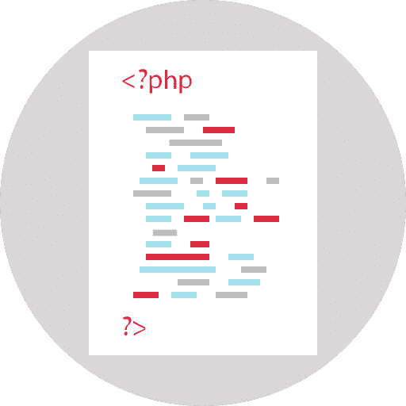
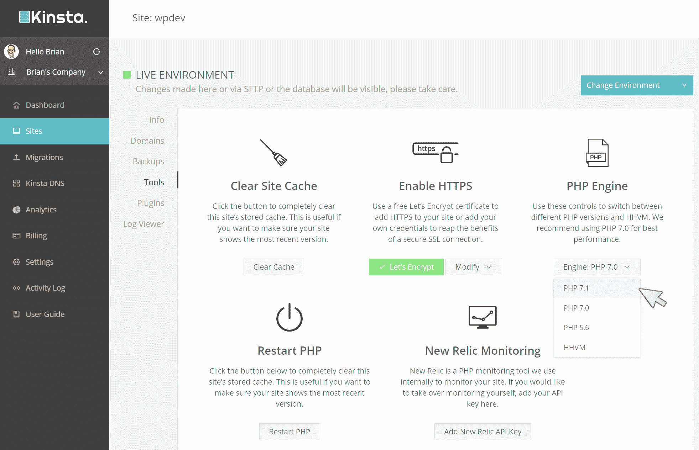

# PHP 7.1.0 的新特性

> 原文:[https://kinsta.com/blog/php-7-1-0/](https://kinsta.com/blog/php-7-1-0/)

截至 12 月 1 日，PHP 的最新版本 [PHP 7.1.0](http://php.net/archive/2016.php#id2016-12-01-3) 现已发布。在将 PHP 从 5.6 直接升级到 7.0 并大幅提高速度之后，PHP 现在专注于核心语言特性，这将帮助我们所有人编写更好的代码。在这篇文章中，我将看看 PHP 7.1.0 的主要新增内容和特性。你也可以查看官方的[变更日志](http://www.php.net/ChangeLog-7.php#7.1.0)。

**更新:** [PHP 8.1(正式发布)](https://kinsta.com/feature-updates/php-8-1/)现已对所有 Kinsta 客户端开放。Kinsta 不支持 PHP 7.1.0。请注意，我们支持 PHP 版本 8.0 和 8.1。

[PHP 7.1.0 is now focusing on core language features that will help us write better code.Click to Tweet](https://twitter.com/intent/tweet?url=https%3A%2F%2Fkinsta.com%2Fblog%2Fphp-7-1-0%2F&via=kinsta&text=PHP+7.1.0+is+now+focusing+on+core+language+features+that+will+help+us+write+better+code.&hashtags=PHP%2Cwebdev)

*   [可空类型](#nullable-types)
*   [Iterable 和 Void 返回](#iterable-void-returns)
*   [多重捕捉异常处理](#multi-catch-exception-handling)
*   [键现在可以在列表中使用](#keys-lists)
*   [更负的字符串偏移量](#negative-string-offsets)
*   [数字运算符和格式错误的数字](#number-operators-malformed-numbers)
*   [针对 Kinsta 用户的 PHP 7.1 和 7.2](#php-kinsta-users)

## 可空类型

人们谈论最多的一个新增功能将是非常缺乏的可空类型。变量已经可以返回某种类型的值或者 null，你也可以设置一个函数的参数为 null。PHP 7.1 将支持 null 作为函数的可定义返回类型。

我们来看看这是什么意思。这里有一些你可能在 good ol' 7.0 中熟悉的返回类型。

```
function getNumber(): int  {
    return 6;
}

// Returns an integer so all is well

function getNumber(): int  {
    return 'six';
}

// Returns a string, will throw an error when called
```

在类型声明前添加问号将允许 null 作为返回值。


> 需要在这里大声喊出来。Kinsta 太神奇了，我用它做我的个人网站。支持是迅速和杰出的，他们的服务器是 WordPress 最快的。
> 
> <footer class="wp-block-kinsta-client-quote__footer">
> 
> 
> 
> <cite class="wp-block-kinsta-client-quote__cite">Phillip Stemann</cite></footer>

[View plans](https://kinsta.com/plans/)

```
function getNumber(): ?int  {
    return null;
}

// Null is allowed, so all is well
```

参数类型提示的语法完全相同。在下面的例子中

```
function showColor(?string $color) {
    if ($color) {
        echo $color;
    }
}

showColor( '#ff9900' );
// Works just fine, a string has been given

showColor( null );
// Works fine, null is allowed
```

我喜欢这个特性，因为我们的代码越有描述性，我们就能更好地一起工作。类型声明对于在任何问题发生之前将其清除也是非常有用的，这是一个双赢的局面。



## Iterable 和 Void 返回

当我们谈到返回类型时，有两个新的类型:void。iterable Void 可以用于没有返回值的函数。

```
function perform_a_job() : void {
    return;
    // This is fine, it returns null
}

function perform_a_task() : void {
    // This is also fine, it returns null
}

function perform_another_task() : void {
    return true;
    // This will return an error since it is not void
}
```

这是使我们的代码自文档化的另一种方式。不返回任何东西的函数是否应该被使用还有待讨论，但是我们至少有一个规范的机制来指示这种行为。

Iterable 表示可以遍历的值，就像数组一样。iterable 的附加价值在于，我们可以用它来指示实现迭代器接口的对象。

```
function fonc01(iterable $data) {
    foreach ($data as $key => $val) {
        //....
    }
}

fonc01(new SplFixedArray(5));
// Works kist fine, SplFixedArray implements Iterator
// See http://php.net/manual/en/class.splfixedarray.php
```

(感谢[帕斯卡·马丁](https://blog.pascal-martin.fr/post/php71-en-types/)举了这个例子)

 ## 注册订阅时事通讯


### 想知道我们是怎么让流量增长超过 1000%的吗？

加入 20，000 多名获得我们每周时事通讯和内部消息的人的行列吧！

[Subscribe Now](#newsletter)

## 多重捕获异常处理

到目前为止，如果 try 块包含多个异常的可能性，我们需要分别处理它们，即使它们使用相同的逻辑。PHP 7.1 通过允许一次捕获多个异常解决了这个问题。

```
try {
    // some code
} catch (FirstException | SecondException $e) {
    // handle first and second exceptions
}
```

## 现在可以在列表中使用键了

虽然`list()`看起来像一个函数，但它实际上是一个语言构造，就像`array()`一样。它用于一次性分配变量列表。

到目前为止，它只能用于从 0 开始的数字数组。从 7.1.0 开始，你可以使用带有`list()`的键，或者你可以使用它的简写:`[]`。看看下面的例子，由 php.net 的[提供。](http://php.net/manual/en/migration71.new-features.php)

```
$data = [
    ["id" => 1, "name" => 'Tom'],
    ["id" => 2, "name" => 'Fred'],
];

// list() style
list("id" => $id1, "name" => $name1) = $data[0];

// [] style
["id" => $id1, "name" => $name1] = $data[0];

// list() style
foreach ($data as list("id" => $id, "name" => $name)) {
    // logic here with $id and $name
}

// [] style
foreach ($data as ["id" => $id, "name" => $name]) {
    // logic here with $id and $name
}
```

## 更多的负字符串偏移量

PHP 7.1.0 增加了对负字符串偏移量的更广泛支持。您甚至可以将负偏移与字符串一起使用`[]`。看看这有多棒:

Struggling with downtime and WordPress problems? Kinsta is the hosting solution designed to save you time! [Check out our features](https://kinsta.com/features/)

```
$name = "Daniel";
echo "My name ends in an '$name[-1]'. Nice!";
```

像 strpos 这样的核心函数正在更新，这将使我们的代码更短更清晰。

## 数字运算符和格式错误的数字

事实上，你可以在 PHP 中做`5 + "3"`,它将评估为 8，这被视为对一些人的祝福，对另一些人的诅咒。当你意识到`5 + "three"`的计算结果为 5 时，问题就更严重了。

我认为这是极其草率的，会导致各种各样的问题。PHP 7.1.0 试图给这种情况带来一些理智，当你有一些畸形的东西时，它会警告你，就像第二个例子。第一个将继续工作，因为 PHP 将字符串 3 转换为数字 3。第二个会发出通知或警告。

## 其他 PHP 7.1.0 的小补充

除了无数的小错误修复，还有一些小功能至少应该提到:

*   添加了 SHA3 固定模式算法
*   添加了 is_iterable()函数
*   实现闭包::fromCallable
*   添加对 HTTP/2 服务器推送的支持
*   MCrypt 已被弃用，将在下一版本中删除

## 进一步阅读

我喜欢 PHP 的发展方向——一种比以前更结构化、类型更紧密的语言。现在我们已经收到了 7.0 的巨大速度更新，是时候关注这些方面了。如果你有兴趣学习更多关于 PHP 的知识，总的来说，我有一个最好的 PHP 教程列表，如果你想学习更多关于 7.1.0 的知识，我可以热情地推荐以下资源:

*   [PHP 7.1 新闻](https://github.com/php/php-src/blob/php-7.1.0RC6/NEWS)
*   [PHP 7.1 升级说明](https://github.com/php/php-src/blob/php-7.1.0RC6/UPGRADING)
*   [迁移指南](http://php.net/manual/en/migration71.php)
*   [可空类型](https://wiki.php.net/rfc/nullable_types)
*   [PHP 7.1.0 类型](https://blog.pascal-martin.fr/post/php71-en-types/)

另外，请务必查看 PHP 7.1.0 与 PHP 7 和 PHP 5 的这些[性能基准](https://www.phpclasses.org/blog/post/493-php-performance-evolution.html)。关于 PHP 7.1.0 的源代码下载，请访问 PHP [下载](http://www.php.net/downloads)页面。

## 针对 Kinsta 用户的 PHP 7.1、7.2 和 7.3

最新版本的 PHP 7.1、7.2 和 7.3 已经提供给所有的 Kinsta 用户。只需单击一下，就可以在 MyKinsta 仪表板的 Tools 下轻松启用它。



Kinsta PHP 7.1


* * *

让你所有的[应用程序](https://kinsta.com/application-hosting/)、[数据库](https://kinsta.com/database-hosting/)和 [WordPress 网站](https://kinsta.com/wordpress-hosting/)在线并在一个屋檐下。我们功能丰富的高性能云平台包括:

*   在 MyKinsta 仪表盘中轻松设置和管理
*   24/7 专家支持
*   最好的谷歌云平台硬件和网络，由 Kubernetes 提供最大的可扩展性
*   面向速度和安全性的企业级 Cloudflare 集成
*   全球受众覆盖全球多达 35 个数据中心和 275 多个 pop

在第一个月使用托管的[应用程序或托管](https://kinsta.com/application-hosting/)的[数据库，您可以享受 20 美元的优惠，亲自测试一下。探索我们的](https://kinsta.com/database-hosting/)[计划](https://kinsta.com/plans/)或[与销售人员交谈](https://kinsta.com/contact-us/)以找到最适合您的方式。