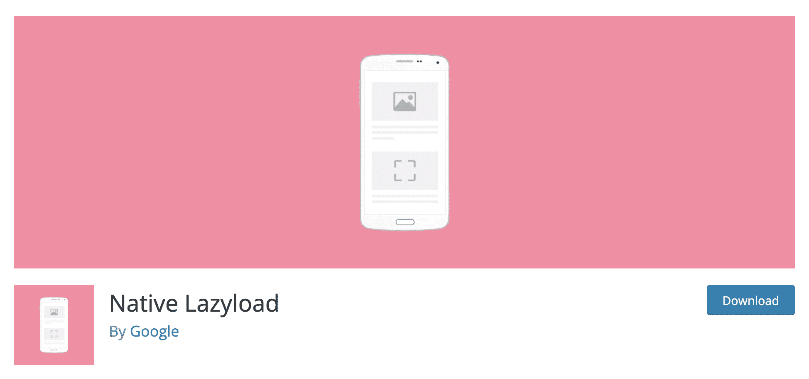

# 如何在图片和视频上实现 WordPress 惰性加载

> 原文:[https://kinsta.com/blog/wordpress-lazy-load/](https://kinsta.com/blog/wordpress-lazy-load/)

根据 [HTTP Archive](http://httparchive.org/interesting.php?a=All&l=Mar%201%202018&s=All) 的数据，平均网页重量为 3719 kB，图像和[视频](https://kinsta.com/blog/video-hosting/)占总重量的近 78%。对于网站访问者的浏览器来说，下载和渲染的字节数太多了，而且趋势都指向未来更大的网页和更多的图像使用。WordPress 在分享媒体和将媒体文件整合到网站设计方面处于领先地位。有了 WordPress，很容易将图片和[视频整合到帖子、页面](https://kinsta.com/blog/embed-youtube-video-wordpress/)，甚至整合到主题背景中。

随着[的发布，WordPress 5.5 延迟加载成为了核心](https://kinsta.com/blog/wordpress-5-5/#native-image-lazyloading-in-wordpress-core)版本的一部分，使得实现这一技术变得非常容易。

然而，所有这些繁重的资源使下载网页成为一种昂贵的体验，因为用户必须等待下载大文件，包括最初不可见的文件，然后才能查看网页。这就是 **WordPress 惰性加载**的由来。

*   [什么是惰性加载，它是如何工作的？](#what-is-lazy-loading)
*   [WordPress 懒惰加载](#wordpress-lazy-load)
*   [利用延迟加载插件提高页面加载速度](#lazy-loading-plugins)
*   [延迟加载对 SEO 的影响](#lazy-loading-seo)

## 什么是延迟加载，它是如何工作的？

延迟加载是一种优化技术，它加载可视内容，但会延迟文件夹下内容的下载和呈现。这正是谷歌感到兴奋的事情，如果你的帖子和页面包含大量嵌入式视频和高分辨率图像，你应该考虑这种技术。

延迟加载是这样工作的:

*   浏览器在不下载图像和预加载视频的情况下构建网页 DOM。
*   JavaScript 用于根据页面加载时最初可见的内容来确定下载哪些图像和预加载哪些视频。这些图像和视频被适当地下载和预加载。
*   额外视频的下载和呈现被延迟，直到站点访问者向下滚动页面并且额外内容进入视野。

最终结果是，直到真正需要的时候，图像和视频才会被下载和加载。这可以为包含大量高分辨率图像和嵌入式视频的网站提供显著的性能提升。

> 需要在这里大声喊出来。Kinsta 太神奇了，我用它做我的个人网站。支持是迅速和杰出的，他们的服务器是 WordPress 最快的。
> 
> <footer class="wp-block-kinsta-client-quote__footer">
> 
> 
> 
> <cite class="wp-block-kinsta-client-quote__cite">Phillip Stemann</cite></footer>

[View plans](https://kinsta.com/plans/)

## WordPress 延迟加载

就像许多其他网站的性能问题一样，当谈到 WordPress 懒惰加载时，有一个插件可以用来解决这个问题。实际上，在 WordPress 插件目录中有很多免费的插件可以用来延迟加载图片和视频。在考虑了几十个插件并测试了几个之后，我们已经确定了五个插件，它们对网站性能产生了显著的改善。如果你准备好实现延迟加载，从考虑这五个选项开始。

### 图片和视频真的会让网站变慢吗？

首先，在你上传任何图片到 WordPress 之前，确保你[优化了它们](https://kinsta.com/blog/optimize-images-for-web/)。

我们需要一个基线分数，以便我们可以看到添加图像和视频的影响。如果一开始就没有问题，那么解决问题是没有意义的。为了测试一下，我在一个 Kinsta 托管账户上安装了一个标准的 WordPress。216 是当前的主题，没有优化插件或缓存等技术被实现。

以下是 Pingdom 网站速度测试在添加任何图片或视频之前如何对网站进行评级。

Speed test with no images or videos

正如您所看到的，这个页面非常轻，只有不到 155 kb，加载时间不到半秒。很难对这些分数挑毛病。如果我们加载一个包含大型图片文件和嵌入的 YouTube 视频的页面会发生什么？

Speed test with no lazy loading plugin

页面大小已经膨胀到 1.7 MB，页面加载时间几乎翻了三倍，只有不到 1.3 秒。TwentySixteen 是一个写得很好的灯光主题，所以即使有半打图像和添加了的 [YouTube 视频，这个网站仍然很轻，加载灯光很快。然而，我们可以看到，添加图像和视频使页面变得更大，并大大降低了页面加载速度。](https://kinsta.com/blog/embed-youtube-video-wordpress/)

## 利用延迟加载插件提高页面加载速度

两个大大加快这个网页交付速度的插件是 a3 Lazy Load 和 Lazy Load。让我们依次看看他们的表现。我们还测试了几个额外的插件，但是没有对网站性能产生明显的改善。当你尝试惰性加载插件时，一定要做一个前后测试，以确保它们能产生你想要的结果。

### a3 懒人装

a3 惰性加载是存储库中另一个流行的 WordPress 惰性加载选项。这个插件活跃在超过 50，000 个 WordPress 网站上，获得了非常高的评分(4.7 分，5 颗星)，并收到了近 40 条用户评论。

A3 Lazy Load plugin

激活插件会在**设置** > **a3 惰性加载**处增加一个设置菜单。出于测试目的，我保留了默认设置，只有一个例外。我确实使用了*加载背景颜色*选项来匹配占位符颜色和网页背景颜色。进行了这些更改并应用了默认设置后，该站点运行得非常好。

Speed test with A3 Lazy Load plugin

我们回到了半秒钟以内的页面加载时间。考虑到这个网页上包含的图片和视频的数量，这是非常了不起的。

 ## 注册订阅时事通讯

### 想知道我们是怎么让流量增长超过 1000%的吗？

加入 20，000 多名获得我们每周时事通讯和内部消息的人的行列吧！

[Subscribe Now](#newsletter)

**测试结果对比**

毫无疑问，您会注意到页面大小和请求数量已经大大减少。是什么造成了如此巨大的差异？Pingdom 提供了内容大小的快照，通过快速比较可以找到答案。首先，这是激活 a3 延迟加载时内容大小快照的样子。

Content size with A3 Lazy Load plugin

图像占用空间很小，只有 150 kb 多一点。下面是总负载为 2.0 MB 的内容截图。

Content size with Lazy Load XT plugin

脚本、HTML、CSS 和其他内容大小几乎相同。然而，图像大小是 1.86 MB——基本上是页面上第一个图像的全分辨率版本的大小——而不是 150 kb。这是怎么回事？

正如我之前提到的，WordPress 会自动提供各种图像尺寸，浏览器会根据图像在屏幕上呈现的尺寸选择并呈现尽可能小的版本。3 延迟加载保持默认的 WordPress 行为不变，结果是交付了一个小得多的图像文件。

### 懒人加载

第二个选项是 [Lazy Load](https://wordpress.org/plugins/rocket-lazy-load/) ，这是 WP Rocket 团队开发的一个免费插件。它目前活跃在超过 10，000 个安装上，获得了 4 个五星的评级。如果你正在寻找一个速度很快的简单的 WordPress 惰性加载选项，这是一个很好的选择。

Lazy Load plugin by WP Rocket

这个插件[作用于缩略图](https://kinsta.com/blog/regenerate-thumbnails/)，文章内容或小工具文本中的所有图像，头像和微笑。这个插件的最大优势是没有使用**没有 [JavaScript 库](https://kinsta.com/blog/javascript-libraries/)比如 [jQuery](https://kinsta.com/knowledgebase/what-is-jquery/) 并且脚本重量不到 10 KB。没有选项可以配置，只需安装插件，延迟加载就可以了。
T9】**

Struggling with downtime and WordPress problems? Kinsta is the hosting solution designed to save you time! [Check out our features](https://kinsta.com/features/)

### 本机延迟加载

在过去的几年里，有一种将延迟加载功能直接集成到 web 浏览器中的趋势。目前，基于 Chrome 的浏览器，如 Chrome 和 Brave，以及 Firefox，都支持原生惰性加载。

原生延迟加载对网站性能非常好，因为它不依赖于内联 Javascript 代码或外部脚本。要向您的站点添加本地延迟加载，只需向您想要延迟加载的图像和 iframes 添加一个`loading=lazy`属性。

Google Native Lazyload plugin.

谷歌开发了[原生 Lazyload](https://wordpress.org/plugins/native-lazyload/) 插件来帮助简化这个过程。激活插件后，WordPress 会自动将`loading`属性插入到你的`img`和`iframe`标签中。

### 视频的延迟加载

如果你只是关心视频的延迟加载，我们也建议你看看视频的延迟加载插件。虽然上面的一些插件也可以做到这一点，但这对于视频内容来说是一个很好的解决方案。

Lazy Load for Videos plugin

 ## 延迟加载对搜索引擎优化的影响

无论你最终使用哪个插件来实现 WordPress 的延迟加载，重要的是不要损害你的 [SEO](https://kinsta.com/blog/what-does-seo-stand-for/) 。有两件事你需要仔细检查:

1.  确保谷歌仍然可以抓取你偷懒加载的图片。你可以使用[谷歌搜索控制台](https://kinsta.com/blog/google-search-console/)中抓取部分下的“抓取为谷歌”工具轻松检查这一点。如果您仍然可以在源代码中看到您的图像，那么很可能您是好的。
2.  确保你仍然在图片上使用替代文字，因为这对谷歌图片搜索排名很重要。

> 如果你想让你的图片排在谷歌图片的前面，替换文字对谷歌图片非常有帮助。即使您使用延迟加载，您也知道哪个图像将被加载，所以尽可能早地获取该信息&测试它呈现为什么。
> 
> — 🌽〈link href =//John mu . com rel = canonical〉🌽(@ JohnMu)[2018 年 9 月 4 日](https://twitter.com/JohnMu/status/1036901608880254976?ref_src=twsrc%5Etfw)