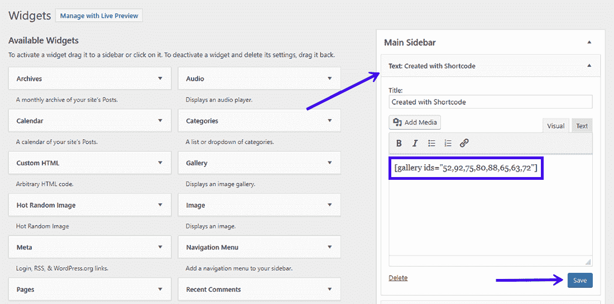
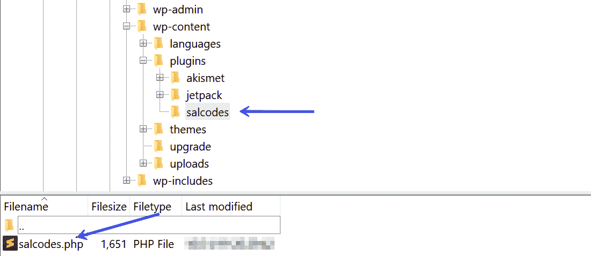
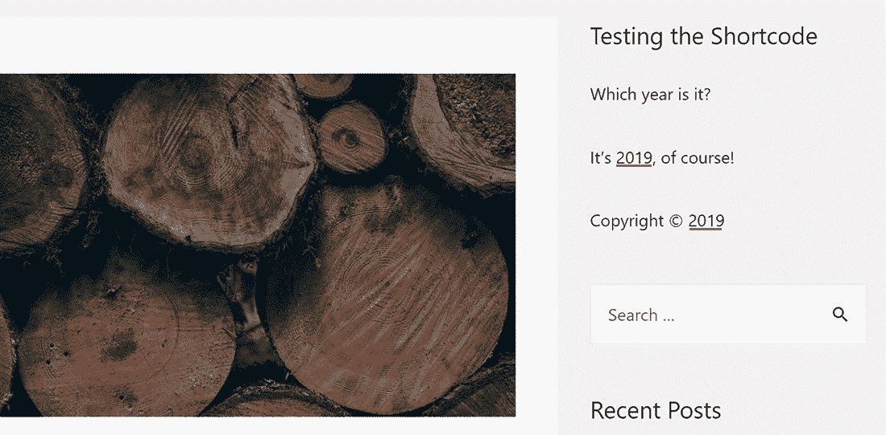
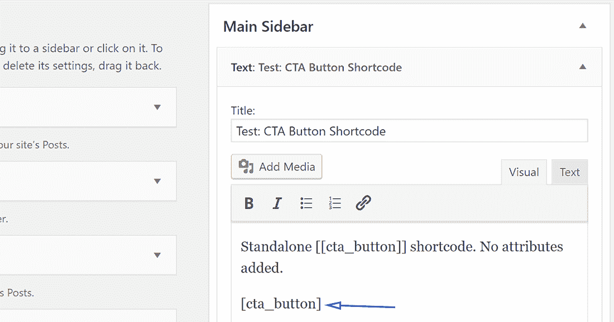
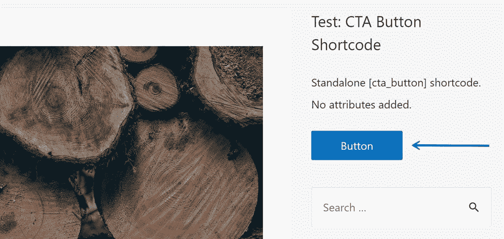

# WordPress Shortcodes 的终极指南(带有创建你自己的例子)

> 原文：<https://kinsta.com/blog/wordpress-shortcodes/>

WordPress shortcodes 是一个很强大的功能，可以不费吹灰之力做很酷的事情。你可以用它们做任何事情。使用短代码，嵌入交互元素或创建复杂的页面布局就像插入一行代码一样简单。

如果您想[添加一个图库](https://kinsta.com/blog/wordpress-photo-gallery-plugins/)，您只需键入以下代码:

```
[gallery ids="47 ,86, 92, 64, 48, 75, 89, 80" columns="4" size="medium"]
```

这将输出一个带有提到的图像 id 的图库。它将有 4 列，它们的最大尺寸将是“中等”(由 WordPress 定义)。

不需要任何难看的 HTML 代码。

[](https://kinsta.com/wp-content/uploads/2019/12/Gallery-Shortcode-Output-by-WordPress-3.jpg)

Example of the gallery shortcode


短代码消除了对复杂脚本的需求。即使您几乎没有编程技能，也可以在他们的帮助下毫不费力地添加动态内容。

它们在 WordPress 开发者中非常受欢迎，因为它们在自动化内容和设计创作方面帮助巨大。短代码对于 WordPress 开发者来说，就像宏对于数据分析师来说，或者键盘快捷键对于专业图形设计师来说。

在本指南中，您将了解关于短码的所有知识。您将通过创建自己的短代码来了解如何使用短代码 API。最后，我们将讨论短代码的未来，以及它们在 WordPress 新的块编辑器中的位置。

激动吗？我们开始吧！


> 需要在这里大声喊出来。Kinsta 太神奇了，我用它做我的个人网站。支持是迅速和杰出的，他们的服务器是 WordPress 最快的。
> 
> <footer class="wp-block-kinsta-client-quote__footer">
> 
> 
> 
> <cite class="wp-block-kinsta-client-quote__cite">Phillip Stemann</cite></footer>

[View plans](https://kinsta.com/plans/)

### 更喜欢看[视频版](https://www.youtube.com/watch?v=sq1OZ2ZNqIw)？


## 什么是短码？

简单来说， **Shortcode =快捷方式+代码**。

通常，短代码使用方括号标签[]来定义它们的使用方式。每个短代码在站点中执行特定的功能。它可以像格式化内容一样简单，也可以像定义整个网站的结构一样复杂。

例如，您可以使用短代码来嵌入[滑块](https://kinsta.com/blog/wordpress-slider/)、[表单](https://kinsta.com/blog/wordpress-contact-form-plugins/)或[定价表](https://kinsta.com/blog/wordpress-pricing-table-plugins/)。您甚至可以使用它们来创建可重用的页面设计模板。

### 短代码的简史

短代码最初是由一个叫做终极公告板(UBB)的在线论坛软件流行起来的。1998 年，他们推出了 [BBCode(公告板代码)](https://www.bbcode.org/)，这是一组易于使用的标签，用户可以轻松地设置帖子的格式。

[](https://kinsta.com/wp-content/uploads/2019/12/BBCode-Shortcode-Examples-Usage-Output.png)

Easy formatting with simple BBCodes


作为一种轻量级标记语言，BBCode 的工作原理与 HTML 相同，只是它要简单得多。

使用预定义的标签也更安全，因为用户不能插入 HTML 代码并引入安全漏洞。例如，怀有恶意的用户可以使用<脚本>标签来执行 JavaScript 代码并破坏网站的功能。

不久之后，其他在线论坛软件如 [phpBB](https://www.phpbb.com/) 、 [XMB 论坛](https://www.xmbforum2.com/)、 [vBulletin](https://www.vbulletin.com/) 在其留言板中增加了 BBCode 功能。

短代码使管理员能够更好地控制用户能做什么和不能做什么。另外，他们允许用户通过简单的标签来格式化他们的内容。

出于同样的安全原因，WordPress 阻止 PHP 代码在网站内容中运行。为了克服这个限制， [WordPress 2.5](https://wordpress.org/news/2008/03/wordpress-25-brecker/) 在 2008 年随着 [Shortcode API](https://codex.wordpress.org/Shortcode_API) 的发布引入了 shortcodes 功能。它被证明是许多 WordPress 插件和主题开发者最常用的功能之一。

### 什么是 WordPress 简码？

WordPress shortcodes 是方括号字符串( **[ ]** )，它神奇地在前端变成一些迷人的东西。它们为用户提供了一种简单的方式来创建和更改复杂的内容，而不用担心复杂的 HTML 或嵌入代码。

[](https://kinsta.com/wp-content/uploads/2019/12/How-WordPress-Shortcodes-Work.png)

WordPress shortcodes are simple and easy to use


### 两种类型的短码

WordPress 中主要有两种类型的简码。

[](https://kinsta.com/wp-content/uploads/2019/12/The-Types-of-WordPress-Shortcodes-Tags-Attribute-Value.png)

Self-closing and Enclosing shortcodes can be valid with or without attributes.


*   **自结束短代码:**这些不需要结束标签。

示例:**图库**短代码不需要结束标签。我们用不同的属性添加它需要的一切。

*   **封闭短代码:**这些需要一个结束标签。封闭短代码通常处理开始和结束标记之间的内容。

示例*:***标题**短代码用于将标题环绕在任何内容周围。它主要用于给图片添加标题，但也适用于任何 HTML 元素。

有些短码可以带属性也可以不带属性。这取决于它们是如何定义的。


## 默认的 WordPress 短代码

WordPress 有 6 个默认的短代码:

有关如何使用默认短码以及它们支持哪些属性的更多详细信息，您可以参考链接的 Codex 文档。

### 如何使用 WordPress 简码

在 WordPress 中使用短代码是一个简单的过程。但这取决于你想把它们添加到你网站的什么地方。请务必阅读短代码文档，以了解它是如何工作的。了解它支持的属性，这样你就可以准确地得到你想要的。

### 在页面和文章中使用 WordPress 短代码

首先，转到您想要插入短代码的页面/帖子编辑器。

如果您正在使用 Gutenberg 编辑器，您可以在独立的 *Shortcodes* 块中添加 shortcode 标签。我们可以在*小工具*部分找到它。

[](https://kinsta.com/wp-content/uploads/2019/12/Adding-Gutenberg-Shortcode-Block.png)

Adding a Shortcode block in Gutenberg


[](https://kinsta.com/wp-content/uploads/2019/12/Gutenberg-Shortcode-Block.png)

Gutenberg’s dedicated Shortcode block


还在用[经典编辑器(或者插件)](https://wordpress.org/plugins/classic-editor/)？你可以用传统的方式输入你的短码标签。一些短代码甚至可能在编辑器屏幕上有一个按钮来方便地插入它们。

[](https://kinsta.com/wp-content/uploads/2019/12/Adding-Shortcode-Classic-Editor-WordPress.png)

Adding a shortcode in the classic editor


### 在侧边栏小工具中使用 WordPress 短代码

短代码也可以插入到[侧边栏小部件](https://kinsta.com/blog/wordpress-widgets/)中。要添加它们，请转到**外观小部件**，并将**文本**小部件添加到您想要添加快捷方式的部分。

[](https://kinsta.com/wp-content/uploads/2019/12/Adding-Shortcode-to-Sidebar-Widget-WordPress.png)

Add shortcode in your sidebar with the Text widget


将短代码粘贴到*文本*小部件中，然后*保存*它。你可以访问你网站的前端，在你的侧边栏中看到短代码的输出。

[](https://kinsta.com/wp-content/uploads/2019/12/Gallery-Outputted-in-Sidebar-with-Shortcode.png)

The shortcode output (gallery) can be seen in the sidebar


**注意:** WordPress 4.8 及以下版本不支持侧边栏小工具中的短码。阅读 WordPress 4.9 更新中的[小部件改进了解更多。](https://make.wordpress.org/core/2017/10/24/widget-improvements-in-wordpress-4-9/)

### 在页眉和页脚中使用 WordPress 短代码

WordPress 短代码通常用于页面、文章和小部件。但是你有一个简单的方法在你的站点的任何地方插入短代码。

假设你想在你的页脚或评论区之前的所有帖子中添加一个行动号召按钮。 [do_shortcode()回调函数](https://developer.wordpress.org/reference/functions/do_shortcode/)在这里派上了用场。

您需要将以下代码添加到您的主题的*header.php*、*footer.php*或其任何模板文件中:

```
<?php echo do_shortcode("[name_of_your_shortcode]"); ?>
```

这将在您插入代码的地方输出短代码。

您需要在引号之间加上方括号来回应短代码。仅仅包括它的名字是不行的。

同样，您可以使用 *do_shortcode()* 回调函数在 WordPress 的任何地方启用短代码，比如在评论部分。

### 短代码 API 的快速介绍

WordPress Shortcode API 定义了你如何使用 Shortcode 来定制和扩展你网站的功能。它使开发人员能够创建独特的内容(例如..表格、转盘、滑块等。)用户可以通过粘贴相关的短代码来添加到他们的站点中。

在短代码的帮助下，你几乎可以在你的网站上添加任何你能想到的功能。

该 API 支持自结束和封闭短代码。它处理所有棘手的解析，并包括设置和获取默认属性的辅助函数。

感谢 API，您可以直接投入到短代码的开发和定制中，而不是浪费宝贵的时间为您创建的每个短代码定义正则表达式。

### 了解短代码 API 的基础知识

每当你在 WordPress 中打开一个页面或者发表一篇文章，它都会在处理网站内容的时候寻找注册的短代码。

如果找到注册的短代码，则短代码 API 接管并返回短代码的输出。返回的输出字符串将替换添加位置的 shortcode 标记。

你用 [add_shortcode()函数](https://developer.wordpress.org/reference/functions/add_shortcode/)在 WordPress 中注册一个 shortcode。这是如何做到的:

```
add_shortcode( 'shortcode_name', 'shortcode_handler_function' );
```

短代码处理函数定义如下:

```
function shortcode_handler_function( $atts, $content, $tag ){ }
```

API 解析 shortcode 的标签、属性和包含的内容(如果有的话),将值传递给处理函数，处理函数处理这些值并返回一个输出字符串。

这个输出字符串替换了站点前端的 shortcode 宏。您最终在浏览器中看到的是这个输出。

### 在哪里添加您的自定义短代码脚本？

你可以将你的自定义短代码脚本添加到主题的*functions.php*文件中，或者将它们包含在插件中。

如果你把它添加到一个主题文件中，你可以直接运行 [*add_shortcode()*](https://kinsta.com/blog/wordpress-child-theme/#how-wordpress-chooses-template-files) 函数。

但是如果你把它添加到一个插件中，我建议你只有在 WordPress 完全加载后才初始化它。您可以通过将 *add_shortcode()* 函数包装在另一个函数中来确保这一点。这被称为包装函数:

```
function shortcodes_init(){
 add_shortcode( 'shortcode_name', 'shortcode_handler_function' );
}
add_action('init', 'shortcodes_init');
```

[*add_action()*](https://kinsta.com/blog/wordpress-hooks/#hooks-vs-actions-vs-filters) 函数挂钩 ***shortcodes_init*** 函数，仅在 WordPress 完成加载后触发(它被称为[‘init’挂钩](https://kinsta.com/blog/wordpress-hooks/#example-of-hooking-an-action))。

## 注册订阅时事通讯


### 想知道我们是怎么让流量增长超过 1000%的吗？

加入 20，000 多名获得我们每周时事通讯和内部消息的人的行列吧！

[Subscribe Now](#newsletter)

## 如何在 WordPress 中创建自定义简码(初级水平)

现在我们已经介绍了基础知识，是时候创建一个定制的短代码了。

按照下面给出的步骤，你需要熟悉 PHP 代码和编辑你的 WordPress 主题文件。当你完成教程的时候，你已经准备好了你的第一个自定义的 WordPress 短代码！

我们将从最简单的短代码开始，然后转向更复杂的代码。在掌握短码的过程中享受你的短暂里程碑！

### 查看我们的[视频](https://www.youtube.com/watch?v=izIDOiQgWcU)——如何为初学者在 WordPress 中创建自定义短代码:


### 示例 1:使用[当前年份]的短代码

让我们创建一个名为[current_year]的短代码，在您的网站上输出当前年份。

如果你的网站需要每年更新内容，这个简码会很有帮助。例如，在网站的页脚添加版权声明。

我将使用一个准系统插件来添加我的短代码功能。你可以把它添加到你的主题的*functions.php*文件中，得到同样的结果，但是我不推荐这样做。不过这对于测试和学习来说还是可以的！


### 信息

在对您的站点进行任何更改之前，请进行备份。Kinsta 向其所有客户提供自动备份。


让我们从创建一个插件开始。在你的***/WP-content/plugins/***目录下新建一个文件夹。

[](https://kinsta.com/wp-content/uploads/2019/12/Where-to-Add-Custom-Shortcodes-WordPress-Plugins.png)

Note the location of the plugin directory


我将我的插件命名为“salcodes ”,但是你可以随意命名。

在 **salcodes** 插件目录下，创建一个同名的 PHP 文件(【salcodes.php】**)。完成后，将以下标题添加到插件文件中:**

 **```
<?php

/*
Plugin Name:  Salcodes
Version: 1.0
Description: Output the current year in your WordPress site.
Author: Salman Ravoof
Author URI: https://www.salmanravoof.com/
License: GPLv2 or later
License URI: https://www.gnu.org/licenses/gpl-2.0.html
Text Domain: salcodes
*/
```

这个简单的插件头对于我们的目的来说已经足够好了。你可以在 WordPress Codex 中了解更多关于[插件头要求](https://developer.wordpress.org/plugins/the-basics/header-requirements/)的信息。保存这个文件，然后去你的 [WordPress 仪表盘](https://kinsta.com/knowledgebase/wordpress-admin/)激活插件。

现在，让我们注册短代码及其处理函数。为此，将以下代码添加到插件文件中:

```
/**
 * [current_year] returns the Current Year as a 4-digit string.
 * @return string Current Year
*/

add_shortcode( 'current_year', 'salcodes_year' );
function salcodes_init(){
 function salcodes_year() {
 return getdate()['year'];
 }
}
add_action('init', 'salcodes_init');

/** Always end your PHP files with this closing tag */
?>
```

保存您的插件文件。现在是测试短代码是否如预期那样工作的时候了。

在你的站点的任何地方添加短代码(页面，文章，侧边栏部件，等等)。).我正在把它添加到我网站的侧边栏*文本*小部件中。

[](https://kinsta.com/wp-content/uploads/2019/12/Testing-the-Current-Year-Shortcode-Sidebar-Widget-1.png)

Testing the custom shortcode by adding it to the site.


不出所料，它运行得非常完美。

[](https://kinsta.com/wp-content/uploads/2019/12/The-Current-Year-Shortcode-Works-Perfectly.png)

Output of the year shortcode


祝贺你达到你的第一个里程碑！

您刚刚创建的短代码没有任何与之相关联的 **$attributes** 或 **$content** 变量。您将在下面的示例中学习如何使用它们。

### 示例 2:CTA 按钮的短代码

让我们创建一个可定制的 **CTA 按钮**短代码。这也会自动关闭(抱歉 **$content** ，你需要坚持到下一个)。

厌倦了你的 WordPress 站点缓慢的主机？我们提供超快的服务器和来自 WordPress 专家的 24/7 世界级支持。[查看我们的计划](https://kinsta.com/plans/?in-article-cta)

我希望用户能够自定义 CTA 按钮的大小和短码属性的颜色。

由于最终输出的是一个按钮元素，所以可以使用它的 HTML 属性如 **href** 、 **id** 、 **class** 、 **target** & **label** 轻松定制。

您可以使用 **id** 和**类**属性来设计按钮的样式，因为它们都是常见的 CSS 选择器。

我没有在这里包装我的处理函数，以使事情易于解释。

```
/**
 * [cta_button] returns the HTML code for a CTA Button.
 * @return string Button HTML Code
*/

add_shortcode( 'cta_button', 'salcodes_cta' );

function salcodes_cta( $atts ) {
 $a = shortcode_atts( array(
 'link' => '#',
 'id' => 'salcodes',
 'color' => 'blue',
 'size' => '',
 'label' => 'Button',
 'target' => '_self'
 ), $atts );
 $output = '<p><a href="' . esc_url( $a['link'] ) . '" id="' . esc_attr( $a['id'] ) . '" class="button ' . esc_attr( $a['color'] ) . ' ' . esc_attr( $a['size'] ) . '" target="' . esc_attr($a['target']) . '">' . esc_attr( $a['label'] ) . '</a></p>';
 return $output;
}
```

哇，这里有很多东西要打开。我将逐行解释它，这样你就能理解它是如何工作的。

如果你想将默认链接设置为网站的主页 URL，你可以使用 [home_url()](https://developer.wordpress.org/reference/functions/home_url/) WordPress 函数。

让我们按原样使用短代码，不定义任何属性，看看输出了什么。

[](https://kinsta.com/wp-content/uploads/2019/12/CTA-Button-First-Test.png)

I’m adding the shortcode to a sidebar text widget to test it.


如果你想知道双方括号(**[**CTA _ button**]]**)是干什么用的，它们被称为[转义短码](https://codex.wordpress.org/Shortcode#Escaping_Shortcodes)。他们帮助你输出任何注册的短代码作为常规文本，如下图所示。

[](https://kinsta.com/wp-content/uploads/2019/12/CTA-Button-First-Test-Output.jpg)

Output of the CTA Button shortcode showing that it works perfectly as expected


[](https://kinsta.com/wp-content/uploads/2019/12/CTA-Button-First-Test-HTML-Output.png)

The HTML output of the CTA Button with no attributes.


用户可以用短代码定制按钮的大小和颜色。我们已经在处理函数中设置了它们的默认值，但是我们需要将样式表注册到可用资源列表中。这个样式表应该包含短代码中定义的所有类。

您也可以在主题的全局样式表中设置这些类，但是建议分别加载它们。这确保了即使你[改变了](https://kinsta.com/blog/change-wordpress-theme/)或者[更新了你的 WordPress 主题](https://kinsta.com/blog/how-to-update-wordpress-theme/)，这些类仍然会和短代码一起加载。

```
/** Enqueuing the Stylesheet for the CTA Button */

function salcodes_enqueue_scripts() {
 global $post;
 if( is_a( $post, 'WP_Post' ) && has_shortcode( $post->post_content, 'cta_button') ) {
 wp_register_style( 'salcodes-stylesheet',  plugin_dir_url( __FILE__ ) . 'css/style.css' );
     wp_enqueue_style( 'salcodes-stylesheet' );
 }
}
add_action( 'wp_enqueue_scripts', 'salcodes_enqueue_scripts');
```

***sal codes _ enqueue _ scripts()***函数定义了 **$post** 全局变量，然后通过以下方式确认两个条件:

如果两个条件都为真，该函数将注册并排队包含在 **CSS** 文件夹中的 **style.css** 样式表。*[plugin _ dir _ url($ file)](https://developer.wordpress.org/reference/functions/plugin_dir_url/)*函数可以轻松获取插件所在目录的 URL。

这里我不会向您展示 CSS 代码，但是您可以在本节末尾链接的源代码中找到它。

最后，让我们通过将**【CTA _ button】**短代码添加到帖子内容来测试它:

[](https://kinsta.com/wp-content/uploads/2019/12/Testing-the-CTA-Button-Shortcode-with-Attributes.png)

Notice the custom link, color, size, and label attributes.


下图显示了 CTA 按钮在前端的外观:

[](https://kinsta.com/wp-content/uploads/2019/12/CTA-Button-Second-Test-with-Attributes.png)

The CTA Button now has a new URL, color, size, and label.


既然您已经学习了如何定义自定义属性和包含样式，那么您可以向 CTA 按钮短代码添加各种其他功能。例如，您可以给用户添加动画、悬停效果和各种其他按钮样式的选项。

### 示例 3:使用$content 的短代码

对于我们的最后一个例子，让我们构建一个名为**【boxed】**的封闭短代码，它在一个带有彩色标题的盒子中输出其标签之间的任何内容。

让我们从注册短代码并定义其处理函数开始。

```
/**
 * [boxed] returns the HTML code for a content box with colored titles.
 * @return string HTML code for boxed content
*/

add_shortcode( 'boxed', 'salcodes_boxed' );

function salcodes_boxed( $atts, $content = null, $tag = '' ) {
 $a = shortcode_atts( array(
 'title' => 'Title',
 'title_color' => 'white',
 'color' => 'blue',
 ), $atts );

 $output = '<div class="salcodes-boxed" style="border:2px solid ' . esc_attr( $a['color'] ) . ';">'.'<div class="salcodes-boxed-title" style="background-color:' . esc_attr( $a['color'] ) . ';"><h3 style="color:' . esc_attr( $a['title_color'] ) . ';">' . esc_attr( $a['title'] ) . '</h3></div>'.'<div class="salcodes-boxed-content"><p>' . esc_attr( $content ) . '</p></div>'.'</div>';

 return $output;
}
```

在这个例子中，我们使用内嵌的 [CSS 样式](https://kinsta.com/blog/wordpress-css/)来修改内容。

shortcode 中使用的任何类的样式都像我们在前面的 shortcode 示例中所做的那样进行注册和排队。

但是让两个短代码使用同一个样式表意味着如果使用了其中一个，就必须加载它。所以，我们来更新一下***salcodes _ enqueue _ scripts()***函数:

```
/** Enqueuing the Stylesheet for Salcodes */

function salcodes_enqueue_scripts() {
 global $post;
 $has_shortcode = has_shortcode( $post->post_content, 'cta_button' ) || has_shortcode( $post->post_content, 'boxed' );
 if( is_a( $post, 'WP_Post' ) && $has_shortcode ) {
 wp_register_style( 'salcodes-stylesheet',  plugin_dir_url( __FILE__ ) . 'css/style.css' );
     wp_enqueue_style( 'salcodes-stylesheet' );
 }
}
add_action( 'wp_enqueue_scripts', 'salcodes_enqueue_scripts');
```

现在，让我们用我们的**【盒装】**短码兜一圈。

[](https://kinsta.com/wp-content/uploads/2019/12/Testing-the-Boxed-Shortcode-with-Attributes.png)

Add the boxed shortcode along with a title, title_color, and color attributes.


下面的截图显示了我们得到的输出。

[](https://kinsta.com/wp-content/uploads/2019/12/Boxed-Shortcode-and-How-it-Works.png)

A pretty box is not that hard to get after all!


既然你已经学会了如何制作你自己的短代码，你可以跳出**【box】**的思维，给它们你自己的旋转。别忘了和我们分享你的创作！

如果你愿意，你可以从[这里](https://github.com/SalmanRavoof/salcodes)下载 Shortcode 插件源代码。

## WordPress 简码:利与弊

### 赞成者

### 坏处

## 短码和古腾堡块

古腾堡的引入降低了短码的可取性。用户现在可以直接从编辑器界面添加代码块，而不是处理短代码标记，不管这有多简单。

如果你想添加短码，Gutenberg 甚至提供了一个专门的模块来添加短码。块是新的短码。

> "如果你可以用短代码来做，你可以用一个块来做."自动化公司的快乐工程师詹姆斯·哈夫

这解释了为什么所有的[流行短码都被转换成块](https://calderaforms.com/2019/01/convert-shortcode-gutenberg-block/)。许多 WordPress 开发者已经转向让他们的产品和服务只使用 block editor (Gutenberg)。

但这并不意味着短码的世界末日到了。WordPress 核心团队已经承诺对 block editor 进行许多改进，你可以在 [Twenty Twenty](https://kinsta.com/blog/twenty-twenty-theme/) 中看到，但是在那之前，shortcodes 会一直存在！

[Doing more with less, you say? That's possible with WordPress shortcodes! Learn what they are and how to create your own with this in-depth guide. Life's too short to not use shortcodes〚〛💪Click to Tweet](https://twitter.com/intent/tweet?url=https%3A%2F%2Fkinsta.com%2Fblog%2Fwordpress-shortcodes%2F&via=kinsta&text=Doing+more+with+less%2C+you+say%3F+That%27s+possible+with+WordPress+shortcodes%21+Learn+what+they+are+and+how+to+create+your+own+with+this+in-depth+guide.+Life%27s+too+short+to+not+use+shortcodes%E3%80%9A%E3%80%9B%F0%9F%92%AA&hashtags=wordpress%2Cwebdev)

## 摘要

使用短代码，在你的 WordPress 站点的任何地方添加复杂的功能都很容易。它们给用户提供了易于输入的标签，使用时不用担心会涉及复杂的代码。

虽然生活中可能没有捷径，但在 WordPress 中肯定有很多简码可以使用。我最喜欢的是[短码终极](https://wordpress.org/plugins/shortcodes-ultimate/)和[短码由安吉使](https://wordpress.org/plugins/wc-shortcodes/)。

如果你找不到你想要的，你可以自己创建一个。

你甚至可以通过使用 [Shortcoder 插件](https://wordpress.org/plugins/shortcoder/)来创建你的自定义短代码。它为你照顾所有的必需品。记住:生命短暂，使用短码！

* * *

让你所有的[应用程序](https://kinsta.com/application-hosting/)、[数据库](https://kinsta.com/database-hosting/)和 [WordPress 网站](https://kinsta.com/wordpress-hosting/)在线并在一个屋檐下。我们功能丰富的高性能云平台包括:

*   在 MyKinsta 仪表盘中轻松设置和管理
*   24/7 专家支持
*   最好的谷歌云平台硬件和网络，由 Kubernetes 提供最大的可扩展性
*   面向速度和安全性的企业级 Cloudflare 集成
*   全球受众覆盖全球多达 35 个数据中心和 275 多个 pop

在第一个月使用托管的[应用程序或托管](https://kinsta.com/application-hosting/)的[数据库，您可以享受 20 美元的优惠，亲自测试一下。探索我们的](https://kinsta.com/database-hosting/)[计划](https://kinsta.com/plans/)或[与销售人员交谈](https://kinsta.com/contact-us/)以找到最适合您的方式。**